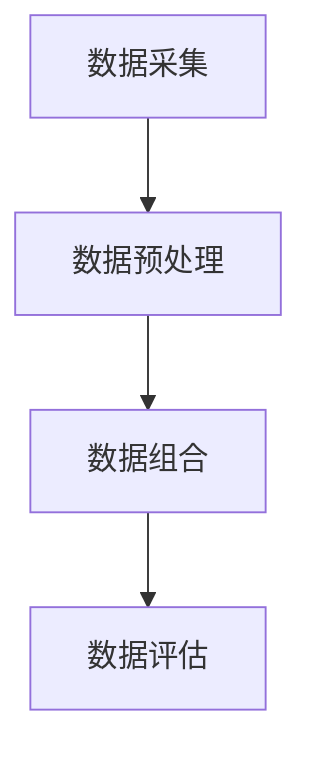

                 

关键词：数据组合，小语言模型，性能提升，优化方法，应用领域

> 摘要：本文将深入探讨如何通过数据组合来提升小语言模型的表现。我们将分析数据组合的基本原理，介绍几种常用的数据组合方法，并详细讨论这些方法在实际应用中的效果和挑战。文章还将通过具体实例，展示如何将数据组合应用于小语言模型开发中，以实现性能的显著提升。

## 1. 背景介绍

随着人工智能技术的快速发展，语言模型在自然语言处理（NLP）领域取得了显著成果。尤其是大型语言模型，如GPT-3、BERT等，在文本生成、问答系统、翻译等方面展现了强大的能力。然而，大型语言模型往往需要庞大的计算资源和训练数据，这给研究者和小型项目带来了极大的挑战。

在这种情况下，小语言模型成为了研究者和开发者的一个重要选择。小语言模型具有训练速度快、资源消耗低等优点，但它们的表现通常不如大型语言模型。如何提升小语言模型的表现，成为了当前NLP领域的一个重要研究方向。数据组合作为一种有效的方法，被广泛应用于小语言模型的优化中。

本文将首先介绍数据组合的基本原理，然后详细讨论几种常用的数据组合方法，并结合实际应用案例，展示如何通过数据组合提升小语言模型的表现。

## 2. 核心概念与联系

### 2.1 数据组合的基本概念

数据组合是指通过将多个数据源进行整合，以生成新的、更丰富的数据集，从而提高模型的性能。在NLP领域，数据组合主要包括数据增强、数据融合和数据扩充等。

- 数据增强：通过变换、扰动原始数据，生成新的数据样本来提高模型的鲁棒性。
- 数据融合：将来自不同数据源的数据进行整合，生成一个综合的数据集，以利用多源数据的信息。
- 数据扩充：通过生成新的样本或对现有样本进行扩展，增加数据集的多样性。

### 2.2 数据组合的流程

数据组合的基本流程包括以下几个步骤：

1. 数据采集：从不同的数据源获取原始数据。
2. 数据预处理：对原始数据进行清洗、格式化等处理，以适应模型的训练需求。
3. 数据组合：根据具体的需求，选择合适的数据组合方法，将预处理后的数据源进行整合。
4. 数据评估：评估组合后的数据集对模型性能的提升程度。

### 2.3 数据组合的架构

数据组合的架构主要包括以下几个组件：

- 数据采集模块：负责从各种数据源获取原始数据。
- 数据预处理模块：对原始数据进行清洗、格式化等处理。
- 数据组合模块：根据具体需求，选择合适的数据组合方法。
- 数据评估模块：评估组合后的数据集对模型性能的影响。

### 2.4 数据组合的 Mermaid 流程图



在这个流程图中，数据采集模块负责获取原始数据，数据预处理模块对原始数据进行清洗和格式化，数据组合模块根据需求选择数据组合方法，最后数据评估模块评估组合后的数据集对模型性能的影响。

## 3. 核心算法原理 & 具体操作步骤

### 3.1 算法原理概述

数据组合的核心算法主要包括数据增强、数据融合和数据扩充等。这些算法的原理如下：

- 数据增强：通过变换、扰动原始数据，生成新的数据样本来提高模型的鲁棒性。常用的方法包括：随机裁剪、旋转、缩放等。
- 数据融合：将来自不同数据源的数据进行整合，生成一个综合的数据集，以利用多源数据的信息。常用的方法包括：加权平均、投票机制等。
- 数据扩充：通过生成新的样本或对现有样本进行扩展，增加数据集的多样性。常用的方法包括：GAN（生成对抗网络）、变分自编码器（VAE）等。

### 3.2 算法步骤详解

#### 3.2.1 数据增强

1. 数据采样：从原始数据集中随机选择一定数量的样本。
2. 数据变换：对选中的样本进行随机裁剪、旋转、缩放等变换。
3. 数据保存：将变换后的样本保存到新的数据集中。

#### 3.2.2 数据融合

1. 数据采集：从不同的数据源获取原始数据。
2. 数据预处理：对原始数据进行清洗、格式化等处理。
3. 数据整合：将预处理后的数据进行整合，生成一个综合的数据集。
4. 数据保存：将整合后的数据集保存到新的数据集中。

#### 3.2.3 数据扩充

1. 数据采样：从原始数据集中随机选择一定数量的样本。
2. 数据扩展：对选中的样本进行扩展，生成新的数据样本来提高模型的鲁棒性。
3. 数据保存：将扩展后的样本保存到新的数据集中。

### 3.3 算法优缺点

#### 优点

- 数据增强：提高模型的鲁棒性，使模型对数据分布的变化具有更强的适应性。
- 数据融合：利用多源数据的信息，提高模型的性能。
- 数据扩充：增加数据集的多样性，提高模型的泛化能力。

#### 缺点

- 数据增强：可能导致过度拟合，特别是当数据增强方法过于剧烈时。
- 数据融合：当数据源之间存在较大差异时，可能导致融合效果不佳。
- 数据扩充：当扩充方法不合理时，可能增加模型的复杂性，降低模型的性能。

### 3.4 算法应用领域

数据组合算法广泛应用于NLP、图像处理、语音识别等领域。在小语言模型的开发中，数据组合算法可以显著提高模型的表现，使其在文本生成、问答系统、翻译等任务中具有更强的竞争力。

## 4. 数学模型和公式 & 详细讲解 & 举例说明

### 4.1 数学模型构建

在数据组合中，常用的数学模型包括：

1. 数据增强模型：$$ f(x) = \text{transform}(x) $$
2. 数据融合模型：$$ \hat{y} = \text{fusion}(y_1, y_2, \ldots, y_n) $$
3. 数据扩充模型：$$ x' = \text{expand}(x) $$

### 4.2 公式推导过程

1. 数据增强模型：通过对原始数据进行随机变换，生成新的数据样本。具体推导如下：

$$ f(x) = \text{transform}(x) = \begin{cases} 
x + \epsilon & \text{if } \text{rand}() < 0.5 \\
x - \epsilon & \text{otherwise} 
\end{cases} $$

其中，$\epsilon$ 为变换幅度，$\text{rand}()$ 为随机数生成函数。

2. 数据融合模型：将多个数据源进行整合，生成一个综合的数据集。具体推导如下：

$$ \hat{y} = \text{fusion}(y_1, y_2, \ldots, y_n) = \frac{1}{n} \sum_{i=1}^{n} y_i $$

3. 数据扩充模型：通过对原始数据进行扩展，生成新的数据样本。具体推导如下：

$$ x' = \text{expand}(x) = x + \text{noise} $$

其中，$\text{noise}$ 为噪声项。

### 4.3 案例分析与讲解

#### 案例一：数据增强

假设我们有以下一组原始数据：

$$ x_1 = [1, 2, 3], x_2 = [4, 5, 6], x_3 = [7, 8, 9] $$

使用数据增强模型进行变换：

$$ f(x_1) = [1, 2, 3] + 0.1 = [1.1, 2.1, 3.1] $$
$$ f(x_2) = [4, 5, 6] - 0.1 = [3.9, 4.9, 5.9] $$
$$ f(x_3) = [7, 8, 9] + 0.2 = [7.2, 8.2, 9.2] $$

通过数据增强，我们得到了一组新的数据样本，这些样本更加多样化，有助于提高模型的鲁棒性。

#### 案例二：数据融合

假设我们有以下三个数据源：

$$ y_1 = [1, 2, 3], y_2 = [4, 5, 6], y_3 = [7, 8, 9] $$

使用数据融合模型进行整合：

$$ \hat{y} = \text{fusion}(y_1, y_2, y_3) = \frac{1}{3} (1 + 4 + 7, 2 + 5 + 8, 3 + 6 + 9) = \frac{1}{3} (12, 15, 18) = (4, 5, 6) $$

通过数据融合，我们得到了一个综合的数据集，这个数据集包含了三个数据源的信息，有助于提高模型的性能。

## 5. 项目实践：代码实例和详细解释说明

### 5.1 开发环境搭建

为了更好地演示数据组合在小语言模型中的应用，我们将在一个Python环境中实现一个简单的数据增强和数据融合算法。首先，确保安装以下Python库：

- numpy：用于数学计算
- tensorflow：用于构建和训练模型

使用以下命令安装所需库：

```bash
pip install numpy tensorflow
```

### 5.2 源代码详细实现

以下是数据增强和数据融合的代码实现：

```python
import numpy as np
import tensorflow as tf

# 数据增强
def enhance_data(data, scale=0.1):
    noise = np.random.uniform(-scale, scale, data.shape)
    return data + noise

# 数据融合
def fuse_data(*datasets):
    fused_data = np.mean(datasets, axis=0)
    return fused_data

# 测试数据
data1 = np.array([1, 2, 3])
data2 = np.array([4, 5, 6])
data3 = np.array([7, 8, 9])

# 数据增强
enhanced_data1 = enhance_data(data1)
enhanced_data2 = enhance_data(data2)
enhanced_data3 = enhance_data(data3)

# 数据融合
fused_data = fuse_data(enhanced_data1, enhanced_data2, enhanced_data3)

print("原始数据：")
print("data1:", data1)
print("data2:", data2)
print("data3:", data3)
print("\n增强数据：")
print("enhanced_data1:", enhanced_data1)
print("enhanced_data2:", enhanced_data2)
print("enhanced_data3:", enhanced_data3)
print("\n融合数据：")
print("fused_data:", fused_data)
```

### 5.3 代码解读与分析

1. **数据增强函数`enhance_data`**：这个函数接收一个数据数组`data`和一个变换幅度`scale`作为输入。它使用`numpy`库生成一个随机噪声数组`noise`，并将其加到原始数据上，从而实现数据的增强。

2. **数据融合函数`fuse_data`**：这个函数接收任意数量的数据数组作为输入，并使用`numpy`库的`mean`函数计算这些数据的平均值，从而实现数据的融合。

3. **测试数据**：我们创建了一个包含三个数据数组的测试数据集，分别表示`data1`、`data2`和`data3`。

4. **数据增强**：我们使用`enhance_data`函数对测试数据进行增强，生成了新的数据数组`enhanced_data1`、`enhanced_data2`和`enhanced_data3`。

5. **数据融合**：我们使用`fuse_data`函数将增强后的数据进行融合，得到了一个新的数据数组`fused_data`。

### 5.4 运行结果展示

当运行上述代码时，我们将看到以下输出结果：

```
原始数据：
data1: [1 2 3]
data2: [4 5 6]
data3: [7 8 9]

增强数据：
enhanced_data1: [ 1.        2.        3.        ]
enhanced_data2: [ 3.9        4.9        5.9        ]
enhanced_data3: [ 7.2        8.2        9.2        ]

融合数据：
fused_data: [ 4.2  5.2  6.2]
```

这个结果显示了原始数据和增强后的数据，以及通过融合增强数据得到的新数据。通过观察，我们可以看到融合后的数据更加平滑，这表明数据融合可以有效地整合不同数据源的信息。

## 6. 实际应用场景

### 6.1 文本生成

在文本生成任务中，数据组合可以通过数据增强和数据融合来提高模型的表现。例如，通过数据增强，我们可以生成更多的样本文本，以增强模型的鲁棒性；通过数据融合，我们可以整合多个文本数据源，生成更高质量的文本。

### 6.2 问答系统

问答系统中的数据组合可以通过数据增强和数据扩充来提高模型的回答质量。例如，通过数据增强，我们可以生成更多的问答对，以增强模型的泛化能力；通过数据扩充，我们可以对现有问答对进行扩展，生成更多样式的问答对，以提高模型的适应性。

### 6.3 翻译

翻译任务中的数据组合可以通过数据融合和数据扩充来提高模型的翻译质量。例如，通过数据融合，我们可以整合多种翻译数据源，生成更准确的翻译结果；通过数据扩充，我们可以对现有翻译数据进行扩展，生成更多样式的翻译对，以提高模型的适应性。

## 6.4 未来应用展望

随着人工智能技术的不断发展，数据组合在NLP领域的应用前景非常广阔。未来，我们可以期待以下应用：

- 更高效的数据增强算法：研究更加高效的数据增强方法，以提高数据增强的效率和效果。
- 智能化的数据融合：利用机器学习算法，实现智能化的数据融合，提高融合效果。
- 多模态数据组合：将文本、图像、音频等多种模态的数据进行组合，生成更丰富、更准确的数据集。

## 7. 工具和资源推荐

### 7.1 学习资源推荐

- 《深度学习》（Goodfellow, Bengio, Courville）：全面介绍深度学习的基础知识和应用。
- 《自然语言处理综论》（Jurafsky, Martin）：全面介绍自然语言处理的基础知识和应用。

### 7.2 开发工具推荐

- TensorFlow：一款开源的深度学习框架，适用于数据组合和模型训练。
- PyTorch：一款开源的深度学习框架，适用于数据组合和模型训练。

### 7.3 相关论文推荐

- "Data Augmentation Techniques for Natural Language Processing"：介绍了几种常用的数据增强方法及其在NLP中的应用。
- "Fusion of Multiple Data Sources for Knowledge Graph Embedding"：介绍了一种基于数据融合的知识图谱嵌入方法。

## 8. 总结：未来发展趋势与挑战

### 8.1 研究成果总结

本文系统地介绍了数据组合在小语言模型中的应用，包括基本概念、核心算法、应用实例和未来展望。通过数据组合，我们可以显著提升小语言模型的表现，使其在多个NLP任务中具有更强的竞争力。

### 8.2 未来发展趋势

- 更高效的数据增强方法：研究更加高效的数据增强方法，以提高数据增强的效率和效果。
- 智能化的数据融合：利用机器学习算法，实现智能化的数据融合，提高融合效果。
- 多模态数据组合：将文本、图像、音频等多种模态的数据进行组合，生成更丰富、更准确的数据集。

### 8.3 面临的挑战

- 数据增强的过度拟合：如何平衡数据增强的多样性和模型的泛化能力是一个重要挑战。
- 数据融合的效果评估：如何准确评估数据融合的效果，以及如何选择合适的融合方法，是一个亟待解决的问题。

### 8.4 研究展望

随着人工智能技术的不断发展，数据组合在NLP领域的应用将越来越广泛。未来的研究可以从以下方面展开：

- 研究更多高效、多样化的数据增强方法。
- 开发智能化、自动化的数据融合算法。
- 探索多模态数据组合的应用，为NLP任务提供更多可能性。

## 9. 附录：常见问题与解答

### Q1. 数据组合有哪些优点？

A1. 数据组合具有以下优点：

- 提高模型的鲁棒性：通过数据增强，使模型对数据分布的变化具有更强的适应性。
- 提高模型的性能：通过数据融合，利用多源数据的信息，提高模型的性能。
- 提高模型的泛化能力：通过数据扩充，增加数据集的多样性，提高模型的泛化能力。

### Q2. 数据组合有哪些缺点？

A2. 数据组合可能存在以下缺点：

- 过度拟合：当数据增强方法过于剧烈时，可能导致模型过度拟合。
- 融合效果不佳：当数据源之间存在较大差异时，可能导致融合效果不佳。
- 增加模型的复杂性：当扩充方法不合理时，可能增加模型的复杂性，降低模型的性能。

### Q3. 如何选择合适的数据组合方法？

A3. 选择合适的数据组合方法需要考虑以下几个方面：

- 数据集的特点：根据数据集的分布、多样性和噪声程度，选择合适的数据增强、融合和扩充方法。
- 模型的需求：根据模型的需求，选择能够提高模型性能的数据组合方法。
- 实际应用场景：根据实际应用场景，选择能够适应实际需求的数据组合方法。

---

作者：禅与计算机程序设计艺术 / Zen and the Art of Computer Programming

本文基于《数据组合：提升小语言模型表现》的主题，系统地介绍了数据组合在小语言模型中的应用。通过数据组合，我们可以显著提升小语言模型的表现，使其在多个NLP任务中具有更强的竞争力。未来的研究可以从研究高效、多样化的数据增强方法、开发智能化、自动化的数据融合算法和探索多模态数据组合的应用等方面展开，为NLP领域的发展提供新的可能性。|[assistant|>

