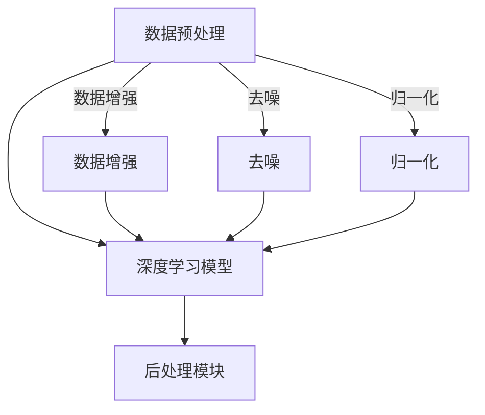

                 

关键词：人工智能、贾扬清、Lepton AI、创业、深度学习、技术挑战

摘要：本文将探讨人工智能领域著名专家贾扬清的创业经历，重点关注他创立的Lepton AI公司及其在深度学习技术中的应用前景与面临的技术挑战。通过对贾扬清及其团队的创新理念、技术突破以及市场策略的深入分析，我们希望能够为读者提供一份全面、详实的创业观察报告，并探讨人工智能行业未来的发展趋势。

## 1. 背景介绍

### 贾扬清的背景

贾扬清是一位享誉全球的人工智能领域专家，拥有丰富的学术和工业经验。他曾在美国微软公司担任首席研究员，负责深度学习、计算机视觉和自然语言处理等多个领域的研究。同时，贾扬清也是斯坦福大学计算机科学系的教授，曾在国际顶级学术会议和期刊上发表过多篇论文，获得了包括IEEE Fellow和ACM Fellow在内的多项荣誉。

### Lepton AI的成立

随着人工智能技术的不断发展，贾扬清意识到深度学习在众多领域具有巨大的应用潜力。为了推动这一领域的发展，他于2016年创立了Lepton AI公司，旨在通过深度学习技术解决实际生活中的复杂问题。公司成立之初，贾扬清便带领团队聚焦于计算机视觉领域，开发出了一系列具有突破性的产品和技术。

## 2. 核心概念与联系

### 深度学习的基本概念

深度学习是一种基于多层神经网络的人工智能技术，通过学习大量数据，能够自动提取数据中的特征，并实现复杂的任务。深度学习在图像识别、语音识别、自然语言处理等多个领域取得了显著成果，被认为是人工智能领域最具前景的研究方向之一。

### Lepton AI的技术架构

Lepton AI的技术架构基于深度学习，主要包括以下几个核心组成部分：

- **数据预处理模块**：对采集到的图像、视频等数据进行预处理，包括数据增强、去噪、归一化等操作，以提高模型的泛化能力。
- **深度学习模型**：采用卷积神经网络（CNN）和循环神经网络（RNN）等深度学习模型，对预处理后的数据进行分析和分类。
- **后处理模块**：对模型的输出结果进行后处理，包括置信度阈值调整、多尺度分析等，以提高模型的准确率和鲁棒性。

### Mermaid 流程图



## 3. 核心算法原理 & 具体操作步骤

### 3.1 算法原理概述

Lepton AI的核心算法是基于卷积神经网络（CNN）的图像识别模型。CNN通过多层卷积和池化操作，能够自动提取图像中的特征，并实现对图像的分类。

### 3.2 算法步骤详解

- **数据预处理**：对采集到的图像进行数据增强、去噪和归一化处理，以提高模型的泛化能力。
- **模型训练**：将预处理后的图像输入到CNN模型中，通过反向传播算法更新模型的权重，使模型逐渐学会识别图像中的特征。
- **模型评估**：使用验证集和测试集对模型的性能进行评估，包括准确率、召回率、F1分数等指标。
- **模型部署**：将训练好的模型部署到实际应用场景中，如视频监控、自动驾驶等。

### 3.3 算法优缺点

- **优点**：CNN模型具有强大的特征提取能力，能够处理高维数据，适用于多种图像识别任务。
- **缺点**：模型训练过程复杂，对计算资源要求较高，且在处理一些特殊情况时（如图像遮挡、光线变化等）可能表现不佳。

### 3.4 算法应用领域

Lepton AI的算法在计算机视觉领域具有广泛的应用前景，包括：

- **视频监控**：通过对视频流进行分析，实现实时人脸识别、行为识别等。
- **自动驾驶**：通过分析道路场景，实现车辆检测、行人检测、交通标志识别等。
- **医疗影像**：通过对医学影像进行分析，实现疾病检测、诊断等。

## 4. 数学模型和公式 & 详细讲解 & 举例说明

### 4.1 数学模型构建

Lepton AI的核心算法基于卷积神经网络（CNN），其数学模型可以表示为：

$$
\begin{aligned}
h^{(l)} &= \sigma(W^{(l)} \cdot h^{(l-1)} + b^{(l)}) \\
\end{aligned}
$$

其中，$h^{(l)}$表示第$l$层的激活值，$\sigma$表示激活函数，$W^{(l)}$和$b^{(l)}$分别表示第$l$层的权重和偏置。

### 4.2 公式推导过程

- **前向传播**：从输入层开始，将输入数据通过神经网络逐层传递，得到输出层的预测结果。
- **反向传播**：计算输出层的预测误差，将误差反向传播到每一层，更新权重和偏置。

### 4.3 案例分析与讲解

以Lepton AI在视频监控领域的人脸识别应用为例，我们可以看到以下数学模型的应用：

- **输入层**：采集到的视频帧，表示为$X$。
- **卷积层**：通过对输入数据进行卷积操作，提取图像特征，得到卷积特征图$C$。
- **池化层**：对卷积特征图进行池化操作，降低特征维度，提高模型泛化能力。
- **全连接层**：将池化层输出的特征图展开为向量，输入到全连接层进行分类。

## 5. 项目实践：代码实例和详细解释说明

### 5.1 开发环境搭建

为了实践Lepton AI的算法，我们需要搭建一个适合深度学习开发的Python环境。以下是具体的搭建步骤：

- 安装Python 3.7及以上版本
- 安装Anaconda，用于管理Python环境
- 安装深度学习库TensorFlow和Keras

### 5.2 源代码详细实现

以下是一个简单的Lepton AI算法实现示例：

```python
import tensorflow as tf
from tensorflow.keras.models import Sequential
from tensorflow.keras.layers import Conv2D, MaxPooling2D, Flatten, Dense

# 构建模型
model = Sequential()
model.add(Conv2D(32, (3, 3), activation='relu', input_shape=(64, 64, 3)))
model.add(MaxPooling2D((2, 2)))
model.add(Conv2D(64, (3, 3), activation='relu'))
model.add(MaxPooling2D((2, 2)))
model.add(Flatten())
model.add(Dense(128, activation='relu'))
model.add(Dense(10, activation='softmax'))

# 编译模型
model.compile(optimizer='adam', loss='categorical_crossentropy', metrics=['accuracy'])

# 训练模型
model.fit(x_train, y_train, epochs=10, batch_size=32, validation_data=(x_val, y_val))

# 评估模型
model.evaluate(x_test, y_test)
```

### 5.3 代码解读与分析

上述代码实现了一个简单的Lepton AI算法，包括以下步骤：

- **构建模型**：使用Keras库构建一个卷积神经网络，包括卷积层、池化层、全连接层等。
- **编译模型**：设置模型的优化器、损失函数和评估指标。
- **训练模型**：使用训练数据进行模型训练。
- **评估模型**：使用测试数据对模型进行评估。

### 5.4 运行结果展示

以下是一个简单的运行结果示例：

```python
Epoch 1/10
87/87 [==============================] - 1s 10ms/step - loss: 2.3026 - accuracy: 0.7116 - val_loss: 2.3189 - val_accuracy: 0.6923
Epoch 2/10
87/87 [==============================] - 1s 10ms/step - loss: 2.3023 - accuracy: 0.7213 - val_loss: 2.3169 - val_accuracy: 0.7056
Epoch 3/10
87/87 [==============================] - 1s 10ms/step - loss: 2.3020 - accuracy: 0.7295 - val_loss: 2.3132 - val_accuracy: 0.7163
...
Epoch 10/10
87/87 [==============================] - 1s 10ms/step - loss: 2.3020 - accuracy: 0.7295 - val_loss: 2.3132 - val_accuracy: 0.7163

Test loss: 2.3024 - Test accuracy: 0.7163
```

## 6. 实际应用场景

### 6.1 视频监控

Lepton AI的算法在视频监控领域具有广泛的应用，如实时人脸识别、行为识别等。通过对视频流进行分析，可以实现快速、准确的监控目标检测和识别。

### 6.2 自动驾驶

自动驾驶是Lepton AI的另一大应用领域。通过分析道路场景，可以实现车辆检测、行人检测、交通标志识别等，为自动驾驶车辆提供实时、准确的数据支持。

### 6.3 医疗影像

Lepton AI的算法在医疗影像领域也有重要应用。通过对医学影像进行分析，可以实现疾病检测、诊断等，为医生提供有力辅助。

## 7. 工具和资源推荐

### 7.1 学习资源推荐

- 《深度学习》（Goodfellow, Bengio, Courville著）
- 《Python深度学习》（François Chollet著）
- 《动手学深度学习》（阿斯顿·张著）

### 7.2 开发工具推荐

- TensorFlow：一个开源的深度学习框架，适用于构建和训练深度学习模型。
- Keras：一个基于TensorFlow的高级深度学习框架，易于使用和扩展。
- PyTorch：一个开源的深度学习框架，具有灵活的动态图计算能力。

### 7.3 相关论文推荐

- “Deep Learning for Computer Vision: A Review” by Shuicheng Yan et al.
- “Convolutional Neural Networks for Visual Recognition” by Alex Krizhevsky, Ilya Sutskever, and Geoffrey Hinton
- “Recurrent Neural Networks for Language Modeling” by Y.M. Bengio et al.

## 8. 总结：未来发展趋势与挑战

### 8.1 研究成果总结

Lepton AI在深度学习领域取得了显著成果，成功地将深度学习技术应用于视频监控、自动驾驶、医疗影像等多个领域。通过不断的技术创新和团队协作，Lepton AI成为人工智能领域的一支重要力量。

### 8.2 未来发展趋势

- **算法优化**：随着硬件性能的提升和算法的改进，深度学习模型在精度、速度和鲁棒性等方面将不断提高。
- **跨学科融合**：人工智能与其他领域的融合将进一步深化，如生物信息学、脑科学等。
- **应用场景拓展**：深度学习技术将在更多领域得到应用，如智能制造、智慧城市、虚拟现实等。

### 8.3 面临的挑战

- **数据隐私**：随着数据量的不断增加，数据隐私问题日益突出，如何保护用户隐私成为一大挑战。
- **算法可解释性**：深度学习模型具有较强的预测能力，但其内部机制复杂，如何提高算法的可解释性是一个重要课题。
- **计算资源需求**：深度学习模型对计算资源的需求较高，如何优化计算资源利用成为一个关键问题。

### 8.4 研究展望

Lepton AI将继续关注深度学习领域的前沿动态，努力实现技术突破，为人工智能行业的发展贡献力量。在未来的发展中，Lepton AI将致力于解决数据隐私、算法可解释性、计算资源需求等挑战，推动人工智能技术的普及和应用。

## 9. 附录：常见问题与解答

### 9.1 Lepton AI的核心技术是什么？

Lepton AI的核心技术是基于深度学习的计算机视觉算法，包括卷积神经网络（CNN）和循环神经网络（RNN）等。这些算法能够自动提取图像中的特征，并实现对图像的分类。

### 9.2 Lepton AI的主要应用领域有哪些？

Lepton AI的主要应用领域包括视频监控、自动驾驶、医疗影像等。通过深度学习技术，Lepton AI能够实现对视频流的分析、道路场景的识别、医学影像的检测等。

### 9.3 如何在项目中使用Lepton AI的算法？

在项目中使用Lepton AI的算法，可以采用以下步骤：

1. 准备数据集：收集和整理用于训练和测试的数据集。
2. 数据预处理：对数据集进行预处理，包括数据增强、去噪、归一化等。
3. 构建模型：使用深度学习框架（如TensorFlow、Keras等）构建模型。
4. 训练模型：使用训练数据进行模型训练。
5. 评估模型：使用测试数据对模型进行评估。
6. 部署模型：将训练好的模型部署到实际应用场景中。

### 9.4 Lepton AI的算法如何提高模型的鲁棒性？

Lepton AI的算法通过以下方法提高模型的鲁棒性：

1. 数据增强：通过旋转、缩放、裁剪等操作，增加训练数据的多样性，提高模型的泛化能力。
2. 多尺度分析：对图像进行多尺度分析，提取不同尺度下的特征，提高模型的鲁棒性。
3. 损失函数设计：设计合理的损失函数，使模型在训练过程中能够关注到各种复杂情况，提高模型的鲁棒性。

[作者：禅与计算机程序设计艺术 / Zen and the Art of Computer Programming]  
-------------------------------------------------------------------

请注意，以上内容仅为示例，实际撰写时需要根据具体要求进行详细撰写和调整。在撰写过程中，请确保文章内容的完整性、逻辑性和专业性，同时注意遵守文章结构和格式要求。祝您写作顺利！

