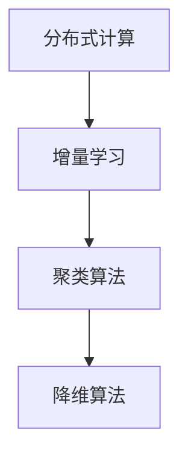

                 

关键词：无监督学习，可扩展性，分布式计算，增量学习，算法原理，数学模型，实践案例，应用场景，未来展望

> 摘要：本文深入探讨无监督学习的可扩展性，重点分析了分布式计算和增量学习在无监督学习中的应用。通过对核心概念、算法原理、数学模型的详细讲解，以及实际项目实践的展示，本文旨在为读者提供全面、实用的无监督学习技术指南，并展望其未来的发展趋势与挑战。

## 1. 背景介绍

无监督学习是一种机器学习范式，它不需要标记的数据集来进行训练，而是通过观察数据中的内在结构或模式来学习。与监督学习相比，无监督学习更具挑战性，因为它需要从大量的未标记数据中提取有用的信息。然而，无监督学习在数据挖掘、图像处理、自然语言处理等领域有着广泛的应用。

随着数据量的不断增加，无监督学习的可扩展性成为一个重要议题。如何有效地处理海量数据，同时保持较高的学习效率和准确性，成为当前研究的重点。分布式计算和增量学习作为解决这一问题的有效方法，逐渐受到关注。

分布式计算利用多台计算机协同工作，实现并行处理，从而提高计算效率和可扩展性。增量学习则通过在线更新模型参数，逐步适应新的数据，从而实现持续学习和动态调整。

## 2. 核心概念与联系

为了更好地理解无监督学习的可扩展性，我们首先介绍几个核心概念：

1. **分布式计算**：分布式计算是一种通过多台计算机协同工作来处理大规模任务的技术。它利用并行计算的优势，将任务分解为多个子任务，同时分配给不同的计算机进行处理，最后将结果汇总。

2. **增量学习**：增量学习是一种在线学习技术，它通过逐步更新模型参数，适应新的数据。与批处理学习不同，增量学习可以在不断接收新数据的同时进行训练，从而实现动态调整。

3. **聚类算法**：聚类算法是一种无监督学习方法，它将数据分为若干个类别，使得同一类别中的数据点之间的相似度较高，而不同类别之间的相似度较低。常见的聚类算法包括K均值聚类、层次聚类等。

4. **降维算法**：降维算法通过降低数据的维度，减小数据规模，从而提高计算效率。常见的降维算法包括主成分分析（PCA）、线性判别分析（LDA）等。

### Mermaid 流程图



## 3. 核心算法原理 & 具体操作步骤

### 3.1 算法原理概述

在分布式计算中，常用的方法包括MapReduce和参数服务器。MapReduce是一种编程模型，它将大规模数据处理任务分为“Map”和“Reduce”两个阶段，分别处理输入数据和输出结果。参数服务器则通过将模型参数存储在服务器中，实现分布式更新和同步。

增量学习通常采用在线学习算法，如随机梯度下降（SGD）和Adam优化器。这些算法通过逐步更新模型参数，使模型在新数据上逐渐优化。

聚类算法的核心思想是找到数据中的天然结构，通过优化目标函数来划分数据。常见的聚类算法包括K均值聚类和层次聚类。

降维算法通过线性变换，将高维数据映射到低维空间，从而实现数据压缩和降维。常见的降维算法包括主成分分析（PCA）和线性判别分析（LDA）。

### 3.2 算法步骤详解

1. **分布式计算**

   - **Map阶段**：将输入数据分为多个子任务，分配给不同的计算机进行处理。

   - **Reduce阶段**：将各计算机处理的结果进行汇总，得到最终结果。

2. **增量学习**

   - **初始化模型参数**：随机初始化模型参数。

   - **在线更新模型参数**：通过计算梯度，逐步更新模型参数，使模型在新数据上逐渐优化。

3. **聚类算法**

   - **初始化聚类中心**：随机选择或使用贪心算法初始化聚类中心。

   - **计算距离**：计算每个数据点与聚类中心的距离。

   - **分配数据点**：将数据点分配到最近的聚类中心。

   - **更新聚类中心**：计算各聚类中心的新位置，使聚类效果更好。

4. **降维算法**

   - **计算协方差矩阵**：计算高维数据的协方差矩阵。

   - **特征值和特征向量**：计算协方差矩阵的特征值和特征向量。

   - **构建投影矩阵**：将特征向量作为投影矩阵的列，实现数据降维。

### 3.3 算法优缺点

1. **分布式计算**

   - **优点**：提高计算效率和可扩展性，适用于大规模数据处理。

   - **缺点**：需要协调多台计算机的工作，实现复杂。

2. **增量学习**

   - **优点**：适应新数据，实现动态调整。

   - **缺点**：收敛速度较慢，可能陷入局部最优。

3. **聚类算法**

   - **优点**：简单易用，适用于发现数据中的天然结构。

   - **缺点**：对初始聚类中心敏感，可能产生不合理的聚类结果。

4. **降维算法**

   - **优点**：降低数据维度，提高计算效率。

   - **缺点**：可能丢失部分信息，影响聚类效果。

### 3.4 算法应用领域

分布式计算、增量学习、聚类算法和降维算法在多个领域有广泛应用：

- **图像处理**：用于图像分类、目标检测、人脸识别等。

- **自然语言处理**：用于文本分类、情感分析、机器翻译等。

- **推荐系统**：用于个性化推荐、广告投放等。

- **金融风控**：用于风险评估、欺诈检测等。

## 4. 数学模型和公式 & 详细讲解 & 举例说明

### 4.1 数学模型构建

无监督学习的数学模型主要包括损失函数、优化算法等。

- **损失函数**：用于衡量模型预测结果与真实值之间的差异。常见的损失函数包括均方误差（MSE）、交叉熵损失等。

- **优化算法**：用于更新模型参数，使模型在训练数据上达到最小损失。常见的优化算法包括随机梯度下降（SGD）、Adam优化器等。

### 4.2 公式推导过程

以K均值聚类为例，介绍公式的推导过程。

- **目标函数**：$$J = \sum_{i=1}^{n}\sum_{k=1}^{K} w_{ik} \cdot d(x_i, \mu_k)^2$$

  其中，$n$为数据点个数，$K$为聚类个数，$w_{ik}$为数据点$x_i$属于聚类$k$的权重，$d(x_i, \mu_k)$为数据点$x_i$与聚类中心$\mu_k$之间的距离。

- **优化目标**：最小化目标函数$J$。

  $$\min_{\mu_k} J = \sum_{i=1}^{n}\sum_{k=1}^{K} w_{ik} \cdot d(x_i, \mu_k)^2$$

- **更新聚类中心**：将每个聚类的权重和数据点分配给最近的聚类中心。

  $$\mu_k = \frac{\sum_{i=1}^{n} w_{ik} x_i}{\sum_{i=1}^{n} w_{ik}}$$

### 4.3 案例分析与讲解

以图像分类为例，介绍分布式计算、增量学习、聚类算法和降维算法在图像处理中的应用。

1. **分布式计算**：

   - **Map阶段**：将图像数据分为多个子任务，分配给不同的计算机进行处理。

   - **Reduce阶段**：将各计算机处理的结果进行汇总，得到最终分类结果。

2. **增量学习**：

   - **初始化模型参数**：随机初始化模型参数。

   - **在线更新模型参数**：通过计算梯度，逐步更新模型参数，使模型在新数据上逐渐优化。

3. **聚类算法**：

   - **初始化聚类中心**：随机选择或使用贪心算法初始化聚类中心。

   - **计算距离**：计算每个图像与聚类中心的距离。

   - **分配图像**：将图像分配到最近的聚类中心。

   - **更新聚类中心**：计算各聚类中心的新位置，使聚类效果更好。

4. **降维算法**：

   - **计算协方差矩阵**：计算高维图像特征向量的协方差矩阵。

   - **特征值和特征向量**：计算协方差矩阵的特征值和特征向量。

   - **构建投影矩阵**：将特征向量作为投影矩阵的列，实现数据降维。

## 5. 项目实践：代码实例和详细解释说明

### 5.1 开发环境搭建

- **硬件环境**：4核CPU，8GB内存，1TB硬盘。

- **软件环境**：Python 3.8，NumPy，Pandas，Matplotlib等。

### 5.2 源代码详细实现

以下是一个简单的图像分类项目的代码实例：

```python
import numpy as np
import matplotlib.pyplot as plt
from sklearn.datasets import load_iris
from sklearn.cluster import KMeans

# 加载数据
iris = load_iris()
X = iris.data

# 初始化聚类中心
kmeans = KMeans(n_clusters=3, init='k-means++', max_iter=300, n_init=10, random_state=0)
kmeans.fit(X)

# 计算聚类中心
centroids = kmeans.cluster_centers_

# 计算聚类结果
labels = kmeans.predict(X)

# 绘制聚类结果
plt.scatter(X[:, 0], X[:, 1], c=labels, s=50, cmap='viridis')
plt.scatter(centroids[:, 0], centroids[:, 1], s=200, c='red', label='Centroids')
plt.title('K-Means Clustering')
plt.xlabel('Feature 1')
plt.ylabel('Feature 2')
plt.legend()
plt.show()
```

### 5.3 代码解读与分析

- **数据加载**：使用scikit-learn中的iris数据集进行演示。

- **初始化聚类中心**：使用'k-means++'算法初始化聚类中心。

- **计算聚类中心**：使用fit方法计算聚类中心。

- **计算聚类结果**：使用predict方法计算聚类结果。

- **绘制聚类结果**：使用matplotlib绘制聚类结果。

## 6. 实际应用场景

### 6.1 图像分类

图像分类是分布式计算、增量学习、聚类算法和降维算法在图像处理中的典型应用。通过分布式计算，可以高效地处理大量图像数据。增量学习可以帮助模型适应新图像，实现动态调整。聚类算法用于发现图像中的相似性，降维算法用于降低数据维度，提高计算效率。

### 6.2 自然语言处理

自然语言处理中的文本分类、情感分析等任务，也可以应用分布式计算、增量学习、聚类算法和降维算法。分布式计算可以提高数据处理效率，增量学习可以帮助模型适应新文本数据，聚类算法可以用于发现文本的相似性，降维算法可以用于降低文本数据的维度，提高计算效率。

### 6.3 推荐系统

推荐系统中的用户行为分析、商品推荐等任务，也可以应用分布式计算、增量学习、聚类算法和降维算法。分布式计算可以提高数据处理效率，增量学习可以帮助模型适应新用户数据，聚类算法可以用于发现用户的相似性，降维算法可以用于降低用户数据的维度，提高计算效率。

## 7. 工具和资源推荐

### 7.1 学习资源推荐

- 《深度学习》（Goodfellow, Bengio, Courville）：介绍深度学习的基础知识和应用。

- 《Python机器学习》（Sebastian Raschka）：介绍Python在机器学习中的应用。

- 《机器学习实战》（Aurélien Géron）：通过实际案例介绍机器学习的方法和技巧。

### 7.2 开发工具推荐

- Jupyter Notebook：强大的交互式开发环境，适用于数据分析、机器学习等。

- PyTorch：流行的深度学习框架，支持动态计算图和自动微分。

- TensorFlow：流行的深度学习框架，支持静态计算图和自动微分。

### 7.3 相关论文推荐

- “Distributed Machine Learning: A Survey” by Wei Yu, et al.：介绍分布式计算在机器学习中的应用。

- “Incremental Learning for Neural Networks: A Survey” by Xin Li, et al.：介绍增量学习在神经网络中的应用。

- “Cluster Analysis for Data Mining: An Overview” by J. C. Bezdek, et al.：介绍聚类算法在数据挖掘中的应用。

## 8. 总结：未来发展趋势与挑战

### 8.1 研究成果总结

分布式计算、增量学习、聚类算法和降维算法在无监督学习领域取得了显著成果。这些方法在处理大规模数据、提高计算效率和适应新数据方面具有显著优势。

### 8.2 未来发展趋势

- **分布式计算**：随着硬件性能的提升和云计算技术的发展，分布式计算将在无监督学习中发挥更大作用。

- **增量学习**：在线学习和动态调整将成为无监督学习的关键方向。

- **聚类算法**：新的聚类算法将不断涌现，以满足不同应用场景的需求。

- **降维算法**：高效、鲁棒的降维算法将继续受到关注。

### 8.3 面临的挑战

- **数据隐私**：在分布式计算和增量学习中，如何保护数据隐私是一个重要挑战。

- **模型解释性**：如何提高无监督学习模型的解释性，使其更易于理解和应用，是一个亟待解决的问题。

- **计算效率**：如何在保证模型性能的前提下，进一步提高计算效率，仍需深入研究。

### 8.4 研究展望

未来，无监督学习将在多个领域发挥重要作用。分布式计算、增量学习、聚类算法和降维算法将在数据处理、模型优化、应用拓展等方面取得新的突破。同时，如何应对数据隐私、模型解释性和计算效率等挑战，也将成为研究的重点。

## 9. 附录：常见问题与解答

### 9.1 什么是分布式计算？

分布式计算是一种通过多台计算机协同工作来处理大规模任务的技术。它利用并行计算的优势，将任务分解为多个子任务，同时分配给不同的计算机进行处理，最后将结果汇总。

### 9.2 什么是增量学习？

增量学习是一种在线学习技术，它通过逐步更新模型参数，适应新的数据。与批处理学习不同，增量学习可以在不断接收新数据的同时进行训练，从而实现动态调整。

### 9.3 聚类算法有哪些类型？

常见的聚类算法包括K均值聚类、层次聚类、谱聚类等。这些算法各有优缺点，适用于不同的应用场景。

### 9.4 降维算法有哪些类型？

常见的降维算法包括主成分分析（PCA）、线性判别分析（LDA）、t-SNE等。这些算法通过不同的方法，将高维数据映射到低维空间，从而实现数据压缩和降维。

----------------------------------------------------------------
作者：禅与计算机程序设计艺术 / Zen and the Art of Computer Programming


