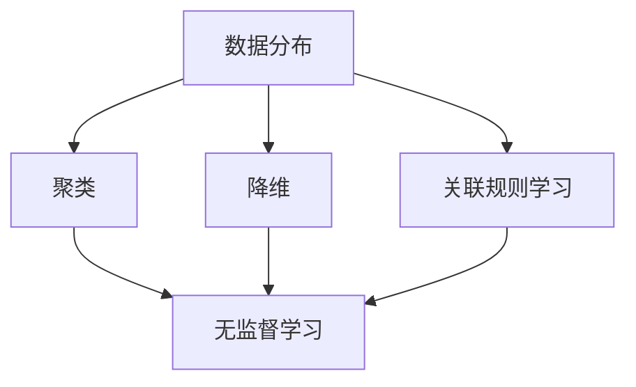

                 

关键词：无监督学习、表示学习、生成模型、算法原理、数学模型、项目实践、应用场景、未来展望

> 摘要：本文深入探讨了无监督学习的理论进展，重点关注表示学习和生成模型的发展。通过分析核心概念、算法原理、数学模型以及实际应用，我们试图揭示无监督学习在未来可能面临的新趋势和挑战。

## 1. 背景介绍

无监督学习（Unsupervised Learning）作为机器学习的一个分支，其核心目标是从未标记的数据中提取有用的信息，而不需要人工提供标签。这一领域的研究始于20世纪50年代，随着计算能力的提升和数据量的爆发式增长，无监督学习逐渐成为人工智能研究的热点。

无监督学习在多个领域具有广泛的应用，如图像识别、自然语言处理、推荐系统、生物信息学等。传统的无监督学习方法包括聚类（Clustering）、降维（Dimensionality Reduction）、关联规则学习（Association Rule Learning）等。然而，随着深度学习技术的进步，无监督学习的方法和理论也不断发展和完善。

本文将从以下几个方面展开讨论：首先，介绍无监督学习的核心概念和联系；其次，详细分析几种核心算法的原理和操作步骤；然后，探讨无监督学习的数学模型和公式；接着，通过一个项目实践实例展示无监督学习的具体应用；最后，分析无监督学习在实际应用场景中的未来发展和面临的挑战。

## 2. 核心概念与联系

### 2.1 核心概念

在无监督学习中，核心概念包括：

- **数据分布（Data Distribution）**：无监督学习的核心目标是理解数据分布，从而揭示数据中的潜在结构和规律。

- **聚类（Clustering）**：将数据点分组，使得同一组内的数据点彼此相似，不同组的数据点彼此不同。

- **降维（Dimensionality Reduction）**：将高维数据映射到低维空间，从而降低计算复杂度和噪声干扰。

- **关联规则学习（Association Rule Learning）**：发现数据集中项目的关联性，例如“购买牛奶的用户往往也会购买面包”。

### 2.2 关系与架构

以下是核心概念和架构的Mermaid流程图：



### 2.3 算法选择

无监督学习的算法选择取决于具体问题和数据特性。例如：

- **K-Means**：适用于凸形聚类，适用于高维数据。
- **DBSCAN**：适用于非凸形聚类，能够识别不同密度的簇。
- **PCA**：适用于降维，适用于线性可分的数据。
- **LDA**：适用于降维，适用于高维数据的线性可分问题。

## 3. 核心算法原理 & 具体操作步骤

### 3.1 算法原理概述

无监督学习算法可分为两大类：基于模型的算法和基于实例的算法。

- **基于模型的算法**：通过构建数据模型来描述数据分布，如聚类算法、降维算法等。
- **基于实例的算法**：直接从数据中学习，如关联规则学习。

### 3.2 算法步骤详解

#### 3.2.1 K-Means

1. 初始化：随机选择K个中心点。
2. 分配：将每个数据点分配到最近的中心点。
3. 更新：重新计算每个簇的中心点。
4. 重复步骤2和3，直到中心点不再变化或满足终止条件。

#### 3.2.2 DBSCAN

1. 初始化：选择一个数据点作为种子点，扩展为簇。
2. 扫描：对未处理的点，如果距离小于某个阈值，则将其加入当前簇。
3. 重复步骤2，直到所有点都被处理。

#### 3.2.3 PCA

1. 计算协方差矩阵。
2. 计算协方差矩阵的特征值和特征向量。
3. 根据特征值排序特征向量。
4. 选择前k个特征向量，构成投影矩阵。
5. 将数据投影到前k个特征向量上。

### 3.3 算法优缺点

#### K-Means

- 优点：简单高效，易于实现。
- 缺点：对初始值敏感，可能收敛到局部最优。

#### DBSCAN

- 优点：适用于非凸形数据。
- 缺点：计算复杂度较高。

#### PCA

- 优点：降维效果好，适用于线性可分数据。
- 缺点：可能丢失部分信息，对非线性数据效果不佳。

### 3.4 算法应用领域

- **K-Means**：应用于图像识别、文本分类等。
- **DBSCAN**：应用于社交媒体网络分析、生物信息学等。
- **PCA**：应用于图像处理、数据可视化等。

## 4. 数学模型和公式 & 详细讲解 & 举例说明

### 4.1 数学模型构建

无监督学习中的数学模型主要包括：

- **聚类模型**：如K-Means、DBSCAN等。
- **降维模型**：如PCA、LDA等。
- **关联规则模型**：如Apriori算法、FP-Growth算法等。

### 4.2 公式推导过程

#### 4.2.1 K-Means

假设数据集$X=\{x_1, x_2, ..., x_n\}$，K-Means的目标是最小化误差平方和：

$$
J = \sum_{i=1}^{n} \sum_{j=1}^{K} \sum_{k=1}^{K} |x_i - \mu_{jk}|^2
$$

其中，$\mu_{jk}$为第j个簇的第k个特征值。

#### 4.2.2 DBSCAN

DBSCAN的目标是找到满足密度的聚类，核心思想是通过邻域搜索将点划分为核心点、边界点和噪声点。

- **邻域搜索**：对于点$p$，找到其邻域内的点，距离小于阈值$ε$。
- **核心点**：邻域内至少有$minPts$个点。
- **边界点**：邻域内有核心点，但不足$minPts$个点。
- **噪声点**：邻域内没有核心点。

### 4.3 案例分析与讲解

#### 4.3.1 K-Means在图像识别中的应用

假设有一组图像数据，需要将其分为两类：动物和植物。通过K-Means算法，可以首先对图像进行降维，然后进行分类。

1. 数据预处理：将图像数据转换为灰度图像，并进行归一化处理。
2. 特征提取：使用颜色直方图作为图像的特征向量。
3. K-Means聚类：初始化K=2，使用最小误差平方和法进行聚类。
4. 分类：根据聚类结果对图像进行分类。

#### 4.3.2 DBSCAN在社交媒体网络分析中的应用

假设有一组社交媒体用户数据，需要识别其中的社群结构。通过DBSCAN算法，可以找到用户之间的社群关系。

1. 数据预处理：提取用户之间的交互数据，并进行归一化处理。
2. 邻域搜索：设置阈值$ε$和$minPts$，进行邻域搜索。
3. 社群识别：根据邻域搜索结果，将用户划分为核心点、边界点和噪声点。
4. 社群分析：分析每个社群的结构和特点。

## 5. 项目实践：代码实例和详细解释说明

### 5.1 开发环境搭建

1. 安装Python环境，版本要求3.6及以上。
2. 安装相关库，如NumPy、Scikit-learn、Matplotlib等。

### 5.2 源代码详细实现

以下是一个使用K-Means算法进行图像识别的代码实例：

```python
import numpy as np
from sklearn.cluster import KMeans
from sklearn.datasets import load_digits
import matplotlib.pyplot as plt

# 加载图像数据集
digits = load_digits()
data = digits.data

# 特征提取
features = data.reshape(-1, 64)

# K-Means聚类
kmeans = KMeans(n_clusters=2, random_state=0)
kmeans.fit(features)

# 分类结果
labels = kmeans.predict(features)

# 可视化结果
plt.scatter(features[:, 0], features[:, 1], c=labels)
plt.show()
```

### 5.3 代码解读与分析

1. **数据加载与预处理**：使用Scikit-learn中的`load_digits()`函数加载图像数据集，并进行特征提取。
2. **K-Means聚类**：初始化KMeans模型，设置聚类数量为2，使用随机种子`random_state=0`，然后使用`fit()`方法进行聚类。
3. **分类结果**：使用`predict()`方法对特征数据进行分类。
4. **可视化结果**：使用Matplotlib绘制散点图，展示分类结果。

### 5.4 运行结果展示

运行上述代码，可以生成一个二维散点图，展示图像数据在特征空间中的分布。每个点表示一个图像，颜色表示其所属的类别。通过可视化结果，可以直观地观察图像的聚类效果。

## 6. 实际应用场景

无监督学习在实际应用场景中具有广泛的应用，以下列举几个典型应用领域：

1. **图像识别**：使用无监督学习算法对图像进行降维和聚类，从而实现图像的分类和识别。
2. **自然语言处理**：无监督学习算法在词嵌入、文本聚类等方面具有重要作用。
3. **推荐系统**：无监督学习可以帮助发现数据中的潜在关联规则，从而为推荐系统提供支持。
4. **生物信息学**：无监督学习在基因序列分析、蛋白质结构预测等领域具有重要应用。
5. **金融风控**：无监督学习算法可以帮助识别异常交易，提高金融风控能力。

### 6.1 社会媒体网络分析

通过无监督学习算法，可以对社交媒体网络中的用户和内容进行聚类分析，从而发现用户群体和兴趣社区。这一应用有助于社交媒体平台优化用户体验，提升内容推荐效果。

### 6.2 个性化推荐系统

无监督学习算法可以帮助构建个性化推荐系统，通过分析用户行为数据，发现用户的潜在兴趣和偏好。这一应用有助于提升推荐系统的准确性和用户体验。

### 6.3 医疗健康

无监督学习在医疗健康领域具有广泛的应用前景，如疾病预测、基因突变检测、药物研发等。通过无监督学习算法，可以从大量的医疗数据中提取有用的信息，为医疗诊断和治疗提供支持。

## 7. 工具和资源推荐

### 7.1 学习资源推荐

1. **《机器学习》（周志华著）**：系统介绍了机器学习的基本概念、算法和技术。
2. **《深度学习》（Ian Goodfellow等著）**：深入介绍了深度学习的基本原理和应用。
3. **《模式识别与机器学习》（Christopher M. Bishop著）**：详细讲解了模式识别和机器学习的基础知识。

### 7.2 开发工具推荐

1. **Jupyter Notebook**：一款流行的交互式开发环境，适合编写和运行机器学习代码。
2. **TensorFlow**：一款开源的深度学习框架，支持多种无监督学习算法的实现。
3. **Scikit-learn**：一款常用的机器学习库，提供了丰富的无监督学习算法和工具。

### 7.3 相关论文推荐

1. **"K-Means Clustering Algorithm"**：介绍了K-Means算法的基本原理和实现方法。
2. **"DBSCAN: A Density-Based Algorithm for Discovering Clusters in Large Databases with Noisy Data"**：详细阐述了DBSCAN算法的原理和应用。
3. **"Principal Component Analysis"**：介绍了PCA算法的原理和应用。

## 8. 总结：未来发展趋势与挑战

### 8.1 研究成果总结

无监督学习在过去几十年中取得了显著的研究成果，包括聚类算法、降维算法、生成模型等。这些算法在图像识别、自然语言处理、推荐系统等领域得到了广泛应用。

### 8.2 未来发展趋势

1. **算法效率提升**：随着计算能力的提升，无监督学习算法的效率和精度将进一步提高。
2. **跨模态学习**：无监督学习将逐渐从单模态扩展到多模态，实现跨模态的信息融合。
3. **自适应学习**：无监督学习算法将更加智能化，能够根据数据特性自适应调整模型参数。

### 8.3 面临的挑战

1. **数据隐私保护**：无监督学习过程中，如何保护数据隐私是一个重要挑战。
2. **算法可解释性**：提高算法的可解释性，使其更易于理解和应用。
3. **模型安全性**：无监督学习模型可能受到对抗攻击，需要提高模型的安全性。

### 8.4 研究展望

未来，无监督学习将在跨模态学习、自适应学习和数据隐私保护等方面取得突破。同时，研究者将继续探索新的无监督学习算法，以满足不断增长的应用需求。

## 9. 附录：常见问题与解答

### 9.1 什么是无监督学习？

无监督学习是一种机器学习方法，其目标是从未标记的数据中提取有用的信息，而不需要人工提供标签。

### 9.2 无监督学习的应用有哪些？

无监督学习在图像识别、自然语言处理、推荐系统、生物信息学等领域具有广泛的应用。

### 9.3 如何评估无监督学习模型的性能？

评估无监督学习模型的性能通常采用聚类有效性指标，如轮廓系数、 Dunn指数等。

### 9.4 无监督学习和监督学习有什么区别？

无监督学习不需要标签数据，从未标记的数据中学习；而监督学习需要标签数据，从标记数据中学习。

### 9.5 无监督学习算法有哪些？

常见的无监督学习算法包括聚类算法（如K-Means、DBSCAN）、降维算法（如PCA、LDA）和生成模型（如Gaussian Mixture Model、Generative Adversarial Networks）等。

---

作者：禅与计算机程序设计艺术 / Zen and the Art of Computer Programming

