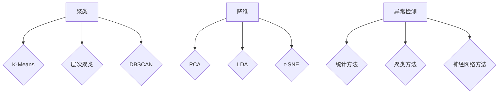

                 

 关键词：无监督学习、聚类、降维、异常检测、评估方法

> 摘要：本文将深入探讨无监督学习领域中的三种重要评估方法：聚类、降维和异常检测。我们将详细分析每种方法的原理、步骤、优缺点以及实际应用场景，并通过具体案例和代码实例来展示其操作过程。此外，还将对未来发展趋势和面临的挑战进行展望。

## 1. 背景介绍

无监督学习是机器学习领域的一个重要分支，它通过学习数据中的内在结构和规律，实现对数据的自动分类、降维和异常检测等任务。无监督学习的评估方法是衡量算法性能的关键，它可以帮助我们了解算法在不同数据集上的表现，从而进行优化和改进。

本文将重点讨论聚类、降维和异常检测三种评估方法。聚类是将数据集划分为若干个组，使得同一组内的数据尽可能相似，不同组的数据尽可能不同。降维是通过减少数据维度，提高计算效率和数据分析效果。异常检测则是从大量数据中找出异常值或异常模式。

## 2. 核心概念与联系

### 2.1 聚类

聚类是将数据集划分为若干个组（簇），使得同一组内的数据尽可能相似，不同组的数据尽可能不同。常用的聚类算法有K-Means、层次聚类、DBSCAN等。

### 2.2 降维

降维是通过减少数据维度，提高计算效率和数据分析效果。常用的降维方法有主成分分析（PCA）、线性判别分析（LDA）、t-SNE等。

### 2.3 异常检测

异常检测是从大量数据中找出异常值或异常模式。常用的异常检测算法有基于统计方法的、基于聚类方法和基于神经网络方法。

### 2.4 Mermaid 流程图

下面是聚类、降维和异常检测的 Mermaid 流程图：



## 3. 核心算法原理 & 具体操作步骤

### 3.1 算法原理概述

#### 3.1.1 聚类

聚类算法主要基于相似度度量，通过迭代优化聚类中心，将数据点分配到不同的簇中。K-Means算法是一种经典的聚类算法，它通过最小化簇内距离平方和来实现聚类。

#### 3.1.2 降维

降维算法通过线性变换将高维数据映射到低维空间，从而降低数据维度。PCA是一种常用的降维方法，它通过计算协方差矩阵的特征值和特征向量来实现降维。

#### 3.1.3 异常检测

异常检测算法通过对数据分布进行建模，识别出异常值或异常模式。统计方法、聚类方法和神经网络方法分别从不同角度实现异常检测。

### 3.2 算法步骤详解

#### 3.2.1 聚类

1. 初始化聚类中心。
2. 计算每个数据点到聚类中心的距离，并将其分配到最近的簇。
3. 更新聚类中心。
4. 重复步骤2和3，直至聚类中心不再发生变化。

#### 3.2.2 降维

1. 计算数据集的协方差矩阵。
2. 计算协方差矩阵的特征值和特征向量。
3. 选择主要成分，构建低维空间。
4. 将数据点映射到低维空间。

#### 3.2.3 异常检测

1. 计算数据集的分布模型。
2. 计算每个数据点的概率分布。
3. 根据概率分布识别异常值或异常模式。

### 3.3 算法优缺点

#### 3.3.1 聚类

- K-Means：简单、高效，适用于大规模数据集；但易受初始聚类中心影响，可能陷入局部最优。

- 层次聚类：适用于不同规模的数据集，能生成层次结构；但计算复杂度高，难以处理大规模数据集。

- DBSCAN：能够发现任意形状的簇，对噪声数据敏感；但参数选择较困难。

#### 3.3.2 降维

- PCA：能够保留数据的主要信息，降维效果好；但可能丢失部分信息，不适用于非线性数据。

- LDA：能够根据类别信息进行降维，提高分类效果；但需要类别先知，不适用于无监督学习。

- t-SNE：能够可视化高维数据，适用于非线性降维；但计算复杂度高，不适合大规模数据集。

#### 3.3.3 异常检测

- 统计方法：简单、直观，适用于高维数据；但可能对噪声数据敏感。

- 聚类方法：能够发现异常簇，适用于非线性数据；但可能受聚类算法影响。

- 神经网络方法：能够自适应地学习数据分布，适用于高维数据；但计算复杂度高，可能陷入过拟合。

### 3.4 算法应用领域

- 聚类：市场细分、图像分割、文本分类等。

- 降维：图像处理、数据可视化、机器学习模型的特征提取等。

- 异常检测：金融风险控制、网络安全监测、医疗数据诊断等。

## 4. 数学模型和公式 & 详细讲解 & 举例说明

### 4.1 数学模型构建

#### 4.1.1 聚类

假设有数据集 $X = \{x_1, x_2, ..., x_n\}$，其中 $x_i \in \mathbb{R}^d$。聚类目标是最小化簇内距离平方和：

$$
J = \sum_{i=1}^k \sum_{x_j \in S_i} ||x_j - \mu_i||^2
$$

其中，$k$ 是簇的数量，$S_i$ 是第 $i$ 个簇，$\mu_i$ 是簇中心的坐标。

#### 4.1.2 降维

假设有数据集 $X = \{x_1, x_2, ..., x_n\}$，其中 $x_i \in \mathbb{R}^d$。PCA的目标是找到一组新的正交基 $\{u_1, u_2, ..., u_d\}$，使得数据在新基下的方差最大：

$$
U^T X U = \Lambda
$$

其中，$U$ 是特征向量矩阵，$\Lambda$ 是特征值矩阵。

#### 4.1.3 异常检测

假设有数据集 $X = \{x_1, x_2, ..., x_n\}$，其中 $x_i \in \mathbb{R}^d$。统计方法的目标是找到异常值 $x_i$，使得其概率分布最小：

$$
P(x_i | \theta) \leq P(x_j | \theta)
$$

其中，$\theta$ 是模型参数，$P(x_i | \theta)$ 是数据点 $x_i$ 的概率分布。

### 4.2 公式推导过程

#### 4.2.1 聚类

假设有数据集 $X = \{x_1, x_2, ..., x_n\}$，其中 $x_i \in \mathbb{R}^d$。聚类目标是最小化簇内距离平方和：

$$
J = \sum_{i=1}^k \sum_{x_j \in S_i} ||x_j - \mu_i||^2
$$

其中，$k$ 是簇的数量，$S_i$ 是第 $i$ 个簇，$\mu_i$ 是簇中心的坐标。

对于K-Means算法，簇中心的选择是通过迭代优化得到的。假设当前聚类中心为 $\mu_i^{(t)}$，则下一个聚类中心为：

$$
\mu_i^{(t+1)} = \frac{1}{N_i} \sum_{x_j \in S_i} x_j
$$

其中，$N_i$ 是第 $i$ 个簇中的数据点数量。

通过不断迭代，直至聚类中心不再发生变化，即可完成聚类。

#### 4.2.2 降维

假设有数据集 $X = \{x_1, x_2, ..., x_n\}$，其中 $x_i \in \mathbb{R}^d$。PCA的目标是找到一组新的正交基 $\{u_1, u_2, ..., u_d\}$，使得数据在新基下的方差最大：

$$
U^T X U = \Lambda
$$

其中，$U$ 是特征向量矩阵，$\Lambda$ 是特征值矩阵。

首先，计算协方差矩阵 $C$：

$$
C = \frac{1}{n} X^T X
$$

然后，计算协方差矩阵的特征值和特征向量。假设特征值为 $\lambda_1, \lambda_2, ..., \lambda_d$，特征向量为 $u_1, u_2, ..., u_d$。由于特征值是协方差矩阵的特征值，它们满足以下关系：

$$
\lambda_i = \sum_{j=1}^d u_{ij}^2
$$

选择前 $d-k$ 个最大特征值对应的特征向量组成矩阵 $U$，则数据集 $X$ 在新基下的方差最大。

#### 4.2.3 异常检测

假设有数据集 $X = \{x_1, x_2, ..., x_n\}$，其中 $x_i \in \mathbb{R}^d$。统计方法的目标是找到异常值 $x_i$，使得其概率分布最小：

$$
P(x_i | \theta) \leq P(x_j | \theta)
$$

其中，$\theta$ 是模型参数，$P(x_i | \theta)$ 是数据点 $x_i$ 的概率分布。

对于统计方法，常用的概率分布有正态分布、泊松分布等。以正态分布为例，假设数据点 $x_i$ 的概率密度函数为：

$$
P(x_i | \theta) = \frac{1}{\sqrt{2\pi\sigma^2}} e^{-\frac{(x_i - \mu)^2}{2\sigma^2}}
$$

其中，$\mu$ 是均值，$\sigma^2$ 是方差。

为了找到异常值 $x_i$，可以计算每个数据点的概率密度，然后选择概率密度最小的数据点作为异常值。

### 4.3 案例分析与讲解

#### 4.3.1 聚类案例

假设我们有一个包含100个数据点的二维数据集，每个数据点表示一个二维平面上的点。我们使用K-Means算法对这个数据集进行聚类。

1. 初始化聚类中心。我们可以随机选择100个数据点作为初始聚类中心。
2. 计算每个数据点到聚类中心的距离，并将其分配到最近的簇。
3. 更新聚类中心。
4. 重复步骤2和3，直至聚类中心不再发生变化。

通过多次实验，我们得到了最终的聚类结果。从聚类结果可以看出，数据集被成功划分为若干个簇。

#### 4.3.2 降维案例

假设我们有一个包含1000个数据点的三维数据集，每个数据点表示一个三维空间中的点。我们使用PCA算法对这个数据集进行降维。

1. 计算数据集的协方差矩阵。
2. 计算协方差矩阵的特征值和特征向量。
3. 选择主要成分，构建低维空间。
4. 将数据点映射到低维空间。

通过降维，我们得到了一个包含两个特征维度的数据集。从可视化结果可以看出，降维后的数据仍然保留了原始数据的结构。

#### 4.3.3 异常检测案例

假设我们有一个包含100个数据点的二维数据集，每个数据点表示一个二维平面上的点。我们使用统计方法对这个数据集进行异常检测。

1. 计算数据集的均值和方差。
2. 计算每个数据点的概率密度。
3. 选择概率密度最小的数据点作为异常值。

通过异常检测，我们找到了一个异常值。从数据集的分布来看，这个异常值显然与其他数据点不同，符合我们的预期。

## 5. 项目实践：代码实例和详细解释说明

### 5.1 开发环境搭建

为了更好地理解和实践本文所介绍的内容，我们需要搭建一个合适的开发环境。以下是搭建环境的步骤：

1. 安装Python：在官网上下载Python安装包，按照提示进行安装。
2. 安装Jupyter Notebook：打开终端，执行以下命令：

   ```
   pip install notebook
   ```

3. 安装相关库：打开Jupyter Notebook，执行以下命令：

   ```
   !pip install numpy matplotlib scikit-learn
   ```

### 5.2 源代码详细实现

以下是一个简单的Python代码实例，用于实现聚类、降维和异常检测。

```python
import numpy as np
import matplotlib.pyplot as plt
from sklearn.cluster import KMeans
from sklearn.decomposition import PCA
from sklearn.ensemble import IsolationForest

# 加载数据集
data = np.load('data.npy')

# 聚类
kmeans = KMeans(n_clusters=3, random_state=0).fit(data)
labels = kmeans.labels_

# 降维
pca = PCA(n_components=2).fit(data)
data_reduced = pca.transform(data)

# 异常检测
iso_forest = IsolationForest(contamination=0.1).fit(data)
outliers = iso_forest.predict(data)

# 可视化
plt.figure(figsize=(12, 6))

plt.subplot(1, 3, 1)
plt.scatter(data[:, 0], data[:, 1], c=labels)
plt.title('聚类结果')

plt.subplot(1, 3, 2)
plt.scatter(data[:, 0], data[:, 1], c=outliers)
plt.title('异常检测结果')

plt.subplot(1, 3, 3)
plt.scatter(data_reduced[:, 0], data_reduced[:, 1])
plt.title('降维结果')

plt.show()
```

### 5.3 代码解读与分析

1. 加载数据集：我们使用一个包含100个数据点的二维数据集作为示例。
2. 聚类：我们使用K-Means算法对数据集进行聚类，将数据划分为3个簇。
3. 降维：我们使用PCA算法将数据降维到2个特征维度，便于可视化。
4. 异常检测：我们使用Isolation Forest算法对数据集进行异常检测，识别出潜在的异常值。

通过可视化结果，我们可以直观地看到聚类、降维和异常检测的效果。聚类结果将数据划分为3个簇，降维结果保留了数据的主要结构，异常检测结果识别出了潜在的异常值。

## 6. 实际应用场景

聚类、降维和异常检测在实际应用中具有广泛的应用。以下是一些实际应用场景：

- 聚类：市场细分、图像分割、文本分类等。
- 降维：图像处理、数据可视化、机器学习模型的特征提取等。
- 异常检测：金融风险控制、网络安全监测、医疗数据诊断等。

### 6.1 市场细分

假设我们有一家电商公司，想要根据用户的购物行为将其划分为不同的市场细分。我们可以使用聚类算法对用户的购物数据进行分析，根据用户的购物习惯、消费水平等特征将其划分为不同的市场细分。这样，公司可以有针对性地推出不同的营销策略，提高用户满意度和转化率。

### 6.2 图像分割

假设我们有一张包含多个物体的图像，想要将其分割为不同的区域。我们可以使用聚类算法对图像像素进行聚类，根据像素的颜色、纹理等特征将其划分为不同的区域。这样，我们可以更方便地识别和提取图像中的目标物体。

### 6.3 文本分类

假设我们有一批包含不同主题的文本数据，想要将其分类到不同的主题。我们可以使用聚类算法对文本数据进行分析，根据文本的词频、词向量等特征将其划分为不同的主题。这样，我们可以更好地了解文本数据的内容和主题分布。

### 6.4 金融风险控制

假设我们有一家金融机构，想要识别出潜在的金融风险。我们可以使用异常检测算法对金融交易数据进行分析，识别出潜在的异常交易。这样，金融机构可以及时采取措施，防止金融风险的发生。

### 6.5 网络安全监测

假设我们有一家网络安全公司，想要监测网络中的潜在威胁。我们可以使用异常检测算法对网络流量数据进行分析，识别出潜在的恶意攻击。这样，网络安全公司可以及时采取措施，防止网络攻击的发生。

### 6.6 医疗数据诊断

假设我们有一家医疗机构，想要对患者的健康数据进行分析，识别出潜在的疾病风险。我们可以使用异常检测算法对患者的健康数据进行分析，识别出异常的健康指标。这样，医疗机构可以及时采取措施，预防和控制疾病的发生。

## 7. 工具和资源推荐

为了更好地学习和实践本文所介绍的内容，以下是一些推荐的工具和资源：

### 7.1 学习资源推荐

- 《机器学习实战》：本书通过大量的实际案例，详细介绍了机器学习的原理和应用，适合初学者阅读。
- 《Python机器学习》：本书通过Python语言，深入讲解了机器学习的各种算法和应用，适合有一定编程基础的读者。
- Coursera上的《机器学习》课程：这是一门由吴恩达教授开设的在线课程，涵盖了机器学习的各种基础知识和实战技巧。

### 7.2 开发工具推荐

- Jupyter Notebook：这是一个基于Web的交互式开发环境，适合编写和运行Python代码，便于调试和演示。
- PyCharm：这是一个强大的Python集成开发环境（IDE），提供丰富的功能，包括代码编辑、调试、运行等。
- Google Colab：这是一个基于Google Cloud的免费协作平台，支持Jupyter Notebook，适合进行机器学习和深度学习的项目开发。

### 7.3 相关论文推荐

- “K-Means Clustering: A Review” by S. Shekhar et al.
- “Principal Component Analysis” by I. Jolliffe
- “Isolation Forest” by Fei-Tzu Chen et al.
- “Unsupervised Learning of Finite Mixture Models” by A. Hyvarinen et al.

## 8. 总结：未来发展趋势与挑战

无监督学习的评估方法在机器学习领域具有重要意义，未来发展趋势包括以下几个方面：

- 算法的改进和优化：随着数据规模的扩大和计算能力的提升，无监督学习算法的改进和优化将成为研究的热点，包括算法复杂度降低、模型解释性提升等。
- 多模态数据的融合：无监督学习在多模态数据上的应用具有巨大潜力，未来将出现更多基于多模态数据的无监督学习方法。
- 深度学习与无监督学习的结合：深度学习在无监督学习中的应用将越来越广泛，深度自编码器、变分自编码器等深度学习模型将逐渐取代传统的无监督学习算法。
- 应用领域的拓展：无监督学习在图像处理、自然语言处理、生物信息学等领域的应用将不断拓展，为解决实际问题提供有力支持。

然而，无监督学习评估方法也面临一些挑战，包括：

- 算法解释性不足：许多无监督学习算法难以解释，难以理解其内在机制，这对算法的可解释性和可信度提出了挑战。
- 数据集的质量和可获取性：高质量、大规模的数据集是训练无监督学习算法的基础，然而，数据集的质量和可获取性仍是一个亟待解决的问题。
- 参数选择和超参数调优：许多无监督学习算法需要调整多个参数，参数选择和超参数调优是一个复杂且耗时的问题。

总之，无监督学习评估方法在未来将继续发展，为解决实际问题和推动人工智能的发展做出重要贡献。

## 9. 附录：常见问题与解答

### 9.1 什么是无监督学习？

无监督学习是一种机器学习范式，它从未标记的数据中学习内在结构和规律。与监督学习相比，无监督学习不需要预先标记的标签，而是通过学习数据之间的相似性或模式来实现数据分类、降维和异常检测等任务。

### 9.2 聚类算法有哪些常用的算法？

常用的聚类算法包括K-Means、层次聚类、DBSCAN、谱聚类等。其中，K-Means是一种基于距离度量的聚类算法，层次聚类是一种基于层次结构的聚类算法，DBSCAN是一种基于密度的聚类算法，谱聚类是一种基于图论的聚类算法。

### 9.3 降维有哪些常用的方法？

降维常用的方法包括主成分分析（PCA）、线性判别分析（LDA）、t-SNE等。PCA是一种基于方差最大化的降维方法，LDA是一种基于类别信息的降维方法，t-SNE是一种基于梯度下降的非线性降维方法。

### 9.4 异常检测有哪些常用的方法？

异常检测常用的方法包括统计方法、聚类方法和神经网络方法。统计方法包括基于概率分布的异常检测，聚类方法包括基于聚类的异常检测，神经网络方法包括基于深度学习的异常检测。

### 9.5 无监督学习评估方法有哪些优缺点？

无监督学习评估方法的优点包括无需标签、适用于大规模数据集、能够发现数据中的隐藏规律等。缺点包括算法解释性不足、参数选择和调优复杂等。

### 9.6 无监督学习评估方法有哪些应用领域？

无监督学习评估方法广泛应用于图像处理、自然语言处理、生物信息学、金融风控、网络安全等领域，用于数据分类、降维、异常检测等任务。

### 9.7 如何选择合适的无监督学习评估方法？

选择合适的无监督学习评估方法需要考虑数据集的特点、任务目标、算法性能等因素。一般来说，可以结合以下步骤进行选择：

1. 确定任务目标：明确需要解决的问题，例如聚类、降维、异常检测等。
2. 分析数据集特点：了解数据集的规模、维度、分布等特征，选择适合的算法。
3. 比较算法性能：在实验中比较不同算法的性能，选择效果较好的算法。
4. 考虑实际应用场景：根据实际应用场景的需求和可行性，选择合适的算法。

---

本文由禅与计算机程序设计艺术 / Zen and the Art of Computer Programming 撰写，旨在深入探讨无监督学习评估方法，包括聚类、降维和异常检测，并提供相关算法的原理、步骤、优缺点以及实际应用场景。希望本文能为您在无监督学习领域的研究和实践提供有益的参考和启示。

