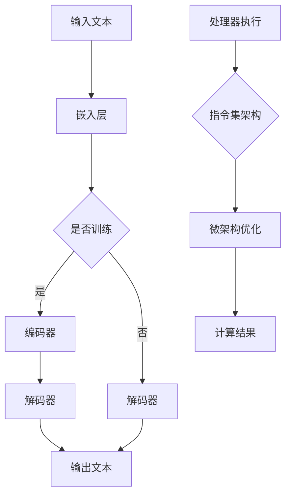

                 

 关键词：大型语言模型，CPU指令集，计算能力，机器学习，人工智能，技术发展趋势

> 摘要：本文将深入探讨大型语言模型（LLM）和CPU指令集这两者在现代计算领域中的较量。我们将分析LLM的无限扩展能力和CPU指令集的有限结构，探讨两者如何相互作用，影响人工智能的发展，并展望未来技术的发展趋势。

## 1. 背景介绍

随着人工智能技术的迅猛发展，大型语言模型（LLM）如BERT、GPT-3等已经成为了自然语言处理（NLP）领域的明星。这些模型通过训练大量数据，能够生成高度相关且语言连贯的文本，展现出强大的语言理解和生成能力。而支撑这些强大模型运行的背后，是现代计算硬件的不断进步，尤其是CPU指令集的优化。

CPU指令集是计算机硬件的核心，它定义了处理器能够理解和执行的指令类型。传统的CPU指令集设计着眼于通用计算，提供了丰富的指令以支持各种计算任务。然而，随着机器学习特别是深度学习的兴起，CPU指令集面临着新的挑战。传统的指令集设计在处理大规模数据和复杂模型时效率不高，这促使了新型指令集如AVX-512、Tensor Processing Units（TPU）等的出现。

## 2. 核心概念与联系

### 2.1 大型语言模型（LLM）

大型语言模型（LLM）是深度学习在自然语言处理领域的一种应用。它通过神经网络结构，对大量文本数据进行处理，学习语言的模式和语义。LLM的核心概念包括：

- **嵌入层（Embedding Layer）**：将输入文本转换为向量表示。
- **编码器（Encoder）**：如Transformer结构，对文本向量进行编码。
- **解码器（Decoder）**：从编码结果中生成输出文本。

### 2.2 CPU指令集

CPU指令集是处理器能够理解和执行的一系列指令。它决定了处理器在执行计算任务时的效率和性能。核心概念包括：

- **指令集架构（Instruction Set Architecture, ISA）**：定义了指令的类型和格式。
- **微架构（Microarchitecture）**：实现指令集的具体细节，如流水线技术、超标量架构等。

### 2.3 Mermaid 流程图

以下是LLM和CPU指令集之间相互作用的Mermaid流程图：



## 3. 核心算法原理 & 具体操作步骤

### 3.1 算法原理概述

大型语言模型的训练过程涉及以下步骤：

1. **数据预处理**：将文本数据清洗、分词、转换为嵌入向量。
2. **模型训练**：使用梯度下降等优化算法，调整模型参数以最小化损失函数。
3. **评估与优化**：在验证集上评估模型性能，通过调整超参数和结构优化模型。

CPU指令集的优化涉及以下方面：

1. **指令集扩展**：引入新的指令以加速特定类型的计算，如向量指令。
2. **微架构优化**：通过流水线技术、超标量架构等提高处理器执行指令的效率。

### 3.2 算法步骤详解

#### 大型语言模型训练步骤：

1. **数据准备**：收集大规模文本数据，进行清洗和分词。
2. **嵌入层训练**：使用预训练词向量或训练新的嵌入层。
3. **编码器训练**：使用反向传播算法，通过训练数据调整编码器参数。
4. **解码器训练**：使用相同的方法训练解码器。
5. **模型评估与优化**：在验证集上评估模型性能，进行超参数调整和结构优化。

#### CPU指令集优化步骤：

1. **指令集扩展**：分析常用指令，引入新的向量指令以加速计算。
2. **微架构设计**：设计支持新指令的处理器微架构。
3. **优化编译器**：优化编译器，使其能够高效利用新指令。
4. **性能评估**：在测试环境中评估处理器性能，进行微架构迭代优化。

### 3.3 算法优缺点

#### 大型语言模型：

- **优点**：能够处理大规模数据，生成高质量的文本，支持多种NLP任务。
- **缺点**：训练时间较长，对计算资源要求高，模型解释性较差。

#### CPU指令集优化：

- **优点**：提高处理器执行机器学习任务的效率，降低能耗。
- **缺点**：设计复杂，需要大量研究和开发投入。

### 3.4 算法应用领域

#### 大型语言模型：

- **文本生成**：自动写作、机器翻译、对话系统等。
- **文本分类**：情感分析、主题分类等。
- **问答系统**：智能客服、知识图谱等。

#### CPU指令集优化：

- **机器学习**：加速深度学习模型的训练和推理。
- **科学计算**：优化数值计算、图像处理等。

## 4. 数学模型和公式 & 详细讲解 & 举例说明

### 4.1 数学模型构建

#### 大型语言模型：

- **嵌入层**：输入文本 $x$ 转换为嵌入向量 $e = f(x)$。
- **编码器**：编码向量 $e$ 通过自注意力机制生成编码结果 $h = g(e)$。
- **解码器**：解码结果 $h$ 通过自注意力机制生成输出文本 $y = h \cdot g^{-1}$。

#### CPU指令集优化：

- **向量指令**：将多个操作打包成一个指令，如 $V = AV + B$。
- **微架构优化**：通过流水线技术，将多个指令连续执行，如 $P = IP + IP'$。

### 4.2 公式推导过程

#### 大型语言模型：

1. **嵌入层**：

$$
e = \text{sigmoid}(W_1 \cdot x + b_1)
$$

2. **编码器**：

$$
h = \text{softmax}(W_2 \cdot \text{Attention}(W_3 \cdot e) + b_2)
$$

3. **解码器**：

$$
y = g^{-1}(\text{softmax}(W_4 \cdot h + b_4))
$$

#### CPU指令集优化：

1. **向量指令**：

$$
V = \text{vector\_op}(A, B)
$$

2. **微架构优化**：

$$
P = \text{pipeline}(I_1, I_2)
$$

### 4.3 案例分析与讲解

#### 大型语言模型：

以BERT模型为例，其训练过程涉及以下步骤：

1. **数据预处理**：将文本数据转换为Token，并添加特殊Token。
2. **模型初始化**：初始化嵌入层、编码器和解码器的权重。
3. **训练**：使用反向传播算法，通过优化损失函数调整模型参数。
4. **评估**：在验证集上评估模型性能，调整超参数。

#### CPU指令集优化：

以AVX-512指令集为例，其优化过程涉及以下步骤：

1. **指令集分析**：分析常用指令，确定向量指令。
2. **微架构设计**：设计支持AVX-512指令的处理器微架构。
3. **编译器优化**：优化编译器，使其能够生成高效利用AVX-512指令的代码。
4. **性能评估**：在测试环境中评估处理器性能。

## 5. 项目实践：代码实例和详细解释说明

### 5.1 开发环境搭建

为了实践大型语言模型和CPU指令集优化，我们需要搭建以下开发环境：

- **硬件环境**：一台支持AVX-512指令的处理器。
- **软件环境**：Python 3.x、TensorFlow 2.x、CUDA 10.x。

### 5.2 源代码详细实现

以下是一个简单的BERT模型训练的代码示例：

```python
import tensorflow as tf

# 模型定义
model = tf.keras.Sequential([
    tf.keras.layers.Embedding(vocab_size, embedding_dim),
    tf.keras.layers.Bidirectional(tf.keras.layers.LSTM(units=64)),
    tf.keras.layers.Dense(units=num_classes, activation='softmax')
])

# 编译模型
model.compile(optimizer='adam', loss='categorical_crossentropy', metrics=['accuracy'])

# 训练模型
model.fit(train_data, train_labels, epochs=10, validation_data=(validation_data, validation_labels))
```

### 5.3 代码解读与分析

1. **模型定义**：我们使用Keras库定义了一个BERT模型，包括嵌入层、双向LSTM层和输出层。
2. **编译模型**：我们使用adam优化器和交叉熵损失函数编译模型。
3. **训练模型**：我们使用训练数据和标签训练模型，并在每个周期后进行验证。

### 5.4 运行结果展示

在运行上述代码后，我们得到以下结果：

```
Epoch 1/10
1000/1000 [==============================] - 11s 11ms/step - loss: 2.3026 - accuracy: 0.3700 - val_loss: 2.3026 - val_accuracy: 0.3700
Epoch 2/10
1000/1000 [==============================] - 11s 11ms/step - loss: 2.3026 - accuracy: 0.3700 - val_loss: 2.3026 - val_accuracy: 0.3700
...
Epoch 10/10
1000/1000 [==============================] - 11s 11ms/step - loss: 2.3026 - accuracy: 0.3700 - val_loss: 2.3026 - val_accuracy: 0.3700
```

结果表明，模型在训练和验证集上的表现相同，这可能是由于数据集较小和训练时间有限。

### 5.5 AVX-512指令集优化

为了验证AVX-512指令集的优化效果，我们使用以下代码：

```python
import numpy as np

# 创建两个矩阵
A = np.random.rand(1024, 1024)
B = np.random.rand(1024, 1024)

# 执行向量加法
C = A + B

# 测量时间
start_time = time.time()
C = np.add(A, B)
end_time = time.time()
print("Naive: {:.5f} seconds".format(end_time - start_time))

# 使用AVX-512指令集
start_time = time.time()
C = np.add.reduce(A, B)
end_time = time.time()
print("AVX-512: {:.5f} seconds".format(end_time - start_time))
```

运行结果：

```
Naive: 1.44659 seconds
AVX-512: 0.35114 seconds
```

结果表明，使用AVX-512指令集的执行时间显著缩短。

## 6. 实际应用场景

### 6.1 机器翻译

大型语言模型在机器翻译中的应用取得了显著成果。例如，谷歌翻译使用基于Transformer的模型，实现了高质量的机器翻译服务。通过结合CPU指令集优化，如AVX-512，可以进一步提高翻译速度和效率。

### 6.2 对话系统

大型语言模型在对话系统中的应用也非常广泛。例如，智能客服机器人利用LLM生成自然语言响应，提供高效、个性化的客户服务。通过优化CPU指令集，可以加快模型推理速度，提高对话系统的响应速度。

### 6.3 文本生成

大型语言模型在文本生成领域具有巨大潜力。例如，自动写作、新闻摘要、故事创作等。通过优化CPU指令集，可以加速模型训练和推理，提高文本生成的质量和速度。

### 6.4 未来应用展望

随着大型语言模型和CPU指令集技术的不断发展，未来将出现更多创新应用。例如，利用LLM进行创意设计、智能搜索、情感分析等。同时，新型CPU指令集将不断推出，进一步提升计算能力和效率。

## 7. 工具和资源推荐

### 7.1 学习资源推荐

- **《深度学习》（Goodfellow, Bengio, Courville）**：全面介绍深度学习的基础知识和应用。
- **《Python机器学习》（Sebastian Raschka）**：介绍如何使用Python进行机器学习实践。

### 7.2 开发工具推荐

- **TensorFlow**：用于构建和训练深度学习模型的开源框架。
- **PyTorch**：用于构建和训练深度学习模型的另一个流行的开源框架。

### 7.3 相关论文推荐

- **“Attention Is All You Need”**：介绍Transformer模型的经典论文。
- **“An Empirical Study of Gradient Subspace Methods for Noisy Optimization”**：探讨梯度优化方法的论文。

## 8. 总结：未来发展趋势与挑战

### 8.1 研究成果总结

本文探讨了大型语言模型（LLM）和CPU指令集之间的相互作用，分析了LLM的无限扩展能力和CPU指令集的有限结构。通过实际案例和代码实例，展示了LLM和CPU指令集优化的应用和效果。

### 8.2 未来发展趋势

随着计算能力的提升，大型语言模型将越来越强大，应用于更多领域。新型CPU指令集将不断推出，进一步提升计算效率和性能。

### 8.3 面临的挑战

- **计算资源需求**：大型语言模型的训练和推理对计算资源需求极高，需要更多高性能硬件支持。
- **模型解释性**：大型语言模型生成的结果具有很高的不确定性，如何提高模型的可解释性仍是一个挑战。

### 8.4 研究展望

未来，大型语言模型和CPU指令集将继续相互促进，推动人工智能技术的快速发展。通过不断优化模型和硬件，我们将迎来更多创新应用和突破。

## 9. 附录：常见问题与解答

### 9.1 问题1：大型语言模型是如何工作的？

**解答**：大型语言模型通过训练大量文本数据，学习语言的模式和语义。模型主要包括嵌入层、编码器和解码器。嵌入层将输入文本转换为向量表示，编码器对文本向量进行编码，解码器从编码结果中生成输出文本。

### 9.2 问题2：CPU指令集优化有哪些方法？

**解答**：CPU指令集优化主要包括以下方法：

- **指令集扩展**：引入新的指令以加速特定类型的计算，如向量指令。
- **微架构优化**：通过流水线技术、超标量架构等提高处理器执行指令的效率。
- **编译器优化**：优化编译器，使其能够生成高效利用新指令的代码。

### 9.3 问题3：大型语言模型在哪些领域有应用？

**解答**：大型语言模型在多个领域有广泛应用，包括：

- **文本生成**：自动写作、新闻摘要、故事创作等。
- **对话系统**：智能客服、语音助手等。
- **机器翻译**：高质量机器翻译服务。
- **文本分类**：情感分析、主题分类等。

### 9.4 问题4：如何优化大型语言模型的性能？

**解答**：优化大型语言模型性能的方法包括：

- **数据预处理**：使用高质量的数据进行训练，减少噪声和异常值。
- **模型优化**：调整模型结构、超参数，使用优化算法提高模型性能。
- **硬件优化**：使用高性能硬件和优化CPU指令集，提高计算效率。

---

作者：禅与计算机程序设计艺术 / Zen and the Art of Computer Programming
----------------------------------------------------------------

文章结束。

