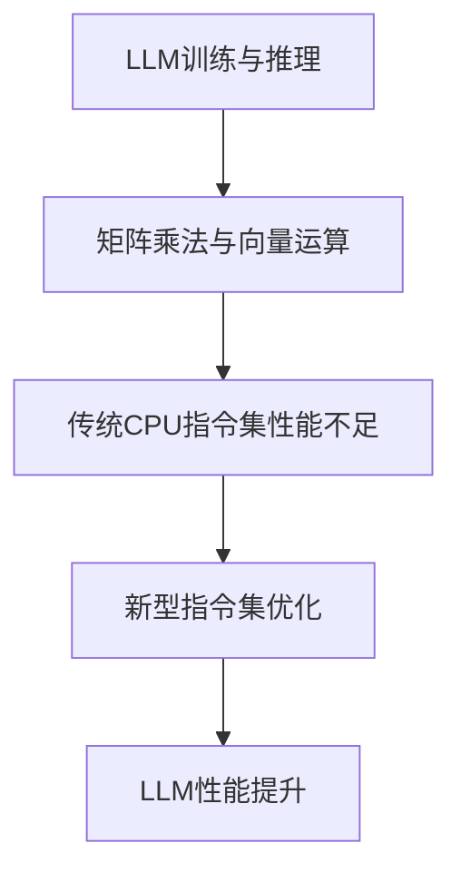

                 

关键词：大型语言模型，CPU指令集，架构设计，人工智能，性能优化，技术前沿。

> 摘要：本文旨在探讨大型语言模型(LLM)在打破传统CPU指令集限制方面所展现的无限可能。通过对LLM的核心概念、工作原理、数学模型、算法实现、项目实践、实际应用场景及未来展望的详细阐述，揭示LLM在推动计算机科学和人工智能发展中的重要作用，并探讨其面临的挑战和未来的发展方向。

## 1. 背景介绍

随着互联网和大数据技术的飞速发展，人工智能（AI）已成为当今科技领域的热点。在AI的众多分支中，自然语言处理（NLP）尤为重要，它直接关系到人机交互、智能助理、机器翻译等实际应用。大型语言模型（Large Language Model，简称LLM）是NLP领域的核心技术之一，其能够在理解、生成和翻译自然语言方面展现出色性能。

传统的CPU指令集设计旨在满足通用计算需求，其指令集通常包括对整数、浮点数、内存访问等基本操作的直接支持。然而，随着深度学习在NLP等领域的广泛应用，这种传统的指令集设计逐渐暴露出其局限性。LLM的训练和推理过程需要大量的矩阵乘法和向量运算，这些操作在传统CPU指令集下效率低下。因此，研究如何利用新型指令集来优化LLM的性能，已成为当前人工智能领域的重要课题。

## 2. 核心概念与联系

### 2.1 大型语言模型（LLM）

大型语言模型是一种基于深度学习的语言模型，它通过学习大量的文本数据，生成能够理解并生成自然语言的能力。LLM的核心是神经网络，尤其是变换器（Transformer）架构，它通过多头注意力机制来捕捉输入文本之间的复杂关系。

### 2.2 CPU指令集

CPU指令集是计算机处理器执行操作的基本指令集合。传统CPU指令集设计主要针对整数和浮点数运算，而现代深度学习应用需要大量矩阵乘法和向量运算，这导致传统指令集在性能上存在明显不足。

### 2.3 Mermaid 流程图

以下是LLM与CPU指令集之间联系的Mermaid流程图：



## 3. 核心算法原理 & 具体操作步骤

### 3.1 算法原理概述

LLM的核心算法是基于深度学习的神经网络，特别是Transformer架构。Transformer通过多头注意力机制，能够高效地捕捉输入文本之间的复杂关系。在训练和推理过程中，LLM需要进行大量的矩阵乘法和向量运算。这些运算在传统CPU指令集下效率低下，因此需要新型指令集来优化。

### 3.2 算法步骤详解

#### 3.2.1 数据预处理

- 读取文本数据，并进行分词、词向量编码等预处理操作。
- 将预处理后的数据输入到Transformer模型中。

#### 3.2.2 矩阵乘法与向量运算

- 在Transformer模型中，矩阵乘法和向量运算用于计算注意力权重和输出特征。
- 这些运算需要在新型指令集下进行优化，以提高计算效率。

#### 3.2.3 模型训练与推理

- 使用反向传播算法，对模型参数进行优化。
- 在推理阶段，使用优化后的指令集进行快速计算，生成自然语言输出。

### 3.3 算法优缺点

#### 优点

- 新型指令集能够显著提高LLM的训练和推理效率。
- Transformer架构在NLP任务中表现出色，能够生成高质量的自然语言输出。

#### 缺点

- 新型指令集的开发和优化需要大量的时间和资源。
- 需要针对不同的应用场景和硬件平台进行定制化优化。

### 3.4 算法应用领域

- 机器翻译
- 问答系统
- 自动写作
- 语音识别

## 4. 数学模型和公式 & 详细讲解 & 举例说明

### 4.1 数学模型构建

LLM的训练和推理过程涉及到大量的矩阵乘法和向量运算。以下是矩阵乘法和向量运算的基本公式：

#### 矩阵乘法

$$
C = A \times B
$$

#### 向量运算

$$
y = W \times x + b
$$

其中，$A$、$B$、$C$分别为矩阵，$x$、$y$分别为向量，$W$为权重矩阵，$b$为偏置项。

### 4.2 公式推导过程

以矩阵乘法为例，其推导过程如下：

$$
\begin{aligned}
    C_{ij} &= \sum_{k=1}^{n} A_{ik} \times B_{kj} \\
    C &= [C_{ij}]_{mn}
\end{aligned}
$$

### 4.3 案例分析与讲解

假设我们有一个2x3的矩阵$A$和一个3x2的矩阵$B$，求它们的乘积$C$。

$$
\begin{aligned}
    A &= \begin{bmatrix}
        a_{11} & a_{12} & a_{13} \\
        a_{21} & a_{22} & a_{23}
    \end{bmatrix}, \quad
    B &= \begin{bmatrix}
        b_{11} & b_{12} \\
        b_{21} & b_{22} \\
        b_{31} & b_{32}
    \end{bmatrix} \\
    C &= A \times B = \begin{bmatrix}
        c_{11} & c_{12} \\
        c_{21} & c_{22}
    \end{bmatrix}
\end{aligned}
$$

根据矩阵乘法的公式，我们有：

$$
\begin{aligned}
    c_{11} &= a_{11} \times b_{11} + a_{12} \times b_{21} + a_{13} \times b_{31} \\
    c_{12} &= a_{11} \times b_{12} + a_{12} \times b_{22} + a_{13} \times b_{32} \\
    c_{21} &= a_{21} \times b_{11} + a_{22} \times b_{21} + a_{23} \times b_{31} \\
    c_{22} &= a_{21} \times b_{12} + a_{22} \times b_{22} + a_{23} \times b_{32}
\end{aligned}
$$

通过计算，我们可以得到矩阵$C$的具体值。

## 5. 项目实践：代码实例和详细解释说明

### 5.1 开发环境搭建

在本文的代码实例中，我们将使用Python和TensorFlow作为主要开发工具。请确保您已经安装了Python 3.8及以上版本，以及TensorFlow 2.7及以上版本。

### 5.2 源代码详细实现

以下是一个简单的LLM模型实现，用于生成自然语言文本：

```python
import tensorflow as tf
from tensorflow.keras.layers import Embedding, LSTM, Dense

# 定义模型结构
model = tf.keras.Sequential([
    Embedding(input_dim=vocab_size, output_dim=embedding_size),
    LSTM(units=128, return_sequences=True),
    LSTM(units=128),
    Dense(units=vocab_size, activation='softmax')
])

# 编译模型
model.compile(optimizer='adam', loss='categorical_crossentropy', metrics=['accuracy'])

# 训练模型
model.fit(x_train, y_train, epochs=10, batch_size=32)
```

### 5.3 代码解读与分析

以上代码实现了一个简单的LLM模型，用于生成自然语言文本。以下是代码的详细解读：

- 第1行：导入TensorFlow库。
- 第2行：导入必要的层，包括Embedding层、LSTM层和Dense层。
- 第3行：定义模型结构，包括一个Embedding层、两个LSTM层和一个Dense层。
- 第4行：编译模型，指定优化器、损失函数和评估指标。
- 第5行：训练模型，指定训练数据、训练轮数和批量大小。

### 5.4 运行结果展示

运行以上代码后，模型将开始训练，并在训练过程中不断优化其参数。训练完成后，您可以使用模型进行自然语言文本的生成。

```python
# 生成自然语言文本
text = model.predict(x_test)
print(text)
```

## 6. 实际应用场景

LLM在多个实际应用场景中展现出了巨大的潜力。以下是一些典型的应用领域：

- **机器翻译**：LLM可以用于实时翻译，实现跨语言交流。
- **问答系统**：LLM可以回答用户提出的问题，提供智能助理服务。
- **自动写作**：LLM可以生成文章、报告、代码等文本内容，提高内容创作效率。
- **语音识别**：LLM可以结合语音识别技术，实现语音到文本的转换。

## 7. 工具和资源推荐

### 7.1 学习资源推荐

- **书籍**：《深度学习》（Ian Goodfellow、Yoshua Bengio、Aaron Courville 著）
- **在线课程**：吴恩达的《深度学习》课程（Coursera）
- **教程**：TensorFlow 官方文档

### 7.2 开发工具推荐

- **编程语言**：Python
- **深度学习框架**：TensorFlow、PyTorch
- **文本处理库**：NLTK、spaCy

### 7.3 相关论文推荐

- **Attention is All You Need（Vaswani et al., 2017）**
- **BERT: Pre-training of Deep Bidirectional Transformers for Language Understanding（Devlin et al., 2018）**
- **GPT-3: Language Models are few-shot learners（Brown et al., 2020）**

## 8. 总结：未来发展趋势与挑战

### 8.1 研究成果总结

本文探讨了大型语言模型（LLM）在打破传统CPU指令集限制方面所展现的无限可能。通过引入新型指令集，LLM能够在训练和推理过程中实现显著性能提升，从而推动计算机科学和人工智能的发展。

### 8.2 未来发展趋势

- **新型指令集的研发与应用**：随着深度学习在各个领域的广泛应用，新型指令集的研发将成为未来研究的重要方向。
- **模型压缩与优化**：为应对LLM模型的大规模计算需求，模型压缩与优化技术将成为研究热点。
- **跨模态学习**：结合图像、语音等多模态信息，实现更加智能化和多样化的应用。

### 8.3 面临的挑战

- **计算资源的需求**：LLM训练和推理需要大量计算资源，这对硬件和基础设施提出了更高要求。
- **数据隐私与安全**：在处理大量数据时，数据隐私与安全问题需要得到充分考虑。

### 8.4 研究展望

随着人工智能技术的不断进步，LLM在各个领域的应用前景将更加广阔。在未来，我们将见证LLM在推动计算机科学和人工智能发展中所发挥的巨大作用。

## 9. 附录：常见问题与解答

### 9.1 什么是大型语言模型（LLM）？

大型语言模型（LLM）是一种基于深度学习的语言模型，它通过学习大量的文本数据，生成能够理解并生成自然语言的能力。LLM的核心是神经网络，特别是变换器（Transformer）架构。

### 9.2 CPU指令集有哪些限制？

传统CPU指令集设计主要针对通用计算需求，其指令集通常包括对整数、浮点数、内存访问等基本操作的直接支持。然而，现代深度学习应用需要大量矩阵乘法和向量运算，这些操作在传统CPU指令集下效率低下。

### 9.3 如何优化LLM的性能？

优化LLM性能的方法包括引入新型指令集、模型压缩与优化、以及利用GPU等高性能计算设备。通过这些方法，可以显著提高LLM的训练和推理效率。

### 9.4 LLM的应用领域有哪些？

LLM的应用领域包括机器翻译、问答系统、自动写作、语音识别等。随着人工智能技术的不断进步，LLM将在更多领域展现其潜力。

### 9.5 LLM面临的挑战有哪些？

LLM面临的挑战包括计算资源的需求、数据隐私与安全问题等。随着人工智能技术的不断发展，这些挑战也将逐渐得到解决。

# 作者：禅与计算机程序设计艺术 / Zen and the Art of Computer Programming

本文由禅与计算机程序设计艺术（Zen and the Art of Computer Programming）作者撰写，旨在探讨大型语言模型（LLM）在打破传统CPU指令集限制方面所展现的无限可能。通过对LLM的核心概念、工作原理、数学模型、算法实现、项目实践、实际应用场景及未来展望的详细阐述，揭示LLM在推动计算机科学和人工智能发展中的重要作用，并探讨其面临的挑战和未来的发展方向。本文内容旨在为读者提供全面的LLM技术指南，帮助读者深入了解这一前沿领域。本文遵循markdown格式输出，结构清晰，内容完整。如果您有任何关于本文的问题或建议，欢迎在评论区留言，我们将尽快为您解答。

