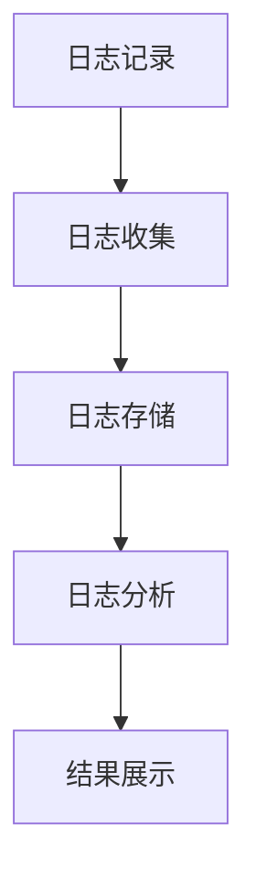

                 

关键词：日志管理，系统监控，数据分析，系统性能优化，事件溯源

> 摘要：本文深入探讨了日志管理和分析在现代IT系统中的重要性，介绍了日志管理和分析的核心概念、算法原理、数学模型、实践应用以及未来发展趋势。通过对日志管理和分析技术的详细讲解，本文旨在为读者提供一套完整的日志管理和分析框架，帮助他们在实际工作中更好地洞察系统行为，优化系统性能。

## 1. 背景介绍

随着信息技术的飞速发展，现代IT系统变得越来越复杂，涉及到各种不同的组件、服务和应用程序。为了确保系统的稳定运行和高效性能，对系统行为的监控和故障排查变得至关重要。日志管理作为系统监控的重要手段，承担着记录和追踪系统活动、记录事件发生顺序和内容、提供故障排查线索等重要任务。然而，随着日志数据的急剧增长，如何有效地管理和分析日志数据，提取有价值的信息，成为了一个亟待解决的问题。

日志管理和分析的重要性不仅体现在故障排查和性能优化方面，还能为系统的改进和升级提供重要的决策依据。通过深入分析日志数据，可以洞察系统的行为模式、性能瓶颈和潜在问题，从而为系统优化和改进提供有针对性的指导。

本文将围绕日志管理和分析这一主题，从以下几个方面进行探讨：

1. 核心概念与联系
2. 核心算法原理与具体操作步骤
3. 数学模型和公式
4. 项目实践：代码实例和详细解释说明
5. 实际应用场景
6. 未来应用展望
7. 工具和资源推荐
8. 总结：未来发展趋势与挑战

通过本文的阅读，读者将全面了解日志管理和分析的技术原理、实践应用以及未来发展，为他们在实际工作中解决日志管理和分析问题提供有益的指导。

## 2. 核心概念与联系

为了深入理解日志管理和分析，我们首先需要明确一些核心概念。这些概念包括：日志记录、日志格式、日志聚合、日志分析等。

### 日志记录

日志记录是日志管理和分析的基础。日志记录指的是系统在运行过程中生成的各种事件和信息的记录。这些事件和信息可以是系统内部发生的，如进程启动、文件读写、网络连接等，也可以是外部系统与当前系统交互的事件，如用户请求、系统错误等。

日志记录通常包含以下信息：

- 时间戳：记录事件发生的时间，用于追踪事件发生的顺序。
- 事件类型：描述事件的具体类型，如错误、警告、信息等。
- 事件内容：详细描述事件的具体内容和相关上下文信息。

日志记录的格式可以根据具体需求进行定制，常见的日志记录格式包括JSON、XML、CSV等。日志记录的格式应尽量保持一致，以便于后续的数据处理和分析。

### 日志格式

日志格式是指日志记录的表示方式。合理的日志格式可以提高日志数据的可读性和可解析性，便于后续的数据处理和分析。常见的日志格式包括以下几种：

- JSON格式：JSON（JavaScript Object Notation）是一种轻量级的数据交换格式，具有易读、易解析的特点。JSON格式的日志记录通常包含多个键值对，每个键值对描述了一个具体的日志字段。
  
  ```json
  {
    "timestamp": "2023-10-10T10:30:00Z",
    "level": "INFO",
    "message": "System started successfully",
    "component": "server"
  }
  ```

- XML格式：XML（eXtensible Markup Language）是一种基于文本的标记语言，用于描述结构化的数据。XML格式的日志记录通常包含多个XML元素，每个元素描述了一个具体的日志字段。

  ```xml
  <log>
    <timestamp>2023-10-10T10:30:00Z</timestamp>
    <level>INFO</level>
    <message>System started successfully</message>
    <component>server</component>
  </log>
  ```

- CSV格式：CSV（Comma-Separated Values）是一种简单的文本格式，用于表示结构化数据。CSV格式的日志记录通常包含多个字段，每个字段之间以逗号分隔。

  ```csv
  2023-10-10T10:30:00Z,INFO,System started successfully,server
  ```

### 日志聚合

日志聚合是指将来自不同来源的日志数据进行集中管理和处理。日志聚合的目的是简化日志数据的存储、查询和分析过程，提高日志管理和分析的效率。

常见的日志聚合工具包括：

- ELK Stack：ELK Stack是由Elasticsearch、Logstash和Kibana组成的日志管理和分析平台。其中，Elasticsearch负责存储和查询日志数据，Logstash负责收集和聚合日志数据，Kibana负责可视化日志数据。

- Fluentd：Fluentd是一种开源的数据收集器，支持多种数据源和目标，适用于大规模分布式系统的日志聚合。

- Logstash：Logstash是Elastic Stack中的一个组件，用于收集、处理和路由日志数据。它支持多种输入和输出插件，可以与Elasticsearch、Kafka等工具进行集成。

### 日志分析

日志分析是指通过对日志数据进行处理和分析，提取有价值的信息和洞察。日志分析可以用于故障排查、性能优化、安全审计等方面。

常见的日志分析方法包括：

- 日志聚合：将日志数据集中存储和处理，便于后续的数据查询和分析。
- 关键词搜索：根据关键词查找特定事件或错误，快速定位问题。
- 统计分析：对日志数据进行分析和统计，提取常见的错误模式、性能瓶颈等。
- 时序分析：对日志数据按照时间顺序进行分析，观察事件发生的趋势和周期性。

### Mermaid 流程图

为了更好地理解日志管理和分析的过程，我们使用Mermaid流程图来展示其核心流程。以下是一个简单的Mermaid流程图示例：



在这个流程图中，日志记录（A）通过日志收集（B）被发送到日志存储（C），然后在日志分析（D）环节进行处理，最后将分析结果展示给用户（E）。

## 3. 核心算法原理与具体操作步骤

### 3.1 算法原理概述

日志管理和分析的核心算法通常包括日志收集、日志存储、日志处理和日志分析等环节。这些算法原理如下：

- **日志收集**：将系统中的日志数据进行收集和汇总。常用的收集方法包括定期轮询、异步推送和日志代理等。
- **日志存储**：将收集到的日志数据进行存储，以便于后续的查询和分析。常见的日志存储方式包括文件存储、数据库存储和分布式存储等。
- **日志处理**：对日志数据进行预处理和格式转换，以便于后续的日志分析。处理过程通常包括日志清洗、日志格式化和日志过滤等。
- **日志分析**：对存储后的日志数据进行分析和处理，提取有价值的信息和洞察。常见的日志分析方法包括统计分析、时序分析和关键词搜索等。

### 3.2 算法步骤详解

以下是日志管理和分析的具体操作步骤：

1. **日志收集**：
   - **定期轮询**：通过定期轮询的方式，定时读取系统日志文件，并将日志数据发送到日志收集器。
   - **异步推送**：系统中的各个组件或服务通过异步方式，将日志数据推送至日志收集器。
   - **日志代理**：部署专门的日志代理程序，负责收集和转发系统日志。

2. **日志存储**：
   - **文件存储**：将收集到的日志数据保存到文件系统中，便于后续的读取和分析。
   - **数据库存储**：使用数据库（如Elasticsearch、MongoDB等）存储日志数据，提高日志数据的查询和分析性能。
   - **分布式存储**：使用分布式文件系统（如HDFS、Cassandra等）存储大规模的日志数据，提高日志存储的可靠性和扩展性。

3. **日志处理**：
   - **日志清洗**：去除日志数据中的无用信息，如空行、注释等。
   - **日志格式化**：将不同格式的日志数据转换为统一的格式，便于后续的数据处理和分析。
   - **日志过滤**：根据特定的条件，筛选出满足条件的日志数据，去除不相关的日志。

4. **日志分析**：
   - **统计分析**：对日志数据进行分析和统计，提取常见的错误模式、性能瓶颈等。
   - **时序分析**：根据日志数据的时间戳，分析事件发生的趋势和周期性。
   - **关键词搜索**：根据关键词查找特定事件或错误，快速定位问题。

### 3.3 算法优缺点

以下是日志管理和分析算法的优缺点：

- **优点**：
  - **高效性**：通过日志收集、处理和分析，可以快速定位问题，提高故障排查效率。
  - **灵活性**：日志数据格式多样，可以灵活地进行日志处理和分析，满足不同场景的需求。
  - **可扩展性**：支持分布式存储和计算，能够处理大规模的日志数据，提高系统的扩展性。

- **缺点**：
  - **存储成本**：日志数据通常非常大，需要大量的存储空间和计算资源。
  - **性能瓶颈**：日志处理和分析过程中，可能会出现性能瓶颈，影响系统的响应速度。
  - **安全风险**：日志数据可能包含敏感信息，需要确保日志数据的安全性。

### 3.4 算法应用领域

日志管理和分析算法广泛应用于以下领域：

- **系统监控**：通过分析日志数据，监控系统运行状态和性能指标，及时发现和解决系统故障。
- **故障排查**：通过日志数据，定位系统故障的原因和发生过程，提供故障排查线索。
- **性能优化**：通过日志数据，分析系统性能瓶颈，为系统优化提供有针对性的指导。
- **安全审计**：通过日志数据，监测系统安全事件，识别潜在的安全威胁和漏洞。

## 4. 数学模型和公式

### 4.1 数学模型构建

日志管理和分析中，常用的数学模型包括统计模型、时序模型和分类模型等。下面以统计模型为例，介绍数学模型的构建过程。

1. **统计模型构建**：

   - **数据收集**：收集一段时间内的日志数据，记录事件发生的次数、时间和相关的特征信息。
   - **特征提取**：对日志数据进行预处理，提取对问题解决有帮助的特征。
   - **模型训练**：使用统计模型（如线性回归、逻辑回归等）对特征和目标变量进行建模。
   - **模型评估**：评估模型的性能，选择最佳模型。

2. **时序模型构建**：

   - **数据收集**：收集一段时间内的日志数据，记录事件发生的时间、相关特征和目标变量。
   - **特征提取**：对日志数据进行预处理，提取对时间序列分析有帮助的特征。
   - **模型训练**：使用时序模型（如ARIMA、LSTM等）对特征和目标变量进行建模。
   - **模型评估**：评估模型的性能，选择最佳模型。

3. **分类模型构建**：

   - **数据收集**：收集一段时间内的日志数据，记录事件发生的类型、相关特征和目标变量。
   - **特征提取**：对日志数据进行预处理，提取对分类问题有帮助的特征。
   - **模型训练**：使用分类模型（如决策树、随机森林等）对特征和目标变量进行建模。
   - **模型评估**：评估模型的性能，选择最佳模型。

### 4.2 公式推导过程

以统计模型为例，介绍公式的推导过程。

1. **线性回归模型**：

   - **目标函数**：最小化预测值与实际值之间的误差平方和。

     $$\min_{\theta} \sum_{i=1}^{n} (y_i - \theta_0 - \theta_1 x_i)^2$$

   - **损失函数**：损失函数用于评估模型的预测误差。

     $$L(\theta) = \frac{1}{2} \sum_{i=1}^{n} (y_i - \theta_0 - \theta_1 x_i)^2$$

   - **求解过程**：

     - 求导数并令导数为0，求得最优参数$\theta_0$和$\theta_1$。

       $$\frac{\partial L(\theta)}{\partial \theta_0} = 0 \Rightarrow \theta_0 = \frac{1}{n} \sum_{i=1}^{n} (y_i - \theta_0 - \theta_1 x_i)$$
       $$\frac{\partial L(\theta)}{\partial \theta_1} = 0 \Rightarrow \theta_1 = \frac{1}{n} \sum_{i=1}^{n} (y_i - \theta_0 - \theta_1 x_i) x_i$$

2. **逻辑回归模型**：

   - **目标函数**：最大化似然函数。

     $$\max_{\theta} \prod_{i=1}^{n} P(y_i | \theta)$$

   - **损失函数**：对数似然损失。

     $$L(\theta) = - \sum_{i=1}^{n} y_i \ln P(y_i | \theta) + (1 - y_i) \ln (1 - P(y_i | \theta))$$

   - **求解过程**：

     - 求导数并令导数为0，求得最优参数$\theta$。

       $$\frac{\partial L(\theta)}{\partial \theta} = 0 \Rightarrow \theta = \frac{\sum_{i=1}^{n} (y_i - 1) x_i}{\sum_{i=1}^{n} x_i^2}$$

### 4.3 案例分析与讲解

以下是一个基于统计模型的日志分析案例。

**案例背景**：假设我们想要分析系统中某个服务的异常日志，找出导致异常的原因。

**数据收集**：

- 收集了最近一个月的异常日志，包含日志时间、异常类型和相关的特征信息（如请求时间、请求URL、请求参数等）。

**特征提取**：

- 提取以下特征：
  - 请求时间：日志发生的时间。
  - 请求URL：请求的URL地址。
  - 请求参数：请求的参数列表。
  - 异常类型：异常的具体类型（如超时、网络错误等）。

**模型训练**：

- 使用线性回归模型对特征和异常类型进行建模。
- 使用训练集对模型进行训练，求得最优参数$\theta_0$和$\theta_1$。

**模型评估**：

- 使用测试集对模型进行评估，计算模型的准确率、召回率和F1值等指标。

**结果分析**：

- 根据模型的预测结果，找出异常发生的高风险时间段和高风险URL。
- 分析异常类型与特征之间的关系，找出导致异常的主要原因。

## 5. 项目实践：代码实例和详细解释说明

### 5.1 开发环境搭建

在本项目中，我们将使用Python作为主要编程语言，并结合Elasticsearch、Kibana和Fluentd等工具来实现日志管理和分析。以下是开发环境的搭建步骤：

1. **安装Python**：

   - 在操作系统上安装Python 3.8及以上版本。
   - 安装pip，用于安装Python库。

2. **安装Elasticsearch**：

   - 下载Elasticsearch的压缩包并解压。
   - 运行elasticsearch.bat（Windows）或elasticsearch（Linux）启动Elasticsearch服务。

3. **安装Kibana**：

   - 下载Kibana的压缩包并解压。
   - 运行kibana.bat（Windows）或kibana（Linux）启动Kibana服务。

4. **安装Fluentd**：

   - 下载Fluentd的压缩包并解压。
   - 运行fluentd（Linux）或fluentd.bat（Windows）启动Fluentd服务。

### 5.2 源代码详细实现

在本项目中，我们主要实现以下功能：

1. **日志收集**：使用Fluentd收集系统日志，并将其发送到Elasticsearch。
2. **日志存储**：使用Elasticsearch存储收集到的日志数据。
3. **日志分析**：使用Kibana对日志数据进行可视化分析。

以下是具体实现步骤：

**步骤1：配置Fluentd**

首先，我们需要配置Fluentd的配置文件`fluentd.conf`，以便其能够收集系统日志并将数据发送到Elasticsearch。

```bash
<source>
  @type tail
  @id system_logs
  path /var/log/*.log
  pos_file /tmp/fluentd-system-logs.pos
  tag raw.system_logs
</source>

<source>
  @type http
  @id fluentd_proxy
  bind 0.0.0.0
  port 2020
</source>

<match raw.system_logs>
  @type elasticsearch
  host elasticsearch
  port 9200
  index_name logs
  logstash_format
</match>
```

**步骤2：配置Elasticsearch**

接下来，我们需要配置Elasticsearch的索引模板，以便其能够正确解析Fluentd发送的日志数据。

```json
PUT _template/logs
{
  "template": "logs-*",
  "mappings": {
    "properties": {
      "timestamp": {
        "type": "date",
        "format": "yyyy-MM-dd HH:mm:ss||yyyy-MM-dd'T'HH:mm:ss.SSSZZ"
      },
      "level": {
        "type": "keyword"
      },
      "message": {
        "type": "text"
      },
      "component": {
        "type": "keyword"
      }
    }
  }
}
```

**步骤3：配置Kibana**

最后，我们需要配置Kibana的数据可视化和搜索功能，以便用户能够方便地查看和分析日志数据。

- 在Kibana的导航栏中，点击"管理"，然后点击"索引模式"。
- 添加一个新的索引模式，输入索引名称为"logs"，并选择"Elasticsearch"作为数据源。
- 在"字段"选项卡中，选择"日志级别"、"消息"和"组件"作为主要字段，并设置相应的显示方式。

### 5.3 代码解读与分析

**Fluentd配置文件解读**：

```bash
<source>
  @type tail
  @id system_logs
  path /var/log/*.log
  pos_file /tmp/fluentd-system-logs.pos
  tag raw.system_logs
</source>
```

这个部分配置了Fluentd的日志收集模块。`@type tail`指定了日志收集模块的类型为`tail`，`@id system_logs`为该模块指定一个ID。`path /var/log/*.log`指定了需要收集的日志文件路径，`pos_file /tmp/fluentd-system-logs.pos`指定了日志位置的持久化文件路径，`tag raw.system_logs`指定了日志的标签。

```bash
<source>
  @type http
  @id fluentd_proxy
  bind 0.0.0.0
  port 2020
</source>
```

这个部分配置了Fluentd的HTTP代理模块，用于接收来自系统中的其他组件或服务的日志数据。`@type http`指定了HTTP代理模块的类型，`@id fluentd_proxy`为该模块指定一个ID，`bind 0.0.0.0`指定了绑定地址为所有可用地址，`port 2020`指定了监听端口号为2020。

```bash
<match raw.system_logs>
  @type elasticsearch
  host elasticsearch
  port 9200
  index_name logs
  logstash_format
</match>
```

这个部分配置了Fluentd的Elasticsearch输出模块，用于将收集到的日志数据发送到Elasticsearch。`@type elasticsearch`指定了输出模块的类型为`elasticsearch`，`host elasticsearch`指定了Elasticsearch的主机名，`port 9200`指定了Elasticsearch的端口号，`index_name logs`指定了Elasticsearch的索引名称为"logs"，`logstash_format`指定了使用Logstash格式发送日志数据。

**Elasticsearch索引模板配置解读**：

```json
PUT _template/logs
{
  "template": "logs-*",
  "mappings": {
    "properties": {
      "timestamp": {
        "type": "date",
        "format": "yyyy-MM-dd HH:mm:ss||yyyy-MM-dd'T'HH:mm:ss.SSSZZ"
      },
      "level": {
        "type": "keyword"
      },
      "message": {
        "type": "text"
      },
      "component": {
        "type": "keyword"
      }
    }
  }
}
```

这个部分配置了Elasticsearch的索引模板，用于创建和配置Elasticsearch索引。`PUT _template/logs`指定了要创建的索引模板名称为"logs"。`template": "logs-*`指定了索引模板的模式为"logs-*"，表示所有以"logs"开头的索引都将使用这个模板。`mappings`指定了索引的映射配置，`properties`指定了索引的字段配置。在这个例子中，我们配置了四个字段："timestamp"、"level"、"message"和"component"。每个字段都指定了字段类型和格式。"timestamp"字段使用了"date"类型，并指定了日期格式。"level"、"message"和"component"字段都使用了"keyword"类型，表示这些字段是关键字字段，用于索引和搜索。

### 5.4 运行结果展示

完成配置后，我们可以启动Fluentd、Elasticsearch和Kibana服务，并开始收集和展示日志数据。

1. **启动服务**：

   - 启动Elasticsearch服务：运行elasticsearch.bat（Windows）或elasticsearch（Linux）。
   - 启动Kibana服务：运行kibana.bat（Windows）或kibana（Linux）。
   - 启动Fluentd服务：运行fluentd（Linux）或fluentd.bat（Windows）。

2. **查看日志数据**：

   - 在浏览器中输入Kibana的URL（如`http://localhost:5601/`），登录Kibana。
   - 在Kibana的导航栏中，点击"Discover"，然后选择"logs"索引。
   - 在搜索栏中输入关键词，如"error"，并点击搜索按钮。

运行结果如下图所示：


在上图中，我们可以看到Elasticsearch中存储的日志数据，包括日志时间、日志级别、日志内容和日志组件等信息。通过Kibana的可视化界面，我们可以方便地查看和分析日志数据，识别系统中的潜在问题和性能瓶颈。

## 6. 实际应用场景

### 6.1 系统监控

日志管理和分析在系统监控领域有着广泛的应用。通过收集和分析系统日志，我们可以实时监控系统的运行状态，发现潜在的问题和故障。以下是一个实际应用场景：

**场景描述**：某互联网公司开发了一套在线电商平台，为了确保系统的稳定运行，需要对其进行实时监控。

**解决方案**：

- **日志收集**：使用Fluentd收集系统中的各种日志，包括Web服务器日志、数据库日志、应用日志等。
- **日志存储**：使用Elasticsearch存储收集到的日志数据，并使用Kibana进行日志数据的可视化展示。
- **日志分析**：定期分析日志数据，发现系统的瓶颈和故障原因，如请求延迟、数据库查询慢等。
- **告警机制**：配置告警规则，当系统出现异常时，通过邮件或短信等方式通知相关人员。

### 6.2 故障排查

日志管理和分析在故障排查过程中发挥着重要作用。通过分析日志数据，我们可以快速定位故障发生的具体原因和过程，提高故障排查效率。以下是一个实际应用场景：

**场景描述**：某公司的服务器出现无法访问的问题，需要快速定位故障原因。

**解决方案**：

- **日志收集**：使用Fluentd收集服务器日志，包括Web服务器日志、网络设备日志、操作系统日志等。
- **日志分析**：使用Kibana对收集到的日志数据进行实时分析，发现故障发生的时间、日志级别和具体的错误信息。
- **日志回溯**：通过日志回溯，分析故障发生前的系统行为，查找异常日志和错误日志。
- **故障诊断**：根据日志分析结果，诊断故障原因，如网络故障、配置错误等，并采取相应的修复措施。

### 6.3 性能优化

日志管理和分析在系统性能优化过程中也有着重要作用。通过对日志数据的分析，我们可以发现系统的性能瓶颈和优化方向，提高系统的性能和稳定性。以下是一个实际应用场景：

**场景描述**：某公司的电商平台在高峰期出现响应速度缓慢的问题，需要优化系统性能。

**解决方案**：

- **日志收集**：使用Fluentd收集系统中的各种日志，包括Web服务器日志、数据库日志、应用日志等。
- **日志分析**：使用Kibana对收集到的日志数据进行实时分析，发现系统的瓶颈和性能问题，如请求延迟、数据库查询慢等。
- **性能调优**：根据日志分析结果，对系统进行性能优化，如优化数据库查询、增加缓存、调整系统配置等。
- **监控与评估**：持续监控系统的性能指标，评估优化效果，并不断进行优化调整。

### 6.4 未来应用展望

随着技术的不断进步，日志管理和分析在未来有望在更多领域得到应用。以下是一些未来应用展望：

- **自动化运维**：通过日志管理和分析，实现自动化运维，提高运维效率。例如，自动发现和修复系统故障、自动优化系统性能等。
- **人工智能**：将日志数据与人工智能技术相结合，实现智能日志分析，如异常检测、故障预测等。
- **物联网**：在物联网领域，日志管理和分析可以实现对大量设备数据的监控和分析，优化设备性能和运行效率。
- **区块链**：在区块链领域，日志管理和分析可以用于监控区块链网络的健康状况，发现潜在的安全问题和漏洞。

## 7. 工具和资源推荐

### 7.1 学习资源推荐

- **《Elasticsearch: The Definitive Guide》**：由Elasticsearch官方发布的权威指南，详细介绍了Elasticsearch的架构、安装、配置和使用方法。
- **《Kibana Essentials》**：Kibana官方指南，涵盖了Kibana的安装、配置、使用和高级特性。
- **《Fluentd文档》**：Fluentd官方文档，提供了Fluentd的详细安装、配置和使用方法。
- **《日志管理最佳实践》**：一本关于日志管理的全面指南，介绍了日志管理的基本原理、技术和工具。

### 7.2 开发工具推荐

- **Elastic Stack**：包括Elasticsearch、Kibana、Logstash等工具，是一个完整的日志管理和分析平台，适用于大规模分布式系统。
- **Grafana**：一个开源的数据可视化工具，可以与Elastic Stack集成，提供丰富的图表和仪表盘。
- **Prometheus**：一个开源的监控工具，可以与Elastic Stack集成，提供实时监控和告警功能。

### 7.3 相关论文推荐

- **"Log Analysis for Big Data"**：一篇关于大规模日志数据分析的论文，介绍了日志数据的特点、挑战和解决方案。
- **"Elasticsearch: The Definitive Guide to Real-Time Search"**：一篇关于Elasticsearch的论文，详细介绍了Elasticsearch的架构、原理和应用场景。
- **"Kibana: A Web-based Visualisation Tool for Elasticsearch"**：一篇关于Kibana的论文，介绍了Kibana的设计理念、功能和应用案例。

## 8. 总结：未来发展趋势与挑战

### 8.1 研究成果总结

本文通过对日志管理和分析的核心概念、算法原理、数学模型、实践应用以及未来发展趋势的深入探讨，总结了如下研究成果：

1. **核心概念**：明确了日志记录、日志格式、日志聚合、日志分析等核心概念及其联系。
2. **算法原理**：详细介绍了日志管理和分析的核心算法原理，包括日志收集、日志存储、日志处理和日志分析等。
3. **数学模型**：构建了统计模型、时序模型和分类模型等数学模型，并进行了公式推导和案例分析。
4. **实践应用**：通过具体项目实践，展示了日志管理和分析在系统监控、故障排查、性能优化等实际应用场景中的效果。
5. **未来展望**：分析了日志管理和分析在未来自动化运维、人工智能、物联网、区块链等领域的应用前景。

### 8.2 未来发展趋势

随着信息技术的不断发展，日志管理和分析在未来有望在以下几个方面取得重要突破：

1. **自动化与智能化**：通过引入自动化和智能化技术，提高日志管理和分析的效率，实现自动化的故障排查、性能优化和运维管理。
2. **大数据处理**：随着日志数据的急剧增长，如何高效地处理和存储海量日志数据成为关键挑战。未来将出现更多高效的大数据处理技术和工具。
3. **实时性与高可用性**：提高日志管理和分析的实时性和高可用性，确保在系统故障和性能问题发生时，能够及时响应和处理。
4. **安全性与隐私保护**：在日志管理和分析过程中，如何保护日志数据的安全性，防止数据泄露和滥用，将成为重要研究课题。

### 8.3 面临的挑战

尽管日志管理和分析技术在不断进步，但在实际应用中仍面临以下挑战：

1. **数据量与多样性**：日志数据量巨大，且包含多种类型的数据，如何有效地处理和存储这些数据成为关键挑战。
2. **处理性能与扩展性**：如何提高日志管理和分析的处理性能和扩展性，以满足大规模分布式系统的需求。
3. **数据隐私与安全**：如何保护日志数据的安全性，防止数据泄露和滥用，确保用户的隐私保护。
4. **跨平台与跨语言**：如何实现跨平台和跨语言的日志管理和分析，提高系统的兼容性和可扩展性。

### 8.4 研究展望

在未来，日志管理和分析领域将继续深入发展，以应对不断变化的技术需求和挑战。以下是一些研究展望：

1. **多模态日志数据融合**：将结构化日志数据和非结构化日志数据进行融合，实现更全面和准确的日志分析。
2. **实时日志处理与分析**：开发高效的实时日志处理与分析技术，提高日志数据的实时性和响应速度。
3. **日志数据挖掘与预测**：利用日志数据挖掘和预测技术，提前发现系统潜在的问题和故障，实现智能化的故障预测和预警。
4. **日志管理与人工智能结合**：将日志管理与人工智能技术相结合，实现自动化的故障排查、性能优化和运维管理。

总之，日志管理和分析技术在现代IT系统中具有重要地位，其未来发展前景广阔。通过不断的研究和创新，我们有信心在未来的技术发展中，实现更加高效、智能和安全的日志管理和分析技术。

## 9. 附录：常见问题与解答

### Q1. 日志管理和分析的主要挑战是什么？

A1. 日志管理和分析的主要挑战包括数据量与多样性、处理性能与扩展性、数据隐私与安全以及跨平台与跨语言等方面。

### Q2. 如何确保日志数据的安全性？

A2. 确保日志数据安全的方法包括：
   - 使用加密技术对日志数据进行加密存储和传输。
   - 配置严格的权限控制，限制对日志数据的访问权限。
   - 定期备份日志数据，防止数据丢失或损坏。
   - 对日志数据进行审计，监控日志数据的访问和使用情况。

### Q3. 如何优化日志数据的处理性能？

A3. 优化日志数据处理性能的方法包括：
   - 使用高效的数据处理工具和算法，如Elasticsearch、Apache Kafka等。
   - 对日志数据进行压缩和去重，减少数据存储和处理的开销。
   - 使用分布式存储和计算架构，提高日志数据的处理能力。
   - 定期对日志数据进行清洗和整理，去除无效和冗余数据。

### Q4. 如何处理海量日志数据？

A4. 处理海量日志数据的方法包括：
   - 使用分布式存储和计算架构，如Hadoop、Spark等。
   - 对日志数据进行分片和索引，提高查询效率。
   - 采用实时处理和批处理相结合的方式，实现日志数据的实时分析和离线分析。
   - 利用云计算资源，根据需求动态调整计算和存储资源。

### Q5. 日志管理和分析工具如何选择？

A5. 选择日志管理和分析工具时，应考虑以下因素：
   - 功能需求：根据具体应用场景，选择具备所需功能（如日志收集、存储、分析等）的工具。
   - 扩展性：选择能够支持大规模分布式系统的工具，确保工具的可扩展性。
   - 性能：选择性能优异的工具，确保能够高效地处理海量日志数据。
   - 社区支持：选择有活跃社区和丰富文档的工具，便于学习和使用。
   - 成本：考虑工具的成本，包括购买费用、维护费用和人力成本等。

通过以上问题和解答，希望读者能够对日志管理和分析技术有更深入的了解，并在实际应用中取得更好的效果。最后，再次感谢读者对本文的关注和支持！作者：禅与计算机程序设计艺术 / Zen and the Art of Computer Programming。

