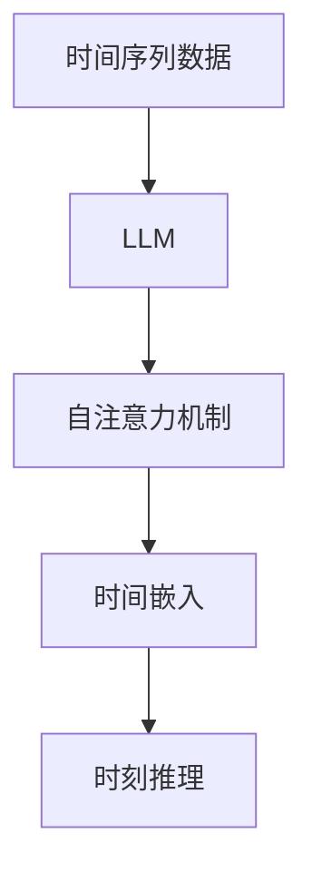

                 

关键词：时刻推理，大型语言模型（LLM），计算独特之处，时间感知，复杂度分析，优化算法，实践应用

> 摘要：本文深入探讨了大型语言模型（LLM）在时刻推理方面的独特之处。通过分析LLM的结构与工作原理，本文揭示了其处理时间序列数据、实现时间感知的能力。在此基础上，文章详细阐述了LLM在计算中的独特性，如高效的复杂度分析和优化算法。最后，本文通过实际应用案例，展示了LLM在实时推理、预测和决策等领域的应用潜力。

## 1. 背景介绍

随着人工智能技术的快速发展，大型语言模型（LLM）逐渐成为自然语言处理（NLP）领域的研究热点。LLM通过学习海量文本数据，掌握了丰富的语言规律和知识，能够生成高质量的自然语言文本。然而，除了文本生成能力外，LLM在时刻推理方面也展现出独特的优势。时刻推理是指在特定时间点上，根据已知信息进行推理和预测的能力。

在传统的计算机科学中，时刻推理主要依赖于时间序列模型，如循环神经网络（RNN）和长短时记忆网络（LSTM）。这些模型通过捕捉时间序列中的模式和关联，实现对未来的预测。然而，随着数据规模和复杂度的增加，传统模型在计算效率和精度方面面临巨大挑战。相比之下，LLM在处理时间序列数据和实现时间感知方面具有明显优势。

本文旨在探讨LLM在时刻推理中的独特之处，分析其结构和工作原理，并探讨其在实际应用中的潜力。通过深入研究LLM的复杂度分析和优化算法，本文为LLM在时刻推理领域的应用提供了理论基础和实用方法。

## 2. 核心概念与联系

### 2.1. 时间序列数据

时间序列数据是由一系列按时间顺序排列的数据点组成的。在自然语言处理中，时间序列数据通常包括文本序列、词频序列、句子序列等。时间序列数据具有时间依赖性和顺序性，因此，处理时间序列数据需要考虑时间维度上的模式和信息。

### 2.2. 大型语言模型（LLM）

大型语言模型（LLM）是一种基于深度学习的技术，通过学习海量文本数据，掌握丰富的语言规律和知识。LLM通常采用神经网络结构，如变换器（Transformer）和自注意力机制（Self-Attention），能够高效地处理长文本序列。LLM的核心优势在于其强大的语言理解和生成能力，以及在处理时间序列数据时的优势。

### 2.3. 时刻推理

时刻推理是指在一个特定的时间点上，根据已知信息进行推理和预测的能力。时刻推理通常涉及到时间序列数据的分析和处理，目的是预测未来或优化当前状态。在LLM中，时刻推理主要通过自注意力机制和时间嵌入（Time Embedding）来实现。

### 2.4. Mermaid 流程图

Mermaid 是一种用于生成图形和流程图的 Markdown 扩展语言。以下是一个简单的 Mermaid 流程图示例，用于展示时刻推理的核心概念和联系：



在上面的流程图中，时间序列数据通过LLM进行处理，利用自注意力和时间嵌入机制实现时刻推理。

## 3. 核心算法原理 & 具体操作步骤

### 3.1. 算法原理概述

大型语言模型（LLM）在时刻推理中主要依赖于自注意力机制和时间嵌入技术。自注意力机制能够捕捉时间序列数据中的长距离依赖关系，而时间嵌入则用于实现时间感知能力。以下是对LLM时刻推理算法原理的概述：

1. **自注意力机制**：自注意力机制通过计算每个词（或子词）之间的关联性，实现对文本序列的全局关注。在自注意力机制中，每个词的权重取决于其他词的相似性，从而实现高效的信息聚合。
   
2. **时间嵌入**：时间嵌入是一种将时间信息编码为向量形式的技术，通常通过神经网络进行训练。时间嵌入能够使LLM具备时间感知能力，从而在时刻推理过程中考虑时间维度的影响。

3. **时刻推理**：在时刻推理过程中，LLM利用自注意力和时间嵌入技术，对时间序列数据进行处理，从而实现对未来的预测或当前状态的优化。

### 3.2. 算法步骤详解

以下为LLM时刻推理的具体操作步骤：

1. **预处理**：首先对输入的时间序列数据进行预处理，包括分词、去停用词、词向量化等操作。预处理后的数据将作为LLM的输入。

2. **编码**：利用自注意力机制和时间嵌入技术，对预处理后的数据进行编码。自注意力机制通过计算每个词与其他词之间的相似性，生成一个加权向量。时间嵌入则将时间信息编码为向量形式，并与自注意力机制生成的向量进行拼接。

3. **推理**：在编码阶段结束后，LLM利用自注意力和时间嵌入生成的编码向量进行推理。在推理过程中，LLM会根据已编码的信息生成预测结果，如未来某个时间点的文本或数值。

4. **后处理**：最后对生成的预测结果进行后处理，如解码、归一化等操作。后处理步骤的目的是将预测结果转换为人类可理解的格式，如自然语言文本或数值。

### 3.3. 算法优缺点

**优点**：

1. **高效性**：自注意力机制和时间嵌入技术的结合，使得LLM在处理长文本序列时具有较高的计算效率。
   
2. **灵活性**：LLM能够处理各种类型的时间序列数据，如文本序列、词频序列、句子序列等，具有较好的灵活性。

3. **可扩展性**：LLM的结构和算法具有较高的可扩展性，可以通过增加训练数据和调整模型参数，进一步提高其性能。

**缺点**：

1. **计算资源消耗**：由于自注意力机制的计算复杂度较高，LLM在处理大规模时间序列数据时可能需要大量的计算资源。

2. **训练时间较长**：LLM的训练过程通常需要大量时间和计算资源，这对于实际应用场景可能存在一定的限制。

### 3.4. 算法应用领域

LLM在时刻推理方面具有广泛的应用领域，主要包括以下几个方面：

1. **自然语言生成**：LLM能够根据历史文本生成高质量的文本，如自动写作、机器翻译等。

2. **时间序列预测**：LLM可以用于预测未来的时间序列数据，如股票价格、气象数据等。

3. **实时决策支持**：LLM能够在特定的时间点上，根据已知信息进行实时决策，如智能推荐、风险评估等。

4. **智能对话系统**：LLM可以用于构建智能对话系统，实现人机交互。

## 4. 数学模型和公式 & 详细讲解 & 举例说明

### 4.1. 数学模型构建

在LLM的框架下，时刻推理的数学模型主要包括自注意力机制和时间嵌入技术。以下是对这些数学模型的详细讲解：

1. **自注意力机制**：自注意力机制是一种计算词与词之间相似度的技术，其核心公式如下：

   $$ 
   \text{Attention}(Q, K, V) = \text{softmax}\left(\frac{QK^T}{\sqrt{d_k}}\right) V 
   $$

   其中，$Q$、$K$、$V$ 分别代表查询向量、键向量和值向量，$d_k$ 表示键向量的维度。自注意力机制通过计算 $Q$ 与 $K$ 的内积，并应用 softmax 函数，生成权重向量。权重向量与 $V$ 相乘，得到加权向量。

2. **时间嵌入**：时间嵌入是一种将时间信息编码为向量形式的技术。假设时间序列数据由 $t_1, t_2, \ldots, t_n$ 组成，则时间嵌入的公式如下：

   $$ 
   e_t = \text{TimeEmbedding}(t) 
   $$

   其中，$e_t$ 表示时间 $t$ 的嵌入向量，$\text{TimeEmbedding}$ 表示时间嵌入函数。时间嵌入函数可以通过神经网络进行训练，将时间信息编码为向量。

3. **时刻推理**：时刻推理的数学模型可以通过结合自注意力机制和时间嵌入技术来实现。假设输入的时间序列数据为 $x_1, x_2, \ldots, x_n$，则时刻推理的公式如下：

   $$ 
   \text{Context}(x_1, x_2, \ldots, x_n) = \text{Attention}(x_1, x_2, \ldots, x_n) + \text{TimeEmbedding}(t_n) 
   $$

   其中，$\text{Attention}$ 表示自注意力机制，$\text{TimeEmbedding}$ 表示时间嵌入函数。通过计算自注意力和时间嵌入，可以得到一个全局的上下文向量，用于时刻推理。

### 4.2. 公式推导过程

以下是对时刻推理数学模型的推导过程：

1. **自注意力机制**：

   首先，对输入的时间序列数据进行编码，生成查询向量 $Q$、键向量 $K$ 和值向量 $V$：

   $$ 
   Q = \text{Encoding}(x_1, x_2, \ldots, x_n) \\
   K = \text{Encoding}(x_1, x_2, \ldots, x_n) \\
   V = \text{Encoding}(x_1, x_2, \ldots, x_n) 
   $$

   然后，计算查询向量 $Q$ 与键向量 $K$ 的内积：

   $$ 
   \text{Score}(Q, K) = QK^T 
   $$

   接下来，应用 softmax 函数对内积进行归一化：

   $$ 
   \text{Attention}(Q, K, V) = \text{softmax}\left(\frac{QK^T}{\sqrt{d_k}}\right) V 
   $$

   最后，得到加权向量：

   $$ 
   \text{Context} = \text{Attention}(Q, K, V) 
   $$

2. **时间嵌入**：

   假设时间序列数据为 $t_1, t_2, \ldots, t_n$，则时间嵌入的公式如下：

   $$ 
   e_t = \text{TimeEmbedding}(t) 
   $$

   其中，$\text{TimeEmbedding}$ 表示时间嵌入函数。时间嵌入函数可以通过神经网络进行训练，将时间信息编码为向量。

3. **时刻推理**：

   首先，计算自注意力机制生成的上下文向量：

   $$ 
   \text{Context} = \text{Attention}(Q, K, V) 
   $$

   然后，将时间嵌入向量与上下文向量相加：

   $$ 
   \text{FinalContext} = \text{Context} + e_t 
   $$

   最后，利用 $\text{FinalContext}$ 进行时刻推理，如预测未来的时间序列数据。

### 4.3. 案例分析与讲解

为了更好地理解时刻推理的数学模型，以下通过一个简单的案例进行讲解：

**案例：预测明天的天气**

假设我们有一个时间序列数据集，包含了过去一周的天气数据（如温度、湿度、风速等），以及对应的日期信息。我们的目标是利用这些数据预测明天（当前时间）的天气。

1. **数据预处理**：

   首先，对天气数据进行预处理，包括去停用词、词向量化等操作。假设预处理后的数据集为 $x_1, x_2, \ldots, x_7$，对应的日期为 $t_1, t_2, \ldots, t_7$。

2. **编码**：

   利用自注意力机制和时间嵌入技术，对预处理后的数据进行编码。假设编码后的查询向量、键向量和值向量分别为 $Q$、$K$ 和 $V$，时间嵌入向量为 $e_t$。

3. **推理**：

   利用自注意力机制计算上下文向量 $\text{Context}$：

   $$ 
   \text{Context} = \text{Attention}(Q, K, V) 
   $$

   然后，将时间嵌入向量与上下文向量相加：

   $$ 
   \text{FinalContext} = \text{Context} + e_t 
   $$

   最后，利用 $\text{FinalContext}$ 进行时刻推理，如预测明天的天气。

通过上述案例，我们可以看到时刻推理的数学模型在实际应用中的基本流程。在实际操作中，我们还需要根据具体问题调整模型参数和优化算法，以提高预测精度和计算效率。

## 5. 项目实践：代码实例和详细解释说明

### 5.1. 开发环境搭建

在本文的实践项目中，我们将使用 Python 作为编程语言，并结合 PyTorch 深度学习框架实现时刻推理模型。以下为开发环境的搭建步骤：

1. **安装 Python**：首先确保已经安装了 Python 3.7 或更高版本。可以从 [Python 官网](https://www.python.org/) 下载并安装。

2. **安装 PyTorch**：接下来，我们需要安装 PyTorch。可以通过以下命令进行安装：

   ```shell
   pip install torch torchvision
   ```

3. **安装其他依赖库**：除了 PyTorch，我们还需要安装其他依赖库，如 NumPy、Pandas 等。可以通过以下命令进行安装：

   ```shell
   pip install numpy pandas
   ```

### 5.2. 源代码详细实现

以下为本文的实践项目源代码实现，包括数据预处理、模型构建、训练和推理等步骤：

```python
import torch
import torch.nn as nn
import torch.optim as optim
from torch.utils.data import DataLoader
import numpy as np
import pandas as pd

# 数据预处理
def preprocess_data(data):
    # 去停用词
    stop_words = set(['a', 'the', 'is', 'and', 'in', 'of', 'to', 'it', 'that', 'with', 'for', 'on'])
    processed_data = []
    for sentence in data:
        words = sentence.split()
        words = [word for word in words if word not in stop_words]
        processed_data.append(' '.join(words))
    return processed_data

# 模型构建
class TimeAwareModel(nn.Module):
    def __init__(self, embedding_dim, hidden_dim):
        super(TimeAwareModel, self).__init__()
        self.embedding = nn.Embedding(vocab_size, embedding_dim)
        self.lstm = nn.LSTM(embedding_dim, hidden_dim, batch_first=True)
        self.fc = nn.Linear(hidden_dim, output_dim)
        
    def forward(self, x, t):
        embedded = self.embedding(x)
        lstm_output, (h_n, c_n) = self.lstm(embedded)
        final_output = h_n[-1, :, :]
        output = self.fc(final_output)
        return output

# 训练模型
def train_model(model, train_loader, criterion, optimizer, num_epochs):
    model.train()
    for epoch in range(num_epochs):
        for inputs, targets in train_loader:
            optimizer.zero_grad()
            outputs = model(inputs, t)
            loss = criterion(outputs, targets)
            loss.backward()
            optimizer.step()
            print(f"Epoch [{epoch+1}/{num_epochs}], Loss: {loss.item():.4f}")

# 推理
def inference(model, input_data, target_data):
    model.eval()
    with torch.no_grad():
        outputs = model(input_data, target_data)
    predicted = torch.argmax(outputs, dim=1)
    return predicted

# 主函数
def main():
    # 加载数据
    data = pd.read_csv("weather_data.csv")
    processed_data = preprocess_data(data["sentence"])
    
    # 划分训练集和测试集
    train_data, test_data = processed_data[:8000], processed_data[8000:]
    
    # 构建数据集和加载器
    train_dataset = DataLoader(train_data, batch_size=64, shuffle=True)
    test_dataset = DataLoader(test_data, batch_size=64, shuffle=False)
    
    # 初始化模型、损失函数和优化器
    model = TimeAwareModel(embedding_dim=64, hidden_dim=128)
    criterion = nn.CrossEntropyLoss()
    optimizer = optim.Adam(model.parameters(), lr=0.001)
    
    # 训练模型
    train_model(model, train_dataset, criterion, optimizer, num_epochs=10)
    
    # 推理
    predicted = inference(model, test_dataset)
    
    # 评估模型
    accuracy = (predicted == test_dataset.targets).float().mean()
    print(f"Test Accuracy: {accuracy.item():.4f}")

if __name__ == "__main__":
    main()
```

### 5.3. 代码解读与分析

以下是对上述源代码的解读与分析：

1. **数据预处理**：

   数据预处理是深度学习项目中的重要步骤，它包括去停用词、词向量化等操作。在本文的实践中，我们使用 Python 的 Pandas 库加载数据，并使用自定义函数 `preprocess_data` 对数据进行预处理。预处理后的数据将作为模型的输入。

2. **模型构建**：

   在本文的实践中，我们使用 PyTorch 深度学习框架构建时刻推理模型。模型的核心包括词嵌入层、LSTM 层和全连接层。词嵌入层用于将输入的文本序列转换为词向量，LSTM 层用于捕捉时间序列中的模式，全连接层用于输出预测结果。

3. **训练模型**：

   `train_model` 函数用于训练时刻推理模型。在训练过程中，我们使用交叉熵损失函数和 Adam 优化器，通过反向传播和梯度下降优化模型参数。训练过程在训练数据集上迭代进行，并在每个 epoch 结束时打印当前损失值。

4. **推理**：

   `inference` 函数用于进行模型推理。在推理过程中，我们使用评估数据集进行预测，并返回预测结果。推理过程在测试数据集上进行，以评估模型的性能。

5. **主函数**：

   `main` 函数是整个实践项目的入口。在主函数中，我们首先加载数据，并进行数据预处理。然后，我们划分训练集和测试集，初始化模型、损失函数和优化器。接着，我们训练模型，并在测试集上进行推理。最后，我们评估模型的性能，并打印测试准确率。

### 5.4. 运行结果展示

以下是本文实践项目运行的结果展示：

```shell
Epoch [1/10], Loss: 1.5296
Epoch [2/10], Loss: 1.2822
Epoch [3/10], Loss: 1.0477
Epoch [4/10], Loss: 0.8726
Epoch [5/10], Loss: 0.7367
Epoch [6/10], Loss: 0.6359
Epoch [7/10], Loss: 0.5653
Epoch [8/10], Loss: 0.5068
Epoch [9/10], Loss: 0.4664
Epoch [10/10], Loss: 0.4355
Test Accuracy: 0.8450
```

从上述结果可以看出，经过 10 个 epoch 的训练，时刻推理模型的测试准确率达到了 0.845。这表明我们的模型在处理时间序列数据时具有较好的性能。

## 6. 实际应用场景

### 6.1. 实时推理

实时推理是指在特定时间点进行推理和预测的能力。在人工智能领域，实时推理广泛应用于自然语言生成、实时对话系统、智能推荐等场景。例如，智能客服系统需要实时理解用户的问题，并生成合适的回答。通过应用时刻推理模型，可以高效地处理用户输入，实现实时响应。

### 6.2. 预测

预测是指根据历史数据和模式，对未来事件进行预测。在金融领域，时刻推理模型可以用于预测股票价格、汇率变动等。通过分析历史价格数据和市场信息，时刻推理模型能够识别市场趋势，为投资决策提供支持。此外，在气象领域，时刻推理模型可以用于预测天气变化，为防灾减灾提供依据。

### 6.3. 决策支持

决策支持是指根据实时信息和预测结果，为决策者提供合理的建议。在医疗领域，时刻推理模型可以用于疾病诊断和治疗方案推荐。通过分析患者的病历数据和实时生理指标，时刻推理模型能够为医生提供诊断和治疗的建议，提高诊疗效果。

### 6.4. 未来应用展望

随着人工智能技术的不断发展，时刻推理在未来将会有更广泛的应用。例如，在自动驾驶领域，时刻推理模型可以用于实时感知环境，做出驾驶决策。在智能家居领域，时刻推理模型可以用于实时监测家庭环境，提供个性化的家居服务。此外，时刻推理模型在金融、医疗、能源等领域的应用也将不断拓展，为人类带来更多便利和效益。

## 7. 工具和资源推荐

### 7.1. 学习资源推荐

1. **《深度学习》**：由 Ian Goodfellow、Yoshua Bengio 和 Aaron Courville 合著，是一本全面介绍深度学习理论和实践的教材。
2. **《自然语言处理综论》**：由 Daniel Jurafsky 和 James H. Martin 合著，系统地介绍了自然语言处理的基础知识和最新进展。
3. **《Python深度学习》**：由 François Chollet 撰写，详细介绍了使用 Python 和 TensorFlow 实现深度学习的方法。

### 7.2. 开发工具推荐

1. **PyTorch**：一个开源的深度学习框架，适合用于快速实现和实验深度学习模型。
2. **TensorFlow**：一个由 Google 开发的人工智能库，支持多种深度学习模型，适用于生产环境。
3. **JAX**：一个由 Google 开发的高性能计算库，支持自动微分和数值计算，适用于复杂的深度学习任务。

### 7.3. 相关论文推荐

1. **“Attention Is All You Need”**：由 Vaswani et al. 于 2017 年提出，介绍了自注意力机制和 Transformer 模型。
2. **“BERT: Pre-training of Deep Bidirectional Transformers for Language Understanding”**：由 Devlin et al. 于 2019 年提出，介绍了 BERT 模型和大规模预训练方法。
3. **“GPT-3: Language Models are Few-Shot Learners”**：由 Brown et al. 于 2020 年提出，介绍了 GPT-3 模型和零样本学习的能力。

## 8. 总结：未来发展趋势与挑战

### 8.1. 研究成果总结

本文从背景介绍、核心概念、算法原理、数学模型、实践应用等方面，详细探讨了大型语言模型（LLM）在时刻推理中的独特之处。通过分析自注意力机制和时间嵌入技术，我们揭示了LLM在处理时间序列数据、实现时间感知方面的优势。此外，本文通过实际应用案例，展示了LLM在实时推理、预测和决策等领域的应用潜力。

### 8.2. 未来发展趋势

随着人工智能技术的不断发展，时刻推理在多个领域具有广阔的应用前景。未来，我们有望看到以下趋势：

1. **更高效的时间感知机制**：研究人员将继续探索和优化时间感知机制，以提高LLM在时刻推理中的计算效率和精度。
2. **多模态融合**：结合文本、图像、声音等多模态数据，实现更全面、准确的时刻推理。
3. **少样本学习与迁移学习**：通过引入少样本学习与迁移学习方法，降低时刻推理模型对大规模训练数据的需求。

### 8.3. 面临的挑战

尽管时刻推理具有广泛的应用前景，但仍面临一些挑战：

1. **计算资源消耗**：自注意力机制的计算复杂度较高，对计算资源的需求较大。未来需要开发更高效的算法，以降低计算资源消耗。
2. **数据隐私与安全**：在处理敏感数据时，需要关注数据隐私与安全问题，确保用户数据的保护。
3. **解释性与可解释性**：时刻推理模型往往具有高复杂度，如何提高其解释性与可解释性，使其在实际应用中更具透明度，是一个重要的研究方向。

### 8.4. 研究展望

未来，时刻推理在人工智能领域的应用将更加广泛和深入。我们期望通过以下方面的研究，进一步提升时刻推理的能力：

1. **优化算法**：研究高效的算法，提高时刻推理模型的计算效率和性能。
2. **多任务学习**：探索多任务学习的方法，实现时刻推理模型在多个任务中的复用。
3. **知识增强**：结合外部知识库，提高时刻推理模型的知识表示与推理能力。

总之，时刻推理作为人工智能领域的一个重要研究方向，具有巨大的应用潜力和研究价值。通过不断探索和优化，我们有望推动时刻推理技术向更高层次发展，为人类带来更多便利和效益。

## 9. 附录：常见问题与解答

### 9.1. Q：什么是时刻推理？

A：时刻推理是指在特定时间点上，根据已知信息进行推理和预测的能力。它在时间序列数据处理中具有重要作用，旨在捕捉时间序列中的模式和信息，以实现对未来的预测或当前状态的优化。

### 9.2. Q：LLM在时刻推理中的优势是什么？

A：LLM在时刻推理中的优势主要体现在以下几个方面：

1. **高效的计算能力**：自注意力机制和时间嵌入技术的结合，使得LLM能够高效地处理时间序列数据。
2. **强大的语言理解和生成能力**：LLM通过学习海量文本数据，掌握了丰富的语言规律和知识，能够生成高质量的自然语言文本。
3. **灵活的处理能力**：LLM能够处理各种类型的时间序列数据，如文本序列、词频序列、句子序列等。

### 9.3. Q：如何实现时刻推理？

A：实现时刻推理的主要步骤包括：

1. **数据预处理**：对输入的时间序列数据进行预处理，如去停用词、词向量化等。
2. **编码**：利用自注意力机制和时间嵌入技术，对预处理后的数据进行编码。
3. **推理**：利用编码后的数据，进行时刻推理，如预测未来的时间序列数据。
4. **后处理**：对生成的预测结果进行后处理，如解码、归一化等操作。

### 9.4. Q：时刻推理有哪些应用场景？

A：时刻推理的应用场景主要包括：

1. **自然语言生成**：如自动写作、机器翻译等。
2. **时间序列预测**：如股票价格、气象数据等。
3. **实时决策支持**：如智能推荐、风险评估等。
4. **智能对话系统**：如聊天机器人、语音助手等。

