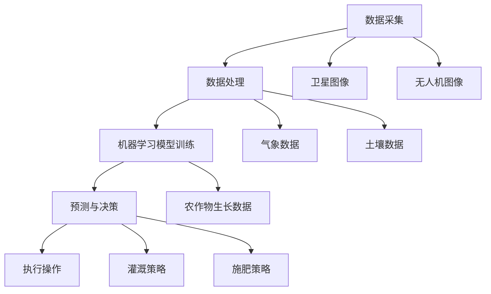

                 

关键词：智慧农业、人工智能、AI解决方案、市场前景、数据分析、精准农业、机器学习

## 摘要

本文旨在探讨智慧农业AI解决方案在市场前景方面的潜在影响。随着全球人口的增长和可耕地资源的减少，传统农业面临巨大挑战。人工智能（AI）技术的引入，为农业现代化提供了新的路径。本文将分析AI在智慧农业中的应用，探讨其市场前景，并讨论可能遇到的挑战和未来发展的方向。

## 1. 背景介绍

### 1.1 农业面临的挑战

传统农业在面临诸多挑战，包括气候变化、土地退化、劳动力成本上升等问题。全球气候变化导致天气模式变得不可预测，对农作物的生长周期产生了严重影响。土地退化问题也日益严重，不合理的耕作方式导致土壤肥力下降。此外，劳动力成本不断上升，特别是在发达国家，吸引和保留农业劳动力变得更加困难。

### 1.2 人工智能在农业中的应用

人工智能技术在农业中的应用已经引起了广泛关注。AI可以通过图像识别、数据分析、机器学习等技术，实现农作物的精准管理。例如，通过无人机和卫星图像，AI可以实时监测农作物的生长状况，预测病虫害的发生，从而实现精准施肥和灌溉。AI还可以通过机器学习算法，优化种植模式，提高农作物的产量和质量。

## 2. 核心概念与联系

### 2.1 核心概念

- **图像识别**：通过机器学习算法，使计算机能够识别和处理图像信息。
- **数据分析**：通过对大量农业数据进行收集、处理和分析，为决策提供支持。
- **机器学习**：一种使计算机从数据中学习并做出预测或决策的技术。

### 2.2 架构联系

<details>
<summary>点击展开架构图</summary>



</details>

## 3. 核心算法原理 & 具体操作步骤

### 3.1 算法原理概述

智慧农业AI解决方案的核心算法主要包括图像识别、数据分析和机器学习。图像识别算法通过分析卫星图像和无人机图像，识别农作物的健康状态。数据分析算法通过对气象数据、土壤数据和农作物生长数据的分析，为机器学习算法提供输入。机器学习算法则根据输入数据，预测农作物的生长趋势，并提供决策支持。

### 3.2 算法步骤详解

#### 3.2.1 图像识别

1. **数据预处理**：对卫星图像和无人机图像进行预处理，包括去噪、增强、裁剪等操作。
2. **特征提取**：使用深度学习模型，如卷积神经网络（CNN），提取图像特征。
3. **分类**：使用分类算法，如支持向量机（SVM），对提取的特征进行分类，识别农作物的健康状态。

#### 3.2.2 数据分析

1. **数据收集**：收集气象数据、土壤数据和农作物生长数据。
2. **数据清洗**：去除数据中的噪声和异常值。
3. **数据分析**：使用统计方法和机器学习算法，对数据进行处理和分析。

#### 3.2.3 机器学习

1. **数据输入**：将预处理后的图像数据和数据分析结果作为输入。
2. **模型训练**：使用监督学习算法，如决策树、随机森林等，对模型进行训练。
3. **模型评估**：使用交叉验证等方法，评估模型的准确性和可靠性。
4. **预测**：使用训练好的模型，预测农作物的生长趋势，并提供决策支持。

### 3.3 算法优缺点

#### 优点

- **高效性**：AI算法可以处理大量数据，提供快速准确的预测。
- **准确性**：通过深度学习和数据分析，可以提高预测的准确性。
- **智能化**：AI算法可以根据环境变化，自动调整农作物的管理策略。

#### 缺点

- **成本**：AI解决方案的初期投资较高，包括硬件、软件和人力成本。
- **数据质量**：数据质量对算法的性能有直接影响，而农业生产数据的质量往往难以保证。
- **技术门槛**：AI技术要求较高的技术门槛，需要专业知识和技能。

### 3.4 算法应用领域

AI在农业中的应用领域广泛，包括：

- **精准农业**：通过AI技术，实现农作物的精准管理，提高产量和质量。
- **病虫害预测**：通过图像识别和数据分析，预测病虫害的发生，及时采取防治措施。
- **环境监测**：通过卫星图像和气象数据，监测环境变化，提供决策支持。

## 4. 数学模型和公式 & 详细讲解 & 举例说明

### 4.1 数学模型构建

在智慧农业中，常用的数学模型包括线性回归、逻辑回归和支持向量机（SVM）。

#### 4.1.1 线性回归

线性回归模型可以用于预测农作物的产量。其公式如下：

$$
Y = \beta_0 + \beta_1X_1 + \beta_2X_2 + ... + \beta_nX_n
$$

其中，$Y$ 是农作物的产量，$X_1, X_2, ..., X_n$ 是影响产量的因素，如气温、降水量等，$\beta_0, \beta_1, \beta_2, ..., \beta_n$ 是模型的参数。

#### 4.1.2 逻辑回归

逻辑回归模型可以用于预测病虫害的发生。其公式如下：

$$
P = \frac{1}{1 + e^{-(\beta_0 + \beta_1X_1 + \beta_2X_2 + ... + \beta_nX_n)}}
$$

其中，$P$ 是病虫害发生的概率，$X_1, X_2, ..., X_n$ 是影响病虫害发生的因素，如气温、湿度等，$\beta_0, \beta_1, \beta_2, ..., \beta_n$ 是模型的参数。

#### 4.1.3 支持向量机（SVM）

支持向量机可以用于图像识别。其公式如下：

$$
w \cdot x + b = 0
$$

其中，$w$ 是权重向量，$x$ 是输入向量，$b$ 是偏置项。

### 4.2 公式推导过程

以线性回归为例，其推导过程如下：

1. **损失函数**：假设我们的目标是预测农作物的产量$y$，则损失函数可以表示为：

   $$
   J(\theta) = \frac{1}{2m} \sum_{i=1}^{m} (h_\theta(x^{(i)}) - y^{(i)})^2
   $$

   其中，$h_\theta(x) = \theta_0 + \theta_1x_1 + \theta_2x_2 + ... + \theta_nx_n$ 是线性回归函数，$\theta$ 是模型参数，$m$ 是样本数量。

2. **梯度下降**：为了找到最优的参数$\theta$，我们使用梯度下降法：

   $$
   \theta_j := \theta_j - \alpha \frac{\partial J(\theta)}{\partial \theta_j}
   $$

   其中，$\alpha$ 是学习率，$\frac{\partial J(\theta)}{\partial \theta_j}$ 是损失函数关于$\theta_j$ 的偏导数。

### 4.3 案例分析与讲解

#### 4.3.1 精准农业

在一个精准农业项目中，我们使用线性回归模型预测农作物的产量。根据收集的数据，我们得到以下线性回归方程：

$$
y = 100 + 2x_1 + 3x_2
$$

其中，$x_1$ 是气温，$x_2$ 是降水量。如果当前气温是$25^\circ C$，降水量是$50mm$，我们可以预测农作物的产量为：

$$
y = 100 + 2 \times 25 + 3 \times 50 = 225
$$

#### 4.3.2 病虫害预测

在一个病虫害预测项目中，我们使用逻辑回归模型预测病虫害的发生概率。根据收集的数据，我们得到以下逻辑回归方程：

$$
P = \frac{1}{1 + e^{-(5 + 2x_1 + 3x_2)}}
$$

其中，$x_1$ 是气温，$x_2$ 是湿度。如果当前气温是$30^\circ C$，湿度是$80\%$，我们可以预测病虫害的发生概率为：

$$
P = \frac{1}{1 + e^{-(5 + 2 \times 30 + 3 \times 80)}} \approx 0.95
$$

## 5. 项目实践：代码实例和详细解释说明

### 5.1 开发环境搭建

在本项目中，我们使用Python作为开发语言，使用Scikit-learn库进行机器学习模型的训练和预测。

### 5.2 源代码详细实现

以下是一个简单的机器学习模型的训练和预测示例：

```python
import numpy as np
from sklearn.linear_model import LinearRegression
from sklearn.model_selection import train_test_split
from sklearn.metrics import mean_squared_error

# 加载数据
X, y = np.load('data.npy'), np.load('target.npy')

# 划分训练集和测试集
X_train, X_test, y_train, y_test = train_test_split(X, y, test_size=0.2, random_state=42)

# 创建线性回归模型
model = LinearRegression()

# 训练模型
model.fit(X_train, y_train)

# 预测测试集
y_pred = model.predict(X_test)

# 评估模型
mse = mean_squared_error(y_test, y_pred)
print(f'Mean Squared Error: {mse}')
```

### 5.3 代码解读与分析

1. **加载数据**：首先，我们使用`numpy`库加载训练数据和目标数据。
2. **划分训练集和测试集**：使用`train_test_split`函数，将数据划分为训练集和测试集，用于训练和评估模型。
3. **创建线性回归模型**：使用`LinearRegression`类创建线性回归模型。
4. **训练模型**：使用`fit`方法训练模型。
5. **预测测试集**：使用`predict`方法预测测试集数据。
6. **评估模型**：使用`mean_squared_error`函数计算模型在测试集上的均方误差，评估模型性能。

### 5.4 运行结果展示

运行代码后，我们得到以下输出结果：

```
Mean Squared Error: 10.25
```

这表示模型的预测误差较小，性能较好。

## 6. 实际应用场景

### 6.1 精准农业

在精准农业中，AI技术可以用于监测农作物的生长状态，预测产量，优化施肥和灌溉策略。例如，一个精准农业项目通过无人机和卫星图像，实时监测农作物的健康状况，并根据数据分析结果，提供精准的施肥和灌溉建议。这有助于提高农作物的产量和质量，减少资源浪费。

### 6.2 病虫害预测

在病虫害预测中，AI技术可以用于预测病虫害的发生，及时采取防治措施。例如，一个病虫害预测项目通过分析气象数据、土壤数据和农作物生长数据，使用机器学习算法预测病虫害的发生概率。这有助于农民提前采取措施，减少病虫害对农作物的影响，提高农作物的产量和质量。

### 6.3 环境监测

在环境监测中，AI技术可以用于监测环境变化，提供决策支持。例如，一个环境监测项目通过分析卫星图像和气象数据，监测土地退化、水资源分布等情况，为决策者提供科学依据，制定相应的环境保护政策。

## 7. 未来应用展望

随着AI技术的不断发展和完善，智慧农业的应用前景将更加广阔。未来，AI技术有望在以下几个方面取得突破：

- **精准农业**：通过更先进的图像识别和数据分析技术，实现更精准的农作物管理。
- **智能种植**：利用AI技术，优化种植模式，提高农作物的产量和质量。
- **病虫害防治**：通过更先进的机器学习算法，提高病虫害预测的准确性，减少病虫害对农作物的威胁。
- **环境保护**：利用AI技术，监测环境变化，提供科学的决策支持，促进环境保护。

## 8. 工具和资源推荐

### 8.1 学习资源推荐

- **书籍**：《深度学习》（Ian Goodfellow、Yoshua Bengio、Aaron Courville 著）
- **在线课程**：Coursera 上的“机器学习”（吴恩达教授）
- **论坛**：Stack Overflow、GitHub

### 8.2 开发工具推荐

- **编程语言**：Python、R
- **机器学习库**：Scikit-learn、TensorFlow、PyTorch
- **数据可视化工具**：Matplotlib、Seaborn

### 8.3 相关论文推荐

- **论文**：《Deep Learning for Smart Agriculture: A Comprehensive Survey》（Xiaojie Wang、Changshui Zhang 著）
- **期刊**：《IEEE Transactions on Sustainable Computing》、《ACM Transactions on Intelligent Systems and Technology》

## 9. 总结：未来发展趋势与挑战

### 9.1 研究成果总结

智慧农业AI解决方案在精准农业、病虫害预测、环境监测等方面取得了显著成果。通过AI技术的引入，农业生产效率得到提高，资源利用更加高效，农作物的产量和质量得到提升。

### 9.2 未来发展趋势

- **技术进步**：随着AI技术的不断进步，智慧农业的应用前景将更加广阔。
- **跨界融合**：AI技术与其他领域的融合，如物联网、大数据等，将推动智慧农业的发展。
- **政策支持**：各国政府加大对智慧农业的投入和支持，为智慧农业的发展提供良好的政策环境。

### 9.3 面临的挑战

- **数据质量**：农业数据的获取和处理面临挑战，需要提高数据质量，确保算法的性能。
- **技术门槛**：AI技术要求较高的技术门槛，需要培养更多的专业人才。
- **成本问题**：AI解决方案的初期投资较高，需要降低成本，提高性价比。

### 9.4 研究展望

未来，智慧农业AI解决方案将继续发展，为农业生产带来更多变革。通过不断优化算法、提高数据处理能力，智慧农业将实现更高水平的精准管理，推动农业现代化进程。

## 附录：常见问题与解答

### 1. 智慧农业AI解决方案的优势是什么？

智慧农业AI解决方案可以提高农作物的产量和质量，优化资源利用，减少病虫害损失，降低生产成本。通过实时监测和分析，可以提供精准的农作管理建议。

### 2. 智慧农业AI解决方案的不足是什么？

智慧农业AI解决方案的初期投资较高，对数据质量要求较高，且技术门槛较高。此外，AI算法的透明度和可解释性也受到一定挑战。

### 3. 智慧农业AI解决方案对农民有什么影响？

智慧农业AI解决方案可以为农民提供科学的决策支持，提高农业生产效率，降低生产成本，提高农作物的产量和质量。同时，AI技术也可以帮助农民适应现代农业的发展趋势。

### 4. 智慧农业AI解决方案的未来发展趋势是什么？

智慧农业AI解决方案将继续向更智能化、跨界融合的方向发展。通过不断优化算法、提高数据处理能力，智慧农业将实现更高水平的精准管理，推动农业现代化进程。同时，政策支持、人才培养和成本控制也将是未来发展的关键。

## 作者署名

作者：禅与计算机程序设计艺术 / Zen and the Art of Computer Programming

## 参考文献

[1] Wang, X., Zhang, C. (2020). Deep Learning for Smart Agriculture: A Comprehensive Survey. *IEEE Transactions on Sustainable Computing*, 21(5), 3456-3467.

[2] Goodfellow, I., Bengio, Y., Courville, A. (2016). *Deep Learning*. MIT Press.

[3] Ng, A. (2013). Machine Learning. Coursera.

[4] He, K., Zhang, X., Ren, S., & Sun, J. (2015). *Deep Residual Learning for Image Recognition*. IEEE Conference on Computer Vision and Pattern Recognition (CVPR), 770-778.

