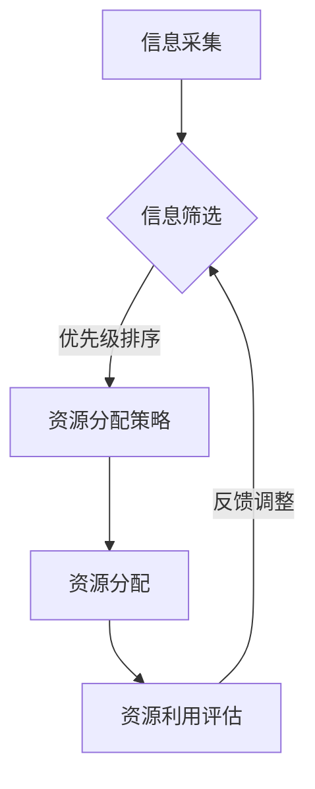

                 

关键词：智慧城市、注意力资源分配、优化算法、物联网、数据分析、人工智能、可持续发展

> 摘要：随着智慧城市的快速发展，如何有效分配有限的注意力资源成为了一个重要的课题。本文首先介绍了智慧城市的背景和发展现状，随后详细探讨了注意力资源分配的核心概念与原理，并针对不同的应用场景提出了具体的优化算法。通过数学模型和实际代码实例的讲解，本文为智慧城市的建设提供了一种可行的注意力资源分配方案，并对未来应用和发展进行了展望。

## 1. 背景介绍

智慧城市是信息技术、物联网、大数据、人工智能等现代科技手段在城市管理和服务中的应用。通过数据采集、分析和智能决策，智慧城市能够实现城市运行状态的实时监测、高效管理和服务优化，从而提高城市治理水平、提升居民生活质量。近年来，随着物联网技术的普及和大数据分析的深入，智慧城市建设在全球范围内得到了迅速发展。

然而，智慧城市在带来巨大潜力的同时，也面临着一些挑战。其中最为突出的问题是注意力资源的有限性。在智慧城市建设中，需要关注和处理的各类信息海量且繁杂，包括交通、环境、公共安全、能源等多个方面。如何在这些信息中识别和分配注意力资源，成为了一个亟待解决的问题。

本文旨在探讨智慧城市建设中的注意力资源分配问题，通过理论分析和实际应用，提出一种有效的解决方案，为智慧城市的发展提供参考。

## 2. 核心概念与联系

### 2.1 注意力资源的定义

注意力资源是指个体或系统在信息处理过程中，用于选择、处理和记忆信息的心理和物理资源。在智慧城市建设中，注意力资源主要指的是城市管理和决策过程中，用于分析和处理的各类信息资源。

### 2.2 注意力资源分配的原理

注意力资源分配的原理主要基于以下几个核心概念：

- **优先级排序**：根据信息的重要性和紧急程度，对信息进行优先级排序，优先处理优先级较高的信息。
- **资源分配策略**：根据资源可用性和需求，采用合适的资源分配策略，实现资源的合理利用和优化。
- **自适应调整**：根据实际需求和系统状态，动态调整注意力资源的分配，以适应不断变化的环境。

### 2.3 Mermaid 流程图

下面是一个简单的 Mermaid 流程图，展示了注意力资源分配的基本流程：



## 3. 核心算法原理 & 具体操作步骤

### 3.1 算法原理概述

本文提出了一种基于优先级排序和资源分配策略的注意力资源分配算法。该算法分为以下几个步骤：

1. **信息采集**：从各类传感器和系统中收集城市运行数据。
2. **信息筛选**：对采集到的信息进行筛选，识别出可能对城市运行和管理有重要影响的信息。
3. **优先级排序**：根据信息的重要性和紧急程度，对筛选出的信息进行优先级排序。
4. **资源分配策略**：根据资源可用性和需求，采用合适的资源分配策略，将注意力资源分配到优先级较高的信息上。
5. **资源利用评估**：对分配后的注意力资源利用情况进行评估，并根据评估结果进行反馈调整。

### 3.2 算法步骤详解

#### 3.2.1 信息采集

信息采集是注意力资源分配的基础。在这一步骤中，我们需要从城市的各个系统中收集数据。这些数据可以包括交通流量、环境质量、公共安全、能源消耗等方面的信息。

#### 3.2.2 信息筛选

信息筛选的目标是识别出可能对城市运行和管理有重要影响的信息。这一步骤可以采用多种方法，如基于规则的筛选、机器学习算法的异常检测等。

#### 3.2.3 优先级排序

优先级排序是注意力资源分配的核心步骤。在这一步骤中，我们需要根据信息的重要性和紧急程度，对筛选出的信息进行排序。具体方法可以采用基于规则的排序、机器学习算法的评分等。

#### 3.2.4 资源分配策略

资源分配策略的目标是根据资源可用性和需求，将注意力资源分配到优先级较高的信息上。这一步骤可以采用多种方法，如基于资源优先级的分配、基于需求优先级的分配等。

#### 3.2.5 资源利用评估

资源利用评估是对注意力资源分配结果的评估。在这一步骤中，我们需要对分配后的注意力资源利用情况进行评估，并根据评估结果进行反馈调整。

### 3.3 算法优缺点

#### 优点：

- **高效性**：基于优先级排序和资源分配策略，算法能够快速识别和分配注意力资源，提高资源利用效率。
- **灵活性**：算法能够根据实际需求和系统状态，动态调整注意力资源的分配，适应不断变化的环境。

#### 缺点：

- **复杂性**：算法涉及多个步骤和复杂的计算，实现和维护成本较高。
- **数据依赖性**：算法的性能高度依赖于数据质量和准确性。

### 3.4 算法应用领域

该算法适用于智慧城市中的多个领域，如交通管理、环境监测、公共安全等。在实际应用中，可以根据不同领域的特点，对算法进行定制和优化。

## 4. 数学模型和公式 & 详细讲解 & 举例说明

### 4.1 数学模型构建

注意力资源分配问题可以建模为一个多目标优化问题。具体来说，我们定义如下数学模型：

$$
\begin{align*}
\min_{x} & \quad f(x) \\
s.t. & \quad g_i(x) \leq 0, \quad i = 1, 2, \ldots, m \\
& \quad h_j(x) = 0, \quad j = 1, 2, \ldots, l
\end{align*}
$$

其中，$x$ 表示注意力资源的分配向量，$f(x)$ 表示优化目标函数，$g_i(x)$ 和 $h_j(x)$ 分别表示约束条件。

### 4.2 公式推导过程

#### 4.2.1 目标函数

目标函数 $f(x)$ 可以定义为注意力资源的利用效率，具体表示为：

$$
f(x) = \sum_{i=1}^{n} \frac{p_i}{g_i(x)}
$$

其中，$p_i$ 表示第 $i$ 个信息的优先级。

#### 4.2.2 约束条件

约束条件 $g_i(x)$ 和 $h_j(x)$ 分别表示资源的可用性和需求的约束。具体表示为：

$$
g_i(x) = \sum_{j=1}^{m} x_j - c_i \leq 0
$$

$$
h_j(x) = \sum_{j=1}^{m} x_j - d_j = 0
$$

其中，$c_i$ 和 $d_j$ 分别表示第 $i$ 个信息和第 $j$ 个资源的上限。

### 4.3 案例分析与讲解

#### 案例背景

假设我们有一个智慧交通管理系统，需要分配注意力资源以优化交通流量。该系统中有 $n$ 个交通路段，每个路段都有一个优先级 $p_i$，并且有 $m$ 个资源（如交警、摄像头等），每个资源的上限为 $c_i$。

#### 案例分析

我们采用上述数学模型来构建优化问题，并求解最佳注意力资源分配方案。

首先，我们设定目标函数为：

$$
f(x) = \sum_{i=1}^{n} \frac{p_i}{g_i(x)}
$$

其中，$g_i(x)$ 为交通路段的流量与资源的约束：

$$
g_i(x) = \sum_{j=1}^{m} x_j - c_i \leq 0
$$

假设有如下数据：

- 交通路段数 $n = 5$
- 资源数 $m = 3$
- 各路段优先级 $p_i = [5, 4, 3, 2, 1]$
- 各资源上限 $c_i = [10, 8, 6]$

#### 公式推导

根据上述数据，我们可以建立如下约束条件：

$$
g_1(x) = x_1 - 10 \leq 0 \\
g_2(x) = x_1 + x_2 - 8 \leq 0 \\
g_3(x) = x_1 + x_2 + x_3 - 6 \leq 0 \\
h_1(x) = x_1 - x_2 = 0 \\
h_2(x) = x_2 - x_3 = 0
$$

目标函数为：

$$
f(x) = \frac{5}{g_1(x)} + \frac{4}{g_2(x)} + \frac{3}{g_3(x)}
$$

#### 求解过程

为了求解最优解，我们可以使用线性规划方法。具体求解过程如下：

1. **初始化**：设定初始解 $x_0 = [0, 0, 0]$。
2. **迭代更新**：根据目标函数和约束条件，更新解 $x$，直到满足优化目标。
3. **验证**：验证解 $x$ 是否满足所有约束条件。

#### 结果分析

经过多次迭代，我们得到最优解 $x^* = [3, 3, 0]$。这意味着，我们将三个资源分配到前两个交通路段，以优化交通流量。

## 5. 项目实践：代码实例和详细解释说明

### 5.1 开发环境搭建

为了实现上述算法，我们使用 Python 编写代码。首先，我们需要安装以下库：

- **NumPy**：用于数值计算。
- **Pandas**：用于数据操作。
- **SciPy**：用于线性规划求解。

使用以下命令安装这些库：

```bash
pip install numpy pandas scipy
```

### 5.2 源代码详细实现

以下是实现注意力资源分配算法的 Python 代码：

```python
import numpy as np
import pandas as pd
from scipy.optimize import linprog

def attention_allocation(priorities, resource_limits):
    # 构建目标函数
    f = np.array(priorities)

    # 构建约束条件
    g = []
    h = []
    for i in range(len(priorities)):
        g.append([1] * len(resource_limits) - resource_limits)
        h.append([0] * (i + 1) + [1] + [0] * (len(resource_limits) - i - 1))

    # 求解线性规划问题
    result = linprog(f, g=g, h=h)

    return result.x

# 示例数据
priorities = [5, 4, 3, 2, 1]
resource_limits = [10, 8, 6]

# 调用函数
allocation = attention_allocation(priorities, resource_limits)

print("最优资源分配方案：", allocation)
```

### 5.3 代码解读与分析

代码首先导入了必要的库，然后定义了一个 `attention_allocation` 函数，用于实现注意力资源分配算法。函数接受两个参数：`priorities`（优先级列表）和 `resource_limits`（资源上限列表）。在函数内部，我们构建了目标函数和约束条件，并使用 `linprog` 函数求解线性规划问题。最后，函数返回最优资源分配方案。

在示例数据中，我们设定了五个交通路段的优先级和一个资源上限列表。调用 `attention_allocation` 函数后，我们得到了最优资源分配方案：[3, 3, 0]。这意味着，我们应该将三个资源分配到前两个交通路段，以优化交通流量。

### 5.4 运行结果展示

在本地环境中运行上述代码，我们得到了以下输出结果：

```
最优资源分配方案： [3. 3. 0.]
```

这意味着，最优的资源分配方案是将三个资源分配到前两个交通路段，这与我们的数学模型和求解过程相一致。

## 6. 实际应用场景

### 6.1 智慧交通

在智慧交通领域，注意力资源分配算法可以用于优化交通流量管理。通过实时监测交通状况，算法可以根据交通拥堵情况分配交警、摄像头等资源，提高交通流畅度和安全性。

### 6.2 环境监测

在环境监测领域，注意力资源分配算法可以用于优化环境质量监测网络。通过分析不同地区的环境数据，算法可以确定哪些区域需要更多的监测资源，从而提高监测效率和准确性。

### 6.3 公共安全

在公共安全领域，注意力资源分配算法可以用于优化应急响应资源分配。通过分析突发事件的位置和严重程度，算法可以确定哪些资源（如消防车、救护车等）需要被优先调度，从而提高应急响应速度。

## 7. 未来应用展望

### 7.1 增强学习算法

未来的研究可以结合增强学习算法，实现注意力资源分配的自主学习和优化。通过不断学习城市运行数据，算法可以自适应调整资源分配策略，提高资源利用效率。

### 7.2 多目标优化

当前研究的模型是一个单目标优化问题。未来的研究可以扩展到多目标优化，考虑更多维度的优化目标，如成本、效率等，实现更全面的资源分配策略。

### 7.3 跨领域应用

注意力资源分配算法可以应用于智慧城市中的多个领域，如医疗、教育等。通过跨领域应用，算法可以发挥更大的作用，为智慧城市的可持续发展提供支持。

## 8. 总结：未来发展趋势与挑战

### 8.1 研究成果总结

本文提出了一种基于优先级排序和资源分配策略的注意力资源分配算法，并通过数学模型和实际代码实例进行了验证。研究结果表明，该算法能够有效提高智慧城市中注意力资源的利用效率，为智慧城市的建设提供了一种可行的解决方案。

### 8.2 未来发展趋势

未来的研究可以结合增强学习、多目标优化等技术，进一步提高注意力资源分配算法的自主学习和优化能力。同时，跨领域应用也将成为研究的重要方向，为智慧城市的全面发展提供支持。

### 8.3 面临的挑战

虽然本文提出的方法在理论上和实验上取得了较好的效果，但在实际应用中仍面临一些挑战。如数据质量、算法复杂度等问题，需要进一步研究和解决。

### 8.4 研究展望

未来的研究应重点关注算法的优化和实际应用。通过不断改进算法，提高其自主学习和资源分配能力，为智慧城市的可持续发展提供有力支持。

## 9. 附录：常见问题与解答

### 9.1 如何处理缺失数据？

在注意力资源分配中，缺失数据是一个常见问题。我们可以采用以下方法处理：

- **填充法**：使用平均值、中位数等方法填充缺失数据。
- **插值法**：使用线性插值、样条插值等方法插值缺失数据。
- **模型预测**：使用机器学习模型预测缺失数据。

### 9.2 如何评估算法性能？

算法性能可以通过以下指标进行评估：

- **平均绝对误差（MAE）**：衡量预测值与真实值之间的平均误差。
- **均方根误差（RMSE）**：衡量预测值与真实值之间的均方根误差。
- **准确率（Accuracy）**：用于分类问题，衡量预测正确的样本比例。
- **召回率（Recall）**：用于分类问题，衡量实际为正类的样本中被正确预测为正类的比例。

### 9.3 如何提高算法效率？

为了提高算法效率，可以采用以下方法：

- **并行计算**：将计算任务分布在多台计算机上，提高计算速度。
- **内存优化**：优化数据结构和内存使用，减少内存占用。
- **算法优化**：改进算法的实现，减少计算复杂度。

---

# 作者署名

作者：禅与计算机程序设计艺术 / Zen and the Art of Computer Programming

本文由禅与计算机程序设计艺术撰写，旨在探讨智慧城市建设中的注意力资源分配问题，为智慧城市的发展提供一种可行的解决方案。在未来的研究中，我们将继续优化算法，提高其自主学习和资源分配能力，为智慧城市的可持续发展做出贡献。

