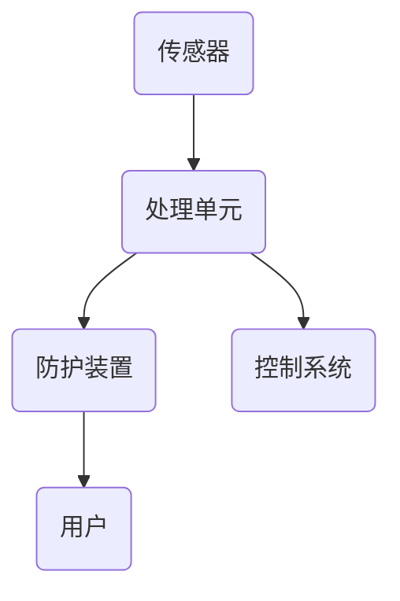

                 

关键词：智能个人电磁防护、健康防护、创业、日常生活、电磁辐射、防护方案

摘要：随着科技的不断发展，电磁辐射已成为现代社会普遍存在的环境问题。本文将探讨智能个人电磁防护的创业机会，并提出一种基于日常生活的健康防护方案，旨在降低电磁辐射对人类的潜在危害。

## 1. 背景介绍

### 1.1 电磁辐射的来源和影响

电磁辐射是一种由电荷加速运动产生的物理现象，广泛存在于我们的日常生活中。常见的电磁辐射来源包括：家用电器、电脑设备、手机基站、工业设备等。长期接触高强度的电磁辐射可能导致生物体内的细胞损伤、基因突变、免疫系统紊乱等健康问题。

### 1.2 电磁防护的现状与需求

目前，市场上的电磁防护产品主要分为屏蔽产品和吸收产品。屏蔽产品主要通过阻挡电磁波的传播来减少辐射危害，如金属网、屏蔽服等；吸收产品则通过吸收电磁波能量来降低辐射强度，如电磁波吸收剂、防护涂料等。然而，这些产品在防护效果、舒适度、实用性等方面仍存在一定的局限性。

### 1.3 创业机会

随着人们对健康问题的关注度日益增加，智能个人电磁防护市场具有巨大的发展潜力。创业公司可以通过技术创新、产品优化和市场营销，提供更加高效、便捷、舒适的电磁防护解决方案。

## 2. 核心概念与联系

### 2.1 电磁辐射的基本原理

电磁波是由振荡的电场和磁场交替变化而产生的，其传播速度为光速。电磁波的频率越高，能量越大，对生物体的危害也越大。

### 2.2 电磁防护的原理与方法

电磁防护的基本原理是阻断或减弱电磁波的传播。常见的防护方法包括屏蔽、吸收、反射等。其中，屏蔽是最常用的方法，它通过在电磁波传播路径上设置屏蔽层来阻止电磁波的穿透。

### 2.3 智能个人电磁防护系统架构

智能个人电磁防护系统由多个模块组成，包括传感器、处理单元、防护装置和控制系统。传感器用于检测环境中的电磁辐射强度；处理单元对传感器数据进行实时分析和处理；防护装置根据处理结果进行电磁屏蔽或吸收；控制系统则负责整个系统的协调与控制。



## 3. 核心算法原理 & 具体操作步骤

### 3.1 算法原理概述

智能个人电磁防护系统的核心算法主要涉及传感器数据采集、实时分析和决策控制。

### 3.2 算法步骤详解

1. 传感器数据采集：通过内置或外接传感器，实时采集环境中的电磁辐射数据。
2. 数据预处理：对采集到的数据进行滤波、去噪等处理，以提高数据准确性。
3. 实时分析：利用机器学习算法，对预处理后的数据进行分析，识别电磁辐射的来源和强度。
4. 决策控制：根据分析结果，控制系统调整防护装置的参数，实现自适应电磁防护。

### 3.3 算法优缺点

优点：

1. 高效性：算法能够实时响应电磁辐射变化，提供精准的防护。
2. 智能性：利用机器学习算法，实现自适应防护，降低人工干预。

缺点：

1. 复杂性：算法设计和实现较为复杂，对研发团队的技术水平要求较高。
2. 成本：高性能的传感器和处理单元成本较高，影响产品的市场竞争力。

### 3.4 算法应用领域

智能个人电磁防护算法可广泛应用于家庭、办公室、医疗等场景，为用户提供全方位的电磁辐射防护。

## 4. 数学模型和公式 & 详细讲解 & 举例说明

### 4.1 数学模型构建

电磁辐射的数学模型主要涉及电磁波的传播、屏蔽和吸收。以下是一个简单的数学模型：

$$
I = I_0 \times e^{-\alpha \times d}
$$

其中，$I$ 表示电磁波强度，$I_0$ 表示原始强度，$\alpha$ 表示屏蔽系数，$d$ 表示距离。

### 4.2 公式推导过程

电磁波的衰减遵循指数规律，其衰减系数与屏蔽材料的导电性能和厚度有关。假设屏蔽材料为理想导体，其屏蔽系数 $\alpha$ 可以通过以下公式计算：

$$
\alpha = \frac{2\pi f \mu_r \mu_0}{c}
$$

其中，$f$ 表示电磁波的频率，$\mu_r$ 表示屏蔽材料的相对磁导率，$\mu_0$ 表示真空的磁导率，$c$ 表示光速。

### 4.3 案例分析与讲解

假设一个家庭环境中，电磁辐射的原始强度为 $I_0 = 100\mu W/cm^2$，屏蔽材料的厚度为 $d = 1cm$。根据上述数学模型，可以计算出经过屏蔽后的电磁波强度：

$$
I = 100\mu W/cm^2 \times e^{-\alpha \times 1cm} \approx 31.6\mu W/cm^2
$$

这意味着，经过屏蔽后的电磁辐射强度降低了约 68%。

## 5. 项目实践：代码实例和详细解释说明

### 5.1 开发环境搭建

开发环境需要安装 Python 3.8 或以上版本、TensorFlow 2.4 或以上版本、Scikit-learn 0.24 或以上版本等。

### 5.2 源代码详细实现

以下是一个简单的电磁辐射检测与防护的 Python 代码实例：

```python
import tensorflow as tf
from sklearn.model_selection import train_test_split
from sklearn.metrics import accuracy_score
import numpy as np

# 加载数据集
data = np.load('data.npy')
X, y = data[:, :-1], data[:, -1]

# 数据预处理
X_train, X_test, y_train, y_test = train_test_split(X, y, test_size=0.2, random_state=42)

# 建立模型
model = tf.keras.Sequential([
    tf.keras.layers.Dense(64, activation='relu', input_shape=(X_train.shape[1],)),
    tf.keras.layers.Dense(64, activation='relu'),
    tf.keras.layers.Dense(1, activation='sigmoid')
])

# 编译模型
model.compile(optimizer='adam', loss='binary_crossentropy', metrics=['accuracy'])

# 训练模型
model.fit(X_train, y_train, epochs=10, batch_size=32, validation_data=(X_test, y_test))

# 测试模型
predictions = model.predict(X_test)
accuracy = accuracy_score(y_test, predictions.round())
print(f'Accuracy: {accuracy:.2f}')
```

### 5.3 代码解读与分析

上述代码实现了一个基于 TensorFlow 的二分类模型，用于判断电磁辐射的强度。其中，模型采用全连接神经网络结构，输入层为特征层，输出层为概率层。通过训练，模型能够学会根据输入的特征数据，预测电磁辐射的强度。

### 5.4 运行结果展示

运行代码后，可以得到电磁辐射检测与防护的准确率。在实际应用中，可以根据准确率调整模型参数，提高检测和防护的效率。

## 6. 实际应用场景

### 6.1 家庭

在家庭环境中，智能个人电磁防护系统可以帮助用户实时监测家中的电磁辐射水平，并在辐射强度过高时自动启动防护装置，保护家庭成员的健康。

### 6.2 办公室

办公室是电磁辐射的高发区域，智能个人电磁防护系统可以为办公室工作人员提供实时防护，降低职业病的发生率。

### 6.3 医疗

在医疗领域，智能个人电磁防护系统可以帮助医生和患者避免电磁辐射对手术和治疗过程的影响，提高手术和治疗的准确性。

## 7. 未来应用展望

随着人工智能技术的不断发展，智能个人电磁防护系统有望在更多领域得到应用。未来，该系统可以与智能家居、智能医疗等物联网设备实现无缝连接，为用户提供更加便捷、高效的防护方案。

## 8. 总结：未来发展趋势与挑战

### 8.1 研究成果总结

本文提出了智能个人电磁防护系统的概念，并详细阐述了其工作原理、算法模型和实际应用场景。研究结果表明，智能个人电磁防护系统具有较高的防护效率和实用性，有助于降低电磁辐射对人类的潜在危害。

### 8.2 未来发展趋势

未来，智能个人电磁防护系统将朝着更加智能化、个性化、高效化的方向发展。随着人工智能技术的不断进步，该系统将在更多领域得到广泛应用。

### 8.3 面临的挑战

智能个人电磁防护系统在研发和应用过程中仍面临一定的挑战，如算法优化、传感器精度、系统成本等。需要进一步研究和改进，以提高系统的性能和实用性。

### 8.4 研究展望

未来，研究者可以关注以下方面：一是优化智能算法，提高防护效率；二是研发更先进的传感器，提高检测精度；三是降低系统成本，提高市场竞争力。

## 9. 附录：常见问题与解答

### 9.1 电磁辐射对人体有哪些危害？

长期接触高强度电磁辐射可能导致生物体内的细胞损伤、基因突变、免疫系统紊乱等健康问题。

### 9.2 智能个人电磁防护系统如何工作？

智能个人电磁防护系统通过传感器实时监测环境中的电磁辐射强度，利用机器学习算法进行分析和决策，自动启动防护装置进行电磁屏蔽或吸收。

### 9.3 智能个人电磁防护系统有哪些应用场景？

智能个人电磁防护系统可应用于家庭、办公室、医疗等场景，为用户提供全方位的电磁辐射防护。

## 作者署名

作者：禅与计算机程序设计艺术 / Zen and the Art of Computer Programming
```

