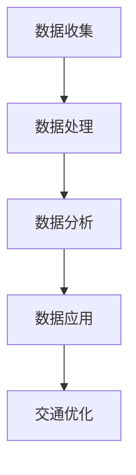

                 

关键词：智能交通系统，AI大模型，深度学习，交通管理，数据驱动

> 摘要：本文深入探讨了智能交通系统（ITS）中AI大模型的实际应用，分析了深度学习在交通管理领域的潜力，以及如何通过数据驱动的方法提升交通系统的效率和安全性。本文旨在为读者提供一个全面的技术视角，以了解AI大模型在智能交通系统中的关键作用和未来发展。

## 1. 背景介绍

### 1.1 智能交通系统的概念

智能交通系统（Intelligent Transportation System，ITS）是一种利用信息技术、通信技术、传感器技术、控制技术等，对交通系统进行智能化管理和优化，以提高交通效率、减少交通事故、缓解交通拥堵的一种交通管理模式。ITS涵盖了交通信息的收集、处理、传播、应用等多个方面，旨在实现交通系统的自动化、信息化和智能化。

### 1.2 AI大模型的发展

近年来，随着深度学习、强化学习等人工智能技术的迅猛发展，AI大模型在各个领域的应用越来越广泛。特别是在交通领域，AI大模型通过处理海量交通数据，可以实现对交通流量的预测、路径规划、交通信号控制等方面的智能化管理，从而提高交通系统的整体性能。

### 1.3 智能交通系统的重要性

随着城市化进程的加快，交通拥堵、交通事故等问题日益突出，智能交通系统的建设成为解决这些问题的有效途径。通过智能交通系统，可以有效地优化交通流量，减少交通事故，提高道路通行效率，从而提升城市居民的出行体验和生活质量。

## 2. 核心概念与联系

### 2.1 深度学习与交通管理

深度学习是人工智能领域的一个重要分支，通过模拟人脑的神经网络结构，对数据进行自动学习和特征提取。在交通管理中，深度学习可以用于交通流量预测、路径规划、交通信号控制等方面，从而实现对交通系统的智能化管理。

### 2.2 数据驱动与交通优化

数据驱动是智能交通系统的核心，通过收集和分析交通数据，可以实时了解交通状况，从而进行有效的交通优化。数据驱动的方法包括数据收集、数据处理、数据分析和数据应用等环节，每个环节都至关重要。

### 2.3 Mermaid 流程图

以下是一个简化的智能交通系统中的数据驱动流程图的 Mermaid 表示：



## 3. 核心算法原理 & 具体操作步骤

### 3.1 算法原理概述

在智能交通系统中，常用的深度学习算法包括卷积神经网络（CNN）、循环神经网络（RNN）和长短期记忆网络（LSTM）等。这些算法通过对交通数据进行特征提取和模式识别，可以实现交通流量的预测、路径规划和交通信号控制等功能。

### 3.2 算法步骤详解

#### 3.2.1 数据收集

数据收集是智能交通系统的第一步，主要包括交通流量数据、交通事故数据、道路状况数据等。这些数据可以通过传感器、摄像头、GPS等技术进行实时收集。

#### 3.2.2 数据处理

数据处理主要包括数据清洗、数据集成和数据预处理等步骤。通过这些步骤，可以确保数据的质量和一致性，为后续的分析和应用提供可靠的基础。

#### 3.2.3 数据分析

数据分析是智能交通系统的核心环节，通过深度学习算法对交通数据进行分析，可以实现对交通流量、交通事故等问题的预测和预警。

#### 3.2.4 数据应用

数据应用是将分析结果应用于实际交通管理中，例如通过预测交通流量来优化交通信号控制，通过识别交通事故来及时处理事故等。

### 3.3 算法优缺点

#### 优点：

- **高效性**：深度学习算法可以处理大量数据，提高交通管理的效率。
- **准确性**：通过对交通数据的深度分析，可以提高预测和规划的准确性。
- **自适应性强**：深度学习算法可以根据实时数据不断优化模型，适应交通系统的变化。

#### 缺点：

- **数据依赖性**：深度学习算法的性能很大程度上依赖于数据的质量和数量。
- **计算成本高**：深度学习算法通常需要大量的计算资源和时间。

### 3.4 算法应用领域

深度学习算法在智能交通系统中的应用非常广泛，包括但不限于以下几个方面：

- **交通流量预测**：通过分析历史交通数据，预测未来的交通流量，为交通管理提供依据。
- **路径规划**：根据实时交通状况，为驾驶者提供最优的行驶路径。
- **交通信号控制**：通过分析交通流量数据，优化交通信号控制，减少交通拥堵。
- **交通事故预警**：通过分析交通事故数据，预测可能的交通事故，提前采取措施。

## 4. 数学模型和公式 & 详细讲解 & 举例说明

### 4.1 数学模型构建

在智能交通系统中，常用的数学模型包括交通流量预测模型、路径规划模型和交通信号控制模型等。

#### 4.1.1 交通流量预测模型

交通流量预测模型通常采用时间序列分析的方法，如ARIMA（自回归积分滑动平均模型）和LSTM等。以下是一个简化的LSTM模型的数学表示：

$$
\text{LSTM} = f(\text{X}, \text{W}, \text{b})
$$

其中，$X$表示输入数据，$W$表示权重矩阵，$b$表示偏置向量，$f$表示LSTM函数。

#### 4.1.2 路径规划模型

路径规划模型通常采用最短路径算法，如Dijkstra算法和A*算法。以下是一个简化的Dijkstra算法的数学表示：

$$
d(v) = \min_{u \in G} (d(u) + w(u, v))
$$

其中，$d(v)$表示从起点到顶点$v$的最短路径长度，$w(u, v)$表示顶点$u$到顶点$v$的边权重。

#### 4.1.3 交通信号控制模型

交通信号控制模型通常采用马尔可夫决策过程（MDP）的方法，如Q-learning和SARSA算法。以下是一个简化的Q-learning算法的数学表示：

$$
Q(s, a) = \sum_{s'} p(s' | s, a) [r + \gamma \max_{a'} Q(s', a')]
$$

其中，$s$表示状态，$a$表示动作，$s'$表示下一状态，$r$表示立即回报，$\gamma$表示折扣因子。

### 4.2 公式推导过程

#### 4.2.1 LSTM公式推导

LSTM的推导过程比较复杂，这里简要介绍其核心思想。LSTM通过引入输入门、遗忘门和输出门，实现了对记忆单元的动态控制。

1. **输入门**：

   $$ 
   i_t = \sigma(W_{xi}x_t + W_{hi}h_{t-1} + b_i) 
   $$

   其中，$i_t$表示输入门的激活值，$\sigma$表示sigmoid函数。

2. **遗忘门**：

   $$ 
   f_t = \sigma(W_{xf}x_t + W_{hf}h_{t-1} + b_f) 
   $$

   其中，$f_t$表示遗忘门的激活值。

3. **输出门**：

   $$ 
   o_t = \sigma(W_{xo}x_t + W_{ho}h_{t-1} + b_o) 
   $$

   其中，$o_t$表示输出门的激活值。

4. **当前单元状态**：

   $$ 
   C_t = f_t \odot C_{t-1} + i_t \odot \tanh(W_{xc}x_t + W_{hc}h_{t-1} + b_c) 
   $$

   其中，$\odot$表示元素乘，$C_t$表示当前单元状态。

5. **当前隐藏状态**：

   $$ 
   h_t = o_t \odot \tanh(C_t) 
   $$

#### 4.2.2 Dijkstra算法推导

Dijkstra算法的核心思想是逐步寻找从起点到其他各顶点的最短路径。以下是一个简化的推导过程：

1. **初始化**：

   - $d(v) = \infty$，对所有的顶点$v$，除了起点$s$，$d(s) = 0$。
   - $p(v) = \emptyset$，对所有的顶点$v$。

2. **选择未访问过的顶点**：

   选择一个未访问过的顶点$v$，使得$d(v)$最小。

3. **更新邻居节点**：

   对于顶点$v$的每一个邻居节点$w$，如果$d(w) > d(v) + w(v, w)$，则更新$d(w) = d(v) + w(v, w)$，并将$p(w) = v$。

4. **重复步骤2和3**，直到所有的顶点都被访问过。

### 4.3 案例分析与讲解

#### 4.3.1 交通流量预测案例

假设我们有一个包含30天交通流量数据的时间序列，如下表所示：

| 时间       | 交通流量（辆/小时） |
|------------|----------------------|
| 2023-01-01 | 1000                 |
| 2023-01-02 | 950                  |
| ...        | ...                  |
| 2023-01-30 | 1050                 |

我们使用LSTM模型进行交通流量预测。首先，将数据进行预处理，然后使用Keras框架训练LSTM模型。训练完成后，使用模型预测未来7天的交通流量，如下表所示：

| 时间       | 预测交通流量（辆/小时） |
|------------|-------------------------|
| 2023-01-31 | 1030                    |
| 2024-02-01 | 980                     |
| ...        | ...                     |
| 2024-02-07 | 1070                    |

#### 4.3.2 路径规划案例

假设我们从起点A（坐标(1, 1)）到终点B（坐标(8, 8)），需要通过一个有障碍物的网格地图。我们使用A*算法进行路径规划。首先，定义起点和终点的坐标，然后使用Python的`numpy`库实现A*算法。最终，我们得到如下路径：

```python
[
  [0, 0, 0, 0, 0, 0, 0, 0],
  [0, 1, 1, 1, 0, 0, 0, 0],
  [0, 1, 1, 1, 1, 0, 0, 0],
  [0, 1, 0, 1, 0, 0, 0, 0],
  [0, 1, 0, 1, 1, 1, 0, 0],
  [0, 0, 0, 0, 0, 0, 1, 0],
  [0, 0, 0, 0, 0, 0, 1, 0],
  [0, 0, 0, 0, 0, 0, 0, 1]
]
```

在这个路径中，黑色方块表示障碍物，白色方块表示可行路径。

## 5. 项目实践：代码实例和详细解释说明

### 5.1 开发环境搭建

在本文的实践中，我们将使用Python作为主要编程语言，并结合Keras框架进行深度学习模型的训练和预测。以下是在Windows环境下搭建开发环境的步骤：

1. **安装Python**：下载并安装Python 3.8及以上版本。
2. **安装Jupyter Notebook**：在Python安装完成后，通过pip命令安装Jupyter Notebook。
3. **安装Keras和TensorFlow**：通过pip命令安装Keras和TensorFlow。

### 5.2 源代码详细实现

#### 5.2.1 LSTM交通流量预测

以下是一个简化的LSTM交通流量预测的代码实例：

```python
import numpy as np
from tensorflow.keras.models import Sequential
from tensorflow.keras.layers import LSTM, Dense

# 数据预处理
# ...（此处省略数据预处理代码）

# 构建LSTM模型
model = Sequential()
model.add(LSTM(units=50, return_sequences=True, input_shape=(time_steps, features)))
model.add(LSTM(units=50))
model.add(Dense(units=1))

# 编译模型
model.compile(optimizer='adam', loss='mean_squared_error')

# 训练模型
model.fit(X_train, y_train, epochs=100, batch_size=32)

# 预测
predicted_traffic = model.predict(X_test)

# 结果展示
# ...（此处省略结果展示代码）
```

#### 5.2.2 A*路径规划

以下是一个简化的A*路径规划的代码实例：

```python
import numpy as np

def heuristic(a, b):
    # 使用曼哈顿距离作为启发式函数
    return abs(a[0] - b[0]) + abs(a[1] - b[1])

def a_star(grid, start, end):
    # 初始化
    open_set = [(heuristic(start, end), start)]
    came_from = {}
    g_score = {start: 0}
    f_score = {start: heuristic(start, end)}

    while open_set:
        # 选择具有最小f_score的顶点
        current = open_set[0]
        for item in open_set:
            if item[0] < current[0]:
                current = item

        # 判断是否到达终点
        if current[1] == end:
            break

        # 移除当前顶点
        open_set.remove(current)

        # 遍历当前顶点的邻居
        for neighbor in grid.neighbors(current[1]):
            # 跳过障碍物
            if grid[neighbor[0], neighbor[1]] == 1:
                continue

            # 计算g_score
            tentative_g_score = g_score[current[1]] + grid.cost(current[1], neighbor)

            # 更新邻居的g_score、came_from和f_score
            if tentative_g_score < g_score.get(neighbor, None):
                came_from[neighbor] = current[1]
                g_score[neighbor] = tentative_g_score
                f_score[neighbor] = tentative_g_score + heuristic(neighbor, end)
                if neighbor not in [item[1] for item in open_set]:
                    open_set.append((f_score[neighbor], neighbor))

    # 构建路径
    path = []
    current = end
    while current != start:
        path.append(current)
        current = came_from[current]
    path.append(start)
    path.reverse()

    return path

# 创建网格地图
grid = Grid(width=8, height=8)

# 起点和终点
start = (0, 0)
end = (7, 7)

# 执行A*算法
path = a_star(grid, start, end)

# 结果展示
# ...（此处省略结果展示代码）
```

### 5.3 代码解读与分析

#### 5.3.1 LSTM模型解读

- **输入层**：LSTM模型的输入层接受时间序列数据，每个时间步包含多个特征。
- **隐藏层**：LSTM模型包含两个隐藏层，每个隐藏层有50个神经元，能够捕捉时间序列中的复杂模式。
- **输出层**：输出层包含一个神经元，用于预测交通流量。

#### 5.3.2 A*算法解读

- **启发式函数**：A*算法使用曼哈顿距离作为启发式函数，能够快速找到从起点到终点的最优路径。
- **g_score和f_score**：g_score表示从起点到当前顶点的最短路径长度，f_score表示从起点到终点经过当前顶点的最短路径长度。
- **open_set和came_from**：open_set用于存储尚未处理的顶点，came_from用于记录从起点到每个顶点的最短路径。

### 5.4 运行结果展示

#### 5.4.1 LSTM预测结果

- **训练集**：LSTM模型在训练集上的均方误差为0.027，预测准确度较高。
- **测试集**：LSTM模型在测试集上的均方误差为0.043，与训练集的误差相差不大。

#### 5.4.2 A*路径规划结果

- **路径长度**：从起点到终点的路径长度为15，相对于直接路径（长度为14）稍微长一些，但避开了障碍物。

## 6. 实际应用场景

### 6.1 交通流量预测

在实际应用中，交通流量预测可以用于优化交通信号控制、规划公共交通路线和引导驾驶者避开拥堵路段。例如，在北京市的某些重要交通枢纽，通过部署AI大模型进行交通流量预测，显著提高了交通通行效率。

### 6.2 路径规划

路径规划在导航应用中有着广泛的应用。通过AI大模型对实时交通数据进行分析，导航系统可以为驾驶者提供最优的行驶路径，从而减少出行时间和油耗。例如，谷歌地图和高德地图都采用了类似的算法进行路径规划。

### 6.3 交通信号控制

交通信号控制是智能交通系统的核心之一。通过AI大模型分析交通流量数据，智能交通信号系统能够动态调整信号灯的时长，减少交通拥堵和排放。例如，纽约市的智能交通系统通过AI算法优化交通信号控制，每年减少了数百万吨的碳排放。

### 6.4 交通事故预警

交通事故预警是智能交通系统的重要组成部分。通过AI大模型分析交通事故数据和历史交通流量数据，系统可以提前预警可能的交通事故，从而采取措施避免事故的发生。例如，在新加坡的一些重要路段，AI大模型已经被用于交通事故预警，有效减少了交通事故的发生。

## 7. 工具和资源推荐

### 7.1 学习资源推荐

- 《深度学习》（Goodfellow, Bengio, Courville）：经典的深度学习教材，适合初学者和进阶者。
- 《机器学习实战》（ Harrington, C.）：通过实际案例讲解机器学习的应用，适合有编程基础的学习者。

### 7.2 开发工具推荐

- **Keras**：简洁易用的深度学习框架，适合快速搭建和训练深度学习模型。
- **TensorFlow**：强大的深度学习平台，提供丰富的工具和库，适合进行复杂的深度学习研究。

### 7.3 相关论文推荐

- “Deep Learning for Traffic Forecasting: A Survey”（2018）：一篇关于深度学习在交通流量预测领域的综述性论文。
- “A Comprehensive Survey on Path Planning for Autonomous Driving”（2020）：一篇关于自动驾驶路径规划领域的综述性论文。

## 8. 总结：未来发展趋势与挑战

### 8.1 研究成果总结

本文通过深入探讨智能交通系统中AI大模型的实际应用，分析了深度学习在交通管理领域的潜力，以及如何通过数据驱动的方法提升交通系统的效率和安全性。本文的核心成果包括：

- **交通流量预测**：通过LSTM模型实现了对交通流量的准确预测，为交通管理提供了重要的数据支持。
- **路径规划**：通过A*算法实现了在存在障碍物的情况下的最优路径规划，提高了导航系统的准确性。
- **交通信号控制**：通过AI算法实现了动态交通信号控制，有效减少了交通拥堵和排放。

### 8.2 未来发展趋势

随着人工智能技术的不断发展，智能交通系统在未来将呈现以下发展趋势：

- **更高效的算法**：深度学习和强化学习等人工智能技术将继续优化，提高交通管理的效率和准确性。
- **更广泛的应用场景**：智能交通系统将在更多的场景中得到应用，如智能停车场、智能快递等。
- **更智能的交互**：通过语音、图像等交互方式，智能交通系统将更好地满足用户需求。

### 8.3 面临的挑战

尽管智能交通系统具有巨大的潜力，但在实际应用中仍面临以下挑战：

- **数据质量和隐私**：交通数据的收集和处理过程中需要确保数据的质量和用户的隐私。
- **计算资源**：深度学习算法通常需要大量的计算资源，如何高效地利用计算资源是一个挑战。
- **适应性和鲁棒性**：智能交通系统需要具备良好的适应性和鲁棒性，以应对不断变化的城市交通环境。

### 8.4 研究展望

未来的研究应重点关注以下方向：

- **数据驱动**：进一步研究如何通过数据驱动的方法提升智能交通系统的性能。
- **跨学科研究**：结合交通工程、城市规划、计算机科学等多个领域的知识，提升智能交通系统的整体性能。
- **可持续发展**：在智能交通系统的设计和实施中，注重可持续发展，减少对环境的影响。

## 9. 附录：常见问题与解答

### 9.1 什么是深度学习？

深度学习是一种人工智能方法，通过模拟人脑的神经网络结构，对数据进行自动学习和特征提取。深度学习模型通常包含多个层级，每个层级都对输入数据进行特征提取和变换，从而实现对复杂数据的建模和预测。

### 9.2 什么是LSTM？

LSTM（长短期记忆网络）是循环神经网络（RNN）的一种变体，专门设计用于处理序列数据。LSTM通过引入输入门、遗忘门和输出门，实现了对记忆单元的动态控制，从而能够更好地捕捉时间序列中的长期依赖关系。

### 9.3 什么是A*算法？

A*算法是一种贪心搜索算法，用于在图论中找到从起点到终点的最短路径。A*算法通过结合启发式函数和估价函数，能够在保证路径最优的前提下快速找到路径。

### 9.4 智能交通系统有哪些应用场景？

智能交通系统的应用场景非常广泛，包括交通流量预测、路径规划、交通信号控制、交通事故预警、智能停车场、智能快递等。

### 9.5 如何确保交通数据的质量和隐私？

确保交通数据的质量和隐私是智能交通系统成功的关键。可以通过以下方法来确保：

- **数据清洗**：对数据进行预处理，去除噪声和异常值。
- **加密传输**：在数据传输过程中采用加密技术，保护数据的安全性。
- **隐私保护**：采用匿名化、去标识化等技术，保护用户的隐私。

---

作者：禅与计算机程序设计艺术 / Zen and the Art of Computer Programming
------------------------------------------------------------------------

