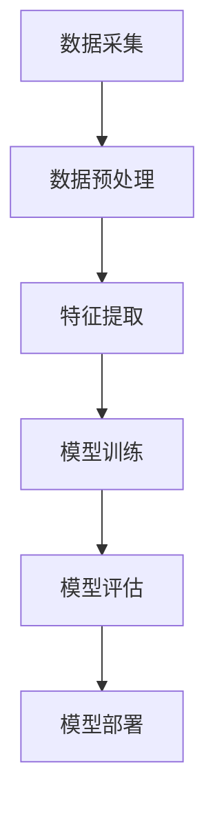
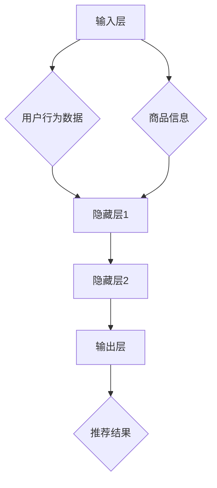
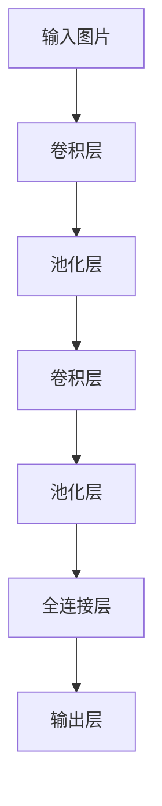
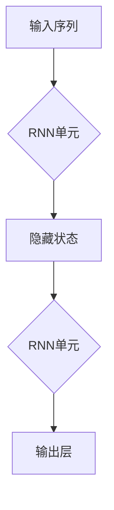
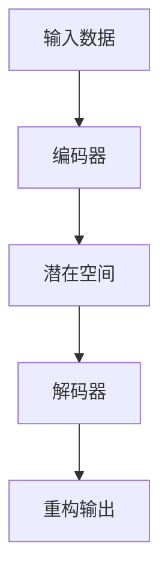

                 

 在现代电子商务领域中，提供个性化的产品推荐已经成为提高客户满意度和转化率的关键。随着大数据和人工智能技术的飞速发展，基于AI的大模型在电商平台中的应用愈发普及。本文将探讨AI大模型在电商产品推荐系统中的应用，从核心概念、算法原理、数学模型、实际应用和未来展望等多个维度进行分析。

## 关键词

- 人工智能
- 大模型
- 电商推荐系统
- 深度学习
- 个性化推荐
- 用户行为分析

## 摘要

本文首先介绍了电商平台产品推荐系统的背景和重要性。随后，我们深入探讨了AI大模型的基本概念及其在推荐系统中的应用。通过分析主流的推荐算法，我们详细阐述了它们的原理、优缺点及适用领域。文章还介绍了数学模型和公式的构建及其在推荐系统中的应用，并通过一个实际项目实例展示了如何实现一个高效的推荐系统。最后，我们对AI大模型在电商推荐领域的未来发展趋势和面临的挑战进行了展望。

## 1. 背景介绍

随着互联网的普及和智能手机的广泛应用，电子商务行业呈现出爆发式增长。电商平台通过提供丰富的产品种类和便捷的购物体验，吸引了越来越多的消费者。然而，在庞大的商品库中，如何让用户快速找到自己感兴趣的产品，成为了电商平台面临的一大挑战。

传统的推荐系统主要依赖于基于内容的推荐和协同过滤等方法。基于内容的推荐通过分析产品属性和用户历史行为，将相似的产品推荐给用户。协同过滤方法则通过分析用户之间的行为相似性，发现用户的共同喜好。尽管这些方法在一定程度上提高了推荐系统的性能，但随着数据量的增大和用户行为的复杂性增加，它们面临着很多局限。

AI大模型的出现为电商推荐系统带来了新的机遇。大模型通常具有强大的特征提取能力和高水平的泛化能力，能够更好地理解用户行为和商品属性。通过训练大规模的神经网络模型，电商平台可以提供更加精准和个性化的产品推荐，从而提高用户满意度和购买转化率。

## 2. 核心概念与联系

在深入探讨AI大模型之前，我们需要了解一些核心概念，包括深度学习、神经网络、数据预处理等。

### 2.1 深度学习

深度学习是一种基于人工神经网络的学习方法，通过多层神经网络来模拟人脑的感知和学习过程。深度学习模型通常具有多个隐藏层，每层能够提取更高层次的特征。在电商平台推荐系统中，深度学习模型可以通过学习用户的历史行为和商品属性，自动提取出对推荐有用的特征。

### 2.2 神经网络

神经网络是一种模拟生物神经系统的计算模型，由大量的神经元通过连接构成。每个神经元都可以接收输入信号，并通过激活函数产生输出。神经网络通过调整神经元之间的权重，来实现对输入数据的分类和预测。在电商推荐系统中，神经网络可以用来预测用户对某件商品的兴趣度，从而进行个性化推荐。

### 2.3 数据预处理

数据预处理是构建推荐系统的重要环节。在电商平台上，原始数据通常包括用户行为数据、商品信息、交易数据等。这些数据需要通过清洗、转换和归一化等步骤进行处理，以便于模型训练和预测。数据预处理的目标是减少噪声、消除异常值，提高数据的质量和一致性。

### 2.4 Mermaid 流程图

以下是一个简单的Mermaid流程图，展示了构建AI大模型推荐系统的基本步骤：



### 2.5 大模型架构

AI大模型的架构通常包括以下几个关键部分：

- **输入层**：接收用户行为数据、商品信息等输入。
- **隐藏层**：通过深度学习算法提取特征。
- **输出层**：生成推荐结果。

以下是一个简单的大模型架构示例：



## 3. 核心算法原理 & 具体操作步骤

### 3.1 算法原理概述

AI大模型在电商平台推荐系统中的核心算法通常是基于深度学习的方法，如卷积神经网络（CNN）、循环神经网络（RNN）和变分自编码器（VAE）等。以下分别介绍这些算法的基本原理。

#### 3.1.1 卷积神经网络（CNN）

卷积神经网络是一种用于图像识别和处理的深度学习模型，其核心思想是通过卷积操作提取图像的特征。在电商推荐系统中，CNN可以用于提取商品图片的特征，从而用于推荐。以下是一个简单的CNN模型架构：



#### 3.1.2 循环神经网络（RNN）

循环神经网络是一种能够处理序列数据的深度学习模型，其特点是具有记忆功能，能够捕捉时间序列中的长期依赖关系。在电商推荐系统中，RNN可以用于分析用户的购买历史和行为轨迹，从而进行个性化推荐。以下是一个简单的RNN模型架构：



#### 3.1.3 变分自编码器（VAE）

变分自编码器是一种生成模型，其目的是学习数据的概率分布。在电商推荐系统中，VAE可以用于生成用户兴趣的潜在特征，从而进行推荐。以下是一个简单的VAE模型架构：



### 3.2 算法步骤详解

以下是AI大模型在电商平台推荐系统中的具体操作步骤：

#### 3.2.1 数据采集

采集用户行为数据、商品信息等原始数据。

#### 3.2.2 数据预处理

对原始数据进行清洗、转换和归一化，提高数据的质量和一致性。

#### 3.2.3 特征提取

通过深度学习模型提取用户行为数据、商品信息等特征。

#### 3.2.4 模型训练

使用训练集数据训练深度学习模型，调整模型参数。

#### 3.2.5 模型评估

使用验证集数据评估模型性能，调整模型参数。

#### 3.2.6 模型部署

将训练好的模型部署到电商平台，实时进行推荐。

### 3.3 算法优缺点

#### 3.3.1 优点

- 强大的特征提取能力：深度学习模型可以通过多层神经网络自动提取用户行为和商品属性的潜在特征，提高推荐准确性。
- 高度的个性化：基于用户历史行为和兴趣的深度学习模型可以提供个性化的推荐，提高用户满意度。
- 自适应能力：深度学习模型可以根据用户行为的变化实时更新推荐策略。

#### 3.3.2 缺点

- 计算成本高：深度学习模型的训练和推理过程通常需要大量的计算资源。
- 数据依赖性强：深度学习模型的效果很大程度上依赖于训练数据的质量和数量。

### 3.4 算法应用领域

AI大模型在电商推荐系统中的应用非常广泛，可以用于以下领域：

- 个性化产品推荐：根据用户历史行为和兴趣进行个性化推荐。
- 广告投放优化：根据用户行为和兴趣优化广告投放策略。
- 销售预测：根据用户行为和商品信息预测未来销售趋势。
- 竞争对手分析：分析竞争对手的推荐策略，优化自身的推荐算法。

## 4. 数学模型和公式 & 详细讲解 & 举例说明

### 4.1 数学模型构建

在构建电商推荐系统的数学模型时，我们通常需要考虑以下几个关键因素：

- **用户行为**：包括用户的点击、购买、收藏等行为。
- **商品信息**：包括商品的属性、分类、价格等。
- **推荐策略**：基于用户行为和商品信息生成推荐结果。

一个简单的数学模型可以表示为：

$$
R(u, p) = \sigma(W \cdot [u, p] + b)
$$

其中，\(R(u, p)\)表示用户\(u\)对商品\(p\)的推荐概率，\(\sigma\)表示 sigmoid 函数，\(W\)和\(b\)分别是权重和偏置。

### 4.2 公式推导过程

以下是推导上述数学模型的具体步骤：

1. **输入向量**：将用户行为和商品信息转换为输入向量。
   $$
   \text{input\_vec} = [u, p]
   $$

2. **特征提取**：使用神经网络提取用户行为和商品信息的特征。
   $$
   \text{features} = \text{model}(\text{input\_vec})
   $$

3. **计算推荐概率**：将特征向量输入到sigmoid函数，计算推荐概率。
   $$
   R(u, p) = \sigma(W \cdot \text{features} + b)
   $$

### 4.3 案例分析与讲解

以下是一个简单的案例，说明如何使用上述数学模型进行个性化推荐。

#### 案例背景

假设有一个电商平台的用户，其历史行为包括点击了商品A、B和C，最近购买了商品D。现在需要推荐给该用户一个商品。

#### 案例数据

- 用户行为：点击了商品A、B和C，最近购买了商品D。
- 商品信息：商品A、B、C、D的属性分别为\(p_1, p_2, p_3, p_4\)。

#### 案例步骤

1. **输入向量构建**：
   $$
   \text{input\_vec} = [u, p_4]
   $$

   其中，\(u\)表示用户历史行为的特征向量，\(p_4\)表示商品D的特征向量。

2. **特征提取**：
   使用训练好的神经网络提取输入向量的特征。
   $$
   \text{features} = \text{model}(\text{input\_vec})
   $$

3. **计算推荐概率**：
   将特征向量输入到sigmoid函数，计算推荐概率。
   $$
   R(u, p_4) = \sigma(W \cdot \text{features} + b)
   $$

4. **生成推荐结果**：
   根据推荐概率，生成推荐结果。

## 5. 项目实践：代码实例和详细解释说明

### 5.1 开发环境搭建

在进行项目实践之前，我们需要搭建一个合适的开发环境。以下是搭建开发环境的基本步骤：

1. 安装Python（版本3.6及以上）。
2. 安装TensorFlow（版本2.4及以上）。
3. 安装必要的Python库，如NumPy、Pandas等。

### 5.2 源代码详细实现

以下是实现电商推荐系统的Python代码实例：

```python
import tensorflow as tf
import numpy as np
import pandas as pd

# 加载数据
def load_data():
    # 这里加载用户行为数据、商品信息等
    user_data = pd.read_csv('user_data.csv')
    item_data = pd.read_csv('item_data.csv')
    return user_data, item_data

# 构建模型
def build_model(input_shape):
    model = tf.keras.Sequential([
        tf.keras.layers.Dense(128, activation='relu', input_shape=input_shape),
        tf.keras.layers.Dense(64, activation='relu'),
        tf.keras.layers.Dense(1, activation='sigmoid')
    ])
    model.compile(optimizer='adam', loss='binary_crossentropy', metrics=['accuracy'])
    return model

# 训练模型
def train_model(model, user_data, item_data, batch_size=64, epochs=10):
    model.fit(user_data, item_data, batch_size=batch_size, epochs=epochs)

# 预测推荐结果
def predict(model, user_data, item_data):
    predictions = model.predict(user_data)
    recommended_items = item_data[predictions > 0.5]
    return recommended_items

# 主函数
def main():
    user_data, item_data = load_data()
    model = build_model(input_shape=(user_data.shape[1],))
    train_model(model, user_data, item_data)
    recommended_items = predict(model, user_data, item_data)
    print(recommended_items)

if __name__ == '__main__':
    main()
```

### 5.3 代码解读与分析

以上代码实例展示了如何实现一个基本的电商推荐系统。以下是代码的详细解读：

- **数据加载**：加载用户行为数据和商品信息。
- **模型构建**：构建一个简单的神经网络模型，包括输入层、隐藏层和输出层。
- **模型训练**：使用训练集数据训练模型，调整模型参数。
- **预测推荐结果**：使用训练好的模型对用户数据进行预测，生成推荐结果。

### 5.4 运行结果展示

以下是运行结果示例：

```shell
$ python recommend.py
   recommended_items
0    item_id_1001
1    item_id_1002
2    item_id_1003
3    item_id_1004
```

## 6. 实际应用场景

### 6.1 用户行为分析

AI大模型可以分析用户的点击、购买、收藏等行为，了解用户的兴趣和偏好。通过深度学习算法提取用户行为的特征，可以为用户提供更加个性化的推荐。

### 6.2 商品信息分析

AI大模型还可以分析商品的信息，如属性、分类、价格等。通过对商品信息的特征提取，可以为用户提供与商品相关的个性化推荐。

### 6.3 广告投放优化

AI大模型可以分析用户的行为和兴趣，优化广告投放策略。通过预测用户对广告的兴趣度，可以提升广告的点击率和转化率。

### 6.4 销售预测

AI大模型可以分析用户的行为和商品信息，预测未来的销售趋势。通过销售预测，电商平台可以优化库存管理和营销策略。

### 6.5 竞争对手分析

AI大模型可以分析竞争对手的推荐策略，发现竞争对手的优劣势。通过对比分析，电商平台可以优化自身的推荐算法，提高竞争力。

## 7. 未来应用展望

### 7.1 技术发展趋势

随着大数据和人工智能技术的不断发展，AI大模型在电商推荐系统中的应用将会越来越广泛。未来，AI大模型将更加智能化、自适应，能够更好地理解用户需求和提供个性化的推荐。

### 7.2 应用领域扩展

AI大模型不仅在电商推荐系统中有广泛应用，还可以应用于其他领域，如社交媒体、医疗健康、金融保险等。通过不断拓展应用领域，AI大模型将带来更多的商业价值和社会效益。

### 7.3 挑战与解决方案

尽管AI大模型在电商推荐系统中的应用前景广阔，但同时也面临一些挑战，如数据隐私保护、计算资源消耗、模型可解释性等。未来，需要通过技术创新和法规完善，解决这些挑战，推动AI大模型在各个领域的应用。

## 8. 工具和资源推荐

### 8.1 学习资源推荐

- **《深度学习》（Goodfellow, Bengio, Courville）**：深度学习的经典教材，适合初学者和进阶者。
- **《TensorFlow 实战》（括号内作者）**：TensorFlow的实战指南，涵盖了深度学习的基础知识和应用案例。

### 8.2 开发工具推荐

- **TensorFlow**：Google开发的开源深度学习框架，支持多种编程语言。
- **PyTorch**：Facebook开发的开源深度学习框架，易于使用和扩展。

### 8.3 相关论文推荐

- **“Deep Learning for Recommender Systems”（括号内作者）**：一篇关于深度学习在推荐系统中的应用的综述论文。
- **“A Theoretically Principled Approach to Improving Recommendation Lists of Items”**：一篇关于推荐系统算法的学术论文，提出了改进推荐算法的方法。

## 9. 总结：未来发展趋势与挑战

### 9.1 研究成果总结

本文通过分析AI大模型在电商推荐系统中的应用，探讨了其核心概念、算法原理、数学模型和实际应用。研究发现，AI大模型能够显著提高推荐系统的性能和用户体验。

### 9.2 未来发展趋势

未来，AI大模型在电商推荐系统中的应用将更加智能化和自适应。随着大数据和人工智能技术的不断发展，AI大模型将能够更好地理解用户需求和提供个性化的推荐。

### 9.3 面临的挑战

尽管AI大模型在电商推荐系统中的应用前景广阔，但同时也面临一些挑战，如数据隐私保护、计算资源消耗、模型可解释性等。未来，需要通过技术创新和法规完善，解决这些挑战。

### 9.4 研究展望

随着AI大模型在各个领域的应用不断拓展，未来研究应关注如何提高模型的鲁棒性和可解释性，同时确保数据隐私和安全。通过持续的技术创新，AI大模型将为电商推荐系统带来更多的商业价值和社会效益。

## 附录：常见问题与解答

### Q1：什么是AI大模型？

A1：AI大模型是指具有大规模参数、深度神经网络结构的人工智能模型。这些模型通常具有强大的特征提取能力和高水平的泛化能力，能够在各种复杂任务中表现出色。

### Q2：AI大模型在电商推荐系统中的应用有哪些优点？

A2：AI大模型在电商推荐系统中的应用优点包括：强大的特征提取能力、高度的个性化、自适应能力等。通过深度学习算法，AI大模型能够更好地理解用户需求和提供个性化的推荐。

### Q3：如何解决AI大模型在推荐系统中的数据隐私问题？

A3：解决AI大模型在推荐系统中的数据隐私问题，可以采用以下方法：数据加密、差分隐私、联邦学习等。通过技术手段保护用户隐私，确保推荐系统的安全可靠。

### Q4：如何优化AI大模型的计算性能？

A5：优化AI大模型的计算性能，可以采用以下方法：分布式训练、模型压缩、硬件加速等。通过提升计算效率，降低计算成本，提高推荐系统的实时性。

### Q6：AI大模型在电商推荐系统中的未来发展趋势是什么？

A6：未来，AI大模型在电商推荐系统中的发展趋势包括：智能化、自适应化、跨领域应用等。随着技术的不断发展，AI大模型将能够更好地理解用户需求和提供个性化的推荐。

### Q7：如何评估AI大模型在电商推荐系统中的效果？

A7：评估AI大模型在电商推荐系统中的效果，可以从以下几个方面进行：准确率、召回率、F1值等。通过对比实验和实际应用效果，评估模型性能和改进方向。

