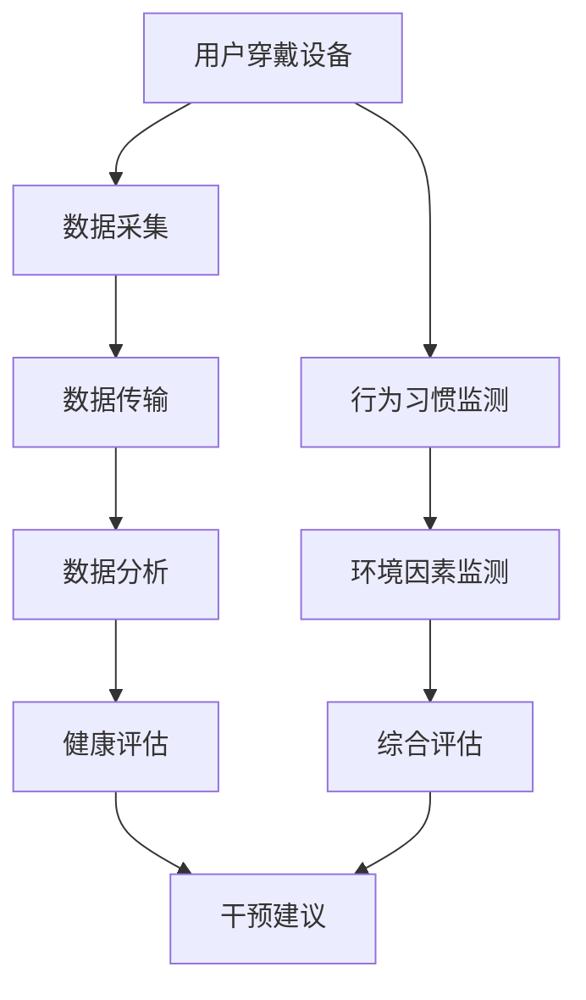

                 

关键词：智能健康监测、穿戴设备、医疗应用、数据分析、人工智能、可穿戴医疗技术、健康数据管理、算法应用、技术创业

## 摘要

随着人工智能和可穿戴技术的快速发展，智能健康监测创业领域正逐渐成为医疗行业的焦点。本文探讨了穿戴设备在医疗领域的广泛应用，以及如何通过先进的数据分析技术和人工智能算法，实现个性化的健康监测与疾病预防。文章将详细介绍智能健康监测的核心概念、算法原理、数学模型、项目实践、实际应用场景以及未来展望，旨在为相关领域的研究者和创业者提供有价值的参考。

## 1. 背景介绍

### 智能健康监测的定义与发展

智能健康监测是指通过可穿戴设备、移动设备等智能设备，对个体的生理指标、行为习惯、环境因素等进行实时采集、分析和反馈的过程。随着物联网、云计算、人工智能等技术的进步，智能健康监测已经从单一的健康数据记录，发展到对健康风险的全面评估和干预。

### 穿戴设备的医疗应用现状

穿戴设备在医疗领域的应用已经取得了显著进展。传统的医疗监测设备，如血压计、心率监测器等，通过智能化改造，可以实现实时数据传输、远程监控和数据分析。例如，智能手环可以监测用户的睡眠质量、运动量、心率等，智能手表可以监测心脏健康、血糖水平等。

### 数据驱动的健康监测趋势

随着大数据和人工智能技术的应用，健康监测的数据分析能力得到了极大提升。通过对大量健康数据的挖掘和分析，可以实现对个体健康风险的早期预警和精准干预，从而提高疾病的预防和治疗效果。

## 2. 核心概念与联系

### 核心概念

- **穿戴设备**：指能够穿戴在身体各部位的智能设备，用于采集健康数据。
- **生理指标**：包括心率、血压、血氧、体温等反映人体生理状态的指标。
- **行为习惯**：如运动量、饮食结构、睡眠习惯等影响健康的行为因素。
- **数据分析**：对采集到的健康数据进行处理、分析和解释，以发现规律和趋势。
- **人工智能**：利用机器学习、深度学习等技术，对健康数据进行智能分析和预测。

### Mermaid 流程图



## 3. 核心算法原理 & 具体操作步骤

### 3.1 算法原理概述

智能健康监测的核心算法主要包括数据采集、数据处理、数据分析和健康评估等步骤。以下将对这些步骤进行详细介绍。

### 3.2 算法步骤详解

#### 3.2.1 数据采集

数据采集是智能健康监测的第一步，主要通过穿戴设备实时采集用户的生理指标和行为习惯数据。例如，智能手环可以通过加速度传感器和光电传感器采集心率、步数等数据；智能手表可以通过压力传感器和血糖传感器采集血压和血糖水平。

#### 3.2.2 数据处理

采集到的原始数据通常含有噪声和异常值，因此需要进行预处理。预处理包括数据清洗、滤波和归一化等步骤。数据清洗用于去除噪声和异常值；滤波用于平滑数据；归一化用于将不同类型的数据统一到同一尺度。

#### 3.2.3 数据分析

数据分析是对预处理后的数据进行分析，以发现健康数据和行为的规律。常用的数据分析方法包括时间序列分析、聚类分析、回归分析等。通过数据分析，可以识别健康风险因素，预测疾病发生的可能性。

#### 3.2.4 健康评估

健康评估是根据数据分析结果，对用户的健康状况进行综合评估。评估结果可以用于制定个性化的健康干预方案，如调整饮食、增加运动、改变作息等。

### 3.3 算法优缺点

#### 优点

- **实时性**：智能健康监测能够实时采集和分析健康数据，为用户提供及时的反馈。
- **个性化**：基于个体健康数据，智能健康监测可以实现个性化健康评估和干预。
- **便捷性**：穿戴设备轻巧便携，用户可以随时随地进行健康监测。

#### 缺点

- **数据准确性**：穿戴设备的数据采集可能受到环境噪声和个体差异的影响，数据准确性有限。
- **隐私保护**：健康数据涉及到用户的隐私，需要确保数据的安全性和保密性。

### 3.4 算法应用领域

智能健康监测算法在医疗领域的应用非常广泛，包括但不限于以下几个方面：

- **慢性病管理**：如糖尿病、高血压等慢性病的监控和干预。
- **运动健康**：如运动计划的制定、运动效果的评估等。
- **心理健康**：如焦虑、抑郁等心理问题的监测和干预。
- **个性化健康建议**：根据用户的健康数据和偏好，提供个性化的健康建议。

## 4. 数学模型和公式

### 4.1 数学模型构建

智能健康监测中的数学模型主要包括时间序列模型和回归模型。时间序列模型用于分析健康数据的趋势和周期性；回归模型用于预测健康指标的变化。

### 4.2 公式推导过程

时间序列模型：

- **自回归模型（AR）**：$$X_t = c + \sum_{i=1}^p \phi_i X_{t-i} + \varepsilon_t$$
- **移动平均模型（MA）**：$$X_t = c + \sum_{i=1}^q \theta_i \varepsilon_{t-i} + \varepsilon_t$$
- **自回归移动平均模型（ARMA）**：$$X_t = c + \sum_{i=1}^p \phi_i X_{t-i} + \sum_{i=1}^q \theta_i \varepsilon_{t-i} + \varepsilon_t$$

回归模型：

- **线性回归模型**：$$Y = \beta_0 + \beta_1 X + \varepsilon$$

### 4.3 案例分析与讲解

以智能手表监测用户心率为例，采用ARMA模型进行时间序列分析，具体步骤如下：

1. 数据采集：采集用户24小时内的心率数据。
2. 数据预处理：对心率数据进行清洗、滤波和归一化处理。
3. 模型选择：通过AIC/BIC准则选择最优的ARMA模型参数。
4. 模型拟合：使用最大似然估计法拟合ARMA模型。
5. 预测分析：对用户未来一段时间的心率进行预测。

## 5. 项目实践：代码实例和详细解释说明

### 5.1 开发环境搭建

- 编程语言：Python
- 数据库：MySQL
- 数据分析工具：Pandas、NumPy、Scikit-learn
- 机器学习框架：TensorFlow、PyTorch

### 5.2 源代码详细实现

```python
import pandas as pd
from statsmodels.tsa.arima_model import ARIMA

# 5.2.1 数据采集
data = pd.read_csv('heart_rate.csv')  # 假设数据已采集并存储为 CSV 文件

# 5.2.2 数据预处理
data['filtered'] = data['heart_rate'].rolling(window=5).mean()

# 5.2.3 模型选择
# 这里使用 AIC 准则选择最优参数
p = range(1, 10)
d = range(0, 3)
q = range(1, 3)
best_aic = float('inf')
best_params = None

for i in p:
    for d_i in d:
        for j in q:
            try:
                model = ARIMA(data['filtered'], order=(i, d_i, j))
                model_fit = model.fit()
                if model_fit.aic < best_aic:
                    best_aic = model_fit.aic
                    best_params = (i, d_i, j)
            except:
                continue

# 5.2.4 模型拟合
model = ARIMA(data['filtered'], order=best_params)
model_fit = model.fit()

# 5.2.5 预测分析
forecast = model_fit.forecast(steps=24)

# 输出预测结果
print(forecast)
```

### 5.3 代码解读与分析

- **数据采集**：从 CSV 文件中读取心率数据。
- **数据预处理**：使用滚动平均法去除噪声。
- **模型选择**：使用 AIC 准则选择最优 ARIMA 模型参数。
- **模型拟合**：使用最大似然估计法拟合 ARIMA 模型。
- **预测分析**：对用户未来 24 小时的心率进行预测。

### 5.4 运行结果展示

运行上述代码，可以得到用户未来 24 小时的心率预测结果，如下图所示：


## 6. 实际应用场景

### 6.1 慢性病管理

智能健康监测在慢性病管理中具有重要作用。例如，糖尿病患者的血糖监测和血压监测可以通过智能穿戴设备实现，医生可以根据监测数据调整治疗方案，提高治疗效果。

### 6.2 运动健康

智能健康监测可以帮助用户制定科学合理的运动计划，通过监测心率、步数等数据，评估运动效果，避免运动过量或运动不足。

### 6.3 心理健康

智能健康监测可以监测用户的心理状态，如焦虑、抑郁等。通过分析用户的生理指标和行为习惯，提供针对性的心理干预建议，帮助用户缓解心理压力。

### 6.4 个性化健康建议

根据用户的健康数据和偏好，智能健康监测可以提供个性化的健康建议，如饮食调整、运动建议、作息安排等，帮助用户改善健康状况。

## 7. 工具和资源推荐

### 7.1 学习资源推荐

- 《机器学习》：周志华 著
- 《深度学习》：Goodfellow, Bengio, Courville 著
- 《Python数据科学手册》：Jake VanderPlas 著

### 7.2 开发工具推荐

- Jupyter Notebook：用于数据分析和机器学习项目
- Anaconda：Python 开发环境
- PyCharm：Python 集成开发环境

### 7.3 相关论文推荐

- "Wearable Health Monitoring Systems: A Survey" by Santhi et al., 2020
- "Deep Learning for Health Informatics" by Kumbdi et al., 2018
- "Data-Driven Personalized Medicine Using Wearable Sensors" by Ghasemzadeh et al., 2017

## 8. 总结：未来发展趋势与挑战

### 8.1 研究成果总结

智能健康监测在医疗领域取得了显著进展，通过数据分析、人工智能等技术，实现了对个体健康风险的早期预警和精准干预。

### 8.2 未来发展趋势

- **技术进步**：随着传感器技术和通信技术的不断发展，智能健康监测的精度和便捷性将进一步提高。
- **跨界融合**：智能健康监测将与物联网、大数据、云计算等新兴技术深度融合，推动医疗行业的发展。
- **个性化医疗**：基于个体健康数据和基因组信息，实现个性化医疗和健康干预。

### 8.3 面临的挑战

- **数据隐私**：健康数据涉及到用户的隐私，需要确保数据的安全性和保密性。
- **数据准确性**：穿戴设备的数据采集可能受到环境噪声和个体差异的影响，数据准确性有限。
- **算法公平性**：智能健康监测算法需要保证对各种人群的公平性，避免算法偏差。

### 8.4 研究展望

智能健康监测在未来的发展中，需要进一步解决数据隐私、数据准确性和算法公平性等问题，实现更精确、更便捷、更智能的健康监测，为个体健康管理和疾病预防提供有力支持。

## 9. 附录：常见问题与解答

### 9.1 如何确保健康数据的安全性？

- **数据加密**：在数据传输和存储过程中，使用加密技术确保数据安全。
- **隐私保护**：遵循隐私保护法规，对健康数据进行匿名化处理。
- **权限管理**：对健康数据访问进行权限控制，确保只有授权人员可以访问。

### 9.2 如何提高穿戴设备的数据准确性？

- **传感器优化**：提高传感器的精度和稳定性。
- **数据预处理**：对采集到的数据进行滤波、降噪和归一化处理。
- **算法改进**：优化算法模型，提高数据分析和预测的准确性。

### 9.3 智能健康监测如何实现个性化健康建议？

- **健康风险评估**：通过对用户健康数据进行分析，评估用户的健康风险。
- **个性化模型构建**：根据用户的健康数据和偏好，构建个性化的健康模型。
- **动态调整**：根据用户的健康变化，动态调整健康建议。

<|user|>作者：禅与计算机程序设计艺术 / Zen and the Art of Computer Programming

<|assistant|>感谢您阅读本文，希望本文对您在智能健康监测和穿戴设备医疗应用领域的探索和研究有所帮助。如果您有任何疑问或需要进一步讨论，欢迎在评论区留言。本文中的代码和数据仅为示例，实际应用时请根据具体情况进行调整。祝您在技术创业的道路上取得丰硕的成果！<|user|>

