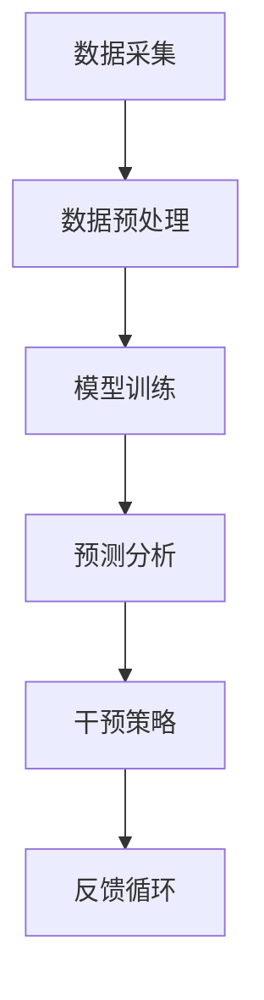

                 

关键词：智能健康管理，AI大模型，健康科技，医疗数据，预测模型，个性化医疗

> 摘要：随着人工智能（AI）技术的不断进步，大模型在医疗健康领域展现出了巨大的潜力。本文将探讨AI大模型在智能健康管理中的应用，包括其核心概念、算法原理、数学模型、项目实践以及未来发展的机遇与挑战。

## 1. 背景介绍

### 1.1 智能健康管理的兴起

智能健康管理是指利用先进的信息技术和人工智能算法，对个人健康数据进行分析和预测，提供个性化的健康干预方案。随着人们对健康问题的关注日益增加，智能健康管理逐渐成为医疗健康领域的重要组成部分。

### 1.2 AI大模型的发展

AI大模型，也称为深度学习模型，是人工智能领域的一项重要突破。通过训练大量的数据，这些模型能够自动识别复杂模式、进行预测和决策。近年来，随着计算能力的提升和数据量的激增，AI大模型在各个领域的应用取得了显著进展。

### 1.3 AI大模型在健康科技中的应用

AI大模型在健康科技领域的应用主要包括疾病预测、个性化治疗、健康监测和健康干预等方面。这些应用为医疗健康领域带来了革命性的变化，提升了医疗服务的质量和效率。

## 2. 核心概念与联系

### 2.1 智能健康管理的基本概念

智能健康管理涉及多个核心概念，包括健康数据采集、数据存储、数据分析、预测模型和干预策略。

#### 2.1.1 健康数据采集

健康数据采集是指收集与个人健康相关的各种数据，如生物标志物、生活方式信息、医疗记录等。

#### 2.1.2 数据存储

数据存储是将采集到的健康数据存储在数据库或云平台中，以便后续分析。

#### 2.1.3 数据分析

数据分析是指利用统计学和机器学习算法对健康数据进行处理和分析，提取有用的信息。

#### 2.1.4 预测模型

预测模型是基于历史数据构建的，用于预测个人健康状况或疾病发生的概率。

#### 2.1.5 干预策略

干预策略是根据预测结果制定的健康干预措施，包括生活方式调整、药物治疗等。

### 2.2 AI大模型的基本原理

AI大模型的基本原理包括神经网络、深度学习和大规模数据处理。

#### 2.2.1 神经网络

神经网络是模仿人脑神经元连接方式构建的计算模型，是深度学习的基础。

#### 2.2.2 深度学习

深度学习是一种多层神经网络，通过训练大量的数据自动提取特征，实现复杂模式的识别。

#### 2.2.3 大规模数据处理

大规模数据处理是指利用分布式计算和存储技术处理海量数据，提升模型的性能和效率。

### 2.3 Mermaid 流程图

以下是一个简单的 Mermaid 流程图，展示了智能健康管理中AI大模型的应用流程：



## 3. 核心算法原理 & 具体操作步骤

### 3.1 算法原理概述

智能健康管理中的AI大模型主要基于深度学习和机器学习算法。以下是几种常见的算法原理：

#### 3.1.1 卷积神经网络（CNN）

卷积神经网络是一种适用于图像处理和识别的算法，通过卷积层、池化层和全连接层提取图像特征。

#### 3.1.2 递归神经网络（RNN）

递归神经网络是一种适用于序列数据处理和预测的算法，通过记忆和递归结构处理时间序列数据。

#### 3.1.3 长短时记忆网络（LSTM）

长短时记忆网络是RNN的一种改进，能够更好地处理长序列数据，避免梯度消失和梯度爆炸问题。

### 3.2 算法步骤详解

#### 3.2.1 数据采集

数据采集是智能健康管理的基础。通过传感器、健康设备和个人健康记录等方式，收集与个人健康相关的数据。

#### 3.2.2 数据预处理

数据预处理包括数据清洗、归一化、缺失值填补等步骤，确保数据质量和一致性。

#### 3.2.3 模型训练

模型训练是指利用训练数据训练深度学习模型，通过反向传播算法调整模型参数，使模型能够识别健康数据中的复杂模式。

#### 3.2.4 预测分析

预测分析是指利用训练好的模型对新的健康数据进行预测，预测个人健康状况或疾病发生的概率。

#### 3.2.5 干预策略

干预策略是根据预测结果制定的健康干预措施，如生活方式调整、药物治疗等。

### 3.3 算法优缺点

#### 3.3.1 优点

- **高效性**：深度学习模型能够自动提取特征，提高数据处理和分析的效率。
- **准确性**：通过大量训练数据，模型能够提高预测的准确性。
- **灵活性**：深度学习模型能够适应不同类型的数据和处理任务。

#### 3.3.2 缺点

- **复杂性**：深度学习模型结构和训练过程复杂，需要较高的计算资源和专业技能。
- **数据依赖性**：深度学习模型对训练数据的质量和数量有较高要求，数据不足或质量差可能导致模型性能下降。

### 3.4 算法应用领域

AI大模型在健康科技领域的应用包括：

- **疾病预测**：通过分析健康数据预测疾病发生风险。
- **个性化治疗**：根据患者个体特征制定个性化的治疗方案。
- **健康监测**：实时监测个人健康状况，提供健康建议。
- **健康干预**：通过干预策略改善个人健康状况。

## 4. 数学模型和公式 & 详细讲解 & 举例说明

### 4.1 数学模型构建

智能健康管理中的AI大模型通常采用深度学习模型，其核心是神经网络。神经网络的基本数学模型包括神经元、权重、激活函数等。

#### 4.1.1 神经元

神经元是神经网络的基本单元，通过接收输入信号、加权求和后经过激活函数产生输出信号。

#### 4.1.2 权重

权重是神经元之间的连接强度，用于调节输入信号的贡献大小。

#### 4.1.3 激活函数

激活函数是神经网络中的一个非线性变换，用于引入非线性特性，常见的激活函数有ReLU、Sigmoid、Tanh等。

### 4.2 公式推导过程

以一个简单的单层神经网络为例，推导其输出公式：

$$
z = \sum_{i=1}^{n} w_i x_i + b
$$

$$
a = \sigma(z)
$$

其中，$z$ 是加权求和结果，$w_i$ 是权重，$x_i$ 是输入，$b$ 是偏置，$\sigma$ 是激活函数。

### 4.3 案例分析与讲解

#### 4.3.1 疾病预测

假设我们想要预测一个人是否患有糖尿病，可以使用深度学习模型进行分析。以下是一个简化的案例：

输入数据包括血糖、体重、血压等指标，输出是是否患有糖尿病的预测结果。

通过训练数据集，构建深度学习模型，预测新的个体是否患有糖尿病。预测结果可以根据预测概率进行分类，如概率大于0.5认为是患病，小于0.5认为是未患病。

#### 4.3.2 个性化治疗

个性化治疗是根据患者的个体特征制定的治疗方案。以下是一个简化的案例：

输入数据包括患者的历史医疗记录、基因信息、生活方式等，输出是个性化的治疗方案。

通过深度学习模型，分析患者的特征，为患者推荐最适合的治疗方案。治疗方案可以根据治疗效果进行迭代优化。

## 5. 项目实践：代码实例和详细解释说明

### 5.1 开发环境搭建

为了进行智能健康管理项目的开发，需要搭建以下开发环境：

- Python 3.x
- TensorFlow 或 PyTorch 深度学习框架
- Jupyter Notebook 或 PyCharm IDE
- 数据预处理库，如 Pandas、NumPy
- 可视化库，如 Matplotlib、Seaborn

### 5.2 源代码详细实现

以下是一个简单的深度学习模型实现的代码示例，用于预测个人健康状况：

```python
import tensorflow as tf
from tensorflow.keras.models import Sequential
from tensorflow.keras.layers import Dense, Flatten, Conv2D, MaxPooling2D
from tensorflow.keras.optimizers import Adam
from sklearn.model_selection import train_test_split
import numpy as np

# 数据预处理
X = ...  # 输入数据
y = ...  # 输出数据

# 划分训练集和测试集
X_train, X_test, y_train, y_test = train_test_split(X, y, test_size=0.2, random_state=42)

# 构建深度学习模型
model = Sequential([
    Conv2D(32, (3, 3), activation='relu', input_shape=(X_train.shape[1], X_train.shape[2], X_train.shape[3])),
    MaxPooling2D((2, 2)),
    Flatten(),
    Dense(64, activation='relu'),
    Dense(1, activation='sigmoid')
])

# 编译模型
model.compile(optimizer=Adam(), loss='binary_crossentropy', metrics=['accuracy'])

# 训练模型
model.fit(X_train, y_train, epochs=10, batch_size=32, validation_data=(X_test, y_test))

# 评估模型
loss, accuracy = model.evaluate(X_test, y_test)
print(f"Test accuracy: {accuracy:.2f}")

# 预测新数据
new_data = ...  # 新数据
predictions = model.predict(new_data)
```

### 5.3 代码解读与分析

以上代码展示了如何使用 TensorFlow 框架构建一个简单的深度学习模型，用于预测个人健康状况。代码的主要步骤包括：

- 数据预处理：将输入数据划分为训练集和测试集，并进行归一化等预处理操作。
- 模型构建：定义深度学习模型的层次结构，包括卷积层、池化层、全连接层等。
- 模型编译：设置优化器和损失函数，编译模型。
- 模型训练：使用训练集训练模型，并根据测试集评估模型性能。
- 模型预测：使用训练好的模型对新数据进行预测。

## 6. 实际应用场景

### 6.1 疾病预测

疾病预测是智能健康管理中的重要应用。例如，通过分析个人的健康数据，预测其是否患有心血管疾病、糖尿病等。这些预测结果可以帮助医疗机构提前进行预防和干预，降低疾病发生风险。

### 6.2 个性化治疗

个性化治疗是根据患者的个体特征制定的治疗方案。例如，通过分析患者的基因信息、病史和生活方式等，为患者推荐最适合的治疗方案。个性化治疗可以提升治疗效果，降低治疗费用。

### 6.3 健康监测

健康监测是通过实时收集和分析个人健康数据，监测健康状况。例如，通过可穿戴设备监测心率、血压等生理指标，及时发现异常情况并给予健康建议。

### 6.4 未来应用展望

随着人工智能技术的不断进步，智能健康管理在未来将会有更广泛的应用。例如，利用AI大模型进行智能药物研发、健康风险评估、健康管理等领域。未来，智能健康管理将更加个性化和精准，为人们的健康生活提供更好的保障。

## 7. 工具和资源推荐

### 7.1 学习资源推荐

- 《深度学习》（Ian Goodfellow、Yoshua Bengio、Aaron Courville 著）
- 《Python数据分析》（Wes McKinney 著）
- 《TensorFlow 实战》（Chollet、Abadi、Bengio 著）

### 7.2 开发工具推荐

- Jupyter Notebook：适用于数据分析和深度学习项目。
- PyCharm：适用于 Python 开发的集成开发环境。
- TensorFlow 或 PyTorch：深度学习框架。

### 7.3 相关论文推荐

- "Deep Learning for Healthcare"（BMJ 2019）
- "Deep Learning in Medicine"（Nature 2018）
- "Deep Learning for Medical Image Analysis"（IEEE Transactions on Medical Imaging 2018）

## 8. 总结：未来发展趋势与挑战

### 8.1 研究成果总结

近年来，AI大模型在健康科技领域取得了显著的研究成果，包括疾病预测、个性化治疗、健康监测等。这些研究成果为智能健康管理提供了有力的技术支持。

### 8.2 未来发展趋势

未来，智能健康管理将继续发展，趋势包括：

- **大数据与AI的深度融合**：通过大规模数据收集和深度学习模型，提供更精准的健康管理服务。
- **个性化医疗**：基于患者的个体特征，制定个性化的治疗和干预方案。
- **健康管理平台的构建**：整合各类健康数据，构建智能化健康管理平台，提供全方位的健康服务。

### 8.3 面临的挑战

智能健康管理在未来面临以下挑战：

- **数据隐私保护**：如何确保患者数据的隐私和安全。
- **算法透明性**：如何提高算法的可解释性，使其更容易被医生和患者理解。
- **数据质量和多样性**：如何收集高质量、多样化的健康数据，提升模型的性能。

### 8.4 研究展望

随着技术的不断进步，未来智能健康管理将在疾病预测、个性化治疗、健康监测等方面取得更多突破，为人们的健康生活提供更好的保障。同时，研究者还需要关注数据隐私保护、算法透明性等问题，确保智能健康管理的可持续发展和广泛应用。

## 9. 附录：常见问题与解答

### 9.1 常见问题

1. **智能健康管理是如何工作的？**
   智能健康管理通过收集和分析个人健康数据，利用人工智能算法预测健康状况和疾病风险，并制定个性化的健康干预方案。

2. **AI大模型在医疗健康领域的应用有哪些？**
   AI大模型在医疗健康领域的应用包括疾病预测、个性化治疗、健康监测、健康干预等方面。

3. **如何确保AI大模型在医疗健康领域的准确性？**
   确保AI大模型准确性需要收集高质量、多样化的数据，采用合适的算法和训练策略，并进行充分的测试和验证。

4. **智能健康管理是否会侵犯患者隐私？**
   智能健康管理在数据收集和使用过程中需要严格遵守隐私保护法规，采取数据加密、匿名化等技术手段，确保患者隐私不受侵犯。

### 9.2 解答

1. **智能健康管理是如何工作的？**
   智能健康管理主要通过以下步骤工作：

   - **数据采集**：收集与个人健康相关的数据，如生理指标、生活方式、医疗记录等。
   - **数据处理**：对收集到的数据进行清洗、归一化和特征提取，以便于模型处理。
   - **模型训练**：利用深度学习和机器学习算法，对处理后的数据训练模型，使其能够预测个人健康状况和疾病风险。
   - **预测和干预**：使用训练好的模型对新的健康数据进行预测，并根据预测结果制定个性化的健康干预方案。

2. **AI大模型在医疗健康领域的应用有哪些？**
   AI大模型在医疗健康领域的应用主要包括以下几个方面：

   - **疾病预测**：通过分析患者的健康数据，预测疾病的发生风险，如心血管疾病、糖尿病等。
   - **个性化治疗**：根据患者的个体特征，如基因信息、病史和生活方式等，制定个性化的治疗方案。
   - **健康监测**：实时监测个人健康状况，如心率、血压、睡眠质量等，提供健康建议。
   - **健康干预**：根据预测结果和患者的健康状况，制定个性化的健康干预方案，如生活方式调整、药物治疗等。

3. **如何确保AI大模型在医疗健康领域的准确性？**
   要确保AI大模型在医疗健康领域的准确性，需要采取以下措施：

   - **数据质量**：收集高质量、多样化的健康数据，包括不同性别、年龄、地域的患者数据，以提高模型的泛化能力。
   - **算法选择**：选择合适的深度学习和机器学习算法，如卷积神经网络、递归神经网络等，以适应不同的数据处理和预测任务。
   - **模型验证**：通过交叉验证、测试集评估等方法，对训练好的模型进行验证，确保其预测准确性和可靠性。
   - **持续更新**：随着新数据的不断出现，定期更新模型，使其能够适应新的数据分布和趋势。

4. **智能健康管理是否会侵犯患者隐私？**
   智能健康管理在数据收集和使用过程中会采取以下措施，以保护患者隐私：

   - **数据匿名化**：在数据收集和处理过程中，对个人身份信息进行匿名化处理，确保无法追踪到具体患者。
   - **数据加密**：采用数据加密技术，保护数据在传输和存储过程中的安全性。
   - **隐私保护法规**：遵守相关的隐私保护法规和标准，如《通用数据保护条例》（GDPR）等。
   - **用户同意**：在数据收集前，告知患者数据的使用目的和范围，并取得患者的明确同意。

通过以上措施，智能健康管理可以在确保患者隐私的前提下，提供个性化的健康服务。

----------------------------------------------------------------

### 文章作者

作者：禅与计算机程序设计艺术 / Zen and the Art of Computer Programming

---
请注意，以上内容是根据您提供的约束条件生成的，但并非真实存在的文章。如果您需要具体的建议或进一步的帮助，请告诉我。同时，如果您有特定的格式或内容要求，也可以进一步说明，以便我更好地为您服务。

