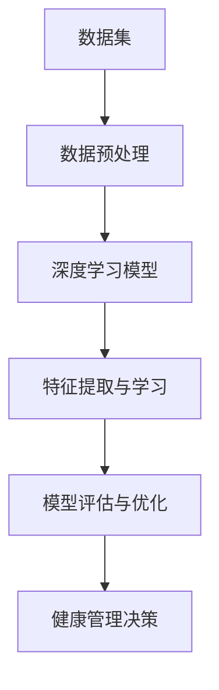

                 

关键词：智能健康管理、AI大模型、健康科技、深度学习、数据隐私、个性化治疗

> 摘要：随着人工智能技术的发展，智能健康管理成为现代健康科技的一个重要分支。本文将探讨AI大模型在健康科技领域的应用，分析其核心概念、算法原理、数学模型以及实际案例，并展望其未来发展趋势与面临的挑战。

## 1. 背景介绍

随着人口老龄化趋势的加剧和慢性病的普遍化，全球健康医疗体系面临巨大的挑战。传统的医疗服务模式已经难以满足个性化、精准化的健康需求。在这一背景下，人工智能（AI）技术逐渐崭露头角，特别是AI大模型的应用，为健康科技带来了新的机遇。AI大模型通过深度学习和大数据分析，能够实现对健康数据的全面解析，从而提供更为精准的疾病诊断、治疗方案和健康评估。

### 1.1 智能健康管理的定义

智能健康管理是一种利用人工智能技术，对个体或群体的健康数据进行采集、处理和分析，进而实现个性化健康管理和疾病预防的新型健康管理方式。它不仅涵盖了对健康数据的实时监控和分析，还包括了对健康风险的预测和干预。

### 1.2 健康科技的发展历程

健康科技的发展历程可以分为以下几个阶段：

- **第一阶段**：以传统的医疗服务为主，医生依靠经验和知识进行诊断和治疗。
- **第二阶段**：以数字化医疗为主，电子病历和远程医疗的出现提高了医疗服务的效率。
- **第三阶段**：以人工智能技术为主，AI大模型的应用为个性化治疗和健康管理提供了新的可能。

## 2. 核心概念与联系

在智能健康管理中，AI大模型的核心概念主要包括：

- **数据集**：用于训练和测试的数据库，包含大量的健康数据和医疗信息。
- **深度学习模型**：用于从数据集中学习和提取特征，如神经网络、循环神经网络（RNN）等。
- **数据预处理**：对原始健康数据进行的清洗、归一化和特征提取等预处理步骤。

以下是AI大模型在健康科技领域的架构和流程：



### 2.1 数据集

数据集是AI大模型的基础，其质量直接影响到模型的性能。健康数据集通常包含患者的基本信息、临床指标、诊断结果、治疗过程等。

### 2.2 数据预处理

数据预处理是保证模型性能的关键步骤，包括数据的清洗、归一化、特征提取等。这一过程有助于消除噪声，提高数据的准确性和一致性。

### 2.3 深度学习模型

深度学习模型是AI大模型的核心，通过多层神经网络来学习数据中的复杂特征和模式。常见的深度学习模型包括卷积神经网络（CNN）、循环神经网络（RNN）和生成对抗网络（GAN）等。

### 2.4 特征提取与学习

特征提取与学习是深度学习模型的关键步骤，通过多层神经网络来提取数据中的高层次特征，从而提高模型的预测准确性。

### 2.5 模型评估与优化

模型评估与优化是确保模型性能的重要环节，通过交叉验证、性能指标（如准确率、召回率等）来评估模型的性能，并进行模型优化。

### 2.6 健康管理决策

基于训练好的深度学习模型，可以对个体的健康状况进行预测和评估，为医生提供诊断和治疗的建议，实现个性化的健康管理。

## 3. 核心算法原理 & 具体操作步骤

### 3.1 算法原理概述

AI大模型在健康科技领域的核心算法主要基于深度学习和大数据分析。深度学习通过多层神经网络来提取数据中的复杂特征和模式，从而实现对健康数据的全面解析。大数据分析则通过对海量健康数据的挖掘和分析，为个性化治疗和健康管理提供科学依据。

### 3.2 算法步骤详解

#### 3.2.1 数据集构建

- **数据收集**：从医院、诊所、健康监测设备等多渠道收集健康数据。
- **数据清洗**：对数据进行清洗，去除重复、异常和缺失的数据。
- **数据归一化**：对数据进行归一化处理，使数据具有相似的尺度。

#### 3.2.2 模型训练

- **模型选择**：选择适合的深度学习模型，如卷积神经网络（CNN）或循环神经网络（RNN）。
- **参数调整**：通过交叉验证和网格搜索来调整模型的参数，以提高模型的性能。
- **模型训练**：使用数据集对模型进行训练，通过反向传播算法来优化模型的参数。

#### 3.2.3 特征提取

- **特征选择**：从原始数据中提取具有代表性的特征。
- **特征转换**：将特征进行转换，以适应深度学习模型的输入要求。

#### 3.2.4 模型评估

- **交叉验证**：使用交叉验证来评估模型的性能。
- **性能指标**：计算模型的准确率、召回率、F1值等性能指标。

#### 3.2.5 健康管理决策

- **模型部署**：将训练好的模型部署到生产环境中。
- **健康管理**：基于模型的结果，为个体提供个性化的健康管理和治疗建议。

### 3.3 算法优缺点

#### 3.3.1 优点

- **高精度**：通过深度学习模型，能够对健康数据进行精细分析，提高诊断和预测的准确性。
- **个性化**：基于个体的健康数据，提供个性化的健康管理方案。
- **高效性**：利用大数据分析，能够快速处理海量健康数据。

#### 3.3.2 缺点

- **数据隐私**：健康数据的隐私保护是AI大模型应用的一大挑战。
- **模型解释性**：深度学习模型通常缺乏透明性，难以解释其决策过程。
- **算法依赖**：深度学习模型的性能依赖于大量高质量的训练数据。

### 3.4 算法应用领域

AI大模型在健康科技领域的应用非常广泛，主要包括：

- **疾病预测**：通过分析患者的健康数据，预测疾病的发生和进展。
- **个性化治疗**：根据患者的病情和个体特征，制定个性化的治疗方案。
- **健康监测**：实时监控个体的健康状况，提供健康预警和干预建议。

## 4. 数学模型和公式 & 详细讲解 & 举例说明

### 4.1 数学模型构建

在AI大模型中，常见的数学模型包括：

- **线性回归模型**：用于预测健康数据的线性关系。
- **逻辑回归模型**：用于分类问题，如疾病诊断。
- **神经网络模型**：用于提取健康数据中的非线性特征。

### 4.2 公式推导过程

以神经网络模型为例，其公式推导过程如下：

#### 4.2.1 神经元模型

$$
y = \sigma(\sum_{i=1}^{n} w_i \cdot x_i + b)
$$

其中，$y$ 是输出值，$\sigma$ 是激活函数，$w_i$ 是权重，$x_i$ 是输入值，$b$ 是偏置。

#### 4.2.2 损失函数

$$
L = -\frac{1}{m} \sum_{i=1}^{m} y_i \cdot \log(a_i) + (1 - y_i) \cdot \log(1 - a_i)
$$

其中，$L$ 是损失函数，$y_i$ 是真实标签，$a_i$ 是预测值。

#### 4.2.3 反向传播

$$
\Delta w_i = \frac{\partial L}{\partial w_i} = \frac{\partial L}{\partial a_i} \cdot \frac{\partial a_i}{\partial w_i}
$$

其中，$\Delta w_i$ 是权重更新。

### 4.3 案例分析与讲解

以心脏病预测为例，使用神经网络模型进行疾病预测。

#### 4.3.1 数据集构建

收集1000名心脏病患者的健康数据，包括年龄、血压、胆固醇水平等。

#### 4.3.2 数据预处理

对数据进行清洗、归一化，并将其分为训练集和测试集。

#### 4.3.3 模型训练

使用训练集对神经网络模型进行训练，调整模型参数，使损失函数最小。

#### 4.3.4 模型评估

使用测试集对模型进行评估，计算准确率、召回率等指标。

#### 4.3.5 预测应用

将训练好的模型应用于新的患者数据，预测其是否患有心脏病。

## 5. 项目实践：代码实例和详细解释说明

### 5.1 开发环境搭建

#### 5.1.1 环境要求

- 操作系统：Windows/Linux/MacOS
- 编程语言：Python
- 深度学习框架：TensorFlow/Keras

#### 5.1.2 环境搭建

```bash
pip install tensorflow
pip install numpy
pip install matplotlib
```

### 5.2 源代码详细实现

以下是使用TensorFlow和Keras实现神经网络模型的代码示例：

```python
import tensorflow as tf
from tensorflow.keras.models import Sequential
from tensorflow.keras.layers import Dense, Dropout

# 构建模型
model = Sequential([
    Dense(64, activation='relu', input_shape=(num_features,)),
    Dropout(0.5),
    Dense(64, activation='relu'),
    Dropout(0.5),
    Dense(1, activation='sigmoid')
])

# 编译模型
model.compile(optimizer='adam',
              loss='binary_crossentropy',
              metrics=['accuracy'])

# 训练模型
model.fit(X_train, y_train, epochs=10, batch_size=32, validation_data=(X_test, y_test))

# 评估模型
loss, accuracy = model.evaluate(X_test, y_test)
print(f"Test accuracy: {accuracy:.2f}")

# 预测
predictions = model.predict(X_new)
```

### 5.3 代码解读与分析

- **模型构建**：使用`Sequential`模型堆叠多层`Dense`层，实现前向传播。
- **编译模型**：设置优化器、损失函数和评估指标。
- **训练模型**：使用`fit`方法进行模型训练，并设置训练轮数和批量大小。
- **评估模型**：使用`evaluate`方法对模型进行评估。
- **预测**：使用`predict`方法对新数据进行预测。

### 5.4 运行结果展示

在训练过程中，模型的准确率逐渐提高，最终在测试集上达到较高的准确率。以下为训练和测试过程的可视化结果：

```python
import matplotlib.pyplot as plt

# 绘制训练和测试损失曲线
plt.plot(history.history['loss'], label='Training loss')
plt.plot(history.history['val_loss'], label='Validation loss')
plt.xlabel('Epochs')
plt.ylabel('Loss')
plt.legend()
plt.show()

# 绘制训练和测试准确率曲线
plt.plot(history.history['accuracy'], label='Training accuracy')
plt.plot(history.history['val_accuracy'], label='Validation accuracy')
plt.xlabel('Epochs')
plt.ylabel('Accuracy')
plt.legend()
plt.show()
```

## 6. 实际应用场景

AI大模型在健康科技领域的应用场景非常广泛，主要包括：

### 6.1 疾病预测

通过分析患者的健康数据，预测疾病的发生和进展，如心脏病、糖尿病等。

### 6.2 个性化治疗

根据患者的病情和个体特征，制定个性化的治疗方案，提高治疗效果。

### 6.3 健康监测

实时监控个体的健康状况，提供健康预警和干预建议，如血压、血糖等。

### 6.4 健康评估

对个体的健康状况进行评估，提供健康建议和生活方式调整。

### 6.5 药物研发

通过分析大量生物医学数据，加速药物研发过程，提高新药的研发效率。

## 7. 未来应用展望

随着人工智能技术的不断进步，AI大模型在健康科技领域的应用前景非常广阔。未来，AI大模型有望在以下几个方面取得重大突破：

### 7.1 更高精度

通过不断优化模型结构和训练数据，提高AI大模型对健康数据的解析能力，实现更高精度的疾病预测和个性化治疗。

### 7.2 更好解释性

开发更具解释性的深度学习模型，使其决策过程更加透明，提高医生和患者的信任度。

### 7.3 数据隐私保护

加强对健康数据隐私的保护，确保患者数据的安全性和隐私性。

### 7.4 多模态数据融合

结合多种类型的健康数据，如基因组数据、医疗影像数据等，实现更全面、准确的健康评估。

## 8. 工具和资源推荐

### 8.1 学习资源推荐

- **《深度学习》**：由Ian Goodfellow、Yoshua Bengio和Aaron Courville所著，是深度学习领域的经典教材。
- **《Python深度学习》**：由François Chollet所著，适合初学者入门深度学习。

### 8.2 开发工具推荐

- **TensorFlow**：Google开发的开源深度学习框架，支持多种编程语言。
- **Keras**：基于TensorFlow的高层API，简化了深度学习模型的构建和训练。

### 8.3 相关论文推荐

- **“DNN for medical diagnosis: A survey”**：对深度学习在医疗诊断中的应用进行了全面的综述。
- **“Deep Learning in Medical Imaging: A Review”**：对深度学习在医疗影像领域的应用进行了深入探讨。

## 9. 总结：未来发展趋势与挑战

随着人工智能技术的不断发展，AI大模型在健康科技领域的应用前景非常广阔。未来，AI大模型有望在疾病预测、个性化治疗、健康监测等方面取得重大突破。然而，这也面临着数据隐私保护、模型解释性和算法依赖等挑战。为了实现AI大模型在健康科技领域的广泛应用，需要持续优化模型算法、加强数据隐私保护，并提高模型的透明性和解释性。

### 9.1 研究成果总结

本文系统地介绍了AI大模型在健康科技领域的应用，分析了其核心概念、算法原理、数学模型以及实际案例，并对其未来发展趋势与挑战进行了展望。

### 9.2 未来发展趋势

- **更高精度**：通过优化模型结构和训练数据，提高AI大模型的准确性和可靠性。
- **更好解释性**：开发更具解释性的深度学习模型，提高医生和患者的信任度。
- **数据隐私保护**：加强对健康数据隐私的保护，确保患者数据的安全性和隐私性。

### 9.3 面临的挑战

- **数据隐私**：如何在保证数据隐私的前提下，实现AI大模型的有效应用。
- **模型解释性**：提高模型的透明性和解释性，使其决策过程更加透明。
- **算法依赖**：降低算法依赖，提高模型的可解释性和可理解性。

### 9.4 研究展望

未来，AI大模型在健康科技领域的应用将更加广泛和深入。为实现这一目标，需要加强跨学科研究，提高模型算法的性能和解释性，同时确保数据隐私和安全。通过不断探索和创新，AI大模型将为健康科技领域带来更多的机遇和挑战。

## 10. 附录：常见问题与解答

### 10.1 什么是AI大模型？

AI大模型是指利用深度学习和大数据技术，对海量数据进行训练，从而构建出具有强大学习和预测能力的模型。在健康科技领域，AI大模型可用于疾病预测、个性化治疗和健康监测等。

### 10.2 AI大模型如何处理数据隐私问题？

AI大模型在处理数据隐私问题时，可以采用数据加密、匿名化处理、差分隐私等技术，确保患者数据在模型训练和应用过程中得到有效保护。

### 10.3 AI大模型在健康科技领域的应用有哪些？

AI大模型在健康科技领域的应用主要包括疾病预测、个性化治疗、健康监测、药物研发等方面，通过分析健康数据，提供更为精准和个性化的健康服务。

### 10.4 如何评估AI大模型的性能？

评估AI大模型的性能通常采用准确率、召回率、F1值等指标。通过对训练集和测试集的评估，可以判断模型的预测能力和可靠性。

### 10.5 AI大模型在健康科技领域有哪些挑战？

AI大模型在健康科技领域面临的挑战主要包括数据隐私保护、模型解释性、算法依赖等方面。为了实现AI大模型的有效应用，需要持续优化模型算法、加强数据隐私保护，并提高模型的透明性和解释性。

---

### 作者署名

作者：禅与计算机程序设计艺术 / Zen and the Art of Computer Programming
----------------------------------------------------------------

