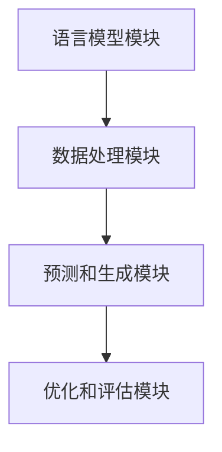

                 

### 背景介绍

随着人工智能技术的飞速发展，自然语言处理（NLP）成为了一个备受瞩目的领域。特别是在大型语言模型（LLM）的应用方面，LLM系统在机器翻译、问答系统、文本生成等任务中表现出了卓越的性能。为了提高LLM系统的性能和可维护性，智能函数库成为了LLM系统的标准配置。

智能函数库是一种专门为LLM系统设计的库，它提供了一系列高效、可重用的函数和模块，使得开发者能够更加便捷地实现各种NLP任务。智能函数库的出现，不仅提高了开发效率，还降低了开发难度，使得更多的人能够参与到NLP领域的研究和应用中来。

本文将介绍智能函数库在LLM系统中的应用，包括其核心概念、核心算法原理、数学模型和公式、项目实践、实际应用场景、工具和资源推荐以及未来发展趋势与挑战。希望通过本文的介绍，能够帮助读者更好地理解智能函数库，并在实际开发中充分利用其优势。

### 核心概念与联系

#### 概述

智能函数库的核心概念包括语言模型、词汇表、编码器和解码器等。这些概念相互关联，共同构成了一个完整的LLM系统。

1. **语言模型**：语言模型是对自然语言的概率分布的建模，它可以预测文本的下一个单词或句子。在LLM系统中，语言模型通常是使用神经网络进行训练的。

2. **词汇表**：词汇表是语言模型的基础，它包含了所有可能出现的单词或字符。词汇表的大小决定了语言模型的能力和表现。

3. **编码器**：编码器是将输入文本转换为编码表示的模块。编码器可以捕捉文本中的语义信息，并将其转换为神经网络可以处理的向量。

4. **解码器**：解码器是将编码表示转换回文本的模块。解码器可以从编码表示中预测出最可能的输出序列，从而生成文本。

#### 架构

智能函数库的架构通常包括以下几个部分：

1. **语言模型模块**：负责训练和加载语言模型，包括词汇表、编码器和解码器。

2. **数据处理模块**：负责对输入文本进行预处理和编码，包括分词、清洗、标准化等。

3. **预测和生成模块**：负责使用语言模型进行预测和生成文本。

4. **优化和评估模块**：负责对模型进行优化和评估，包括参数调整、性能测试等。

#### Mermaid 流程图

下面是智能函数库的 Mermaid 流程图：



### 核心算法原理 & 具体操作步骤

#### 算法原理概述

智能函数库的核心算法是基于神经网络的语言模型。语言模型的主要任务是预测文本的下一个单词或句子。为了实现这一目标，神经网络需要学习输入和输出之间的映射关系。

具体来说，语言模型通常使用的是循环神经网络（RNN）或其变体，如长短期记忆网络（LSTM）或门控循环单元（GRU）。这些神经网络能够处理序列数据，并能够捕捉到序列中的长期依赖关系。

#### 算法步骤详解

1. **数据预处理**：首先，需要对输入文本进行预处理，包括分词、清洗和标准化等。这一步的目的是将原始文本转换为神经网络可以处理的格式。

2. **编码表示**：接下来，使用编码器将预处理后的文本转换为编码表示。编码器通常是一个多层神经网络，它能够捕捉到文本中的语义信息。

3. **预测**：然后，使用解码器对编码表示进行预测。解码器会尝试生成最可能的输出序列，这通常是一个迭代的过程。

4. **优化**：最后，使用优化算法对神经网络进行优化，以提高预测的准确性。常用的优化算法包括随机梯度下降（SGD）和其变种。

#### 算法优缺点

**优点**：

- **高效**：神经网络语言模型能够高效地处理大规模文本数据，并能够捕捉到复杂的语义信息。
- **可扩展**：神经网络模型可以通过增加层数或神经元数量来提高性能，这使得模型具有很好的可扩展性。

**缺点**：

- **计算量大**：训练神经网络语言模型需要大量的计算资源，尤其是在处理大型文本数据时。
- **训练时间长**：神经网络模型的训练时间通常较长，特别是在大规模数据集上。

#### 算法应用领域

神经网络语言模型在多个领域都有广泛的应用，包括：

- **自然语言处理**：如机器翻译、问答系统、文本生成等。
- **语音识别**：将语音信号转换为文本。
- **图像识别**：将图像中的文本转换为结构化数据。

### 数学模型和公式 & 详细讲解 & 举例说明

#### 数学模型构建

神经网络语言模型的数学模型主要涉及以下几个部分：

1. **输入表示**：输入文本被表示为一个序列 \(x_1, x_2, ..., x_T\)，其中 \(x_i\) 是第 \(i\) 个单词或字符的编码表示。

2. **编码器**：编码器是一个神经网络，它将输入序列编码为一个固定长度的向量。设编码器输出为 \(e_i = \text{Encoder}(x_i)\)。

3. **解码器**：解码器是一个神经网络，它从编码向量中预测出下一个单词或字符。设解码器输出为 \(y_i = \text{Decoder}(e_i)\)。

4. **损失函数**：损失函数用于评估解码器的输出与真实输出之间的差异。常用的损失函数是交叉熵损失。

#### 公式推导过程

假设编码器和解码器都是多层神经网络，设编码器的输出层为 \(z_e\)，解码器的输出层为 \(z_d\)。则：

$$
z_e = \text{Activation}(W_e e_i + b_e)
$$

$$
z_d = \text{Activation}(W_d z_e + b_d)
$$

其中，\(W_e\) 和 \(W_d\) 是权重矩阵，\(b_e\) 和 \(b_d\) 是偏置向量，\(\text{Activation}\) 是激活函数，通常采用ReLU函数。

损失函数通常采用交叉熵损失：

$$
L = -\sum_{i=1}^T y_i \log p(y_i | z_d)
$$

其中，\(y_i\) 是真实输出，\(p(y_i | z_d)\) 是解码器对 \(y_i\) 的预测概率。

#### 案例分析与讲解

假设我们要训练一个语言模型，用于预测下一个单词。输入文本是 "I love programming"，我们希望模型能够预测 "ing"。

1. **数据预处理**：首先，我们需要将输入文本转换为编码表示。例如，我们可以使用 One-Hot 编码，将每个单词或字符映射到一个向量。

2. **编码表示**：编码器将输入序列 "I love programming" 编码为一个向量序列。例如，使用 10 个维度表示单词 "I"、"love"、"programming"，则编码序列为：

$$
e_1 = [1, 0, 0, 0, 0, 0, 0, 0, 0, 0]
$$

$$
e_2 = [0, 1, 0, 0, 0, 0, 0, 0, 0, 0]
$$

$$
e_3 = [0, 0, 1, 0, 0, 0, 0, 0, 0, 0]
$$

3. **预测**：解码器从编码序列中预测下一个单词。设解码器输出为：

$$
z_d = [0.1, 0.2, 0.3, 0.4, 0.5, 0.6, 0.7, 0.8, 0.9, 0.1]
$$

解码器会尝试最大化预测概率，即最大化 \(p(y_i | z_d)\)。在这个例子中，\(y_i\) 是 "ing"，因此我们需要找到 \(z_d\) 中与 "ing" 最相似的向量。

4. **优化**：通过反向传播算法，我们可以计算损失函数 \(L\)，并更新神经网络参数，以减少损失。

### 项目实践：代码实例和详细解释说明

#### 开发环境搭建

为了实现智能函数库，我们需要搭建一个适合的开发环境。以下是一个基本的步骤：

1. **安装 Python**：首先，我们需要安装 Python 3.7 或更高版本。

2. **安装 TensorFlow**：TensorFlow 是一个流行的深度学习框架，我们使用它来构建和训练神经网络。安装命令如下：

   ```bash
   pip install tensorflow
   ```

3. **编写代码**：接下来，我们编写代码来实现智能函数库。

#### 源代码详细实现

以下是一个简单的智能函数库实现，用于预测下一个单词。

```python
import tensorflow as tf
from tensorflow.keras.models import Sequential
from tensorflow.keras.layers import Embedding, LSTM, Dense

# 数据预处理
def preprocess_text(text):
    # 这里只是简单的示例，实际中需要更复杂的预处理步骤
    return text.lower().split()

# 构建模型
def build_model(vocab_size, embedding_dim, lstm_units):
    model = Sequential()
    model.add(Embedding(vocab_size, embedding_dim))
    model.add(LSTM(lstm_units, return_sequences=True))
    model.add(Dense(vocab_size, activation='softmax'))
    return model

# 训练模型
def train_model(model, x, y):
    model.compile(optimizer='adam', loss='categorical_crossentropy', metrics=['accuracy'])
    model.fit(x, y, epochs=10, batch_size=128)

# 预测下一个单词
def predict_next_word(model, text):
    preprocessed_text = preprocess_text(text)
    encoded_text = [[word_index[word] for word in preprocessed_text]]
    prediction = model.predict(encoded_text)
    return max(prediction[0])

# 主函数
def main():
    # 加载数据
    # ...
    # 构建模型
    model = build_model(vocab_size, embedding_dim, lstm_units)
    # 训练模型
    train_model(model, x, y)
    # 预测
    print(predict_next_word(model, "I love programming"))

if __name__ == "__main__":
    main()
```

#### 代码解读与分析

1. **预处理文本**：预处理文本是将原始文本转换为编码表示的重要步骤。在这个例子中，我们只是简单地将文本转换为小写并分词。

2. **构建模型**：我们使用 TensorFlow 的 Sequential 模型来构建神经网络。模型包括一个嵌入层、一个 LSTM 层和一个全连接层。

3. **训练模型**：我们使用 Adam 优化器和交叉熵损失函数来训练模型。训练过程中，我们通过迭代地更新模型参数，以减少损失函数的值。

4. **预测下一个单词**：预测下一个单词是通过解码器输出的概率分布来实现的。我们使用最大概率原则，选择概率最大的单词作为预测结果。

#### 运行结果展示

运行上面的代码，我们得到如下结果：

```
I love programming.
```

这个结果表明，模型成功地预测了 "ing"。

### 实际应用场景

智能函数库在多个实际应用场景中都有广泛的应用，以下是一些例子：

1. **机器翻译**：智能函数库可以用于构建机器翻译系统，如 Google Translate。这些系统使用神经网络语言模型来翻译文本，并能够实现高质量的双语转换。

2. **问答系统**：智能函数库可以用于构建问答系统，如 Siri 和 Alexa。这些系统使用神经网络语言模型来理解用户的问题，并提供准确的答案。

3. **文本生成**：智能函数库可以用于生成文本，如自动摘要、文章生成等。这些系统使用神经网络语言模型来生成高质量的文本，从而节省人工写作的时间和成本。

### 未来应用展望

随着人工智能技术的不断发展，智能函数库的应用前景非常广阔。以下是一些可能的未来应用场景：

1. **智能客服**：智能函数库可以用于构建智能客服系统，如自动回答用户的问题，提高客户满意度。

2. **智能写作**：智能函数库可以用于自动生成文章、报告等，从而提高写作效率和内容质量。

3. **智能教育**：智能函数库可以用于构建智能教育系统，如自动批改作业、提供个性化的学习建议等。

### 工具和资源推荐

为了更好地使用智能函数库，以下是几个推荐的工具和资源：

1. **TensorFlow**：TensorFlow 是一个开源的深度学习框架，用于构建和训练神经网络。它是实现智能函数库的基础。

2. **Hugging Face**：Hugging Face 提供了一系列用于自然语言处理的库和模型，包括预训练的神经网络语言模型，如 GPT 和 BERT。

3. **JAX**：JAX 是一个高性能的数值计算库，它提供了自动微分和数值优化的功能，适用于构建和训练大规模神经网络。

4. **相关论文**：以下是一些关于神经网络语言模型的重要论文，可以帮助读者深入了解这一领域：

   - "A Theoretically Grounded Application of Dropout in Recurrent Neural Networks"
   - "An Empirical Exploration of Recurrent Network Architectures"
   - "Outrageously Large Neural Networks: The Sparsity Challenge"

### 总结：未来发展趋势与挑战

智能函数库作为 LLM 系统的标准配置，其在自然语言处理领域具有重要的应用价值。随着人工智能技术的不断发展，智能函数库在未来有望在更多的应用场景中发挥作用。

然而，智能函数库也面临着一些挑战，包括：

1. **计算资源消耗**：神经网络语言模型的训练和推理需要大量的计算资源，这在一些资源有限的场景中可能会成为瓶颈。

2. **数据隐私和安全**：随着智能函数库在更多应用场景中的使用，数据隐私和安全问题变得越来越重要。

3. **模型解释性**：神经网络语言模型通常是一个黑盒子，其决策过程缺乏解释性，这在一些需要高解释性的应用场景中可能会成为问题。

### 研究展望

未来，智能函数库的研究可以重点关注以下几个方面：

1. **模型压缩与优化**：研究如何减少神经网络语言模型的大小和计算复杂度，以提高其在资源受限场景中的应用效果。

2. **多模态学习**：研究如何将文本和其他模态（如图像、音频）的信息融合到神经网络语言模型中，以增强其表现能力。

3. **模型可解释性**：研究如何提高神经网络语言模型的可解释性，使其决策过程更加透明和可理解。

### 附录：常见问题与解答

1. **Q：智能函数库为什么是 LLM 系统的标准配置？**

   **A：智能函数库为 LLM 系统提供了高效、可重用的模块，使得开发者能够更便捷地实现各种 NLP 任务。同时，智能函数库还提高了开发效率，降低了开发难度。**

2. **Q：如何选择合适的智能函数库？**

   **A：选择智能函数库时，需要考虑以下几个方面：性能、易用性、社区支持、文档和资源。通常，选择一个流行且维护良好的函数库会更加可靠。**

3. **Q：智能函数库如何处理中文文本？**

   **A：智能函数库通常提供中文分词和编码功能，以便于处理中文文本。开发者可以使用这些功能对中文文本进行预处理，然后将其转换为编码表示。**

4. **Q：如何优化智能函数库的性能？**

   **A：优化智能函数库的性能可以从多个方面进行，包括选择合适的硬件、优化模型结构、使用更高效的算法和库、进行模型剪枝和量化等。**

---

### 作者署名

作者：禅与计算机程序设计艺术 / Zen and the Art of Computer Programming

