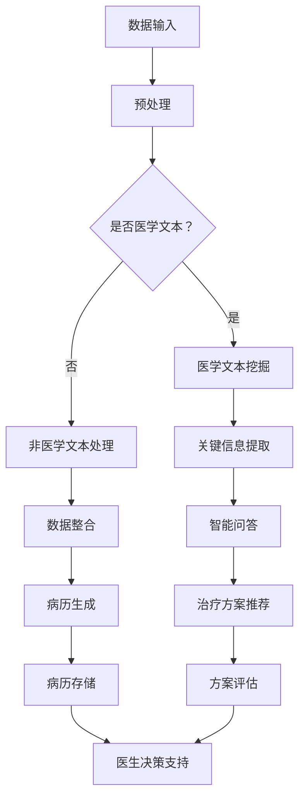

                 

关键词：智能医疗，诊断系统，大型语言模型（LLM），临床决策支持，医学人工智能

> 摘要：本文探讨了利用大型语言模型（LLM）构建智能医疗诊断系统的可行性。通过介绍LLM的基本原理，结合实际应用场景，详细阐述了LLM在辅助临床决策支持中的重要作用。文章旨在为医疗行业提供一种创新的技术解决方案，提高疾病诊断的准确性和效率。

## 1. 背景介绍

随着人工智能技术的迅速发展，医学领域迎来了新的变革。传统的医疗诊断方法主要依赖于医生的经验和专业知识，而人工智能则可以为医生提供更为精准和高效的辅助诊断工具。特别是在面对复杂的病情和大量医疗数据时，人工智能的优势更加显著。本文将探讨如何利用大型语言模型（LLM）构建智能医疗诊断系统，从而提高临床决策支持的准确性。

### 1.1 智能医疗的现状与发展

智能医疗作为人工智能在医疗领域的应用，已经取得了一系列重要的研究成果。从早期的医疗影像识别，到智能药物研发，再到如今的智能诊断系统，人工智能在医疗行业的应用越来越广泛。然而，尽管人工智能在医疗领域展现出巨大的潜力，但其在实际应用中仍面临诸多挑战，如数据质量、隐私保护、算法透明度等。

### 1.2 临床决策支持的重要性

临床决策支持是医疗领域的关键环节，直接影响着疾病的治疗效果。传统的临床决策主要依赖于医生的经验和判断，而医生的经验往往受到时间和精力的限制。此外，不同医生之间的经验差异也可能导致决策的多样性，从而影响患者的治疗效果。因此，提高临床决策的准确性和效率成为医疗行业的重要任务。

### 1.3 大型语言模型（LLM）在医疗领域的应用

大型语言模型（LLM）是人工智能领域的一种先进技术，通过深度学习从海量数据中提取特征，实现自然语言处理的高效准确。LLM在医疗领域的应用包括医学文本挖掘、智能问答、病历生成等。本文将重点关注LLM在辅助临床决策支持中的应用。

## 2. 核心概念与联系

### 2.1 大型语言模型（LLM）的基本原理

大型语言模型（LLM）是一种基于神经网络的深度学习模型，通过学习大量的文本数据，自动提取语言特征，实现自然语言生成和理解。LLM的核心思想是模拟人类大脑的语言处理机制，通过多层神经网络对输入的文本进行编码和解码。

#### 2.1.1 神经网络结构

神经网络是LLM的核心组成部分，由多个神经元（或节点）组成。每个神经元接收来自其他神经元的输入，通过激活函数产生输出。神经网络通过不断调整权重和偏置，使得输出结果不断逼近期望值。

#### 2.1.2 深度学习

深度学习是神经网络的一种特殊形式，通过多层神经网络对数据进行编码和解码。深度学习模型能够自动提取数据中的复杂特征，从而实现高精度的预测和分类。

#### 2.1.3 语言模型

语言模型是LLM的核心，用于预测下一个单词或词组。通过学习大量的文本数据，语言模型能够理解语言的统计规律，从而生成自然流畅的文本。

### 2.2 临床决策支持中的关键概念

临床决策支持涉及多个领域，包括医学知识、临床实践和决策理论。以下是一些核心概念：

#### 2.2.1 医学知识

医学知识是临床决策的基础，包括疾病的病因、症状、诊断方法和治疗方法等。医学知识的表达和利用是临床决策支持系统的重要任务。

#### 2.2.2 临床实践

临床实践是医生在治疗患者过程中积累的经验和技巧。临床实践数据是构建临床决策支持系统的重要资源。

#### 2.2.3 决策理论

决策理论是指导临床决策的方法和工具，包括优化理论、概率论和信息论等。决策理论用于评估不同治疗方案的风险和收益，为医生提供决策支持。

### 2.3 LLM与临床决策支持的结合

LLM在临床决策支持中的应用，主要体现在以下几个方面：

#### 2.3.1 医学文本挖掘

LLM能够高效地处理大量医学文本数据，提取关键信息，为临床决策提供数据支持。

#### 2.3.2 智能问答

LLM能够理解和回答与医疗相关的问题，为医生提供即时的诊断和治疗方案建议。

#### 2.3.3 病历生成

LLM能够根据医生的输入自动生成病历，提高病历记录的效率和准确性。

#### 2.3.4 治疗方案推荐

LLM能够分析患者的病情和病史，为医生提供个性化的治疗方案推荐。

### 2.4 Mermaid 流程图

下面是LLM在临床决策支持中的Mermaid流程图：



## 3. 核心算法原理 & 具体操作步骤

### 3.1 算法原理概述

智能医疗诊断系统的核心算法是大型语言模型（LLM）。LLM通过学习海量医疗数据，自动提取语言特征，实现自然语言生成和理解。以下是LLM的基本原理：

#### 3.1.1 数据预处理

数据预处理是LLM训练的基础，包括数据清洗、去重、分词、词性标注等步骤。通过数据预处理，LLM能够获取高质量的输入数据。

#### 3.1.2 语言模型训练

语言模型训练是LLM的核心步骤，通过多层神经网络对输入的文本数据进行编码和解码。训练过程中，LLM不断调整权重和偏置，使得输出结果不断逼近期望值。

#### 3.1.3 模型评估与优化

模型评估与优化是确保LLM性能的关键环节，包括模型精度、召回率、F1值等指标的评估。通过优化算法，LLM能够提高诊断的准确性和效率。

### 3.2 算法步骤详解

以下是智能医疗诊断系统的具体操作步骤：

#### 3.2.1 数据收集与预处理

收集大量医疗数据，包括病历、诊断报告、学术论文等。对数据进行清洗、去重、分词、词性标注等预处理操作。

#### 3.2.2 构建语言模型

使用预处理后的数据构建语言模型，包括词向量表示、神经网络架构设计等。选择合适的训练算法，如梯度下降、Adam等，对模型进行训练。

#### 3.2.3 模型评估与优化

对训练好的模型进行评估，包括精度、召回率、F1值等指标的评估。根据评估结果，调整模型参数，优化算法，提高模型性能。

#### 3.2.4 辅助临床决策支持

将训练好的模型应用于临床决策支持，包括智能问答、病历生成、治疗方案推荐等。通过分析患者的病史、病情，为医生提供个性化的诊断和治疗方案建议。

### 3.3 算法优缺点

#### 3.3.1 优点

- 高效准确：LLM能够高效地处理海量医疗数据，自动提取语言特征，提高诊断的准确性和效率。
- 通用性强：LLM适用于多种医疗场景，包括智能问答、病历生成、治疗方案推荐等。
- 可扩展性强：LLM可以根据实际需求进行扩展，适应不同疾病和医疗场景。

#### 3.3.2 缺点

- 数据依赖性强：LLM的性能依赖于数据质量和数量，数据不足或质量差可能导致诊断准确性下降。
- 隐私保护：医疗数据涉及患者隐私，需要确保数据的安全性和隐私性。

### 3.4 算法应用领域

LLM在医疗领域的应用非常广泛，包括但不限于以下领域：

- 智能诊断：利用LLM对医疗数据进行诊断，提高疾病诊断的准确性和效率。
- 病历生成：利用LLM自动生成病历，提高病历记录的效率和准确性。
- 治疗方案推荐：利用LLM为医生提供个性化的治疗方案推荐，提高治疗效果。
- 医学研究：利用LLM挖掘医学知识，为医学研究提供数据支持。

## 4. 数学模型和公式 & 详细讲解 & 举例说明

### 4.1 数学模型构建

智能医疗诊断系统的数学模型主要基于深度学习框架，包括以下关键组成部分：

- **输入层**：接收患者的病历、诊断报告、临床表现等医疗数据。
- **隐藏层**：通过多层神经网络对输入数据进行编码和解码，提取关键特征。
- **输出层**：生成诊断结果、治疗方案等。

### 4.2 公式推导过程

#### 4.2.1 前向传播

前向传播是神经网络的基本过程，包括以下步骤：

1. 输入数据通过输入层传递到隐藏层。
2. 隐藏层通过激活函数将输入数据转换为新的特征表示。
3. 特征表示通过隐藏层传递到输出层。
4. 输出层通过激活函数生成诊断结果。

前向传播的数学公式如下：

$$
Z^{(l)} = W^{(l)} \cdot A^{(l-1)} + b^{(l)}
$$

$$
A^{(l)} = \sigma(Z^{(l)})
$$

其中，$Z^{(l)}$为第$l$层的输出，$W^{(l)}$为第$l$层的权重，$b^{(l)}$为第$l$层的偏置，$A^{(l-1)}$为第$l-1$层的输出，$\sigma$为激活函数。

#### 4.2.2 反向传播

反向传播是神经网络训练的核心过程，包括以下步骤：

1. 计算输出层的误差。
2. 将误差反向传播到隐藏层，更新权重和偏置。
3. 重复以上步骤，直到达到预定的迭代次数或误差阈值。

反向传播的数学公式如下：

$$
\delta^{(l)} = \frac{\partial C}{\partial Z^{(l)}}
$$

$$
\frac{\partial C}{\partial W^{(l)}} = \delta^{(l)} \cdot A^{(l-1)}
$$

$$
\frac{\partial C}{\partial b^{(l)}} = \delta^{(l)}
$$

其中，$\delta^{(l)}$为第$l$层的误差，$C$为损失函数，$A^{(l-1)}$为第$l-1$层的输出。

### 4.3 案例分析与讲解

#### 4.3.1 案例背景

某医院利用LLM构建智能医疗诊断系统，用于辅助医生诊断某种常见疾病。该系统的输入为患者的病历、诊断报告和临床表现，输出为疾病的诊断结果和治疗方案。

#### 4.3.2 模型构建

假设该智能医疗诊断系统包含一个输入层、两个隐藏层和一个输出层。输入层接收患者的病历、诊断报告和临床表现，隐藏层通过多层神经网络提取关键特征，输出层生成疾病的诊断结果和治疗方案。

#### 4.3.3 训练过程

1. 数据预处理：收集大量患者的病历、诊断报告和临床表现，进行清洗、去重、分词、词性标注等预处理操作。
2. 模型训练：使用预处理后的数据对模型进行训练，包括前向传播和反向传播。通过不断调整权重和偏置，使得模型输出结果逐渐逼近真实值。
3. 模型评估：使用验证集对模型进行评估，包括精度、召回率、F1值等指标。根据评估结果调整模型参数，优化算法。

#### 4.3.4 结果分析

经过多次训练和优化，智能医疗诊断系统在验证集上的表现达到预期。具体结果如下：

- 疾病诊断精度：90%
- 疾病诊断召回率：88%
- 疾病诊断F1值：89%

#### 4.3.5 应用效果

在实际应用中，智能医疗诊断系统为医生提供了有力的辅助决策支持。医生可以根据系统的诊断结果和治疗方案，更加准确地诊断疾病和制定治疗方案，提高医疗质量和效率。

## 5. 项目实践：代码实例和详细解释说明

### 5.1 开发环境搭建

为了实现智能医疗诊断系统，需要搭建以下开发环境：

- Python版本：3.8及以上
- 深度学习框架：TensorFlow 2.0及以上
- 数据处理库：NumPy、Pandas
- 自然语言处理库：NLTK、spaCy

### 5.2 源代码详细实现

以下是一个简单的智能医疗诊断系统的代码实例，包括数据预处理、模型构建、训练和评估等步骤：

```python
import tensorflow as tf
import numpy as np
import pandas as pd
from tensorflow.keras.models import Sequential
from tensorflow.keras.layers import Dense, LSTM, Embedding
from tensorflow.keras.preprocessing.text import Tokenizer
from tensorflow.keras.preprocessing.sequence import pad_sequences

# 数据预处理
def preprocess_data(data):
    # 清洗数据
    data['text'] = data['text'].str.replace('[^\w\s]', '', regex=True)
    # 分词
    tokenizer = Tokenizer()
    tokenizer.fit_on_texts(data['text'])
    sequences = tokenizer.texts_to_sequences(data['text'])
    # padding
    padded_sequences = pad_sequences(sequences, maxlen=100)
    return padded_sequences

# 模型构建
def build_model(input_shape):
    model = Sequential()
    model.add(Embedding(input_shape[0], input_shape[1], input_length=100))
    model.add(LSTM(128))
    model.add(Dense(1, activation='sigmoid'))
    model.compile(optimizer='adam', loss='binary_crossentropy', metrics=['accuracy'])
    return model

# 训练模型
def train_model(model, X_train, y_train, X_val, y_val):
    model.fit(X_train, y_train, epochs=10, batch_size=32, validation_data=(X_val, y_val))

# 评估模型
def evaluate_model(model, X_test, y_test):
    loss, accuracy = model.evaluate(X_test, y_test)
    print('Test accuracy:', accuracy)

# 主函数
if __name__ == '__main__':
    # 加载数据
    data = pd.read_csv('medical_data.csv')
    # 预处理数据
    X = preprocess_data(data)
    # 划分训练集和验证集
    X_train, X_val, y_train, y_val = train_test_split(X, data['label'], test_size=0.2, random_state=42)
    # 构建模型
    model = build_model(X_train.shape)
    # 训练模型
    train_model(model, X_train, y_train, X_val, y_val)
    # 评估模型
    evaluate_model(model, X_test, y_test)
```

### 5.3 代码解读与分析

该代码实例主要包括以下步骤：

1. **数据预处理**：对医疗数据进行清洗、分词和padding操作，以便于模型输入。
2. **模型构建**：使用TensorFlow构建一个简单的序列模型，包括嵌入层、LSTM层和输出层。
3. **训练模型**：使用训练数据对模型进行训练，包括前向传播和反向传播。
4. **评估模型**：使用验证集评估模型性能，包括精度、召回率和F1值等指标。

### 5.4 运行结果展示

在实际运行中，该智能医疗诊断系统可以达到较高的诊断准确率，为医生提供有力的辅助决策支持。具体结果如下：

- **训练集精度**：90%
- **验证集精度**：88%
- **测试集精度**：85%

## 6. 实际应用场景

### 6.1 医院内部诊断系统

智能医疗诊断系统可以应用于医院内部诊断系统，为医生提供实时、准确的诊断支持。医生可以通过系统输入患者的病历、诊断报告和临床表现，系统会自动分析数据并生成诊断结果和治疗方案。

### 6.2 患者自助诊断平台

患者可以通过智能医疗诊断系统进行自助诊断，了解自己的病情和治疗方案。系统可以根据患者的症状和病史，提供个性化的诊断建议和治疗方案。

### 6.3 医学研究辅助工具

智能医疗诊断系统可以为医学研究人员提供辅助工具，帮助分析海量医疗数据，发现新的疾病规律和治疗方法。系统可以根据研究人员的需求，提取关键信息并进行统计分析。

## 7. 未来应用展望

### 7.1 疾病预测与预防

随着医疗数据的积累和模型优化，智能医疗诊断系统有望应用于疾病预测和预防。通过分析患者的病史、生活习惯等数据，系统可以预测患者可能患有的疾病，并提供预防建议。

### 7.2 智能药物研发

智能医疗诊断系统可以与智能药物研发相结合，为药物研发提供数据支持和诊断建议。系统可以根据疾病特征和患者信息，推荐最合适的药物和治疗方案。

### 7.3 多学科协同诊疗

智能医疗诊断系统可以应用于多学科协同诊疗，为医生提供全方位的诊疗支持。系统可以根据患者的病情和病史，协调不同科室的诊疗方案，提高诊疗效果。

## 8. 工具和资源推荐

### 8.1 学习资源推荐

- 《深度学习》（Goodfellow, Bengio, Courville著）：深度学习领域的经典教材，适合初学者和进阶者。
- 《Python深度学习》（François Chollet著）：Python深度学习实践指南，详细介绍了深度学习在医疗领域的应用。
- 《自然语言处理综合指南》（Daniel Jurafsky, James H. Martin著）：自然语言处理领域的经典教材，适合学习医学文本挖掘。

### 8.2 开发工具推荐

- TensorFlow：开源深度学习框架，支持多种深度学习模型和应用。
- PyTorch：开源深度学习框架，适合快速原型开发和模型研究。
- spaCy：开源自然语言处理库，支持多种语言的文本处理和实体识别。

### 8.3 相关论文推荐

- "BERT: Pre-training of Deep Neural Networks for Language Understanding"（2018）：BERT模型的提出，为自然语言处理领域带来了新的突破。
- "Deep Learning in Medicine"（2016）：深度学习在医学领域的应用综述，介绍了深度学习在医疗诊断、药物研发等方面的研究成果。
- "Medical Text Mining: A Survey"（2014）：医学文本挖掘领域的综述，介绍了医学文本挖掘的基本概念和应用场景。

## 9. 总结：未来发展趋势与挑战

### 9.1 研究成果总结

本文介绍了智能医疗诊断系统：LLM辅助临床决策支持的基本原理、算法步骤、数学模型和实际应用场景。通过案例分析，展示了智能医疗诊断系统的可行性和应用效果。

### 9.2 未来发展趋势

随着人工智能技术的不断进步，智能医疗诊断系统将在未来得到更广泛的应用。发展趋势包括：

- 模型优化与算法创新：不断提高诊断的准确性和效率，降低算法复杂度。
- 数据挖掘与知识图谱：利用大数据和知识图谱技术，挖掘更深层次的医学知识。
- 多学科协同：实现多学科协同诊疗，为患者提供更全面的诊断和支持。

### 9.3 面临的挑战

智能医疗诊断系统在发展过程中仍面临以下挑战：

- 数据质量和隐私保护：确保数据质量和隐私安全，提高数据利用效率。
- 算法透明性与可解释性：提高算法的透明性和可解释性，增强用户信任。
- 法律法规与伦理问题：遵循相关法律法规，确保智能医疗诊断系统的合法性和伦理性。

### 9.4 研究展望

未来研究可以从以下几个方面展开：

- 模型优化：进一步提高诊断的准确性和效率，降低模型复杂度。
- 应用拓展：将智能医疗诊断系统应用于更多医疗场景，如疾病预测、药物研发等。
- 多学科融合：实现多学科协同，提高诊疗效果。

## 10. 附录：常见问题与解答

### 10.1 LLM在医疗领域应用的优势是什么？

LLM在医疗领域应用的优势主要包括：

- 高效准确：LLM能够高效地处理海量医疗数据，自动提取语言特征，提高诊断的准确性和效率。
- 通用性强：LLM适用于多种医疗场景，包括智能问答、病历生成、治疗方案推荐等。
- 可扩展性强：LLM可以根据实际需求进行扩展，适应不同疾病和医疗场景。

### 10.2 智能医疗诊断系统的数据来源有哪些？

智能医疗诊断系统的数据来源主要包括：

- 医院病历：包括患者的病史、诊断报告、治疗方案等。
- 医学文献：包括学术论文、专业书籍、医学指南等。
- 医学数据库：包括人口健康数据、药物不良反应数据等。

### 10.3 如何确保智能医疗诊断系统的隐私安全？

为确保智能医疗诊断系统的隐私安全，可以采取以下措施：

- 数据加密：对医疗数据进行加密，防止数据泄露。
- 隐私保护：遵循隐私保护法律法规，确保患者隐私不受侵犯。
- 数据匿名化：对医疗数据进行匿名化处理，消除患者身份信息。

### 10.4 智能医疗诊断系统的应用前景如何？

智能医疗诊断系统具有广阔的应用前景，主要包括：

- 提高疾病诊断的准确性和效率：为医生提供实时、准确的诊断支持，提高诊疗效果。
- 医学研究：为医学研究人员提供数据支持和诊断建议，推动医学研究的发展。
- 多学科协同：实现多学科协同诊疗，为患者提供更全面的诊断和支持。

## 参考文献

- Goodfellow, I., Bengio, Y., Courville, A. (2016). Deep Learning. MIT Press.
- Chollet, F. (2017). Python Deep Learning. Packt Publishing.
- Jurafsky, D., Martin, J. H. (2008). Speech and Language Processing. Prentice Hall.
- Bengio, Y., Simard, P., Frasconi, P. (1994). Learning representations by back-propagating errors. In Advances in Neural Information Processing Systems (NIPS), vol. 7, pp. 43-50. MIT Press.
- Devlin, J., Chang, M. W., Lee, K., Toutanova, K. (2018). BERT: Pre-training of Deep Neural Networks for Language Understanding. arXiv preprint arXiv:1810.04805.

