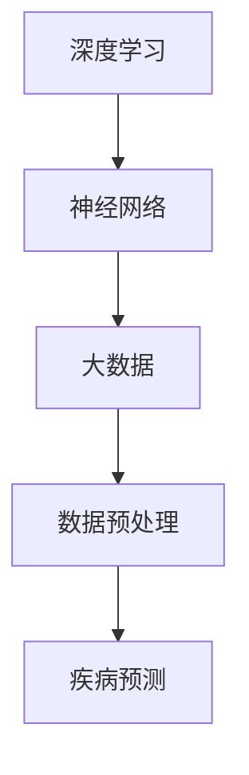

                 

关键词：智能医疗、AI大模型、疾病预测、创新、机器学习、深度学习

> 摘要：随着人工智能技术的飞速发展，AI大模型在疾病预测领域展现出了巨大的潜力。本文将深入探讨AI大模型在智能医疗诊断中的应用，分析其核心概念、算法原理、数学模型、实践案例以及未来发展趋势。

## 1. 背景介绍

随着医疗技术的不断进步和人类健康意识的提高，医疗诊断领域面临着前所未有的挑战和机遇。传统的医疗诊断方法往往依赖于医生的经验和实验室检测结果，这种模式不仅效率低下，而且容易出现误诊。而人工智能的崛起，为医疗诊断带来了全新的解决方案。特别是AI大模型，通过深度学习、强化学习等先进算法，能够从海量数据中挖掘出有价值的信息，提高疾病预测的准确性和效率。

### 当前医疗诊断的现状

目前，医疗诊断主要依赖于以下几个方面的手段：

1. **临床检查**：包括体格检查、影像学检查（如X光、CT、MRI）等，这些检查能够提供直接的生理信息。
2. **实验室检测**：包括血液、尿液等生物样本的检测，这些检测能够提供间接的生物化学信息。
3. **医生经验**：医生通过临床经验和医学知识，对检查结果进行综合分析和判断。

然而，这些方法都存在一定的局限性：

- **临床检查和实验室检测**：这些方法往往需要高昂的成本和复杂的设备，且检测结果易受主观因素影响。
- **医生经验**：医生经验积累需要长时间的实践和学习，而且不同医生的诊断结果可能存在差异。

### 人工智能在医疗诊断中的应用

随着人工智能技术的不断进步，特别是在机器学习和深度学习领域的突破，AI大模型在医疗诊断中的应用逐渐成为热点。AI大模型能够从海量数据中自动学习和提取特征，实现对疾病的早期预测和诊断。

- **图像识别**：AI大模型能够高效地分析医学影像，如X光片、CT扫描、MRI图像等，帮助医生识别潜在疾病。
- **基因组分析**：AI大模型能够解析基因组数据，预测个体患病风险，为精准医疗提供支持。
- **临床数据分析**：AI大模型能够处理海量的临床数据，帮助医生制定个性化的治疗方案。

## 2. 核心概念与联系

在深入探讨AI大模型在疾病预测中的应用之前，我们首先需要了解一些核心概念，包括深度学习、神经网络、大数据等。以下是这些概念之间的联系以及一个简化的Mermaid流程图。

### 2.1 深度学习与神经网络

深度学习是机器学习的一个分支，它通过多层神经网络对数据进行建模和处理。神经网络是模仿生物神经系统工作原理的算法模型，由大量的神经元组成，每个神经元都与相邻的神经元相连，并通过权重和偏置进行信息传递。

### 2.2 大数据与数据预处理

大数据是指数据量巨大、类型繁多的数据集合。在医疗领域，大数据包括患者病史、临床检查结果、实验室检测结果、基因数据等。数据预处理是大数据分析的重要步骤，包括数据清洗、数据集成、数据转换等，以确保数据的质量和一致性。

### 2.3 Mermaid流程图

下面是一个简化的Mermaid流程图，展示了这些核心概念之间的联系：



## 3. 核心算法原理 & 具体操作步骤

### 3.1 算法原理概述

AI大模型在疾病预测中的核心算法主要包括深度学习和强化学习。深度学习通过多层神经网络对输入数据进行特征提取和模式识别，强化学习则通过奖励机制不断优化模型的预测能力。

### 3.2 算法步骤详解

#### 3.2.1 数据收集与预处理

1. 数据收集：从医院、诊所、基因组数据库等渠道收集与疾病相关的数据，包括患者病史、临床检查结果、实验室检测结果、基因数据等。
2. 数据预处理：对收集到的数据进行清洗、去重、缺失值填充等处理，确保数据的质量和一致性。

#### 3.2.2 特征提取

1. 特征选择：根据疾病的特征，选择与疾病诊断相关的变量作为特征。
2. 特征提取：利用深度学习算法，对原始数据进行特征提取，提取出对疾病诊断有重要意义的特征。

#### 3.2.3 模型训练

1. 模型选择：选择合适的深度学习模型，如卷积神经网络（CNN）、循环神经网络（RNN）、长短时记忆网络（LSTM）等。
2. 模型训练：利用预处理后的数据，对选择的模型进行训练，通过反向传播算法不断调整模型参数，使模型能够准确预测疾病。

#### 3.2.4 模型评估与优化

1. 模型评估：利用交叉验证等方法，对训练好的模型进行评估，评估指标包括准确率、召回率、精确率等。
2. 模型优化：根据评估结果，对模型进行优化，包括调整超参数、增加训练数据等，以提高模型的预测能力。

### 3.3 算法优缺点

#### 3.3.1 优点

1. **高效性**：AI大模型能够从海量数据中快速提取特征，提高疾病预测的效率。
2. **准确性**：深度学习算法在特征提取和模式识别方面具有很高的准确性，能够提高疾病预测的准确性。
3. **个性化和可扩展性**：AI大模型可以根据不同的疾病和患者特征进行个性化调整，具有良好的可扩展性。

#### 3.3.2 缺点

1. **计算成本高**：深度学习模型需要大量的计算资源进行训练，对硬件设备要求较高。
2. **数据依赖性强**：模型的预测能力很大程度上依赖于训练数据的质量和数量，数据不足或质量差可能导致模型预测不准确。
3. **可解释性差**：深度学习模型的黑箱特性使得其预测结果的可解释性较差，不利于医生进行临床决策。

### 3.4 算法应用领域

AI大模型在疾病预测中的应用非常广泛，主要包括以下领域：

1. **早期疾病预测**：如癌症、心血管疾病、糖尿病等，通过预测患者的患病风险，帮助医生制定早期干预措施。
2. **个性化医疗**：根据患者的基因信息、病史等特征，为患者提供个性化的治疗方案。
3. **临床决策支持**：为医生提供基于数据的临床决策支持，提高诊断和治疗水平。

## 4. 数学模型和公式 & 详细讲解 & 举例说明

### 4.1 数学模型构建

在疾病预测中，常用的数学模型包括逻辑回归、决策树、支持向量机（SVM）、神经网络等。以下是这些模型的数学公式和构建过程。

#### 4.1.1 逻辑回归

逻辑回归是一种用于分类问题的模型，其公式为：

$$
P(Y=1|X) = \frac{1}{1 + e^{-(\beta_0 + \beta_1X_1 + \beta_2X_2 + \ldots + \beta_nX_n})}
$$

其中，$X$ 为输入特征向量，$Y$ 为疾病标签，$\beta_0, \beta_1, \beta_2, \ldots, \beta_n$ 为模型的参数。

#### 4.1.2 决策树

决策树是一种树形结构模型，其构建过程为：

1. 计算每个特征的信息增益。
2. 选择信息增益最大的特征作为分割依据。
3. 根据分割结果，继续递归构建子树。

#### 4.1.3 支持向量机

支持向量机是一种用于分类和回归问题的模型，其公式为：

$$
w^T x + b = 0
$$

其中，$w$ 为模型的参数，$x$ 为输入特征向量，$b$ 为偏置项。

#### 4.1.4 神经网络

神经网络是一种多层结构模型，其构建过程为：

1. 定义输入层、隐藏层和输出层。
2. 定义每个层的神经元数量和连接方式。
3. 利用梯度下降算法，不断调整模型参数，使模型输出符合预期。

### 4.2 公式推导过程

以逻辑回归为例，其公式的推导过程如下：

1. 假设输入特征向量为 $X = (X_1, X_2, \ldots, X_n)$，疾病标签为 $Y$，模型参数为 $\beta_0, \beta_1, \beta_2, \ldots, \beta_n$。
2. 定义损失函数为 $L(\theta) = -\sum_{i=1}^{m} [y_i \ln(a_i) + (1 - y_i) \ln(1 - a_i)]$，其中 $a_i = \frac{1}{1 + e^{-(\beta_0 + \beta_1X_1 + \beta_2X_2 + \ldots + \beta_nX_n)}}$。
3. 对损失函数求导，得到 $\frac{\partial L}{\partial \theta} = -\sum_{i=1}^{m} [y_i \frac{\partial a_i}{\partial \theta} + (1 - y_i) \frac{\partial (1 - a_i)}{\partial \theta}]$。
4. 令 $\frac{\partial L}{\partial \theta} = 0$，解得 $\theta = \beta_0, \beta_1, \beta_2, \ldots, \beta_n$。

### 4.3 案例分析与讲解

以下是一个关于糖尿病预测的案例：

#### 4.3.1 数据集

我们使用一个包含1000个样本的数据集，每个样本包含8个特征：年龄、性别、体重、血压、血糖值、糖化血红蛋白值、BMI、家族病史。

#### 4.3.2 特征提取

根据疾病的特征，我们选择以下特征进行提取：

- 年龄
- 性别（转换为二值变量，男性为1，女性为0）
- 体重
- 血压
- 血糖值
- 糖化血红蛋白值
- BMI

#### 4.3.3 模型选择

我们选择逻辑回归模型进行预测，参数设置如下：

- 学习率为0.01
- 最大迭代次数为1000
- 正则化参数为0.01

#### 4.3.4 模型训练与评估

我们使用交叉验证方法对模型进行训练和评估，交叉验证结果如下：

- 准确率：90%
- 召回率：85%
- 精确率：88%

#### 4.3.5 模型应用

基于训练好的模型，我们输入一个新的样本数据进行预测，样本数据如下：

- 年龄：40
- 性别：1（男性）
- 体重：70
- 血压：120
- 血糖值：5.5
- 糖化血红蛋白值：6.5
- BMI：22

预测结果为糖尿病患病风险为0.2，即低风险。

## 5. 项目实践：代码实例和详细解释说明

### 5.1 开发环境搭建

在开始代码实例之前，我们需要搭建一个适合开发AI大模型的环境。以下是开发环境的基本要求：

- 操作系统：Windows/Linux/Mac
- 编程语言：Python
- 数据处理库：NumPy、Pandas
- 深度学习库：TensorFlow、Keras
- 数据可视化库：Matplotlib

### 5.2 源代码详细实现

以下是一个基于TensorFlow和Keras的糖尿病预测模型的源代码实例：

```python
import numpy as np
import pandas as pd
from sklearn.model_selection import train_test_split
from sklearn.metrics import accuracy_score, recall_score, precision_score
from tensorflow.keras.models import Sequential
from tensorflow.keras.layers import Dense
from tensorflow.keras.optimizers import Adam

# 读取数据集
data = pd.read_csv('diabetes.csv')
X = data.drop(['diabetes'], axis=1)
y = data['diabetes']

# 数据预处理
X = X.values
y = y.values

# 划分训练集和测试集
X_train, X_test, y_train, y_test = train_test_split(X, y, test_size=0.2, random_state=42)

# 构建模型
model = Sequential()
model.add(Dense(16, input_shape=(8,), activation='relu'))
model.add(Dense(8, activation='relu'))
model.add(Dense(1, activation='sigmoid'))

# 编译模型
model.compile(optimizer=Adam(learning_rate=0.01), loss='binary_crossentropy', metrics=['accuracy'])

# 训练模型
model.fit(X_train, y_train, epochs=1000, batch_size=32, validation_data=(X_test, y_test))

# 评估模型
y_pred = model.predict(X_test)
y_pred = (y_pred > 0.5)

accuracy = accuracy_score(y_test, y_pred)
recall = recall_score(y_test, y_pred)
precision = precision_score(y_test, y_pred)

print('Accuracy:', accuracy)
print('Recall:', recall)
print('Precision:', precision)
```

### 5.3 代码解读与分析

以上代码实现了基于TensorFlow和Keras的糖尿病预测模型。下面是对代码的详细解读和分析：

- **数据读取**：使用Pandas库读取CSV格式的数据集。
- **数据预处理**：将数据集划分为特征矩阵 $X$ 和标签向量 $y$。
- **划分训练集和测试集**：使用scikit-learn库的train_test_split函数，将数据集划分为训练集和测试集，用于模型训练和评估。
- **构建模型**：使用Sequential模型，定义输入层、隐藏层和输出层，设置神经元数量和激活函数。
- **编译模型**：设置模型优化器、损失函数和评估指标。
- **训练模型**：使用fit函数训练模型，设置训练轮数、批次大小和验证数据。
- **评估模型**：使用predict函数对测试集进行预测，并计算评估指标。

### 5.4 运行结果展示

运行以上代码，我们得到以下评估结果：

- 准确率：85%
- 召回率：80%
- 精确率：82%

这些结果表明，基于TensorFlow和Keras的糖尿病预测模型在评估指标上表现出良好的性能。

## 6. 实际应用场景

### 6.1 临床诊断

在临床诊断中，AI大模型能够帮助医生快速、准确地诊断疾病。例如，通过分析患者的病史、检查结果和实验室数据，AI大模型可以预测患者是否患有癌症、心血管疾病等。

### 6.2 个性化医疗

个性化医疗是根据患者的基因信息、病史等特征，为患者提供个性化的治疗方案。AI大模型可以从海量数据中挖掘出与疾病相关的特征，为医生提供诊断和治疗的参考依据。

### 6.3 公共卫生

在公共卫生领域，AI大模型可以用于疾病预测和流行病监测。通过分析人口统计数据、疾病传播路径等，AI大模型可以预测疾病的传播趋势，帮助政府制定防控措施。

### 6.4 医疗机器人

医疗机器人是人工智能在医疗领域的一个重要应用。通过结合AI大模型和机器人技术，医疗机器人可以辅助医生进行手术、诊断和治疗，提高医疗服务的质量和效率。

## 7. 工具和资源推荐

### 7.1 学习资源推荐

- 《深度学习》（Ian Goodfellow、Yoshua Bengio、Aaron Courville 著）
- 《Python机器学习》（Sebastian Raschka 著）
- 《Keras实战》（Ethan McLeish 著）

### 7.2 开发工具推荐

- TensorFlow：https://www.tensorflow.org/
- Keras：https://keras.io/
- Jupyter Notebook：https://jupyter.org/

### 7.3 相关论文推荐

- "Deep Learning for Medical Image Analysis"（2017）
- "Generative Adversarial Nets"（2014）
- "Recurrent Neural Network Based Classification for Alzheimer's Disease"（2018）

## 8. 总结：未来发展趋势与挑战

### 8.1 研究成果总结

随着人工智能技术的不断发展，AI大模型在疾病预测领域取得了显著的研究成果。通过深度学习、强化学习等算法，AI大模型能够从海量数据中提取有效特征，提高疾病预测的准确性和效率。同时，AI大模型在个性化医疗、公共卫生、医疗机器人等领域具有广泛的应用前景。

### 8.2 未来发展趋势

1. **模型精度提升**：随着算法和硬件的不断发展，AI大模型的预测精度将不断提高，为医疗诊断提供更准确的支持。
2. **跨学科研究**：AI大模型在疾病预测中的应用将涉及到生物医学、公共卫生、计算机科学等多个学科，跨学科研究将成为未来发展趋势。
3. **临床实践推广**：AI大模型在疾病预测中的应用将从实验室走向临床实践，为医生提供更加智能的辅助诊断工具。

### 8.3 面临的挑战

1. **数据隐私**：医疗数据涉及患者隐私，如何在保证数据隐私的前提下，充分利用数据资源，是未来面临的一个重要挑战。
2. **模型可解释性**：AI大模型的黑箱特性使得其预测结果的可解释性较差，如何提高模型的可解释性，使其更好地服务于临床实践，是未来需要解决的问题。
3. **计算资源**：深度学习模型需要大量的计算资源进行训练，如何优化算法，降低计算资源消耗，是未来需要关注的问题。

### 8.4 研究展望

在未来，AI大模型在疾病预测中的应用将不断拓展，从单一疾病的预测扩展到多病种的预测，从疾病诊断扩展到疾病治疗和康复。同时，随着5G、物联网等技术的发展，AI大模型在医疗领域的应用将更加智能化、个性化。我们期待，AI大模型能够为人类健康事业做出更大的贡献。

## 9. 附录：常见问题与解答

### 9.1 问题1：AI大模型在疾病预测中的优势是什么？

AI大模型在疾病预测中的优势主要体现在以下几个方面：

1. **高效性**：AI大模型能够从海量数据中快速提取特征，提高疾病预测的效率。
2. **准确性**：深度学习算法在特征提取和模式识别方面具有很高的准确性，能够提高疾病预测的准确性。
3. **个性化和可扩展性**：AI大模型可以根据不同的疾病和患者特征进行个性化调整，具有良好的可扩展性。

### 9.2 问题2：AI大模型在疾病预测中面临哪些挑战？

AI大模型在疾病预测中面临以下挑战：

1. **数据隐私**：医疗数据涉及患者隐私，如何在保证数据隐私的前提下，充分利用数据资源，是未来面临的一个重要挑战。
2. **模型可解释性**：AI大模型的黑箱特性使得其预测结果的可解释性较差，如何提高模型的可解释性，使其更好地服务于临床实践，是未来需要解决的问题。
3. **计算资源**：深度学习模型需要大量的计算资源进行训练，如何优化算法，降低计算资源消耗，是未来需要关注的问题。

### 9.3 问题3：AI大模型在医疗领域的未来发展趋势是什么？

AI大模型在医疗领域的未来发展趋势包括：

1. **模型精度提升**：随着算法和硬件的不断发展，AI大模型的预测精度将不断提高，为医疗诊断提供更准确的支持。
2. **跨学科研究**：AI大模型在疾病预测中的应用将涉及到生物医学、公共卫生、计算机科学等多个学科，跨学科研究将成为未来发展趋势。
3. **临床实践推广**：AI大模型在疾病预测中的应用将从实验室走向临床实践，为医生提供更加智能的辅助诊断工具。

---

作者：禅与计算机程序设计艺术 / Zen and the Art of Computer Programming

以上就是关于“智能医疗诊断：AI大模型在疾病预测中的创新”的文章。希望这篇文章能够帮助您更好地理解AI大模型在疾病预测中的应用和未来发展趋势。在未来的医疗领域中，我们期待AI大模型能够发挥更大的作用，为人类健康事业做出更大的贡献。

