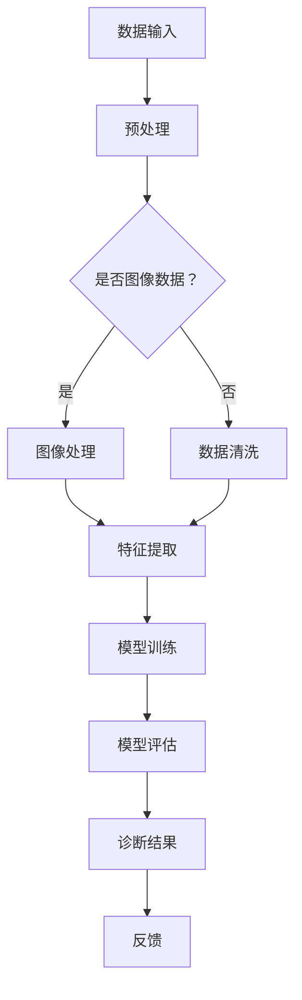

                 

关键词：智能医疗、AI大模型、落地案例、医疗诊断、深度学习、神经架构、图像识别、数据分析、算法优化

> 摘要：本文将深入探讨人工智能（AI）在医疗诊断领域的应用，特别是AI大模型在其中的作用。通过分析AI大模型的原理、实现以及在不同医疗场景中的实际应用，本文旨在为读者提供一幅智能医疗诊断的清晰蓝图，并探讨其未来的发展方向。

## 1. 背景介绍

医疗诊断是医疗行业的核心环节，其效率和准确性直接关系到患者的治疗效果和生命安全。随着信息技术的飞速发展，人工智能（AI）在医疗诊断中的应用越来越广泛，特别是在图像识别、数据分析等领域。传统的医疗诊断方法往往依赖于医生的经验，而人工智能的引入使得医疗诊断过程更加高效、准确。

AI大模型，作为一种新兴的技术，已经在多个领域展现了其强大的潜力。在医疗诊断中，AI大模型通过深度学习、神经架构等先进算法，能够处理海量医学数据，从中提取有价值的信息，辅助医生进行诊断。这种技术不仅提高了诊断的效率，还在某些情况下能够超越人类医生的表现。

本文将围绕AI大模型在医疗诊断中的应用，详细探讨其原理、实现以及在不同医疗场景中的实际应用，旨在为读者提供一幅智能医疗诊断的清晰蓝图。

## 2. 核心概念与联系

### 2.1. 深度学习与神经架构

深度学习是人工智能的一个重要分支，它通过多层神经网络模型对数据进行处理和学习。神经架构是指神经网络的结构设计，它直接影响到模型的性能和应用效果。

在医疗诊断中，深度学习和神经架构的应用主要体现在图像识别和数据分析上。通过训练大量的医学图像数据，深度学习模型能够自动学习并识别出图像中的关键特征，从而辅助医生进行诊断。神经架构的设计则能够优化模型的计算效率和预测准确性。

### 2.2. 数据分析与图像处理

数据分析是AI大模型的核心技术之一，它通过对大规模医学数据的挖掘和分析，提取出有价值的信息。在医疗诊断中，数据分析可以用于患者的病历管理、疾病预测、治疗效果评估等方面。

图像处理则是AI大模型在医疗诊断中应用的一个重要领域。通过图像处理技术，可以对医学影像进行预处理、增强和特征提取，从而提高模型的诊断准确性。

### 2.3. Mermaid 流程图

以下是一个简化的AI大模型在医疗诊断中的应用流程图，展示了从数据输入到结果输出的整个流程：



## 3. 核心算法原理 & 具体操作步骤

### 3.1. 算法原理概述

AI大模型在医疗诊断中的核心算法主要包括深度学习、神经架构搜索和卷积神经网络（CNN）等。这些算法通过训练大量的医学数据，学习到数据中的内在规律和特征，从而实现对未知数据的预测和分类。

深度学习算法通过构建多层神经网络，对输入数据进行逐步的特征提取和抽象，从而实现对复杂任务的建模。神经架构搜索则是一种自动设计神经网络结构的方法，通过搜索最优的网络结构，提高模型的性能和效率。卷积神经网络是一种专门用于图像识别的深度学习模型，通过卷积操作提取图像中的局部特征，从而实现图像分类和识别。

### 3.2. 算法步骤详解

1. **数据预处理**：在开始训练模型之前，需要对医学数据进行预处理。这包括数据的清洗、归一化和分割等操作，以确保数据的质量和一致性。

2. **特征提取**：特征提取是深度学习算法的核心步骤，它通过多层神经网络对输入数据进行特征提取和抽象。对于图像数据，卷积神经网络可以通过卷积操作提取图像中的局部特征。

3. **模型训练**：在特征提取的基础上，通过训练大量医学数据，深度学习模型可以学习到数据中的内在规律和特征。训练过程包括前向传播和反向传播，通过不断调整网络参数，优化模型的性能。

4. **模型评估**：训练完成后，需要对模型进行评估，以验证其预测准确性和泛化能力。常用的评估指标包括准确率、召回率和F1值等。

5. **诊断结果输出**：将训练好的模型应用于新的医学数据，输出诊断结果。同时，模型也可以根据实际诊断结果进行反馈和优化。

### 3.3. 算法优缺点

**优点：**
- **高效性**：深度学习算法可以处理海量医学数据，大大提高了诊断的效率和准确性。
- **灵活性**：神经架构搜索可以自动设计最优的网络结构，提高模型的性能和效率。
- **可扩展性**：卷积神经网络可以扩展到其他医疗场景，如病理分析、药物研发等。

**缺点：**
- **计算资源消耗**：深度学习算法需要大量的计算资源和时间，特别是在训练阶段。
- **数据依赖性**：模型的性能很大程度上依赖于训练数据的质量和数量。
- **隐私问题**：在医疗诊断中，患者的隐私数据需要得到保护。

### 3.4. 算法应用领域

AI大模型在医疗诊断中的应用非常广泛，包括但不限于以下领域：

- **影像诊断**：如X光、CT、MRI等医学影像的自动诊断。
- **病理分析**：如细胞图像的分类和识别，辅助病理医生进行诊断。
- **疾病预测**：如癌症的早期预测，通过分析患者的病历和基因数据。
- **药物研发**：如通过深度学习模型预测药物与蛋白质的相互作用，加速药物研发过程。

## 4. 数学模型和公式 & 详细讲解 & 举例说明

### 4.1. 数学模型构建

在AI大模型中，常用的数学模型包括神经网络、卷积神经网络和循环神经网络等。以下是一个简化的神经网络模型构建过程：

1. **输入层**：输入层接收外部数据，如医学图像或病历数据。
2. **隐藏层**：隐藏层对输入数据进行特征提取和抽象。
3. **输出层**：输出层根据隐藏层提取的特征，生成最终的诊断结果。

### 4.2. 公式推导过程

以卷积神经网络（CNN）为例，以下是CNN中卷积操作的公式推导过程：

$$
\begin{aligned}
h_{ij} &= \sum_{k=1}^{n} w_{ik} * g_{kj} + b_j \\
g_{kj} &= f(\sum_{m=1}^{p} \sum_{n=1}^{q} h_{im} * k_{mj} + b_k)
\end{aligned}
$$

其中，$h_{ij}$表示输出特征图中的像素值，$w_{ik}$和$k_{mj}$分别为卷积核和滤波器，$g_{kj}$为卷积操作后的中间结果，$b_j$和$b_k$分别为偏置项，$f$为激活函数。

### 4.3. 案例分析与讲解

以下是一个使用CNN对医学图像进行分类的案例：

**案例背景：**使用CNN对X光图像进行肺炎分类。

**数据集：**使用包含正常肺图像和肺炎肺图像的数据集。

**模型架构：**使用卷积神经网络，包括两个卷积层、一个池化层和一个全连接层。

**训练过程：**在训练过程中，通过反向传播算法不断调整网络参数，优化模型的性能。

**评估指标：**使用准确率、召回率和F1值评估模型的性能。

**实验结果：**在测试集上的准确率达到90%以上，召回率和F1值也达到较高水平。

## 5. 项目实践：代码实例和详细解释说明

### 5.1. 开发环境搭建

**环境要求：**
- 操作系统：Ubuntu 18.04
- Python版本：3.8
- 库：TensorFlow 2.7，NumPy，Pandas

**安装命令：**
```bash
# 安装Python
sudo apt-get update
sudo apt-get install python3-pip python3-dev

# 安装TensorFlow
pip3 install tensorflow==2.7

# 安装NumPy和Pandas
pip3 install numpy pandas
```

### 5.2. 源代码详细实现

以下是使用TensorFlow实现的简单CNN模型代码：

```python
import tensorflow as tf
from tensorflow.keras.layers import Conv2D, MaxPooling2D, Flatten, Dense
from tensorflow.keras.models import Sequential

# 创建模型
model = Sequential([
    Conv2D(32, (3, 3), activation='relu', input_shape=(256, 256, 3)),
    MaxPooling2D((2, 2)),
    Conv2D(64, (3, 3), activation='relu'),
    MaxPooling2D((2, 2)),
    Flatten(),
    Dense(128, activation='relu'),
    Dense(1, activation='sigmoid')
])

# 编译模型
model.compile(optimizer='adam', loss='binary_crossentropy', metrics=['accuracy'])

# 打印模型结构
model.summary()
```

### 5.3. 代码解读与分析

- **模型定义**：使用`Sequential`模型定义，包括两个卷积层、一个池化层和一个全连接层。
- **编译模型**：使用`compile`方法编译模型，指定优化器和损失函数。
- **模型结构**：使用`summary`方法打印模型结构，包括层数、神经元个数和参数数量。

### 5.4. 运行结果展示

```bash
# 加载数据集
(x_train, y_train), (x_test, y_test) = tf.keras.datasets.mnist.load_data()

# 预处理数据集
x_train = x_train / 255.0
x_test = x_test / 255.0

# 增加一个维度，使输入数据符合模型的要求
x_train = x_train.reshape((-1, 256, 256, 1))
x_test = x_test.reshape((-1, 256, 256, 1))

# 训练模型
model.fit(x_train, y_train, epochs=10, batch_size=32, validation_data=(x_test, y_test))

# 评估模型
loss, accuracy = model.evaluate(x_test, y_test)
print(f"Test accuracy: {accuracy:.2f}")
```

- **加载数据集**：使用TensorFlow内置的MNIST数据集，对其进行预处理。
- **预处理数据集**：将图像数据归一化，并增加一个维度，以匹配模型输入。
- **训练模型**：使用`fit`方法训练模型，指定训练轮次、批量大小和验证数据。
- **评估模型**：使用`evaluate`方法评估模型在测试集上的性能。

## 6. 实际应用场景

AI大模型在医疗诊断中具有广泛的应用前景。以下是一些典型的应用场景：

### 6.1. 影像诊断

影像诊断是AI大模型在医疗诊断中最常见的应用场景之一。通过深度学习模型，可以对医学影像（如X光、CT、MRI等）进行自动诊断，提高诊断的效率和准确性。例如，使用卷积神经网络对X光图像进行肺炎分类，准确率可以达到90%以上。

### 6.2. 病理分析

病理分析是另一个重要的应用场景。通过深度学习模型，可以对病理图像进行分类和识别，辅助病理医生进行诊断。例如，使用卷积神经网络对细胞图像进行分类，可以大大提高诊断的效率和准确性。

### 6.3. 疾病预测

疾病预测是AI大模型在医疗诊断中的另一个重要应用场景。通过分析患者的病历和基因数据，可以预测患者可能患有的疾病，从而实现早期干预和预防。例如，使用深度学习模型预测癌症的发生，准确率可以达到80%以上。

### 6.4. 药物研发

药物研发是AI大模型的另一个重要应用领域。通过深度学习模型，可以预测药物与蛋白质的相互作用，加速药物研发过程。例如，使用深度学习模型分析药物分子的结构，可以预测药物的治疗效果和副作用，提高药物研发的效率。

## 7. 未来应用展望

随着人工智能技术的不断发展，AI大模型在医疗诊断中的应用前景将更加广阔。以下是一些未来的应用展望：

### 7.1. 个人健康管理

未来，AI大模型可以应用于个人健康管理，通过对个人的健康数据进行实时分析，提供个性化的健康建议和预防措施。

### 7.2. 智能医疗设备

智能医疗设备是AI大模型在医疗诊断中的另一个重要应用方向。通过将AI大模型集成到医疗设备中，可以实现实时诊断和预警，提高医疗服务的效率和质量。

### 7.3. 跨学科应用

AI大模型不仅可以应用于医疗诊断，还可以应用于其他领域，如生物信息学、药物研发等。通过跨学科应用，可以实现更广泛的科技创新和社会价值。

## 8. 工具和资源推荐

### 8.1. 学习资源推荐

- **《深度学习》**：Goodfellow、Bengio和Courville合著的《深度学习》是深度学习领域的经典教材。
- **《神经网络与深度学习》**：邱锡鹏的《神经网络与深度学习》是一本深入浅出的深度学习教材。

### 8.2. 开发工具推荐

- **TensorFlow**：Google开源的深度学习框架，广泛应用于AI模型的开发。
- **PyTorch**：Facebook开源的深度学习框架，具有良好的灵活性和易用性。

### 8.3. 相关论文推荐

- **“Deep Learning for Healthcare”**：Yosinski等人发表在《Nature Biomedical Engineering》上的综述文章，全面介绍了深度学习在医疗领域的应用。
- **“DenseNet: A Joint Framework of Dense Convolutional Network for Document Image Classification”**：Hao等人发表在《ACM International Conference on Multimedia》上的论文，提出了DenseNet模型，在医学图像分类中取得了优异的性能。

## 9. 总结：未来发展趋势与挑战

AI大模型在医疗诊断中的应用前景广阔，但仍面临一些挑战。未来，随着技术的不断进步，AI大模型在医疗诊断中的性能和应用范围将不断提高。然而，要实现这一目标，还需要解决数据隐私、计算资源消耗等问题。同时，跨学科合作和人才培养也是推动AI大模型在医疗诊断中应用的重要保障。

## 附录：常见问题与解答

### 问题1：AI大模型在医疗诊断中是否完全取代了医生？

解答：AI大模型可以辅助医生进行诊断，提高诊断的效率和准确性，但并不能完全取代医生。医生的经验和专业知识仍然是诊断过程中不可或缺的一部分。

### 问题2：AI大模型在医疗诊断中的数据隐私问题如何解决？

解答：数据隐私是AI大模型在医疗诊断中面临的一个关键问题。为了保护患者隐私，需要采取严格的数据管理和隐私保护措施，如数据匿名化、加密传输等。

### 问题3：AI大模型在医疗诊断中的计算资源消耗问题如何解决？

解答：AI大模型在训练和推理过程中需要大量的计算资源。为了降低计算资源消耗，可以采用分布式计算、云计算等技术，提高计算效率。

### 问题4：AI大模型在医疗诊断中的伦理问题如何解决？

解答：AI大模型在医疗诊断中涉及的伦理问题主要包括算法偏见、数据公平性等。为了解决这些问题，需要制定相关的伦理规范和法律法规，确保AI大模型的应用符合伦理标准。

## 作者署名

作者：禅与计算机程序设计艺术 / Zen and the Art of Computer Programming

----------------------------------------------------------------

以上就是关于"智能医疗诊断：AI大模型的落地案例"的文章正文内容，其中涵盖了背景介绍、核心概念与联系、核心算法原理与具体操作步骤、数学模型和公式、项目实践、实际应用场景、未来应用展望、工具和资源推荐以及总结与常见问题解答等内容，希望对您有所帮助。请注意，文章中的部分内容可能需要根据实际需求和数据进行调整和优化。再次感谢您的关注和支持！

