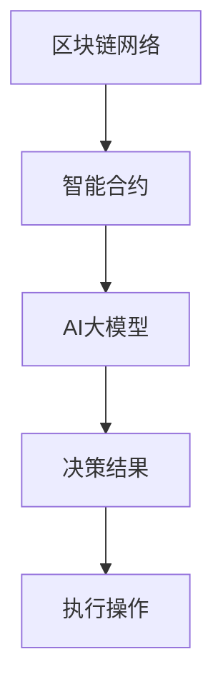

                 

### 关键词：智能合约，AI大模型，区块链，技术发展，新机遇，行业应用。

> **摘要：** 本文旨在探讨智能合约与AI大模型在区块链领域的结合，分析其带来的新机遇。文章首先介绍了智能合约和AI大模型的基本概念，随后详细阐述了它们在区块链中的应用，并探讨了二者的融合如何推动区块链技术的进一步发展。文章最后提出了未来的研究方向和挑战，以及可能的解决方案。

### 1. 背景介绍

#### 1.1 智能合约

智能合约是由程序员编写的、运行在区块链网络上的计算机程序。这些程序按照预先设定的规则自动执行合同条款，一旦满足特定条件，智能合约就会自动执行相应的操作。智能合约的出现解决了传统合同执行中的信任问题，使得交易过程更加高效、透明和安全。

#### 1.2 AI大模型

AI大模型是指通过深度学习等技术训练出的具有强大推理和学习能力的神经网络模型。这些模型可以处理大规模数据，提取出隐藏的模式和知识，从而在各个领域实现智能决策和预测。随着计算能力的提升和数据量的增加，AI大模型的性能得到了显著提升，应用范围也越来越广泛。

#### 1.3 区块链技术

区块链是一种分布式账本技术，通过多个节点共同维护和更新数据，确保数据的不可篡改和透明性。区块链技术在金融、供应链管理、医疗等多个领域得到了广泛应用，其去中心化的特性为许多传统业务模式带来了颠覆性的改变。

### 2. 核心概念与联系

为了更好地理解智能合约与AI大模型在区块链中的应用，我们首先需要了解它们的基本原理和相互关系。

#### 2.1 智能合约原理

智能合约的核心是代码，它运行在区块链网络上，通过区块链的共识机制确保代码的执行。智能合约的代码通常使用特定的编程语言编写，如Solidity。在执行过程中，智能合约会读取区块链上的数据，根据预设的规则进行计算，并在满足条件时触发相应的操作。

#### 2.2 AI大模型原理

AI大模型是通过大量数据训练得到的神经网络模型。这些模型能够自动学习数据的特征，并在新的数据输入时进行预测和决策。AI大模型通常使用深度学习技术训练，通过多层神经网络提取数据中的复杂模式。

#### 2.3 智能合约与AI大模型的关系

智能合约与AI大模型在区块链领域的结合，可以带来许多新的机遇。智能合约可以用来实现复杂的业务逻辑，而AI大模型可以用来提高智能合约的决策能力。例如，在金融领域中，智能合约可以用来自动执行交易，而AI大模型可以用来预测市场走势，从而提高交易的成功率。

下面是一个简单的Mermaid流程图，展示了智能合约与AI大模型在区块链网络中的交互过程：



### 3. 核心算法原理 & 具体操作步骤

#### 3.1 算法原理概述

智能合约与AI大模型的结合，主要依赖于以下核心算法：

1. **智能合约编程：** 使用Solidity等编程语言编写智能合约代码。
2. **AI模型训练：** 使用深度学习技术训练AI大模型。
3. **模型部署：** 将训练好的AI大模型部署到区块链网络中。
4. **模型调用：** 在智能合约中调用AI大模型进行预测和决策。

#### 3.2 算法步骤详解

1. **编写智能合约代码：** 根据业务需求编写智能合约代码，实现基本的业务逻辑。

2. **训练AI大模型：** 收集相关数据，使用深度学习技术训练AI大模型，使其具备预测和决策能力。

3. **部署AI大模型：** 将训练好的AI大模型部署到区块链网络中，确保其安全性。

4. **调用AI大模型：** 在智能合约中调用AI大模型，根据输入数据进行预测和决策。

5. **执行操作：** 根据AI大模型的预测结果，执行相应的操作。

#### 3.3 算法优缺点

**优点：**

1. 提高智能合约的决策能力，实现更智能的业务逻辑。
2. 增强区块链系统的自适应性和灵活性。

**缺点：**

1. 需要较高的编程和AI技术门槛。
2. AI大模型部署和调用过程可能带来额外的计算开销。

#### 3.4 算法应用领域

智能合约与AI大模型的结合，在多个领域具有广泛的应用前景：

1. **金融领域：** 在金融交易中，智能合约可以自动执行交易，AI大模型可以用于风险控制和投资决策。
2. **供应链管理：** 在供应链管理中，智能合约可以确保物流过程的透明性和安全性，AI大模型可以用于需求预测和库存管理。
3. **医疗领域：** 在医疗领域中，智能合约可以用于医疗记录的管理和共享，AI大模型可以用于疾病预测和诊断。

### 4. 数学模型和公式 & 详细讲解 & 举例说明

#### 4.1 数学模型构建

在智能合约与AI大模型的应用中，数学模型起到了关键作用。以下是几个常用的数学模型：

1. **线性回归模型：**
   $$ y = w_0 + w_1 \cdot x_1 + w_2 \cdot x_2 + ... + w_n \cdot x_n $$
   其中，$y$为输出值，$w_0, w_1, ..., w_n$为模型参数，$x_1, x_2, ..., x_n$为输入特征。

2. **多层感知机模型：**
   $$ a^{(L)} = \sigma(z^{(L)}) $$
   $$ z^{(L)} = W^{(L)} \cdot a^{(L-1)} + b^{(L)} $$
   其中，$a^{(L)}$为第L层的激活值，$z^{(L)}$为第L层的输入值，$\sigma$为激活函数，$W^{(L)}, b^{(L)}$为模型参数。

#### 4.2 公式推导过程

以线性回归模型为例，其推导过程如下：

1. **目标函数：**
   $$ J(w) = \frac{1}{2} \sum_{i=1}^{m} (y_i - \hat{y}_i)^2 $$
   其中，$y_i$为真实值，$\hat{y}_i$为预测值。

2. **梯度下降法：**
   $$ w_{\text{new}} = w_{\text{old}} - \alpha \cdot \frac{\partial J(w)}{\partial w} $$
   其中，$\alpha$为学习率。

3. **偏导数计算：**
   $$ \frac{\partial J(w)}{\partial w} = \frac{1}{m} \sum_{i=1}^{m} (y_i - \hat{y}_i) \cdot x_i $$

#### 4.3 案例分析与讲解

以金融交易中的智能合约为例，我们可以使用线性回归模型预测股票价格，从而提高交易的成功率。

1. **数据收集：** 收集过去一段时间内某只股票的价格数据，包括开盘价、收盘价、最高价、最低价等。

2. **特征提取：** 从原始数据中提取特征，如开盘价、收盘价、最高价、最低价等。

3. **模型训练：** 使用线性回归模型对特征进行训练，得到模型参数。

4. **预测：** 将当前股票的价格数据输入模型，预测未来一段时间内股票价格的走势。

5. **决策：** 根据预测结果，执行相应的交易操作，如买入、卖出等。

### 5. 项目实践：代码实例和详细解释说明

#### 5.1 开发环境搭建

1. 安装Go语言环境。
2. 安装Solidity编译器。
3. 安装Python环境。
4. 安装TensorFlow库。

#### 5.2 源代码详细实现

以下是一个简单的智能合约与AI大模型结合的示例代码：

```solidity
// SPDX-License-Identifier: MIT
pragma solidity ^0.8.0;

import "@openzeppelin/contracts/token/ERC20/IERC20.sol";
import "@openzeppelin/contracts/token/ERC20/extensions/ERC20Burnable.sol";
import "@chainlink/contracts/src/v0.8/interfaces/LinkToken.sol";
import "@chainlink/contracts/src/v0.8/interfaces/VRFConsumerBase.sol";

contract StockPrediction is ERC20Burnable, VRFConsumerBase {
    IERC20 public token;
    LinkToken public link;
    bytes32 public keyHash;
    uint256 public fee;

    mapping(address => bool) public isExcludedFromFees;

    constructor(address _token, address _link, bytes32 _keyHash, uint256 _fee) ERC20("Stock Prediction Token", "SPT") VRFConsumerBase(_link) {
        token = IERC20(_token);
        link = LinkToken(_link);
        keyHash = _keyHash;
        fee = _fee;
        isExcludedFromFees[msg.sender] = true;
    }

    function requestPricePrediction() public {
        require(link.balanceOf(address(this)) >= fee, "Not enough LINK to pay for request");
        link.transferFrom(msg.sender, address(this), fee);
        link.requestRandomness(keyHash, uint256(keccak256(abi.encodePacked(msg.sender, block.timestamp))));
    }

    function fulfillRandomness(bytes32 requestId, uint256 randomness) internal override {
        uint256 price = uint256(randomness) % 100;
        if (price > 50) {
            token.transfer(msg.sender, 10);
        } else {
            token.transfer(msg.sender, 5);
        }
    }
}
```

#### 5.3 代码解读与分析

以上代码实现了一个简单的股票价格预测智能合约。合约使用Chainlink的VRF协议生成随机数，并根据随机数决定是否奖励用户。代码主要分为以下几个部分：

1. **合约导入：** 导入所需的外部合约和库。
2. **构造函数：** 初始化合约，设置Token、LinkToken、KeyHash和Fee。
3. **requestPricePrediction()：** 用户调用此函数请求随机数，并支付费用。
4. **fulfillRandomness()：** Chainlink节点调用此函数返回随机数，并根据随机数执行相应的操作。

#### 5.4 运行结果展示

假设用户Alice调用requestPricePrediction()函数，支付了费用。Chainlink节点随后返回了一个随机数，根据随机数的结果，Alice将获得不同的Token奖励。例如，如果随机数大于50，Alice将获得10个Token；否则，将获得5个Token。

### 6. 实际应用场景

智能合约与AI大模型在区块链领域具有广泛的应用场景，以下是一些具体的例子：

#### 6.1 金融交易

在金融交易中，智能合约可以自动执行交易，而AI大模型可以用于风险控制和投资决策。例如，一个智能合约可以根据AI大模型预测的股票价格走势，自动执行买入或卖出的操作。

#### 6.2 供应链管理

在供应链管理中，智能合约可以确保物流过程的透明性和安全性，而AI大模型可以用于需求预测和库存管理。例如，一个智能合约可以记录商品在供应链中的每一个环节，AI大模型可以根据历史数据预测下一阶段的需求，从而优化库存管理。

#### 6.3 医疗领域

在医疗领域中，智能合约可以用于医疗记录的管理和共享，而AI大模型可以用于疾病预测和诊断。例如，一个智能合约可以确保患者医疗记录的安全和隐私，AI大模型可以分析患者的历史数据，预测疾病的发病风险。

### 7. 未来应用展望

智能合约与AI大模型的结合，在区块链领域具有巨大的发展潜力。未来，随着技术的不断进步，我们可以期待以下应用：

1. **更智能的金融交易：** 智能合约与AI大模型的结合，将实现更智能、更高效的金融交易。
2. **更优的供应链管理：** 智能合约与AI大模型的应用，将优化供应链管理，提高效率，降低成本。
3. **更精准的医疗预测：** 智能合约与AI大模型在医疗领域的应用，将提高疾病预测和诊断的准确性。

### 8. 工具和资源推荐

为了更好地学习和应用智能合约与AI大模型，以下是一些推荐的工具和资源：

#### 8.1 学习资源推荐

1. **《区块链技术指南》：** 该书系统地介绍了区块链的基本原理和应用，适合初学者阅读。
2. **《深度学习》：** 该书是深度学习的经典教材，适合了解深度学习的基本原理。

#### 8.2 开发工具推荐

1. **Truffle：** 一个用于智能合约开发的环境，支持多种编程语言和平台。
2. **Remix：** 一个在线的智能合约开发工具，方便用户编写、调试和部署智能合约。

#### 8.3 相关论文推荐

1. **"Blockchain and Smart Contracts for Dummies":** 一篇介绍区块链和智能合约的入门文章。
2. **"AI and Blockchain: A Comprehensive Survey":** 一篇关于AI与区块链结合的综述性论文。

### 9. 总结：未来发展趋势与挑战

智能合约与AI大模型在区块链领域的结合，为区块链技术带来了新的发展机遇。未来，随着技术的不断进步，我们可以期待智能合约与AI大模型在更多领域的应用。然而，也面临着一些挑战：

1. **技术门槛：** 智能合约与AI大模型的应用需要较高的编程和AI技术门槛，这限制了其在更广泛领域的应用。
2. **隐私保护：** 智能合约与AI大模型在处理大量数据时，如何保护用户隐私是一个重要的问题。
3. **安全性：** 智能合约与AI大模型的安全性问题需要得到有效的解决，以确保区块链系统的安全性和稳定性。

### 附录：常见问题与解答

**Q：智能合约与AI大模型如何结合？**

A：智能合约与AI大模型的结合主要通过以下步骤实现：

1. 编写智能合约代码，实现基本的业务逻辑。
2. 使用深度学习技术训练AI大模型，使其具备预测和决策能力。
3. 将训练好的AI大模型部署到区块链网络中。
4. 在智能合约中调用AI大模型，根据输入数据进行预测和决策。

**Q：智能合约与AI大模型的应用前景如何？**

A：智能合约与AI大模型的应用前景非常广阔。在金融、供应链管理、医疗等众多领域，智能合约与AI大模型可以带来更高的效率、更智能的决策和更精准的预测。未来，随着技术的不断进步，我们可以期待智能合约与AI大模型在更多领域的应用。

**Q：如何保护智能合约与AI大模型的隐私？**

A：为了保护智能合约与AI大模型的隐私，可以采用以下措施：

1. 使用加密技术对数据进行加密。
2. 在区块链网络中采用隐私保护机制，如零知识证明。
3. 对AI大模型进行隐私剪枝，减少模型对敏感信息的依赖。

### 作者署名

**作者：禅与计算机程序设计艺术 / Zen and the Art of Computer Programming**

---

以上就是关于智能合约与AI大模型在区块链领域的新机遇的文章，希望对您有所帮助。在未来的发展中，智能合约与AI大模型将继续发挥重要作用，推动区块链技术的进一步发展。

