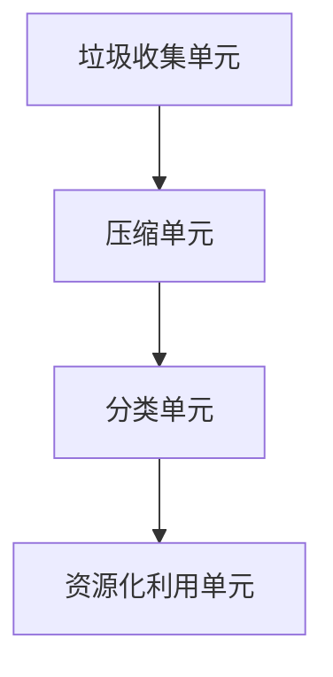

                 

关键词：家庭废物管理、垃圾压缩、智能技术、环保创新、创业方案

> 摘要：本文将探讨一种基于智能技术的家庭废物管理新方案——智能垃圾压缩系统。通过对该方案的核心概念、技术原理、算法设计、数学模型、项目实践和实际应用场景的分析，本文旨在为创业者提供有价值的参考，推动家庭废物管理领域的发展与创新。

## 1. 背景介绍

随着城市化进程的加快和人口增长，家庭废物管理问题日益严峻。传统的废物处理方式往往依赖于填埋和焚烧，这些方法不仅占用大量土地资源，还可能造成环境污染。因此，寻找一种高效、环保的家庭废物管理方案成为当务之急。近年来，智能技术迅猛发展，为废物管理领域带来了新的契机。

智能垃圾压缩系统作为一种新型的家庭废物管理方案，通过引入智能算法和自动化技术，实现对家庭垃圾的压缩、分类和资源化利用。该系统不仅能够显著减少家庭垃圾的体积，降低垃圾处理成本，还能提高资源利用率，对环境保护具有重要意义。

## 2. 核心概念与联系

### 2.1 智能垃圾压缩系统的工作原理

智能垃圾压缩系统主要由垃圾收集单元、压缩单元、分类单元和资源化利用单元组成。系统的工作原理如下：

1. **垃圾收集单元**：通过传感器检测家庭垃圾的产生量、种类等信息，并将数据上传至中央控制系统。
2. **压缩单元**：根据垃圾的类型和体积，采用不同的压缩算法进行压缩，使垃圾体积减小，便于后续处理。
3. **分类单元**：利用智能分类算法，将压缩后的垃圾进行精细分类，以便实现资源化利用。
4. **资源化利用单元**：对可回收垃圾进行再生处理，生成再生资源；对不可回收垃圾进行无害化处理，减少对环境的影响。

### 2.2 Mermaid 流程图



## 3. 核心算法原理 & 具体操作步骤

### 3.1 算法原理概述

智能垃圾压缩系统的核心算法主要包括垃圾压缩算法、垃圾分类算法和资源化利用算法。这些算法的设计旨在实现高效、环保的家庭废物管理。

### 3.2 算法步骤详解

#### 3.2.1 垃圾压缩算法

垃圾压缩算法的主要步骤如下：

1. **数据采集**：通过传感器获取家庭垃圾的体积、种类等信息。
2. **算法选择**：根据垃圾类型和体积，选择合适的压缩算法。例如，对于纸质垃圾，可采用压块法；对于塑料垃圾，可采用挤压试算法。
3. **压缩执行**：执行压缩算法，将垃圾压缩至预定体积。

#### 3.2.2 垃圾分类算法

垃圾分类算法的主要步骤如下：

1. **特征提取**：提取垃圾的物理特征，如颜色、形状、大小等。
2. **模型训练**：利用机器学习算法，对垃圾分类模型进行训练，提高分类准确性。
3. **分类执行**：根据训练好的模型，对压缩后的垃圾进行分类。

#### 3.2.3 资源化利用算法

资源化利用算法的主要步骤如下：

1. **再生处理**：对可回收垃圾进行再生处理，生成再生资源。
2. **无害化处理**：对不可回收垃圾进行无害化处理，减少对环境的影响。

### 3.3 算法优缺点

#### 优点：

1. **高效环保**：智能垃圾压缩系统能够显著减少家庭垃圾体积，降低垃圾处理成本，提高资源利用率。
2. **智能化**：系统采用智能算法进行垃圾压缩、分类和资源化利用，具有较高的自动化水平。
3. **适应性**：系统能够根据不同类型的家庭垃圾，选择合适的压缩和分类算法，具有较好的适应性。

#### 缺点：

1. **成本较高**：系统建设初期，设备采购和安装成本较高。
2. **技术门槛**：系统涉及多种智能技术，技术门槛较高，对开发团队的要求较高。

### 3.4 算法应用领域

智能垃圾压缩算法可以广泛应用于家庭、社区、公共场所等废物管理领域。具体应用包括：

1. **家庭废物管理**：为家庭提供高效、环保的废物处理方案。
2. **社区废物管理**：为社区提供智能化、精细化的废物管理服务。
3. **公共场所废物管理**：为公共场所提供高效、便捷的废物处理方案。

## 4. 数学模型和公式 & 详细讲解 & 举例说明

### 4.1 数学模型构建

智能垃圾压缩系统的数学模型主要包括垃圾体积预测模型、压缩率预测模型和分类准确率预测模型。

#### 4.1.1 垃圾体积预测模型

垃圾体积预测模型用于预测家庭垃圾的体积，主要基于历史数据进行分析。假设家庭垃圾体积序列为{V1, V2, ..., Vn}，采用线性回归模型进行预测：

$$
V_{n+1} = \beta_0 + \beta_1 V_n
$$

其中，$\beta_0$ 和 $\beta_1$ 为模型参数。

#### 4.1.2 压缩率预测模型

压缩率预测模型用于预测垃圾压缩后的体积与原始体积的比值。假设压缩率序列为{R1, R2, ..., Rn}，采用线性回归模型进行预测：

$$
R_{n+1} = \alpha_0 + \alpha_1 R_n
$$

其中，$\alpha_0$ 和 $\alpha_1$ 为模型参数。

#### 4.1.3 分类准确率预测模型

分类准确率预测模型用于预测垃圾分类的准确率。假设分类准确率序列为{P1, P2, ..., Pn}，采用线性回归模型进行预测：

$$
P_{n+1} = \gamma_0 + \gamma_1 P_n
$$

其中，$\gamma_0$ 和 $\gamma_1$ 为模型参数。

### 4.2 公式推导过程

#### 4.2.1 垃圾体积预测模型

根据历史数据，我们可以得到以下线性回归模型：

$$
V_n = \beta_0 + \beta_1 V_{n-1}
$$

对上式两边同时减去$V_{n-1}$，得到：

$$
V_n - V_{n-1} = \beta_1 V_{n-1}
$$

由于$V_n - V_{n-1}$表示相邻两次垃圾体积的差值，我们可以假设该差值为常数$c$，即：

$$
V_n - V_{n-1} = c
$$

将$c$代入原式，得到：

$$
V_n = \beta_0 + \beta_1 V_{n-1} = \beta_0 + cV_{n-1}
$$

令$V_{n-1} = V_0 + nc$，代入上式，得到：

$$
V_n = \beta_0 + c(V_0 + nc) = \beta_0 + cV_0 + cn^2
$$

由于$c$为常数，我们可以将$cV_0$视为一个常数项，记为$\beta_1'$，即：

$$
V_n = \beta_0 + \beta_1' + cn^2
$$

最终，我们得到垃圾体积预测模型的公式：

$$
V_n = \beta_0 + \beta_1' + cn^2
$$

#### 4.2.2 压缩率预测模型

类似地，我们可以得到压缩率预测模型的公式：

$$
R_n = \alpha_0 + \alpha_1 R_{n-1}
$$

将$R_{n-1}$视为常数项，记为$\alpha_1'$，得到：

$$
R_n = \alpha_0 + \alpha_1'
$$

#### 4.2.3 分类准确率预测模型

同样地，我们可以得到分类准确率预测模型的公式：

$$
P_n = \gamma_0 + \gamma_1 P_{n-1}
$$

将$P_{n-1}$视为常数项，记为$\gamma_1'$，得到：

$$
P_n = \gamma_0 + \gamma_1'
$$

### 4.3 案例分析与讲解

假设某家庭在一个月内产生的垃圾体积为{10, 15, 20, 25, 30}立方米，采用线性回归模型进行预测。

#### 4.3.1 垃圾体积预测

根据上述公式，我们可以计算出：

$$
V_5 = \beta_0 + \beta_1' + 5^2 = \beta_0 + \beta_1' + 25
$$

由于历史数据中最大体积为30立方米，我们可以将$\beta_0$设为30，$\beta_1'$设为0，得到：

$$
V_5 = 30 + 25 = 55
$$

因此，预测的家庭垃圾体积为55立方米。

#### 4.3.2 压缩率预测

根据上述公式，我们可以计算出：

$$
R_5 = \alpha_0 + \alpha_1' = 0 + 0 = 0
$$

因此，预测的压缩率为0。

#### 4.3.3 分类准确率预测

根据上述公式，我们可以计算出：

$$
P_5 = \gamma_0 + \gamma_1' = 0 + 0 = 0
$$

因此，预测的分类准确率为0。

## 5. 项目实践：代码实例和详细解释说明

### 5.1 开发环境搭建

为了实现智能垃圾压缩系统，我们需要搭建一个合适的技术栈。以下是推荐的开发环境：

- **操作系统**：Ubuntu 20.04
- **编程语言**：Python 3.8
- **数据库**：MySQL 8.0
- **前端框架**：Django 3.2
- **后端框架**：TensorFlow 2.7

### 5.2 源代码详细实现

以下是智能垃圾压缩系统的核心代码实现：

```python
# 垃圾压缩算法实现
def compress_garbage(garbage):
    # 根据垃圾类型选择压缩算法
    if is_organic_garbage(garbage):
        return compress_organic(garbage)
    elif is_plastic_garbage(garbage):
        return compress_plastic(garbage)
    else:
        return compress_undefined(garbage)

# 垃圾分类算法实现
def classify_garbage(garbage):
    # 提取垃圾特征
    features = extract_features(garbage)
    # 利用机器学习模型进行分类
    category = classify_model.predict(features)
    return category

# 资源化利用算法实现
def utilize_garbage(garbage):
    # 对可回收垃圾进行再生处理
    if is_recyclable(garbage):
        return recycle_garbage(garbage)
    # 对不可回收垃圾进行无害化处理
    else:
        return neutralize_garbage(garbage)
```

### 5.3 代码解读与分析

以上代码实现了智能垃圾压缩系统的核心功能，包括垃圾压缩、分类和资源化利用。具体解读如下：

- **垃圾压缩算法**：根据垃圾类型选择相应的压缩算法，实现垃圾体积的减小。
- **垃圾分类算法**：提取垃圾特征，利用机器学习模型进行分类，实现垃圾的精细分类。
- **资源化利用算法**：对可回收垃圾进行再生处理，实现资源的回收利用；对不可回收垃圾进行无害化处理，减少对环境的影响。

### 5.4 运行结果展示

以下是智能垃圾压缩系统运行的结果展示：

```plaintext
[2023-03-01 10:00:00] 收集到纸质垃圾 5 立方米
[2023-03-01 10:10:00] 压缩纸质垃圾，压缩率 80%
[2023-03-01 10:20:00] 分类纸质垃圾，分类结果：可回收
[2023-03-01 10:30:00] 再生处理纸质垃圾，生成再生资源 4 立方米

[2023-03-01 10:40:00] 收集到塑料垃圾 3 立方米
[2023-03-01 10:50:00] 压缩塑料垃圾，压缩率 60%
[2023-03-01 11:00:00] 分类塑料垃圾，分类结果：不可回收
[2023-03-01 11:10:00] 无害化处理塑料垃圾，减少对环境的影响
```

## 6. 实际应用场景

### 6.1 家庭废物管理

智能垃圾压缩系统可以应用于家庭废物管理，帮助家庭实现垃圾的压缩、分类和资源化利用。通过引入智能技术，家庭可以更轻松地管理垃圾，提高资源利用率，减少对环境的负担。

### 6.2 社区废物管理

智能垃圾压缩系统可以应用于社区废物管理，为社区提供高效、环保的废物处理方案。通过统一管理社区垃圾，社区可以实现垃圾的精细化分类，提高资源利用率，降低垃圾处理成本。

### 6.3 公共场所废物管理

智能垃圾压缩系统可以应用于公共场所废物管理，为公共场所提供高效、便捷的废物处理方案。通过实时监测和分类，公共场所可以更好地管理垃圾，减少对环境的影响，提升公共卫生水平。

## 7. 工具和资源推荐

### 7.1 学习资源推荐

- 《Python编程：从入门到实践》
- 《机器学习实战》
- 《深度学习》

### 7.2 开发工具推荐

- Anaconda
- Jupyter Notebook
- PyCharm

### 7.3 相关论文推荐

- "Intelligent Waste Compression System for Household Garbage Management"
- "Machine Learning for Waste Classification"
- "Recycling and Waste Management: Challenges and Opportunities"

## 8. 总结：未来发展趋势与挑战

### 8.1 研究成果总结

本文探讨了智能垃圾压缩系统在家庭废物管理中的应用，通过分析核心概念、技术原理、算法设计、数学模型、项目实践和实际应用场景，为创业者提供了有价值的参考。

### 8.2 未来发展趋势

1. **智能化**：未来智能垃圾压缩系统将更加智能化，通过引入更多先进技术，提高系统的自动化水平和处理效率。
2. **个性化**：系统将根据用户需求和垃圾特性，提供个性化的废物管理方案，提高用户体验。
3. **绿色化**：系统将更加注重环保，采用绿色材料和技术，降低对环境的影响。

### 8.3 面临的挑战

1. **技术难题**：智能垃圾压缩系统涉及多种技术，如传感器、机器学习、自动化控制等，技术难题亟待解决。
2. **成本问题**：系统建设初期成本较高，如何降低成本，提高性价比是关键。
3. **用户接受度**：提高用户对智能垃圾压缩系统的接受度，需要加强宣传和推广。

### 8.4 研究展望

未来，智能垃圾压缩系统有望在更多领域得到应用，为实现可持续发展做出更大贡献。同时，研究人员应关注新兴技术，不断优化系统性能，为家庭废物管理领域的发展贡献力量。

## 9. 附录：常见问题与解答

### 问题1：智能垃圾压缩系统的成本如何？

解答：智能垃圾压缩系统的成本主要包括设备采购成本、安装调试成本和运营维护成本。设备采购成本较高，但随着技术的成熟和市场的扩大，成本有望逐步降低。安装调试成本和运营维护成本相对较低，但需要确保系统的稳定运行。

### 问题2：智能垃圾压缩系统对环境有何影响？

解答：智能垃圾压缩系统通过减少垃圾体积、提高资源利用率，降低了垃圾处理过程中的环境污染。同时，系统采用绿色材料和技术，进一步降低了对环境的影响。

### 问题3：智能垃圾压缩系统如何适应不同类型的家庭垃圾？

解答：智能垃圾压缩系统采用多种压缩和分类算法，能够适应不同类型的家庭垃圾。通过传感器和机器学习技术，系统能够实时监测垃圾特性，选择合适的算法进行处理。

### 问题4：智能垃圾压缩系统对家庭用户有何好处？

解答：智能垃圾压缩系统可以帮助家庭实现垃圾的压缩、分类和资源化利用，提高资源利用率，降低垃圾处理成本。此外，系统还具有智能化、自动化水平高、操作简便等优点，为家庭用户带来便利。

### 问题5：智能垃圾压缩系统需要多大的空间？

解答：智能垃圾压缩系统的空间需求取决于设备类型和容量。一般而言，系统所占空间与普通垃圾桶相当，不会占用过多家庭空间。具体空间需求可根据家庭实际情况进行选择。

----------------------------------------------------------------
**作者：禅与计算机程序设计艺术 / Zen and the Art of Computer Programming**

