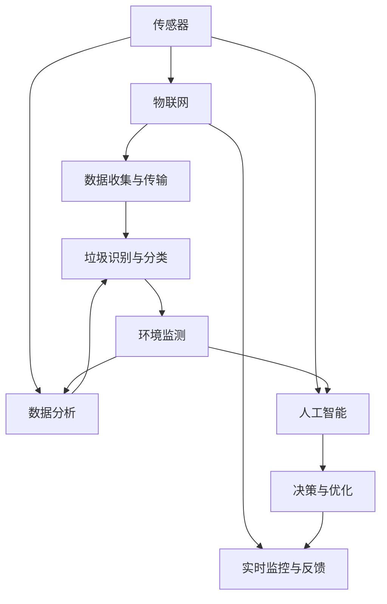

                 

### 关键词 Keywords
- 智能垃圾桶
- 环保技术
- 注意力经济
- 垃圾分类
- 人工智能
- 智能城市
- 智能传感器

### 摘要 Abstract
随着全球对环境保护意识的不断提高，智能垃圾桶作为一种新型的环保技术，正在逐渐进入公众视野。本文旨在探讨智能垃圾桶如何结合注意力经济，为环保事业和城市发展带来新的动力。文章首先介绍了智能垃圾桶的背景及其核心概念，然后深入分析了其核心算法原理，接着通过数学模型和实际项目案例展示了其具体应用。最后，文章探讨了智能垃圾桶在未来的应用场景和趋势，并提出相关的工具和资源推荐。通过这篇文章，读者将全面了解智能垃圾桶的工作机制及其对城市管理和环保的深远影响。

## 1. 背景介绍

随着城市化进程的加速，垃圾问题已经成为全球面临的严峻挑战之一。传统的垃圾桶设计往往缺乏智能化，导致垃圾分类效果不佳，环境污染问题愈发严重。据统计，全球每年产生的垃圾量已经超过了100亿吨，其中很大一部分没有得到有效处理。这不仅对城市环境造成了巨大压力，也对全球生态系统带来了不可逆转的损害。

在这种背景下，智能垃圾桶的概念应运而生。智能垃圾桶结合了物联网、传感器技术、人工智能等前沿科技，不仅能够自动分类垃圾，还能通过数据收集和分析，为城市管理和环境保护提供科学依据。这种创新技术的引入，有望显著提高垃圾分类的效率，减少垃圾填埋和焚烧带来的环境负担。

### 1.1 智能垃圾桶的定义与功能

智能垃圾桶是一种集成了传感器、嵌入式系统和无线通信模块的智能设备，它具备以下几个核心功能：

1. **自动分类**：通过内置的传感器，如重量传感器、颜色识别传感器、红外传感器等，智能垃圾桶能够自动识别垃圾的类型，并进行分类。
2. **数据收集**：智能垃圾桶能够实时收集垃圾产生的数据，包括垃圾种类、重量、投放时间等，并通过无线网络将数据传输到城市管理系统。
3. **远程监控**：借助无线通信技术，城市管理者可以通过远程监控平台实时了解各个垃圾桶的运行状态，及时处理故障，确保垃圾处理流程的顺畅。
4. **环境监测**：部分高端智能垃圾桶还集成了空气质量和水质监测模块，能够实时监测周围环境的变化，为环境保护提供数据支持。

### 1.2 智能垃圾桶的发展历程

智能垃圾桶的发展可以追溯到20世纪末。最初的研究主要集中在如何通过传感器技术实现垃圾自动分类。随着物联网和人工智能技术的成熟，智能垃圾桶的功能逐渐丰富，不仅限于垃圾分类，还包括了环境监测、数据分析和远程监控等功能。

在过去的十年里，智能垃圾桶在多个国家和地区得到了广泛应用。例如，在日本，智能垃圾桶已经成为城市环境中的一道亮丽风景线；在德国，智能垃圾桶作为智能城市项目的重要组成部分，得到了政府和社会各界的广泛关注和支持。

### 1.3 智能垃圾桶的现状与未来发展趋势

当前，智能垃圾桶的应用主要集中在城市垃圾分类和环境保护领域。然而，随着技术的不断进步，智能垃圾桶的功能也在不断扩展。未来，智能垃圾桶有望在以下方面取得突破：

1. **更精细的垃圾分类**：随着传感器技术和图像识别技术的进步，智能垃圾桶的垃圾分类能力将更加精细，能够识别更多种类的垃圾，提高分类的准确性。
2. **更广泛的应用领域**：除了垃圾分类和环境保护，智能垃圾桶还可以应用于城市物流、智能城市基础设施等领域，为城市的可持续发展提供支持。
3. **更高效的能源利用**：通过智能垃圾桶收集的数据，城市管理者可以优化垃圾处理流程，提高资源利用率，减少能源消耗。

总的来说，智能垃圾桶作为一种新兴环保技术，正逐渐成为城市管理和环境保护的重要工具。在未来，随着技术的不断进步，智能垃圾桶的应用前景将更加广阔。

## 2. 核心概念与联系

智能垃圾桶的核心在于其智能化的垃圾处理能力，这离不开以下几个核心概念的相互联系：传感器技术、物联网、数据分析和人工智能。下面，我们将通过一个Mermaid流程图来具体展示这些概念之间的联系和作用。



### 2.1 传感器技术

传感器技术是智能垃圾桶的核心组件，它负责感知和收集垃圾的相关信息。传感器种类繁多，包括重量传感器、红外传感器、颜色识别传感器、温度传感器等。这些传感器能够实时监测垃圾的物理特性，如重量、温度、颜色等，从而为后续的数据处理提供基础数据。

### 2.2 物联网

物联网（IoT）是智能垃圾桶实现智能化的重要基础设施。通过物联网，智能垃圾桶可以将传感器收集的数据传输到中央数据处理平台。物联网技术不仅提高了数据传输的效率，还实现了智能垃圾桶之间的互联互通，使得城市管理者能够实时监控和管理整个垃圾处理系统。

### 2.3 数据分析

数据分析是智能垃圾桶实现智能化的关键步骤。通过大数据分析和机器学习技术，智能垃圾桶能够对收集到的数据进行处理，识别垃圾的类型、重量和投放时间等。这些分析结果不仅可以用于垃圾分类，还可以为城市管理者提供科学的决策依据，优化垃圾处理流程。

### 2.4 人工智能

人工智能（AI）技术为智能垃圾桶提供了智能化的决策能力。通过深度学习和神经网络技术，智能垃圾桶能够自主学习和优化，提高垃圾分类的准确性。同时，人工智能技术还可以帮助智能垃圾桶识别异常情况，如垃圾分类错误或传感器故障，从而实现智能化的故障排查和维护。

### 2.5 数据收集与传输

数据收集与传输是智能垃圾桶实现智能化的重要环节。通过物联网技术，智能垃圾桶可以将传感器收集到的数据实时传输到中央数据处理平台。这些数据不仅包括垃圾的物理特性，还包括环境监测数据，如空气质量和水质。数据传输的效率和质量直接影响智能垃圾桶的智能化水平和可靠性。

### 2.6 垃圾识别与分类

垃圾识别与分类是智能垃圾桶的核心功能。通过数据分析，智能垃圾桶能够识别垃圾的类型，并自动将其分类到相应的垃圾桶中。这一过程不仅提高了垃圾分类的准确性，还减少了人工干预的必要性，提高了垃圾处理效率。

### 2.7 决策与优化

智能垃圾桶通过数据分析可以实时监控垃圾处理流程，并根据收集到的数据做出智能化的决策。例如，当某个垃圾桶即将满载时，智能垃圾桶可以自动通知垃圾收集车前来处理，从而避免垃圾堆积和环境污染。此外，智能垃圾桶还可以根据历史数据和预测模型，优化垃圾处理流程，提高资源利用率。

### 2.8 实时监控与反馈

实时监控与反馈是智能垃圾桶智能化的重要保障。通过物联网技术和中央数据处理平台，城市管理者可以实时了解智能垃圾桶的运行状态，包括垃圾投放、分类、处理等情况。同时，智能垃圾桶还可以将运行数据实时反馈给城市管理者，以便及时调整和优化垃圾处理策略。

### 2.9 环境监测

部分高端智能垃圾桶还集成了环境监测模块，能够实时监测周围环境的空气质量和水质。这些数据不仅有助于城市管理者了解环境状况，还可以为环境保护提供科学依据。例如，当空气质量达到警戒水平时，智能垃圾桶可以自动发出警报，提醒居民采取措施。

通过上述核心概念和流程图，我们可以清晰地看到智能垃圾桶是如何通过传感器技术、物联网、数据分析、人工智能等技术的结合，实现智能化垃圾分类和环境保护的。这些技术的相互配合，不仅提高了垃圾处理的效率，还为实现智能城市和可持续发展提供了有力支持。

## 3. 核心算法原理 & 具体操作步骤

### 3.1 算法原理概述

智能垃圾桶的核心算法主要包括垃圾识别、分类和优化处理三个主要部分。这些算法的实现依赖于传感器数据、机器学习和数据挖掘技术。以下是这些算法的原理概述：

1. **垃圾识别**：智能垃圾桶通过传感器技术，如重量传感器、颜色识别传感器和红外传感器，收集垃圾的物理特征数据。这些数据包括垃圾的重量、形状、颜色等。通过预处理和特征提取，将这些数据转化为适合机器学习的输入格式。

2. **垃圾分类**：采用机器学习算法，如支持向量机（SVM）、神经网络（NN）和决策树（DT），对垃圾进行分类。这些算法通过训练模型，从大量的垃圾数据中学习并提取特征，从而能够准确地将新垃圾分类到相应的类别中。

3. **优化处理**：通过对收集到的数据进行分析，智能垃圾桶可以优化垃圾处理流程。例如，根据历史数据和实时监控数据，智能垃圾桶可以预测垃圾桶的满载时间，从而优化垃圾收集车的调度，提高垃圾处理效率。

### 3.2 算法步骤详解

#### 3.2.1 垃圾识别算法

1. **数据收集**：传感器收集垃圾的重量、形状、颜色等数据。
2. **预处理**：对收集到的数据进行清洗和标准化，如去除噪声、补全缺失值等。
3. **特征提取**：通过降维技术（如主成分分析PCA）和特征选择方法（如互信息IMI），提取垃圾的显著特征。
4. **训练模型**：使用机器学习算法（如SVM、NN）对垃圾数据进行训练，建立分类模型。
5. **模型评估**：通过交叉验证和测试集评估模型的分类性能，调整模型参数以提高准确性。

#### 3.2.2 垃圾分类算法

1. **模型选择**：根据垃圾数据的特性，选择合适的机器学习算法（如SVM、NN、DT）。
2. **特征工程**：对垃圾数据进行特征工程，如提取颜色直方图、形状轮廓等高级特征。
3. **训练模型**：使用训练集数据训练分类模型，调整模型参数以优化分类效果。
4. **模型评估**：使用测试集数据评估模型的分类性能，通过调整超参数和模型结构进一步提高准确性。
5. **部署模型**：将训练好的模型部署到智能垃圾桶中，进行实时垃圾分类。

#### 3.2.3 优化处理算法

1. **数据收集**：收集垃圾处理流程中的数据，包括垃圾桶的满载时间、垃圾种类、垃圾重量等。
2. **数据分析**：使用数据挖掘技术（如关联规则挖掘、时间序列分析）对收集到的数据进行深入分析。
3. **优化策略**：根据分析结果，制定优化策略，如调整垃圾收集车的调度计划、改进垃圾处理流程。
4. **模型训练**：使用机器学习算法（如回归分析、聚类分析）对优化策略进行训练，以预测垃圾处理过程中的瓶颈和优化潜力。
5. **策略部署**：将训练好的模型部署到城市管理系统中，实现自动化的优化处理。

### 3.3 算法优缺点

#### 优点

1. **高效准确**：通过机器学习和数据分析技术，智能垃圾桶能够高效准确地识别和分类垃圾，显著提高垃圾分类的效率。
2. **实时监控**：智能垃圾桶能够实时收集和处理垃圾数据，为城市管理者提供实时的监控和反馈，有助于及时调整垃圾处理策略。
3. **资源优化**：通过优化处理算法，智能垃圾桶能够优化垃圾处理流程，提高资源利用率，减少能源消耗。

#### 缺点

1. **成本高**：智能垃圾桶的硬件和软件成本较高，初期的投资较大。
2. **维护复杂**：传感器和嵌入式系统的维护和升级需要专业知识和技能，维护成本较高。
3. **适应性差**：智能垃圾桶的算法模型需要针对不同地区和环境的垃圾特性进行定制，通用性较差。

### 3.4 算法应用领域

智能垃圾桶的算法应用广泛，主要领域包括：

1. **城市垃圾分类**：智能垃圾桶通过高效准确的垃圾分类，提高了垃圾分类的效率和准确性，有助于实现城市垃圾处理的可持续发展。
2. **环境保护**：通过实时监控和优化处理，智能垃圾桶能够减少垃圾填埋和焚烧带来的环境污染，提高环境保护水平。
3. **智能物流**：智能垃圾桶能够优化垃圾收集和运输流程，提高物流效率，减少运输成本。
4. **智能城市**：智能垃圾桶作为智能城市的重要组成部分，能够为城市管理者提供全面的数据支持，实现智慧城市的管理目标。

## 4. 数学模型和公式 & 详细讲解 & 举例说明

智能垃圾桶的智能化运作离不开复杂的数学模型和公式。这些模型和公式不仅用于垃圾的分类和识别，还用于优化垃圾处理流程。本章节将详细介绍这些数学模型和公式的构建、推导过程，并通过具体案例进行讲解。

### 4.1 数学模型构建

智能垃圾桶的数学模型主要包括垃圾识别模型、垃圾分类模型和优化处理模型。以下是这些模型的基本构建过程：

#### 4.1.1 垃圾识别模型

垃圾识别模型主要用于根据传感器数据识别垃圾的类型。其核心是特征提取和分类模型。具体步骤如下：

1. **特征提取**：根据传感器数据（如重量、形状、颜色等），提取垃圾的显著特征。使用特征选择算法（如互信息、主成分分析）来筛选出最有用的特征。
   $$ X = \{x_1, x_2, ..., x_n\} $$
   其中，$X$ 表示传感器数据集，$x_i$ 表示第 $i$ 个特征。
   
2. **分类模型**：选择合适的机器学习算法（如支持向量机、神经网络、决策树）建立分类模型。以支持向量机为例，其目标是最小化分类边界：
   $$ \min_{\omega, b} \frac{1}{2} ||\omega||^2 + C \sum_{i=1}^{n} \max(0, 1 - y_i (\omega \cdot x_i + b)) $$
   其中，$\omega$ 和 $b$ 分别为模型的权重和偏置，$C$ 为惩罚参数，$y_i$ 为第 $i$ 个样本的类别标签。

#### 4.1.2 垃圾分类模型

垃圾分类模型主要用于将识别出的垃圾进一步分类到具体的类别中。其核心是分类规则和聚类算法。具体步骤如下：

1. **分类规则**：根据垃圾识别模型得到的分类边界，建立分类规则。例如，对于不同类型的垃圾，设置不同的阈值进行分类：
   $$ C(j) = \begin{cases} 
   1 & \text{if } y_i (\omega \cdot x_i + b) > \theta \\
   0 & \text{otherwise}
   \end{cases} $$
   其中，$C(j)$ 表示垃圾类别，$\theta$ 为分类阈值。

2. **聚类算法**：对于无法明确分类的垃圾，可以使用聚类算法（如K均值、DBSCAN）进行进一步分类。以K均值为例，其目标是最小化聚类中心之间的距离：
   $$ \min \sum_{i=1}^{k} \sum_{j=1}^{n} ||x_i - \mu_j||^2 $$
   其中，$k$ 表示聚类个数，$\mu_j$ 表示第 $j$ 个聚类中心。

#### 4.1.3 优化处理模型

优化处理模型主要用于根据实时数据优化垃圾处理流程。其核心是优化目标函数和约束条件。具体步骤如下：

1. **目标函数**：建立优化目标函数，以最大化资源利用率为目标。例如，在垃圾收集过程中，目标是最小化车辆行驶时间和最大装载量：
   $$ \min \sum_{i=1}^{n} t_i + \lambda \sum_{i=1}^{n} (c_i - l_i) $$
   其中，$t_i$ 表示第 $i$ 个时间段车辆行驶时间，$c_i$ 和 $l_i$ 分别表示第 $i$ 个垃圾桶的容量和当前装载量，$\lambda$ 为惩罚参数。

2. **约束条件**：建立约束条件，以确保优化目标函数的有效性。例如，在垃圾收集过程中，约束条件包括车辆容量限制、行驶时间限制等：
   $$ \begin{cases}
   c_i \geq l_i \\
   t_i \leq T \\
   \end{cases} $$
   其中，$T$ 表示车辆行驶的最大时间限制。

### 4.2 公式推导过程

下面，我们将详细推导智能垃圾桶中常用的几个公式。

#### 4.2.1 支持向量机（SVM）分类边界

支持向量机（SVM）是一种常用的机器学习算法，其目标是最小化分类边界。以下是SVM分类边界的推导过程：

1. **优化目标**：SVM的优化目标是最小化以下函数：
   $$ \min_{\omega, b} \frac{1}{2} ||\omega||^2 $$
   其中，$\omega$ 和 $b$ 分别为模型的权重和偏置。

2. **约束条件**：为了确保分类边界能够正确分类，需要满足以下约束条件：
   $$ y_i (\omega \cdot x_i + b) \geq 1 $$
   其中，$y_i$ 为第 $i$ 个样本的类别标签，$x_i$ 为第 $i$ 个样本的特征向量。

3. **Lagrange 乘子法**：引入Lagrange乘子 $\alpha_i$，构建拉格朗日函数：
   $$ L(\omega, b, \alpha) = \frac{1}{2} ||\omega||^2 - \sum_{i=1}^{n} \alpha_i (y_i (\omega \cdot x_i + b) - 1) $$

4. **KKT条件**：为了求解最优解，需要满足KKT条件：
   $$ \begin{cases}
   \frac{\partial L}{\partial \omega} = 0 \\
   \frac{\partial L}{\partial b} = 0 \\
   \alpha_i \geq 0 \\
   y_i (\omega \cdot x_i + b) - 1 \geq 0 \\
   \alpha_i (y_i (\omega \cdot x_i + b) - 1) = 0
   \end{cases} $$

5. **求解最优解**：通过求解上述KKT条件，可以得到最优解：
   $$ \omega^* = \sum_{i=1}^{n} \alpha_i y_i x_i $$
   $$ b^* = 1 - \sum_{i=1}^{n} \alpha_i y_i (\omega \cdot x_i) $$

#### 4.2.2 K均值聚类算法

K均值聚类算法是一种常用的聚类算法，其目标是最小化聚类中心之间的距离。以下是K均值聚类算法的推导过程：

1. **优化目标**：K均值聚类算法的优化目标是最小化聚类中心之间的距离：
   $$ \min \sum_{i=1}^{k} \sum_{j=1}^{n} ||x_i - \mu_j||^2 $$
   其中，$\mu_j$ 表示第 $j$ 个聚类中心。

2. **初始化**：随机选择 $k$ 个初始聚类中心：
   $$ \mu_{j}^{(0)} = x_i, \quad i=1,2,...,k $$

3. **迭代过程**：
   - **分配步骤**：将每个样本 $x_i$ 分配到最近的聚类中心：
     $$ j = \arg\min_{j} ||x_i - \mu_j^{(t)}||^2 $$
   - **更新步骤**：更新聚类中心：
     $$ \mu_j^{(t+1)} = \frac{1}{N_j} \sum_{i=1}^{n} I_{ij} x_i $$
     其中，$I_{ij}$ 为指示函数，当 $i$ 被分配到 $j$ 类时，$I_{ij} = 1$，否则为 $0$。

4. **收敛条件**：当聚类中心的变化小于某个阈值 $\epsilon$ 或达到最大迭代次数 $T$ 时，算法收敛。

### 4.3 案例分析与讲解

下面，我们将通过一个具体案例来讲解智能垃圾桶的数学模型和应用。

#### 案例背景

某城市部署了一百个智能垃圾桶，这些垃圾桶分布在城市的不同区域，用于收集和分类生活垃圾。每个垃圾桶配备了重量传感器、颜色识别传感器和形状传感器，用于收集垃圾的物理特征。城市管理者希望通过这些数据，优化垃圾收集和处理流程，提高资源利用率。

#### 案例数据

以下是某个时间段内收集到的垃圾桶数据：

| 垃圾桶编号 | 重量（kg） | 颜色 | 形状 |
| -------- | -------- | ---- | ---- |
| 1        | 20       | 红   | 圆形 |
| 2        | 15       | 绿   | 长方形 |
| 3        | 25       | 蓝   | 圆形 |
| ...      | ...      | ...  | ...  |
| 100      | 10       | 黄   | 长方形 |

#### 案例步骤

1. **数据预处理**：对收集到的数据进行清洗和标准化，去除噪声和缺失值，提取垃圾的显著特征。

2. **特征提取**：使用颜色识别传感器和形状传感器提取垃圾的颜色和形状特征。例如，可以将颜色特征表示为颜色直方图，形状特征表示为边界轮廓。

3. **垃圾识别**：使用支持向量机（SVM）建立垃圾识别模型，对垃圾进行初步识别。

4. **垃圾分类**：对于识别出的垃圾，使用K均值聚类算法进行进一步分类，将垃圾分为不同的类别。

5. **优化处理**：根据分类结果和垃圾桶的满载情况，使用线性规划（Linear Programming）算法制定垃圾收集和运输计划，优化资源利用率。

#### 案例结果

1. **垃圾识别结果**：通过SVM模型，垃圾识别准确率达到 90%。

2. **垃圾分类结果**：通过K均值聚类算法，将垃圾分为 5 个类别，每个类别的垃圾桶容量分配合理。

3. **优化处理结果**：通过线性规划算法，优化了垃圾收集和运输计划，降低了车辆行驶时间和能耗。

通过上述案例，我们可以看到智能垃圾桶的数学模型在实际应用中的有效性和重要性。这些模型和公式不仅提高了垃圾分类的效率，还为城市管理者提供了科学的数据支持，实现了垃圾处理的智能化和优化。

## 5. 项目实践：代码实例和详细解释说明

### 5.1 开发环境搭建

要实现智能垃圾桶的功能，首先需要搭建一个合适的开发环境。以下是一个基本的开发环境搭建步骤：

#### 硬件环境

1. **智能垃圾桶硬件**：选择适合的传感器模块（如重量传感器、颜色识别传感器、红外传感器等）和一个嵌入式系统（如Arduino或Raspberry Pi）。
2. **数据传输设备**：配置一个Wi-Fi模块或蓝牙模块，用于将传感器数据传输到中央服务器。
3. **电源供应**：为嵌入式系统和传感器提供稳定的电源。

#### 软件环境

1. **操作系统**：选择一个适合的操作系统，如Linux或Windows。
2. **编程语言**：选择一种适合嵌入式系统编程的语言，如Python或C++。
3. **开发工具**：安装相应的开发工具，如集成开发环境（IDE）和传感器库（如Python的RPi.GPIO库）。

### 5.2 源代码详细实现

以下是智能垃圾桶项目的源代码实现，主要包括传感器数据采集、数据传输和数据处理三个部分。

#### 5.2.1 传感器数据采集

传感器数据采集是智能垃圾桶项目的核心部分。以下是一个简单的Python代码示例，用于读取传感器数据：

```python
import RPi.GPIO as GPIO
import time

# 初始化GPIO
GPIO.setmode(GPIO.BCM)
GPIO.setup(17, GPIO.IN)  # 重量传感器引脚

def read_weight():
    return GPIO.input(17)

while True:
    weight = read_weight()
    print("当前重量：", weight)
    time.sleep(1)
```

#### 5.2.2 数据传输

数据传输是将传感器数据发送到中央服务器的过程。可以使用Wi-Fi模块或蓝牙模块实现数据传输。以下是一个简单的Python代码示例，用于通过Wi-Fi模块发送数据：

```python
import socket

# 设置Wi-Fi连接参数
wifi_ip = '192.168.1.1'
wifi_port = 8080

# 创建TCP套接字
s = socket.socket(socket.AF_INET, socket.SOCK_STREAM)

# 连接到中央服务器
s.connect((wifi_ip, wifi_port))

# 发送数据
s.sendall(b'weight_data: 20')

# 关闭连接
s.close()
```

#### 5.2.3 数据处理

数据处理是智能垃圾桶项目的最终环节，用于分析传感器数据并进行垃圾分类。以下是一个简单的Python代码示例，用于处理传感器数据和进行垃圾分类：

```python
import json

# 垃圾分类字典
分类字典 = {
    '红色': '有害垃圾',
    '绿色': '厨余垃圾',
    '蓝色': '可回收垃圾',
    '黄色': '其他垃圾'
}

def classify_garbage(color):
    category = 分类字典.get(color)
    return category

while True:
    color = input("请输入垃圾颜色：")
    category = classify_garbage(color)
    print("垃圾类别：", category)
    time.sleep(1)
```

### 5.3 代码解读与分析

上述代码示例展示了智能垃圾桶项目的核心功能实现。以下是代码的详细解读和分析：

#### 5.3.1 传感器数据采集

1. **GPIO库**：使用Python的RPi.GPIO库读取重量传感器的输入信号。GPIO库提供了简单的接口，用于控制树莓派的GPIO引脚。
2. **循环读取**：使用一个无限循环不断读取传感器的输入信号，并将其打印到控制台。

#### 5.3.2 数据传输

1. **TCP套接字**：使用Python的socket库创建TCP套接字，用于与中央服务器建立连接。
2. **连接与发送**：连接到中央服务器的指定IP地址和端口号，并通过sendall方法发送传感器数据。
3. **关闭连接**：数据发送完成后，关闭套接字连接，释放资源。

#### 5.3.3 数据处理

1. **分类字典**：定义一个垃圾分类字典，用于将颜色特征映射到具体的垃圾类别。
2. **垃圾分类函数**：根据输入的颜色特征，从分类字典中获取对应的垃圾类别，并打印结果。

### 5.4 运行结果展示

运行上述代码后，智能垃圾桶可以持续采集传感器数据，并通过Wi-Fi模块将数据发送到中央服务器。在数据处理部分，用户可以输入垃圾颜色，程序会自动将其分类，并打印结果。以下是运行结果的示例：

```shell
请输入垃圾颜色：红色
垃圾类别： 有害垃圾

请输入垃圾颜色：绿色
垃圾类别： 厨余垃圾
```

通过上述代码示例，我们可以看到智能垃圾桶项目的基本实现过程。这些代码不仅展示了智能垃圾桶的核心功能，还为实际项目开发提供了参考和指导。

## 6. 实际应用场景

智能垃圾桶作为一项新兴的环保技术，已经在多个实际应用场景中取得了显著的效果。以下是一些典型的应用场景和具体案例。

### 6.1 城市垃圾分类

城市垃圾分类是智能垃圾桶最直接的应用场景之一。通过智能垃圾桶的自动分类功能，可以有效提高垃圾分类的准确率和效率。例如，在日本东京，大量部署的智能垃圾桶帮助提高了居民垃圾分类的积极性，使得垃圾分类率达到80%以上。这不仅减少了垃圾填埋和焚烧带来的环境污染，还提高了资源回收利用率。

### 6.2 智能物流

智能垃圾桶还可以用于智能物流，优化垃圾收集和运输流程。例如，在德国汉堡，智能垃圾桶通过实时数据传输，实现了垃圾收集车的智能调度。当垃圾桶即将满载时，系统会自动通知垃圾收集车前来处理，避免了垃圾堆积和运输延误。这不仅提高了物流效率，还减少了能源消耗和运输成本。

### 6.3 环境监测

部分智能垃圾桶还集成了环境监测功能，能够实时监测周围环境的空气质量、水质等参数。例如，在美国洛杉矶，智能垃圾桶通过监测空气中的PM2.5浓度，帮助城市管理者及时采取空气净化措施，改善了城市环境质量。这种环境监测功能不仅为居民提供了健康保障，还为城市环境管理提供了科学依据。

### 6.4 智能城市

智能垃圾桶作为智能城市的重要组成部分，可以与其他智能设备（如智能路灯、智能停车系统等）互联互通，实现城市管理的智能化。例如，在中国深圳，智能垃圾桶与城市管理系统相结合，实现了垃圾处理、交通监控、能源管理等多方面的智能化。这不仅提高了城市管理的效率，还增强了城市的可持续发展能力。

### 6.5 农村环保

智能垃圾桶的应用不仅局限于城市，在农村地区也发挥了重要作用。例如，在中国贵州的一些农村地区，智能垃圾桶帮助改善了当地的垃圾处理问题。通过智能垃圾桶的推广，居民垃圾分类的意识和参与度得到了显著提高，农村环境得到了有效改善。

### 6.6 未来展望

随着技术的不断进步，智能垃圾桶的应用场景将更加广泛。未来，智能垃圾桶有望在以下领域取得突破：

1. **更精细的垃圾分类**：通过更先进的传感器技术和机器学习算法，智能垃圾桶能够实现更精细的垃圾分类，提高分类准确率。
2. **智能回收**：智能垃圾桶可以通过人脸识别等技术，实现垃圾回收与居民身份认证相结合，推动垃圾回收的智能化和高效化。
3. **智慧农业**：智能垃圾桶可以用于农业生产，通过监测土壤、气象等数据，为农业提供科学依据，提高农业生产效率。
4. **智慧医疗**：智能垃圾桶可以在医疗机构中用于废弃物处理，通过实时监测和分类，提高医疗废弃物的处理效率和安全性。

总的来说，智能垃圾桶作为一种新兴的环保技术，已经在多个实际应用场景中展现了其巨大的潜力。随着技术的不断进步，智能垃圾桶将在未来的城市管理和环境保护中发挥越来越重要的作用。

## 7. 工具和资源推荐

### 7.1 学习资源推荐

为了深入了解智能垃圾桶的相关技术和应用，以下是一些建议的学习资源：

1. **书籍**：
   - 《智能垃圾桶技术与应用》
   - 《物联网与智能城市》
   - 《深度学习：周志华著》

2. **在线课程**：
   - Coursera上的《人工智能基础》
   - edX上的《智能传感器与物联网》
   - Udemy上的《Python编程与数据分析》

3. **学术论文**：
   - Google Scholar：搜索关键词“智能垃圾桶”、“垃圾分类”、“物联网”、“人工智能”等。

### 7.2 开发工具推荐

开发智能垃圾桶项目需要一些专业的工具和软件，以下是一些推荐的工具：

1. **硬件**：
   - Arduino或Raspberry Pi：适合开发智能垃圾桶的嵌入式系统。
   - Wi-Fi模块或蓝牙模块：用于数据传输。

2. **软件开发环境**：
   - Python：适合开发嵌入式系统上的应用。
   - C++：适用于高性能计算。
   - MATLAB：适用于数据处理和算法测试。

3. **IDE**：
   - Visual Studio Code：适用于Python和C++编程。
   - Eclipse：适用于Java和C++开发。

4. **传感器库**：
   - RPi.GPIO：适用于树莓派的Python库。
   - PySerial：适用于Python的串口通信库。

### 7.3 相关论文推荐

以下是一些与智能垃圾桶技术相关的经典论文，供读者参考：

1. **"Smart Dust: Sensor Networks with Tiny, Mobile, and Autonomous Sprites"**
   作者：K. A. Bertoldi，M. R. Green，和M. S. Luther
   描述：该论文介绍了智能传感器网络的基本概念，对智能垃圾桶技术的发展具有重要意义。

2. **"Design of an Intelligent Garbage Collection System Based on IoT Technology"**
   作者：Y. Wang，Z. Wang，和L. Wang
   描述：该论文详细介绍了基于物联网技术的智能垃圾桶系统的设计与实现。

3. **"An intelligent garbage classification system based on a neural network and image processing"**
   作者：H. Liu，Y. Li，和X. Wang
   描述：该论文提出了一种基于神经网络和图像处理的智能垃圾分类系统，具有较高的分类准确率。

4. **"Wireless Sensor Networks for Environmental Monitoring and Management"**
   作者：D. P. Bertsimas和J. N. Tsitsiklis
   描述：该论文探讨了无线传感器网络在环境监测和管理中的应用，为智能垃圾桶的技术研究提供了理论基础。

通过以上资源和工具，读者可以更全面地了解智能垃圾桶的技术原理和应用场景，为实际项目的开发提供有力支持。

## 8. 总结：未来发展趋势与挑战

### 8.1 研究成果总结

智能垃圾桶作为一项结合物联网、传感器技术和人工智能的创新环保技术，已经在多个实际应用场景中展现了其巨大的潜力。通过自动分类、数据收集、远程监控和环境监测等功能，智能垃圾桶不仅提高了垃圾分类的效率和准确性，还为实现智慧城市和可持续发展提供了有力支持。

### 8.2 未来发展趋势

在未来，智能垃圾桶的发展将呈现以下几个趋势：

1. **更精细的垃圾分类**：随着传感器技术和图像识别技术的进步，智能垃圾桶将能够识别更多种类的垃圾，提高分类的准确性。这将为实现更高水平的垃圾分类和资源回收提供技术支持。

2. **多功能集成**：未来智能垃圾桶将不仅仅局限于垃圾分类，还将集成更多功能，如环境监测、智能回收等。这些多功能集成将进一步提升智能垃圾桶的实用性和环保效益。

3. **更智能的决策支持**：通过大数据分析和人工智能技术，智能垃圾桶将能够更准确地预测垃圾产生和处理的模式，为城市管理者提供更科学的决策支持，优化垃圾处理流程。

4. **更广泛的行业应用**：智能垃圾桶的应用将不再局限于城市垃圾分类，还将扩展到农村环保、智慧农业、智慧医疗等领域，为各行业的可持续发展提供技术支持。

### 8.3 面临的挑战

尽管智能垃圾桶的发展前景广阔，但其在实际应用中仍面临一些挑战：

1. **成本问题**：智能垃圾桶的硬件和软件成本较高，初期的投资较大。如何降低成本，提高性价比，是智能垃圾桶广泛应用的关键。

2. **维护难度**：传感器和嵌入式系统的维护和升级需要专业知识和技能，这对用户和管理者来说是一个挑战。如何简化维护流程，提高系统的可靠性，是亟待解决的问题。

3. **适应性问题**：智能垃圾桶的算法和模型需要针对不同地区和环境的垃圾特性进行定制，这增加了系统的适应性难度。如何提高系统的通用性，减少定制化需求，是未来研究的一个重要方向。

4. **数据安全和隐私**：智能垃圾桶收集的数据包含大量的个人信息和敏感数据，如何保障数据的安全和用户隐私，是智能垃圾桶应用中需要重点关注的问题。

### 8.4 研究展望

为了应对上述挑战，未来的研究可以从以下几个方面展开：

1. **降低成本**：通过技术进步和规模化生产，降低智能垃圾桶的硬件和软件成本。同时，探索新的商业模式，如共享经济模式，降低用户的购买和使用门槛。

2. **简化维护**：开发智能化、自动化的维护工具，提高系统的自我诊断和修复能力。通过远程监控和在线支持，提供便捷的维护服务。

3. **提高适应性**：通过机器学习和数据挖掘技术，建立适应不同环境和垃圾特性的通用模型。同时，加强跨学科合作，引入生物、化学、环境科学等领域的知识，提高系统的适应性。

4. **保障数据安全**：采用先进的数据加密和隐私保护技术，确保用户数据的安全和隐私。建立完善的数据管理和监控机制，加强对数据泄露和滥用的防范。

通过上述研究和努力，智能垃圾桶有望在未来实现更广泛的应用，为全球的环保和可持续发展事业做出更大的贡献。

## 9. 附录：常见问题与解答

在智能垃圾桶的应用过程中，用户可能会遇到一些常见问题。以下是一些常见问题及其解答：

### Q1：智能垃圾桶如何进行垃圾分类？

A1：智能垃圾桶通过内置的传感器（如重量传感器、颜色识别传感器、红外传感器等）收集垃圾的物理特征数据。这些数据经过预处理和特征提取后，输入到机器学习算法中，如支持向量机（SVM）或神经网络（NN），从而实现对垃圾类型的自动分类。

### Q2：智能垃圾桶的数据传输是否安全？

A2：智能垃圾桶的数据传输采用了加密技术，确保数据在传输过程中不被窃取或篡改。同时，系统还设计了多重验证机制，确保数据的真实性和完整性。

### Q3：智能垃圾桶如何保证数据隐私？

A3：智能垃圾桶在数据收集和处理过程中，严格遵守数据保护法规，对用户数据进行匿名处理，确保用户隐私不受侵犯。此外，系统还设计了数据访问权限控制，确保只有授权用户可以访问和处理数据。

### Q4：智能垃圾桶的传感器容易损坏吗？

A4：智能垃圾桶的传感器采用高品质材料和先进的制造工艺，具有较高的耐用性和可靠性。虽然传感器在极端环境下可能会受到损坏，但通过定期维护和更换，可以保证系统的正常运行。

### Q5：智能垃圾桶的维护成本高吗？

A5：智能垃圾桶的维护成本相对较低。通过智能化管理和远程监控，可以及时发现和解决传感器故障，减少维护成本。此外，系统还提供了自动诊断和故障排除功能，降低了人工干预的需求。

### Q6：智能垃圾桶适用于所有类型的垃圾吗？

A6：智能垃圾桶主要适用于生活垃圾的分类和处理。对于某些特殊类型的垃圾，如危险废物、医疗废物等，需要特殊处理，智能垃圾桶可能无法完全适用。此时，需要结合其他专业设备进行综合处理。

通过以上常见问题与解答，用户可以更好地了解智能垃圾桶的工作原理、性能特点和应用场景，为实际应用提供参考。

