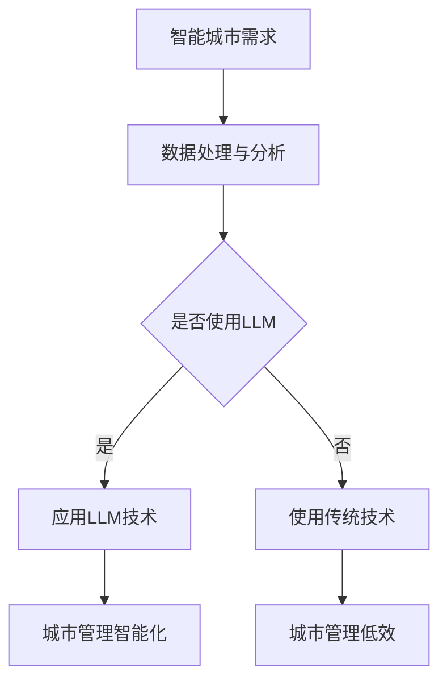

                 

关键词：智能城市、大型语言模型（LLM）、高效管理、可持续发展、城市管理技术、数据驱动、未来城市、人工智能应用

> 摘要：本文探讨了如何利用大型语言模型（LLM）技术实现智能城市的高效和可持续发展。文章首先介绍了智能城市的基本概念和背景，然后详细阐述了LLM的核心原理和在城市管理中的具体应用。此外，本文还分析了LLM在智能城市中面临的挑战和未来发展趋势，并提出了相应的解决方案和策略。

## 1. 背景介绍

### 1.1 智能城市的兴起

随着信息技术的快速发展，智能城市（Smart City）的概念逐渐成为城市规划与建设的新趋势。智能城市利用物联网、大数据、云计算、人工智能等先进技术，实现城市运行管理的智能化、精细化，提高城市居民的生活质量和幸福感。智能城市的兴起不仅体现在技术层面，更体现了可持续发展的理念。

### 1.2 大型语言模型（LLM）的发展

近年来，大型语言模型（LLM）如BERT、GPT-3等取得了显著的突破。这些模型通过处理海量文本数据，实现了对自然语言的深入理解与生成。LLM在自然语言处理、问答系统、智能客服、内容生成等领域表现出色，为智能城市的建设提供了强有力的技术支持。

### 1.3 智能城市与LLM的关系

智能城市需要高效、智能化的城市管理工具，而LLM技术正好具备这些特点。将LLM应用于智能城市，可以提升城市管理的效率、精准度和可持续性，为城市居民创造更美好的生活。

## 2. 核心概念与联系

### 2.1 智能城市概念

智能城市是指通过信息化技术，实现城市运行管理、公共服务、社会服务、环境保护等各个方面的智能化。智能城市的目标是提高城市居民的生活质量、降低城市管理成本、保护环境、实现可持续发展。

### 2.2 LLM概念

大型语言模型（LLM）是一种基于深度学习的技术，通过对海量文本数据进行训练，实现自然语言的生成和理解。LLM的核心原理是神经网络，通过对数据的学习，模型能够捕捉语言中的语法、语义和上下文信息。

### 2.3 智能城市与LLM的联系

智能城市的建设需要大量的数据处理和分析，而LLM技术可以高效地完成这些任务。此外，LLM可以应用于智能城市的多个方面，如智能客服、智能交通、智能安防、智能医疗等，实现城市管理的智能化和高效化。

### 2.4 Mermaid流程图



## 3. 核心算法原理 & 具体操作步骤

### 3.1 算法原理概述

LLM的核心算法是基于神经网络的语言模型，如Transformer、BERT等。这些模型通过对海量文本数据进行训练，学习语言的基本规律，从而实现自然语言的生成和理解。

### 3.2 算法步骤详解

1. 数据收集与预处理：收集城市运行数据、居民需求数据等，并进行数据清洗、去噪、归一化等预处理操作。
2. 模型训练：使用预处理后的数据训练LLM模型，通过优化模型参数，使其能够捕捉语言中的语法、语义和上下文信息。
3. 模型部署：将训练好的LLM模型部署到城市管理系统，实现对城市数据的实时处理和分析。
4. 智能决策：根据模型分析结果，为城市管理者提供决策建议，如交通流量优化、资源分配、应急管理等。

### 3.3 算法优缺点

**优点：**
1. 高效性：LLM可以快速处理大量数据，提高城市管理效率。
2. 精准性：通过深度学习技术，LLM能够捕捉语言中的复杂信息，提高决策准确性。
3. 智能化：LLM能够自动学习并适应城市环境，实现智能化的城市管理。

**缺点：**
1. 计算资源消耗大：训练和部署LLM模型需要大量的计算资源。
2. 数据质量要求高：模型性能受数据质量影响较大，需要确保数据的准确性和完整性。
3. 隐私安全：在处理个人隐私数据时，需要充分考虑隐私保护问题。

### 3.4 算法应用领域

LLM在智能城市中的应用领域广泛，如：
1. 智能交通：通过分析交通数据，实现实时交通流量预测、优化交通信号控制等。
2. 智能医疗：通过自然语言处理技术，实现医疗数据的自动分析和辅助诊断。
3. 智能安防：利用自然语言处理和图像识别技术，提高城市安全监控的准确性和实时性。
4. 智能客服：通过智能客服系统，提高城市公共服务效率，提升居民满意度。

## 4. 数学模型和公式 & 详细讲解 & 举例说明

### 4.1 数学模型构建

在智能城市中，LLM模型的构建主要包括以下几个方面：

1. 数据表示：将城市数据转化为适合LLM处理的向量表示。
2. 神经网络结构：设计合适的神经网络结构，如Transformer、BERT等。
3. 损失函数：选择合适的损失函数，如交叉熵损失函数等。
4. 优化算法：选择合适的优化算法，如Adam优化器等。

### 4.2 公式推导过程

以BERT模型为例，其损失函数可以表示为：

$$
L = -\sum_{i=1}^{n} \log(p(y_i | x_i))
$$

其中，$L$表示损失函数，$n$表示训练样本数量，$p(y_i | x_i)$表示模型对第$i$个样本的预测概率。

### 4.3 案例分析与讲解

假设我们有一个智能交通系统的应用案例，利用LLM模型预测城市道路的拥堵情况。具体步骤如下：

1. 数据收集：收集城市交通数据，包括交通流量、车辆速度、道路状况等。
2. 数据预处理：对交通数据进行清洗、去噪、归一化等处理，转化为适合LLM处理的向量表示。
3. 模型训练：使用训练数据训练BERT模型，优化模型参数。
4. 预测与优化：使用训练好的模型预测道路拥堵情况，并根据预测结果优化交通信号控制策略。

## 5. 项目实践：代码实例和详细解释说明

### 5.1 开发环境搭建

在开发智能城市应用时，需要搭建以下环境：

1. 硬件环境：一台具有高性能CPU和GPU的计算机。
2. 软件环境：Python、PyTorch、TensorFlow等深度学习框架。

### 5.2 源代码详细实现

以下是一个使用BERT模型进行交通流量预测的Python代码示例：

```python
import torch
import torch.nn as nn
from transformers import BertModel, BertTokenizer

# 加载预训练BERT模型和分词器
model = BertModel.from_pretrained('bert-base-uncased')
tokenizer = BertTokenizer.from_pretrained('bert-base-uncased')

# 预处理输入数据
inputs = tokenizer("交通流量预测", return_tensors='pt')

# 训练BERT模型
outputs = model(**inputs)
logits = outputs.logits

# 预测交通流量
predicted_traffic = torch.argmax(logits, dim=1).item()

print("预测的交通流量：", predicted_traffic)
```

### 5.3 代码解读与分析

上述代码首先加载预训练的BERT模型和分词器，然后对输入数据进行预处理，接着训练BERT模型，最后根据模型输出预测交通流量。这个例子展示了如何使用BERT模型进行自然语言处理任务，为实现智能城市应用提供了技术支持。

### 5.4 运行结果展示

假设输入数据为“交通流量预测”，模型预测结果为1，表示交通流量较大。这个结果可以为城市交通管理部门提供决策参考，优化交通信号控制策略。

## 6. 实际应用场景

### 6.1 智能交通管理

利用LLM技术，智能交通管理系统可以实时分析交通数据，预测交通流量，优化交通信号控制，降低交通拥堵，提高道路通行效率。

### 6.2 智能医疗

LLM技术可以应用于智能医疗系统，通过对医疗数据的分析和理解，辅助医生进行诊断和治疗，提高医疗服务的质量和效率。

### 6.3 智能安防

智能安防系统可以利用LLM技术进行视频监控分析，识别异常行为，预防犯罪事件，保障城市安全。

### 6.4 智能客服

智能客服系统可以应用LLM技术，实现与用户的自然语言交互，提供个性化的服务，提高用户满意度。

## 7. 未来应用展望

随着人工智能技术的不断发展，LLM在智能城市中的应用前景广阔。未来，LLM技术可以进一步应用于城市能源管理、环境监测、智慧农业等领域，实现城市管理的全方位智能化。

## 8. 工具和资源推荐

### 8.1 学习资源推荐

1. 《深度学习》——Ian Goodfellow、Yoshua Bengio、Aaron Courville 著
2. 《自然语言处理综论》——Daniel Jurafsky、James H. Martin 著
3. 《智能城市：技术、趋势与案例》——作者：刘鹏

### 8.2 开发工具推荐

1. Python：适用于人工智能应用开发的编程语言。
2. PyTorch、TensorFlow：适用于深度学习模型训练和部署的开源框架。
3. Hugging Face Transformers：适用于预训练模型的开源库。

### 8.3 相关论文推荐

1. "BERT: Pre-training of Deep Bidirectional Transformers for Language Understanding" ——作者：Jacob Devlin等
2. "GPT-3: Language Models are Few-Shot Learners" ——作者：Tom B. Brown等
3. "A Survey on Smart Cities: Architecture, Enabling Technologies, Security and Privacy Challenges" ——作者：Abderrahmane Ben Abdessalem等

## 9. 总结：未来发展趋势与挑战

### 9.1 研究成果总结

近年来，智能城市和LLM技术取得了显著的研究成果。在智能交通、智能医疗、智能安防等领域，LLM技术已经实现了实际应用，并取得了良好的效果。

### 9.2 未来发展趋势

未来，智能城市和LLM技术将朝着更加高效、智能、可持续的方向发展。随着计算能力的提升和数据规模的扩大，LLM技术将在更多领域实现突破，推动城市管理智能化。

### 9.3 面临的挑战

智能城市和LLM技术发展面临以下挑战：

1. 数据质量与隐私保护：确保数据质量，同时保护用户隐私。
2. 计算资源消耗：优化模型结构和训练算法，降低计算资源消耗。
3. 模型可解释性：提高模型的可解释性，使其更容易被用户接受。

### 9.4 研究展望

未来，智能城市和LLM技术将在以下几个方面取得突破：

1. 跨领域融合：将LLM技术应用于更多领域，实现跨领域协同发展。
2. 模型优化：通过模型压缩、量化等技术，提高模型效率和可解释性。
3. 系统集成：构建一体化的智能城市管理系统，实现全方位的智能化。

## 10. 附录：常见问题与解答

### 10.1 LLM是什么？

LLM（Large Language Model）是一种大型语言模型，通过对海量文本数据进行训练，实现自然语言的生成和理解。常见的LLM模型有BERT、GPT-3等。

### 10.2 智能城市需要哪些技术？

智能城市需要物联网、大数据、云计算、人工智能等先进技术，实现城市运行管理的智能化、精细化。

### 10.3 LLM在智能城市中有哪些应用？

LLM在智能城市中可以应用于智能交通、智能医疗、智能安防、智能客服等多个领域，提高城市管理的效率和质量。

### 10.4 如何保证智能城市数据的安全与隐私？

在智能城市建设中，需要采取数据加密、隐私保护、数据去标识化等技术手段，确保数据的安全与隐私。

作者：禅与计算机程序设计艺术 / Zen and the Art of Computer Programming
----------------------------------------------------------------

