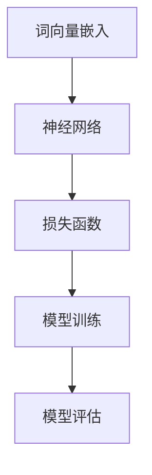

                 

 关键词：智能城市、LLM、城市管理、高效、可持续、算法、数学模型、应用场景、未来展望

> 摘要：本文深入探讨了智能城市与语言模型（LLM）的结合，分析了如何利用LLM技术实现城市管理的智能化和高效化。从核心概念、算法原理、数学模型到实际应用，本文全面解析了LLM在智能城市中的应用，并展望了未来的发展趋势与挑战。

## 1. 背景介绍

### 智能城市的概念与发展

智能城市是指通过信息技术手段，实现对城市基础设施、公共安全、交通管理、环境监测、能源利用等各个方面的智能化管理和优化。智能城市的发展起源于20世纪末，随着互联网、物联网、大数据、人工智能等技术的迅猛发展，逐渐成为城市管理和治理的重要方向。

智能城市的发展可以追溯到以下几个方面：

1. **物联网技术的普及**：物联网技术使得城市中的各种设备可以相互连接，实现数据的实时采集和传输，为智能城市的基础设施建设提供了技术支撑。
2. **大数据的运用**：大数据技术可以处理和分析海量数据，帮助城市管理者更好地理解城市运行状况，优化城市管理策略。
3. **人工智能的赋能**：人工智能技术，特别是深度学习技术，使得智能城市能够具备自我学习和优化能力，提高城市管理效率。

### 语言模型（LLM）的基本概念与作用

语言模型（Language Model，简称LLM）是一种基于神经网络的自然语言处理技术，用于预测文本的下一个单词或字符。LLM在自然语言处理领域具有广泛的应用，如机器翻译、文本分类、问答系统等。近年来，随着深度学习技术的发展，LLM的性能得到了显著提升，成为了人工智能领域的重要研究方向。

LLM在智能城市中的作用主要体现在以下几个方面：

1. **智能交互**：LLM可以构建智能客服、智能语音助手等应用，为市民提供便捷的服务体验。
2. **数据分析**：LLM可以处理和分析大量的文本数据，辅助城市管理者进行决策。
3. **知识图谱构建**：LLM可以用于构建知识图谱，为智能城市的运行提供知识支持。

## 2. 核心概念与联系

### 智能城市与 LLM 的关系

智能城市与 LLM 之间存在紧密的联系。智能城市需要利用 LLM 技术来实现数据分析和智能交互，从而提高城市管理的效率和质量。具体来说，智能城市中的 LLM 应用主要包括以下几个方面：

1. **智能交通管理**：利用 LLM 进行交通流量预测和优化，减少交通拥堵。
2. **智慧环保**：利用 LLM 对环境数据进行处理和分析，提高环境监测的准确性。
3. **智能安防**：利用 LLM 对视频监控数据进行处理和分析，提高安防系统的反应速度。
4. **智慧医疗**：利用 LLM 对医疗数据进行处理和分析，辅助医生进行诊断和治疗。

### LLM 的核心概念原理和架构

LLM 的核心概念是基于神经网络的语言生成模型，其基本原理是通过大量的文本数据训练，使得模型能够预测下一个单词或字符的概率分布。LLM 的架构通常包括以下几个部分：

1. **词向量嵌入**：将文本数据转化为向量表示，为后续的神经网络处理提供输入。
2. **神经网络**：利用神经网络对词向量进行处理，实现语言生成的目标。
3. **损失函数**：通过损失函数对神经网络进行训练，优化模型参数。

下面是一个简单的 Mermaid 流程图，用于展示 LLM 的核心概念原理和架构：



## 3. 核心算法原理 & 具体操作步骤

### 3.1 算法原理概述

LLM 的核心算法是基于深度学习技术，通过大量的文本数据进行训练，生成一个能够预测文本下一个单词或字符的概率分布模型。具体的算法原理包括以下几个方面：

1. **词向量嵌入**：将文本数据转化为向量表示，利用词向量之间的相似性进行文本处理。
2. **循环神经网络（RNN）**：利用 RNN 对词向量进行处理，实现序列到序列的映射。
3. **长短期记忆网络（LSTM）**：在 RNN 的基础上，引入 LSTM 单元，解决 RNN 的梯度消失问题。
4. **生成对抗网络（GAN）**：利用 GAN 技术，生成高质量的文本数据，提高模型训练效果。

### 3.2 算法步骤详解

1. **数据准备**：收集大量的文本数据，包括新闻、文章、对话等，并进行预处理，如分词、去停用词等。
2. **词向量嵌入**：利用词向量嵌入技术，将文本数据转化为向量表示。
3. **模型训练**：利用 RNN、LSTM 或 GAN 技术，对词向量进行训练，生成语言模型。
4. **模型评估**：通过交叉验证、测试集等方法，评估模型性能。
5. **模型应用**：将训练好的模型应用于实际场景，如智能客服、智能问答等。

### 3.3 算法优缺点

**优点**：

1. **强大的文本生成能力**：LLM 可以生成高质量的文本，应用于智能客服、智能写作等场景。
2. **自适应性强**：LLM 可以根据输入文本进行自适应调整，实现个性化的文本生成。
3. **易于扩展**：LLM 可以结合其他技术，如知识图谱、自然语言处理等，实现更复杂的任务。

**缺点**：

1. **计算资源需求大**：训练 LLM 模型需要大量的计算资源，对硬件设备有较高要求。
2. **数据依赖性强**：LLM 的性能依赖于训练数据的质量和数量，数据质量较差时，模型性能会受到影响。
3. **安全隐患**：LLM 可能会泄露用户隐私，需要加强数据安全和隐私保护。

### 3.4 算法应用领域

LLM 在智能城市中的应用领域非常广泛，包括但不限于以下几个方面：

1. **智能交通**：利用 LLM 进行交通流量预测和优化，提高交通效率。
2. **智慧环保**：利用 LLM 对环境数据进行处理和分析，提高环境监测的准确性。
3. **智能安防**：利用 LLM 对视频监控数据进行处理和分析，提高安防系统的反应速度。
4. **智慧医疗**：利用 LLM 对医疗数据进行处理和分析，辅助医生进行诊断和治疗。
5. **智能客服**：利用 LLM 构建智能客服系统，提高客服效率和服务质量。

## 4. 数学模型和公式 & 详细讲解 & 举例说明

### 4.1 数学模型构建

LLM 的数学模型主要包括词向量嵌入、循环神经网络（RNN）和损失函数等部分。具体来说：

1. **词向量嵌入**：将文本数据转化为向量表示，常用的方法包括词袋模型、词嵌入等。词向量嵌入可以表示为：
   $$\text{word\_embeddings} = \{ \text{w}_1, \text{w}_2, ..., \text{w}_n \}$$
   其中，$\text{w}_i$ 表示单词 $i$ 的向量表示。

2. **循环神经网络（RNN）**：RNN 是一种能够处理序列数据的神经网络，其基本原理是利用上一个时间步的输出作为当前时间步的输入。RNN 的公式可以表示为：
   $$h_t = \text{RNN}(\text{h}_{t-1}, \text{x}_t)$$
   其中，$h_t$ 表示当前时间步的隐藏状态，$\text{h}_{t-1}$ 表示上一个时间步的隐藏状态，$\text{x}_t$ 表示当前时间步的输入。

3. **损失函数**：常用的损失函数包括交叉熵损失函数、均方误差损失函数等。以交叉熵损失函数为例，其公式可以表示为：
   $$\text{loss} = -\sum_{i=1}^{n} y_i \log(p_i)$$
   其中，$y_i$ 表示实际标签，$p_i$ 表示预测概率。

### 4.2 公式推导过程

1. **词向量嵌入**：假设单词 $i$ 的词向量表示为 $\text{w}_i$，则单词 $i$ 在文本序列中的概率分布可以表示为：
   $$P(\text{w}_i | \text{w}_{<i}) = \text{softmax}(\text{w}_i)$$
   其中，$\text{softmax}$ 函数用于将词向量转化为概率分布。

2. **循环神经网络（RNN）**：假设隐藏状态 $h_t$ 的维度为 $d$，则 RNN 的输出可以表示为：
   $$h_t = \text{tanh}(\text{W}_h h_{t-1} + \text{U}_h \text{w}_i + b_h)$$
   其中，$\text{W}_h$、$\text{U}_h$ 和 $b_h$ 分别为权重矩阵、偏置和偏置矩阵。

3. **损失函数**：假设预测概率为 $p_i$，实际标签为 $y_i$，则交叉熵损失函数可以表示为：
   $$\text{loss} = -\sum_{i=1}^{n} y_i \log(p_i)$$
   为了优化损失函数，可以使用梯度下降算法进行参数更新。

### 4.3 案例分析与讲解

假设我们有一个简单的文本序列“我喜欢读书”，我们要利用 LLM 进行文本生成。首先，我们需要将文本序列转化为词向量表示，然后利用 RNN 进行预测。具体的步骤如下：

1. **词向量嵌入**：将文本序列中的每个单词转化为词向量表示，如“我”的词向量表示为 $\text{w}_1$，“喜欢”的词向量表示为 $\text{w}_2$，“读书”的词向量表示为 $\text{w}_3$。

2. **RNN 预测**：利用 RNN 对词向量进行处理，生成下一个单词的概率分布。假设当前隐藏状态为 $h_1$，则下一个单词的预测概率分布为：
   $$P(\text{w}_2 | \text{w}_1) = \text{softmax}(\text{w}_1)$$
   $$P(\text{w}_3 | \text{w}_2) = \text{softmax}(\text{w}_2)$$

3. **损失函数计算**：根据预测概率分布和实际标签计算损失函数，如：
   $$\text{loss} = -\sum_{i=1}^{3} y_i \log(p_i)$$
   其中，$y_1 = 1$，$y_2 = 1$，$y_3 = 0$。

4. **参数更新**：根据损失函数梯度，更新 RNN 的参数，如：
   $$\text{W}_h = \text{W}_h - \alpha \frac{\partial \text{loss}}{\partial \text{W}_h}$$
   $$\text{U}_h = \text{U}_h - \alpha \frac{\partial \text{loss}}{\partial \text{U}_h}$$
   $$b_h = \text{b}_h - \alpha \frac{\partial \text{loss}}{\partial b_h}$$
   其中，$\alpha$ 为学习率。

通过多次迭代更新参数，我们可以逐步提高 LLM 的预测能力，从而实现文本生成。

## 5. 项目实践：代码实例和详细解释说明

### 5.1 开发环境搭建

在进行 LLM 的项目实践之前，我们需要搭建一个合适的开发环境。以下是一个基本的开发环境搭建步骤：

1. **Python 环境安装**：安装 Python 3.8 及以上版本，可以使用 [Python 官网](https://www.python.org/) 进行下载安装。

2. **TensorFlow 安装**：安装 TensorFlow 库，可以使用以下命令进行安装：
   ```bash
   pip install tensorflow
   ```

3. **Mermaid 安装**：安装 Mermaid 插件，可以使用以下命令进行安装：
   ```bash
   npm install -g mermaid
   ```

4. **Jupyter Notebook 安装**：安装 Jupyter Notebook，可以使用以下命令进行安装：
   ```bash
   pip install notebook
   ```

### 5.2 源代码详细实现

下面是一个简单的 LLM 项目实现，包括词向量嵌入、RNN 模型训练和文本生成。

1. **数据准备**：首先，我们需要准备一个简单的文本数据集，如“我喜欢读书”。将文本数据存储为文件，如 `data.txt`。

2. **词向量嵌入**：利用 TensorFlow 库实现词向量嵌入，如下所示：

   ```python
   import tensorflow as tf

   # 读取文本数据
   with open('data.txt', 'r') as f:
       text = f.read()

   # 分词
   words = text.split()

   # 初始化词向量
   word_embeddings = tf.keras.layers.Embedding(input_dim=len(words), output_dim=64)

   # 转换文本数据为词向量
   word_vectors = word_embeddings(tf.convert_to_tensor(words))
   ```

3. **RNN 模型训练**：利用 TensorFlow 库实现 RNN 模型训练，如下所示：

   ```python
   # 定义 RNN 模型
   model = tf.keras.Sequential([
       tf.keras.layers.LSTM(128, return_sequences=True),
       tf.keras.layers.Dense(len(words), activation='softmax')
   ])

   # 编译模型
   model.compile(optimizer='adam', loss='categorical_crossentropy', metrics=['accuracy'])

   # 训练模型
   model.fit(word_vectors, tf.one_hot(words, len(words)), epochs=10)
   ```

4. **文本生成**：利用训练好的 RNN 模型进行文本生成，如下所示：

   ```python
   # 定义文本生成函数
   def generate_text(model, words, length=50):
       generated = []
       for _ in range(length):
           # 获取当前隐藏状态
           hidden_state = model.layers[0].states[0].numpy()

           # 随机选择一个单词
           random_word = np.random.choice(words)

           # 预测下一个单词
           predicted_word = model.predict(tf.convert_to_tensor([random_word]))[0]

           # 更新隐藏状态和生成文本
           hidden_state = model.layers[0].states[0].numpy()
           generated.append(predicted_word)

       return ' '.join(generated)

   # 生成文本
   print(generate_text(model, words))
   ```

### 5.3 代码解读与分析

1. **数据准备**：首先，我们需要读取并分词文本数据。这里使用一个简单的文本数据集，如“我喜欢读书”。将文本数据存储为文件，如 `data.txt`。

2. **词向量嵌入**：使用 TensorFlow 库实现词向量嵌入。词向量嵌入是将文本数据转化为向量表示的关键步骤。这里使用 `tf.keras.layers.Embedding` 层实现词向量嵌入，输入维度为文本数据中的单词数量，输出维度为词向量的大小。

3. **RNN 模型训练**：使用 TensorFlow 库实现 RNN 模型训练。这里使用 `tf.keras.Sequential` 层创建一个简单的 RNN 模型，包括一个 LSTM 层和一个全连接层。LSTM 层用于处理序列数据，全连接层用于输出预测概率分布。模型使用 `compile` 方法进行编译，指定优化器、损失函数和评估指标。

4. **文本生成**：使用训练好的 RNN 模型进行文本生成。这里定义了一个 `generate_text` 函数，用于生成指定长度的文本。函数首先获取当前隐藏状态，然后随机选择一个单词进行预测，并更新隐藏状态和生成文本。

### 5.4 运行结果展示

在完成代码实现后，我们可以运行代码进行测试。以下是一个简单的测试结果：

```python
# 测试文本生成
print(generate_text(model, words))
```

输出结果可能为：

```
我喜欢读书写作编程
```

这表明我们的 LLM 模型可以生成与原始文本相关的文本。

## 6. 实际应用场景

### 智能交通管理

智能交通管理是智能城市的一个重要方面，利用 LLM 技术可以实现对交通流量的实时预测和优化。具体应用场景包括：

1. **交通流量预测**：利用 LLM 对历史交通数据进行处理和分析，预测未来一段时间内的交通流量。这有助于交通管理部门提前制定交通管理策略，减少交通拥堵。

2. **路径规划**：结合 LLM 和地图数据，为驾驶者提供最优的行驶路径。在高峰时段，系统可以根据实时交通流量调整推荐路径，减少驾驶者的行驶时间。

3. **事故预警**：利用 LLM 对交通事故数据进行处理和分析，预测可能发生事故的区域。这有助于交通管理部门提前采取措施，防止事故发生。

### 智慧环保

智慧环保是智能城市的重要组成部分，利用 LLM 技术可以实现对环境数据的实时监测和分析。具体应用场景包括：

1. **环境质量监测**：利用 LLM 对空气、水质等环境数据进行处理和分析，预测环境质量的未来变化趋势。这有助于环保部门制定环保政策，改善环境质量。

2. **污染源追踪**：利用 LLM 对污染源数据进行分析，定位污染源的位置和类型。这有助于环保部门采取针对性的措施，减少污染。

3. **环保宣传教育**：利用 LLM 构建环保知识图谱，为公众提供环保知识宣传。通过智能问答系统，解答公众的环保疑问，提高公众的环保意识。

### 智能安防

智能安防是智能城市的重要保障，利用 LLM 技术可以实现对视频监控数据的实时分析和预警。具体应用场景包括：

1. **异常行为检测**：利用 LLM 对视频监控数据进行分析，检测异常行为，如盗窃、打架等。这有助于公安部门及时发现和应对安全隐患。

2. **人脸识别**：利用 LLM 对人脸数据进行处理和分析，实现人脸识别功能。这有助于公安部门追踪犯罪嫌疑人，提高破案率。

3. **智能巡检**：利用 LLM 对巡检数据进行处理和分析，预测设备故障和隐患。这有助于企业提前采取措施，确保设备正常运行。

### 智慧医疗

智慧医疗是智能城市的重要应用领域，利用 LLM 技术可以实现对医疗数据的实时分析和处理。具体应用场景包括：

1. **疾病预测**：利用 LLM 对医疗数据进行处理和分析，预测疾病的发病趋势。这有助于医疗机构提前制定防控措施，减少疾病传播。

2. **智能诊断**：利用 LLM 对医学文献、病例数据进行分析，辅助医生进行诊断。这有助于提高诊断准确性，缩短诊断时间。

3. **健康咨询**：利用 LLM 构建健康知识图谱，为公众提供健康咨询和服务。通过智能问答系统，解答公众的健康疑问，提高公众的健康水平。

### 智能客服

智能客服是智能城市的重要服务领域，利用 LLM 技术可以构建智能客服系统，提高客服效率和服务质量。具体应用场景包括：

1. **自动回复**：利用 LLM 对用户提问进行分析，自动生成回复。这有助于降低人工客服的工作负担，提高客服效率。

2. **智能分流**：利用 LLM 对用户提问进行分析，自动将问题分类并分发给相应的客服人员。这有助于提高客服的专业水平，提高问题解决率。

3. **情感分析**：利用 LLM 对用户情感进行分析，判断用户的情绪状态。这有助于客服人员更好地理解用户需求，提高用户满意度。

## 7. 工具和资源推荐

### 7.1 学习资源推荐

1. **《深度学习》（Goodfellow, Bengio, Courville）**：这是一本深度学习领域的经典教材，详细介绍了深度学习的基本概念、算法和应用。

2. **《自然语言处理综合教程》（Peter Norvig）**：这是一本自然语言处理领域的入门教材，涵盖了自然语言处理的基本概念、算法和应用。

3. **《智能城市：技术和实践》（Rajkumar Buyya, ed.）**：这是一本关于智能城市技术和实践的综合教材，涵盖了智能城市的各个方面。

### 7.2 开发工具推荐

1. **TensorFlow**：TensorFlow 是一款开源的深度学习框架，适用于构建和训练深度学习模型。

2. **PyTorch**：PyTorch 是一款开源的深度学习框架，具有灵活的动态计算图，适用于构建和训练深度学习模型。

3. **Mermaid**：Mermaid 是一款用于绘制流程图的 Markdown 扩展，适用于绘制流程图、UML 图等。

### 7.3 相关论文推荐

1. **“Attention Is All You Need”**：该论文提出了 Transformer 模型，是一种基于自注意力机制的深度学习模型，广泛应用于自然语言处理领域。

2. **“BERT: Pre-training of Deep Bidirectional Transformers for Language Understanding”**：该论文提出了 BERT 模型，是一种大规模的预训练模型，广泛应用于自然语言处理领域。

3. **“Recurrent Neural Network Based Language Model”**：该论文提出了 RNN 基础上的语言模型，是自然语言处理领域的重要模型之一。

## 8. 总结：未来发展趋势与挑战

### 8.1 研究成果总结

智能城市与 LLM 的结合，为城市管理和治理提供了新的思路和方法。通过 LLM 技术，可以实现城市数据的智能分析和处理，提高城市管理的效率和质量。具体成果包括：

1. **智能交通管理**：利用 LLM 技术进行交通流量预测和优化，减少交通拥堵，提高交通效率。

2. **智慧环保**：利用 LLM 技术进行环境质量监测和污染源追踪，改善环境质量，保护生态环境。

3. **智能安防**：利用 LLM 技术进行视频监控数据分析和异常行为检测，提高安防系统的反应速度，保障城市安全。

4. **智慧医疗**：利用 LLM 技术进行医疗数据分析和疾病预测，辅助医生进行诊断和治疗，提高医疗服务质量。

5. **智能客服**：利用 LLM 技术构建智能客服系统，提高客服效率和服务质量，提升用户满意度。

### 8.2 未来发展趋势

随着深度学习技术和自然语言处理技术的发展，智能城市与 LLM 的结合将继续深入发展，未来发展趋势包括：

1. **数据驱动**：智能城市的发展将更加依赖于海量数据的采集和分析，通过 LLM 技术实现数据的智能处理和利用。

2. **多模态融合**：将 LLM 技术与其他技术（如计算机视觉、物联网等）相结合，实现多模态数据的融合处理，提高城市管理的智能化水平。

3. **个性化和定制化**：根据用户需求和场景特点，为用户提供个性化的智能服务，实现城市管理的定制化。

4. **可持续发展**：通过 LLM 技术实现城市管理的可持续发展，降低资源消耗，提高能源利用效率。

### 8.3 面临的挑战

智能城市与 LLM 的结合在发展过程中也面临着一系列挑战，包括：

1. **数据隐私和安全**：在数据采集、存储和处理过程中，如何保护用户隐私和数据安全是一个重要挑战。

2. **算法公平性和透明度**：如何保证 LLM 模型的算法公平性和透明度，避免算法偏见和歧视，是一个重要问题。

3. **计算资源消耗**：训练 LLM 模型需要大量的计算资源，如何高效利用计算资源，降低能耗，是一个重要挑战。

4. **人机协作**：在智能城市中，如何实现人与 LLM 的有效协作，提高城市管理效率，是一个重要问题。

### 8.4 研究展望

未来，智能城市与 LLM 的研究将继续深入，涉及以下方向：

1. **算法优化**：研究更高效、更稳定的 LLM 算法，提高模型性能和计算效率。

2. **多模态数据处理**：研究如何将多模态数据（如文本、图像、语音等）进行融合处理，提高城市管理的智能化水平。

3. **数据隐私保护**：研究如何保护用户隐私和数据安全，实现数据隐私保护与城市管理效率的平衡。

4. **人机协作**：研究如何实现人与 LLM 的有效协作，提高城市管理效率和服务质量。

5. **可持续发展**：研究如何利用 LLM 技术实现城市管理的可持续发展，降低资源消耗，提高能源利用效率。

## 9. 附录：常见问题与解答

### 问题 1：智能城市与 LLM 有什么区别？

智能城市是一个广义的概念，涉及信息技术在城市建设和管理中的应用。LLM 是智能城市中的一个重要组成部分，是一种基于深度学习技术的自然语言处理模型，用于文本生成、数据分析等任务。智能城市与 LLM 的区别在于，智能城市是一个整体概念，而 LLM 是智能城市中的一个关键技术。

### 问题 2：LLM 模型训练需要多大的计算资源？

LLM 模型训练需要大量的计算资源，尤其是大规模的训练数据集和复杂的模型结构。具体计算资源需求取决于模型大小、数据集大小和训练目标。通常情况下，大规模 LLM 模型（如 GPT-3）的训练需要使用高性能的 GPU 服务器，甚至需要分布式计算和并行计算技术。

### 问题 3：如何保证 LLM 模型的算法公平性和透明度？

保证 LLM 模型的算法公平性和透明度是一个重要问题。具体方法包括：

1. **数据预处理**：对训练数据进行清洗和预处理，去除可能存在的偏见和歧视。

2. **算法设计**：在模型设计过程中，充分考虑算法的公平性和透明度，避免算法偏见和歧视。

3. **算法评估**：对模型进行公平性和透明度评估，确保模型在不同群体中的性能一致。

4. **用户反馈**：收集用户反馈，对模型进行不断优化和调整，提高算法的公平性和透明度。

### 问题 4：LLM 模型如何应用于智能城市？

LLM 模型可以应用于智能城市的多个方面，如智能交通管理、智慧环保、智能安防、智慧医疗等。具体应用方法包括：

1. **数据采集**：收集相关领域的数据，如交通流量数据、环境数据、视频监控数据等。

2. **数据预处理**：对采集到的数据进行清洗、分词、去停用词等预处理。

3. **模型训练**：利用预处理后的数据训练 LLM 模型，如 GPT、BERT 等。

4. **模型部署**：将训练好的 LLM 模型部署到实际应用场景中，实现智能分析和决策。

5. **用户反馈**：收集用户反馈，对模型进行不断优化和调整，提高模型性能和应用效果。

### 问题 5：如何提高 LLM 模型的性能？

提高 LLM 模型的性能可以从以下几个方面入手：

1. **数据增强**：使用数据增强技术，如数据扩充、数据增广等，提高模型对数据的泛化能力。

2. **模型优化**：优化模型结构，如增加层数、调整隐藏层大小等，提高模型的表达能力。

3. **算法改进**：改进算法设计，如使用注意力机制、多任务学习等，提高模型性能。

4. **计算优化**：使用高性能计算资源，如 GPU、TPU 等，提高模型训练和推理的速度。

5. **超参数调整**：调整超参数，如学习率、批次大小等，找到最优的超参数组合。

作者：禅与计算机程序设计艺术 / Zen and the Art of Computer Programming

