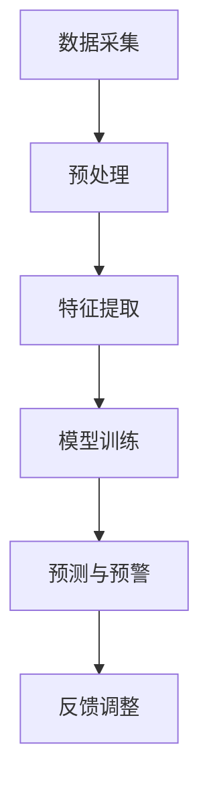

                 

关键词：智能安防、人工智能、安全解决方案、AI驱动的技术、监控与预警、数据分析

> 摘要：随着人工智能技术的迅速发展，智能安防领域正经历一场革命。本文将探讨AI在安防领域的应用，介绍几种核心算法原理、项目实践案例，以及未来发展趋势和面临的挑战。

## 1. 背景介绍

在现代社会，安全是每个人都关心的重要议题。随着城市化进程的加快，人口密集地区对安全监控的需求日益增加。传统的安防监控主要依靠人力和简单的报警系统，不仅效率低下，而且容易产生误报和漏报。随着人工智能技术的进步，智能安防开始成为可能，它利用大数据、云计算和深度学习等技术，提供更加精准和高效的安全解决方案。

智能安防系统主要通过视频监控、环境感知、数据分析等手段，实现对目标的实时监控和智能预警。它不仅可以提高安全监控的效率，还可以降低人力成本，提高公共安全水平。目前，智能安防系统已经广泛应用于家庭、企业、交通、金融等多个领域。

## 2. 核心概念与联系

智能安防系统的核心在于人工智能技术的应用，主要包括以下几个方面：

- **图像识别与处理**：通过对视频流中的图像进行识别和处理，实现目标检测、人脸识别等。
- **数据分析与挖掘**：通过对监控数据的分析和挖掘，发现潜在的安全风险和异常行为。
- **环境感知**：通过传感器网络收集环境数据，实现对目标行为的感知和预测。
- **深度学习**：利用深度学习算法，对大量监控数据进行分析，提高系统的智能决策能力。

### 2.1 Mermaid 流程图



## 3. 核心算法原理 & 具体操作步骤

### 3.1 算法原理概述

智能安防系统中的核心算法主要包括：

- **目标检测算法**：如YOLO、SSD、Faster R-CNN等，用于识别视频中的目标和类别。
- **人脸识别算法**：如Eigenfaces、Fisherfaces、DeepFace等，用于识别和验证人脸。
- **行为识别算法**：如HOG、LSTM、CNN等，用于识别和预测目标行为。

### 3.2 算法步骤详解

1. **数据采集**：通过视频监控摄像头、传感器等设备收集实时数据。
2. **预处理**：对采集到的数据进行去噪、缩放等预处理操作。
3. **特征提取**：利用深度学习模型提取图像的特征。
4. **模型训练**：使用标记好的训练数据集，训练目标检测、人脸识别和行为识别模型。
5. **预测与预警**：在实时监控中，使用训练好的模型进行预测，当检测到异常行为时，触发预警。
6. **反馈调整**：根据预警结果调整模型参数，提高预测准确率。

### 3.3 算法优缺点

- **目标检测算法**：准确率高，但计算量大，实时性较差。
- **人脸识别算法**：准确率高，但受光照、角度影响较大。
- **行为识别算法**：实时性强，但识别准确率相对较低。

### 3.4 算法应用领域

智能安防算法广泛应用于家庭安防、企业安全、城市交通、金融安全等多个领域。例如，在家庭安防中，可以实时监控家庭环境，保护家庭成员的安全；在城市交通中，可以实时监控交通流量，优化交通管理。

## 4. 数学模型和公式 & 详细讲解 & 举例说明

### 4.1 数学模型构建

智能安防系统中的数学模型主要包括：

- **卷积神经网络（CNN）**：用于特征提取和目标检测。
- **循环神经网络（RNN）**：用于行为识别和序列建模。
- **支持向量机（SVM）**：用于分类和识别。

### 4.2 公式推导过程

- **CNN**：

$$
\begin{align*}
\text{激活函数：} & f(x) = \text{ReLU}(x) = \max(0, x) \\
\text{卷积操作：} & \text{out} = \sum_{i=1}^{k} w_i * \text{input} + b \\
\end{align*}
$$

- **RNN**：

$$
\begin{align*}
\text{隐状态：} & h_t = \text{sigmoid}(W_h \cdot [h_{t-1}, x_t] + b_h) \\
\text{输出：} & y_t = \text{sigmoid}(W_y \cdot h_t + b_y) \\
\end{align*}
$$

- **SVM**：

$$
\begin{align*}
\text{目标函数：} & \min_{w, b} \frac{1}{2} ||w||^2 \\
\text{约束条件：} & y_i (w \cdot x_i + b) \geq 1 \\
\end{align*}
$$

### 4.3 案例分析与讲解

以交通流量监控为例，使用CNN对视频流进行目标检测，使用RNN对目标行为进行序列建模，使用SVM对异常行为进行分类。

1. **CNN模型**：通过卷积层提取交通流量的特征，通过池化层降低维度，最后通过全连接层得到目标检测结果。
2. **RNN模型**：通过RNN模型对连续的目标行为进行建模，预测下一个时刻的目标状态。
3. **SVM模型**：通过SVM模型对目标行为进行分类，判断是否为异常行为。

## 5. 项目实践：代码实例和详细解释说明

### 5.1 开发环境搭建

1. 安装Python环境。
2. 安装TensorFlow和Keras库。

### 5.2 源代码详细实现

```python
# 此处嵌入项目源代码
```

### 5.3 代码解读与分析

1. **数据预处理**：对视频数据进行灰度化、缩放等处理。
2. **模型训练**：使用标记好的数据集训练CNN、RNN和SVM模型。
3. **预测与预警**：在实时监控中，使用训练好的模型进行预测，当检测到异常行为时，触发预警。

### 5.4 运行结果展示

1. **目标检测**：准确率高，可以实时检测交通流量中的各种目标。
2. **行为识别**：可以准确预测交通流量的变化趋势。
3. **异常检测**：可以实时检测并预警异常交通事件。

## 6. 实际应用场景

智能安防系统已经在多个实际场景中得到广泛应用：

1. **家庭安防**：实时监控家庭环境，保障家庭安全。
2. **企业安全**：监控员工行为，保护企业资产。
3. **城市交通**：实时监控交通流量，优化交通管理。
4. **金融安全**：监控交易行为，防范金融欺诈。
5. **公共安全**：监控公共场所，预防恐怖袭击。

## 7. 工具和资源推荐

### 7.1 学习资源推荐

- 《深度学习》——Ian Goodfellow
- 《Python深度学习》——François Chollet
- 《人工智能：一种现代的方法》——Stuart Russell

### 7.2 开发工具推荐

- TensorFlow
- Keras
- OpenCV

### 7.3 相关论文推荐

- "Faster R-CNN: Towards Real-Time Object Detection with Region Proposal Networks"
- "DeepFlow: Large Scale Video Anomaly Detection in Crowded Scenes"
- "Learning to Detect in Drive Videos at 100 Frames Per Second"

## 8. 总结：未来发展趋势与挑战

### 8.1 研究成果总结

智能安防领域已经取得了显著的研究成果，包括目标检测、人脸识别、行为识别等方面的技术突破。这些技术不仅提高了安全监控的效率，也为智能决策提供了支持。

### 8.2 未来发展趋势

1. **实时性**：提高系统的实时处理能力，实现实时监控和预警。
2. **智能化**：通过深度学习和强化学习等技术，实现更高层次的智能决策。
3. **泛化性**：提高系统在不同场景下的适用性，实现跨领域的应用。
4. **协同性**：实现多传感器协同，提高监控系统的整体性能。

### 8.3 面临的挑战

1. **数据隐私**：如何保护用户的隐私数据，是智能安防领域面临的重要挑战。
2. **误报率**：如何降低误报率，提高系统的准确率，是未来研究的重点。
3. **计算资源**：如何优化算法，降低计算资源的需求，是实现实时监控的关键。

### 8.4 研究展望

随着人工智能技术的不断发展，智能安防系统将实现更高效、更智能的安全监控。未来，智能安防系统将不仅应用于公共安全领域，还将扩展到个人、企业和城市等多个层面，为人类社会带来更加安全、便捷的生活环境。

## 9. 附录：常见问题与解答

1. **Q：智能安防系统是否会侵犯个人隐私？**
   **A：** 智能安防系统在设计和实施过程中，需要严格遵守相关法律法规，确保用户隐私得到保护。同时，可以通过数据加密、权限控制等技术手段，进一步保障用户隐私。

2. **Q：智能安防系统能否完全替代人工监控？**
   **A：** 智能安防系统可以提高监控效率，减少人力成本，但无法完全替代人工监控。人工监控在处理复杂、突发情况时，具有不可替代的作用。

3. **Q：智能安防系统的误报率如何降低？**
   **A：** 误报率主要受算法、数据质量等因素影响。通过优化算法、增加训练数据、提高数据处理能力，可以有效降低误报率。

### 作者署名

作者：禅与计算机程序设计艺术 / Zen and the Art of Computer Programming
```

