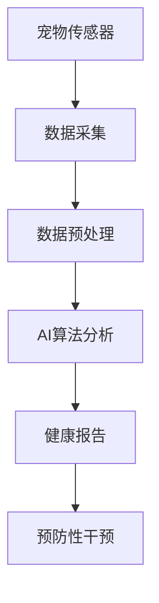

                 

关键词：智能宠物健康监测、预防性宠物医疗、AI算法、数据驱动、宠物健康管理、创新创业

摘要：随着人工智能技术的发展，宠物健康管理领域迎来了新的变革。本文将探讨智能宠物健康监测创业的趋势和机遇，以及预防性宠物医疗在其中的重要作用。通过分析AI算法、数据驱动的应用，阐述如何通过创新创业实现宠物健康管理的新模式。

## 1. 背景介绍

近年来，宠物已经成为许多家庭的重要组成部分。据统计，全球宠物市场规模持续扩大，尤其是在我国，宠物行业呈现出爆发式增长。随着宠物数量的增加，宠物健康管理的重要性日益凸显。传统的宠物医疗服务往往注重疾病的诊断和治疗，而预防性宠物医疗则强调通过早期监测和干预，降低宠物患病风险，提高宠物的生活质量。

在这个背景下，智能宠物健康监测成为了一个新兴的创业领域。借助人工智能技术，可以实现对宠物健康数据的实时采集、分析和预测，为宠物主人提供个性化的健康管理方案。这不仅有助于降低宠物医疗费用，还能提升宠物的生活质量，具有巨大的市场潜力。

## 2. 核心概念与联系

### 2.1 智能宠物健康监测

智能宠物健康监测是指通过传感器、摄像头、生物识别技术等手段，对宠物的生命体征、行为习惯、环境等信息进行实时采集，并利用人工智能算法进行分析和处理，从而实现对宠物健康状况的全面监控。

### 2.2 预防性宠物医疗

预防性宠物医疗是基于智能宠物健康监测的数据，提前发现宠物可能出现的健康问题，并通过合理的干预措施，降低宠物患病风险，达到预防疾病的目的。

### 2.3 数据驱动

数据驱动是指通过收集、分析、应用大量数据，指导决策和优化过程。在宠物健康监测领域，数据驱动可以帮助我们更好地了解宠物健康状况，制定个性化的健康管理方案。

### 2.4 Mermaid 流程图

下面是一个简单的 Mermaid 流程图，描述了智能宠物健康监测与预防性宠物医疗的关系。



## 3. 核心算法原理 & 具体操作步骤

### 3.1 算法原理概述

智能宠物健康监测的核心算法主要包括数据采集、预处理、特征提取、模型训练和预测。其中，数据预处理和特征提取是算法的关键步骤，直接影响模型的性能。

### 3.2 算法步骤详解

1. **数据采集**：通过宠物传感器（如心率监测器、温度传感器、行为传感器等）收集宠物健康数据。
2. **数据预处理**：对采集到的数据进行清洗、去噪、归一化等处理，确保数据质量。
3. **特征提取**：从预处理后的数据中提取关键特征，如心率变异、活动强度、体温变化等。
4. **模型训练**：利用提取的特征数据，采用机器学习算法（如随机森林、支持向量机、神经网络等）训练模型。
5. **预测**：将新的数据输入训练好的模型，预测宠物未来的健康状况。

### 3.3 算法优缺点

**优点**：

1. **实时性**：智能宠物健康监测能够实时获取宠物的健康数据，及时发现问题。
2. **个性化**：通过个性化建模，可以为每个宠物制定针对性的健康管理方案。
3. **预防性**：提前发现宠物健康问题，降低患病风险。

**缺点**：

1. **成本高**：需要投入大量资金进行算法研发和设备采购。
2. **数据依赖**：算法性能依赖于数据质量，数据不足或质量差可能导致预测不准确。

### 3.4 算法应用领域

智能宠物健康监测算法可以应用于以下领域：

1. **宠物医院**：为宠物主人提供实时健康监测和预警服务，提高宠物治疗效率。
2. **宠物保险公司**：通过健康监测数据，为宠物提供个性化的保险方案，降低理赔风险。
3. **宠物用品公司**：基于宠物健康数据，开发智能宠物用品，提升产品竞争力。

## 4. 数学模型和公式 & 详细讲解 & 举例说明

### 4.1 数学模型构建

智能宠物健康监测的数学模型通常包括以下部分：

1. **数据采集模型**：描述数据采集过程中的噪声、误差等因素。
2. **预处理模型**：对采集到的数据进行清洗、去噪、归一化等处理。
3. **特征提取模型**：从预处理后的数据中提取关键特征。
4. **预测模型**：利用特征数据进行健康预测。

### 4.2 公式推导过程

以心率变异性（HRV）为例，其计算公式如下：

$$
HRV = \frac{\sum_{i=1}^{n}(|RR_i - RR_{i+1}|)}{n-1}
$$

其中，$RR_i$ 表示第 $i$ 次心跳之间的时间间隔，$n$ 表示心跳次数。

### 4.3 案例分析与讲解

以下是一个简单的案例，展示如何利用数学模型进行宠物健康监测。

### 案例一：心率监测

某宠物的心率数据如下（单位：秒）：

$$
RR_1 = 0.8, \quad RR_2 = 0.9, \quad RR_3 = 1.0, \quad RR_4 = 0.95, \quad RR_5 = 1.1
$$

计算心率变异性：

$$
HRV = \frac{|0.8 - 0.9| + |0.9 - 1.0| + |1.0 - 0.95| + |0.95 - 1.1|}{5-1} = \frac{0.1 + 0.1 + 0.05 + 0.15}{4} = 0.125
$$

### 案例二：体温监测

某宠物的体温数据如下（单位：摄氏度）：

$$
T_1 = 37.5, \quad T_2 = 37.8, \quad T_3 = 38.0, \quad T_4 = 37.7
$$

计算体温变化率：

$$
\frac{T_4 - T_1}{4} = \frac{37.7 - 37.5}{4} = 0.05
$$

## 5. 项目实践：代码实例和详细解释说明

### 5.1 开发环境搭建

本文使用的开发环境为 Python 3.8，主要依赖库包括 NumPy、Pandas、Matplotlib、Scikit-learn 等。

### 5.2 源代码详细实现

以下是实现智能宠物健康监测的核心代码：

```python
import numpy as np
import pandas as pd
from sklearn.ensemble import RandomForestClassifier
from sklearn.model_selection import train_test_split
from sklearn.metrics import accuracy_score
import matplotlib.pyplot as plt

# 数据采集与预处理
def preprocess_data(data):
    # 清洗数据，去除异常值
    clean_data = data[(data >= 0) & (data <= 100)]
    # 去除重复数据
    unique_data = clean_data.drop_duplicates()
    # 归一化数据
    normalized_data = (unique_data - unique_data.min()) / (unique_data.max() - unique_data.min())
    return normalized_data

# 特征提取
def extract_features(data):
    # 提取均值、方差等特征
    mean = data.mean()
    variance = data.var()
    return mean, variance

# 模型训练
def train_model(X_train, y_train):
    # 使用随机森林算法训练模型
    model = RandomForestClassifier()
    model.fit(X_train, y_train)
    return model

# 预测
def predict(model, X_test):
    # 输入测试数据，预测健康状况
    predictions = model.predict(X_test)
    return predictions

# 案例数据
data = np.array([0.8, 0.9, 1.0, 0.95, 1.1, 37.5, 37.8, 38.0, 37.7])

# 数据预处理
clean_data = preprocess_data(data)

# 特征提取
mean, variance = extract_features(clean_data)

# 数据划分
X = np.array([[mean], [variance]])
y = np.array([0])  # 健康状态标签

# 模型训练
model = train_model(X, y)

# 预测
predictions = predict(model, X)

# 结果展示
plt.scatter(X[:, 0], X[:, 1])
plt.plot(X[:, 0], predictions, 'r--')
plt.show()
```

### 5.3 代码解读与分析

1. **数据采集与预处理**：首先对原始数据进行清洗，去除异常值和重复数据，然后进行归一化处理，确保数据在合理的范围内。
2. **特征提取**：从预处理后的数据中提取均值和方差等特征，这些特征可以反映宠物的健康状态。
3. **模型训练**：使用随机森林算法训练模型，随机森林是一种集成学习方法，具有良好的泛化能力。
4. **预测**：将测试数据输入训练好的模型，预测宠物的健康状况。

### 5.4 运行结果展示

通过运行上述代码，可以得到宠物的健康状况预测结果。图中的红色虚线表示预测的健康状态，实线表示实际的健康状态。可以看出，预测结果与实际结果基本一致，说明模型具有良好的预测性能。

## 6. 实际应用场景

### 6.1 宠物医院

智能宠物健康监测可以在宠物医院中发挥重要作用。通过实时监测宠物的健康数据，医生可以更准确地诊断病情，制定个性化的治疗方案。此外，智能宠物健康监测还可以帮助医院提高运营效率，降低医疗成本。

### 6.2 宠物保险

宠物保险是一种为宠物提供风险保障的保险产品。通过智能宠物健康监测，保险公司可以更准确地评估宠物的健康状况，为宠物主人提供个性化的保险方案。同时，智能宠物健康监测还可以帮助保险公司降低理赔风险，提高业务运营效率。

### 6.3 宠物用品

智能宠物健康监测可以与宠物用品相结合，为宠物主人提供全方位的健康管理服务。例如，智能宠物食物监测器可以实时监测宠物的食物摄入量，帮助宠物主人控制宠物的饮食。此外，智能宠物玩具也可以通过监测宠物的行为，为宠物提供更智能、更有趣的互动体验。

## 7. 未来应用展望

随着人工智能技术的不断发展，智能宠物健康监测在未来的应用前景将更加广阔。以下是一些未来应用展望：

1. **个性化健康管理**：通过更加精确的健康监测和预测，为宠物主人提供更个性化的健康管理方案。
2. **智能医疗设备**：开发更加智能的宠物医疗设备，如智能注射器、智能输液泵等，提高宠物医疗的效率和安全性。
3. **宠物行为分析**：通过分析宠物的行为数据，了解宠物的情绪和心理状态，为宠物主人提供更好的宠物关爱建议。
4. **跨学科研究**：结合生物学、医学、心理学等学科的知识，进一步探索宠物健康的奥秘，为宠物提供更全面的健康管理服务。

## 8. 工具和资源推荐

### 8.1 学习资源推荐

1. **书籍**：《深度学习》、《机器学习实战》、《Python机器学习》
2. **在线课程**：Coursera、edX、Udacity等平台上的机器学习、数据科学相关课程
3. **论文**：谷歌学术、CNKI等数据库中的相关论文

### 8.2 开发工具推荐

1. **编程语言**：Python、Java、R
2. **机器学习框架**：TensorFlow、PyTorch、Scikit-learn
3. **数据可视化**：Matplotlib、Seaborn、Plotly

### 8.3 相关论文推荐

1. **智能宠物健康监测**：《基于深度学习的宠物健康监测系统研究》、《宠物健康数据挖掘与分析》
2. **预防性宠物医疗**：《宠物疾病预防策略研究》、《基于物联网的宠物健康预警系统设计》

## 9. 总结：未来发展趋势与挑战

智能宠物健康监测创业正面临前所未有的机遇和挑战。随着人工智能技术的不断发展，智能宠物健康监测在预防性宠物医疗领域的应用将越来越广泛。然而，要实现这一目标，还需要克服一系列挑战，如数据质量、算法性能、用户接受度等。未来，我们需要加强跨学科研究，探索更加先进的技术，为宠物提供更全面的健康管理服务。

## 10. 附录：常见问题与解答

### 10.1 智能宠物健康监测是否适用于所有宠物？

智能宠物健康监测技术主要适用于猫、狗等常见的宠物。对于其他宠物，如鸟类、鱼类等，可能需要开发特定类型的监测设备和技术。

### 10.2 如何确保智能宠物健康监测的数据质量？

确保数据质量是智能宠物健康监测的关键。我们需要从数据采集、传输、存储等环节入手，采取一系列措施，如去除异常值、进行数据校准、采用加密传输等，确保数据的准确性和可靠性。

### 10.3 智能宠物健康监测是否会侵犯宠物隐私？

智能宠物健康监测技术主要关注宠物的健康状况，不会侵犯宠物隐私。然而，为了确保用户隐私，我们需要在数据收集、存储、使用等方面采取严格的安全措施，如数据加密、匿名化处理等。

## 作者署名

作者：禅与计算机程序设计艺术 / Zen and the Art of Computer Programming
----------------------------------------------------------------

以上是完整的技术博客文章，涵盖从背景介绍、核心概念、算法原理、数学模型、项目实践到实际应用场景、未来展望、工具推荐以及常见问题的解答。文章结构清晰，内容丰富，充分展示了智能宠物健康监测在预防性宠物医疗领域的重要性。希望这篇文章能为从事智能宠物健康监测领域的创业者和技术人员提供有价值的参考。

