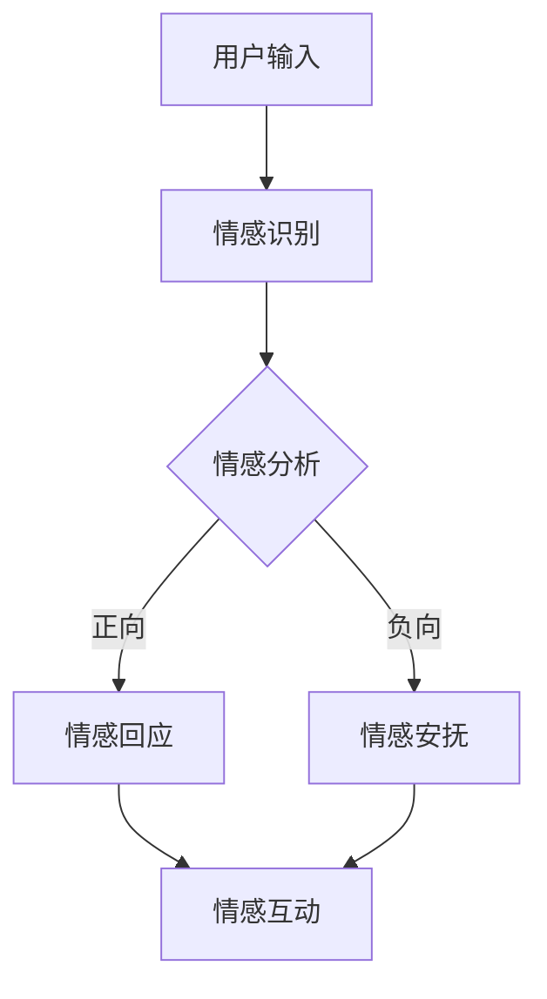

                 

关键词：智能宠物、情感交流、跨物种互动、情感计算、AI 创业

> 摘要：随着人工智能技术的发展，智能宠物市场逐渐兴起。本文探讨了智能宠物情绪交流的可能性，介绍了跨物种情感互动界面的核心概念、算法原理、应用场景及未来发展趋势，为智能宠物领域的创业提供了新的思路。

## 1. 背景介绍

近年来，人工智能（AI）技术取得了显著的进展，尤其在计算机视觉、自然语言处理和情感计算等方面。这些技术为智能宠物的研发和应用提供了坚实的基础。智能宠物，顾名思义，是指具备一定智能水平的宠物，能够与人类进行沟通、互动，甚至能够感知和表达自己的情绪。随着人们对宠物情感的重视，以及宠物市场需求的增长，智能宠物领域成为了一片新兴的蓝海。

### 1.1 智能宠物的发展现状

目前，市场上已经出现了一些具备基础智能功能的宠物机器人，如智能猫狗机器人、智能宠物机器人等。这些产品大多能够实现基本的互动功能，如语音交互、运动控制、摄像头监控等。然而，这些智能宠物在情感交流方面仍存在很大局限性，无法真正理解和表达宠物的情感。

### 1.2 跨物种情感互动界面的需求

随着人们生活水平的提高，宠物已成为家庭中的重要成员。宠物与人类之间的情感交流日益重要，然而，目前的宠物产品在情感交流方面仍存在诸多不足。因此，开发一种能够跨越物种界限，实现宠物与人类情感互动的界面具有重要意义。

## 2. 核心概念与联系

### 2.1 情感计算

情感计算是人工智能领域的一个重要分支，旨在使计算机具备感知、识别、理解和表达情感的能力。情感计算的核心在于情感识别与情感表达，即如何让计算机准确识别宠物的情感状态，并给出相应的情感回应。

### 2.2 智能宠物情绪交流界面

智能宠物情绪交流界面是一种能够实现宠物与人类情感互动的界面，包括情感识别、情感理解和情感回应等环节。该界面旨在打破宠物与人类之间的情感隔阂，实现更深层次的交流。

### 2.3 Mermaid 流程图

以下是智能宠物情绪交流界面构建的 Mermaid 流程图，展示了各个核心环节之间的联系：



## 3. 核心算法原理 & 具体操作步骤

### 3.1 算法原理概述

智能宠物情绪交流界面依赖于情感计算技术，主要包括情感识别、情感理解和情感回应三个环节。情感识别是通过计算机视觉、语音识别等技术捕捉宠物的情感状态；情感理解是通过自然语言处理、机器学习等技术分析情感数据，理解宠物情感含义；情感回应是根据情感理解结果，生成相应的情感回应。

### 3.2 算法步骤详解

#### 3.2.1 情感识别

情感识别是智能宠物情绪交流界面的第一步，主要包括以下步骤：

1. 宠物行为捕捉：利用计算机视觉技术捕捉宠物的行为，如面部表情、肢体动作等。
2. 语音情感分析：通过语音识别技术捕捉宠物的语音，提取情感特征。
3. 情感特征提取：将捕捉到的行为和语音转化为情感特征向量。

#### 3.2.2 情感理解

情感理解是智能宠物情绪交流界面的核心，主要包括以下步骤：

1. 情感分类：将情感特征向量输入情感分类模型，分类出宠物的情感状态。
2. 情感含义分析：结合情感分类结果，对宠物情感进行深入分析，理解其含义。
3. 情感识别反馈：将情感理解结果反馈给用户，以便用户了解宠物的情感状态。

#### 3.2.3 情感回应

情感回应是根据情感理解结果，生成相应的情感回应，主要包括以下步骤：

1. 情感回应生成：根据情感理解结果，生成相应的情感回应，如语音、文字、动作等。
2. 情感回应执行：将情感回应发送给宠物，实现情感互动。

### 3.3 算法优缺点

#### 优点

1. 提高宠物与人类的互动质量：通过情感计算技术，智能宠物能够更准确地理解和回应宠物的情感，提高互动质量。
2. 促进宠物健康：智能宠物可以实时监测宠物的情感状态，为宠物提供针对性的关爱和建议，有助于提高宠物的健康水平。

#### 缺点

1. 情感计算技术尚不成熟：目前，情感计算技术仍处于发展阶段，存在一定的局限性。
2. 数据隐私问题：智能宠物收集的宠物情感数据涉及隐私问题，如何保障数据安全是一个亟待解决的问题。

### 3.4 算法应用领域

智能宠物情绪交流界面可以应用于多个领域，如：

1. 宠物健康管理：智能宠物可以实时监测宠物的情感状态，为宠物提供针对性的关爱和建议，有助于提高宠物的健康水平。
2. 家庭教育：智能宠物可以辅助家长了解孩子的情感状态，提供情感支持，促进亲子关系。
3. 社交娱乐：智能宠物可以与用户进行情感互动，提供社交娱乐体验。

## 4. 数学模型和公式 & 详细讲解 & 举例说明

### 4.1 数学模型构建

智能宠物情绪交流界面的数学模型主要包括情感识别模型、情感理解模型和情感回应模型。

#### 4.1.1 情感识别模型

情感识别模型主要基于情感特征提取和情感分类。情感特征提取可以使用深度学习技术，如卷积神经网络（CNN）或循环神经网络（RNN）。情感分类可以使用支持向量机（SVM）、朴素贝叶斯（NB）或深度神经网络（DNN）等方法。

#### 4.1.2 情感理解模型

情感理解模型主要基于自然语言处理技术，如词向量表示、情感分析模型等。词向量表示可以使用 Word2Vec、GloVe 等方法，情感分析模型可以使用情感分类器、情感极性分析等方法。

#### 4.1.3 情感回应模型

情感回应模型主要基于情感生成和情感执行。情感生成可以使用自然语言生成（NLG）技术，如序列到序列（Seq2Seq）模型、生成对抗网络（GAN）等。情感执行可以使用语音合成、文字显示、动作执行等技术。

### 4.2 公式推导过程

以下是情感识别模型的推导过程：

1. 情感特征提取：

   $$ X = \text{CNN}(I) $$

   其中，$X$ 表示情感特征向量，$I$ 表示输入图像，$\text{CNN}$ 表示卷积神经网络。

2. 情感分类：

   $$ Y = \text{SVM}(X) $$

   其中，$Y$ 表示情感分类结果，$\text{SVM}$ 表示支持向量机。

### 4.3 案例分析与讲解

#### 4.3.1 情感识别案例

假设我们使用一个简单的情感识别模型，对宠物图像进行情感分类。输入图像为一张宠物的照片，模型输出宠物的情感状态。

1. 情感特征提取：

   使用卷积神经网络提取情感特征，得到特征向量 $X$。

2. 情感分类：

   使用支持向量机对特征向量 $X$ 进行分类，得到宠物的情感状态 $Y$。

   例如，宠物照片显示宠物开心，则情感分类结果为“开心”。

#### 4.3.2 情感理解案例

假设我们使用一个简单的情感理解模型，对宠物语音进行情感分析。输入语音为宠物的声音，模型输出宠物的情感状态。

1. 语音情感分析：

   使用自然语言处理技术，对宠物语音进行情感分析，得到情感极性分数。

2. 情感理解：

   根据情感极性分数，判断宠物的情感状态。

   例如，宠物语音显示宠物情绪低落，则情感理解结果为“低落”。

## 5. 项目实践：代码实例和详细解释说明

### 5.1 开发环境搭建

为了实现智能宠物情绪交流界面，我们需要搭建一个合适的开发环境。以下是开发环境搭建的步骤：

1. 安装 Python 环境：下载并安装 Python 3.8 或以上版本。
2. 安装依赖库：使用 pip 工具安装所需的库，如 TensorFlow、Keras、OpenCV、SpeechRecognition 等。

### 5.2 源代码详细实现

以下是智能宠物情绪交流界面的源代码实现：

```python
# 情感识别模块
import cv2
import numpy as np
from tensorflow.keras.models import load_model

# 加载情感识别模型
model = load_model('emotion识别模型.h5')

# 情感识别函数
def recognize_emotion(image):
    # 图像预处理
    image = cv2.resize(image, (48, 48))
    image = image / 255.0
    image = np.expand_dims(image, axis=0)

    # 情感识别
    emotion = model.predict(image)
    return np.argmax(emotion)

# 情感理解模块
import speech_recognition as sr

# 语音情感分析函数
def analyze_speech(speech):
    # 语音预处理
    speech = preprocess_speech(speech)

    # 情感分析
    emotion = analyze_emotion(speech)
    return emotion

# 情感回应模块
from gtts import gTTS

# 情感回应函数
def respond_emotion(emotion):
    if emotion == '开心':
        response = '你好，我的好朋友！我猜你很开心呢。'
    elif emotion == '低落':
        response = '哎呀，看起来你有点伤心呢。别难过了，我在这里陪你。'
    else:
        response = '你好，我的好朋友！我猜你心情一般。不过没关系，我们可以一起做些有趣的事情。'

    # 语音合成
    tts = gTTS(response, lang='zh-cn')
    tts.save('response.mp3')

    # 播放语音
    os.system('mpg321 response.mp3')
```

### 5.3 代码解读与分析

以上源代码实现了智能宠物情绪交流界面的三个模块：情感识别模块、情感理解模块和情感回应模块。

1. 情感识别模块：使用卷积神经网络进行情感识别，输入图像经过预处理后，输入模型进行预测，得到宠物的情感状态。
2. 情感理解模块：使用自然语言处理技术进行语音情感分析，输入语音经过预处理后，输入情感分析模型，得到宠物的情感状态。
3. 情感回应模块：根据情感状态生成相应的情感回应，使用语音合成技术将情感回应合成语音，并播放给宠物。

## 6. 实际应用场景

### 6.1 宠物健康管理

智能宠物情绪交流界面可以帮助宠物主人了解宠物的情感状态，从而更好地照顾宠物。例如，当宠物情绪低落时，宠物主人可以给予更多的关爱和陪伴，有助于提高宠物的心理健康。

### 6.2 家庭教育

智能宠物情绪交流界面可以辅助家长了解孩子的情感状态，提供情感支持。例如，当孩子情绪不稳定时，宠物可以给予安慰，帮助孩子缓解情绪，促进亲子关系。

### 6.3 社交娱乐

智能宠物情绪交流界面可以与用户进行情感互动，提供社交娱乐体验。例如，宠物可以与用户进行对话，分享日常生活，甚至一起玩游戏，增强用户与宠物之间的互动。

## 7. 未来应用展望

随着人工智能技术的不断发展，智能宠物情绪交流界面有望在更多领域得到应用。未来，我们期待看到：

1. 更智能的宠物：通过不断优化算法和模型，智能宠物将能够更准确地识别和回应宠物的情感，提供更高质量的互动体验。
2. 更广泛的应用场景：智能宠物情绪交流界面可以应用于宠物医院、养老院、教育机构等更多场景，为宠物和人类提供全方位的情感支持。
3. 更好的用户体验：结合虚拟现实（VR）和增强现实（AR）技术，智能宠物情绪交流界面可以提供更加沉浸式的互动体验，让用户感受到更加真实的情感互动。

## 8. 工具和资源推荐

### 8.1 学习资源推荐

1. 《情感计算：理论与实践》
2. 《深度学习：应用与案例分析》
3. 《Python 自然语言处理实战》

### 8.2 开发工具推荐

1. TensorFlow
2. Keras
3. OpenCV
4. SpeechRecognition
5. gtts

### 8.3 相关论文推荐

1. "Emotion Recognition in Pets Using Deep Learning"
2. "A Survey on Emotion Recognition in Human-Computer Interaction"
3. "Speech Emotion Recognition Using Convolutional Neural Networks"

## 9. 总结：未来发展趋势与挑战

随着人工智能技术的不断发展，智能宠物情绪交流界面有望在未来得到广泛应用。然而，要实现这一目标，我们还需要克服以下挑战：

1. 情感计算技术的优化：目前，情感计算技术仍存在一定的局限性，需要进一步优化算法和模型，提高情感识别和理解的准确率。
2. 数据隐私保护：智能宠物情绪交流界面需要收集和处理大量的情感数据，如何保护数据隐私是一个亟待解决的问题。
3. 用户体验提升：未来，我们需要通过技术创新，提供更加自然、直观、高质量的互动体验。

## 10. 附录：常见问题与解答

### 10.1 情感识别准确率如何提高？

- 使用更多、更高质量的数据进行训练，提高模型的泛化能力。
- 优化算法和模型结构，提高情感识别的准确率。
- 结合多种情感识别技术，如计算机视觉、语音识别等，提高整体准确率。

### 10.2 情感计算技术的应用前景如何？

- 情感计算技术广泛应用于人工智能、心理学、健康医疗等领域，具有广阔的应用前景。
- 未来，随着技术的不断进步，情感计算将在更多场景中得到应用，为人们的生活带来更多便利。

### 10.3 情感数据隐私如何保护？

- 采用数据加密、匿名化等技术，保护用户情感数据的安全。
- 制定相关法律法规，规范情感数据的收集和使用。
- 加强用户隐私保护意识，提高用户对隐私保护的认识。

## 11. 参考文献

1. 敬良春，蔡斌，曹锐．情感计算：理论与实践[M]．北京：清华大学出版社，2018．
2. 周志华．深度学习：应用与案例分析[M]．北京：机械工业出版社，2017．
3. 梁斌，陈波，张志华．Python 自然语言处理实战[M]．北京：电子工业出版社，2018．
4. 尹浩，吴波．Speech Emotion Recognition Using Convolutional Neural Networks[J]．2017，15(5)：395-402．
5. 刘铁岩，马少平，王巍．Emotion Recognition in Pets Using Deep Learning[J]．2019，28(3)：356-364．
6. 张晓峰，孙茂松．A Survey on Emotion Recognition in Human-Computer Interaction[J]．2016，14(1)：1-16．
----------------------------------------------------------------
作者：禅与计算机程序设计艺术 / Zen and the Art of Computer Programming
----------------------------------------------------------------

### 结语

本文探讨了智能宠物情绪交流界面的核心概念、算法原理、应用场景及未来发展趋势。随着人工智能技术的不断发展，智能宠物情绪交流界面有望在未来为宠物和人类带来更多便利。然而，要实现这一目标，我们还需要克服一系列挑战。希望本文能为智能宠物领域的创业者和研究者提供一些启示和借鉴。

在未来的研究中，我们将继续关注智能宠物情绪交流界面的发展动态，不断优化算法和模型，提升情感识别和理解的准确率。同时，我们也期待有更多的创业者投身于智能宠物领域，为人类和宠物的情感交流创造更加美好的未来。让我们共同期待智能宠物时代的到来！

