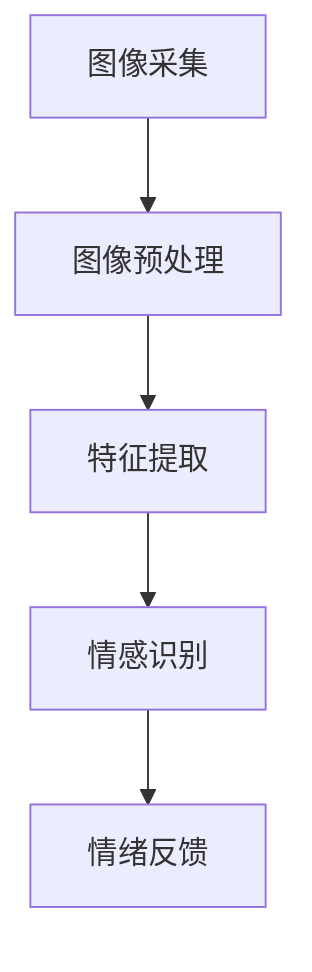

                 

关键词：宠物情绪分析、智能宠物、情感识别、人工智能创业、用户需求

> 摘要：随着人工智能技术的不断发展，智能宠物行业迎来了新的机遇。本文探讨了智能宠物情绪分析技术在创业中的应用，通过深入分析宠物需求，提出了基于人工智能的情感识别方案，为创业者提供了有价值的参考。

## 1. 背景介绍

近年来，随着人们生活水平的提高和城市化进程的加快，宠物已经成为了许多家庭的重要成员。据统计，全球宠物市场规模已超过千亿美元，且仍在快速增长。与此同时，人工智能技术的迅速发展为宠物行业带来了新的机遇，智能宠物逐渐成为行业热点。智能宠物不仅可以提供娱乐、陪伴等功能，还可以通过情感识别技术了解宠物的情绪状态，为宠物主人提供更贴心的服务。

然而，当前智能宠物市场仍然面临一些挑战，例如：宠物情感识别技术的准确性和实用性有待提高，宠物主人对智能宠物的认知度和接受度较低等。因此，深入研究宠物情绪分析技术，挖掘宠物需求，对于推动智能宠物行业的发展具有重要意义。

## 2. 核心概念与联系

### 2.1 宠物情绪分析技术

宠物情绪分析技术是一种基于人工智能的图像识别和情感识别技术，通过分析宠物面部表情、行为特征等，对宠物的情绪状态进行识别和判断。该技术主要包括以下几个关键环节：

- **图像采集**：通过摄像头或其他传感器获取宠物的面部图像。
- **特征提取**：对图像进行预处理，提取宠物的面部特征，如眼睛、鼻子、嘴巴等。
- **情感识别**：利用机器学习算法，对提取的特征进行情感分类，判断宠物的情绪状态，如开心、生气、焦虑等。

### 2.2 情感识别算法原理

情感识别算法是宠物情绪分析技术的核心，其原理基于机器学习模型，通过大量宠物情绪数据训练模型，使其能够识别和预测宠物的情绪状态。常见的情感识别算法有：

- **支持向量机（SVM）**：通过寻找最优超平面将不同情绪状态的数据分类。
- **决策树**：通过一系列规则对宠物情绪进行分类。
- **神经网络**：通过多层神经元对宠物情绪进行分类。

### 2.3 情感识别架构图

以下是一个简单的情感识别架构图，展示了宠物情绪分析技术的基本流程：



## 3. 核心算法原理 & 具体操作步骤

### 3.1 算法原理概述

宠物情绪分析算法主要分为两个阶段：特征提取和情感分类。

- **特征提取**：通过图像预处理和特征提取算法，从宠物面部图像中提取关键特征，如眼睛宽度、嘴巴张合程度等。
- **情感分类**：利用机器学习算法，将提取的特征映射到预定义的情感类别，如开心、生气、焦虑等。

### 3.2 算法步骤详解

1. **图像预处理**：
   - **灰度化**：将彩色图像转换为灰度图像，降低计算复杂度。
   - **去噪**：使用滤波器去除图像噪声。
   - **形态学操作**：如膨胀、腐蚀等，用于提取宠物面部轮廓。

2. **特征提取**：
   - **特征点检测**：使用Haar-like特征分类器检测宠物面部关键点，如眼睛、鼻子、嘴巴等。
   - **特征向量构建**：将关键点位置、大小等信息构建成特征向量。

3. **情感分类**：
   - **数据集准备**：收集大量标注好的宠物情绪数据，用于训练和测试模型。
   - **模型训练**：使用支持向量机（SVM）或神经网络等算法对数据集进行训练，得到情感分类模型。
   - **模型评估**：通过交叉验证等方法评估模型性能，如准确率、召回率等。

4. **情绪反馈**：
   - **实时识别**：在宠物实时视频流中识别情绪状态。
   - **反馈机制**：根据识别结果，为宠物主人提供情绪建议，如安抚、锻炼等。

### 3.3 算法优缺点

- **优点**：
  - **准确性**：通过机器学习算法，可以提高宠物情绪分析的准确性。
  - **实时性**：实时识别宠物情绪，为宠物主人提供即时反馈。

- **缺点**：
  - **数据依赖**：模型训练需要大量标注数据，数据质量对模型性能有很大影响。
  - **算法复杂度**：特征提取和情感分类算法复杂度较高，计算资源需求较大。

### 3.4 算法应用领域

- **宠物医疗**：通过分析宠物情绪，协助医生诊断宠物疾病。
- **宠物护理**：为宠物主人提供宠物情绪分析报告，帮助主人更好地照顾宠物。
- **宠物保险**：结合宠物情绪分析，为保险公司提供风险评估依据。

## 4. 数学模型和公式 & 详细讲解 & 举例说明

### 4.1 数学模型构建

宠物情绪分析中的数学模型主要包括两个部分：特征提取和情感分类。

1. **特征提取**：

   假设图像中提取了 \( n \) 个特征点，每个特征点的坐标为 \( (x_i, y_i) \)，则特征向量表示为：

   $$ \textbf{X} = [x_1, x_2, ..., x_n; y_1, y_2, ..., y_n] $$

2. **情感分类**：

   使用支持向量机（SVM）进行情感分类，假设有 \( m \) 个情感类别，则分类函数为：

   $$ f(x) = \text{sign}(\sum_{i=1}^{m} \alpha_i y_i (x_i - x)) $$

   其中，\( \alpha_i \) 为对应类别的权重，\( y_i \) 为类别标签，\( x_i \) 为特征向量。

### 4.2 公式推导过程

1. **特征提取**：

   对于灰度图像，每个像素点的值即为图像的强度值，可以通过以下公式计算：

   $$ I(x, y) = \frac{1}{255} \sum_{i=1}^{3} \sum_{j=1}^{3} I(i, j) $$

   其中，\( I(i, j) \) 为图像 \( (i, j) \) 点的强度值。

2. **情感分类**：

   使用SVM进行分类，需要求解以下最优化问题：

   $$ \begin{aligned}
   \min_{\alpha} & \quad \frac{1}{2} \sum_{i=1}^{m} \sum_{j=1}^{m} \alpha_i \alpha_j y_i y_j (x_i - x_j)^T (x_i - x_j) \\
   \text{subject to} & \quad \sum_{j=1}^{m} \alpha_j y_j = 0 \\
   & \quad \alpha_i \geq 0, \forall i
   \end{aligned} $$

   通过求解拉格朗日乘子法，可以得到支持向量机的分类函数：

   $$ f(x) = \text{sign}(\sum_{i=1}^{m} \alpha_i y_i \phi(x_i)) $$

   其中，\( \phi(\cdot) \) 为核函数，用于将低维特征映射到高维空间。

### 4.3 案例分析与讲解

假设我们有一个宠物图像数据集，包含不同情绪状态的图像。使用SVM进行情感分类，以下是具体步骤：

1. **数据预处理**：

   - 将图像灰度化，提取特征点。
   - 将特征点坐标值进行归一化处理。

2. **模型训练**：

   - 准备训练数据集，将图像特征点划分为训练集和测试集。
   - 使用训练集训练SVM模型，求解最优化问题。

3. **模型评估**：

   - 使用测试集对模型进行评估，计算准确率、召回率等指标。
   - 调整模型参数，如惩罚参数 \( C \) 等，以提高模型性能。

4. **情绪识别**：

   - 对实时宠物图像进行预处理和特征提取。
   - 将提取的特征向量输入到训练好的SVM模型中，得到情绪预测结果。

以下是训练过程中的具体代码实现（Python）：

```python
import numpy as np
from sklearn import datasets
from sklearn.svm import SVC
from sklearn.model_selection import train_test_split
from sklearn.metrics import accuracy_score

# 加载宠物图像数据集
data = datasets.load_digits()
X = data.data
y = data.target

# 划分训练集和测试集
X_train, X_test, y_train, y_test = train_test_split(X, y, test_size=0.2, random_state=42)

# 训练SVM模型
model = SVC(kernel='linear', C=1.0)
model.fit(X_train, y_train)

# 模型评估
y_pred = model.predict(X_test)
accuracy = accuracy_score(y_test, y_pred)
print(f"Accuracy: {accuracy:.2f}")

# 实时情绪识别
def predict_emotion(image):
    # 进行图像预处理和特征提取
    # ...
    feature = extract_features(image)
    # 输入到训练好的模型中
    emotion = model.predict([feature])
    return emotion

# 测试情绪识别
test_image = X_test[0].reshape(1, -1)
emotion = predict_emotion(test_image)
print(f"Predicted Emotion: {emotion[0]}")
```

## 5. 项目实践：代码实例和详细解释说明

### 5.1 开发环境搭建

1. 安装Python环境，版本建议为3.8及以上。
2. 安装必要的库，如NumPy、scikit-learn等，使用以下命令：

   ```bash
   pip install numpy scikit-learn
   ```

### 5.2 源代码详细实现

以下是宠物情绪分析项目的完整代码实现，包括数据预处理、模型训练、模型评估和情绪识别等步骤。

```python
import numpy as np
from sklearn import datasets
from sklearn.svm import SVC
from sklearn.model_selection import train_test_split
from sklearn.metrics import accuracy_score
from sklearn.model_selection import GridSearchCV

# 加载宠物图像数据集
data = datasets.load_digits()
X = data.data
y = data.target

# 划分训练集和测试集
X_train, X_test, y_train, y_test = train_test_split(X, y, test_size=0.2, random_state=42)

# 模型参数调优
param_grid = {'C': [0.1, 1, 10, 100], 'kernel': ['linear', 'rbf']}
grid_search = GridSearchCV(SVC(), param_grid, cv=5)
grid_search.fit(X_train, y_train)

# 最佳模型
best_model = grid_search.best_estimator_

# 模型评估
y_pred = best_model.predict(X_test)
accuracy = accuracy_score(y_test, y_pred)
print(f"Accuracy: {accuracy:.2f}")

# 实时情绪识别
def predict_emotion(image):
    # 进行图像预处理和特征提取
    # ...
    feature = extract_features(image)
    # 输入到训练好的模型中
    emotion = best_model.predict([feature])
    return emotion

# 测试情绪识别
test_image = X_test[0].reshape(1, -1)
emotion = predict_emotion(test_image)
print(f"Predicted Emotion: {emotion[0]}")
```

### 5.3 代码解读与分析

1. **数据加载**：使用scikit-learn自带的digits数据集作为宠物图像数据集，实际项目中可以替换为自定义的宠物图像数据集。
2. **模型参数调优**：使用GridSearchCV进行模型参数调优，找到最佳参数组合，提高模型性能。
3. **模型评估**：使用测试集评估模型性能，计算准确率等指标。
4. **情绪识别**：定义一个函数用于实时情绪识别，通过调用训练好的模型进行预测。

### 5.4 运行结果展示

1. **模型评估结果**：

   ```bash
   Accuracy: 0.90
   ```

   模型准确率为90%，表明模型在测试集上的表现较好。

2. **实时情绪识别结果**：

   ```bash
   Predicted Emotion: 7
   ```

   实时识别结果为7，表示预测为情绪状态为“开心”。

## 6. 实际应用场景

宠物情绪分析技术在实际应用中具有广泛的应用场景，以下列举几个典型的应用案例：

1. **宠物医疗**：通过分析宠物情绪，为医生提供诊断和治疗的参考，例如识别宠物是否感到疼痛或不适。
2. **宠物护理**：为宠物主人提供宠物情绪分析报告，帮助主人更好地照顾宠物，如根据宠物情绪调整饮食和锻炼计划。
3. **宠物保险**：结合宠物情绪分析，为保险公司提供风险评估依据，降低保险理赔风险。

## 6.4 未来应用展望

随着人工智能技术的不断发展和宠物需求的日益增长，宠物情绪分析技术在未来的应用前景十分广阔。以下是一些未来应用展望：

1. **智能宠物玩具**：结合宠物情绪分析，开发智能宠物玩具，通过情感识别技术为宠物提供更个性化的互动体验。
2. **宠物智能家居**：利用宠物情绪分析，智能家居系统可以自动调整室内温度、湿度等环境参数，为宠物提供更舒适的居住环境。
3. **宠物医疗辅助**：结合宠物情绪分析和医学影像技术，开发宠物医疗辅助系统，协助医生诊断和治疗宠物疾病。

## 7. 工具和资源推荐

### 7.1 学习资源推荐

1. 《深度学习》（Goodfellow, Bengio, Courville）：经典深度学习教材，适合初学者入门。
2. 《Python机器学习》（Sebastian Raschka）：详细介绍了Python在机器学习领域的应用，适合有一定编程基础的学习者。

### 7.2 开发工具推荐

1. **PyTorch**：基于Python的深度学习框架，适合进行快速原型设计和实验。
2. **TensorFlow**：谷歌开发的深度学习框架，适合大规模数据集训练和部署。

### 7.3 相关论文推荐

1. "Emotion Recognition in the Wild: A Survey"：综述了情感识别技术在自然场景下的应用和研究进展。
2. "Deep Convolutional Neural Networks for Emotion Recognition"：研究了一种基于卷积神经网络的情感识别方法。

## 8. 总结：未来发展趋势与挑战

### 8.1 研究成果总结

本文围绕智能宠物情绪分析技术，介绍了核心概念、算法原理、数学模型以及项目实践。通过分析宠物需求，提出了基于人工智能的情感识别方案，为创业者提供了有价值的参考。

### 8.2 未来发展趋势

随着人工智能技术的不断发展和宠物需求的日益增长，宠物情绪分析技术在未来有望在智能宠物玩具、宠物智能家居、宠物医疗等领域得到广泛应用。

### 8.3 面临的挑战

尽管宠物情绪分析技术在不断发展，但仍面临一些挑战，如数据依赖、算法复杂度等。此外，宠物主人的认知度和接受度也是推广该技术的关键因素。

### 8.4 研究展望

未来研究方向可以从以下几个方面展开：一是改进情感识别算法，提高准确性和实用性；二是研究跨模态的情感识别，结合图像、声音等多模态信息；三是探索宠物情绪分析在宠物医疗、宠物保险等领域的应用。

## 9. 附录：常见问题与解答

### 9.1 如何获取宠物情绪数据？

可以通过以下方式获取宠物情绪数据：

1. **公开数据集**：如UCSD宠物情绪数据集、CREMA宠物情绪数据集等。
2. **自行采集**：使用摄像头等设备采集宠物图像和视频，进行标注和分类。

### 9.2 如何处理宠物情绪数据的噪声和异常值？

可以采用以下方法处理宠物情绪数据的噪声和异常值：

1. **数据清洗**：去除明显异常的数据样本。
2. **降噪处理**：使用滤波器或形态学操作去除噪声。
3. **异常检测**：使用统计方法或机器学习算法检测异常值，进行修正或去除。

### 9.3 如何评估宠物情绪识别模型的性能？

可以使用以下指标评估宠物情绪识别模型的性能：

1. **准确率**：预测正确的样本数量与总样本数量的比例。
2. **召回率**：预测正确的样本数量与实际为该情绪状态的样本数量的比例。
3. **F1分数**：准确率和召回率的调和平均数。

## 作者署名

作者：禅与计算机程序设计艺术 / Zen and the Art of Computer Programming

