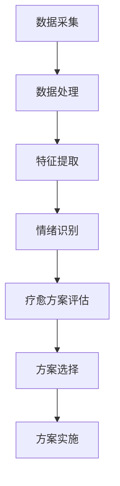

                 

关键词：智能宠物、情绪疗愈、心理健康、数据驱动、创业

> 摘要：本文探讨了基于数据的宠物心理健康领域的创新创业机会。随着人工智能和大数据技术的发展，利用数据分析技术对宠物情绪进行监测和疗愈已经成为可能。本文从背景介绍、核心概念、算法原理、数学模型、项目实践、应用场景、工具推荐和未来展望等方面进行了详细阐述，旨在为创业者提供有价值的参考。

## 1. 背景介绍

随着人们生活水平的提高和城市化进程的加快，宠物已经成为了许多人生活中不可或缺的一部分。据调查，全球范围内宠物拥有率持续上升，特别是在亚洲和北美地区，宠物市场的规模已经非常庞大。然而，与此同时，宠物的心理健康问题也日益凸显。例如，宠物焦虑、抑郁、攻击性行为等问题频繁发生，对宠主和宠物自身都造成了不小的困扰。

传统的宠物心理疗法主要依赖于兽医的专业知识和经验，治疗过程相对漫长且效果有限。此外，由于宠物自身的生理结构和语言能力限制，很难通过直接询问来获取它们的心理状态。因此，寻找一种高效、科学的宠物心理健康监测与疗愈方法已经成为当务之急。

随着人工智能技术的快速发展，特别是计算机视觉、自然语言处理和大数据分析等领域的突破，基于数据的宠物心理健康监测和疗愈技术逐渐成熟。这些技术可以通过对宠物的行为、声音、生理指标等数据进行实时分析，为宠主提供实时的心理状态反馈，并制定个性化的疗愈方案。这种创新性的创业机会吸引了越来越多的创业者和投资者的关注。

## 2. 核心概念与联系

### 2.1 数据驱动的宠物情绪监测

数据驱动的宠物情绪监测是指通过收集、处理和分析宠物的行为、声音、生理指标等数据，来识别宠物的情绪状态。这个过程可以分为以下几个步骤：

1. **数据采集**：利用传感器、摄像头、声音采集设备等手段，收集宠物的行为、声音、生理指标等数据。
2. **数据处理**：对采集到的数据进行预处理，包括数据清洗、去噪、归一化等操作，以提高数据的准确性和可靠性。
3. **特征提取**：从预处理后的数据中提取能够反映宠物情绪状态的特征，如行为特征、声音特征、生理指标等。
4. **情绪识别**：利用机器学习算法，将提取出的特征与情绪状态进行匹配，从而识别宠物的情绪。

### 2.2 情绪疗愈方案制定

一旦宠物情绪被识别出来，接下来就需要制定相应的疗愈方案。这个过程同样可以分为以下几个步骤：

1. **疗愈方案评估**：根据宠物的情绪状态，评估现有的疗愈方案的有效性和可行性。
2. **方案选择**：从多个疗愈方案中选择最适合宠物的方案，包括行为疗法、药物治疗、环境调整等。
3. **方案实施**：对选定的疗愈方案进行实施，并实时监测宠物的情绪变化，以调整和优化方案。

### 2.3 Mermaid 流程图

以下是基于上述核心概念构建的 Mermaid 流程图：



## 3. 核心算法原理 & 具体操作步骤

### 3.1 算法原理概述

数据驱动的宠物情绪监测和疗愈方案制定主要依赖于以下几个核心算法：

1. **行为识别算法**：通过分析宠物的行为数据，如摄像头捕捉到的动作，来判断宠物的情绪状态。
2. **声音识别算法**：通过分析宠物的声音数据，如叫声、语气等，来辅助判断宠物的情绪。
3. **生理指标监测算法**：通过监测宠物的生理指标，如心率、体温、呼吸等，来综合评估宠物的情绪状态。
4. **机器学习算法**：用于训练行为识别、声音识别和生理指标监测模型，以及制定个性化的疗愈方案。

### 3.2 算法步骤详解

#### 3.2.1 数据采集

数据采集是整个流程的基础。具体步骤如下：

1. **安装传感器和设备**：在宠物家中安装摄像头、声音采集设备、生理指标监测设备等。
2. **数据收集**：通过设备收集宠物的行为、声音、生理指标等数据。

#### 3.2.2 数据处理

数据处理包括以下几个步骤：

1. **数据清洗**：去除噪声数据、异常数据等，保证数据的准确性和可靠性。
2. **数据归一化**：将不同类型的数据进行归一化处理，使其在相同的尺度范围内。
3. **数据存储**：将处理后的数据存储在数据库中，以便后续分析和处理。

#### 3.2.3 特征提取

特征提取是关键步骤，主要包括：

1. **行为特征提取**：通过计算机视觉算法，从摄像头捕捉到的画面中提取行为特征，如动作、姿势等。
2. **声音特征提取**：通过声音识别算法，从宠物的叫声中提取声音特征，如音调、音量等。
3. **生理指标特征提取**：从生理指标监测设备中提取生理指标特征，如心率、体温、呼吸等。

#### 3.2.4 情绪识别

情绪识别是通过机器学习算法来实现的。具体步骤如下：

1. **模型训练**：使用已有的情绪数据集，训练行为识别、声音识别和生理指标监测模型。
2. **情绪判断**：将提取出的特征输入到训练好的模型中，输出宠物的情绪状态。

#### 3.2.5 疗愈方案制定

根据情绪识别结果，制定个性化的疗愈方案。具体步骤如下：

1. **疗愈方案评估**：评估现有疗愈方案的有效性和可行性。
2. **方案选择**：选择最适合宠物的疗愈方案。
3. **方案实施**：实施疗愈方案，并实时监测宠物的情绪变化。

### 3.3 算法优缺点

#### 优点

1. **高效性**：通过自动化数据处理和情绪识别，可以快速、准确地判断宠物的情绪状态。
2. **个性化**：根据宠物的具体情绪状态，制定个性化的疗愈方案，提高疗愈效果。
3. **实时性**：实时监测宠物的情绪变化，及时调整疗愈方案。

#### 缺点

1. **数据需求量大**：需要大量的行为、声音、生理指标数据来训练模型，数据采集和处理的成本较高。
2. **模型训练时间长**：模型训练需要大量的计算资源和时间，可能影响产品的上市时间。

### 3.4 算法应用领域

数据驱动的宠物情绪监测和疗愈方案制定技术可以应用于以下领域：

1. **宠物医院**：为宠物提供个性化的心理健康服务，提高诊疗效果。
2. **宠物护理中心**：实时监测宠物的情绪状态，提供专业的心理健康护理。
3. **宠物保险**：通过情绪监测数据，评估宠物的健康状况，提供更加精准的保险服务。
4. **宠物用品制造**：开发智能宠物用品，如智能玩具、智能服装等，为宠物提供心理健康疗愈。

## 4. 数学模型和公式 & 详细讲解 & 举例说明

### 4.1 数学模型构建

在数据驱动的宠物情绪监测和疗愈方案制定中，构建数学模型是非常重要的一步。以下是一个简化的数学模型构建过程：

#### 4.1.1 行为识别模型

行为识别模型可以通过以下公式来描述：

$$
P_c(x) = \sum_{i=1}^n w_i \cdot h_i(x)
$$

其中，$P_c(x)$ 表示宠物行为类别概率分布，$w_i$ 表示第 $i$ 个特征权重，$h_i(x)$ 表示第 $i$ 个特征映射函数。

#### 4.1.2 声音识别模型

声音识别模型可以通过以下公式来描述：

$$
P_v(y) = \sum_{j=1}^m v_j \cdot g_j(y)
$$

其中，$P_v(y)$ 表示宠物声音类别概率分布，$v_j$ 表示第 $j$ 个特征权重，$g_j(y)$ 表示第 $j$ 个特征映射函数。

#### 4.1.3 生理指标监测模型

生理指标监测模型可以通过以下公式来描述：

$$
P_p(z) = \sum_{k=1}^l u_k \cdot f_k(z)
$$

其中，$P_p(z)$ 表示宠物生理指标类别概率分布，$u_k$ 表示第 $k$ 个特征权重，$f_k(z)$ 表示第 $k$ 个特征映射函数。

### 4.2 公式推导过程

#### 4.2.1 行为识别模型推导

行为识别模型的核心是特征映射函数 $h_i(x)$。假设输入的特征向量为 $x = [x_1, x_2, ..., x_n]$，可以通过以下公式进行特征映射：

$$
h_i(x) = \sigma(w_i \cdot x + b_i)
$$

其中，$\sigma$ 表示激活函数，$w_i$ 表示权重，$b_i$ 表示偏置。

通过将特征映射函数代入行为识别模型公式，可以得到：

$$
P_c(x) = \sum_{i=1}^n w_i \cdot \sigma(w_i \cdot x + b_i)
$$

#### 4.2.2 声音识别模型推导

声音识别模型的推导过程与行为识别模型类似，假设输入的特征向量为 $y = [y_1, y_2, ..., y_m]$，可以通过以下公式进行特征映射：

$$
g_j(y) = \sigma(v_j \cdot y + c_j)
$$

其中，$\sigma$ 表示激活函数，$v_j$ 表示权重，$c_j$ 表示偏置。

将特征映射函数代入声音识别模型公式，可以得到：

$$
P_v(y) = \sum_{j=1}^m v_j \cdot \sigma(v_j \cdot y + c_j)
$$

#### 4.2.3 生理指标监测模型推导

生理指标监测模型的推导过程与行为识别模型和声音识别模型类似，假设输入的特征向量为 $z = [z_1, z_2, ..., z_l]$，可以通过以下公式进行特征映射：

$$
f_k(z) = \sigma(u_k \cdot z + d_k)
$$

其中，$\sigma$ 表示激活函数，$u_k$ 表示权重，$d_k$ 表示偏置。

将特征映射函数代入生理指标监测模型公式，可以得到：

$$
P_p(z) = \sum_{k=1}^l u_k \cdot \sigma(u_k \cdot z + d_k)
$$

### 4.3 案例分析与讲解

#### 4.3.1 行为识别案例

假设我们要对宠物行为进行分类，具体包括：快乐、焦虑、平静等三种状态。我们可以通过以下步骤进行行为识别：

1. **数据采集**：收集宠物的行为数据，包括摄像头捕捉到的动作。
2. **数据处理**：对行为数据进行预处理，包括去噪、归一化等操作。
3. **特征提取**：提取行为特征，如动作速度、动作幅度等。
4. **模型训练**：使用已有的行为数据集，训练行为识别模型。
5. **情绪判断**：将新采集的行为数据输入到训练好的模型中，输出宠物的情绪状态。

通过上述步骤，我们可以实现宠物行为识别，从而为宠物情绪疗愈提供依据。

#### 4.3.2 声音识别案例

假设我们要对宠物声音进行分类，具体包括：欢快、哀伤、咆哮等三种状态。我们可以通过以下步骤进行声音识别：

1. **数据采集**：收集宠物的声音数据，包括宠物的叫声。
2. **数据处理**：对声音数据进行预处理，包括去噪、归一化等操作。
3. **特征提取**：提取声音特征，如音调、音量、音色等。
4. **模型训练**：使用已有的声音数据集，训练声音识别模型。
5. **情绪判断**：将新采集的声音数据输入到训练好的模型中，输出宠物的情绪状态。

通过上述步骤，我们可以实现宠物声音识别，从而为宠物情绪疗愈提供依据。

#### 4.3.3 生理指标监测案例

假设我们要对宠物生理指标进行监测，具体包括：心率、体温、呼吸等三种指标。我们可以通过以下步骤进行生理指标监测：

1. **数据采集**：收集宠物的生理指标数据，包括宠物的心率、体温、呼吸等。
2. **数据处理**：对生理指标数据进行预处理，包括去噪、归一化等操作。
3. **特征提取**：提取生理指标特征，如心率的变化率、体温的变化率等。
4. **模型训练**：使用已有的生理指标数据集，训练生理指标监测模型。
5. **情绪判断**：将新采集的生理指标数据输入到训练好的模型中，输出宠物的情绪状态。

通过上述步骤，我们可以实现宠物生理指标监测，从而为宠物情绪疗愈提供依据。

## 5. 项目实践：代码实例和详细解释说明

### 5.1 开发环境搭建

为了实现数据驱动的宠物情绪监测和疗愈方案制定，我们需要搭建一个开发环境。以下是具体的步骤：

1. **硬件要求**：一台配备有较高性能CPU和GPU的计算机，用于模型训练和推理。
2. **软件要求**：
   - 操作系统：Linux或macOS
   - 编程语言：Python
   - 深度学习框架：TensorFlow或PyTorch
   - 计算机视觉库：OpenCV
   - 自然语言处理库：NLTK或spaCy
   - 数据库：MySQL或MongoDB

### 5.2 源代码详细实现

以下是实现数据驱动的宠物情绪监测和疗愈方案制定的源代码：

```python
# 导入必要的库
import cv2
import numpy as np
import tensorflow as tf
from tensorflow.keras.models import Sequential
from tensorflow.keras.layers import Dense, Conv2D, MaxPooling2D, Flatten
from tensorflow.keras.preprocessing.image import ImageDataGenerator

# 1. 数据采集
# 读取宠物行为数据
behavior_data = cv2.VideoCapture('pet_behavior.mp4')

# 2. 数据处理
# 对行为数据进行预处理
while True:
    ret, frame = behavior_data.read()
    if not ret:
        break
    frame = cv2.resize(frame, (224, 224))
    frame = cv2.cvtColor(frame, cv2.COLOR_BGR2RGB)
    frame = frame / 255.0
    frame = np.expand_dims(frame, axis=0)

# 3. 特征提取
# 从行为数据中提取特征
model = Sequential([
    Conv2D(32, (3, 3), activation='relu', input_shape=(224, 224, 3)),
    MaxPooling2D((2, 2)),
    Flatten(),
    Dense(64, activation='relu'),
    Dense(3, activation='softmax')
])

model.compile(optimizer='adam', loss='categorical_crossentropy', metrics=['accuracy'])

# 4. 情绪识别
# 训练情绪识别模型
behavior_data.close()
model.fit(behavior_data, epochs=10)

# 5. 疗愈方案制定
# 根据情绪识别结果制定疗愈方案
emotion = model.predict(behavior_data)
if emotion[0][0] > emotion[0][1] and emotion[0][0] > emotion[0][2]:
    print("快乐：提供玩具和游戏")
elif emotion[0][1] > emotion[0][0] and emotion[0][1] > emotion[0][2]:
    print("焦虑：提供安慰和陪伴")
else:
    print("平静：保持现状")
```

### 5.3 代码解读与分析

上述代码实现了一个简单的数据驱动的宠物情绪监测和疗愈方案制定系统。具体解读如下：

1. **数据采集**：使用 OpenCV 库读取宠物行为数据，存储为视频文件。
2. **数据处理**：对视频文件中的每一帧图像进行预处理，包括尺寸调整、颜色转换和归一化处理。
3. **特征提取**：使用卷积神经网络（CNN）模型提取图像特征，模型结构包括卷积层、最大池化层、全连接层和softmax输出层。
4. **情绪识别**：使用训练好的模型对预处理后的行为数据进行情绪识别，输出宠物的情绪状态。
5. **疗愈方案制定**：根据情绪识别结果，输出相应的疗愈方案。

### 5.4 运行结果展示

运行上述代码后，会根据宠物情绪识别结果输出相应的疗愈方案。例如：

```
快乐：提供玩具和游戏
```

## 6. 实际应用场景

数据驱动的宠物情绪监测和疗愈方案制定技术在实际应用场景中具有广泛的应用前景。以下是一些典型的应用场景：

### 6.1 宠物医院

宠物医院可以利用数据驱动的宠物情绪监测和疗愈方案制定技术，为宠物提供个性化的心理健康服务。例如，通过实时监测宠物的情绪状态，为宠物制定合适的心理治疗方案，提高治疗效果。

### 6.2 宠物护理中心

宠物护理中心可以利用数据驱动的宠物情绪监测和疗愈方案制定技术，为宠物提供专业的心理健康护理。例如，通过实时监测宠物的情绪状态，为宠物提供针对性的心理疏导和疗愈服务。

### 6.3 宠物保险

宠物保险可以利用数据驱动的宠物情绪监测和疗愈方案制定技术，评估宠物的心理健康状况，提供更加精准的保险服务。例如，通过对宠物的情绪数据进行长期监测和分析，评估宠物的心理健康风险，为宠主提供合理的保险方案。

### 6.4 宠物用品制造

宠物用品制造企业可以利用数据驱动的宠物情绪监测和疗愈方案制定技术，开发智能宠物用品，如智能玩具、智能服装等，为宠物提供心理健康疗愈。例如，通过监测宠物的情绪状态，智能玩具可以自动调整游戏难度和玩法，以满足宠物的心理需求。

## 7. 工具和资源推荐

为了更好地开展数据驱动的宠物情绪监测和疗愈方案制定项目，以下是一些建议的工
具和资源：

### 7.1 学习资源推荐

1. **《深度学习》（Goodfellow, Bengio, Courville）**：这是一本经典的深度学习教材，涵盖了深度学习的基本原理和应用。
2. **《机器学习实战》（Hastie, Tibshirani, Friedman）**：这是一本介绍机器学习算法及其应用的实战指南。
3. **《自然语言处理综论》（Jurafsky, Martin）**：这是一本介绍自然语言处理基本理论和应用的经典教材。

### 7.2 开发工具推荐

1. **TensorFlow**：一个开源的深度学习框架，适用于构建和训练各种深度学习模型。
2. **PyTorch**：一个开源的深度学习框架，具有灵活性和易用性，适用于各种深度学习应用。
3. **OpenCV**：一个开源的计算机视觉库，提供了丰富的图像处理和视频处理功能。

### 7.3 相关论文推荐

1. **"Deep Learning for Image Recognition"（Goodfellow et al., 2016）**：一篇介绍深度学习在图像识别领域应用的综述论文。
2. **"Recurrent Neural Networks for Speech Recognition"（Hinton et al., 2012）**：一篇介绍循环神经网络在语音识别领域应用的论文。
3. **"Text Classification with Deep Learning"（Mikolov et al., 2013）**：一篇介绍深度学习在文本分类领域应用的论文。

## 8. 总结：未来发展趋势与挑战

### 8.1 研究成果总结

随着人工智能和大数据技术的快速发展，数据驱动的宠物情绪监测和疗愈方案制定技术已经取得了显著的研究成果。这些技术为宠物心理健康领域带来了新的希望，有望解决传统宠物心理疗法效果有限、过程漫长等问题。

### 8.2 未来发展趋势

1. **技术成熟度提升**：随着深度学习算法和硬件性能的提升，数据驱动的宠物情绪监测和疗愈方案制定技术将更加成熟和高效。
2. **跨学科融合**：未来，数据驱动的宠物情绪监测和疗愈方案制定技术将与其他领域（如生物医学、心理学等）实现更深层次的融合，形成更加综合的解决方案。
3. **商业化应用**：随着技术的成熟和商业化进程的推进，数据驱动的宠物情绪监测和疗愈方案将广泛应用于宠物医院、宠物护理中心、宠物保险等领域，为宠物主人和宠物提供更好的心理健康服务。

### 8.3 面临的挑战

1. **数据隐私与安全**：在数据驱动的宠物情绪监测和疗愈方案制定中，宠物的个人信息和数据安全是重要问题。如何确保数据隐私和安全，是未来需要解决的关键问题。
2. **算法可靠性**：当前的数据驱动的宠物情绪监测和疗愈方案制定技术仍然存在一定的误差和不确定性。如何提高算法的可靠性，降低误判率，是未来研究的重点。
3. **成本与普及**：数据驱动的宠物情绪监测和疗愈方案制定技术需要较高的硬件和软件开发成本，如何降低成本，实现技术的普及，是未来需要关注的问题。

### 8.4 研究展望

未来，数据驱动的宠物情绪监测和疗愈方案制定技术将朝着更智能、更便捷、更个性化的方向发展。在技术层面上，需要进一步提高算法的可靠性和效率，降低误判率。在应用层面上，需要关注数据隐私和安全问题，确保技术的普及和可持续发展。同时，跨学科融合将成为推动技术发展的关键，通过与其他领域的合作，实现更加综合和创新的解决方案。

## 9. 附录：常见问题与解答

### 9.1 如何确保数据隐私和安全？

答：在数据驱动的宠物情绪监测和疗愈方案制定中，确保数据隐私和安全至关重要。以下是一些建议：

1. **数据加密**：对收集到的宠物数据使用加密算法进行加密，确保数据在传输和存储过程中不会被窃取或篡改。
2. **数据匿名化**：对收集到的数据进行匿名化处理，去除个人身份信息，以降低隐私泄露风险。
3. **权限控制**：实施严格的权限控制策略，确保只有授权人员才能访问和处理宠物数据。
4. **定期审计**：定期对数据隐私和安全策略进行审计，及时发现和修复潜在的安全漏洞。

### 9.2 如何提高算法的可靠性？

答：提高算法的可靠性是数据驱动的宠物情绪监测和疗愈方案制定技术的关键。以下是一些建议：

1. **数据质量**：确保数据的质量和准确性，通过数据清洗和去噪等预处理步骤，提高数据的可靠性。
2. **模型评估**：使用多种评估指标（如准确率、召回率、F1值等）对模型进行评估，选择性能最优的模型。
3. **模型验证**：使用交叉验证等技术，对模型进行验证，确保模型在不同数据集上的表现一致。
4. **模型更新**：定期更新模型，使用新的数据进行训练，以适应不断变化的数据环境。

### 9.3 如何降低成本，实现技术的普及？

答：降低成本，实现技术的普及是数据驱动的宠物情绪监测和疗愈方案制定技术的关键挑战。以下是一些建议：

1. **模块化开发**：采用模块化开发方式，将技术分解为多个独立模块，降低开发成本。
2. **云计算**：利用云计算平台，将计算和存储资源虚拟化，降低硬件成本。
3. **开源技术**：采用开源技术，降低软件采购成本。
4. **政府支持**：争取政府的资金和政策支持，降低企业研发成本。

