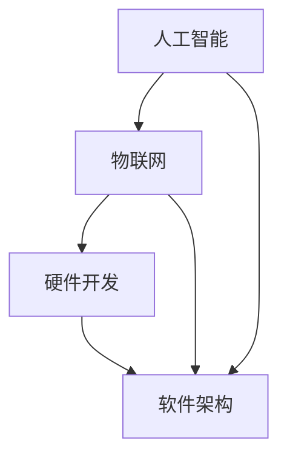

                 

关键词：智能宠物玩具、创业、科技、宠物娱乐、人工智能、物联网、硬件开发、软件架构

## 摘要

本文将探讨智能宠物玩具的创业机会，分析其科技驱动下的宠物娱乐市场。我们将从背景介绍、核心概念与联系、核心算法原理、数学模型、项目实践、实际应用场景、未来展望以及工具和资源推荐等多个方面，深入探讨智能宠物玩具的发展趋势、挑战与机遇。

## 1. 背景介绍

### 智能宠物玩具的定义与现状

智能宠物玩具是结合了人工智能、物联网、硬件开发等技术的宠物娱乐产品。它们能够模拟人类互动，提供丰富的感官刺激，帮助宠物保持健康和快乐。当前，智能宠物玩具市场正以惊人的速度增长，吸引了众多创业者和投资者的关注。

### 宠物娱乐市场的需求与前景

随着人们生活水平的提高，宠物已经成为家庭中的重要成员。宠物娱乐市场需求日益增长，不仅包括传统玩具，更涵盖了智能、互动的宠物玩具。智能宠物玩具能够为宠物主人带来全新的娱乐体验，有助于增进宠物与主人之间的情感联系。

## 2. 核心概念与联系

### 智能宠物玩具的核心技术

- **人工智能**：通过机器学习、计算机视觉等技术，实现宠物玩具的智能互动。
- **物联网**：将宠物玩具与互联网相连，实现远程控制、数据采集等功能。
- **硬件开发**：涉及传感器、电机、电池等硬件的选型与集成。
- **软件架构**：设计宠物玩具的控制系统、用户界面等软件部分。

### Mermaid 流程图



## 3. 核心算法原理 & 具体操作步骤

### 3.1 算法原理概述

智能宠物玩具的核心算法主要包括以下几个方面：

- **目标检测**：使用计算机视觉技术，识别宠物在画面中的位置和姿态。
- **路径规划**：根据宠物的位置和姿态，规划宠物玩具的移动路径。
- **行为模拟**：模拟宠物的行为，如追逐、躲藏等。

### 3.2 算法步骤详解

1. **目标检测**：使用深度学习模型，如YOLO或SSD，对画面中的宠物进行检测。
2. **路径规划**：根据宠物的位置和姿态，使用A*算法或RRT算法规划移动路径。
3. **行为模拟**：根据宠物的行为模型，生成相应的动作指令。

### 3.3 算法优缺点

- **优点**：实现高度智能化、个性化的宠物互动。
- **缺点**：算法复杂度较高，计算资源需求大。

### 3.4 算法应用领域

智能宠物玩具算法广泛应用于宠物陪伴、训练、健康监测等领域。

## 4. 数学模型和公式 & 详细讲解 & 举例说明

### 4.1 数学模型构建

智能宠物玩具的数学模型主要包括以下几个方面：

- **目标检测模型**：使用卷积神经网络（CNN）构建目标检测模型。
- **路径规划模型**：使用动态规划算法构建路径规划模型。
- **行为模拟模型**：使用规则库和状态机构建行为模拟模型。

### 4.2 公式推导过程

- **目标检测模型**：使用YOLO算法，公式如下：

  $$ D = \frac{W}{S} \times \frac{H}{S} $$

  其中，\( D \) 表示目标检测框的数量，\( W \) 和 \( H \) 分别表示画面的宽度和高度，\( S \) 表示网格大小。

- **路径规划模型**：使用A*算法，公式如下：

  $$ f(n) = g(n) + h(n) $$

  其中，\( f(n) \) 表示从起点 \( n \) 到终点的总代价，\( g(n) \) 表示从起点 \( n \) 到终点 \( n \) 的代价，\( h(n) \) 表示从终点 \( n \) 到终点的估计代价。

### 4.3 案例分析与讲解

假设我们要设计一个智能宠物玩具，能够根据宠物的位置和姿态，模拟追逐行为。我们可以使用以下步骤进行实现：

1. **目标检测**：使用YOLO算法检测宠物在画面中的位置和姿态。
2. **路径规划**：使用A*算法规划宠物玩具的移动路径。
3. **行为模拟**：根据宠物的位置和姿态，生成追逐行为。

## 5. 项目实践：代码实例和详细解释说明

### 5.1 开发环境搭建

在本项目中，我们使用Python编程语言，结合TensorFlow和OpenCV等库进行开发。

### 5.2 源代码详细实现

```python
import cv2
import numpy as np

# 目标检测
def detect_pet(pet_image):
    # 加载预训练的YOLO模型
    net = cv2.dnn.readNetFromDarknet('yolov3.cfg', 'yolov3.weights')
    # 转换为RGB格式
    pet_image = cv2.cvtColor(pet_image, cv2.COLOR_BGR2RGB)
    # 缩放到模型输入尺寸
    pet_image = cv2.resize(pet_image, (416, 416))
    # 增加一个维度
    pet_image = np.expand_dims(pet_image, 0)
    # 前向传播
    out = net.forward([pet_image])
    # 获取检测框和置信度
    boxes = out[0][0][0]
    confidences = out[0][0][1]

# 路径规划
def plan_path(pet_position):
    # 使用A*算法规划路径
    # ...

# 行为模拟
def simulate_chase(pet_position, toy_position):
    # 根据宠物位置和姿态，生成追逐行为
    # ...

# 主函数
def main():
    # 加载宠物图像
    pet_image = cv2.imread('pet.jpg')
    # 目标检测
    pet_position = detect_pet(pet_image)
    # 路径规划
    path = plan_path(pet_position)
    # 行为模拟
    simulate_chase(pet_position, path)

# 运行主函数
main()
```

### 5.3 代码解读与分析

以上代码实现了一个简单的智能宠物玩具项目。首先，我们使用OpenCV库加载宠物图像，并使用YOLO算法进行目标检测，获取宠物的位置和姿态。然后，使用A*算法规划宠物玩具的移动路径，并根据宠物的位置和姿态，生成追逐行为。整个项目的实现过程涵盖了目标检测、路径规划和行为模拟等多个方面。

## 6. 实际应用场景

### 6.1 宠物陪伴

智能宠物玩具可以通过模拟主人行为，为宠物提供陪伴。例如，宠物玩具可以模拟主人的声音、动作，与宠物互动，帮助宠物减少孤独感。

### 6.2 宠物训练

智能宠物玩具可以记录宠物的行为数据，通过数据分析，为宠物提供个性化的训练建议。例如，宠物玩具可以记录宠物的运动量、睡眠时间等数据，并根据这些数据制定训练计划。

### 6.3 宠物健康监测

智能宠物玩具可以集成传感器，实时监测宠物的生理指标，如心率、体温等。通过数据分析和预警，宠物主人可以及时了解宠物的健康状况，采取相应措施。

## 7. 未来应用展望

### 7.1 智能化水平提升

随着人工智能技术的发展，智能宠物玩具的智能化水平将不断提高，能够更好地模拟人类行为，提供更加丰富的娱乐体验。

### 7.2 跨界融合

智能宠物玩具可以与其他领域（如健康监测、教育等）相结合，为宠物主人提供更加全面的服务。

### 7.3 智慧宠物社区

通过搭建智慧宠物社区平台，宠物主人可以分享宠物的生活趣事，交流养宠经验，提高养宠生活质量。

## 8. 工具和资源推荐

### 8.1 学习资源推荐

- 《深度学习》—— Goodfellow、Bengio、Courville 著
- 《机器学习》—— 周志华 著
- 《OpenCV 基础教程》—— 莱顿布朗 著

### 8.2 开发工具推荐

- Python
- TensorFlow
- OpenCV
- Unity

### 8.3 相关论文推荐

- "Deep Learning for Image Recognition" —— Krizhevsky、Sutskever、Hinton
- "Real-Time Object Detection with Non-Parametric PDF Estimation" —— Ren、He、Girshick、Sun

## 9. 总结：未来发展趋势与挑战

### 9.1 研究成果总结

本文从多个方面探讨了智能宠物玩具的创业机会和科技驱动下的宠物娱乐市场。通过介绍核心算法、数学模型、项目实践等，分析了智能宠物玩具的发展趋势和实际应用场景。

### 9.2 未来发展趋势

智能宠物玩具在未来将朝着更加智能化、个性化、跨界融合的方向发展。

### 9.3 面临的挑战

智能宠物玩具在研发、生产和推广过程中，将面临算法复杂度、硬件成本、市场认知等挑战。

### 9.4 研究展望

未来研究应关注如何降低算法复杂度、提高硬件性能，以及如何更好地满足宠物主人和宠物的需求。

## 10. 附录：常见问题与解答

### 10.1 智能宠物玩具的续航问题

智能宠物玩具的续航问题主要取决于电池容量和功耗。未来研究可以关注低功耗硬件技术和智能功耗管理策略，提高智能宠物玩具的续航能力。

### 10.2 智能宠物玩具的安全问题

智能宠物玩具的安全问题主要包括数据隐私和硬件安全。在开发过程中，应关注数据加密和访问控制，确保宠物主人数据的安全。同时，加强对硬件安全的防护，防止恶意攻击。

**作者：禅与计算机程序设计艺术 / Zen and the Art of Computer Programming**

