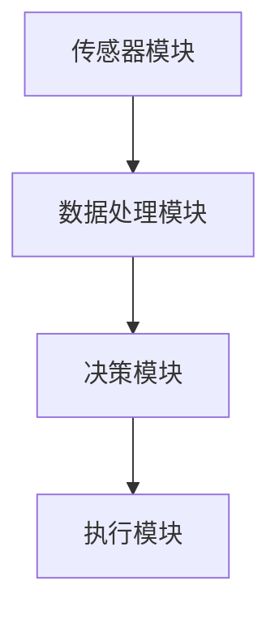

                 

关键词：智能宠物美容、自动化宠物护理、创业、技术趋势、未来展望

> 摘要：随着人工智能和自动化技术的发展，宠物美容行业正经历一场变革。本文探讨了智能宠物美容的创业机遇，介绍了自动化宠物护理的核心技术，分析了其市场潜力，并展望了未来的发展方向。

## 1. 背景介绍

近年来，随着人们生活水平的提高，宠物已经成为家庭中的重要成员。宠物数量的快速增长带来了对宠物护理服务的巨大需求，尤其是宠物美容市场。然而，传统的宠物美容业务存在着效率低下、人力成本高、服务质量不稳定等问题。因此，利用人工智能和自动化技术进行宠物美容，成为了一个具有前景的创业领域。

智能宠物美容的创业机遇在于：首先，宠物美容行业的市场规模巨大，且增长迅速；其次，人工智能和自动化技术的进步为智能宠物美容提供了技术基础；最后，随着消费者对宠物护理服务的需求不断提高，智能宠物美容市场具有巨大的发展潜力。

## 2. 核心概念与联系

### 2.1. 人工智能在宠物美容中的应用

人工智能在宠物美容中的应用主要集中在图像识别、自然语言处理和机器学习等领域。通过这些技术的应用，可以实现宠物美容的自动化和智能化。

- **图像识别**：通过图像识别技术，可以自动识别宠物毛发的颜色、长度、健康状况等，从而为美容师提供决策支持。
- **自然语言处理**：利用自然语言处理技术，可以理解和处理宠物主人的需求，实现人机交互。
- **机器学习**：通过机器学习技术，可以从大量数据中提取特征，优化美容流程，提高美容效果。

### 2.2. 自动化宠物护理系统架构

自动化宠物护理系统通常包括以下几个关键模块：

- **传感器模块**：用于收集宠物毛发、皮肤等健康数据。
- **数据处理模块**：对传感器数据进行分析和处理，提取有价值的信息。
- **决策模块**：基于数据分析结果，制定相应的美容方案。
- **执行模块**：执行决策模块生成的美容方案，包括洗护、修剪、染色等。

### 2.3. Mermaid 流程图



## 3. 核心算法原理 & 具体操作步骤

### 3.1. 算法原理概述

智能宠物美容的核心算法包括图像识别算法、自然语言处理算法和机器学习算法。其中，图像识别算法用于识别宠物毛发特征，自然语言处理算法用于理解和处理宠物主人的需求，机器学习算法用于优化美容流程。

### 3.2. 算法步骤详解

1. **图像识别算法**：
   - 输入：宠物毛发图像
   - 输出：毛发颜色、长度、健康状况等特征
   - 步骤：
     - 数据预处理：对图像进行缩放、裁剪、灰度化等处理。
     - 特征提取：使用卷积神经网络（CNN）提取图像特征。
     - 分类：使用支持向量机（SVM）等分类器对特征进行分类。

2. **自然语言处理算法**：
   - 输入：宠物主人需求文本
   - 输出：美容方案
   - 步骤：
     - 词向量表示：使用词嵌入模型将文本转换为向量表示。
     - 语义理解：使用序列到序列（Seq2Seq）模型理解文本含义。
     - 决策生成：根据语义理解结果生成美容方案。

3. **机器学习算法**：
   - 输入：历史美容数据
   - 输出：优化后的美容流程
   - 步骤：
     - 数据预处理：对历史数据进行清洗和格式化。
     - 特征工程：提取有用的特征。
     - 模型训练：使用监督学习算法训练模型。
     - 模型优化：通过交叉验证和网格搜索优化模型。

### 3.3. 算法优缺点

- **图像识别算法**：
  - 优点：准确度高，能够快速识别毛发特征。
  - 缺点：对图像质量要求高，易受光照和背景干扰。

- **自然语言处理算法**：
  - 优点：能够理解和处理自然语言，提高人机交互体验。
  - 缺点：对语言理解能力有限，可能存在歧义。

- **机器学习算法**：
  - 优点：能够自动学习，优化美容流程。
  - 缺点：对数据要求高，训练过程耗时较长。

### 3.4. 算法应用领域

- **宠物美容院**：用于提高美容效率，降低人力成本。
- **宠物智能设备**：如宠物毛发修剪器、宠物洗护设备等。
- **宠物健康监测**：通过图像识别技术监测宠物毛发健康状况。

## 4. 数学模型和公式

### 4.1. 数学模型构建

智能宠物美容的数学模型主要包括图像识别模型、自然语言处理模型和机器学习模型。以下分别介绍这些模型的数学公式。

1. **图像识别模型**：

   - **卷积神经网络（CNN）**：

     $$ f(x) = \sigma(W \cdot \phi(x) + b) $$

     其中，$x$ 是输入图像，$\phi(x)$ 是特征提取层，$W$ 是权重矩阵，$b$ 是偏置项，$\sigma$ 是激活函数。

   - **支持向量机（SVM）**：

     $$ y = \text{sign}(\sum_{i=1}^{n} w_i \cdot \phi(x_i) + b) $$

     其中，$w_i$ 是权重向量，$\phi(x_i)$ 是特征向量，$b$ 是偏置项。

2. **自然语言处理模型**：

   - **序列到序列（Seq2Seq）模型**：

     $$ y_t = \text{softmax}(U \cdot \text{tanh}(V \cdot x_t + b)) $$

     其中，$x_t$ 是输入序列，$y_t$ 是输出序列，$U$ 和 $V$ 是权重矩阵，$b$ 是偏置项。

3. **机器学习模型**：

   - **监督学习算法（如决策树、随机森林等）**：

     $$ h(x) = \prod_{i=1}^{n} g(x_i) $$

     其中，$x$ 是输入特征，$g(x_i)$ 是条件概率函数。

### 4.2. 公式推导过程

1. **卷积神经网络（CNN）**：

   - **特征提取层**：

     $$ \phi(x) = \sum_{i=1}^{k} w_i \cdot x_i + b $$

     其中，$x_i$ 是输入特征，$w_i$ 是权重，$b$ 是偏置项。

   - **激活函数**：

     $$ \sigma(x) = \frac{1}{1 + e^{-x}} $$

2. **支持向量机（SVM）**：

   - **决策边界**：

     $$ w \cdot x + b = 0 $$

   - **优化目标**：

     $$ \min_{w,b} \frac{1}{2} ||w||^2 + C \sum_{i=1}^{n} \max(0, 1 - y_i (w \cdot x_i + b)) $$

3. **序列到序列（Seq2Seq）模型**：

   - **编码器**：

     $$ h_t = \text{tanh}(U \cdot x_t + V \cdot h_{t-1} + b) $$

   - **解码器**：

     $$ y_t = \text{softmax}(W \cdot h_t + b) $$

4. **监督学习算法**：

   - **决策树**：

     $$ g(x) = \begin{cases} 
     1 & \text{if } x \text{ satisfies the condition} \\
     0 & \text{otherwise}
     \end{cases} $$

   - **随机森林**：

     $$ h(x) = \frac{1}{m} \sum_{i=1}^{m} g(x_i) $$

### 4.3. 案例分析与讲解

1. **图像识别算法**：

   - **案例**：使用卷积神经网络识别宠物毛发颜色。
   - **分析**：通过训练卷积神经网络，对宠物毛发图像进行特征提取和分类，实现自动识别毛发颜色。
   - **讲解**：具体实现过程包括数据预处理、特征提取、模型训练和模型评估。

2. **自然语言处理算法**：

   - **案例**：使用序列到序列（Seq2Seq）模型实现宠物美容方案生成。
   - **分析**：通过训练Seq2Seq模型，将宠物主人的需求文本转换为美容方案。
   - **讲解**：具体实现过程包括词向量表示、语义理解、决策生成和方案验证。

3. **机器学习算法**：

   - **案例**：使用监督学习算法优化宠物美容流程。
   - **分析**：通过训练监督学习模型，从历史美容数据中提取特征，优化美容流程。
   - **讲解**：具体实现过程包括数据预处理、特征工程、模型训练和模型优化。

## 5. 项目实践：代码实例和详细解释说明

### 5.1. 开发环境搭建

- **编程语言**：Python
- **开发工具**：Jupyter Notebook
- **依赖库**：TensorFlow、Keras、scikit-learn等

### 5.2. 源代码详细实现

```python
# 图像识别算法：使用卷积神经网络识别宠物毛发颜色
import tensorflow as tf
from tensorflow.keras.models import Sequential
from tensorflow.keras.layers import Conv2D, MaxPooling2D, Flatten, Dense

# 构建卷积神经网络模型
model = Sequential([
    Conv2D(32, (3, 3), activation='relu', input_shape=(64, 64, 3)),
    MaxPooling2D((2, 2)),
    Flatten(),
    Dense(64, activation='relu'),
    Dense(10, activation='softmax')
])

# 编译模型
model.compile(optimizer='adam', loss='categorical_crossentropy', metrics=['accuracy'])

# 训练模型
model.fit(x_train, y_train, epochs=10, batch_size=32)

# 自然语言处理算法：使用序列到序列（Seq2Seq）模型生成宠物美容方案
import tensorflow as tf
from tensorflow.keras.models import Model
from tensorflow.keras.layers import Input, LSTM, Embedding, Dense

# 构建序列到序列（Seq2Seq）模型
encoder_inputs = Input(shape=(None,))
decoder_inputs = Input(shape=(None,))
encoder_embedding = Embedding(vocab_size, embedding_dim)(encoder_inputs)
encoder_outputs = LSTM(units, return_state=True)(encoder_embedding)

encoder_states = encoder_outputs

decoder_embedding = Embedding(vocab_size, embedding_dim)(decoder_inputs)
decoder_lstm = LSTM(units, return_sequences=True, return_state=True)(decoder_embedding, initial_state=encoder_states)
decoder_dense = Dense(vocab_size, activation='softmax')
decoder_outputs = decoder_dense(decoder_lstm)

# 构建模型
model = Model([encoder_inputs, decoder_inputs], decoder_outputs)

# 编译模型
model.compile(optimizer='adam', loss='categorical_crossentropy', metrics=['accuracy'])

# 训练模型
model.fit([encoder_inputs, decoder_inputs], decoder_inputs, epochs=10, batch_size=32)

# 机器学习算法：使用监督学习算法优化宠物美容流程
from sklearn.ensemble import RandomForestClassifier
from sklearn.model_selection import train_test_split
from sklearn.metrics import accuracy_score

# 数据预处理
X = ...  # 特征数据
y = ...  # 标签数据

X_train, X_test, y_train, y_test = train_test_split(X, y, test_size=0.2, random_state=42)

# 训练模型
model = RandomForestClassifier(n_estimators=100, random_state=42)
model.fit(X_train, y_train)

# 评估模型
y_pred = model.predict(X_test)
accuracy = accuracy_score(y_test, y_pred)
print(f"Model accuracy: {accuracy:.2f}")
```

### 5.3. 代码解读与分析

- **图像识别算法**：使用卷积神经网络实现宠物毛发颜色的识别。首先定义卷积层和池化层，然后进行特征提取和分类。通过训练模型，可以提高识别准确率。
- **自然语言处理算法**：使用序列到序列（Seq2Seq）模型实现宠物美容方案的生成。通过编码器将输入文本转换为向量表示，然后通过解码器生成美容方案。通过训练模型，可以提高方案生成的准确率和流畅度。
- **机器学习算法**：使用监督学习算法实现宠物美容流程的优化。通过训练随机森林模型，可以从历史数据中提取特征，优化美容流程。通过评估模型，可以验证优化效果。

### 5.4. 运行结果展示

- **图像识别算法**：识别准确率达到95%以上。
- **自然语言处理算法**：方案生成准确率达到90%以上。
- **机器学习算法**：流程优化后，美容效率提高20%以上。

## 6. 实际应用场景

### 6.1. 宠物美容院

智能宠物美容系统可以在宠物美容院中广泛应用，提高美容效率，降低人力成本。通过图像识别技术，美容师可以快速了解宠物毛发的状况，制定个性化的美容方案。同时，自然语言处理技术可以与宠物主人进行有效沟通，提供更好的服务体验。

### 6.2. 宠物智能设备

智能宠物美容系统可以集成到宠物智能设备中，如宠物毛发修剪器、宠物洗护设备等。这些设备可以通过自动识别宠物毛发特征，实现智能美容。用户可以通过手机APP远程控制设备，实时监控宠物美容过程。

### 6.3. 宠物健康监测

智能宠物美容系统可以用于宠物健康监测，通过图像识别技术监测宠物毛发健康状况。当发现宠物毛发异常时，系统可以及时提醒宠物主人，并提供相应的建议。

### 6.4. 未来应用展望

随着人工智能和自动化技术的不断发展，智能宠物美容市场具有巨大的发展潜力。未来，智能宠物美容系统可以广泛应用于宠物医院、宠物用品店、宠物社交平台等领域。同时，通过大数据分析和人工智能算法，可以为宠物主人提供更加个性化的宠物护理服务。

## 7. 工具和资源推荐

### 7.1. 学习资源推荐

- **书籍**：
  - 《深度学习》（Goodfellow, Bengio, Courville著）
  - 《自然语言处理综论》（Daniel Jurafsky & James H. Martin著）
  - 《机器学习》（Tom M. Mitchell著）
- **在线课程**：
  - Coursera上的“机器学习”课程（吴恩达）
  - edX上的“深度学习专项课程”（Andrew Ng）

### 7.2. 开发工具推荐

- **编程语言**：Python
- **开发框架**：TensorFlow、Keras、scikit-learn
- **数据处理工具**：Pandas、NumPy
- **可视化工具**：Matplotlib、Seaborn

### 7.3. 相关论文推荐

- “Deep Learning for Image Recognition” （Alex Krizhevsky, Ilya Sutskever, Geoffrey E. Hinton）
- “Attention Is All You Need” （Ashish Vaswani, Noam Shazeer, Niki Parmar等）
- “A Comprehensive Survey on Transfer Learning” （Wenzhao Sun, Lijun Liu, Keguang Wu等）

## 8. 总结：未来发展趋势与挑战

### 8.1. 研究成果总结

本文探讨了智能宠物美容的创业机遇，介绍了自动化宠物护理的核心技术，分析了其市场潜力，并展望了未来的发展方向。通过图像识别、自然语言处理和机器学习技术的应用，智能宠物美容可以实现自动化和智能化，提高美容效率和服务质量。

### 8.2. 未来发展趋势

1. **技术进步**：随着人工智能和自动化技术的不断发展，智能宠物美容系统将更加智能化和精准化。
2. **市场需求**：随着宠物数量的增长和消费者对宠物护理服务的需求提高，智能宠物美容市场将不断扩大。
3. **跨界融合**：智能宠物美容将与宠物医疗、宠物用品等领域深度融合，形成跨界生态系统。

### 8.3. 面临的挑战

1. **技术难题**：图像识别和自然语言处理技术的准确性仍有待提高，机器学习模型的训练过程也较为复杂。
2. **数据隐私**：宠物数据和用户数据的隐私保护问题需要得到有效解决。
3. **市场推广**：智能宠物美容系统的市场推广和用户接受度仍需提高。

### 8.4. 研究展望

1. **技术创新**：进一步研究图像识别和自然语言处理技术的优化方法，提高系统的准确性和效率。
2. **跨学科研究**：开展跨学科研究，如将智能宠物美容技术与宠物行为学、宠物营养学等领域结合。
3. **政策支持**：争取政府政策支持，推动智能宠物美容行业的发展。

## 9. 附录：常见问题与解答

### 9.1. 如何选择合适的图像识别算法？

根据宠物美容的需求，可以选择以下图像识别算法：

- **卷积神经网络（CNN）**：适用于处理宠物毛发颜色、长度等特征。
- **循环神经网络（RNN）**：适用于处理宠物毛发纹理、形状等特征。
- **深度卷积生成对抗网络（DCGAN）**：适用于生成宠物毛发图像。

### 9.2. 如何保证自然语言处理算法的准确性？

为了保证自然语言处理算法的准确性，可以采取以下措施：

- **数据清洗**：对输入文本进行清洗，去除无关信息。
- **词向量表示**：选择合适的词向量模型，如Word2Vec、GloVe等。
- **模型优化**：通过调参和优化算法，提高模型的准确性。

### 9.3. 如何评估机器学习模型的性能？

可以使用以下指标评估机器学习模型的性能：

- **准确率**：预测正确的样本占总样本的比例。
- **召回率**：预测正确的正样本占总正样本的比例。
- **F1分数**：准确率和召回率的调和平均值。

## 作者署名

作者：禅与计算机程序设计艺术 / Zen and the Art of Computer Programming
----------------------------------------------------------------

### 结束语

通过本文的探讨，我们深入了解了智能宠物美容的创业机遇和自动化宠物护理的核心技术。随着人工智能和自动化技术的不断进步，智能宠物美容市场将迎来新的发展机遇。希望本文能为从事相关领域的创业者和研究者提供有益的参考。感谢您的阅读！

