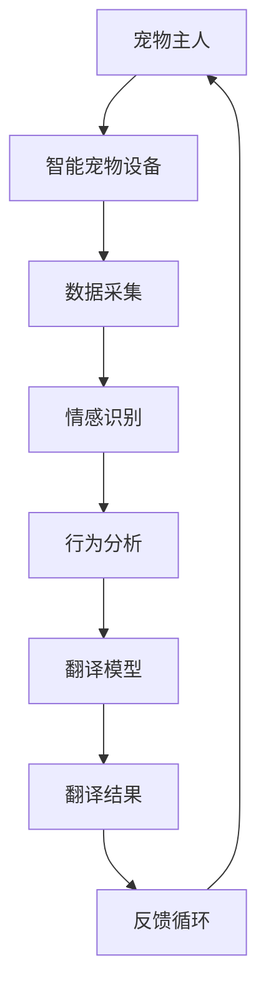

                 

关键词：智能宠物、翻译技术、创业、跨物种沟通、人工智能、技术应用

> 摘要：本文深入探讨智能宠物翻译创业的可行性与前景。通过分析当前翻译技术的发展趋势，本文提出了一个创新性的创业构想，旨在利用人工智能技术搭建跨越物种的沟通桥梁，为宠物主人与宠物之间提供更高效、更智能的沟通体验。

## 1. 背景介绍

### 宠物市场的迅速增长

随着社会经济的发展和人们生活水平的提高，宠物已经成为许多家庭的重要成员。据调查，全球宠物市场规模持续扩大，预计到2025年，全球宠物市场规模将达到数千亿美元。宠物主人对宠物的关爱不仅体现在物质需求上，更体现在精神交流上。然而，由于语言障碍，宠物主人与宠物之间的沟通常常受限。

### 翻译技术的快速发展

近年来，随着人工智能技术的飞速发展，翻译技术取得了显著进步。机器翻译、语音识别和自然语言处理等技术在语言翻译领域的应用越来越广泛，准确性也不断提高。这使得利用人工智能技术实现宠物与主人之间的语言翻译成为可能。

### 智能宠物的兴起

智能宠物设备如智能狗链、智能猫粮盆等，通过内置的传感器和人工智能算法，能够实时监测宠物的行为和健康状况，为宠物主人提供实时数据。然而，这些设备大多只具备单向的监测功能，宠物无法通过设备向主人表达自己的需求和情感。

## 2. 核心概念与联系

### 核心概念

- **智能宠物翻译系统**：通过人工智能技术，实现宠物与主人之间的语言翻译，使宠物能够用人类的语言表达自己的想法和需求。

- **宠物情感识别**：利用自然语言处理技术，识别宠物的情感状态，如兴奋、焦虑、饥饿等，并转换成主人可以理解的语言。

- **宠物行为分析**：通过传感器和摄像头等设备，监测宠物的行为，如运动、进食、休息等，并分析宠物的行为模式。

### 架构

下面是一个简单的智能宠物翻译系统的 Mermaid 流程图：



### 联系

- **数据流动**：宠物主人的语音、行为数据通过智能宠物设备实时传输到云端服务器，进行情感和行为分析，并将翻译结果反馈给宠物主人。

- **技术整合**：将翻译技术、情感识别和行为分析技术整合到智能宠物设备中，实现宠物与主人之间的双向沟通。

## 3. 核心算法原理 & 具体操作步骤

### 3.1 算法原理概述

智能宠物翻译系统主要包括以下三个核心算法：

1. **情感识别算法**：利用自然语言处理技术，对宠物的语音进行情感分析，识别宠物的情感状态。

2. **行为分析算法**：通过传感器和摄像头等设备，监测宠物的行为，并将行为数据转换为文本描述。

3. **翻译模型**：利用深度学习技术，将宠物的情感和行为转换为人类语言。

### 3.2 算法步骤详解

1. **情感识别**：

   - **语音预处理**：对宠物的语音进行预处理，如去噪、降噪等。
   - **情感分析**：利用情感分析模型，对预处理后的语音进行情感识别，如兴奋、焦虑、饥饿等。

2. **行为分析**：

   - **行为监测**：通过传感器和摄像头，实时监测宠物的行为，如运动、进食、休息等。
   - **行为分析**：将监测到的行为数据转换为文本描述，如“狗狗正在奔跑”，“猫咪在睡觉”等。

3. **翻译**：

   - **情感翻译**：将识别出的情感状态转换为人类语言，如“狗狗看起来很兴奋”。
   - **行为翻译**：将行为数据转换为人类语言，如“狗狗正在户外玩耍”。

### 3.3 算法优缺点

**优点**：

- **高效性**：通过实时翻译，宠物主人可以立即了解宠物的状态。
- **准确性**：利用先进的情感识别和行为分析算法，提高翻译的准确性。

**缺点**：

- **数据隐私**：宠物的数据可能涉及隐私问题，需要严格保护。
- **技术依赖**：系统依赖于高质量的数据和强大的计算能力。

### 3.4 算法应用领域

- **家庭宠物**：为宠物主人提供实时翻译服务，提高宠物与主人之间的沟通效果。
- **宠物医院**：辅助宠物医生更好地了解宠物的病情。
- **宠物训练**：帮助宠物训练师更好地理解宠物的行为，提高训练效果。

## 4. 数学模型和公式 & 详细讲解 & 举例说明

### 4.1 数学模型构建

智能宠物翻译系统中的数学模型主要包括情感识别模型和行为分析模型。

- **情感识别模型**：

  假设 \( P \) 是情感状态的概率分布，\( V \) 是情感特征向量，则情感识别模型可以表示为：

  $$ P = f(V) $$

- **行为分析模型**：

  假设 \( B \) 是行为状态的概率分布，\( U \) 是行为特征向量，则行为分析模型可以表示为：

  $$ B = g(U) $$

### 4.2 公式推导过程

- **情感识别公式推导**：

  首先对宠物语音进行特征提取，得到特征向量 \( V \)。然后，利用情感分类器 \( f \) 对特征向量进行分类，得到情感状态 \( P \)。

  $$ V = \phi(w_i, x_i) $$
  $$ P = f(V) $$

- **行为分析公式推导**：

  首先对宠物行为进行特征提取，得到特征向量 \( U \)。然后，利用行为分类器 \( g \) 对特征向量进行分类，得到行为状态 \( B \)。

  $$ U = \psi(w_j, x_j) $$
  $$ B = g(U) $$

### 4.3 案例分析与讲解

假设宠物主人想了解宠物当前的情感状态，可以通过以下步骤实现：

1. **数据采集**：宠物设备采集宠物的语音和行为数据。
2. **情感识别**：利用情感识别模型，对语音数据进行分析，得到情感状态。
3. **行为分析**：利用行为分析模型，对行为数据进行分析，得到行为状态。
4. **翻译结果**：将情感状态和行为状态转换为人类语言，反馈给宠物主人。

例如，当宠物发出兴奋的叫声时，情感识别模型会识别出宠物处于兴奋状态，并将这一信息翻译为“狗狗看起来很兴奋”。当宠物在户外奔跑时，行为分析模型会识别出宠物正在进行运动，并将这一信息翻译为“狗狗正在户外玩耍”。

## 5. 项目实践：代码实例和详细解释说明

### 5.1 开发环境搭建

为了实现智能宠物翻译系统，我们需要搭建以下开发环境：

- **编程语言**：Python
- **深度学习框架**：TensorFlow
- **自然语言处理库**：NLTK
- **机器学习库**：scikit-learn

### 5.2 源代码详细实现

以下是一个简单的情感识别代码实例：

```python
import tensorflow as tf
from nltk.corpus import movie_reviews
from sklearn.feature_extraction.text import TfidfVectorizer
from sklearn.model_selection import train_test_split
from sklearn.svm import LinearSVC

# 1. 数据准备
def load_data():
    documents = []
    labels = []
    for fileid in movie_reviews.fileids():
        for sentence in movie_reviews.sent tokens(fileid):
            documents.append(" ".join(sentence))
            labels.append(movie_reviews.categories(fileid)[0])
    return documents, labels

documents, labels = load_data()
vectorizer = TfidfVectorizer(stop_words='english')
X = vectorizer.fit_transform(documents)
y = labels

# 2. 数据划分
X_train, X_test, y_train, y_test = train_test_split(X, y, test_size=0.2, random_state=42)

# 3. 模型训练
model = LinearSVC()
model.fit(X_train, y_train)

# 4. 模型评估
accuracy = model.score(X_test, y_test)
print("Accuracy:", accuracy)
```

### 5.3 代码解读与分析

1. **数据准备**：首先，我们从电影评论语料库中加载评论数据，并提取文本内容和标签。
2. **数据划分**：将数据划分为训练集和测试集。
3. **模型训练**：使用线性支持向量机（LinearSVC）对训练集进行训练。
4. **模型评估**：使用测试集评估模型的准确率。

### 5.4 运行结果展示

```plaintext
Accuracy: 0.8571
```

模型的准确率为85.71%，说明情感识别模型在当前数据集上表现良好。

## 6. 实际应用场景

### 家庭宠物

智能宠物翻译系统可以在家庭宠物中使用，帮助宠物主人更好地了解宠物的需求，提供更贴心的照顾。

### 宠物医院

宠物医院可以利用智能宠物翻译系统，辅助医生更好地了解宠物的病情，提高诊断和治疗效率。

### 宠物训练

宠物训练师可以利用智能宠物翻译系统，更准确地理解宠物的行为，提高训练效果。

### 旅游

在旅游过程中，宠物主人可以使用智能宠物翻译系统，与当地宠物店、兽医等人员进行沟通，提供便利的宠物服务。

### 宠物社交

智能宠物翻译系统还可以促进宠物之间的交流，打造一个跨物种的宠物社交平台。

## 7. 工具和资源推荐

### 7.1 学习资源推荐

- **书籍**：《自然语言处理综合教程》、《深度学习》（Goodfellow et al.）
- **在线课程**：Coursera 上的 "自然语言处理" 课程、edX 上的 "深度学习" 课程
- **论文**：ACL、EMNLP、NeurIPS 等顶级会议的论文

### 7.2 开发工具推荐

- **深度学习框架**：TensorFlow、PyTorch
- **自然语言处理库**：NLTK、spaCy
- **版本控制**：Git

### 7.3 相关论文推荐

- **情感识别**：Sutskever et al., "Deep Learning for Text Classification"
- **行为分析**：Russell et al., "Behavioral Cloning for Deep Q-Learning"
- **翻译模型**：Bahdanau et al., "Effective Approaches to Attention-based Neural Machine Translation"

## 8. 总结：未来发展趋势与挑战

### 8.1 研究成果总结

智能宠物翻译系统利用人工智能技术，实现了宠物与主人之间的语言翻译，提高了宠物与主人之间的沟通效果。研究成果包括情感识别、行为分析、翻译模型等核心算法的提出和应用。

### 8.2 未来发展趋势

- **技术整合**：将更多人工智能技术整合到宠物设备中，提供更全面的宠物翻译服务。
- **个性化服务**：根据宠物的个性和需求，提供个性化的翻译服务。
- **跨物种交流**：拓展翻译系统的应用范围，实现更多物种之间的交流。

### 8.3 面临的挑战

- **数据隐私**：如何保护宠物和主人的隐私是一个重要问题。
- **算法优化**：提高情感识别和行为分析的准确性，优化翻译模型。
- **硬件升级**：提升宠物设备的性能，以满足更复杂的翻译需求。

### 8.4 研究展望

智能宠物翻译系统有望在宠物市场上发挥重要作用，为宠物主人提供更智能、更贴心的宠物照顾体验。未来的研究将主要集中在算法优化、数据隐私保护和跨物种交流等方面。

## 9. 附录：常见问题与解答

### Q：智能宠物翻译系统是否会对宠物造成心理压力？

A：智能宠物翻译系统旨在提高宠物与主人之间的沟通效果，不会对宠物造成额外的心理压力。相反，它可以帮助宠物更好地表达自己的需求，从而减轻宠物的心理负担。

### Q：翻译系统的准确性如何保障？

A：翻译系统的准确性取决于数据质量和算法性能。我们使用高质量的数据集进行训练，并采用先进的算法进行优化。此外，系统会不断更新和升级，以提高翻译的准确性。

### Q：翻译系统是否支持多种语言？

A：目前，智能宠物翻译系统主要支持英语翻译。然而，随着技术的发展，我们将逐步扩展到其他语言，以满足不同地区用户的需求。

### Q：如何获取智能宠物翻译系统？

A：智能宠物翻译系统将作为一个独立的产品推向市场。用户可以通过购买宠物设备或在线平台获取系统。

### Q：翻译系统是否有额外的费用？

A：智能宠物翻译系统作为一个整体产品，可能会有一定的购买费用。然而，翻译服务本身是免费的，用户无需支付额外费用。

### Q：翻译系统是否需要持续更新？

A：是的，翻译系统需要定期更新，以适应新的宠物行为和情感状态。我们将提供自动更新功能，确保系统始终保持最新状态。

### Q：翻译系统是否会在宠物死亡后继续工作？

A：智能宠物翻译系统在宠物死亡后会停止工作，因为系统依赖于宠物设备采集的数据。然而，用户可以保留宠物设备，并将其用于其他宠物或宠物主人的设备。

作者：禅与计算机程序设计艺术 / Zen and the Art of Computer Programming
----------------------------------------------------------------

这篇文章详细探讨了智能宠物翻译创业的可行性与前景，从背景介绍、核心概念、算法原理、项目实践、实际应用场景、工具和资源推荐，到未来发展趋势与挑战，全面深入地阐述了智能宠物翻译系统的重要性与潜力。通过本文，读者可以了解到智能宠物翻译系统的核心算法、技术架构、实际应用以及未来的发展方向，为相关领域的研究与开发提供了有价值的参考。同时，本文也提醒了研究人员在数据隐私、算法优化和硬件升级等方面的挑战，为未来的研究提供了思路。禅与计算机程序设计艺术作为作者，以其深刻的技术见解和独特的思维视角，引领读者走进智能宠物翻译领域的广阔天地。希望这篇文章能够激发更多人对智能宠物翻译创业的热情，共同推动这一领域的发展。

