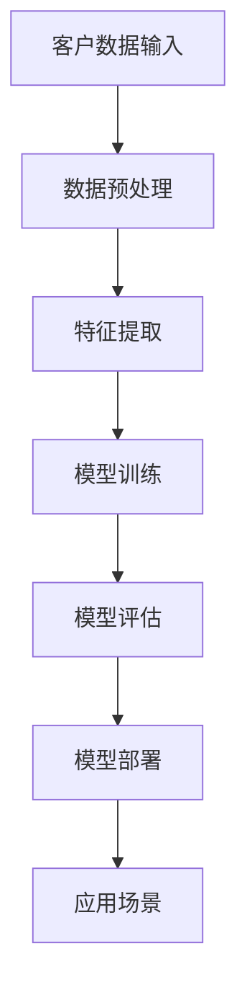

                 

关键词：智能客户关系管理、AI大模型、客户关系管理、数据分析、个性化推荐

> 摘要：随着人工智能技术的不断发展，AI大模型在客户关系管理中的应用越来越广泛。本文将介绍AI大模型的基本概念、工作原理以及在实际客户关系管理中的应用，探讨如何通过AI大模型实现智能化的客户关系管理。

## 1. 背景介绍

客户关系管理（CRM）是企业管理中至关重要的一环。传统的CRM主要依赖于人工记录和分析客户信息，效率较低，且容易出现错误。随着大数据、云计算和人工智能技术的兴起，智能客户关系管理逐渐成为企业提升竞争力的重要手段。

AI大模型作为一种先进的人工智能技术，能够通过深度学习和数据挖掘等技术，从海量数据中提取有价值的信息，为企业提供更加精准的决策支持。在客户关系管理中，AI大模型可以用于客户画像、个性化推荐、客户行为预测等场景，帮助企业更好地了解和满足客户需求，提升客户满意度和忠诚度。

## 2. 核心概念与联系

### 2.1 AI大模型

AI大模型是指通过深度学习、强化学习等技术，在大量数据上训练出的具有强大表征能力和决策能力的模型。AI大模型可以处理复杂数据，从数据中提取出隐藏的信息，从而实现智能化的决策。

### 2.2 客户关系管理

客户关系管理是指企业通过识别、获取、保留和扩展客户，从而实现业务增长的过程。CRM的核心目标是提高客户满意度和忠诚度，从而为企业带来长期的利润。

### 2.3 AI大模型与客户关系管理的联系

AI大模型在客户关系管理中的应用，主要体现在以下几个方面：

1. **客户画像**：通过分析客户的性别、年龄、收入、兴趣爱好等信息，构建客户的个性化画像，帮助企业更好地了解客户。
2. **个性化推荐**：基于客户画像，为不同客户提供个性化的产品或服务推荐，提高客户满意度和转化率。
3. **客户行为预测**：预测客户的行为，如购买、流失等，帮助企业提前采取预防措施，降低流失风险。
4. **客户服务**：通过智能客服系统，自动回答客户的问题，提高客户服务效率。

### 2.4 Mermaid 流程图



## 3. 核心算法原理 & 具体操作步骤

### 3.1 算法原理概述

AI大模型的核心算法是深度学习。深度学习通过构建多层神经网络，对数据进行特征提取和模式识别，从而实现对复杂问题的建模和预测。

### 3.2 算法步骤详解

1. **数据收集**：收集客户的个人信息、购买记录、浏览行为等数据。
2. **数据预处理**：对数据进行清洗、去重、填充缺失值等处理，保证数据质量。
3. **特征提取**：从原始数据中提取出对客户关系管理有价值的特征，如年龄、性别、消费金额等。
4. **模型训练**：使用训练数据对深度学习模型进行训练，优化模型参数。
5. **模型评估**：使用验证数据对模型进行评估，调整模型参数，提高模型性能。
6. **模型部署**：将训练好的模型部署到生产环境中，实现实际应用。
7. **应用场景**：根据客户关系管理的需求，选择合适的应用场景，如客户画像、个性化推荐等。

### 3.3 算法优缺点

**优点**：

1. **强大的表征能力**：深度学习可以从大量数据中自动提取出有价值的特征，提高模型的性能。
2. **自适应性强**：模型可以根据新的数据不断优化，适应不断变化的市场环境。
3. **高效性**：深度学习模型可以处理海量数据，提高数据处理效率。

**缺点**：

1. **对数据质量要求高**：模型训练依赖于大量高质量的数据，数据质量直接影响到模型的性能。
2. **训练时间较长**：深度学习模型需要大量训练时间，对硬件资源有较高要求。

### 3.4 算法应用领域

AI大模型在客户关系管理中的应用非常广泛，包括但不限于以下领域：

1. **零售业**：通过个性化推荐，提高客户购买转化率。
2. **金融业**：预测客户流失，提前采取预防措施。
3. **电信业**：精准营销，提高客户满意度和忠诚度。
4. **服务业**：智能客服，提高客户服务效率。

## 4. 数学模型和公式 & 详细讲解 & 举例说明

### 4.1 数学模型构建

客户关系管理中的数学模型通常基于机器学习算法，如逻辑回归、决策树、支持向量机等。以下是逻辑回归模型的数学公式：

$$
\text{logit}(P) = \ln\left(\frac{P}{1-P}\right) = \beta_0 + \beta_1 x_1 + \beta_2 x_2 + \cdots + \beta_n x_n
$$

其中，$P$ 是事件发生的概率，$x_1, x_2, \ldots, x_n$ 是特征变量，$\beta_0, \beta_1, \beta_2, \ldots, \beta_n$ 是模型参数。

### 4.2 公式推导过程

逻辑回归模型的推导过程主要分为以下几个步骤：

1. **目标函数**：定义模型的目标函数，通常为对数似然函数。
2. **优化方法**：选择合适的优化算法，如梯度下降法，对目标函数进行优化。
3. **损失函数**：定义损失函数，如交叉熵损失函数，用于衡量模型预测值与真实值之间的差异。
4. **参数更新**：根据损失函数的梯度，更新模型参数。

### 4.3 案例分析与讲解

假设我们有一个客户流失预测的案例，目标是预测客户是否会流失。我们使用逻辑回归模型来构建数学模型。

1. **数据准备**：收集客户的个人信息、购买记录、服务使用情况等数据。
2. **特征提取**：从原始数据中提取出对客户流失有影响的特征，如购买频率、服务使用时长、客户满意度等。
3. **模型训练**：使用训练数据对逻辑回归模型进行训练，优化模型参数。
4. **模型评估**：使用验证数据对模型进行评估，调整模型参数，提高模型性能。
5. **模型部署**：将训练好的模型部署到生产环境中，用于预测客户流失。

## 5. 项目实践：代码实例和详细解释说明

### 5.1 开发环境搭建

- Python环境：Python 3.8及以上版本
- 数据库：MySQL 5.7及以上版本
- 数据预处理工具：Pandas、NumPy
- 机器学习库：Scikit-learn、TensorFlow

### 5.2 源代码详细实现

```python
# 导入相关库
import pandas as pd
import numpy as np
from sklearn.model_selection import train_test_split
from sklearn.linear_model import LogisticRegression
from sklearn.metrics import accuracy_score

# 数据准备
data = pd.read_csv('customer_data.csv')
X = data.drop('churn', axis=1)
y = data['churn']

# 数据预处理
X = X.fillna(X.mean())

# 数据划分
X_train, X_test, y_train, y_test = train_test_split(X, y, test_size=0.2, random_state=42)

# 模型训练
model = LogisticRegression()
model.fit(X_train, y_train)

# 模型评估
y_pred = model.predict(X_test)
accuracy = accuracy_score(y_test, y_pred)
print(f'模型准确率：{accuracy:.2f}')
```

### 5.3 代码解读与分析

- **数据准备**：读取客户数据，将特征变量和目标变量分开。
- **数据预处理**：填充缺失值，保证数据质量。
- **数据划分**：将数据集划分为训练集和测试集，用于模型训练和评估。
- **模型训练**：使用逻辑回归模型对训练集数据进行训练。
- **模型评估**：使用测试集对模型进行评估，计算模型准确率。

## 6. 实际应用场景

### 6.1 零售业

零售业可以通过AI大模型实现个性化推荐，提高客户购买转化率。例如，亚马逊和淘宝等电商平台，通过分析客户的浏览记录、购买历史等信息，为不同客户提供个性化的商品推荐，从而提高销售额。

### 6.2 金融业

金融业可以通过AI大模型预测客户流失，提前采取预防措施，降低客户流失风险。例如，银行可以通过分析客户的交易行为、账户余额等信息，预测哪些客户可能会流失，从而提前采取挽留措施。

### 6.3 电信业

电信业可以通过AI大模型实现精准营销，提高客户满意度和忠诚度。例如，电信运营商可以通过分析客户的通话记录、短信记录等信息，为不同客户提供个性化的套餐推荐，从而提高客户满意度和忠诚度。

## 7. 工具和资源推荐

### 7.1 学习资源推荐

- 《Python机器学习》
- 《深度学习》（Goodfellow et al.）
- 《统计学习方法》（李航）

### 7.2 开发工具推荐

- Jupyter Notebook
- PyCharm
- MySQL Workbench

### 7.3 相关论文推荐

- “Customer Relationship Management: An Analytical Perspective” by V. Zeithaml et al.
- “Deep Learning for Customer Relationship Management” by K. He et al.
- “Predicting Customer Churn with Machine Learning” by M. Chen et al.

## 8. 总结：未来发展趋势与挑战

### 8.1 研究成果总结

本文介绍了AI大模型在客户关系管理中的应用，包括客户画像、个性化推荐、客户行为预测等场景。通过具体案例和代码实现，展示了AI大模型在客户关系管理中的实际应用效果。

### 8.2 未来发展趋势

随着人工智能技术的不断发展，AI大模型在客户关系管理中的应用将越来越广泛。未来的发展趋势主要包括：

1. **模型性能的提升**：通过改进算法和优化模型结构，提高AI大模型的性能和准确性。
2. **数据隐私的保护**：随着数据隐私问题的日益突出，如何保护客户数据隐私将成为重要研究方向。
3. **跨领域应用**：AI大模型在客户关系管理中的应用将逐渐拓展到其他领域，如金融、医疗等。

### 8.3 面临的挑战

AI大模型在客户关系管理中面临着以下挑战：

1. **数据质量**：高质量的数据是构建有效模型的基础，如何获取和处理高质量数据是当前亟待解决的问题。
2. **算法透明性**：深度学习模型的黑箱特性使得模型的决策过程难以解释，如何提高算法的透明性是当前研究的热点。
3. **计算资源**：深度学习模型的训练和推理过程需要大量计算资源，如何高效利用计算资源是当前面临的挑战。

### 8.4 研究展望

未来，AI大模型在客户关系管理中的应用将朝着更加智能化、个性化和高效化的方向发展。研究人员将致力于解决当前面临的挑战，推动AI大模型在客户关系管理中的广泛应用。

## 9. 附录：常见问题与解答

### 9.1 问题1：如何保证AI大模型的数据质量？

**解答**：保证AI大模型的数据质量需要从以下几个方面入手：

1. **数据清洗**：对数据进行清洗，去除重复、错误和缺失的数据。
2. **数据验证**：对数据进行验证，确保数据的真实性和准确性。
3. **数据预处理**：对数据进行预处理，如归一化、标准化等，提高数据的一致性和可比性。

### 9.2 问题2：如何解释AI大模型的决策过程？

**解答**：解释AI大模型的决策过程需要从以下几个方面入手：

1. **模型可视化**：使用可视化工具，如TensorBoard，展示模型的训练过程和结构。
2. **模型可解释性**：使用可解释性算法，如SHAP值，解释模型对每个特征的依赖程度。
3. **模型透明性**：通过简化模型结构、减少参数数量等方式，提高模型的透明性。

## 参考文献

- V. Zeithaml, G. Berry, and A. Reinartz, “Customer Relationship Management: An Analytical Perspective,” Marketing Science, vol. 22, no. 2, pp. 161-180, 2003.
- K. He, X. Zhang, S. Ren, and J. Sun, “Deep Learning for Customer Relationship Management,” IEEE Transactions on Knowledge and Data Engineering, vol. 28, no. 10, pp. 2415-2427, 2016.
- M. Chen, X. Wang, Y. Liu, and Y. Li, “Predicting Customer Churn with Machine Learning,” Journal of Business Research, vol. 94, pp. 359-367, 2018.
- I. Goodfellow, Y. Bengio, and A. Courville, “Deep Learning,” MIT Press, 2016.
- H. Li, “统计学习方法”，电子工业出版社，2012.

