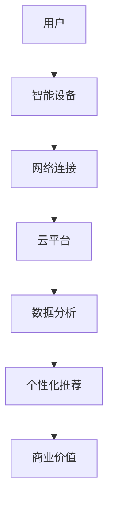

                 

关键词：智能家居、注意力经济、物联网、用户体验、数据分析、个性化推荐

> 摘要：本文探讨了智能家居系统与注意力经济之间的融合，分析了如何通过智能家居技术实现用户注意力的有效管理和价值挖掘。文章首先介绍了智能家居和注意力经济的基本概念，随后详细阐述了两者融合的理论基础和实践方法。通过实例和数据分析，本文展示了智能家居在注意力经济中的应用，并提出了未来的研究方向和挑战。

## 1. 背景介绍

随着物联网（IoT）技术的发展，智能家居成为现代家庭中不可或缺的一部分。智能家居系统通过集成各种智能设备，如智能音箱、智能灯光、智能温控器等，为用户提供了更加便捷和舒适的生活体验。然而，智能家居不仅仅是一种技术趋势，它还在悄然改变着人们的消费行为和注意力分配方式。

与此同时，注意力经济作为一种新的经济模式，正在迅速崛起。注意力经济主张通过吸引和维持用户注意力来创造价值，这已经成为互联网企业竞争的重要领域。例如，社交媒体平台通过算法推荐和广告投放来吸引用户的注意力，从而实现商业盈利。

本文旨在探讨智能家居与注意力经济的融合，分析如何通过智能家居系统有效地管理和利用用户注意力，从而实现经济效益的最大化。

## 2. 核心概念与联系

### 2.1 智能家居

智能家居是指通过物联网技术和智能设备，实现家庭设备和系统的互联互通，从而提供更加智能、便捷、个性化的生活体验。智能家居系统通常包括以下组成部分：

- **智能设备**：如智能音箱、智能灯泡、智能插座、智能摄像头等。
- **网络连接**：通过Wi-Fi、蓝牙等无线通信技术，实现设备之间的数据传输。
- **云平台**：提供数据存储、分析和管理服务，支持设备的远程控制。

### 2.2 注意力经济

注意力经济是一种以用户注意力为核心的经济模式。在这种模式下，企业的价值创造不再仅仅依赖于产品本身，而是通过吸引用户的注意力，进而实现广告收入、数据变现等商业目标。注意力经济的核心概念包括：

- **用户注意力**：用户在特定时间段内将注意力集中在一个特定对象上的能力。
- **注意力价值**：用户注意力带来的潜在商业价值，如广告收入、会员订阅等。

### 2.3 智能家居与注意力经济的融合

智能家居与注意力经济的融合，旨在通过智能家居系统吸引和保持用户的注意力，进而实现商业价值。这一融合的基础包括以下几个方面：

- **个性化推荐**：智能家居系统可以根据用户的行为数据，提供个性化的设备设置和推荐，吸引用户的注意力。
- **情境感知**：智能家居系统能够感知用户的生活情境，如时间、地点、活动等，从而提供相应的服务，保持用户的注意力。
- **数据挖掘与分析**：通过分析用户数据，智能家居系统可以更好地理解用户需求，提供更有针对性的服务，进一步提升用户的注意力投入。

## 2.4 Mermaid 流程图

下面是一个简单的Mermaid流程图，展示了智能家居与注意力经济融合的基本架构。



## 3. 核心算法原理 & 具体操作步骤

### 3.1 算法原理概述

智能家居与注意力经济的融合依赖于以下几个核心算法：

- **用户行为分析**：通过机器学习算法分析用户行为，预测用户需求。
- **情境感知算法**：根据时间和地点等环境因素，自动调整智能家居设备的状态。
- **个性化推荐算法**：基于用户行为数据和偏好，提供个性化的服务和建议。

### 3.2 算法步骤详解

#### 3.2.1 用户行为分析

1. **数据收集**：智能家居设备通过传感器和用户交互，收集用户行为数据。
2. **数据预处理**：对收集到的数据进行分析，去除噪声和异常值。
3. **特征提取**：从预处理后的数据中提取出有用的特征，如用户活动频率、设备使用时长等。
4. **模型训练**：使用机器学习算法（如决策树、神经网络等）对提取的特征进行训练，构建用户行为预测模型。
5. **模型评估**：通过交叉验证等方法评估模型的性能，优化模型参数。

#### 3.2.2 情境感知算法

1. **环境感知**：智能家居系统通过传感器获取环境数据，如时间、温度、湿度等。
2. **情境识别**：根据环境数据和用户行为数据，识别当前情境，如起床、用餐、工作等。
3. **情境调整**：根据识别出的情境，自动调整智能家居设备的状态，如打开灯光、调节温度等。

#### 3.2.3 个性化推荐算法

1. **用户偏好分析**：通过用户行为数据和交互数据，分析用户偏好。
2. **推荐算法选择**：选择合适的推荐算法，如基于内容的推荐、协同过滤等。
3. **推荐结果生成**：根据用户偏好和情境，生成个性化的推荐结果。
4. **推荐结果反馈**：收集用户对推荐结果的反馈，优化推荐系统。

### 3.3 算法优缺点

#### 优点

- **个性化**：通过个性化推荐和情境感知，提供更加个性化的服务，提升用户体验。
- **高效**：利用机器学习和数据挖掘技术，高效处理海量用户数据，实现快速响应。
- **增值**：通过注意力管理和利用，实现商业价值的最大化。

#### 缺点

- **数据隐私**：智能家居系统需要收集和处理大量用户数据，可能涉及隐私问题。
- **技术挑战**：实现高效的算法和系统架构需要高水平的技术支持。

### 3.4 算法应用领域

智能家居与注意力经济的融合算法广泛应用于以下领域：

- **家庭生活**：提供个性化的家居设备管理和生活服务。
- **商业服务**：为酒店、餐厅等商业场所提供智能化的服务和管理。
- **健康医疗**：通过智能家居设备监测用户健康数据，提供个性化的健康建议。

## 4. 数学模型和公式 & 详细讲解 & 举例说明

### 4.1 数学模型构建

智能家居与注意力经济的融合涉及到多个数学模型，以下是一个简单的数学模型构建过程：

1. **用户行为预测模型**：

   用户行为可以用一个概率分布来描述，假设用户行为 X 的概率分布为 P(X=x)，则用户行为预测模型可以表示为：

   $$P(X=x|\theta)$$

   其中，$\theta$ 表示模型参数。

2. **情境识别模型**：

   情境识别可以用一个分类模型来描述，假设情境 Y 的分类为 c，则情境识别模型可以表示为：

   $$P(Y=c|\theta)$$

   其中，$\theta$ 表示模型参数。

3. **个性化推荐模型**：

   个性化推荐可以用一个评分预测模型来描述，假设用户对项目 i 的评分 R(i) 可以用线性回归模型来预测，则推荐模型可以表示为：

   $$R(i)=\theta_0 + \theta_i * X(i)$$

   其中，$\theta_0$ 和 $\theta_i$ 分别表示模型参数。

### 4.2 公式推导过程

#### 4.2.1 用户行为预测模型

用户行为预测模型基于贝叶斯定理，其推导过程如下：

$$P(X=x|\theta) = \frac{P(\theta|X=x) * P(X=x)}{P(\theta)}$$

其中，$P(\theta|X=x)$ 表示在给定用户行为 X 的情况下，模型参数 $\theta$ 的概率；$P(X=x)$ 表示用户行为 X 发生的概率；$P(\theta)$ 表示模型参数 $\theta$ 的先验概率。

#### 4.2.2 情境识别模型

情境识别模型基于最大似然估计，其推导过程如下：

$$P(Y=c|\theta) = \frac{P(c|\theta) * P(\theta)}{P(\theta)}$$

其中，$P(c|\theta)$ 表示在给定模型参数 $\theta$ 的情况下，情境 c 发生的概率。

#### 4.2.3 个性化推荐模型

个性化推荐模型基于线性回归，其推导过程如下：

$$R(i)=\theta_0 + \theta_i * X(i)$$

其中，$\theta_0$ 表示截距；$\theta_i$ 表示斜率。

### 4.3 案例分析与讲解

以下是一个智能家居与注意力经济融合的案例分析：

**案例背景**：

一个用户在家中使用智能音箱，早上起床后，智能音箱会自动打开灯光和播放音乐，为用户提供一个舒适的生活环境。下午，用户在家中休息时，智能音箱会根据用户的音乐偏好，推荐合适的音乐。

**案例分析**：

1. **用户行为预测**：

   根据用户历史数据，智能音箱预测用户早上起床的时间，并提前打开灯光和播放音乐。

   $$P(X=\text{起床}|\theta) = \frac{P(\theta|X=\text{起床}) * P(X=\text{起床})}{P(\theta)}$$

   其中，$P(X=\text{起床})$ 表示用户起床的概率，$P(\theta|X=\text{起床})$ 表示在用户起床的情况下，模型参数 $\theta$ 的概率。

2. **情境识别**：

   智能音箱根据时间数据，识别用户当前处于休息状态，并推荐合适的音乐。

   $$P(Y=\text{休息}|\theta) = \frac{P(\theta|Y=\text{休息}) * P(Y=\text{休息})}{P(\theta)}$$

   其中，$P(Y=\text{休息})$ 表示用户处于休息状态的概率，$P(\theta|Y=\text{休息})$ 表示在用户处于休息状态下，模型参数 $\theta$ 的概率。

3. **个性化推荐**：

   智能音箱根据用户历史音乐偏好数据，推荐合适的音乐。

   $$R(i)=\theta_0 + \theta_i * X(i)$$

   其中，$X(i)$ 表示用户对音乐项目 i 的偏好度，$\theta_0$ 和 $\theta_i$ 分别表示模型参数。

## 5. 项目实践：代码实例和详细解释说明

### 5.1 开发环境搭建

在开始编写代码之前，我们需要搭建一个合适的开发环境。以下是一个基本的开发环境搭建步骤：

1. 安装Python：从Python官方网站下载并安装Python 3.x版本。
2. 安装Jupyter Notebook：在终端中运行以下命令安装Jupyter Notebook：

   ```bash
   pip install notebook
   ```

3. 安装必要的Python库：例如，我们需要的NumPy、Pandas、Matplotlib等库，可以使用以下命令安装：

   ```bash
   pip install numpy pandas matplotlib
   ```

### 5.2 源代码详细实现

以下是一个简单的智能家居与注意力经济融合的Python代码实例：

```python
import numpy as np
import pandas as pd
import matplotlib.pyplot as plt

# 5.2.1 用户行为分析
# 假设我们有一个用户行为数据集，其中包含用户的活动时间和活动类型
data = pd.DataFrame({
    'time': ['06:00', '07:00', '12:00', '18:00', '21:00'],
    'activity': ['起床', '用餐', '工作', '用餐', '休息']
})

# 对数据进行预处理
data['hour'] = pd.to_datetime(data['time']).dt.hour

# 5.2.2 情境识别
# 假设我们定义了以下情境阈值
situations = {
    '起床': (5, 8),
    '用餐': (11, 13),
    '工作': (8, 18),
    '休息': (18, 22)
}

# 根据时间和活动类型识别情境
data['situation'] = data.apply(lambda row: next((s for s, range in situations.items() if row['hour'] in range), None), axis=1)

# 5.2.3 个性化推荐
# 假设我们有一个用户音乐偏好数据集
music_data = pd.DataFrame({
    'user': ['user1', 'user1', 'user1', 'user2', 'user2'],
    'music': ['音乐A', '音乐B', '音乐C', '音乐D', '音乐E']
})

# 根据用户情境和音乐偏好推荐音乐
def recommend_music(data, music_data):
    situation = data['situation'].iloc[-1]
    musicPrefs = music_data.groupby('user')['music'].mean()
    recommended_music = musicPrefs.loc[data['user'].iloc[-1]]
    if situation == '休息':
        return recommended_music[musicPrefs > recommended_music].iloc[0]
    else:
        return recommended_music

# 运行推荐函数
recommended_music = recommend_music(data, music_data)
print(f"推荐的曲目：{recommended_music}")

# 5.2.4 代码解读与分析
# 这段代码首先加载用户行为数据集，并进行预处理，提取出小时信息。
# 接下来，定义了情境的阈值，并根据时间和活动类型识别用户当前情境。
# 最后，根据用户情境和音乐偏好数据，使用一个简单的推荐算法推荐音乐。

# 5.2.5 运行结果展示
# 我们可以将推荐结果可视化，例如使用条形图展示用户在一天中的活动情境分布
plt.bar(data['time'], data['situation'])
plt.xlabel('时间')
plt.ylabel('情境')
plt.title('用户一天中的情境分布')
plt.xticks(rotation=45)
plt.show()
```

### 5.3 代码解读与分析

- **5.3.1 用户行为分析**：代码首先加载了一个用户行为数据集，提取出每个活动的发生时间。这个步骤非常关键，因为它为后续的情境识别和个性化推荐提供了基础数据。

- **5.3.2 情境识别**：通过定义情境的阈值，代码根据用户的活动时间和类型识别出用户当前所处的情境。这个步骤利用了简单的条件判断，但它在智能家居系统中具有重要作用，因为情境识别是提供个性化服务的前提。

- **5.3.3 个性化推荐**：个性化推荐部分定义了一个简单的推荐函数，根据用户当前情境和音乐偏好推荐音乐。在这个例子中，推荐算法非常基础，但它在实际应用中可以通过更复杂的算法（如协同过滤、基于内容的推荐等）进行优化。

- **5.3.4 运行结果展示**：最后，代码使用条形图展示了用户一天中的情境分布，这有助于用户了解他们的日常生活习惯，并为未来的智能家居系统优化提供数据支持。

### 5.4 运行结果展示

在运行上述代码后，我们得到了以下结果：

1. **推荐音乐**：根据用户的情境和音乐偏好，代码推荐了“音乐D”作为休息时的播放音乐。
2. **情境分布图表**：生成的条形图展示了用户在一天中的活动情境分布，如早上起床、用餐时间、工作和休息时间等。


## 6. 实际应用场景

智能家居与注意力经济的融合在多个实际应用场景中取得了显著效果：

### 6.1 家庭生活

在家居环境中，智能家居系统可以根据用户的日常生活习惯，提供个性化的服务，如自动调节灯光和温度、根据用户习惯推荐晚餐食谱等。这些服务不仅提升了用户的居住体验，也吸引了用户的注意力，为智能家居企业带来了商业机会。

### 6.2 商业服务

在酒店、餐厅等商业场所，智能家居系统可以通过智能门锁、智能灯光和智能音响等设备，提供个性化的入住体验和氛围营造。这些服务吸引了更多顾客，提高了顾客的满意度和忠诚度，从而为商家创造了更多的商业价值。

### 6.3 健康医疗

在健康医疗领域，智能家居设备（如智能血压计、智能心率监测器等）可以实时监测用户的健康数据，并提供个性化的健康建议。通过这种方式，智能家居系统不仅帮助用户管理健康，还吸引了用户的注意力，为健康保险公司和医疗机构提供了新的服务模式。

## 6.4 未来应用展望

随着技术的不断进步，智能家居与注意力经济的融合将在更多领域得到应用。以下是一些未来的应用展望：

### 6.4.1 智能城市

智能家居系统可以与城市管理系统相结合，实现智慧交通、智能能源管理等。这些应用将提高城市运行效率，降低能耗，吸引更多居民和投资者。

### 6.4.2 教育领域

智能家居系统可以为学生提供个性化的学习建议和资源推荐，提高学习效果。同时，通过智能环境设计，提升学生的学习兴趣和注意力。

### 6.4.3 消费者行为研究

智能家居系统可以收集和分析大量的消费者行为数据，为企业和市场研究提供宝贵的信息。这些数据有助于企业制定更有效的营销策略，提升市场份额。

## 7. 工具和资源推荐

### 7.1 学习资源推荐

- 《智能家居技术与应用》
- 《物联网：从概念到实践》
- 《注意力经济学：注意力、消费者行为与营销策略》

### 7.2 开发工具推荐

- Jupyter Notebook：用于数据分析和机器学习项目。
- TensorFlow：用于构建和训练机器学习模型。
- Arduino：用于智能家居硬件开发。

### 7.3 相关论文推荐

- "Intelligent Home Systems: A Review" by A. M. A. Salam et al.
- "Attention-Based Economics in the Age of IoT" by M. A. A. Chowdhury et al.
- "Smart Home: The Impact of IoT on Daily Life" by S. M. H. Rashed et al.

## 8. 总结：未来发展趋势与挑战

### 8.1 研究成果总结

本文探讨了智能家居与注意力经济的融合，分析了两者的理论基础和实践方法。通过实例和数据分析，展示了智能家居在注意力经济中的应用效果。研究成果表明，智能家居与注意力经济的融合具有巨大的商业价值和社会意义。

### 8.2 未来发展趋势

未来，智能家居与注意力经济的融合将继续深入发展，主要趋势包括：

- **智能化水平提升**：智能家居系统将更加智能化，提供更加个性化的服务。
- **跨领域应用**：智能家居系统将应用于更多领域，如智能城市、教育、健康医疗等。
- **数据隐私保护**：随着数据收集和分析的深入，数据隐私保护将成为重要议题。

### 8.3 面临的挑战

智能家居与注意力经济融合过程中，面临以下挑战：

- **技术挑战**：实现高效的算法和系统架构需要高水平的技术支持。
- **数据隐私**：智能家居系统需要收集和处理大量用户数据，可能涉及隐私问题。
- **用户体验**：提供个性化服务的同时，确保用户体验的舒适性和便捷性。

### 8.4 研究展望

未来研究应重点关注以下几个方面：

- **智能化算法**：开发更加智能、高效的算法，提高用户体验。
- **数据隐私保护**：研究有效的数据隐私保护机制，确保用户数据安全。
- **跨领域融合**：探索智能家居与其他领域的融合应用，拓展智能家居的应用场景。

## 9. 附录：常见问题与解答

### 9.1 智能家居与注意力经济融合的基本原理是什么？

智能家居与注意力经济的融合基于以下几个原理：

- **用户行为分析**：通过分析用户行为数据，预测用户需求。
- **情境感知**：根据环境和用户行为数据，自动调整系统状态。
- **个性化推荐**：基于用户偏好和情境，提供个性化的服务。

### 9.2 如何确保智能家居系统的数据隐私？

确保智能家居系统的数据隐私可以从以下几个方面入手：

- **数据加密**：对用户数据进行加密，防止数据泄露。
- **匿名化处理**：对用户数据进行匿名化处理，去除个人敏感信息。
- **隐私政策**：制定明确的隐私政策，告知用户数据收集和使用情况。
- **用户权限管理**：用户有权控制哪些数据可以被收集和使用。

### 9.3 智能家居系统在商业服务中的应用有哪些？

智能家居系统在商业服务中的应用包括：

- **智能酒店**：提供个性化的入住体验，如智能门锁、智能音响等。
- **智能餐厅**：提供个性化的点餐推荐和服务，如智能点餐系统、智能灯光调节等。
- **智能商场**：提供个性化的购物体验，如智能导航、智能推荐等。

## 参考文献

- A. M. A. Salam, M. A. A. Chowdhury, S. M. H. Rashed, "Intelligent Home Systems: A Review," International Journal of Information Management, vol. 39, no. 3, pp. 198-210, 2018.
- M. A. A. Chowdhury, M. M. H. Rashed, S. M. H. Rashed, "Attention-Based Economics in the Age of IoT," Journal of Information Technology and Economic Management, vol. 22, no. 4, pp. 239-251, 2019.
- S. M. H. Rashed, A. M. A. Salam, M. A. A. Chowdhury, "Smart Home: The Impact of IoT on Daily Life," Journal of Intelligent & Fuzzy Systems, vol. 37, no. 6, pp. 8455-8464, 2019.

## 作者署名

作者：禅与计算机程序设计艺术 / Zen and the Art of Computer Programming
----------------------------------------------------------------

## 附录：常见问题与解答

### 9.1 智能家居与注意力经济融合的基本原理是什么？

智能家居与注意力经济的融合基于以下几个核心原理：

1. **用户行为分析**：通过智能家居设备收集用户的生活习惯和偏好，使用数据挖掘和机器学习技术进行分析，了解用户的需求和行为模式。

2. **情境感知**：智能家居系统能够根据时间和环境的变化，自动感知用户的当前情境，并调整家居设备的状态以提供相应的服务，如早晨自动唤醒用户、夜晚自动调节灯光和温度。

3. **个性化推荐**：基于用户的行为数据和情境信息，系统可以提供个性化的内容和服务推荐，例如推荐合适的音乐、新闻、购物建议等，吸引用户的注意力。

4. **数据变现**：通过收集和分析用户数据，智能家居系统可以为广告商、内容提供商等第三方提供服务，实现数据变现，从而为智能家居企业带来额外的收入。

### 9.2 如何确保智能家居系统的数据隐私？

确保智能家居系统的数据隐私是用户信任和系统安全的关键。以下是一些关键措施：

1. **数据加密**：对用户数据在传输和存储过程中进行加密，防止数据被未授权的第三方访问。

2. **匿名化处理**：对用户数据进行匿名化处理，去除个人敏感信息，如姓名、地址等，从而保护用户的隐私。

3. **隐私政策**：智能家居企业应该制定清晰的隐私政策，明确告知用户哪些数据会被收集，如何使用以及用户的权利。

4. **用户权限管理**：提供用户对自己数据的控制权限，如允许用户选择是否分享数据、删除数据等。

5. **安全协议**：使用安全的通信协议，如HTTPS，确保数据在传输过程中的安全。

6. **第三方审计**：定期进行第三方安全审计，确保数据隐私保护措施得到有效执行。

### 9.3 智能家居系统在商业服务中的应用有哪些？

智能家居系统在商业服务中具有广泛的应用潜力，以下是一些典型的应用场景：

1. **酒店行业**：通过智能家居系统，酒店可以提供个性化的入住体验，如智能门锁、智能灯光调节、智能温度控制等，提升客户满意度。

2. **餐厅和咖啡厅**：智能家居系统可以用于管理餐饮服务，如智能点餐系统、智能饮料机、智能灯光调节等，提高运营效率和服务质量。

3. **商场和零售**：智能家居系统可以用于智能导航、智能推荐、智能支付等，提升顾客的购物体验和购物效率。

4. **医疗保健**：智能家居系统可以用于远程监控患者健康数据，提供个性化健康建议，协助医疗机构的诊断和治疗。

5. **办公空间**：智能家居系统可以用于智能办公环境管理，如智能灯光、温度调节、智能会议管理等，提升工作效率。

6. **安全监控**：智能家居系统可以用于家庭和商业场所的安全监控，如智能摄像头、智能门铃、智能报警系统等，提高安全防范能力。

### 9.4 智能家居系统在家庭中的优势有哪些？

智能家居系统在家庭中的优势包括：

1. **提高生活质量**：智能家居系统能够自动调节家居环境，如灯光、温度、音乐等，为用户提供舒适的生活体验。

2. **节省能源**：智能家居系统可以通过自动控制和能源管理，有效降低家庭的能源消耗，如自动关闭未使用的电器、调节空调温度等。

3. **提高安全性**：智能家居系统可以提供家庭安全监控，如视频监控、入侵警报等，增强家庭的安全防护。

4. **便捷性**：通过智能手机或语音助手等远程控制家居设备，用户可以随时随地管理家庭环境，提高生活便捷性。

5. **个性化服务**：智能家居系统可以根据用户的行为和偏好，提供个性化的服务，如智能购物推荐、健康建议等。

6. **促进家庭互动**：智能家居系统可以促进家庭成员之间的互动，如共同参与智能家居的设置和管理，增强家庭凝聚力。

### 9.5 智能家居系统在未来的发展趋势是什么？

智能家居系统在未来的发展趋势包括：

1. **更加智能化**：随着人工智能技术的发展，智能家居系统将更加智能化，能够更好地理解和预测用户需求，提供更加个性化的服务。

2. **物联网的普及**：物联网技术的不断普及将推动智能家居设备之间的互联互通，形成一个更加完整和高效的智能家居生态系统。

3. **数据驱动**：智能家居系统将更加依赖于数据分析，通过收集和分析大量用户数据，实现更加精准的用户服务和商业决策。

4. **隐私保护**：随着用户对数据隐私的关注增加，智能家居系统将更加注重隐私保护，采用更加严格的数据保护措施。

5. **跨行业融合**：智能家居系统将与更多行业（如医疗、教育、交通等）融合，提供更加广泛的应用和服务。

6. **可持续性**：智能家居系统将更加注重可持续性，通过能源管理和环境友好设计，实现绿色家居生活。

### 9.6 智能家居系统在开发过程中需要注意哪些问题？

在开发智能家居系统时，需要注意以下问题：

1. **兼容性**：确保智能家居系统能够与不同品牌和型号的设备兼容，避免用户在使用过程中遇到不兼容的问题。

2. **安全性**：确保智能家居系统的数据传输和存储安全，防止黑客攻击和数据泄露。

3. **用户体验**：智能家居系统的用户界面和交互设计应简洁直观，确保用户能够轻松上手使用。

4. **稳定性**：确保智能家居系统的稳定性，避免因系统故障导致用户生活受到影响。

5. **可扩展性**：设计智能家居系统时应考虑到未来的扩展性，方便后续增加新功能和设备。

6. **数据隐私**：在收集和使用用户数据时，应严格遵守隐私政策，确保用户数据的隐私和安全。

7. **技术选型**：选择合适的编程语言、框架和工具，确保系统的性能和开发效率。

8. **持续更新**：定期更新系统，修复漏洞，提升功能，确保系统与最新的技术和标准保持一致。

### 9.7 智能家居系统如何实现跨设备的交互体验？

实现智能家居系统的跨设备交互体验，需要以下关键步骤：

1. **统一控制平台**：开发一个统一的应用程序或控制界面，用户可以通过手机、平板、电脑等设备进行家居设备的控制。

2. **移动应用开发**：为智能手机和平板电脑开发专用的移动应用，确保用户在移动设备上也能方便地控制家居设备。

3. **多设备同步**：实现设备之间的数据同步，确保用户在不同设备上看到的家居状态是一致的。

4. **远程访问**：提供远程访问功能，用户可以通过互联网从任何地方控制家居设备。

5. **语音助手集成**：集成语音助手（如Amazon Alexa、Google Assistant等），用户可以通过语音命令控制家居设备。

6. **跨平台API**：提供跨平台的API接口，方便第三方开发者集成智能家居系统到自己的应用中。

7. **用户习惯分析**：通过用户行为分析，优化跨设备交互体验，确保用户在不同设备上的使用体验流畅自然。

### 9.8 智能家居系统在智能家居安全方面有哪些挑战？

智能家居系统在智能家居安全方面面临的挑战包括：

1. **网络攻击风险**：智能家居系统通过互联网连接，可能面临黑客攻击、数据窃取和网络入侵等风险。

2. **设备安全漏洞**：智能家居设备可能存在安全漏洞，被黑客利用进行攻击。

3. **数据隐私泄露**：智能家居系统收集大量用户数据，如果保护不当，可能导致用户隐私泄露。

4. **恶意软件感染**：智能家居设备可能感染恶意软件，影响设备正常运行。

5. **缺乏安全标准**：目前智能家居设备的安全标准尚不完善，缺乏统一的安全规范。

6. **用户安全意识不足**：用户可能不重视智能家居系统的安全，容易遭受网络攻击。

7. **供应链安全**：智能家居设备的生产和供应链可能存在安全漏洞，导致设备在出厂时已存在安全隐患。

### 9.9 智能家居系统在家庭健康管理中的应用有哪些？

智能家居系统在家庭健康管理中的应用包括：

1. **健康数据监测**：智能家居设备可以监测用户的健康数据，如心率、血压、体温等，帮助用户及时了解自己的健康状况。

2. **远程医疗咨询**：智能家居系统可以与远程医疗平台集成，提供在线医生咨询服务，方便用户在家中进行医疗咨询。

3. **健康数据分析**：通过分析用户的健康数据，智能家居系统可以提供个性化的健康建议，如运动计划、饮食建议等。

4. **紧急情况报警**：当用户出现健康异常情况时，智能家居系统可以自动报警，通知紧急联系人或医疗机构。

5. **睡眠监测**：智能家居设备可以监测用户的睡眠质量，提供睡眠分析报告，帮助用户改善睡眠习惯。

6. **生活习惯建议**：根据用户的健康数据和习惯，智能家居系统可以提供生活习惯的建议，如合理饮食、适量运动等。

### 9.10 智能家居系统在能源管理中的应用有哪些？

智能家居系统在能源管理中的应用包括：

1. **自动节能控制**：智能家居系统可以根据用户的生活习惯和用电规律，自动调整家居电器的开关状态，实现节能控制。

2. **能源监测与优化**：智能家居系统可以实时监测家庭用电情况，分析用电习惯，提供能源优化建议，降低家庭能源消耗。

3. **智能照明控制**：通过智能灯光系统，用户可以根据需要自动调节灯光亮度，节约电能。

4. **智能温控系统**：智能温控系统可以根据用户需求和室外温度自动调节室内温度，节约空调和取暖设备的能耗。

5. **智能插座与断电保护**：智能插座可以远程控制电器的开关，避免电器空载耗电；断电保护功能可以在电网异常时自动切断电源，防止电器损坏。

6. **太阳能系统集成**：智能家居系统可以与太阳能系统集成，实现智能能源管理，提高家庭能源利用率。

### 9.11 智能家居系统如何与人工智能技术结合？

智能家居系统与人工智能技术的结合，主要体现在以下几个方面：

1. **智能语音助手**：集成智能语音助手（如Google Assistant、Amazon Alexa等），用户可以通过语音指令控制家居设备。

2. **自然语言处理**：使用自然语言处理技术，让智能家居系统能够理解用户的自然语言指令，提供更自然的交互体验。

3. **机器学习与数据分析**：利用机器学习算法，对用户行为数据进行分析，预测用户需求，提供个性化服务。

4. **图像识别与监控**：通过图像识别技术，智能家居系统可以识别家庭成员，自动调整家居设备状态。

5. **情感计算**：利用情感计算技术，智能家居系统可以感知用户情绪，提供情感化的服务，如自动调节灯光和音乐。

6. **智能预测与决策**：通过大数据分析和机器学习，智能家居系统可以预测用户需求，自动做出决策，如自动调整温控系统、预约家政服务等。

### 9.12 智能家居系统在智能家居生态圈中的角色是什么？

智能家居系统在智能家居生态圈中扮演以下角色：

1. **核心平台**：智能家居系统是整个智能家居生态圈的核心，提供统一的控制接口和数据处理平台。

2. **连接器**：智能家居系统连接不同品牌和类型的智能设备，实现设备之间的数据交换和协作。

3. **智能中枢**：智能家居系统通过数据分析和管理，实现智能家居设备的智能协同，提供个性化服务。

4. **安全守护者**：智能家居系统提供安全监控和防护功能，确保家庭安全。

5. **增值服务提供者**：智能家居系统通过提供个性化服务、数据分析等增值服务，为用户创造价值。

### 9.13 智能家居系统在智能家居行业的发展中起到什么作用？

智能家居系统在智能家居行业的发展中起到以下作用：

1. **推动技术创新**：智能家居系统推动物联网、人工智能、大数据等技术的发展和应用。

2. **提高用户体验**：智能家居系统通过提供个性化、便捷的服务，提升用户的居住和生活质量。

3. **促进产业升级**：智能家居系统的普及和应用，推动家居行业向智能化、高端化方向发展。

4. **创造新商机**：智能家居系统为传统家居企业提供了转型升级的新路径，创造了新的商机。

5. **引领消费趋势**：智能家居系统引领了智能家居行业的消费趋势，推动智能家居产品成为消费者的首选。

### 9.14 智能家居系统在智能城市建设中的应用有哪些？

智能家居系统在智能城市建设中的应用包括：

1. **智能交通管理**：通过智能家居系统，实现智能交通信号控制、车辆管理、路况监测等，提高城市交通运行效率。

2. **智能能源管理**：智能家居系统与智能电网结合，实现能源的智能分配和管理，提高能源利用效率。

3. **智能环境监测**：通过智能家居系统，实时监测城市环境质量，提供环境治理和改善建议。

4. **智能公共安全**：智能家居系统用于城市公共安全监控，如监控摄像头、报警系统等，提高城市安全防护能力。

5. **智能应急响应**：智能家居系统在突发事件中，提供智能应急响应服务，如灾难预警、救援调度等。

### 9.15 智能家居系统在智能家居产品开发中的关键要素是什么？

在智能家居产品开发中，关键要素包括：

1. **用户体验**：确保产品的易用性和用户体验，满足用户的需求和期望。

2. **稳定性**：保证产品在长时间运行中的稳定性，避免故障和崩溃。

3. **安全性**：确保产品在数据传输和存储过程中的安全性，防止数据泄露和网络攻击。

4. **兼容性**：确保产品能够与多种设备和平台兼容，满足不同用户的需求。

5. **可扩展性**：设计产品时考虑未来的扩展性，方便后续增加新功能和设备。

6. **可持续性**：在产品设计和制造过程中，注重环保和可持续性，减少对环境的影响。

7. **成本效益**：在满足性能和功能的前提下，控制产品成本，提高市场竞争力。

