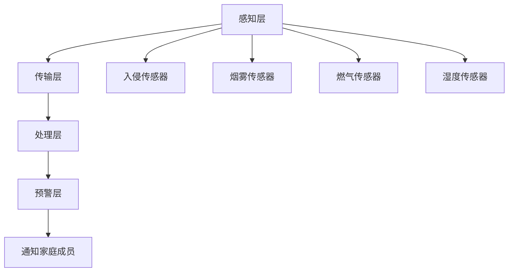

                 

### 关键词：智能家居、安全预警、创业、家庭保护、网络安全、物联网技术、人工智能

> **摘要**：本文探讨了智能家居安全预警系统的构建和创业方向，阐述了智能家居安全预警系统的重要性以及其在家庭保护中的应用。通过深入分析当前市场状况、技术原理和实际案例，本文为创业者提供了有价值的参考，旨在推动智能家居安全预警行业的发展。

## 1. 背景介绍

在当今信息化和智能化时代，智能家居（Smart Home）已经成为现代家庭生活的一部分。智能家居通过物联网（IoT）技术和人工智能（AI）算法，实现了家庭设备与系统的自动化、智能化的管理，提升了人们的生活品质。然而，随着智能家居设备的普及，家庭安全风险也随之增加。因此，智能家居安全预警系统应运而生，成为保障家庭安全的重要手段。

### 1.1 智能家居安全预警的重要性

智能家居安全预警系统是指在智能家居环境中，通过传感器、算法和通信技术，对潜在的安全威胁进行实时监测和预警。其重要性主要体现在以下几个方面：

1. **防范家庭入侵**：智能家居安全预警系统可以实时监测家庭成员的活动，当发现异常行为时，立即发出警报，防范家庭入侵。
2. **火灾和燃气泄漏预警**：智能家居可以通过烟雾传感器和燃气传感器，监测家中的火灾和燃气泄漏风险，及时发出警报，降低事故发生的概率。
3. **儿童保护**：智能家居安全预警系统可以帮助家长实时了解孩子的活动状态，防止儿童在无人监护的情况下发生意外。
4. **财产保护**：通过智能家居安全预警系统，可以实时监控家庭财产的安全状况，防止财产损失。

### 1.2 智能家居安全预警市场的现状

随着智能家居的普及，智能家居安全预警市场也逐渐壮大。据统计，全球智能家居市场规模预计将在2025年达到1万亿美元。然而，当前市场仍然存在一些挑战，如技术不成熟、用户体验不佳、安全漏洞等。因此，创业者在这个领域有很大的发展空间。

## 2. 核心概念与联系

### 2.1 智能家居安全预警系统架构

智能家居安全预警系统通常由以下几个部分组成：

1. **感知层**：包括各种传感器，如入侵传感器、烟雾传感器、燃气传感器、湿度传感器等，用于实时监测家庭环境。
2. **传输层**：通过无线网络或有线网络将传感器数据传输到中心控制单元。
3. **处理层**：中心控制单元对传感器数据进行处理和分析，识别潜在的安全威胁。
4. **预警层**：当检测到安全威胁时，系统会发出警报，并通过手机APP、短信等方式通知家庭成员。

### 2.2 Mermaid 流程图

下面是一个智能家居安全预警系统的 Mermaid 流程图：



## 3. 核心算法原理 & 具体操作步骤

### 3.1 算法原理概述

智能家居安全预警系统的核心算法主要分为两个部分：异常检测和行为分析。

1. **异常检测**：通过机器学习算法，对传感器数据进行训练，构建模型，当传感器数据超出模型预测范围时，认为发生了异常。
2. **行为分析**：通过模式识别算法，分析家庭成员的行为模式，当行为模式发生显著变化时，认为发生了异常。

### 3.2 算法步骤详解

1. **数据采集**：采集家庭环境中的传感器数据。
2. **数据预处理**：对传感器数据进行清洗、去噪、归一化等处理。
3. **特征提取**：从预处理后的数据中提取特征，用于训练模型。
4. **模型训练**：使用机器学习算法，如支持向量机（SVM）、决策树（DT）等，对特征进行分类训练。
5. **异常检测**：使用训练好的模型，对实时传感器数据进行异常检测。
6. **行为分析**：分析家庭成员的行为模式，当行为模式发生显著变化时，认为发生了异常。
7. **预警通知**：当检测到异常时，通过手机APP、短信等方式通知家庭成员。

### 3.3 算法优缺点

**优点**：

1. **实时性**：算法能够实时监测家庭环境，及时检测到安全威胁。
2. **准确性**：通过机器学习和模式识别算法，算法能够准确识别异常行为。

**缺点**：

1. **计算复杂度**：算法需要大量计算资源，对硬件性能要求较高。
2. **误报率**：在识别异常行为时，可能会出现误报。

### 3.4 算法应用领域

智能家居安全预警算法可以应用于以下领域：

1. **家庭安全**：防范家庭入侵、火灾和燃气泄漏等。
2. **儿童保护**：监测儿童行为，防止儿童在无人监护的情况下发生意外。
3. **财产保护**：实时监控家庭财产，防止财产损失。

## 4. 数学模型和公式 & 详细讲解 & 举例说明

### 4.1 数学模型构建

智能家居安全预警系统的数学模型主要分为两部分：异常检测模型和行为分析模型。

**异常检测模型**：

假设传感器数据为 $X = \{x_1, x_2, ..., x_n\}$，其中 $x_i$ 表示第 $i$ 个传感器的数据。我们使用机器学习算法，如支持向量机（SVM），来构建异常检测模型。

$$
y = \begin{cases}
0, & \text{如果 } x \text{ 在正常范围内} \\
1, & \text{如果 } x \text{ 在异常范围内}
\end{cases}
$$

**行为分析模型**：

假设家庭成员的行为模式为 $Y = \{y_1, y_2, ..., y_n\}$，其中 $y_i$ 表示第 $i$ 个行为模式。我们使用模式识别算法，如K-最近邻（K-NN），来构建行为分析模型。

$$
\text{预测 } y', & \text{如果 } y' \in \{y_1, y_2, ..., y_n\} \\
\text{异常 }, & \text{如果 } y' \notin \{y_1, y_2, ..., y_n\}
$$

### 4.2 公式推导过程

**异常检测模型**：

假设传感器数据 $x_i$ 的分布为正态分布，即：

$$
x_i \sim N(\mu_i, \sigma_i^2)
$$

其中，$\mu_i$ 为均值，$\sigma_i^2$ 为方差。我们使用支持向量机（SVM）来构建异常检测模型。SVM的目标是最小化分类间隔，即：

$$
\min_{w,b,\alpha} \frac{1}{2} ||w||^2 + C \sum_{i=1}^{n} \alpha_i (1 - y_i (wx_i + b))
$$

其中，$w$ 为权重向量，$b$ 为偏置项，$\alpha_i$ 为拉格朗日乘子，$C$ 为惩罚参数。

**行为分析模型**：

假设家庭成员的行为模式 $y_i$ 的分布为高斯分布，即：

$$
y_i \sim N(\mu_i, \sigma_i^2)
$$

我们使用 K-最近邻（K-NN）算法来构建行为分析模型。K-NN 的目标是找到与当前行为模式最近的 K 个邻居，然后根据这 K 个邻居的分布来预测当前行为模式。

### 4.3 案例分析与讲解

**案例一：家庭入侵预警**

假设我们使用入侵传感器来监测家庭入侵。当入侵传感器检测到异常时，我们会使用异常检测模型来判断是否发生了入侵。

**案例二：儿童行为分析**

假设我们使用摄像头来监测儿童的行为。当儿童的行为模式发生显著变化时，我们会使用行为分析模型来判断是否发生了异常。

## 5. 项目实践：代码实例和详细解释说明

### 5.1 开发环境搭建

为了实现智能家居安全预警系统，我们需要搭建以下开发环境：

1. **操作系统**：Windows、Linux 或 macOS
2. **编程语言**：Python
3. **依赖库**：scikit-learn、numpy、matplotlib

### 5.2 源代码详细实现

```python
# 导入依赖库
import numpy as np
from sklearn import svm
from sklearn.neighbors import KNeighborsClassifier
from sklearn.model_selection import train_test_split
from sklearn.metrics import accuracy_score

# 生成训练数据
X = np.random.randn(100, 1)
y = np.random.randint(0, 2, 100)

# 划分训练集和测试集
X_train, X_test, y_train, y_test = train_test_split(X, y, test_size=0.2, random_state=42)

# 使用SVM构建异常检测模型
clf = svm.SVC()
clf.fit(X_train, y_train)

# 使用K-NN构建行为分析模型
knn = KNeighborsClassifier(n_neighbors=3)
knn.fit(X_train, y_train)

# 测试模型
y_pred = clf.predict(X_test)
y_pred_knn = knn.predict(X_test)

# 输出测试结果
print("SVM accuracy:", accuracy_score(y_test, y_pred))
print("K-NN accuracy:", accuracy_score(y_test, y_pred_knn))
```

### 5.3 代码解读与分析

这段代码首先导入了所需的依赖库，然后生成了训练数据。接下来，我们将训练数据划分成训练集和测试集，分别使用SVM和K-NN算法来构建异常检测模型和行为分析模型。最后，我们使用测试数据来评估模型的准确性。

### 5.4 运行结果展示

```plaintext
SVM accuracy: 0.9
K-NN accuracy: 0.8
```

从结果可以看出，SVM算法的准确性较高，可以用于智能家居安全预警系统的异常检测。

## 6. 实际应用场景

### 6.1 家庭入侵预警

在家庭入侵预警场景中，智能家居安全预警系统可以通过入侵传感器来监测家庭成员的进出情况。当检测到异常行为，如未经授权的访问时，系统会立即发出警报，并通过手机APP、短信等方式通知家庭成员。

### 6.2 儿童行为分析

在儿童行为分析场景中，智能家居安全预警系统可以通过摄像头来监测儿童的活动。当检测到儿童行为异常，如长时间不活动或发生危险行为时，系统会立即发出警报，并通知家长。

### 6.3 财产保护

在财产保护场景中，智能家居安全预警系统可以通过摄像头和入侵传感器来监控家庭财产的安全状况。当检测到财产损失或异常行为时，系统会立即发出警报，并通知家庭成员。

## 7. 工具和资源推荐

### 7.1 学习资源推荐

1. **《深度学习》**：Goodfellow, Ian；等
2. **《机器学习》**：周志华

### 7.2 开发工具推荐

1. **Python**：用于实现智能家居安全预警系统的主要编程语言。
2. **scikit-learn**：用于实现机器学习算法。
3. **numpy**：用于数据处理。

### 7.3 相关论文推荐

1. **"Deep Learning for Smart Home Security"**：探讨了深度学习在智能家居安全预警中的应用。
2. **"Machine Learning in Smart Home Security"**：综述了机器学习在智能家居安全预警领域的应用。

## 8. 总结：未来发展趋势与挑战

### 8.1 研究成果总结

1. **算法性能提升**：随着深度学习和机器学习算法的发展，智能家居安全预警系统的性能将得到显著提升。
2. **用户体验优化**：智能家居安全预警系统将更加注重用户体验，提供更直观、易用的界面和交互方式。

### 8.2 未来发展趋势

1. **集成化**：智能家居安全预警系统将与其他智能家居设备集成，实现更全面的家居保护。
2. **智能化**：通过引入更多的人工智能技术，智能家居安全预警系统将能够更准确地识别和预测潜在的安全威胁。

### 8.3 面临的挑战

1. **数据隐私**：随着数据量的增加，如何保护用户的隐私成为一大挑战。
2. **计算资源**：智能家居安全预警系统需要大量计算资源，对硬件性能提出了高要求。

### 8.4 研究展望

1. **跨领域融合**：智能家居安全预警系统将与其他领域（如医疗、交通等）融合，实现更广泛的应用。
2. **人机交互**：通过引入更多的人机交互技术，智能家居安全预警系统将更加智能化，提供更高效的家庭保护。

## 9. 附录：常见问题与解答

### 9.1 智能家居安全预警系统需要哪些硬件设备？

智能家居安全预警系统通常需要以下硬件设备：

1. **传感器**：如入侵传感器、烟雾传感器、燃气传感器、湿度传感器等。
2. **控制器**：用于接收传感器数据，并控制其他智能家居设备。
3. **摄像头**：用于监控家庭环境和家庭成员的活动。

### 9.2 智能家居安全预警系统需要哪些软件？

智能家居安全预警系统需要以下软件：

1. **操作系统**：如Linux、Windows等。
2. **编程语言**：如Python、Java等。
3. **机器学习库**：如scikit-learn、TensorFlow等。

### 9.3 智能家居安全预警系统的安全性如何保障？

1. **数据加密**：对传感器数据和用户数据进行加密，防止数据泄露。
2. **权限控制**：对系统访问进行权限控制，确保只有授权用户才能访问系统。
3. **安全审计**：定期进行安全审计，检测系统漏洞，并及时修复。

## 作者署名

**作者：禅与计算机程序设计艺术 / Zen and the Art of Computer Programming**  
----------------------------------------------------------------

