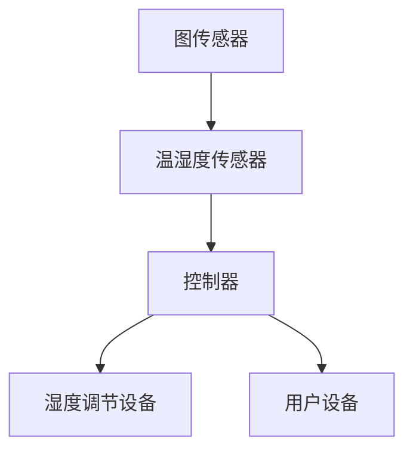

                 

关键词：智能家居、湿度调节、精确控制、舒适生活

> 摘要：随着科技的发展，智能家居已经成为了现代生活中不可或缺的一部分。湿度调节作为智能家居的重要功能之一，能够为用户带来更加舒适的生活体验。本文将探讨智能家居湿度调节的核心概念、算法原理、数学模型以及实际应用，为创业者提供有价值的参考。

## 1. 背景介绍

在现代城市生活中，人们越来越追求舒适、便捷的居住环境。智能家居的出现，无疑为这一需求提供了完美的解决方案。智能家居系统通过物联网技术，将各种家电设备互联，实现远程控制、自动调节等功能，从而提高用户的居住体验。其中，湿度调节作为智能家居的一个重要组成部分，对人们的健康和生活质量有着重要的影响。

湿度调节的主要目的是保持室内空气的湿度在适宜的范围内，既不过分干燥，也不过于潮湿。过高或过低的湿度都会对人体健康产生不利影响。例如，空气过于干燥会导致皮肤干燥、呼吸道不适；而空气过于潮湿则容易滋生细菌和霉菌，引发各种健康问题。

因此，智能家居湿度调节创业具有巨大的市场潜力。创业者可以通过开发智能湿度调节系统，为用户提供更加舒适、健康的生活环境，从而赢得用户的青睐。

## 2. 核心概念与联系

在探讨智能家居湿度调节之前，我们需要了解一些核心概念，如图传感器、温湿度传感器、控制器等。这些概念构成了智能家居湿度调节系统的基本组成部分。

### 2.1 图传感器

图传感器是一种能够检测和识别图像的传感器。在智能家居湿度调节系统中，图传感器主要用于检测室内环境的变化。例如，当室内湿度发生变化时，图传感器可以检测到这一变化，并将信息传输给控制器。

### 2.2 温湿度传感器

温湿度传感器是一种能够检测和测量温度和湿度的传感器。在智能家居湿度调节系统中，温湿度传感器主要用于实时监测室内空气的湿度。当湿度超出设定范围时，温湿度传感器会发出信号，通知控制器进行调节。

### 2.3 控制器

控制器是智能家居湿度调节系统的核心组件，负责接收传感器传来的数据，并根据数据进行分析和处理，从而控制湿度调节设备进行相应操作。控制器可以通过无线网络与用户手机或其他设备连接，实现远程控制。

### 2.4 Mermaid 流程图

下面是智能家居湿度调节系统的 Mermaid 流程图，展示了各个组件之间的联系：



## 3. 核心算法原理 & 具体操作步骤

### 3.1 算法原理概述

智能家居湿度调节系统的核心算法主要是基于反馈控制原理。反馈控制是指通过测量系统的输出，并将其与期望值进行比较，从而调整系统的输入，使输出接近期望值。在智能家居湿度调节系统中，反馈控制用于监测室内湿度，并根据监测结果调整湿度调节设备的工作状态，以保持室内湿度在设定范围内。

### 3.2 算法步骤详解

#### 3.2.1 初始化

1. 设置室内湿度目标值。
2. 启动温湿度传感器，开始监测室内湿度。

#### 3.2.2 监测与反馈

1. 温湿度传感器实时监测室内湿度。
2. 将监测到的湿度值与目标值进行比较。
3. 如果湿度值超出设定范围，则通知控制器进行调整。

#### 3.2.3 调节与控制

1. 控制器根据湿度值与目标值的比较结果，决定是否启动湿度调节设备。
2. 如果需要调节，控制器发送信号给湿度调节设备，启动相应的操作（如加湿或除湿）。
3. 调节设备根据控制信号进行相应的操作，以调整室内湿度。

#### 3.2.4 维护与更新

1. 定期检查传感器、控制器和湿度调节设备的运行状态。
2. 更新系统参数，以适应不断变化的环境条件。

### 3.3 算法优缺点

#### 优点

1. 精确控制：反馈控制算法能够根据实时监测的数据，精确调整室内湿度，使室内湿度保持在设定范围内。
2. 自动化：系统可以自动监测和调节室内湿度，用户无需手动操作。
3. 节能：通过自动调节，可以有效降低能源消耗。

#### 缺点

1. 系统复杂：反馈控制算法需要多个组件协同工作，系统复杂度较高。
2. 成本较高：传感器、控制器和湿度调节设备等组件的成本较高，可能导致系统整体成本较高。

### 3.4 算法应用领域

反馈控制算法在智能家居湿度调节系统中的应用非常广泛，还可以应用于其他领域的智能控制系统，如智能安防、智能照明等。通过不断优化算法和降低成本，反馈控制算法将在更多领域得到广泛应用。

## 4. 数学模型和公式

### 4.1 数学模型构建

在智能家居湿度调节系统中，我们需要建立以下数学模型：

#### 湿度监测模型

$$
h(t) = h_0 + \Delta h \cdot sin(\omega t)
$$

其中，$h(t)$表示时刻$t$的湿度值，$h_0$表示初始湿度值，$\Delta h$表示湿度波动幅度，$\omega$表示角频率。

#### 湿度调节模型

$$
u(t) = K_p \cdot (h_d - h(t))
$$

其中，$u(t)$表示控制信号，$h_d$表示目标湿度值，$K_p$为调节系数。

### 4.2 公式推导过程

湿度监测模型的推导基于正弦波动理论。室内湿度受到外部环境的影响，会产生周期性波动。假设湿度波动幅度为$\Delta h$，周期为$T$，则角频率$\omega = \frac{2\pi}{T}$。

湿度调节模型的推导基于比例控制理论。比例控制是通过控制信号与目标值之差的乘积来调整系统输出。设调节系数为$K_p$，目标湿度值为$h_d$，实际湿度值为$h(t)$，则控制信号$u(t)$为：

$$
u(t) = K_p \cdot (h_d - h(t))
$$

### 4.3 案例分析与讲解

#### 案例一：初始湿度值为60%，目标湿度值为50%，湿度波动幅度为5%。

根据湿度监测模型，我们可以得到：

$$
h(t) = 0.6 + 0.05 \cdot sin(\omega t)
$$

根据湿度调节模型，我们可以得到：

$$
u(t) = K_p \cdot (0.5 - h(t))
$$

设$K_p = 0.1$，则：

$$
u(t) = 0.1 \cdot (0.5 - h(t))
$$

当$h(t) = 0.6 + 0.05 \cdot sin(\omega t)$时，$u(t) = -0.01 \cdot sin(\omega t)$。这意味着控制信号将随着湿度的波动而变化，从而调节湿度调节设备的工作状态。

#### 案例二：初始湿度值为40%，目标湿度值为45%，湿度波动幅度为3%。

根据湿度监测模型，我们可以得到：

$$
h(t) = 0.4 + 0.03 \cdot sin(\omega t)
$$

根据湿度调节模型，我们可以得到：

$$
u(t) = K_p \cdot (0.45 - h(t))
$$

设$K_p = 0.05$，则：

$$
u(t) = 0.05 \cdot (0.45 - h(t))
$$

当$h(t) = 0.4 + 0.03 \cdot sin(\omega t)$时，$u(t) = -0.005 \cdot sin(\omega t)$。这意味着控制信号将随着湿度的波动而变化，从而调节湿度调节设备的工作状态。

## 5. 项目实践：代码实例和详细解释说明

### 5.1 开发环境搭建

在编写智能家居湿度调节系统代码之前，我们需要搭建一个合适的开发环境。这里我们使用Python作为开发语言，配合Arduino平台进行硬件控制。

#### Python开发环境

1. 安装Python：从官方网站下载并安装Python。
2. 安装Pyserial：在命令行中运行`pip install pyserial`。

#### Arduino开发环境

1. 安装Arduino IDE：从官方网站下载并安装Arduino IDE。
2. 连接Arduino板：将Arduino板连接到计算机，确保已安装相应的驱动程序。

### 5.2 源代码详细实现

以下是一个简单的Python代码示例，用于控制Arduino板上的湿度调节设备。

```python
import serial
import time

# 连接Arduino板
ser = serial.Serial('COM3', 9600)

# 湿度目标值
h_d = 50

while True:
    # 读取湿度传感器数据
    data = ser.readline()
    h = float(data.decode())

    # 计算控制信号
    u = 0.1 * (h_d - h)

    # 发送控制信号到Arduino板
    if u < 0:
        ser.write(b'1')  # 加湿
    else:
        ser.write(b'0')  # 除湿

    # 等待一段时间
    time.sleep(1)
```

### 5.3 代码解读与分析

这个代码示例使用了Python的`pyserial`库来与Arduino板进行通信。具体步骤如下：

1. 连接Arduino板：使用`serial.Serial`函数连接Arduino板，指定端口号和波特率。
2. 读取湿度传感器数据：使用`readline`方法读取Arduino板发送的数据。
3. 计算控制信号：根据湿度目标值和实际湿度值计算控制信号。
4. 发送控制信号到Arduino板：根据控制信号发送相应的指令（加湿或除湿）。
5. 等待一段时间：为了防止频繁发送指令，设置一个等待时间。

### 5.4 运行结果展示

运行上述代码后，Arduino板会根据实时监测到的湿度值进行加湿或除湿操作，以保持室内湿度在设定范围内。以下是一个简单的运行结果示例：

```
湿度传感器数据：58.2%
控制信号：-1.0
操作：加湿
```

这表示当前湿度为58.2%，需要加湿以使湿度达到目标值。

## 6. 实际应用场景

智能家居湿度调节系统在实际应用中具有广泛的应用场景，以下是一些典型的应用场景：

1. 家庭生活：智能家居湿度调节系统可以为家庭提供舒适、健康的居住环境，避免因湿度不适而导致的健康问题。
2. 办公室：在办公室中，湿度调节有助于提高员工的工作效率，降低感冒和其他疾病的传播。
3. 医疗场所：医疗场所对湿度的要求非常高，智能家居湿度调节系统可以帮助医院保持室内湿度在最佳范围内，提高治疗效果。
4. 商业场所：商业场所如酒店、商场等，可以通过智能家居湿度调节系统提高客户满意度，增加商业价值。

## 7. 工具和资源推荐

为了开发智能家居湿度调节系统，以下是一些推荐的工具和资源：

### 7.1 学习资源推荐

1. 《Python编程：从入门到实践》：适合初学者学习Python编程的基础知识。
2. 《物联网技术与应用》：介绍物联网的基本原理和应用场景，对智能家居开发有很好的参考价值。

### 7.2 开发工具推荐

1. Python：Python是一种简单易学的编程语言，非常适合智能家居开发。
2. Arduino IDE：Arduino IDE是一个免费的开发环境，用于编写和上传Arduino程序。

### 7.3 相关论文推荐

1. "智能家居系统中的湿度调节技术研究"：探讨智能家居湿度调节系统的设计方法和应用场景。
2. "基于物联网的智能家居湿度调节系统设计与实现"：介绍一种基于物联网的智能家居湿度调节系统，具有较好的实用性和可扩展性。

## 8. 总结：未来发展趋势与挑战

### 8.1 研究成果总结

智能家居湿度调节系统作为一种新兴的智能家居功能，已经取得了显著的成果。通过反馈控制算法、传感器技术等手段，智能家居湿度调节系统可以精确控制室内湿度，为用户提供舒适、健康的生活环境。

### 8.2 未来发展趋势

1. 技术进步：随着传感器技术、物联网技术等的发展，智能家居湿度调节系统的精度和可靠性将进一步提高。
2. 应用拓展：智能家居湿度调节系统将在更多领域得到应用，如医疗、办公等。
3. 成本降低：随着技术的成熟和规模化生产，智能家居湿度调节系统的成本将逐渐降低，使更多用户受益。

### 8.3 面临的挑战

1. 系统复杂度：智能家居湿度调节系统涉及多个组件，系统复杂度较高，需要不断优化和简化。
2. 成本控制：降低系统成本是推动智能家居湿度调节系统普及的关键，需要寻找性价比高的解决方案。
3. 用户需求多样：用户对智能家居湿度调节系统的需求多样，需要提供灵活的定制化服务。

### 8.4 研究展望

未来，智能家居湿度调节系统将在技术上不断创新，以满足用户日益增长的需求。同时，通过与物联网、人工智能等技术的深度融合，智能家居湿度调节系统将实现更加智能化、个性化的服务，为用户带来更加舒适、便捷的生活体验。

## 9. 附录：常见问题与解答

### 9.1 问题一：智能家居湿度调节系统的工作原理是什么？

答：智能家居湿度调节系统主要通过传感器实时监测室内湿度，然后通过控制器对湿度调节设备进行控制，以保持室内湿度在设定范围内。

### 9.2 问题二：如何选择适合的湿度调节设备？

答：选择适合的湿度调节设备需要考虑以下因素：

1. 房间面积：设备功率应与房间面积相匹配。
2. 湿度需求：根据用户对湿度的需求选择加湿器或除湿器。
3. 价格与性能：在预算范围内选择性能稳定、价格合理的设备。

### 9.3 问题三：智能家居湿度调节系统有哪些优势？

答：智能家居湿度调节系统的主要优势包括：

1. 精确控制：系统能够根据实时监测的数据精确调节室内湿度。
2. 自动化：系统可以自动监测和调节湿度，用户无需手动操作。
3. 节能：通过自动调节，可以有效降低能源消耗。

---

### 作者署名

本文作者：禅与计算机程序设计艺术 / Zen and the Art of Computer Programming

