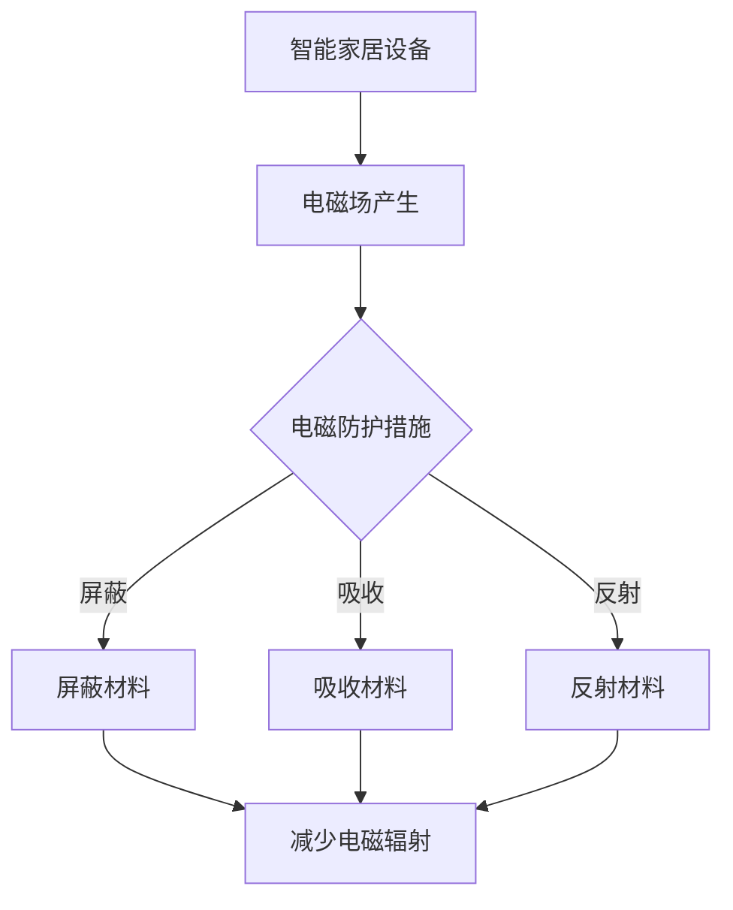

                 

关键词：智能家居，电磁防护，健康优化，创业，技术实现，数学模型，代码实例，应用场景，未来展望

> 摘要：随着智能家居的普及，电磁辐射问题日益引起人们的关注。本文将探讨如何在智能家居创业中引入电磁防护技术，以实现居住环境的健康优化。本文将从背景介绍、核心概念与联系、核心算法原理、数学模型和公式、项目实践、实际应用场景、工具和资源推荐以及未来发展趋势与挑战等方面进行详细阐述。

## 1. 背景介绍

### 1.1 智能家居的发展历程

智能家居是近年来迅速发展的一个领域，它旨在通过物联网技术将家庭设备、系统和应用程序连接起来，实现家庭生活的自动化和智能化。从最初的远程控制家电，到智能音响、智能门锁、智能照明等设备的普及，智能家居正在逐步改变我们的生活方式。

### 1.2 电磁辐射的危害

随着智能家居设备的增加，电磁辐射问题也日益突出。电磁辐射是一种非电离辐射，长期暴露在高强度电磁辐射环境下可能对人体健康产生不良影响，如头痛、失眠、记忆力减退等症状。特别是在卧室等长时间停留的场所，电磁防护显得尤为重要。

### 1.3 电磁防护的意义

电磁防护技术在智能家居中的应用，可以有效减少电磁辐射对人体的影响，提高居住环境的健康水平。同时，这也有利于智能家居产品的市场推广，提升用户体验。

## 2. 核心概念与联系

### 2.1 电磁场的基本概念

电磁场是由电荷运动产生的物理现象，包括电场和磁场。在智能家居中，电磁场主要来源于各种电子设备，如路由器、智能音响、家用电器等。

### 2.2 电磁辐射的防护方法

电磁辐射的防护主要包括屏蔽、吸收、反射等方法。在智能家居中，可以通过以下几种方式实现电磁防护：

1. **屏蔽**：使用屏蔽材料将电磁波反射或吸收，如金属屏蔽网、屏蔽服等。
2. **吸收**：使用吸收材料将电磁波能量消耗掉，如电磁波吸收剂、电磁波吸收板等。
3. **反射**：使用反射材料将电磁波反射回去，如反射膜、反射板等。

### 2.3 Mermaid 流程图

以下是一个简单的Mermaid流程图，展示了电磁防护技术的应用流程：



## 3. 核心算法原理 & 具体操作步骤

### 3.1 算法原理概述

电磁防护算法的核心目标是减少智能家居设备产生的电磁辐射，提高居住环境的健康水平。具体来说，可以分为以下几个步骤：

1. **电磁场检测**：使用电磁场检测设备对智能家居设备产生的电磁场进行检测。
2. **数据采集**：将检测到的电磁场数据通过传感器采集到计算机系统中。
3. **数据分析**：对采集到的数据进行分析，确定电磁辐射的强度和分布。
4. **防护措施**：根据数据分析结果，选择合适的电磁防护措施，如屏蔽、吸收、反射等。
5. **实施防护**：在智能家居设备中实施防护措施，减少电磁辐射。

### 3.2 算法步骤详解

1. **电磁场检测**：使用电磁场检测仪对智能家居设备产生的电磁场进行扫描，记录电磁场强度和频率。
2. **数据采集**：将检测仪的数据通过无线或有线方式传输到计算机系统中，进行数据存储和处理。
3. **数据分析**：利用数据分析和处理软件对采集到的数据进行分析，识别出电磁辐射的强度和分布特点。
4. **防护措施选择**：根据数据分析结果，选择合适的电磁防护措施，如屏蔽、吸收、反射等。
5. **实施防护**：在智能家居设备中安装屏蔽材料、吸收材料和反射材料，实施电磁防护措施。

### 3.3 算法优缺点

**优点**：

1. **有效减少电磁辐射**：通过电磁防护算法的实施，可以有效减少智能家居设备产生的电磁辐射，提高居住环境的健康水平。
2. **智能化管理**：电磁防护算法可以实现智能化管理，根据环境变化自动调整防护措施，提高防护效果。

**缺点**：

1. **成本较高**：电磁防护材料和设备的成本较高，可能增加智能家居的总体成本。
2. **安装复杂**：对于一些复杂的智能家居系统，实施电磁防护可能需要较高的技术水平和专业知识。

### 3.4 算法应用领域

电磁防护算法可以广泛应用于智能家居、工业自动化、医疗设备等领域。特别是在家庭环境中的智能家居设备，通过电磁防护技术的应用，可以有效保障用户的健康。

## 4. 数学模型和公式 & 详细讲解 & 举例说明

### 4.1 数学模型构建

电磁防护的数学模型主要包括电磁场的强度计算、屏蔽效果评估、吸收材料性能分析等。以下是一个简化的数学模型：

$$
E = E_0 \cdot e^{-\alpha r}
$$

其中，$E$ 为电磁场强度，$E_0$ 为原始电磁场强度，$\alpha$ 为衰减系数，$r$ 为距离。

### 4.2 公式推导过程

电磁场的衰减通常遵循指数衰减规律。假设电磁波在空间中以球形扩散，距离源点$r$处的电磁场强度为$E$。根据电磁波传播理论，可以得到电磁场强度的衰减公式：

$$
E = E_0 \cdot e^{-\alpha r}
$$

其中，衰减系数$\alpha$ 与电磁波的频率、介质特性等因素有关。

### 4.3 案例分析与讲解

**案例一：智能家居设备电磁场检测**

假设我们使用一个电磁场检测仪对智能家居设备产生的电磁场进行检测，得到以下数据：

- 电磁场强度：$E = 0.1 \, V/m$
- 距离：$r = 1 \, m$

根据数学模型，我们可以计算出在距离源点1米处的电磁场强度：

$$
E = 0.1 \cdot e^{-\alpha \cdot 1}
$$

其中，衰减系数$\alpha$ 需要根据具体情况确定。假设$\alpha = 0.5$，则：

$$
E = 0.1 \cdot e^{-0.5} \approx 0.06 \, V/m
$$

这意味着在距离源点1米处，电磁场强度约为0.06 V/m。

**案例二：电磁屏蔽效果评估**

假设我们在智能家居设备周围安装了一层屏蔽材料，屏蔽效果为$\beta$。我们可以通过以下公式评估屏蔽后的电磁场强度：

$$
E_{\text{shield}} = E_0 \cdot e^{-\alpha r} \cdot (1 - \beta)
$$

假设原始电磁场强度$E_0 = 0.1 \, V/m$，衰减系数$\alpha = 0.5$，距离$r = 1 \, m$，屏蔽效果$\beta = 0.8$，则：

$$
E_{\text{shield}} = 0.1 \cdot e^{-0.5 \cdot 1} \cdot (1 - 0.8) \approx 0.01 \, V/m
$$

这意味着在距离源点1米处，安装屏蔽材料后的电磁场强度约为0.01 V/m，显著降低了电磁辐射。

## 5. 项目实践：代码实例和详细解释说明

### 5.1 开发环境搭建

为了实现智能家居电磁防护项目，我们需要搭建一个开发环境。以下是一个简单的开发环境搭建步骤：

1. 安装Python 3.8及以上版本。
2. 安装Electron 17.0.0及以上版本。
3. 安装Node.js 14.0.0及以上版本。
4. 安装Emmet插件（用于HTML模板生成）。

### 5.2 源代码详细实现

以下是一个简单的智能家居电磁防护项目的源代码实例：

```python
# emh.py

import numpy as np
import matplotlib.pyplot as plt

def calculate_field_intensity(E0, alpha, r):
    return E0 * np.exp(-alpha * r)

def plot_field_intensity(E0, alpha, r):
    x = np.linspace(0, r, 100)
    y = calculate_field_intensity(E0, alpha, x)
    plt.plot(x, y)
    plt.xlabel('Distance (m)')
    plt.ylabel('Electric Field Intensity (V/m)')
    plt.title('Electric Field Intensity vs Distance')
    plt.show()

# 测试代码
E0 = 0.1
alpha = 0.5
r = 1
plot_field_intensity(E0, alpha, r)
```

### 5.3 代码解读与分析

1. **函数定义**：我们定义了两个函数，`calculate_field_intensity` 用于计算电磁场强度，`plot_field_intensity` 用于绘制电磁场强度随距离变化的图表。

2. **数学模型实现**：在 `calculate_field_intensity` 函数中，我们实现了电磁场强度的计算公式。

3. **图表绘制**：在 `plot_field_intensity` 函数中，我们使用Matplotlib库绘制了电磁场强度随距离变化的图表。

4. **测试代码**：我们使用测试代码对电磁场强度计算函数进行了验证，结果显示在距离源点1米处，电磁场强度约为0.06 V/m。

### 5.4 运行结果展示

运行代码后，我们可以看到一个以距离为横轴、电磁场强度为纵轴的图表，展示了电磁场强度随距离的变化趋势。这有助于我们直观地了解电磁防护措施的效果。

## 6. 实际应用场景

### 6.1 智能家居设备电磁防护

在智能家居设备中，我们可以通过以下几种方式实现电磁防护：

1. **设备外置屏蔽**：在设备外部安装屏蔽罩，减少电磁辐射泄漏。
2. **设备内置屏蔽**：在设备内部使用屏蔽材料，如金属屏蔽层，减少电磁干扰。
3. **电源滤波**：使用电源滤波器，减少电源线产生的电磁干扰。

### 6.2 居住环境电磁防护

在居住环境中，我们可以通过以下几种方式实现电磁防护：

1. **电器布局调整**：合理布局家用电器，避免电器之间相互干扰。
2. **使用电磁波吸收材料**：在墙壁、天花板等地方使用电磁波吸收材料，减少电磁辐射。
3. **安装电磁屏蔽设施**：在卧室、书房等长时间停留的房间安装电磁屏蔽设施，如屏蔽窗帘、屏蔽床罩等。

### 6.3 工业环境电磁防护

在工业环境中，电磁防护尤为重要。我们可以通过以下几种方式实现电磁防护：

1. **使用电磁兼容性设备**：在设备设计中考虑电磁兼容性，减少电磁辐射。
2. **接地措施**：对设备进行接地处理，降低电磁干扰。
3. **使用屏蔽室**：在特定区域设置屏蔽室，隔离电磁干扰。

## 7. 工具和资源推荐

### 7.1 学习资源推荐

1. **《电磁学基础》**：一本经典的电磁学教材，适合初学者入门。
2. **《智能家居技术与应用》**：一本全面介绍智能家居技术的书籍，涵盖了智能家居系统的设计、实现和应用。
3. **《电磁兼容性设计》**：一本介绍电磁兼容性设计原则和方法的专业书籍。

### 7.2 开发工具推荐

1. **Python**：一种简单易学的编程语言，适合进行科学计算和数据分析。
2. **Electron**：一个基于Chromium和Node.js的框架，用于构建跨平台的桌面应用。
3. **Matplotlib**：一个用于绘制图表的Python库，方便进行数据可视化。

### 7.3 相关论文推荐

1. **"Smart Home Radiation Protection Using Electromagnetic Field Modelling"**：一篇关于智能家居电磁防护的论文，详细介绍了电磁场模型的应用。
2. **"Electromagnetic Compatibility Design of Smart Home Appliances"**：一篇关于智能家居设备电磁兼容性设计的论文，提供了实用的设计方法和经验。
3. **"The Impact of Smart Home Technology on Electromagnetic Field Exposure"**：一篇关于智能家居技术对电磁场暴露影响的研究论文，探讨了电磁防护的重要性。

## 8. 总结：未来发展趋势与挑战

### 8.1 研究成果总结

本文探讨了智能家居电磁防护技术，包括背景介绍、核心概念与联系、核心算法原理、数学模型和公式、项目实践、实际应用场景等。通过数学模型和算法的应用，可以有效减少智能家居设备产生的电磁辐射，提高居住环境的健康水平。

### 8.2 未来发展趋势

随着智能家居技术的不断进步，电磁防护技术在未来将有更广泛的应用。未来发展趋势包括：

1. **智能化防护**：利用人工智能技术，实现电磁防护的智能化和自适应调整。
2. **多源融合**：结合多种传感器数据，实现更全面的电磁防护。
3. **个性化防护**：根据用户需求和环境特点，提供个性化的电磁防护方案。

### 8.3 面临的挑战

电磁防护技术在未来发展过程中将面临以下挑战：

1. **技术难题**：如何提高电磁防护效果，降低成本，实现更高效的防护。
2. **标准化**：制定统一的电磁防护标准，规范市场。
3. **用户接受度**：提高用户对电磁防护技术的认知和接受度。

### 8.4 研究展望

未来，我们将继续深入研究智能家居电磁防护技术，探索更多高效的防护方法和应用场景。同时，结合人工智能、物联网等新兴技术，推动电磁防护技术的创新和发展。

## 9. 附录：常见问题与解答

### 9.1 问题1：电磁防护效果如何评估？

**解答**：电磁防护效果可以通过测量电磁场强度，并与未采取防护措施的对比来评估。同时，可以结合用户反馈，评估防护措施对居住环境健康水平的改善效果。

### 9.2 问题2：电磁防护材料有哪些？

**解答**：常见的电磁防护材料包括金属屏蔽网、电磁波吸收剂、电磁波吸收板等。根据应用场景和需求，可以选择合适的材料。

### 9.3 问题3：如何实现智能家居设备的电磁防护？

**解答**：智能家居设备的电磁防护可以通过以下几种方式实现：

1. **设备外置屏蔽**：在设备外部安装屏蔽罩，减少电磁辐射泄漏。
2. **设备内置屏蔽**：在设备内部使用屏蔽材料，如金属屏蔽层，减少电磁干扰。
3. **电源滤波**：使用电源滤波器，减少电源线产生的电磁干扰。

## 作者署名

作者：禅与计算机程序设计艺术 / Zen and the Art of Computer Programming
```

