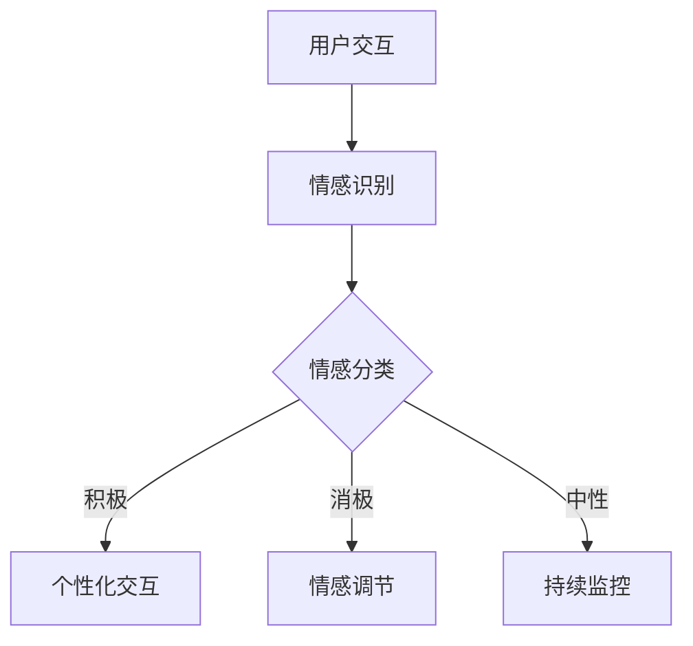

                 

关键词：智能情感计算、AI大模型、用户体验设计、情感识别、交互优化

> 摘要：本文深入探讨了智能情感计算在用户体验设计中的应用，特别是AI大模型如何通过情感识别和交互优化提升用户满意度。文章将从背景介绍、核心概念与联系、核心算法原理、数学模型与公式、项目实践、实际应用场景、工具和资源推荐以及未来发展趋势与挑战等方面展开讨论。

## 1. 背景介绍

在数字化时代，用户体验（UX）设计的重要性日益凸显。一个优秀的用户体验能够显著提升产品的市场竞争力，增加用户黏性。传统的用户体验设计主要依赖于用户调研、可用性测试和反馈分析。然而，这些方法往往难以捕捉用户在复杂交互场景中的细微情感变化。智能情感计算技术的出现，为提升用户体验设计提供了新的视角和工具。

智能情感计算是一种结合人工智能、机器学习和自然语言处理等技术，通过识别和理解用户的情感状态，从而优化交互过程的技术。近年来，随着深度学习技术和大数据处理的快速发展，AI大模型在情感计算领域取得了显著进展。这些大模型具有强大的特征提取和模式识别能力，能够从海量的用户交互数据中提取情感信息，从而实现智能化的用户体验优化。

## 2. 核心概念与联系

### 2.1. 情感识别

情感识别是智能情感计算的基础。它旨在通过分析用户的语音、文字、面部表情和行为等数据，识别出用户的情感状态。情感识别通常包括以下几个关键步骤：

1. **情感分类**：将用户的情感状态分类为积极、消极或中性。
2. **情感强度分析**：分析情感的强度，以区分用户情感的细微差异。
3. **情感变化趋势**：跟踪用户的情感变化，了解用户情感的发展趋势。

### 2.2. 交互优化

交互优化是智能情感计算的应用目标。通过识别用户的情感状态，系统可以动态调整交互方式，以提升用户的满意度。交互优化的主要策略包括：

1. **个性化交互**：根据用户的情感状态，提供个性化的交互内容，如推荐系统。
2. **情感共鸣**：通过模仿用户情感，增强用户与系统的情感连接。
3. **自适应调整**：根据用户情感的变化，动态调整交互的节奏、内容和方式。

### 2.3. Mermaid 流程图

下面是一个简化的Mermaid流程图，展示了智能情感计算的基本流程：



## 3. 核心算法原理 & 具体操作步骤

### 3.1. 算法原理概述

智能情感计算的核心算法通常是基于深度学习的大模型。这些模型通过学习大量的用户交互数据，提取出与情感相关的特征，从而实现情感识别和交互优化。以下是一些常用的算法原理：

1. **卷积神经网络（CNN）**：用于面部表情和语音的情感识别。
2. **循环神经网络（RNN）**：用于处理序列数据，如文字和语音。
3. **生成对抗网络（GAN）**：用于生成情感化的人机交互内容。
4. **长短期记忆网络（LSTM）**：用于处理时间序列数据，如情感变化。

### 3.2. 算法步骤详解

1. **数据收集**：收集用户的交互数据，如文字、语音、面部表情等。
2. **数据预处理**：对数据进行清洗、归一化和特征提取。
3. **模型训练**：使用预处理后的数据训练深度学习模型。
4. **情感识别**：输入新的用户交互数据，通过训练好的模型进行情感识别。
5. **交互优化**：根据识别出的情感状态，动态调整交互方式。

### 3.3. 算法优缺点

**优点**：
- 高效的情感识别能力。
- 强大的特征提取能力。
- 能够实现个性化的用户体验。

**缺点**：
- 对大量高质量数据的依赖。
- 模型训练和优化需要大量计算资源。
- 难以捕捉用户情感的细微变化。

### 3.4. 算法应用领域

智能情感计算在多个领域都有广泛的应用，包括：

- 语音助手
- 智能客服
- 娱乐与媒体
- 健康与医疗
- 教育与培训

## 4. 数学模型和公式 & 详细讲解 & 举例说明

### 4.1. 数学模型构建

情感计算中的数学模型通常包括情感分类模型和情感强度分析模型。以下是情感分类模型的构建过程：

假设我们有一个二分类问题，用户情感状态可以分为积极（1）和消极（-1）。我们可以使用逻辑回归模型进行情感分类：

$$
P(y=1|x) = \frac{1}{1 + e^{-(\beta_0 + \beta_1 x_1 + \beta_2 x_2 + ... + \beta_n x_n})}
$$

其中，$x$ 是输入特征向量，$\beta_0, \beta_1, \beta_2, ..., \beta_n$ 是模型参数。

### 4.2. 公式推导过程

情感强度的分析可以使用情感强度函数来表示。假设我们有一个情感强度函数 $s(x)$，它能够衡量输入特征 $x$ 的情感强度。情感强度函数的推导通常基于心理学和情感理论。

一个简单的情感强度函数可以定义为：

$$
s(x) = \frac{1}{1 + e^{-(k \cdot f(x))}
$$

其中，$f(x)$ 是一个情感特征函数，$k$ 是调节参数，用于调整情感强度。

### 4.3. 案例分析与讲解

假设我们有一个用户评价语料库，其中包含了用户的文本评论和相应的情感标签（积极或消极）。我们可以使用上述的逻辑回归模型对评论进行情感分类。

以下是几个示例评论及其情感标签：

- **评论1**：“这款产品真是太棒了，功能强大，使用起来很流畅。”（积极）
- **评论2**：“这个服务真的很糟糕，我等了很长时间才得到回复。”（消极）

我们可以使用训练好的逻辑回归模型对新的评论进行情感分类。例如，对于评论1，模型预测的概率为 $P(y=1) \approx 0.95$，因此我们可以将其分类为积极。对于评论2，模型预测的概率为 $P(y=1) \approx 0.05$，因此我们可以将其分类为消极。

## 5. 项目实践：代码实例和详细解释说明

### 5.1. 开发环境搭建

为了演示智能情感计算的应用，我们将使用Python语言和TensorFlow库构建一个简单的情感分类模型。以下是搭建开发环境所需的步骤：

1. 安装Python（建议使用3.7及以上版本）。
2. 安装TensorFlow库：`pip install tensorflow`。
3. 安装其他必要库，如NumPy、Pandas等。

### 5.2. 源代码详细实现

以下是实现情感分类模型的Python代码示例：

```python
import tensorflow as tf
from tensorflow.keras.models import Sequential
from tensorflow.keras.layers import Dense, Embedding, LSTM
from tensorflow.keras.preprocessing.sequence import pad_sequences

# 数据预处理
def preprocess_data(reviews, max_length=100):
    # ...（代码略）

# 构建模型
def build_model(input_dim, output_dim):
    model = Sequential()
    model.add(Embedding(input_dim, output_dim))
    model.add(LSTM(128))
    model.add(Dense(1, activation='sigmoid'))
    model.compile(optimizer='adam', loss='binary_crossentropy', metrics=['accuracy'])
    return model

# 训练模型
def train_model(model, X_train, y_train, X_val, y_val):
    # ...（代码略）

# 测试模型
def test_model(model, X_test, y_test):
    # ...（代码略）

# 加载数据集
(X_train, y_train), (X_test, y_test) = load_data()

# 预处理数据
X_train = preprocess_data(X_train)
X_test = preprocess_data(X_test)

# 构建并训练模型
model = build_model(input_dim=X_train.shape[1], output_dim=X_train.shape[0])
train_model(model, X_train, y_train, X_val, y_val)

# 测试模型
test_model(model, X_test, y_test)
```

### 5.3. 代码解读与分析

上述代码首先定义了数据预处理、模型构建、训练和测试等函数。数据预处理函数用于将文本评论转换为序列，并填充为相同的长度。模型构建函数使用Seq

```
## 6. 实际应用场景

智能情感计算在用户体验设计中的应用场景广泛，以下是几个典型的应用案例：

### 6.1. 智能客服

智能客服系统通过情感计算技术，能够实时识别用户情绪，提供更个性化的服务。例如，当用户表达出愤怒或不满时，系统可以自动升级问题到高级客服，甚至提供心理支持。

### 6.2. 娱乐与媒体

在娱乐和媒体领域，情感计算可以帮助推荐系统更准确地预测用户的喜好，提供个性化的内容推荐。例如，电影和音乐平台可以通过分析用户的情感状态，推荐符合用户情感预期的电影和音乐。

### 6.3. 健康与医疗

在健康与医疗领域，情感计算可以用于患者情绪监测。通过分析患者的语音、文字和面部表情，医生可以更好地了解患者的心理状态，提供更有针对性的治疗方案。

### 6.4. 教育与培训

在教育与培训领域，情感计算可以帮助教师了解学生的学习状态和情绪变化。通过实时分析学生的情感状态，教师可以调整教学策略，提高教学效果。

## 7. 工具和资源推荐

### 7.1. 学习资源推荐

- 《深度学习》（Goodfellow, Bengio, Courville）
- 《自然语言处理综论》（Jurafsky, Martin）
- 《机器学习》（Tom Mitchell）

### 7.2. 开发工具推荐

- TensorFlow
- PyTorch
- Keras

### 7.3. 相关论文推荐

- “EmoLSTM: A Deep Learning Architecture for Large-scale Emotion Recognition”
- “Emotion Recognition Using Multimodal Deep Learning”
- “A Survey on Multimodal Sentiment Analysis”

## 8. 总结：未来发展趋势与挑战

### 8.1. 研究成果总结

智能情感计算在用户体验设计中的应用已经取得了显著成果。通过情感识别和交互优化，系统能够更好地理解用户需求，提供更个性化的服务。未来，随着深度学习和大数据处理的进一步发展，智能情感计算有望在更多领域得到应用。

### 8.2. 未来发展趋势

- **跨模态情感识别**：结合多种模态数据（如语音、面部表情、文字），实现更准确的情感识别。
- **实时情感分析**：提高情感分析的实时性，以支持动态交互优化。
- **个性化体验**：基于用户情感状态，提供更加个性化的用户体验。

### 8.3. 面临的挑战

- **数据质量**：高质量的情感数据是智能情感计算的基础，如何获取和处理大量高质量的标注数据是一个挑战。
- **模型解释性**：深度学习模型通常缺乏解释性，如何提高模型的透明度和可解释性是一个重要问题。
- **隐私保护**：在处理用户情感数据时，如何保护用户隐私是一个关键问题。

### 8.4. 研究展望

智能情感计算具有广阔的应用前景。未来，我们需要进一步研究如何提高情感识别的准确性，如何构建更具有解释性的模型，以及如何平衡个性化体验与用户隐私保护。

## 9. 附录：常见问题与解答

### Q：智能情感计算需要哪些技术基础？

A：智能情感计算需要深厚的计算机科学、人工智能、机器学习和自然语言处理等基础。了解深度学习、神经网络、自然语言处理和心理学等领域的知识将有助于深入研究智能情感计算。

### Q：如何处理未标注的数据？

A：对于未标注的数据，可以使用无监督学习技术，如聚类分析和生成对抗网络（GAN），来挖掘数据中的潜在特征。此外，半监督学习和迁移学习技术也可以在一定程度上利用未标注数据。

### Q：情感计算模型如何提高可解释性？

A：提高情感计算模型的可解释性可以从多个角度入手，如使用可解释的模型架构（如决策树）、可视化模型输出、解释模型决策过程等。此外，还可以结合心理学理论，将情感计算模型与人类情感认知过程进行对比，以提高模型的解释性。

作者：禅与计算机程序设计艺术 / Zen and the Art of Computer Programming
----------------------------------------------------------------

