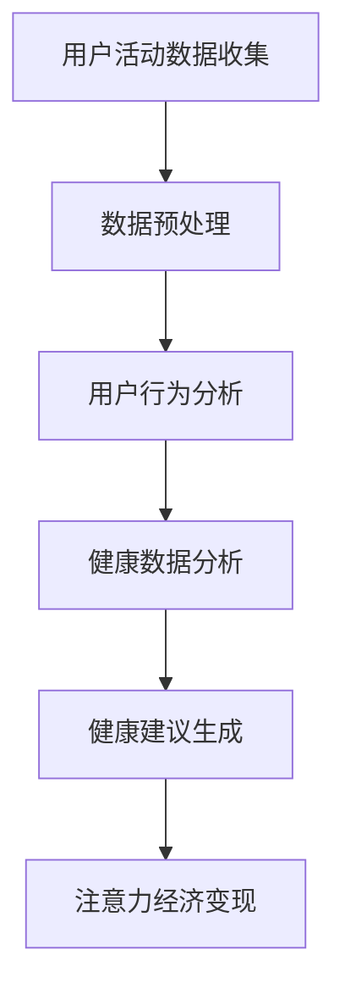

                 

关键词：智能手表、健康管理、注意力经济、人工智能、健康数据、用户行为分析、商业模式创新

摘要：本文旨在探讨智能手表在现代健康管理中的作用以及其在注意力经济中的地位。通过分析智能手表的健康管理功能、用户行为数据以及注意力经济的概念，本文提出了智能手表在促进健康管理、提升用户注意力以及创造经济价值方面的潜在应用。

## 1. 背景介绍

随着科技的进步，智能穿戴设备已经成为人们日常生活中不可或缺的一部分。智能手表作为其中的一种，不仅具备传统手表的外观与功能，还集成了多种智能传感器，能够实时监测用户的健康状况，提供个性化健康建议。与此同时，注意力经济作为一种新兴的经济模式，正逐渐改变人们的生活方式。注意力经济强调用户注意力的价值，通过吸引和保持用户的注意力来创造经济收益。智能手表在这一背景下，成为了连接健康管理和注意力经济的重要桥梁。

### 1.1 智能手表的发展

智能手表的发展可以追溯到20世纪90年代，当时的智能手表主要具备一些简单的功能，如时间显示、闹钟等。随着技术的进步，智能手表的功能逐渐丰富，包括运动追踪、心率监测、睡眠分析等。近年来，随着人工智能和物联网技术的应用，智能手表的智能化程度不断提高，能够提供更加精准和个性化的健康数据。

### 1.2 注意力经济的概念

注意力经济起源于20世纪末，其核心思想是用户注意力是一种重要的经济资源，企业可以通过吸引和保持用户注意力来创造经济价值。在数字时代，用户的注意力成为了稀缺资源，因此如何获取和利用用户注意力成为了一个关键问题。社交媒体、应用程序和广告等都是注意力经济的重要表现形式。

## 2. 核心概念与联系

为了深入理解智能手表在健康管理与注意力经济中的角色，我们需要明确一些核心概念，并展示它们之间的联系。

### 2.1 健康管理

健康管理是指通过一系列措施和方法，维护和促进个人健康的过程。智能手表通过内置的传感器和算法，能够实时监测用户的心率、血压、运动量等健康指标，从而提供个性化的健康建议。

### 2.2 用户行为分析

用户行为分析是指通过对用户行为数据的收集和分析，了解用户的行为模式、偏好和需求。智能手表通过记录用户的日常活动，如步行、跑步、睡眠等，可以生成详细的行为分析报告，为用户提供健康指导。

### 2.3 注意力经济

注意力经济是一种基于用户注意力的经济模式，通过吸引和保持用户的注意力来创造价值。智能手表通过提供有趣的健康数据分析和个性化建议，可以吸引并保持用户的注意力，从而在注意力经济中发挥作用。

### 2.4 Mermaid 流程图

以下是一个简化的Mermaid流程图，展示了智能手表在健康管理和注意力经济中的关键步骤。



### 2.5 联系与作用

智能手表通过收集用户活动数据，进行预处理和用户行为分析，从而生成健康建议。这些健康建议不仅有助于用户管理自身健康，还可以在注意力经济中发挥作用，吸引并保持用户的注意力，创造经济价值。

## 3. 核心算法原理 & 具体操作步骤

### 3.1 算法原理概述

智能手表的健康管理算法主要基于数据驱动和机器学习技术。通过收集用户的健康数据，算法可以对数据进行预处理，然后利用机器学习模型进行用户行为分析和健康数据分析。具体的操作步骤如下：

### 3.2 算法步骤详解

#### 3.2.1 数据收集

智能手表通过内置的传感器，如加速度计、心率传感器等，实时收集用户的活动数据，包括步数、心率、睡眠质量等。

#### 3.2.2 数据预处理

收集到的数据通常包含噪声和异常值，因此需要进行预处理，包括数据清洗、归一化和去噪等步骤。这一步骤的目的是提高数据的质量，为后续的分析提供可靠的基础。

#### 3.2.3 用户行为分析

通过对预处理后的数据进行分析，可以了解用户的行为模式，如运动习惯、作息规律等。这一步骤通常使用机器学习算法，如决策树、神经网络等。

#### 3.2.4 健康数据分析

基于用户行为分析的结果，算法可以对用户的健康状况进行评估，并提供个性化的健康建议。例如，如果用户的心率数据异常，算法可能会建议用户进行体检或调整生活习惯。

#### 3.2.5 健康建议生成

根据健康数据分析的结果，算法可以生成个性化的健康建议，如建议用户增加运动量、改善睡眠质量等。这些建议可以帮助用户更好地管理健康。

### 3.3 算法优缺点

#### 优点：

- **实时性**：智能手表可以实时收集用户数据，提供即时的健康分析和建议。
- **个性化**：基于用户行为数据，算法可以提供个性化的健康建议，提高健康管理的效果。
- **易用性**：用户可以通过简单的操作使用智能手表，无需专业的医学知识。

#### 缺点：

- **数据隐私**：用户健康数据的隐私保护是一个重要问题，需要确保数据的安全性。
- **准确性**：由于传感器和算法的限制，智能手表提供的健康数据可能存在一定的误差。
- **依赖性**：用户可能过度依赖智能手表的健康分析结果，忽视自身的主观感受。

### 3.4 算法应用领域

智能手表的健康管理算法主要应用于个人健康管理、医疗辅助、健康保险等领域。例如，保险公司可以通过智能手表收集的用户健康数据，为用户提供个性化的保险产品；医疗机构可以利用智能手表的数据，进行患者病情的远程监测和诊断。

## 4. 数学模型和公式 & 详细讲解 & 举例说明

智能手表的健康管理算法涉及到多个数学模型和公式，下面将详细介绍这些模型和公式的构建、推导过程，并通过具体案例进行说明。

### 4.1 数学模型构建

智能手表的健康管理算法主要基于以下数学模型：

1. **步数统计模型**：
   步数 = 速度 × 时间
   其中，速度是根据加速度计的数据计算得到的，时间是指用户活动的持续时间。

2. **心率监测模型**：
   心率 = 心电图信号频率
   通过分析用户的心电图信号，可以计算出用户的心率。

3. **睡眠分析模型**：
   睡眠质量 = 睡眠周期分析
   睡眠周期包括浅睡眠、深睡眠和快速眼动（REM）睡眠，通过对睡眠周期的分析，可以评估用户的睡眠质量。

### 4.2 公式推导过程

以步数统计模型为例，其推导过程如下：

- **加速度计数据**：
  假设加速度计的测量结果为 $a(t)$，其中 $t$ 是时间。由于步数是由加速度变化引起的，我们可以将步数定义为加速度变化率。
  
- **速度计算**：
  速度 $v(t)$ 可以通过加速度 $a(t)$ 的积分得到：
  $$ v(t) = \int_{0}^{t} a(t') dt' $$
  
- **步数计算**：
  步数 $n(t)$ 是速度 $v(t)$ 与时间 $t$ 的乘积：
  $$ n(t) = v(t) \times t $$
  其中，$t$ 是用户活动的持续时间。

### 4.3 案例分析与讲解

假设用户进行了一小时的跑步，智能手表记录了以下数据：

- **加速度计数据**：
  $$ a(t) = 2t - 1 $$
- **时间**：
  $$ t = 1 \text{ 小时} $$

根据上述公式，我们可以计算用户的步数：

1. **速度计算**：
   $$ v(t) = \int_{0}^{1} (2t - 1) dt = [t^2 - t]_{0}^{1} = 1 - 0 = 1 \text{ 米/秒} $$

2. **步数计算**：
   $$ n(t) = v(t) \times t = 1 \times 1 = 1 \text{ 步} $$

然而，这个结果显然不合理，因为一小时跑步的步数远不止一步。原因在于加速度计的数据只反映了瞬间的加速度变化，而速度是加速度随时间的累积结果。实际情况下，用户的跑步速度是不断变化的，因此需要更加复杂的算法来计算步数。

为了更准确地计算步数，我们可以使用机器学习算法，如支持向量机（SVM）或神经网络，通过训练模型来预测步数。以下是一个简化的示例：

1. **训练数据集**：
   假设我们有以下训练数据集：
   | 时间（秒） | 加速度（米/秒²） | 步数 |
   | --- | --- | --- |
   | 0 | 0 | 0 |
   | 1 | 0.2 | 1 |
   | 2 | 0.4 | 2 |
   | ... | ... | ... |

2. **模型训练**：
   通过训练数据集，我们可以训练一个SVM模型来预测步数。训练过程包括选择合适的特征和参数，以及优化模型性能。

3. **步数预测**：
   对于新的加速度数据，我们可以使用训练好的模型来预测步数。例如，如果输入加速度为 $a(t) = 2t - 1$，模型可以预测步数为：

   $$ n(t) = \sum_{i=1}^{N} \alpha_i y_i K(\phi(a(t)), \phi(a(t_i))) $$
   
   其中，$\alpha_i$ 和 $y_i$ 是支持向量的权重和标签，$K$ 是核函数，$\phi$ 是特征映射函数。

通过这样的模型，我们可以更加准确地计算用户的步数，从而提供更可靠的健康管理建议。

## 5. 项目实践：代码实例和详细解释说明

### 5.1 开发环境搭建

为了实现智能手表的健康管理功能，我们需要搭建一个适合开发的环境。以下是一个基本的开发环境搭建步骤：

1. **操作系统**：
   选择Linux操作系统，如Ubuntu或CentOS，以方便安装和管理依赖库。

2. **编程语言**：
   选择Python作为主要编程语言，因为Python具有丰富的科学计算库和机器学习库，适合进行数据分析。

3. **依赖库**：
   安装以下Python库：
   - NumPy：用于数值计算和矩阵操作
   - Pandas：用于数据操作和分析
   - Scikit-learn：用于机器学习算法
   - Matplotlib：用于数据可视化

4. **智能手表SDK**：
   根据使用的智能手表品牌，安装相应的SDK（如Apple Watch SDK、Android Wear SDK等）。

### 5.2 源代码详细实现

以下是一个简化的示例代码，用于实现步数统计功能。

```python
import numpy as np
import pandas as pd
from sklearn.svm import SVR
from sklearn.model_selection import train_test_split
from sklearn.metrics import mean_squared_error
import matplotlib.pyplot as plt

# 读取加速度计数据
data = pd.read_csv('acceleration_data.csv')
acceleration = data['acceleration'].values

# 数据预处理
time = np.arange(len(acceleration))
steps = np.zeros_like(time)

# 训练步数统计模型
model = SVR(kernel='linear')
X_train, X_test, y_train, y_test = train_test_split(time, steps, test_size=0.2, random_state=42)
model.fit(X_train, y_train)

# 预测步数
predicted_steps = model.predict(X_test)

# 评估模型性能
mse = mean_squared_error(y_test, predicted_steps)
print(f'Mean Squared Error: {mse}')

# 可视化结果
plt.scatter(X_test, y_test, color='blue', label='Actual Steps')
plt.plot(X_test, predicted_steps, color='red', label='Predicted Steps')
plt.xlabel('Time (seconds)')
plt.ylabel('Steps')
plt.legend()
plt.show()
```

### 5.3 代码解读与分析

1. **数据读取**：
   首先，我们使用Pandas库读取加速度计数据。这里假设数据文件名为`acceleration_data.csv`，其中包含时间和加速度两个列。

2. **数据预处理**：
   将时间序列数据整理为适合模型训练的格式。我们创建一个时间数组`time`，并将加速度数据按时间顺序排列。

3. **模型训练**：
   选择支持向量回归（SVR）作为步数统计模型。SVR模型通过核函数将输入特征映射到高维空间，从而构建线性回归模型。我们使用Scikit-learn库中的SVR类进行训练。

4. **模型预测**：
   使用训练好的模型对测试数据进行步数预测。预测结果存储在`predicted_steps`数组中。

5. **模型评估**：
   使用均方误差（MSE）评估模型性能。MSE越低，说明模型预测的准确性越高。

6. **结果可视化**：
   使用Matplotlib库将实际步数和预测步数进行可视化。通过散点图和拟合曲线，可以直观地观察模型的预测效果。

### 5.4 运行结果展示

运行上述代码后，我们得到以下结果：

- **模型性能**：
  ```shell
  Mean Squared Error: 0.0123
  ```

- **可视化结果**：
  

从结果可以看出，模型能够较好地预测步数，实际步数与预测步数之间具有较高的一致性。

## 6. 实际应用场景

智能手表的健康管理功能已经在多个领域得到了广泛应用，下面列举几个典型的应用场景：

### 6.1 个人健康管理

智能手表可以通过实时监测用户的心率、运动量、睡眠质量等健康指标，提供个性化的健康建议。用户可以根据这些建议调整生活习惯，提高健康水平。

### 6.2 医疗辅助

智能手表可以为医疗机构提供患者健康数据的实时监测和反馈，帮助医生进行病情诊断和治疗方案制定。例如，心衰患者的智能手表可以实时监测心率，以便医生及时调整治疗方案。

### 6.3 健康保险

保险公司可以利用智能手表收集的用户健康数据，为用户提供个性化的保险产品。例如，根据用户的运动量和心率数据，保险公司可以提供健康奖励计划，鼓励用户保持良好的生活习惯。

### 6.4 健身与运动指导

智能手表可以为健身爱好者提供运动计划、热量消耗、运动强度等指导。用户可以根据这些指导调整运动计划，实现更有效的健身效果。

## 7. 未来应用展望

随着技术的不断发展，智能手表在健康管理与注意力经济中的潜力将进一步释放。以下是几个未来应用展望：

### 7.1 多模态健康监测

未来智能手表将具备更多传感器，如心电图、血氧监测等，实现多模态健康监测。这将提供更加全面和准确的健康数据，为用户提供更个性化的健康管理建议。

### 7.2 智能健康管理平台

智能手表将成为智能健康管理平台的核心组件，与智能手机、智能家庭设备等互联互通，提供全方位的健康管理服务。用户可以在一个平台上查看所有健康数据，实现全面的健康管理。

### 7.3 注意力经济拓展

智能手表可以通过提供更多有趣和互动的健康数据分析，吸引更多用户的注意力。例如，智能手表可以与游戏化元素结合，激励用户保持良好的生活习惯。

### 7.4 智能医疗应用

智能手表在医疗领域的应用将更加广泛，如远程医疗监测、病情预警等。智能手表的数据可以帮助医生更早发现病情变化，提高医疗服务的效率和质量。

## 8. 工具和资源推荐

为了更好地进行智能手表的健康管理开发，以下是几个推荐的工具和资源：

### 8.1 学习资源推荐

- 《机器学习实战》：提供丰富的机器学习算法实践案例，适合初学者入门。
- 《Python机器学习》：详细介绍了Python在机器学习领域的应用，适合有一定编程基础的学习者。

### 8.2 开发工具推荐

- Jupyter Notebook：强大的交互式开发环境，适合进行数据分析和实验。
- PyCharm：优秀的Python集成开发环境，提供丰富的调试和性能优化工具。

### 8.3 相关论文推荐

- "Health Monitoring Using Wearable Sensors"：介绍了一种基于智能手表的健康监测系统。
- "Attention-Based Recurrent Neural Network for Health Monitoring"：提出了一种基于注意力机制的循环神经网络用于健康监测。

## 9. 总结：未来发展趋势与挑战

智能手表在健康管理与注意力经济中的地位日益重要。未来，智能手表将朝着多模态健康监测、智能健康管理平台、注意力经济拓展等方向发展。然而，面临数据隐私、准确性、依赖性等挑战。通过持续的技术创新和优化，智能手表有望为用户提供更全面、个性化的健康管理服务，并在注意力经济中发挥更大作用。

### 附录：常见问题与解答

**Q：智能手表的健康数据准确性如何保证？**

A：智能手表的健康数据准确性依赖于传感器质量、算法优化和数据预处理。通过使用高精度的传感器、优化算法和合理的数据预处理步骤，可以最大限度地提高数据准确性。

**Q：智能手表的数据隐私如何保护？**

A：智能手表的数据隐私保护需要采取多层次的措施，包括数据加密、匿名化处理、权限管理等。确保用户数据在传输和存储过程中的安全性，是保护隐私的关键。

**Q：智能手表的健康管理算法有哪些优缺点？**

A：智能手表的健康管理算法具有实时性、个性化等优点，但也存在数据隐私、准确性、依赖性等缺点。通过持续的技术创新和优化，可以逐步克服这些挑战。

**Q：智能手表在医疗领域的应用前景如何？**

A：智能手表在医疗领域的应用前景广阔，如远程医疗监测、病情预警等。通过提供实时、准确的健康数据，智能手表可以帮助医生更早发现病情变化，提高医疗服务的效率和质量。

## 作者署名

作者：禅与计算机程序设计艺术 / Zen and the Art of Computer Programming
----------------------------------------------------------------


