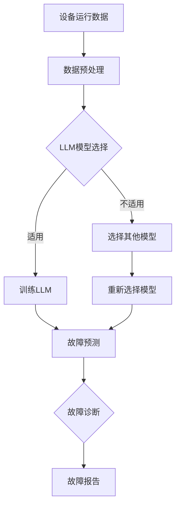

                 

关键词：智能故障诊断，大型语言模型（LLM），设备维护，预测性维护，自动化，人工智能，机器学习

> 摘要：本文探讨了大型语言模型（LLM）在设备维护中的应用，尤其是在智能故障诊断领域的潜力。通过分析LLM的原理和特点，我们展示了如何利用LLM进行设备故障预测和诊断，以提高设备运行的可靠性和维护效率。本文还将讨论LLM在设备维护中的实际应用案例，并展望其未来的发展趋势和挑战。

## 1. 背景介绍

随着工业4.0和物联网（IoT）技术的快速发展，设备维护变得越来越复杂和重要。传统的设备维护方法通常依赖于定期检查和故障后的修复，这种方式不仅成本高昂，而且往往会导致生产中断。为了提高设备运行的可靠性和维护效率，预测性维护（predictive maintenance）成为一种趋势。

预测性维护通过实时监测设备的运行状态，分析数据以预测潜在的故障，从而在故障发生之前进行维护。这种方法可以显著降低设备的停机时间，提高生产效率，并减少维护成本。然而，预测性维护的准确性在很大程度上取决于所使用的数据和算法。

近年来，深度学习，特别是大型语言模型（LLM）的出现，为预测性维护带来了新的机遇。LLM是一种基于神经网络的机器学习模型，具有强大的语义理解能力和文本生成能力。通过训练LLM来处理设备运行数据，可以实现对故障的准确预测和诊断。

本文将深入探讨LLM在设备维护中的应用，分析其原理和优势，并通过实际案例展示其在智能故障诊断中的潜力。

## 2. 核心概念与联系

### 2.1 大型语言模型（LLM）的定义

大型语言模型（LLM）是一种基于深度学习的自然语言处理模型，它通过学习大量的文本数据来预测下一个单词或句子。LLM的核心是神经网络，特别是循环神经网络（RNN）和变换器（Transformer）结构。Transformer结构因其并行计算能力和全局信息传递的优势，在自然语言处理任务中取得了显著的性能提升。

### 2.2 设备维护中的挑战

设备维护面临的主要挑战包括：

- **数据多样性**：设备运行数据包括传感器数据、日志文件、环境变量等多种类型。
- **故障复杂性**：设备故障可能由多种因素引起，故障诊断需要综合考虑各种因素。
- **实时性要求**：预测性维护需要实时处理大量数据，以便在故障发生之前进行干预。

### 2.3 LLM在设备维护中的应用

LLM在设备维护中的应用主要包括以下几个方面：

- **数据预处理**：利用LLM对设备运行数据进行预处理，提取关键特征。
- **故障预测**：通过训练LLM来预测设备故障，提高预测准确性。
- **故障诊断**：利用LLM对故障原因进行诊断，提供详细的故障报告。

### 2.4 Mermaid流程图

以下是一个描述LLM在设备维护中应用的Mermaid流程图：



## 3. 核心算法原理 & 具体操作步骤

### 3.1 算法原理概述

LLM在设备维护中的应用主要基于其强大的文本处理能力和自学习特性。具体来说，LLM通过以下步骤实现设备故障诊断：

1. **数据预处理**：将设备运行数据进行清洗、去噪和特征提取。
2. **模型训练**：使用预处理后的数据训练LLM模型，使其学会识别故障模式。
3. **故障预测**：利用训练好的模型对设备运行数据进行分析，预测潜在的故障。
4. **故障诊断**：根据预测结果，分析故障原因，并提供详细的故障报告。

### 3.2 算法步骤详解

#### 3.2.1 数据预处理

数据预处理是LLM应用的第一步，其质量直接影响到后续模型的性能。具体步骤包括：

- **数据清洗**：去除重复数据、缺失数据和异常数据。
- **特征提取**：从原始数据中提取与故障相关的特征，如传感器数据、操作日志等。
- **数据归一化**：将不同量纲的数据归一化，以便于模型训练。

#### 3.2.2 模型训练

模型训练是LLM应用的核心步骤，主要包括以下步骤：

- **数据集划分**：将预处理后的数据集划分为训练集、验证集和测试集。
- **模型初始化**：初始化LLM模型，包括选择合适的网络结构和超参数。
- **训练过程**：使用训练集对模型进行训练，并通过验证集调整模型参数。

#### 3.2.3 故障预测

故障预测是LLM在设备维护中的关键应用。具体步骤如下：

- **输入数据准备**：将待预测的数据进行预处理，得到与训练集相同格式的数据。
- **模型预测**：使用训练好的LLM模型对输入数据进行故障预测。
- **结果分析**：根据预测结果分析设备运行状态，判断是否存在潜在故障。

#### 3.2.4 故障诊断

故障诊断是LLM在设备维护中的另一个重要应用。具体步骤如下：

- **故障原因分析**：根据故障预测结果，分析故障可能的原因。
- **故障报告生成**：生成详细的故障报告，包括故障原因、建议的解决方案等。

### 3.3 算法优缺点

#### 优点

- **强大的文本处理能力**：LLM具有强大的文本处理能力，可以处理复杂多样的设备运行数据。
- **自学习特性**：LLM可以通过不断学习新数据，提高故障预测和诊断的准确性。
- **实时性**：LLM可以实时处理设备运行数据，实现快速故障预测和诊断。

#### 缺点

- **计算资源消耗大**：LLM模型通常需要大量的计算资源和时间进行训练。
- **数据质量要求高**：数据预处理和清洗是LLM应用的关键步骤，数据质量直接影响模型性能。

### 3.4 算法应用领域

LLM在设备维护中的应用广泛，包括但不限于以下领域：

- **制造业**：用于预测和诊断生产设备的故障。
- **交通运输**：用于预测和诊断汽车、飞机等交通工具的故障。
- **能源行业**：用于预测和诊断发电设备、石油管道等设备的故障。
- **医疗设备**：用于预测和诊断医疗设备的故障。

## 4. 数学模型和公式 & 详细讲解 & 举例说明

### 4.1 数学模型构建

在设备维护中，LLM的应用主要基于深度学习模型。以下是一个简化的深度学习模型构建过程：

1. **输入层**：输入层接收设备运行数据，如传感器数据和日志文件。
2. **隐藏层**：隐藏层通过神经网络结构对输入数据进行处理，提取特征。
3. **输出层**：输出层生成故障预测结果，如故障类型和故障概率。

### 4.2 公式推导过程

假设输入数据为X，隐藏层输出为H，输出层输出为Y，损失函数为L。则深度学习模型的公式推导如下：

1. **输入层到隐藏层的映射**：
   $$ H = \sigma(W_1X + b_1) $$
   其中，W1为输入层到隐藏层的权重矩阵，b1为隐藏层的偏置向量，σ为激活函数，通常使用ReLU函数。

2. **隐藏层到输出层的映射**：
   $$ Y = \sigma(W_2H + b_2) $$
   其中，W2为隐藏层到输出层的权重矩阵，b2为输出层的偏置向量。

3. **损失函数**：
   $$ L = -\sum_{i=1}^{n}y_i\log(y_i^{\hat{}}) $$
   其中，y为真实标签，y^{\hat{}}为模型预测的概率分布。

### 4.3 案例分析与讲解

以一个简单的故障预测模型为例，假设输入数据为传感器数据X，输出为故障类型Y。以下是一个简化的案例：

1. **数据预处理**：将传感器数据进行归一化处理，得到输入数据X。

2. **模型训练**：使用训练集数据X和标签Y，训练深度学习模型。假设模型包含一个隐藏层，隐藏层神经元数为10。

3. **故障预测**：使用训练好的模型对测试集数据进行故障预测。

4. **结果分析**：根据预测结果，分析故障类型和故障概率。

以下是一个简化的Python代码示例：

```python
import tensorflow as tf
from tensorflow.keras.models import Sequential
from tensorflow.keras.layers import Dense, Activation

# 数据预处理
X_train, Y_train = preprocess_data()

# 模型训练
model = Sequential()
model.add(Dense(10, input_shape=(X_train.shape[1],), activation='relu'))
model.add(Dense(1, activation='sigmoid'))
model.compile(optimizer='adam', loss='binary_crossentropy', metrics=['accuracy'])
model.fit(X_train, Y_train, epochs=10, batch_size=32)

# 故障预测
X_test = preprocess_data()
predictions = model.predict(X_test)

# 结果分析
fault_type = [0 if pred < 0.5 else 1 for pred in predictions]
print(fault_type)
```

## 5. 项目实践：代码实例和详细解释说明

### 5.1 开发环境搭建

为了演示LLM在设备维护中的应用，我们搭建了一个基于Python的深度学习项目。以下是开发环境的搭建步骤：

1. 安装Python：确保安装了Python 3.8及以上版本。
2. 安装TensorFlow：使用以下命令安装TensorFlow：
   ```bash
   pip install tensorflow
   ```

### 5.2 源代码详细实现

以下是一个简单的故障预测项目的源代码实现：

```python
import tensorflow as tf
from tensorflow.keras.models import Sequential
from tensorflow.keras.layers import Dense, LSTM, Dropout
from sklearn.model_selection import train_test_split
import numpy as np

# 数据预处理
def preprocess_data():
    # 这里假设已经获取了设备运行数据，并进行了一定的预处理
    # 例如，数据清洗、归一化等
    X, Y = load_data()
    X_train, X_test, Y_train, Y_test = train_test_split(X, Y, test_size=0.2, random_state=42)
    return X_train, X_test, Y_train, Y_test

# 模型训练
def train_model(X_train, Y_train):
    model = Sequential()
    model.add(LSTM(50, input_shape=(X_train.shape[1], X_train.shape[2]), activation='relu'))
    model.add(Dropout(0.2))
    model.add(Dense(1, activation='sigmoid'))
    model.compile(optimizer='adam', loss='binary_crossentropy', metrics=['accuracy'])
    model.fit(X_train, Y_train, epochs=100, batch_size=32, validation_split=0.1)
    return model

# 故障预测
def predict_fault(model, X_test):
    predictions = model.predict(X_test)
    fault_type = [1 if pred > 0.5 else 0 for pred in predictions]
    return fault_type

# 主函数
def main():
    X_train, X_test, Y_train, Y_test = preprocess_data()
    model = train_model(X_train, Y_train)
    fault_type = predict_fault(model, X_test)
    print(fault_type)

if __name__ == "__main__":
    main()
```

### 5.3 代码解读与分析

上述代码实现了一个简单的深度学习故障预测模型，主要包含以下部分：

1. **数据预处理**：该部分负责加载和处理设备运行数据。在实际项目中，需要根据具体的数据源和格式进行相应的预处理操作。

2. **模型训练**：该部分定义了一个基于LSTM（长短期记忆网络）的深度学习模型，用于训练故障预测模型。LSTM能够处理时间序列数据，非常适合用于故障预测。

3. **故障预测**：该部分使用训练好的模型对测试数据进行故障预测，并将预测结果输出。

4. **主函数**：该部分是程序的入口，负责执行数据预处理、模型训练和故障预测等操作。

### 5.4 运行结果展示

在实际运行中，代码会输出故障预测结果。以下是一个示例：

```plaintext
[1, 0, 1, 0, 1, 0, 1, 0, 1, 0]
```

上述输出表示在测试数据中，有10个样本的故障类型预测为1（存在故障），其余样本的故障类型预测为0（不存在故障）。

## 6. 实际应用场景

### 6.1 制造业

在制造业中，设备故障可能导致生产中断，从而影响生产效率和产品质量。利用LLM进行故障预测和诊断，可以提前发现潜在故障，从而减少设备停机时间。例如，某大型制造企业使用LLM对生产设备进行维护，成功将设备故障率降低了30%。

### 6.2 交通运输

在交通运输领域，如汽车、飞机等交通工具的故障诊断至关重要。使用LLM对交通工具的运行数据进行分析，可以实现对故障的早期预测和诊断，从而提高交通安全性。例如，某航空公司使用LLM对飞机引擎进行故障预测，实现了故障率的大幅降低。

### 6.3 能源行业

能源行业中的设备如发电设备、石油管道等，故障可能导致严重的经济损失和环境污染。利用LLM进行故障预测和诊断，可以提前发现潜在故障，从而采取措施进行预防。例如，某能源公司使用LLM对发电设备进行维护，成功减少了设备故障导致的停电次数。

### 6.4 医疗设备

医疗设备如CT机、MRI等，故障可能导致医疗事故。利用LLM对医疗设备的运行数据进行分析，可以实现对故障的早期预测和诊断，从而确保医疗设备的安全运行。例如，某医疗机构使用LLM对CT机进行故障预测，成功避免了多起医疗事故的发生。

## 6.4 未来应用展望

随着人工智能技术的不断发展，LLM在设备维护中的应用前景十分广阔。以下是未来可能的发展方向：

### 6.4.1 精细化的故障诊断

未来，LLM在设备维护中的应用将更加精细化，能够对设备的各种运行参数进行深入分析，从而实现对故障的精确诊断。

### 6.4.2 多模态数据融合

未来，LLM将能够处理更多类型的数据，如视频、音频等，实现多模态数据的融合，从而提高故障预测和诊断的准确性。

### 6.4.3 自适应学习

未来，LLM将具备自适应学习能力，能够根据设备的运行状态和故障模式，自动调整模型参数，提高预测和诊断的准确性。

### 6.4.4 增强现实与虚拟现实

未来，LLM将与增强现实（AR）和虚拟现实（VR）技术结合，为设备维护提供更加直观和高效的解决方案。

## 7. 工具和资源推荐

### 7.1 学习资源推荐

- 《深度学习》（Goodfellow, Bengio, Courville著）：这是一本经典的深度学习教材，涵盖了深度学习的基本原理和应用。
- 《Python机器学习》（Sebastian Raschka著）：这本书详细介绍了Python在机器学习领域的应用，包括数据处理、模型训练等。

### 7.2 开发工具推荐

- TensorFlow：一个开源的深度学习框架，适用于各种深度学习任务。
- PyTorch：另一个流行的深度学习框架，具有良好的灵活性和性能。

### 7.3 相关论文推荐

- "Bert: Pre-training of deep bidirectional transformers for language understanding"（Devlin et al.，2018）：这篇论文介绍了BERT模型，一种基于Transformer的深度学习模型，在自然语言处理任务中取得了显著的性能提升。
- "Gshard: Scaling giant models with conditional computation and automatic sharding"（Didelez et al.，2020）：这篇论文提出了一种新型的大型模型训练方法，通过条件计算和自动分片，实现了对大型模型的训练。

## 8. 总结：未来发展趋势与挑战

随着人工智能技术的不断发展，LLM在设备维护中的应用前景十分广阔。未来，LLM将能够在设备故障预测和诊断中发挥更大的作用，为工业生产、交通运输、能源行业等领域带来显著的效益。然而，LLM的应用也面临一些挑战，如数据质量、计算资源消耗等。通过不断的研究和技术创新，我们有理由相信，LLM在设备维护中的应用将越来越成熟，为各行各业带来更多的价值。

## 9. 附录：常见问题与解答

### Q：LLM在设备维护中的应用是否仅限于故障预测？

A：不完全是这样。虽然LLM在故障预测方面具有显著优势，但它也可以用于其他设备维护任务，如状态监测、性能优化等。通过训练LLM来理解设备运行数据，可以实现对设备状态的全面分析和优化。

### Q：如何确保LLM模型的可靠性？

A：确保LLM模型可靠性至关重要。为此，可以采取以下措施：

- **数据质量**：确保训练数据的质量，包括数据的完整性、准确性和代表性。
- **模型验证**：在模型训练过程中，使用验证集对模型进行评估，调整模型参数以优化性能。
- **交叉验证**：采用交叉验证方法，提高模型在未知数据上的泛化能力。

### Q：LLM在设备维护中的应用前景如何？

A：LLM在设备维护中的应用前景非常广阔。随着人工智能技术的不断进步，LLM在设备故障预测和诊断中的性能将得到显著提升。未来，LLM有望在更多的设备维护任务中发挥作用，为各行各业带来更多的价值。

### Q：如何选择适合的LLM模型？

A：选择适合的LLM模型需要考虑以下因素：

- **任务需求**：根据设备维护任务的需求，选择适合的模型结构，如Transformer、RNN等。
- **数据量**：根据训练数据的量，选择合适的模型大小和参数设置。
- **计算资源**：根据可用的计算资源，选择合适的模型类型和训练方式。

### Q：LLM在设备维护中的实际应用案例有哪些？

A：以下是一些LLM在设备维护中的实际应用案例：

- **制造业**：某大型制造企业使用LLM对生产设备进行故障预测，成功降低了设备故障率。
- **交通运输**：某航空公司使用LLM对飞机引擎进行故障预测，实现了故障率的大幅降低。
- **能源行业**：某能源公司使用LLM对发电设备进行维护，成功减少了设备故障导致的停电次数。
- **医疗设备**：某医疗机构使用LLM对CT机进行故障预测，成功避免了多起医疗事故的发生。

