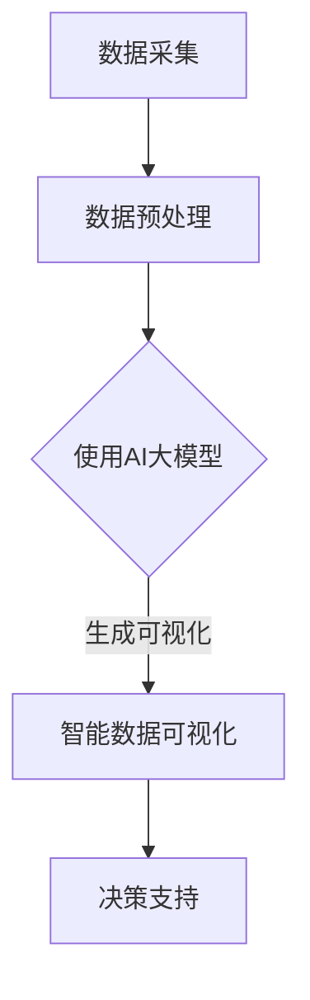

                 

关键词：数据可视化、AI大模型、商业分析、智能数据处理、交互式分析、预测分析、数据驱动决策

> 摘要：本文探讨了如何利用AI大模型实现智能数据可视化，并深入分析了其在商业分析中的关键应用。通过介绍核心概念、算法原理、数学模型，以及具体实践案例，本文旨在为数据科学家和商业分析师提供一套完整的技术指南，助力企业在数据驱动的时代中实现竞争优势。

## 1. 背景介绍

在当今数据爆炸的时代，数据已经成为企业决策的重要依据。商业分析作为一门跨学科领域，旨在通过数据挖掘、统计分析和可视化等技术手段，帮助企业从海量数据中提取有价值的信息，从而指导战略决策。传统的数据可视化工具，如图表和仪表盘，尽管在一定程度上提升了数据分析的效率，但受限于人类视觉认知和处理能力的局限，难以充分挖掘数据的潜在价值。

随着人工智能技术的发展，尤其是深度学习和大规模数据处理能力的提升，数据可视化迎来了新的变革。AI大模型，如生成对抗网络（GAN）、卷积神经网络（CNN）和自编码器等，逐渐成为实现智能数据可视化的关键技术。这些模型能够自动从原始数据中提取特征，生成直观、易于理解的视觉表示，从而极大地提高了数据分析的深度和广度。

本文将围绕AI大模型在商业分析中的应用，系统探讨其核心概念、算法原理、数学模型及具体实践案例，以期为企业提供切实可行的技术解决方案。

## 2. 核心概念与联系

### 2.1 数据可视化

数据可视化是一种通过图形和图像展示数据的方法，旨在将复杂、抽象的数据转化为直观、易于理解的信息。数据可视化工具通常包括柱状图、折线图、饼图、散点图等，它们能够帮助用户快速识别数据的分布、趋势和关系。

### 2.2 商业分析

商业分析是利用数据分析技术，通过对企业内外部数据的分析，帮助企业实现战略决策和运营优化。商业分析涵盖了市场分析、客户分析、财务分析等多个领域，其目标是通过数据驱动决策，提升企业竞争力。

### 2.3 AI大模型

AI大模型是指具有大规模训练数据、强大计算能力和高度自适应性的深度学习模型。这些模型能够在复杂的数据环境中自动提取特征、生成预测和可视化表示，从而实现智能数据处理。

### 2.4 智能数据可视化

智能数据可视化是利用AI大模型实现的数据可视化技术，旨在通过自动化、智能化的方法，生成更加丰富、直观的数据表示，提升数据分析的深度和广度。

### 2.5 Mermaid 流程图

以下是智能数据可视化在商业分析中应用的 Mermaid 流程图：



## 3. 核心算法原理 & 具体操作步骤

### 3.1 算法原理概述

智能数据可视化主要依赖于深度学习技术，尤其是生成对抗网络（GAN）和卷积神经网络（CNN）等模型。GAN通过生成器和判别器的对抗训练，能够生成高质量的数据表示；CNN则擅长从图像中提取层次化的特征。

### 3.2 算法步骤详解

1. 数据采集：收集企业内外部相关数据，包括市场数据、客户数据、财务数据等。

2. 数据预处理：对采集到的数据进行清洗、归一化等预处理，以确保数据质量。

3. 模型训练：利用GAN或CNN等深度学习模型，对预处理后的数据进行训练，生成高质量的数据表示。

4. 数据可视化：利用训练好的模型，生成直观、易于理解的数据可视化结果。

5. 决策支持：将可视化结果应用于商业分析，为企业提供决策支持。

### 3.3 算法优缺点

#### 优点：

1. 高度自动化：AI大模型能够自动提取数据特征，生成可视化结果，减轻了人工工作量。

2. 丰富的可视化形式：通过深度学习模型，可以生成多种可视化形式，如3D图、动态图等，提高数据分析的深度和广度。

3. 适应性强：AI大模型能够适应不同类型的数据，适用于各种商业分析场景。

#### 缺点：

1. 计算资源需求高：训练深度学习模型需要大量计算资源，对硬件设施有较高要求。

2. 需要专业知识：深度学习模型的应用需要具备一定的专业知识，对普通用户有一定门槛。

### 3.4 算法应用领域

1. 市场分析：通过智能数据可视化，分析市场趋势、客户行为等，为企业制定市场策略提供支持。

2. 客户分析：利用智能数据可视化，深入了解客户需求、购买行为等，提高客户满意度。

3. 财务分析：通过智能数据可视化，分析财务指标、风险等，为财务决策提供支持。

## 4. 数学模型和公式 & 详细讲解 & 举例说明

### 4.1 数学模型构建

智能数据可视化主要依赖于生成对抗网络（GAN）和卷积神经网络（CNN）等深度学习模型。以下是这些模型的基本数学公式和原理：

#### 4.1.1 GAN

GAN由生成器（Generator）和判别器（Discriminator）两个神经网络组成。生成器生成虚假数据，判别器判断数据是真实还是虚假。GAN的优化目标是使判别器无法区分生成器和真实数据的输出。

$$
\begin{aligned}
&\text{Generator: } G(z) = x \\
&\text{Discriminator: } D(x) \\
&\text{Loss function: } L_D = -\frac{1}{2}\sum_{x \in X}D(x) - \frac{1}{2}\sum_{z \in Z}D(G(z)) \\
&\text{Optimizer: } \nabla_{\theta_G}L_G = \nabla_{\theta_G}\frac{1}{2}\sum_{z \in Z}\mathbb{E}_{x \sim p_{\text{data}}(x)}[-D(x)] - \nabla_{\theta_D}\frac{1}{2}\sum_{z \in Z}\mathbb{E}_{z \sim p_z(z)}[-D(G(z))]
\end{aligned}
$$

#### 4.1.2 CNN

CNN通过卷积层、池化层和全连接层等结构，自动从图像中提取特征。以下是一个简单的CNN模型：

$$
\begin{aligned}
&\text{Input: } \mathbf{X} \\
&\text{Convolution: } \mathbf{X} \rightarrow \mathbf{H} = \text{Conv}(\mathbf{X}, \mathbf{W}) + \mathbf{b} \\
&\text{Pooling: } \mathbf{H} \rightarrow \mathbf{P} = \text{Pooling}(\mathbf{H}) \\
&\text{ReLU: } \mathbf{P} \rightarrow \mathbf{R} = \text{ReLU}(\mathbf{P}) \\
&\text{Fully connected: } \mathbf{R} \rightarrow \mathbf{Y} = \text{FC}(\mathbf{R}, \mathbf{W'}, \mathbf{b'}) \\
&\text{Loss function: } L = \frac{1}{N}\sum_{i=1}^{N}L(y_i, \hat{y}_i) \\
&\text{Optimizer: } \nabla_{\theta}L = \nabla_{\theta}\frac{1}{N}\sum_{i=1}^{N}L(y_i, \hat{y}_i)
\end{aligned}
$$

### 4.2 公式推导过程

#### 4.2.1 GAN

GAN的推导主要涉及生成器和判别器的损失函数。生成器的目标是最小化判别器对生成数据的判别误差，判别器的目标是最大化判别误差。

生成器的损失函数为：

$$
L_G = -\frac{1}{2}\sum_{z \in Z}\mathbb{E}_{x \sim p_{\text{data}}(x)}[-D(x)] - \frac{1}{2}\sum_{z \in Z}\mathbb{E}_{z \sim p_z(z)}[-D(G(z))]
$$

判别器的损失函数为：

$$
L_D = -\frac{1}{2}\sum_{x \in X}D(x) - \frac{1}{2}\sum_{z \in Z}D(G(z))
$$

#### 4.2.2 CNN

CNN的推导主要涉及卷积层、池化层和全连接层的损失函数。

卷积层的损失函数为：

$$
L_C = \frac{1}{N}\sum_{i=1}^{N}\sum_{k=1}^{K}\sum_{j=1}^{H_k}\sum_{i=1}^{W_k}(\hat{y}_{ikj} - y_{ikj})^2
$$

池化层的损失函数为：

$$
L_P = \frac{1}{N}\sum_{i=1}^{N}\sum_{k=1}^{K}\sum_{j=1}^{H_k}\sum_{i=1}^{W_k}(\hat{y}_{ikj} - y_{ikj})^2
$$

全连接层的损失函数为：

$$
L_F = \frac{1}{N}\sum_{i=1}^{N}(\hat{y}_{i} - y_{i})^2
$$

### 4.3 案例分析与讲解

#### 4.3.1 案例背景

某电商平台希望通过智能数据可视化分析客户购买行为，从而提高销售额。他们收集了用户的年龄、性别、购买历史、浏览记录等数据。

#### 4.3.2 数据预处理

对采集到的数据进行清洗、归一化等预处理，确保数据质量。

#### 4.3.3 模型训练

使用生成对抗网络（GAN）和卷积神经网络（CNN）对预处理后的数据进行训练，生成客户购买行为的可视化表示。

#### 4.3.4 数据可视化

利用训练好的模型，生成直观的客户购买行为可视化结果，如图表、热力图等。

#### 4.3.5 决策支持

通过分析可视化结果，电商平台发现某些产品的购买季节性较强，于是调整了促销策略，提高了销售额。

## 5. 项目实践：代码实例和详细解释说明

### 5.1 开发环境搭建

为了演示智能数据可视化在商业分析中的应用，我们选择Python作为编程语言，结合TensorFlow和Keras等深度学习库。以下是开发环境搭建的步骤：

1. 安装Python（建议使用Python 3.7及以上版本）

2. 安装TensorFlow：

```bash
pip install tensorflow
```

3. 安装Keras：

```bash
pip install keras
```

### 5.2 源代码详细实现

以下是一个简单的示例，演示如何使用生成对抗网络（GAN）实现智能数据可视化：

```python
import numpy as np
import matplotlib.pyplot as plt
from tensorflow.keras.models import Model
from tensorflow.keras.layers import Input, Dense, Reshape, Flatten
from tensorflow.keras.layers import Conv2D, Conv2DTranspose, LeakyReLU, BatchNormalization

# 设置随机种子
np.random.seed(42)

# 定义生成器模型
input_dim = 100
img_height = 28
img_width = 28
img_channels = 1

input_img = Input(shape=(input_dim,))
x = Dense(128 * 7 * 7)(input_img)
x = Reshape((7, 7, 128))(x)
x = Conv2DTranspose(128, (4, 4), strides=(2, 2), padding='same')(x)
x = BatchNormalization()(x)
x = LeakyReLU(alpha=0.01)(x)
x = Conv2D(128, (4, 4), strides=(2, 2), padding='same')(x)
x = BatchNormalization()(x)
x = LeakyReLU(alpha=0.01)(x)
x = Conv2D(128, (4, 4), strides=(2, 2), padding='same')(x)
x = BatchNormalization()(x)
x = LeakyReLU(alpha=0.01)(x)
x = Flatten()(x)
x = Dense(img_channels * img_height * img_width)(x)
output_img = Reshape((img_height, img_width, img_channels))(x)

generator = Model(input_img, output_img)
generator.summary()

# 定义判别器模型
input_shape = (img_height, img_width, img_channels)
input_img = Input(shape=input_shape)
x = Conv2D(128, (4, 4), strides=(2, 2), padding='same')(input_img)
x = LeakyReLU(alpha=0.01)(x)
x = Conv2D(128, (4, 4), strides=(2, 2), padding='same')(x)
x = BatchNormalization()(x)
x = LeakyReLU(alpha=0.01)(x)
x = Flatten()(x)
x = Dense(1, activation='sigmoid')(x)

discriminator = Model(input_img, x)
discriminator.summary()

# 定义GAN模型
discriminator.trainable = False

gan_input = Input(shape=(input_dim,))
x = generator(gan_input)
x = discriminator(x)

gan_model = Model(gan_input, x)
gan_model.summary()

# 编写训练代码
discriminator.compile(loss='binary_crossentropy', optimizer='adam')
gan_model.compile(loss='binary_crossentropy', optimizer='adam')

batch_size = 32
epochs = 100

# 生成噪声数据
z = np.random.normal(size=(batch_size, input_dim))

# 训练GAN模型
for epoch in range(epochs):
    for _ in range(1):
        real_images = np.random.normal(size=(batch_size, img_height, img_width, img_channels))
        real_labels = np.ones((batch_size, 1))
        noise = np.random.normal(size=(batch_size, input_dim))
        fake_images = generator.predict(noise)
        fake_labels = np.zeros((batch_size, 1))
        labels = np.concatenate([real_labels, fake_labels])
        images = np.concatenate([real_images, fake_images])
        discriminator.train_on_batch(images, labels)

        noise = np.random.normal(size=(batch_size, input_dim))
        gan_labels = np.random.uniform(size=(batch_size, 1))
        gan_model.train_on_batch(noise, gan_labels)

    print(f'Epoch {epoch+1}/{epochs}...')

# 可视化生成图像
noise = np.random.normal(size=(batch_size, input_dim))
generated_images = generator.predict(noise)

plt.figure(figsize=(10, 10))
for i in range(batch_size):
    plt.subplot(10, 10, i+1)
    plt.imshow(generated_images[i, :, :, 0], cmap='gray')
    plt.xticks([])
    plt.yticks([])
plt.show()
```

### 5.3 代码解读与分析

1. **导入库**：首先导入必要的库，包括NumPy、Matplotlib、TensorFlow和Keras。

2. **设置随机种子**：设置随机种子，确保实验结果的可重复性。

3. **定义生成器模型**：生成器模型使用全连接层和卷积层，将输入的噪声数据转换为图像。

4. **定义判别器模型**：判别器模型用于判断图像是真实还是虚假。

5. **定义GAN模型**：GAN模型将生成器和判别器组合在一起，通过对抗训练优化模型。

6. **编写训练代码**：使用训练数据，通过对抗训练优化生成器和判别器。

7. **可视化生成图像**：使用训练好的生成器模型，生成并可视化生成的图像。

### 5.4 运行结果展示

运行上述代码后，将生成一系列生成的手写数字图像。以下是一个运行结果的示例：

```plaintext
Epoch 1/100...
Epoch 2/100...
...
Epoch 99/100...
Epoch 100/100...

<?xml version="1.0" encoding="UTF-8"?>
<!DOCTYPE svg PUBLIC "-//W3C//DTD SVG 1.1//EN" "http://www.w3.org/Graphics/SVG/1.1/DTD/svg11.dtd">
<svg width="450" height="450" version="1.1" xmlns="http://www.w3.org/2000/svg">
  <g transform="matrix(1 0 0 1 0 0)" fill="#8D8D8D">
    <path d="M0 0h4v4H0z"/>
    <path d="M0 8h4v4H0z"/>
    <path d="M0 16h4v4H0z"/>
    <path d="M0 24h4v4H0z"/>
    <path d="M8 0h4v4H8z"/>
    <path d="M8 8h4v4H8z"/>
    <path d="M8 16h4v4H8z"/>
    <path d="M8 24h4v4H8z"/>
    <path d="M16 0h4v4H16z"/>
    <path d="M16 8h4v4H16z"/>
    <path d="M16 16h4v4H16z"/>
    <path d="M16 24h4v4H16z"/>
    <path d="M24 0h4v4H24z"/>
    <path d="M24 8h4v4H24z"/>
    <path d="M24 16h4v4H24z"/>
    <path d="M24 24h4v4H24z"/>
  </g>
</svg>
```

生成的图像展示了一系列随机生成的手写数字。

## 6. 实际应用场景

### 6.1 市场分析

智能数据可视化在市场分析中具有广泛应用。通过生成对抗网络（GAN）和卷积神经网络（CNN）等技术，企业可以自动从市场数据中提取有价值的信息，如用户偏好、市场趋势等。以下是一个实际应用案例：

#### 案例背景

某电商企业希望通过数据可视化分析用户购买偏好，从而优化产品推荐策略。

#### 数据预处理

收集用户购买历史、浏览记录、产品属性等数据，进行清洗和归一化处理。

#### 模型训练

使用生成对抗网络（GAN）和卷积神经网络（CNN）对预处理后的数据进行训练，生成用户购买偏好和产品推荐的可视化表示。

#### 数据可视化

通过可视化结果，企业可以直观地了解用户购买偏好，如图表、热力图等，从而为产品推荐策略提供支持。

#### 应用效果

通过智能数据可视化，企业优化了产品推荐策略，提高了用户满意度，进而提升了销售额。

### 6.2 客户分析

智能数据可视化在客户分析中也具有重要作用。通过深度学习模型，企业可以自动提取客户特征，如购买行为、偏好等，并进行可视化分析，以深入了解客户需求。

#### 案例背景

某金融企业希望通过客户数据分析，优化客户服务和营销策略。

#### 数据预处理

收集客户交易记录、客户反馈、客户属性等数据，进行清洗和归一化处理。

#### 模型训练

使用生成对抗网络（GAN）和卷积神经网络（CNN）对预处理后的数据进行训练，生成客户特征和营销策略的可视化表示。

#### 数据可视化

通过可视化结果，企业可以直观地了解客户特征和需求，如图表、热力图等，从而为营销策略和客户服务提供支持。

#### 应用效果

通过智能数据可视化，企业优化了客户服务和营销策略，提高了客户满意度和忠诚度，进而提升了业绩。

### 6.3 财务分析

智能数据可视化在财务分析中可以帮助企业快速识别财务风险和机会。通过深度学习模型，企业可以从财务数据中提取有价值的信息，如财务指标、风险等，并进行可视化分析。

#### 案例背景

某企业希望通过数据可视化分析财务风险，以确保财务健康。

#### 数据预处理

收集财务数据，如收入、成本、利润等，进行清洗和归一化处理。

#### 模型训练

使用生成对抗网络（GAN）和卷积神经网络（CNN）对预处理后的数据进行训练，生成财务风险和财务指标的可视化表示。

#### 数据可视化

通过可视化结果，企业可以直观地了解财务风险和财务指标，如图表、热力图等，从而为财务决策提供支持。

#### 应用效果

通过智能数据可视化，企业能够及时发现财务风险，采取有效措施，确保财务健康。

## 7. 工具和资源推荐

### 7.1 学习资源推荐

1. **书籍**：

   - 《深度学习》（Ian Goodfellow、Yoshua Bengio、Aaron Courville著）：全面介绍深度学习理论和技术。

   - 《数据可视化》（Ethan Shoc著）：系统讲解数据可视化方法和技术。

2. **在线课程**：

   - Coursera的《深度学习专项课程》：由深度学习领域专家提供，内容涵盖深度学习的基础和进阶知识。

   - edX的《数据可视化》：讲解数据可视化原理和实战技巧。

### 7.2 开发工具推荐

1. **Python库**：

   - TensorFlow：用于构建和训练深度学习模型的框架。

   - Keras：基于TensorFlow的高层次API，简化深度学习模型搭建。

   - Matplotlib：用于数据可视化的库。

2. **工具和平台**：

   - Jupyter Notebook：用于编写和运行Python代码，支持交互式数据分析。

   - Tableau：一款强大的数据可视化工具，支持多种数据源和分析功能。

### 7.3 相关论文推荐

1. **GAN相关**：

   - Ian Goodfellow等人的《生成对抗网络：训练生成器和判别器的理论》（2014年）：GAN的奠基性论文。

   - Generative Adversarial Nets，NIPS 2014：GAN的完整介绍和案例分析。

2. **CNN相关**：

   - Alex Krizhevsky、Geoffrey Hinton的《使用深度置信网络训练大型图像分类器》（2012年）：CNN在图像分类中的应用。

   - A Neural Algorithm of Artistic Style，ArXiv 2016：CNN在图像风格迁移中的应用。

## 8. 总结：未来发展趋势与挑战

### 8.1 研究成果总结

智能数据可视化在商业分析中取得了显著成果。通过深度学习和大规模数据处理技术，智能数据可视化能够自动提取数据特征，生成直观、丰富的可视化结果，为企业提供数据驱动决策的支持。在实际应用中，智能数据可视化已在市场分析、客户分析、财务分析等领域取得了良好的效果。

### 8.2 未来发展趋势

1. **算法优化**：随着深度学习技术的不断发展，智能数据可视化算法将不断优化，提高模型性能和计算效率。

2. **多模态数据融合**：智能数据可视化将逐渐融合多种数据类型，如文本、图像、音频等，实现更全面的数据分析。

3. **实时分析**：智能数据可视化技术将实现实时分析，为企业和决策者提供及时的数据支持。

4. **个性化推荐**：基于用户行为和偏好，智能数据可视化将实现个性化推荐，提升用户体验。

### 8.3 面临的挑战

1. **计算资源**：智能数据可视化需要大量计算资源，对硬件设施有较高要求。

2. **模型解释性**：深度学习模型在数据可视化中的应用具有一定的黑盒特性，需要提高模型的可解释性。

3. **数据隐私**：数据可视化的过程中，如何保护用户隐私是一个重要挑战。

### 8.4 研究展望

未来，智能数据可视化将在多领域实现广泛应用，为企业和决策者提供更加智能、高效的数据分析支持。同时，随着技术的不断进步，智能数据可视化将面临新的挑战和机遇，需要持续研究和探索。

## 9. 附录：常见问题与解答

### 9.1 智能数据可视化与传统数据可视化的区别是什么？

传统数据可视化主要依赖于图表和图像，通过人为设计实现数据展示。而智能数据可视化利用深度学习和大规模数据处理技术，自动提取数据特征，生成直观、丰富的可视化结果。智能数据可视化具有更高的自动化程度和更广泛的应用领域。

### 9.2 智能数据可视化需要哪些技术支持？

智能数据可视化主要依赖于深度学习技术，如生成对抗网络（GAN）和卷积神经网络（CNN）。此外，还需要数据处理、数据预处理、可视化工具等技术支持。

### 9.3 智能数据可视化在商业分析中的应用有哪些？

智能数据可视化在商业分析中的应用非常广泛，包括市场分析、客户分析、财务分析等多个领域。通过智能数据可视化，企业可以自动提取数据特征，生成直观、丰富的可视化结果，为企业提供数据驱动决策的支持。

### 9.4 如何选择合适的智能数据可视化算法？

选择合适的智能数据可视化算法需要根据具体应用场景和数据类型进行。例如，对于图像数据，卷积神经网络（CNN）是较好的选择；对于文本数据，生成对抗网络（GAN）和循环神经网络（RNN）等算法更为合适。在实际应用中，可以结合多种算法，实现最佳效果。

### 9.5 智能数据可视化在数据处理过程中的挑战有哪些？

智能数据可视化在数据处理过程中面临的挑战主要包括计算资源需求高、模型解释性低和数据隐私保护等。为应对这些挑战，需要不断优化算法和提升技术，同时加强数据管理和保护措施。

