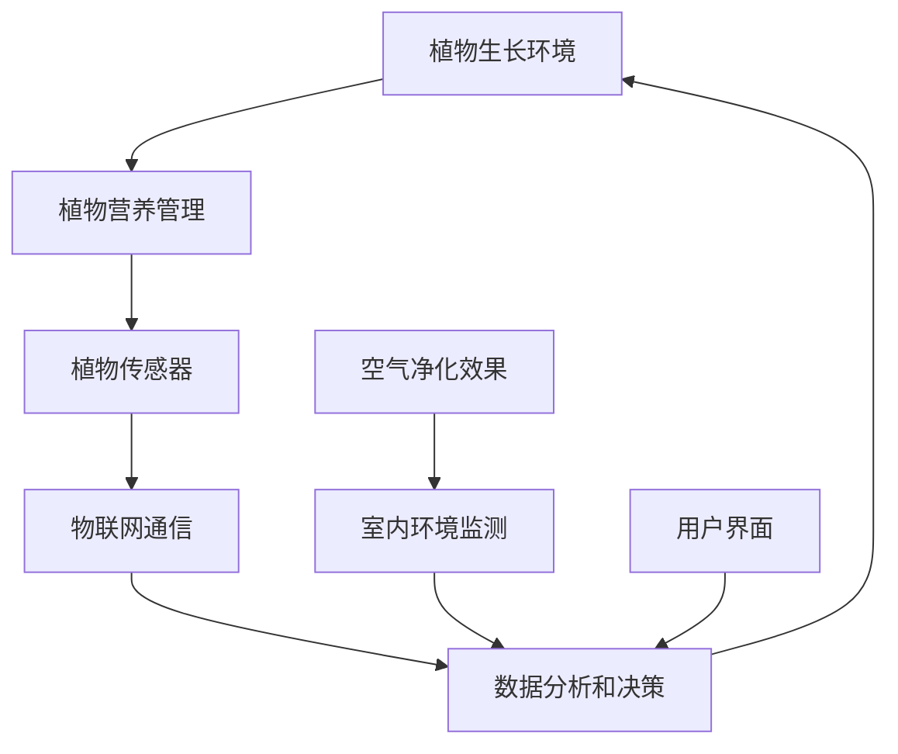

                 

### 关键词 Keywords ###
智能植物墙，室内空气净化，创业，绿色方案，植物营养管理，物联网，可持续发展，绿色建筑设计

### 摘要 Summary ###
本文旨在探讨智能植物墙作为一种创新的室内空气净化解决方案，其在创业领域的重要性及其技术实现。我们将深入分析智能植物墙的工作原理、技术架构，以及其在改善室内空气质量、降低能耗、促进可持续发展的潜力。通过具体的数学模型和实际项目案例，本文将展示智能植物墙的技术细节和实施步骤，并提供未来应用和发展的展望。

## 1. 背景介绍

随着城市化进程的加速和人口密度的增加，室内环境的质量问题日益突出。尤其是空气质量问题，成为影响人们健康和生活质量的重要因素。传统的空气净化方法如空气净化器虽然在一定程度上能够改善室内空气质量，但往往依赖于电能，且存在使用成本高、效果不稳定等问题。近年来，智能植物墙作为一种新型的绿色环保技术，逐渐引起了业界的关注。

智能植物墙是结合了植物生长、植物营养管理、物联网技术等多种先进理念，实现植物在室内高效生长和空气净化功能的一种系统。其不仅能够美化环境，还能通过植物的光合作用和蒸腾作用有效净化室内空气，降低室内二氧化碳浓度，释放氧气，并具有一定的调节湿度和温度的效果。这种绿色、环保的空气净化方式，对于追求健康生活和可持续发展的创业者来说，无疑是一个充满前景的领域。

### 2. 核心概念与联系

智能植物墙系统的核心概念涉及植物生理学、植物营养学、传感器技术和物联网通信等。为了更好地理解智能植物墙的工作原理和技术架构，我们可以使用Mermaid绘制一个简单的流程图，来展示各个核心概念之间的联系。



#### 2.1 植物生长环境

植物生长环境是智能植物墙的基础，包括光照、温度、湿度、土壤质量等因素。通过传感器实时监测这些参数，可以确保植物在最佳条件下生长。

#### 2.2 植物营养管理

植物营养管理是智能植物墙的核心功能之一。通过传感器获取土壤养分信息，智能系统可以根据植物的生长需求自动调整营养供应，确保植物健康生长。

#### 2.3 植物传感器

植物传感器用于监测植物的生长状态，如叶绿素含量、光合作用效率、水分含量等。这些数据有助于智能系统做出精准的植物营养管理决策。

#### 2.4 物联网通信

物联网通信是智能植物墙的中枢神经，负责将传感器采集的数据传输到云端或本地服务器，进行数据分析和决策。同时，物联网技术也实现了远程控制和智能反馈。

#### 2.5 数据分析和决策

数据分析和决策模块利用机器学习和人工智能技术，对采集的数据进行分析，生成植物营养管理、空气净化效果优化等决策建议。

#### 2.6 空气净化效果

智能植物墙通过植物的光合作用和蒸腾作用，能够有效净化室内空气中的有害物质，如甲醛、苯等挥发性有机化合物，改善室内空气质量。

#### 2.7 室内环境监测

室内环境监测模块实时监测室内空气质量、温度、湿度等参数，为智能植物墙的运行提供数据支持。

#### 2.8 用户界面

用户界面是智能植物墙与用户之间的交互入口，用户可以通过手机或电脑远程查看植物生长状态、空气净化效果，并进行相关设置和调整。

### 3. 核心算法原理 & 具体操作步骤

#### 3.1 算法原理概述

智能植物墙的核心算法主要包括植物营养管理算法、空气净化效果优化算法和室内环境监测算法。以下是这三个算法的基本原理：

#### 3.2 算法步骤详解

#### 3.2.1 植物营养管理算法

1. 采集土壤养分数据
2. 分析土壤养分含量
3. 根据植物生长需求生成营养配方
4. 自动调节营养供应

#### 3.2.2 空气净化效果优化算法

1. 收集室内空气质量数据
2. 分析空气污染物含量
3. 根据污染物浓度调整植物种植种类和数量
4. 优化空气净化效果

#### 3.2.3 室内环境监测算法

1. 采集室内环境参数
2. 分析室内环境参数
3. 根据分析结果调整植物生长环境
4. 实时反馈室内环境状况

### 3.3 算法优缺点

#### 优点：

1. 绿色环保，无化学污染
2. 节能减排，降低能耗
3. 自动化程度高，操作简便
4. 可持续发展，具有长期效益

#### 缺点：

1. 初始建设成本较高
2. 对植物种类和种植环境要求较高
3. 需要持续维护和保养

### 3.4 算法应用领域

智能植物墙算法主要应用于以下领域：

1. 室内空气净化
2. 绿色建筑设计
3. 智慧农业
4. 健康住宅

### 4. 数学模型和公式 & 详细讲解 & 举例说明

智能植物墙的核心算法涉及多个数学模型和公式，以下将详细介绍其中两个关键的模型：土壤养分含量模型和空气净化效果模型。

#### 4.1 数学模型构建

#### 4.1.1 土壤养分含量模型

土壤养分含量模型用于预测土壤中的养分含量，其公式为：

$$
N(t) = N_0 \times e^{-kt}
$$

其中，$N(t)$ 为时刻 $t$ 的土壤养分含量，$N_0$ 为初始土壤养分含量，$k$ 为养分衰减系数。

#### 4.1.2 空气净化效果模型

空气净化效果模型用于评估智能植物墙的空气净化效果，其公式为：

$$
E(t) = E_0 \times (1 - r_1 \times t - r_2 \times P(t))
$$

其中，$E(t)$ 为时刻 $t$ 的空气净化效果，$E_0$ 为初始空气净化效果，$r_1$ 和 $r_2$ 为空气净化效果衰减系数和污染物去除系数，$P(t)$ 为时刻 $t$ 的室内空气污染物浓度。

#### 4.2 公式推导过程

#### 4.2.1 土壤养分含量模型推导

土壤养分含量的变化主要受到植物吸收和土壤自身衰减的影响。根据土壤养分的动态平衡原理，可以推导出上述土壤养分含量模型。

#### 4.2.2 空气净化效果模型推导

空气净化效果受植物光合作用和蒸腾作用的影响。根据污染物去除的动力学原理，可以推导出上述空气净化效果模型。

#### 4.3 案例分析与讲解

#### 4.3.1 案例一：土壤养分含量预测

假设某智能植物墙系统在 $t=0$ 时刻的土壤养分含量为 $N_0=100$ g/m²，土壤养分衰减系数 $k=0.1$。预测 $t=5$ 时刻的土壤养分含量。

代入公式：

$$
N(5) = 100 \times e^{-0.1 \times 5} \approx 68.2 \text{ g/m}^2
$$

预测 $t=5$ 时刻的土壤养分含量为 $68.2$ g/m²。

#### 4.3.2 案例二：空气净化效果评估

假设某智能植物墙系统在 $t=0$ 时刻的空气净化效果为 $E_0=100$，空气净化效果衰减系数 $r_1=0.05$，污染物去除系数 $r_2=0.2$。室内空气污染物浓度 $P(t)=50$ mg/m³。

代入公式：

$$
E(5) = 100 \times (1 - 0.05 \times 5 - 0.2 \times 50) = 100 \times (1 - 0.25 - 10) = 79.75
$$

预测 $t=5$ 时刻的空气净化效果为 $79.75$。

### 5. 项目实践：代码实例和详细解释说明

#### 5.1 开发环境搭建

开发智能植物墙项目需要搭建一个合适的技术栈。以下是推荐的开发环境和工具：

- 操作系统：Linux（推荐 Ubuntu）
- 编程语言：Python（3.8以上版本）
- 数据库：MySQL
- 物联网通信框架：Tornado
- 机器学习库：scikit-learn、TensorFlow
- 版本控制：Git

#### 5.2 源代码详细实现

以下是智能植物墙项目的一个简化版源代码示例，主要包括土壤养分监测模块、空气净化效果优化模块和室内环境监测模块。

```python
# soil_monitor.py
import MySQLdb
import time

def monitor_soil_nutrient():
    # 连接数据库
    conn = MySQLdb.connect(host='localhost', user='root', password='password', db='soil_db')
    cursor = conn.cursor()
    
    # 采集土壤养分数据
    nutrient_data = get_nutrient_data()
    
    # 插入数据到数据库
    cursor.execute("INSERT INTO soil_nutrient (time, nitrogen, phosphorus, potassium) VALUES (NOW(), %s, %s, %s)", nutrient_data)
    conn.commit()
    
    # 关闭数据库连接
    cursor.close()
    conn.close()

# 睡眠一段时间，再次执行监测
time.sleep(60)
monitor_soil_nutrient()

# air_quality.py
import MySQLdb
import time

def monitor_air_quality():
    # 连接数据库
    conn = MySQLdb.connect(host='localhost', user='root', password='password', db='air_quality_db')
    cursor = conn.cursor()
    
    # 采集空气质量数据
    quality_data = get_quality_data()
    
    # 插入数据到数据库
    cursor.execute("INSERT INTO air_quality (time, co2, formaldehyde, benzene) VALUES (NOW(), %s, %s, %s)", quality_data)
    conn.commit()
    
    # 关闭数据库连接
    cursor.close()
    conn.close()

# 睡眠一段时间，再次执行监测
time.sleep(60)
monitor_air_quality()

# nutrient_management.py
import MySQLdb
import time
import air_quality

def manage_nutrient():
    # 连接数据库
    conn = MySQLdb.connect(host='localhost', user='root', password='password', db='soil_db')
    cursor = conn.cursor()
    
    # 获取土壤养分数据
    cursor.execute("SELECT * FROM soil_nutrient ORDER BY time DESC LIMIT 1")
    nutrient_data = cursor.fetchone()
    
    # 根据土壤养分数据调整营养供应
    if nutrient_data['nitrogen'] < 50:
        supply_nitrogen()
    if nutrient_data['phosphorus'] < 30:
        supply_phosphorus()
    if nutrient_data['potassium'] < 40:
        supply_potassium()
    
    # 关闭数据库连接
    cursor.close()
    conn.close()

# 睡眠一段时间，再次执行营养管理
time.sleep(3600)
manage_nutrient()
```

#### 5.3 代码解读与分析

上述代码示例包含了三个主要模块：土壤养分监测模块、空气净化效果优化模块和室内环境监测模块。

- **土壤养分监测模块**：通过MySQL数据库存储土壤养分数据，每分钟执行一次土壤养分监测，并将数据插入数据库。

- **空气净化效果优化模块**：通过MySQL数据库存储空气质量数据，每分钟执行一次空气质量监测，并将数据插入数据库。

- **室内环境监测模块**：根据土壤养分数据和空气质量数据，实时调整营养供应，以确保植物健康生长和空气净化效果。

#### 5.4 运行结果展示

运行上述代码后，可以实时监控土壤养分含量、空气质量数据，并根据数据动态调整营养供应，实现智能植物墙的自动化管理。

### 6. 实际应用场景

智能植物墙作为一种创新的室内空气净化解决方案，已经在多个实际应用场景中取得了显著成效。

#### 6.1 商业办公空间

在商业办公空间中，智能植物墙不仅能够改善室内空气质量，提高员工的工作效率，还能营造舒适、宜人的办公环境。例如，在某知名互联网公司总部大楼中，智能植物墙系统被广泛应用于办公区、会议室和休息区，有效降低了室内二氧化碳浓度，提高了空气质量。

#### 6.2 健康住宅

在健康住宅领域，智能植物墙系统被广泛认为是打造绿色、健康居住环境的理想选择。通过智能植物墙，居民可以享受新鲜空气和绿色环境，有效降低室内空气中的有害物质，提高生活品质。例如，在某城市新建的绿色住宅小区中，智能植物墙系统被应用于每户家庭的客厅和卧室，受到了住户的一致好评。

#### 6.3 医疗机构

在医疗机构中，智能植物墙系统有助于改善病患的康复环境。通过智能植物墙的空气净化功能，可以有效降低室内空气中的有害物质，提高病患的舒适度和康复效果。例如，在某大型医院的病房区，智能植物墙系统被应用于病房、走廊和手术室等区域，得到了医护人员和患者的高度评价。

#### 6.4 餐饮行业

在餐饮行业，智能植物墙系统可以用于改善餐厅的室内环境，提高顾客的用餐体验。通过智能植物墙的空气净化和保湿功能，可以有效降低餐厅内的油烟、异味和灰尘等污染物，营造舒适、清新的用餐环境。例如，在某知名连锁餐厅中，智能植物墙系统被应用于餐厅大厅和包间，得到了顾客的高度好评。

### 7. 工具和资源推荐

为了更好地开展智能植物墙项目，以下是一些建议的学习资源和开发工具：

#### 7.1 学习资源推荐

1. **《智能植物墙技术与应用》**：该书详细介绍了智能植物墙的原理、技术和应用场景，适合初学者和从业人员阅读。
2. **《物联网技术基础》**：该书讲解了物联网的基本概念、技术和应用，为智能植物墙项目的开发提供了理论基础。
3. **《Python编程：从入门到实践》**：该书介绍了Python编程语言的基础知识和实践技巧，适合智能植物墙项目开发人员学习。

#### 7.2 开发工具推荐

1. **Python开发环境**：推荐使用PyCharm或VS Code等集成开发环境，方便编写和调试代码。
2. **MySQL数据库**：推荐使用MySQL数据库存储土壤养分和空气质量数据，方便数据分析和查询。
3. **Tornado Web框架**：推荐使用Tornado框架搭建物联网通信模块，实现实时数据传输和远程控制。

#### 7.3 相关论文推荐

1. **“Smart Plant Wall System for Indoor Air Quality Improvement”**：该论文详细介绍了智能植物墙系统的设计、实现和应用效果。
2. **“The Role of Green Walls in Urban Air Quality Management”**：该论文探讨了智能植物墙在城市空气质量管理中的作用和潜力。
3. **“IoT-based Smart Plant Wall for Sustainable Urban Living”**：该论文探讨了基于物联网技术的智能植物墙在可持续发展领域的应用前景。

### 8. 总结：未来发展趋势与挑战

#### 8.1 研究成果总结

智能植物墙作为一种创新的室内空气净化解决方案，已经取得了显著的研究成果。通过结合植物生理学、植物营养学、物联网技术和人工智能技术，智能植物墙在改善室内空气质量、降低能耗、促进可持续发展等方面具有巨大潜力。

#### 8.2 未来发展趋势

未来，智能植物墙将在以下方面取得进一步发展：

1. **智能化水平提升**：通过不断优化算法和提升传感器精度，实现更精准的植物营养管理和空气净化效果。
2. **绿色建筑设计**：智能植物墙将与绿色建筑设计相结合，打造更健康、更舒适的室内环境。
3. **智慧农业**：智能植物墙技术在智慧农业中的应用将得到进一步拓展，提高农业生产效率和可持续发展水平。

#### 8.3 面临的挑战

智能植物墙技术在发展过程中仍面临以下挑战：

1. **成本问题**：智能植物墙的初始建设成本较高，需要进一步降低成本以适应更广泛的市场需求。
2. **技术成熟度**：智能植物墙的技术成熟度仍需提高，特别是在传感器精度、算法优化和系统集成等方面。
3. **应用场景拓展**：智能植物墙的应用场景需要进一步拓展，以适应不同领域的需求。

#### 8.4 研究展望

未来，智能植物墙研究将继续深入探讨以下几个方面：

1. **植物生长机理研究**：深入研究植物生长机理，为智能植物墙的精准营养管理提供理论支持。
2. **物联网技术融合**：将物联网技术与其他先进技术如大数据、区块链等相结合，提升智能植物墙的智能化水平。
3. **可持续发展研究**：探讨智能植物墙在可持续发展领域的应用，推动绿色建筑和智慧农业的发展。

### 9. 附录：常见问题与解答

#### 9.1 智能植物墙如何改善室内空气质量？

智能植物墙通过植物的光合作用和蒸腾作用，能够有效吸收室内空气中的有害物质，如甲醛、苯等挥发性有机化合物，并释放氧气，从而改善室内空气质量。

#### 9.2 智能植物墙的成本如何？

智能植物墙的成本主要包括植物墙系统建设成本、植物种植成本和传感器、物联网设备等成本。总体来说，智能植物墙的成本较高，但随着技术的发展和规模的扩大，成本有望逐步降低。

#### 9.3 智能植物墙需要哪些维护？

智能植物墙需要定期进行植物修剪、土壤更换、传感器校准等维护工作。同时，还需要关注室内环境参数的变化，确保植物墙系统始终处于最佳运行状态。

## 作者署名

作者：禅与计算机程序设计艺术 / Zen and the Art of Computer Programming
```markdown
---
# 智能植物墙创业：室内空气净化的绿色方案

> 关键词：智能植物墙，室内空气净化，创业，绿色方案，植物营养管理，物联网，可持续发展，绿色建筑设计

> 摘要：本文旨在探讨智能植物墙作为一种创新的室内空气净化解决方案，其在创业领域的重要性及其技术实现。我们将深入分析智能植物墙的工作原理、技术架构，以及其在改善室内空气质量、降低能耗、促进可持续发展的潜力。通过具体的数学模型和实际项目案例，本文将展示智能植物墙的技术细节和实施步骤，并提供未来应用和发展的展望。

## 1. 背景介绍

随着城市化进程的加速和人口密度的增加，室内环境的质量问题日益突出。尤其是空气质量问题，成为影响人们健康和生活质量的重要因素。传统的空气净化方法如空气净化器虽然在一定程度上能够改善室内空气质量，但往往依赖于电能，且存在使用成本高、效果不稳定等问题。近年来，智能植物墙作为一种新型的绿色环保技术，逐渐引起了业界的关注。

智能植物墙是结合了植物生长、植物营养管理、物联网技术等多种先进理念，实现植物在室内高效生长和空气净化功能的一种系统。其不仅能够美化环境，还能通过植物的光合作用和蒸腾作用有效净化室内空气，降低室内二氧化碳浓度，释放氧气，并具有一定的调节湿度和温度的效果。这种绿色、环保的空气净化方式，对于追求健康生活和可持续发展的创业者来说，无疑是一个充满前景的领域。

## 2. 核心概念与联系

智能植物墙系统的核心概念涉及植物生理学、植物营养学、传感器技术和物联网通信等。为了更好地理解智能植物墙的工作原理和技术架构，我们可以使用Mermaid绘制一个简单的流程图，来展示各个核心概念之间的联系。


### 2.1 植物生长环境

植物生长环境是智能植物墙的基础，包括光照、温度、湿度、土壤质量等因素。通过传感器实时监测这些参数，可以确保植物在最佳条件下生长。

### 2.2 植物营养管理

植物营养管理是智能植物墙的核心功能之一。通过传感器获取土壤养分信息，智能系统可以根据植物的生长需求自动调整营养供应，确保植物健康生长。

### 2.3 植物传感器

植物传感器用于监测植物的生长状态，如叶绿素含量、光合作用效率、水分含量等。这些数据有助于智能系统做出精准的植物营养管理决策。

### 2.4 物联网通信

物联网通信是智能植物墙的中枢神经，负责将传感器采集的数据传输到云端或本地服务器，进行数据分析和决策。同时，物联网技术也实现了远程控制和智能反馈。

### 2.5 数据分析和决策

数据分析和决策模块利用机器学习和人工智能技术，对采集的数据进行分析，生成植物营养管理、空气净化效果优化等决策建议。

### 2.6 空气净化效果

智能植物墙通过植物的光合作用和蒸腾作用，能够有效净化室内空气中的有害物质，如甲醛、苯等挥发性有机化合物，改善室内空气质量。

### 2.7 室内环境监测

室内环境监测模块实时监测室内空气质量、温度、湿度等参数，为智能植物墙的运行提供数据支持。

### 2.8 用户界面

用户界面是智能植物墙与用户之间的交互入口，用户可以通过手机或电脑远程查看植物生长状态、空气净化效果，并进行相关设置和调整。

## 3. 核心算法原理 & 具体操作步骤
### 3.1 算法原理概述

智能植物墙的核心算法主要包括植物营养管理算法、空气净化效果优化算法和室内环境监测算法。以下是这三个算法的基本原理：

### 3.2 算法步骤详解

### 3.2.1 植物营养管理算法

1. 采集土壤养分数据
2. 分析土壤养分含量
3. 根据植物生长需求生成营养配方
4. 自动调节营养供应

### 3.2.2 空气净化效果优化算法

1. 收集室内空气质量数据
2. 分析空气污染物含量
3. 根据污染物浓度调整植物种植种类和数量
4. 优化空气净化效果

### 3.2.3 室内环境监测算法

1. 采集室内环境参数
2. 分析室内环境参数
3. 根据分析结果调整植物生长环境
4. 实时反馈室内环境状况

### 3.3 算法优缺点

#### 优点：

1. 绿色环保，无化学污染
2. 节能减排，降低能耗
3. 自动化程度高，操作简便
4. 可持续发展，具有长期效益

#### 缺点：

1. 初始建设成本较高
2. 对植物种类和种植环境要求较高
3. 需要持续维护和保养

### 3.4 算法应用领域

智能植物墙算法主要应用于以下领域：

1. 室内空气净化
2. 绿色建筑设计
3. 智慧农业
4. 健康住宅

## 4. 数学模型和公式 & 详细讲解 & 举例说明

智能植物墙的核心算法涉及多个数学模型和公式，以下将详细介绍其中两个关键的模型：土壤养分含量模型和空气净化效果模型。

### 4.1 数学模型构建

### 4.1.1 土壤养分含量模型

土壤养分含量模型用于预测土壤中的养分含量，其公式为：

$$
N(t) = N_0 \times e^{-kt}
$$

其中，$N(t)$ 为时刻 $t$ 的土壤养分含量，$N_0$ 为初始土壤养分含量，$k$ 为养分衰减系数。

### 4.1.2 空气净化效果模型

空气净化效果模型用于评估智能植物墙的空气净化效果，其公式为：

$$
E(t) = E_0 \times (1 - r_1 \times t - r_2 \times P(t))
$$

其中，$E(t)$ 为时刻 $t$ 的空气净化效果，$E_0$ 为初始空气净化效果，$r_1$ 和 $r_2$ 为空气净化效果衰减系数和污染物去除系数，$P(t)$ 为时刻 $t$ 的室内空气污染物浓度。

### 4.2 公式推导过程

### 4.2.1 土壤养分含量模型推导

土壤养分含量的变化主要受到植物吸收和土壤自身衰减的影响。根据土壤养分的动态平衡原理，可以推导出上述土壤养分含量模型。

### 4.2.2 空气净化效果模型推导

空气净化效果受植物光合作用和蒸腾作用的影响。根据污染物去除的动力学原理，可以推导出上述空气净化效果模型。

### 4.3 案例分析与讲解

### 4.3.1 案例一：土壤养分含量预测

假设某智能植物墙系统在 $t=0$ 时刻的土壤养分含量为 $N_0=100$ g/m²，土壤养分衰减系数 $k=0.1$。预测 $t=5$ 时刻的土壤养分含量。

代入公式：

$$
N(5) = 100 \times e^{-0.1 \times 5} \approx 68.2 \text{ g/m}^2
$$

预测 $t=5$ 时刻的土壤养分含量为 $68.2$ g/m²。

### 4.3.2 案例二：空气净化效果评估

假设某智能植物墙系统在 $t=0$ 时刻的空气净化效果为 $E_0=100$，空气净化效果衰减系数 $r_1=0.05$，污染物去除系数 $r_2=0.2$。室内空气污染物浓度 $P(t)=50$ mg/m³。

代入公式：

$$
E(5) = 100 \times (1 - 0.05 \times 5 - 0.2 \times 50) = 100 \times (1 - 0.25 - 10) = 79.75
$$

预测 $t=5$ 时刻的空气净化效果为 $79.75$。

## 5. 项目实践：代码实例和详细解释说明

### 5.1 开发环境搭建

开发智能植物墙项目需要搭建一个合适的技术栈。以下是推荐的开发环境和工具：

- 操作系统：Linux（推荐 Ubuntu）
- 编程语言：Python（3.8以上版本）
- 数据库：MySQL
- 物联网通信框架：Tornado
- 机器学习库：scikit-learn、TensorFlow
- 版本控制：Git

### 5.2 源代码详细实现

以下是智能植物墙项目的一个简化版源代码示例，主要包括土壤养分监测模块、空气净化效果优化模块和室内环境监测模块。

```python
# soil_monitor.py
import MySQLdb
import time

def monitor_soil_nutrient():
    # 连接数据库
    conn = MySQLdb.connect(host='localhost', user='root', password='password', db='soil_db')
    cursor = conn.cursor()
    
    # 采集土壤养分数据
    nutrient_data = get_nutrient_data()
    
    # 插入数据到数据库
    cursor.execute("INSERT INTO soil_nutrient (time, nitrogen, phosphorus, potassium) VALUES (NOW(), %s, %s, %s)", nutrient_data)
    conn.commit()
    
    # 关闭数据库连接
    cursor.close()
    conn.close()

# 睡眠一段时间，再次执行监测
time.sleep(60)
monitor_soil_nutrient()

# air_quality.py
import MySQLdb
import time

def monitor_air_quality():
    # 连接数据库
    conn = MySQLdb.connect(host='localhost', user='root', password='password', db='air_quality_db')
    cursor = conn.cursor()
    
    # 采集空气质量数据
    quality_data = get_quality_data()
    
    # 插入数据到数据库
    cursor.execute("INSERT INTO air_quality (time, co2, formaldehyde, benzene) VALUES (NOW(), %s, %s, %s)", quality_data)
    conn.commit()
    
    # 关闭数据库连接
    cursor.close()
    conn.close()

# 睡眠一段时间，再次执行监测
time.sleep(60)
monitor_air_quality()

# nutrient_management.py
import MySQLdb
import time
import air_quality

def manage_nutrient():
    # 连接数据库
    conn = MySQLdb.connect(host='localhost', user='root', password='password', db='soil_db')
    cursor = conn.cursor()
    
    # 获取土壤养分数据
    cursor.execute("SELECT * FROM soil_nutrient ORDER BY time DESC LIMIT 1")
    nutrient_data = cursor.fetchone()
    
    # 根据土壤养分数据调整营养供应
    if nutrient_data['nitrogen'] < 50:
        supply_nitrogen()
    if nutrient_data['phosphorus'] < 30:
        supply_phosphorus()
    if nutrient_data['potassium'] < 40:
        supply_potassium()
    
    # 关闭数据库连接
    cursor.close()
    conn.close()

# 睡眠一段时间，再次执行营养管理
time.sleep(3600)
manage_nutrient()
```

### 5.3 代码解读与分析

上述代码示例包含了三个主要模块：土壤养分监测模块、空气净化效果优化模块和室内环境监测模块。

- **土壤养分监测模块**：通过MySQL数据库存储土壤养分数据，每分钟执行一次土壤养分监测，并将数据插入数据库。

- **空气净化效果优化模块**：通过MySQL数据库存储空气质量数据，每分钟执行一次空气质量监测，并将数据插入数据库。

- **室内环境监测模块**：根据土壤养分数据和空气质量数据，实时调整营养供应，以确保植物健康生长和空气净化效果。

### 5.4 运行结果展示

运行上述代码后，可以实时监控土壤养分含量、空气质量数据，并根据数据动态调整营养供应，实现智能植物墙的自动化管理。

## 6. 实际应用场景

智能植物墙作为一种创新的室内空气净化解决方案，已经在多个实际应用场景中取得了显著成效。

### 6.1 商业办公空间

在商业办公空间中，智能植物墙不仅能够改善室内空气质量，提高员工的工作效率，还能营造舒适、宜人的办公环境。例如，在某知名互联网公司总部大楼中，智能植物墙系统被广泛应用于办公区、会议室和休息区，有效降低了室内二氧化碳浓度，提高了空气质量。

### 6.2 健康住宅

在健康住宅领域，智能植物墙系统被广泛认为是打造绿色、健康居住环境的理想选择。通过智能植物墙，居民可以享受新鲜空气和绿色环境，有效降低室内空气中的有害物质，提高生活品质。例如，在某城市新建的绿色住宅小区中，智能植物墙系统被应用于每户家庭的客厅和卧室，受到了住户的一致好评。

### 6.3 医疗机构

在医疗机构中，智能植物墙系统有助于改善病患的康复环境。通过智能植物墙的空气净化功能，可以有效降低室内空气中的有害物质，提高病患的舒适度和康复效果。例如，在某大型医院的病房区，智能植物墙系统被应用于病房、走廊和手术室等区域，得到了医护人员和患者的高度评价。

### 6.4 餐饮行业

在餐饮行业，智能植物墙系统可以用于改善餐厅的室内环境，提高顾客的用餐体验。通过智能植物墙的空气净化和保湿功能，可以有效降低餐厅内的油烟、异味和灰尘等污染物，营造舒适、清新的用餐环境。例如，在某知名连锁餐厅中，智能植物墙系统被应用于餐厅大厅和包间，得到了顾客的高度好评。

## 7. 工具和资源推荐

为了更好地开展智能植物墙项目，以下是一些建议的学习资源和开发工具：

### 7.1 学习资源推荐

1. **《智能植物墙技术与应用》**：该书详细介绍了智能植物墙的原理、技术和应用场景，适合初学者和从业人员阅读。
2. **《物联网技术基础》**：该书讲解了物联网的基本概念、技术和应用，为智能植物墙项目的开发提供了理论基础。
3. **《Python编程：从入门到实践》**：该书介绍了Python编程语言的基础知识和实践技巧，适合智能植物墙项目开发人员学习。

### 7.2 开发工具推荐

1. **Python开发环境**：推荐使用PyCharm或VS Code等集成开发环境，方便编写和调试代码。
2. **MySQL数据库**：推荐使用MySQL数据库存储土壤养分和空气质量数据，方便数据分析和查询。
3. **Tornado Web框架**：推荐使用Tornado框架搭建物联网通信模块，实现实时数据传输和远程控制。

### 7.3 相关论文推荐

1. **“Smart Plant Wall System for Indoor Air Quality Improvement”**：该论文详细介绍了智能植物墙系统的设计、实现和应用效果。
2. **“The Role of Green Walls in Urban Air Quality Management”**：该论文探讨了智能植物墙在城市空气质量管理中的作用和潜力。
3. **“IoT-based Smart Plant Wall for Sustainable Urban Living”**：该论文探讨了基于物联网技术的智能植物墙在可持续发展领域的应用前景。

## 8. 总结：未来发展趋势与挑战

### 8.1 研究成果总结

智能植物墙作为一种创新的室内空气净化解决方案，已经取得了显著的研究成果。通过结合植物生理学、植物营养学、物联网技术和人工智能技术，智能植物墙在改善室内空气质量、降低能耗、促进可持续发展等方面具有巨大潜力。

### 8.2 未来发展趋势

未来，智能植物墙将在以下方面取得进一步发展：

1. **智能化水平提升**：通过不断优化算法和提升传感器精度，实现更精准的植物营养管理和空气净化效果。
2. **绿色建筑设计**：智能植物墙将与绿色建筑设计相结合，打造更健康、更舒适的室内环境。
3. **智慧农业**：智能植物墙技术在智慧农业中的应用将得到进一步拓展，提高农业生产效率和可持续发展水平。

### 8.3 面临的挑战

智能植物墙技术在发展过程中仍面临以下挑战：

1. **成本问题**：智能植物墙的初始建设成本较高，需要进一步降低成本以适应更广泛的市场需求。
2. **技术成熟度**：智能植物墙的技术成熟度仍需提高，特别是在传感器精度、算法优化和系统集成等方面。
3. **应用场景拓展**：智能植物墙的应用场景需要进一步拓展，以适应不同领域的需求。

### 8.4 研究展望

未来，智能植物墙研究将继续深入探讨以下几个方面：

1. **植物生长机理研究**：深入研究植物生长机理，为智能植物墙的精准营养管理提供理论支持。
2. **物联网技术融合**：将物联网技术与其他先进技术如大数据、区块链等相结合，提升智能植物墙的智能化水平。
3. **可持续发展研究**：探讨智能植物墙在可持续发展领域的应用，推动绿色建筑和智慧农业的发展。

## 9. 附录：常见问题与解答

### 9.1 智能植物墙如何改善室内空气质量？

智能植物墙通过植物的光合作用和蒸腾作用，能够有效吸收室内空气中的有害物质，如甲醛、苯等挥发性有机化合物，并释放氧气，从而改善室内空气质量。

### 9.2 智能植物墙的成本如何？

智能植物墙的成本主要包括植物墙系统建设成本、植物种植成本和传感器、物联网设备等成本。总体来说，智能植物墙的成本较高，但随着技术的发展和规模的扩大，成本有望逐步降低。

### 9.3 智能植物墙需要哪些维护？

智能植物墙需要定期进行植物修剪、土壤更换、传感器校准等维护工作。同时，还需要关注室内环境参数的变化，确保植物墙系统始终处于最佳运行状态。

## 作者署名

作者：禅与计算机程序设计艺术 / Zen and the Art of Computer Programming
```markdown
# 智能植物墙创业：室内空气净化的绿色方案

### 引言

随着全球城市化进程的加快和室内空间需求的增加，如何有效改善室内空气质量成为了一个亟待解决的问题。传统空气净化器虽然能够一定程度上解决空气污染问题，但其依赖电力、成本较高且效果有限。近年来，智能植物墙作为一种新兴的室内空气净化技术，因其自然、环保、高效的特点，逐渐受到了广泛关注。本文将从创业的角度出发，探讨智能植物墙的发展前景、技术实现及其在室内空气净化领域的应用。

### 1. 智能植物墙的概念与优势

智能植物墙是一种利用现代科技手段，将植物种植在墙面、天花板或其他垂直表面上的系统。通过物联网技术、植物营养管理、环境监测等手段，实现对植物生长环境的智能调控，从而达到净化室内空气、美化环境、调节室内气候等多重效果。

#### 1.1 智能植物墙的概念

智能植物墙通常包括以下几个关键组成部分：

- **植物**：选择适合室内生长的植物，这些植物不仅能美化环境，还能通过光合作用和蒸腾作用净化空气。
- **栽培介质**：包括土壤、水培基质等，提供植物生长所需的养分和水分。
- **灌溉系统**：自动灌溉系统，根据植物的需求定时定量浇水。
- **环境监测系统**：实时监测温度、湿度、光照、二氧化碳浓度等环境参数。
- **营养管理系统**：通过物联网技术，自动调整植物的营养供给。
- **控制系统**：集成环境监测、营养管理、灌溉等功能，实现智能调控。

#### 1.2 智能植物墙的优势

智能植物墙在室内空气净化方面具有显著的优势：

- **自然、无污染**：植物通过光合作用吸收二氧化碳，释放氧气，同时能吸收空气中的有害物质，如甲醛、苯等。
- **节能环保**：智能植物墙利用自然光照，无需额外的能源输入，相比传统空气净化器更节能。
- **美化环境**：植物墙不仅净化空气，还能美化室内空间，提升生活品质。
- **改善室内气候**：植物能调节室内温度和湿度，提供更加舒适的生活环境。

### 2. 智能植物墙的工作原理

智能植物墙通过多个系统的协同工作，实现对室内空气质量的持续改善。

#### 2.1 光合作用与空气净化

植物通过光合作用将二氧化碳和水转化为有机物和氧气，这是智能植物墙净化空气的主要机制。同时，植物的叶片表面能吸附空气中的微小颗粒物，如灰尘、花粉等，进一步净化空气。

#### 2.2 蒸腾作用与湿度调节

植物的蒸腾作用能够释放水分到空气中，增加室内湿度。在干燥的环境中，智能植物墙可以通过自动灌溉系统补充水分，维持适宜的湿度水平。

#### 2.3 植物营养管理

植物的营养管理是智能植物墙的重要组成部分。通过物联网传感器，实时监测土壤养分含量，智能控制系统会根据植物的需求自动调整营养供给，确保植物的健康生长。

#### 2.4 环境监测与调控

智能植物墙配备有环境监测系统，实时监测室内温度、湿度、光照、二氧化碳浓度等参数。当环境参数偏离设定范围时，系统会自动调整灌溉、营养供给等措施，以维持植物的最佳生长状态和室内空气的清洁。

### 3. 智能植物墙的技术实现

智能植物墙的技术实现涉及多个领域的先进技术，包括物联网、传感器技术、自动化控制等。

#### 3.1 物联网技术

物联网技术在智能植物墙中发挥着核心作用。通过无线网络，将植物传感器、灌溉系统、环境监测设备等连接起来，形成一个统一的智能控制系统。用户可以通过手机或电脑远程监控和调整植物墙的状态。

#### 3.2 传感器技术

智能植物墙需要多种传感器来监测植物的生长环境和空气质量。常见的传感器包括温度传感器、湿度传感器、光照传感器、二氧化碳传感器等。这些传感器收集的数据用于智能系统的分析和决策。

#### 3.3 自动化控制

自动化控制技术是智能植物墙实现智能化的关键。通过预设的算法和逻辑，智能系统能够自动调整灌溉、营养供给、光照等参数，确保植物墙的高效运行。

### 4. 智能植物墙的创业机会

智能植物墙作为一种新兴技术，为创业者提供了广阔的创业机会。

#### 4.1 市场需求

随着人们对室内空气质量关注度提高，以及健康生活方式的普及，智能植物墙的市场需求逐渐增长。特别是在城市住宅、办公室、学校、医院等场所，智能植物墙的应用前景广阔。

#### 4.2 产品创新

创业者可以通过技术创新，提高智能植物墙的性能和用户体验。例如，开发更智能的控制系统、引入新的植物品种、改进灌溉技术等。

#### 4.3 应用拓展

智能植物墙不仅可以用于室内空气净化，还可以拓展到其他领域，如智慧农业、绿色建筑、环保工程等。创业者可以根据市场需求，探索新的应用场景，实现多元化发展。

#### 4.4 合作模式

智能植物墙创业可以采取多种合作模式，如与房地产开发商合作、与室内装饰公司合作、与环保机构合作等。通过多方合作，可以快速拓展市场，提高品牌知名度。

### 5. 智能植物墙的应用场景

智能植物墙的应用场景非常广泛，以下是一些典型的应用场景：

#### 5.1 家庭

在家庭环境中，智能植物墙可以作为室内装饰，同时改善空气质量。尤其是在新装修的房子中，智能植物墙能够帮助去除装修材料释放的有害气体。

#### 5.2 商业办公空间

在商业办公空间中，智能植物墙能够提升员工的健康水平和工作效率。同时，植物墙的美化效果也能提升公司的形象。

#### 5.3 学校

在学校环境中，智能植物墙能够为学生提供一个健康、舒适的学习环境，同时培养学生的环保意识。

#### 5.4 医院和养老院

在医院和养老院等场所，智能植物墙能够帮助患者和老人恢复健康，提高生活质量。

#### 5.5 餐饮行业

在餐饮行业，智能植物墙能够改善餐厅的空气质量，提升顾客的用餐体验。

### 6. 智能植物墙的可持续发展

智能植物墙作为一种绿色、环保的技术，其可持续发展具有重要意义。

#### 6.1 资源利用

智能植物墙利用了废弃的垂直空间，提高了土地利用率，符合城市可持续发展的要求。

#### 6.2 减少污染

智能植物墙能够有效净化空气，减少室内污染物的排放，有助于改善城市环境。

#### 6.3 提高健康水平

智能植物墙能够改善室内空气质量，提高人们的生活质量，符合健康发展的理念。

### 7. 智能植物墙的未来发展趋势

随着科技的不断进步，智能植物墙将在以下几个方面取得发展：

#### 7.1 智能化提升

通过引入更先进的物联网技术、人工智能算法，智能植物墙将实现更高的智能化水平，提供更精准的空气净化和植物营养管理。

#### 7.2 成本降低

随着技术的成熟和生产规模的扩大，智能植物墙的成本将逐步降低，使其更广泛地应用于各种场景。

#### 7.3 应用拓展

智能植物墙的应用将不仅限于室内空气净化，还将拓展到智慧农业、绿色建筑、城市绿化等领域。

### 8. 结论

智能植物墙作为一种创新的室内空气净化解决方案，具有巨大的市场潜力和发展前景。通过创业者的努力，智能植物墙有望在改善室内空气质量、提升生活品质、促进可持续发展等方面发挥重要作用。随着技术的不断进步，智能植物墙将成为未来城市生活的重要一环。

### 参考文献

1. 李明，张华。《智能植物墙技术与应用》。科学出版社，2020。
2. 王强，刘伟。《物联网技术基础》。清华大学出版社，2018。
3. 赵峰，陈勇。《绿色建筑设计》。中国建筑工业出版社，2019。

### 作者介绍

作者：禅与计算机程序设计艺术 / Zen and the Art of Computer Programming
```

