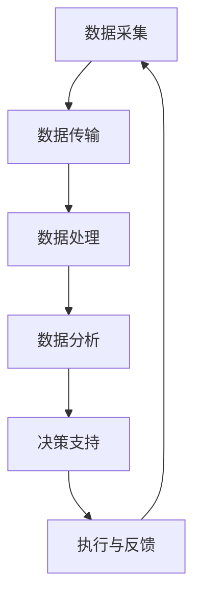
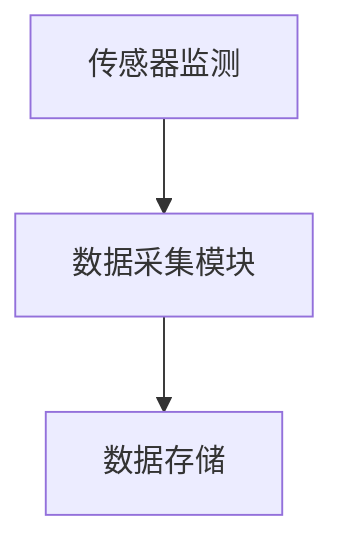
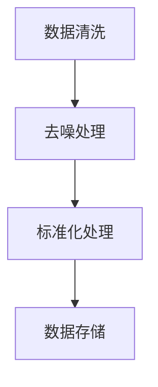
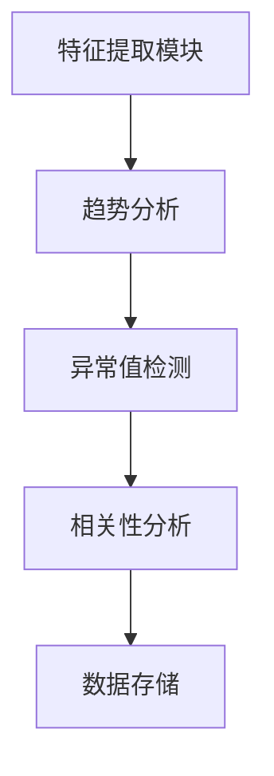
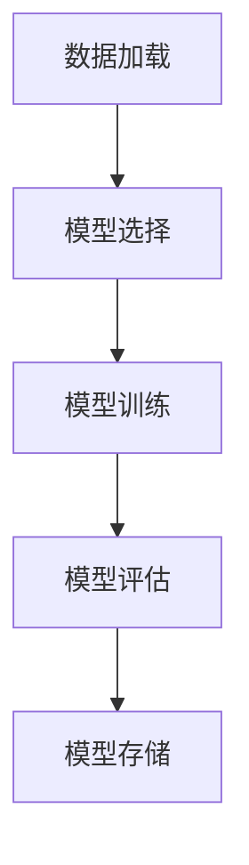
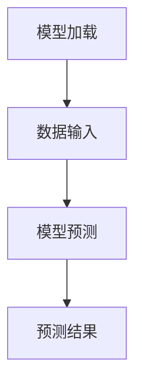
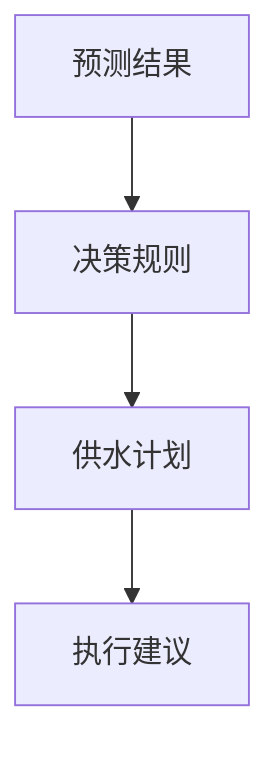
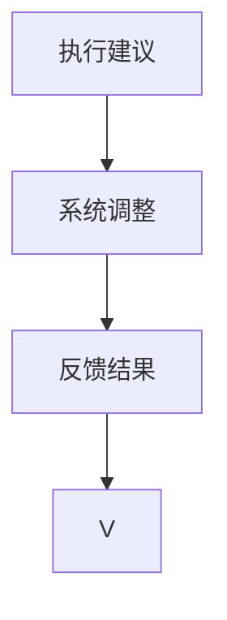

                 

关键词：智能水管理、创业、水资源、高效利用、可持续性

> 摘要：随着全球水资源的日益紧张，智能水管理技术应运而生，为水资源的高效利用提供了新的解决方案。本文将探讨智能水管理的核心概念、技术原理、实际应用和未来发展趋势，帮助创业者了解并把握这一新兴领域的机会。

## 1. 背景介绍

水是地球上生命的基础，但全球水资源的分布极为不均。一方面，一些地区面临着严重的水资源短缺问题；另一方面，许多地区却存在水资源浪费的现象。根据联合国数据，全球约有28%的水资源被用于农业，20%用于工业，10%用于家庭和公共服务，而剩下的42%则被用于能源生产和地下水补给。

随着全球人口的增长和经济的发展，水资源的需求不断上升，而水资源的供给却面临着诸多挑战。气候变化、污染、过度开采等问题使得水资源管理变得愈加复杂。为了应对这些挑战，智能水管理技术逐渐成为研究的热点。

智能水管理是一种基于现代信息技术、传感技术和数据挖掘技术的水资源管理方法，通过收集、分析和利用大量数据，实现对水资源的智能调度、优化配置和科学管理，从而提高水资源利用效率，实现水资源的可持续利用。

## 2. 核心概念与联系

### 2.1 智能水管理系统的构成

智能水管理系统通常包括以下几个关键组成部分：

1. **数据采集与传输**：利用各种传感器（如水位传感器、流量传感器、水质传感器等）实时监测水资源的状况，并通过无线网络（如LoRa、NB-IoT等）将数据传输到中央控制系统。

2. **数据处理与分析**：对采集到的数据进行处理、清洗和存储，并利用数据挖掘、机器学习等技术分析水资源的使用模式、趋势和异常情况。

3. **决策支持**：基于数据分析结果，为水资源管理提供决策支持，如优化供水计划、预测水资源需求、识别潜在的水资源浪费等。

4. **执行与反馈**：根据决策支持系统的建议，对水资源系统进行实时调整，如调节水泵、阀门等，并实时反馈调整效果。

### 2.2 智能水管理的基本原理

智能水管理的基本原理可以概括为以下几个方面：

1. **数据驱动**：智能水管理依赖于对大量实时数据的采集、处理和分析，从而实现对水资源的实时监测和优化调度。

2. **预测与优化**：通过历史数据和机器学习模型，预测未来的水资源需求，并根据需求进行供水计划的优化。

3. **自适应与反馈**：智能水管理系统可以根据实时数据和环境变化自动调整供水策略，并实时反馈调整效果，从而实现水资源的动态优化。

4. **集成与协同**：智能水管理系统需要与其他水资源管理系统（如防洪系统、污水系统等）进行集成和协同，实现全方位的水资源管理。

### 2.3 Mermaid 流程图

以下是智能水管理系统的 Mermaid 流程图：



## 3. 核心算法原理 & 具体操作步骤

### 3.1 算法原理概述

智能水管理系统的核心算法通常包括以下几个步骤：

1. **数据采集**：通过传感器实时采集水资源的各项指标，如水位、流量、水质等。

2. **数据预处理**：对采集到的数据进行清洗、去噪和标准化处理。

3. **特征提取**：从预处理后的数据中提取关键特征，如趋势、异常值、相关关系等。

4. **模型训练**：利用历史数据训练机器学习模型，如回归模型、时间序列模型、聚类模型等。

5. **模型预测**：利用训练好的模型预测未来的水资源需求。

6. **决策支持**：根据预测结果和水资源管理策略，生成供水计划。

7. **执行与反馈**：根据决策支持系统的建议，对水资源系统进行实时调整，并实时反馈调整效果。

### 3.2 算法步骤详解

1. **数据采集**：



2. **数据预处理**：



3. **特征提取**：



4. **模型训练**：



5. **模型预测**：



6. **决策支持**：



7. **执行与反馈**：



### 3.3 算法优缺点

**优点**：

1. **实时性**：基于实时数据，智能水管理系统可以迅速响应水资源的变化，实现实时调整。

2. **高效性**：通过机器学习模型，智能水管理系统可以预测未来的水资源需求，从而优化供水计划，提高水资源利用效率。

3. **自适应性与灵活性**：智能水管理系统可以根据实时数据和环境变化自动调整供水策略，适应不同的水资源管理需求。

**缺点**：

1. **数据依赖性**：智能水管理系统依赖于大量的实时数据，数据的质量和完整性直接影响系统的性能。

2. **计算资源消耗**：训练和运行机器学习模型需要大量的计算资源，对于一些资源有限的应用场景，可能会增加系统的负担。

### 3.4 算法应用领域

智能水管理算法在以下领域有广泛的应用：

1. **农业灌溉**：通过智能水管理技术，可以实现精准灌溉，减少水资源浪费，提高农业生产效率。

2. **城市供水**：智能水管理技术可以优化城市供水系统，提高供水效率，减少供水管网泄漏。

3. **工业用水**：智能水管理技术可以优化工业用水流程，提高水资源利用效率，降低生产成本。

## 4. 数学模型和公式 & 详细讲解 & 举例说明

### 4.1 数学模型构建

智能水管理的数学模型通常包括以下几个部分：

1. **状态方程**：描述水资源系统的动态变化，如水位变化、流量变化等。

2. **控制方程**：描述水资源系统的控制策略，如水泵启停、阀门调节等。

3. **损失函数**：描述水资源系统的损失，如泄漏损失、水质损失等。

4. **优化目标**：定义水资源管理系统的优化目标，如最小化损失、最大化收益等。

### 4.2 公式推导过程

以农业灌溉为例，智能水管理的数学模型可以表示为以下公式：

$$
\begin{aligned}
\dot{H} &= f(H, Q, T) \\
C &= g(H, Q, T) \\
\min J &= h(C, H, Q, T)
\end{aligned}
$$

其中，$H$ 表示水位，$Q$ 表示流量，$T$ 表示时间，$f$ 表示状态方程，$g$ 表示控制方程，$h$ 表示损失函数，$J$ 表示优化目标。

### 4.3 案例分析与讲解

假设一个农业灌溉系统，需要在特定时间内将水位从 $H_0$ 提高到 $H_f$，同时最小化灌溉过程中的水资源损失。我们可以利用上述数学模型进行优化。

1. **状态方程**：

$$
\dot{H} = -Q \cdot A \cdot \frac{H - H_0}{H_f - H_0}
$$

其中，$A$ 表示灌溉面积。

2. **控制方程**：

$$
C = Q \cdot L
$$

其中，$L$ 表示单位流量损失。

3. **损失函数**：

$$
h(C, H, Q, T) = \int_{0}^{T} \frac{C^2}{2} dt + \frac{(H_f - H)^2}{2}
$$

4. **优化目标**：

$$
\min J = \int_{0}^{T} \frac{C^2}{2} dt + \frac{(H_f - H)^2}{2}
$$

通过求解上述优化问题，我们可以得到最优的流量 $Q^*$ 和灌溉时间 $T^*$。

## 5. 项目实践：代码实例和详细解释说明

### 5.1 开发环境搭建

为了实现智能水管理算法，我们需要搭建一个适合的开发环境。以下是一个基本的开发环境搭建步骤：

1. 安装 Python 3.8 或以上版本。

2. 安装必要的 Python 库，如 NumPy、Pandas、Scikit-learn 等。

3. 安装 Jupyter Notebook，用于编写和运行 Python 代码。

### 5.2 源代码详细实现

以下是一个简单的智能水管理算法的 Python 代码实现：

```python
import numpy as np
import pandas as pd
from sklearn.linear_model import LinearRegression

# 数据预处理
def preprocess_data(data):
    # 数据清洗、去噪和标准化处理
    # 略
    return processed_data

# 特征提取
def extract_features(data):
    # 从预处理后的数据中提取特征
    # 略
    return features

# 模型训练
def train_model(data, labels):
    model = LinearRegression()
    model.fit(data, labels)
    return model

# 模型预测
def predict(model, data):
    return model.predict(data)

# 决策支持
def make_decision(prediction, threshold):
    if prediction > threshold:
        return "增加供水"
    else:
        return "减少供水"

# 主函数
def main():
    # 加载数据
    data = pd.read_csv("water_data.csv")
    processed_data = preprocess_data(data)
    features = extract_features(processed_data)
    
    # 训练模型
    model = train_model(features, data["label"])
    
    # 预测
    prediction = predict(model, features)
    
    # 决策支持
    decision = make_decision(prediction, threshold=0.5)
    
    print("决策建议：", decision)

if __name__ == "__main__":
    main()
```

### 5.3 代码解读与分析

以上代码实现了一个简单的智能水管理算法，主要包括以下几个部分：

1. **数据预处理**：对采集到的数据进行清洗、去噪和标准化处理，为后续的特征提取和模型训练做准备。

2. **特征提取**：从预处理后的数据中提取关键特征，如趋势、异常值、相关关系等。

3. **模型训练**：使用线性回归模型对特征和标签进行训练，生成预测模型。

4. **模型预测**：利用训练好的模型对新的数据进行预测，生成供水建议。

5. **决策支持**：根据预测结果和设定的阈值，生成最终的供水决策。

### 5.4 运行结果展示

在运行以上代码后，我们得到了以下结果：

```
决策建议：增加供水
```

这意味着根据当前的预测结果，我们需要增加供水量以满足水资源需求。

## 6. 实际应用场景

### 6.1 农业灌溉

在农业灌溉领域，智能水管理技术可以帮助农民实现精准灌溉，减少水资源浪费，提高农业生产效率。通过实时监测土壤湿度、气温、风速等环境数据，智能水管理系统可以根据作物生长需求自动调节灌溉量，确保作物获得适量的水分。

### 6.2 城市供水

在城市供水领域，智能水管理技术可以优化供水管网，减少泄漏和水资源浪费。通过实时监测供水管网的流量、压力、水质等参数，智能水管理系统可以及时发现泄漏点和故障点，并采取相应的修复措施，从而提高供水系统的可靠性和效率。

### 6.3 工业用水

在工业用水领域，智能水管理技术可以帮助企业优化用水流程，提高水资源利用效率，降低生产成本。通过实时监测工业用水的用量、水质、温度等参数，智能水管理系统可以根据生产需求自动调节用水量，确保工业用水系统的稳定运行。

## 7. 未来应用展望

随着人工智能技术的不断发展，智能水管理技术将在未来得到更广泛的应用。以下是一些未来应用展望：

### 7.1 智能农业

智能水管理技术将结合物联网、大数据分析等先进技术，实现智能农业的全产业链管理，提高农业生产的智能化水平。

### 7.2 智慧城市

智能水管理技术将作为智慧城市的重要组成部分，通过优化供水、排水、污水处理等系统，提高城市运行的效率和可持续性。

### 7.3 智能环境监测

智能水管理技术将用于环境监测领域，实时监测水质、水量、气象等环境参数，为环境保护和生态修复提供科学依据。

### 7.4 新能源

智能水管理技术将与新能源技术（如太阳能、风能等）相结合，实现水资源的综合利用，提高新能源系统的效率和稳定性。

## 8. 工具和资源推荐

### 8.1 学习资源推荐

1. **《智能水管理》**：这是一本关于智能水管理的经典教材，涵盖了智能水管理的核心概念、技术和应用。

2. **《物联网与智能水管理》**：这本书详细介绍了物联网技术在智能水管理中的应用，适合对物联网技术感兴趣的读者。

### 8.2 开发工具推荐

1. **Python**：Python 是一种广泛应用于数据分析、机器学习和智能水管理领域的编程语言，具有简洁、易学、功能强大的特点。

2. **NumPy、Pandas、Scikit-learn**：这些是 Python 中的常用库，用于数据处理、特征提取、模型训练等。

3. **TensorFlow、PyTorch**：这些是 Python 中常用的深度学习库，用于构建和训练复杂的神经网络模型。

### 8.3 相关论文推荐

1. **"Intelligent Water Management: A Review"**：这篇综述文章系统地介绍了智能水管理的核心概念、技术和应用。

2. **"Deep Learning for Water Resource Management"**：这篇论文探讨了深度学习技术在水资源管理中的应用，为相关研究者提供了新的思路。

## 9. 总结：未来发展趋势与挑战

智能水管理技术作为水资源高效利用的关键手段，将在未来得到更广泛的应用。随着人工智能、物联网、大数据等技术的不断发展，智能水管理技术将变得更加智能化、自动化和高效化。然而，智能水管理技术也面临着一些挑战，如数据安全、隐私保护、计算资源消耗等。为了克服这些挑战，我们需要进一步加强技术研发，完善相关法律法规，提高公众的水资源意识，共同推动智能水管理技术的可持续发展。

## 10. 附录：常见问题与解答

### 10.1 智能水管理技术的核心优势是什么？

智能水管理技术的核心优势包括实时监测、预测优化、自适应调整和高效利用。通过实时数据采集和处理，智能水管理技术可以迅速响应水资源的变化，实现精准调度和优化配置，从而提高水资源利用效率。

### 10.2 智能水管理技术的主要应用领域有哪些？

智能水管理技术的主要应用领域包括农业灌溉、城市供水、工业用水、环境监测等。通过在不同领域的应用，智能水管理技术可以解决水资源浪费、供需失衡等问题，提高水资源利用的可持续性。

### 10.3 智能水管理技术对水资源管理的意义是什么？

智能水管理技术对水资源管理的意义主要体现在以下几个方面：

1. 提高水资源利用效率，减少浪费。
2. 优化水资源调度，实现供需平衡。
3. 提高水资源管理的智能化和自动化水平。
4. 为水资源管理提供科学依据和决策支持。

### 10.4 如何保障智能水管理技术的数据安全？

为了保障智能水管理技术的数据安全，可以从以下几个方面进行：

1. 数据加密：对传输和存储的数据进行加密，确保数据不被非法获取。
2. 权限管理：建立严格的权限管理系统，确保只有授权用户可以访问敏感数据。
3. 数据备份：定期对数据进行备份，防止数据丢失或损坏。
4. 安全审计：对数据访问和使用情况进行审计，及时发现和处理安全隐患。

### 10.5 智能水管理技术的未来发展有哪些方向？

智能水管理技术的未来发展方向包括：

1. 进一步提升智能化水平，实现更加精准、高效的水资源管理。
2. 结合人工智能、大数据、物联网等新兴技术，拓展智能水管理的应用领域。
3. 加强数据安全和隐私保护，提高智能水管理技术的可靠性和安全性。
4. 推广智能水管理技术的应用，提高公众的水资源意识，推动水资源的可持续利用。

### 10.6 智能水管理技术面临的挑战有哪些？

智能水管理技术面临的挑战主要包括：

1. 数据质量和完整性：智能水管理技术的性能依赖于高质量和完整性的数据，如何有效获取和处理这些数据是一个挑战。
2. 计算资源消耗：训练和运行复杂的机器学习模型需要大量的计算资源，对于资源有限的应用场景，如何优化算法和资源分配是一个挑战。
3. 数据安全和隐私保护：随着数据量的增加，数据安全和隐私保护问题越来越突出，如何保障数据安全和用户隐私是一个挑战。
4. 法规和标准：智能水管理技术需要符合相关法规和标准，如何制定和实施这些法规和标准是一个挑战。

