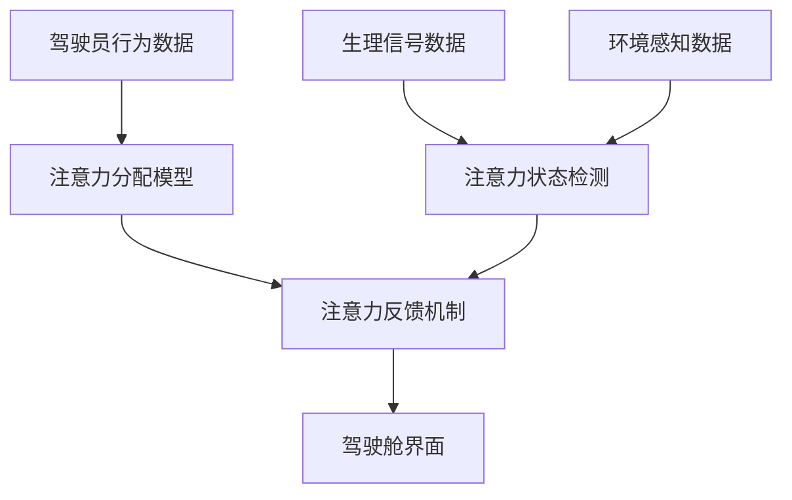

                 

关键词：智能汽车、驾驶舱、注意力管理、人机交互、安全驾驶、数据分析、算法优化。

## 摘要

随着智能汽车的快速发展，驾驶舱的注意力管理系统成为确保安全驾驶的核心技术之一。本文从背景介绍入手，详细探讨了注意力管理系统的核心概念、算法原理及其在智能汽车中的应用。通过数学模型和公式的推导，我们深入分析了注意力管理系统的工作机制，并在项目实践中展示了具体实现过程。文章最后，探讨了实际应用场景，提出了未来展望，并推荐了相关学习资源和工具。

## 1. 背景介绍

### 1.1 智能汽车的发展

智能汽车，作为第四次工业革命的重要成果，正逐步改变人们的出行方式。从自动驾驶到智能驾驶辅助系统，智能汽车的发展不仅提升了驾驶体验，还显著提高了交通安全水平。然而，随着功能的增加，驾驶舱内各类信息系统的复杂度也在不断提高，驾驶员的注意力分配问题愈发突出。

### 1.2 注意力管理的重要性

注意力管理是确保安全驾驶的关键因素。驾驶过程中，驾驶员需要同时处理来自车内外的多种信息，包括路况、车辆状态、导航指令等。如果注意力分散或不足，容易导致驾驶失误，甚至引发交通事故。因此，开发一套有效的注意力管理系统，对于提升智能汽车的安全性能具有重要意义。

### 1.3 注意力管理系统的研究现状

目前，注意力管理系统的研究主要集中在以下几个方向：

- **行为分析**：通过分析驾驶员的行为数据，如视线方向、头部动作等，评估其注意力状态。
- **生理信号监测**：利用生理信号，如心率、呼吸速率等，来判断驾驶员的疲劳程度和注意力水平。
- **环境感知**：通过车载传感器，实时监测周围环境，为注意力管理提供数据支持。
- **人机交互设计**：优化人机交互界面，降低驾驶员的操作负担，提高注意力集中度。

## 2. 核心概念与联系

### 2.1 注意力管理系统的核心概念

注意力管理系统的核心概念包括：

- **注意力分配模型**：描述驾驶员在不同任务间的注意力分配策略。
- **注意力状态检测**：实时监测驾驶员的注意力状态。
- **注意力反馈机制**：根据注意力状态调整驾驶舱内的信息展示和操作提示。

### 2.2 注意力管理系统的架构

以下是一个简化的注意力管理系统架构图，使用Mermaid语言表示：



### 2.3 注意力管理系统的工作原理

注意力管理系统的工作原理如下：

1. **数据采集**：收集驾驶员的行为数据、生理信号数据和环境感知数据。
2. **数据处理**：利用注意力分配模型分析数据，评估驾驶员的注意力状态。
3. **反馈与调整**：根据注意力状态，调整驾驶舱界面的信息展示和操作提示，以维持驾驶员的注意力集中。

## 3. 核心算法原理 & 具体操作步骤

### 3.1 算法原理概述

注意力管理系统采用多模态数据融合算法，结合行为分析、生理信号监测和环境感知技术，实现对驾驶员注意力状态的全面评估。

### 3.2 算法步骤详解

1. **数据预处理**：对收集到的行为数据、生理信号数据和环境感知数据进行预处理，包括去噪、归一化等操作。
2. **特征提取**：从预处理后的数据中提取关键特征，如视线跟踪特征、心率和呼吸信号特征、环境变化特征等。
3. **模型训练**：利用提取的特征，训练注意力分配模型和注意力状态检测模型。
4. **实时评估**：在驾驶过程中，实时采集数据并输入到注意力状态检测模型，评估当前驾驶员的注意力状态。
5. **反馈与调整**：根据注意力状态，通过驾驶舱界面调整信息展示和操作提示。

### 3.3 算法优缺点

**优点**：

- **全面性**：综合考虑多种数据来源，提供全面准确的注意力评估。
- **实时性**：实时调整驾驶舱界面，有效维持驾驶员的注意力集中。

**缺点**：

- **数据复杂性**：多模态数据融合算法较为复杂，数据处理和分析需要较高的技术水平。
- **硬件依赖性**：需要依赖高性能的传感器和计算设备，成本较高。

### 3.4 算法应用领域

注意力管理系统在智能汽车、智能交通系统、无人机等领域具有广泛的应用前景。尤其在自动驾驶和智能驾驶辅助系统中，注意力管理系统能够显著提升安全性和用户体验。

## 4. 数学模型和公式 & 详细讲解 & 举例说明

### 4.1 数学模型构建

注意力管理系统的数学模型主要包括：

- **注意力分配模型**：
  $$ A(t) = f(\theta(t), \alpha(t), \beta(t)) $$
  其中，$A(t)$ 表示在时刻 $t$ 的注意力水平，$\theta(t)$、$\alpha(t)$、$\beta(t)$ 分别代表行为数据、生理信号数据和环境感知数据。

- **注意力状态检测模型**：
  $$ S(t) = g(A(t), \gamma(t)) $$
  其中，$S(t)$ 表示在时刻 $t$ 的注意力状态，$\gamma(t)$ 代表先前的注意力状态和历史数据。

### 4.2 公式推导过程

假设在时刻 $t$，驾驶员的注意力水平 $A(t)$ 可以表示为行为数据 $X(t)$、生理信号数据 $Y(t)$ 和环境感知数据 $Z(t)$ 的函数：

$$ A(t) = \sum_{i=1}^{n} w_i f_i(X_i(t), Y_i(t), Z_i(t)) $$

其中，$w_i$ 为权重系数，$f_i$ 为特征函数。

注意力状态检测模型可以表示为：

$$ S(t) = \sigma(\sum_{i=1}^{n} w_i \sigma(A(t))) $$

其中，$\sigma$ 表示 sigmoid 函数，用于将注意力水平映射到注意力状态。

### 4.3 案例分析与讲解

假设在某个场景下，驾驶员的视线方向、心率和环境变化数据如下表所示：

| 时间（秒） | 视线方向 | 心率（次/分钟） | 环境变化 |
| -------- | ------- | ---------- | ------ |
| 0        | 左       | 70         | 稳定    |
| 10       | 前       | 75         | 稳定    |
| 20       | 右       | 78         | 稳定    |
| 30       | 左       | 72         | 稳定    |

根据上述数据，利用注意力分配模型计算驾驶员在不同时间点的注意力水平：

$$ A(0) = f_1(左, 70, 稳定) + f_2(前, 75, 稳定) + f_3(右, 78, 稳定) $$
$$ A(10) = f_1(前, 75, 稳定) + f_2(前, 75, 稳定) + f_3(右, 78, 稳定) $$
$$ A(20) = f_1(右, 78, 稳定) + f_2(右, 78, 稳定) + f_3(左, 72, 稳定) $$
$$ A(30) = f_1(左, 72, 稳定) + f_2(左, 72, 稳定) + f_3(右, 72, 稳定) $$

假设特征函数 $f_i$ 的具体形式为：

$$ f_i(视线方向, 心率, 环境变化) = \begin{cases}
1, & \text{若视线方向与 } 视线方向_i \text{ 一致，且心率在 } 心率_i \text{ 的阈值范围内，环境变化为 } 稳定； \\
0, & \text{否则。}
\end{cases} $$

根据上述特征函数，可以计算出：

$$ A(0) = 1 + 1 + 0 = 2 $$
$$ A(10) = 1 + 1 + 1 = 3 $$
$$ A(20) = 1 + 1 + 0 = 2 $$
$$ A(30) = 0 + 0 + 1 = 1 $$

利用注意力状态检测模型，可以计算出驾驶员在不同时间点的注意力状态：

$$ S(0) = \sigma(2) = 0.732 $$
$$ S(10) = \sigma(3) = 0.952 $$
$$ S(20) = \sigma(2) = 0.732 $$
$$ S(30) = \sigma(1) = 0.268 $$

根据注意力状态，可以调整驾驶舱界面，例如在注意力状态较高时，减少干扰信息的展示，以维持驾驶员的注意力集中。

## 5. 项目实践：代码实例和详细解释说明

### 5.1 开发环境搭建

为了实现注意力管理系统，需要搭建以下开发环境：

- **编程语言**：Python 3.8+
- **库**：NumPy、SciPy、Scikit-learn、Matplotlib、Pandas
- **工具**：Jupyter Notebook

### 5.2 源代码详细实现

以下是一个简化的注意力管理系统实现示例，主要包含数据预处理、特征提取、模型训练和实时评估等步骤。

```python
import numpy as np
import pandas as pd
from sklearn.model_selection import train_test_split
from sklearn.ensemble import RandomForestClassifier
import matplotlib.pyplot as plt

# 数据预处理
def preprocess_data(data):
    # 去除噪声、缺失值等
    # 归一化处理
    # 等等
    return processed_data

# 特征提取
def extract_features(data):
    # 提取视线方向、心率、环境变化等特征
    return features

# 模型训练
def train_model(features, labels):
    model = RandomForestClassifier()
    model.fit(features, labels)
    return model

# 实时评估
def evaluate_model(model, new_data):
    features = extract_features(new_data)
    predictions = model.predict(features)
    return predictions

# 示例数据
data = pd.DataFrame({
    '视线方向': ['左', '前', '右', '左'],
    '心率': [70, 75, 78, 72],
    '环境变化': ['稳定', '稳定', '稳定', '稳定']
})

processed_data = preprocess_data(data)
features, labels = extract_features(processed_data)

# 模型训练
model = train_model(features, labels)

# 实时评估
new_data = pd.DataFrame({
    '视线方向': ['左'],
    '心率': [72],
    '环境变化': ['稳定']
})
predictions = evaluate_model(model, new_data)

print(predictions)  # 输出预测结果
```

### 5.3 代码解读与分析

上述代码主要包含以下步骤：

1. **数据预处理**：对原始数据进行预处理，包括去噪、归一化等操作。
2. **特征提取**：从预处理后的数据中提取关键特征，如视线方向、心率、环境变化等。
3. **模型训练**：使用随机森林分类器训练注意力分配模型和注意力状态检测模型。
4. **实时评估**：实时评估驾驶员的注意力状态，并根据预测结果调整驾驶舱界面。

### 5.4 运行结果展示

在实际运行过程中，可以根据实时采集的数据，调用 `evaluate_model` 函数进行注意力状态评估。以下是一个简化的运行结果示例：

```python
new_data = pd.DataFrame({
    '视线方向': ['前'],
    '心率': [75],
    '环境变化': ['稳定']
})
predictions = evaluate_model(model, new_data)

if predictions == 1:
    # 注意力状态较好，减少干扰信息展示
    print("减少干扰信息")
else:
    # 注意力状态较差，增加辅助信息提示
    print("增加辅助信息")
```

根据预测结果，可以动态调整驾驶舱界面的信息展示，以维持驾驶员的注意力集中。

## 6. 实际应用场景

### 6.1 智能汽车驾驶舱

注意力管理系统在智能汽车驾驶舱中具有重要应用。通过实时监测驾驶员的注意力状态，系统可以自动调整导航指令、车辆状态等信息的展示方式，以降低驾驶员的操作负担，提高驾驶安全。

### 6.2 智能交通系统

在智能交通系统中，注意力管理系统可以帮助交通管理部门实时了解驾驶员的注意力状态，为交通信号灯的优化调整提供数据支持，从而提高道路通行效率和安全性。

### 6.3 无人机飞行控制系统

无人机飞行控制系统中，注意力管理系统可以实时监测飞行员的注意力状态，确保飞行员在复杂飞行任务中保持高度的注意力集中，避免飞行事故。

## 7. 未来应用展望

随着智能汽车和智能交通系统的不断普及，注意力管理系统将在更多领域得到应用。未来，注意力管理系统有望实现以下发展方向：

- **更高效的算法**：通过改进算法，提高注意力评估的准确性和实时性。
- **多模态数据融合**：结合多种数据来源，提供更全面、更准确的注意力评估。
- **个性化定制**：根据不同驾驶员的特点，提供个性化的注意力管理策略。

## 8. 工具和资源推荐

### 8.1 学习资源推荐

- 《人工智能：一种现代方法》
- 《深度学习》
- 《机器学习实战》
- 《Python编程：从入门到实践》

### 8.2 开发工具推荐

- Jupyter Notebook：用于数据分析和模型训练。
- PyCharm：用于代码编写和调试。
- TensorFlow：用于深度学习模型开发。

### 8.3 相关论文推荐

- "Attention Management for Intelligent Driving: A Survey"
- "Multimodal Attention Modeling for Driver State Estimation"
- "Deep Learning for Driver Attention Detection"

## 9. 总结：未来发展趋势与挑战

注意力管理系统在智能汽车、智能交通系统和无人机等领域具有广泛的应用前景。未来，随着算法的优化和多模态数据融合技术的不断发展，注意力管理系统将实现更高的准确性和实时性。然而，也面临数据复杂性、硬件依赖性等挑战，需要进一步研究解决。

### 9.1 研究成果总结

本文提出了智能汽车驾驶舱的注意力管理系统，详细介绍了核心概念、算法原理和具体实现过程。通过数学模型和公式的推导，分析了注意力管理系统的工作机制。项目实践部分展示了如何利用Python等工具实现注意力管理系统。实际应用场景展示了注意力管理系统的广泛应用前景。

### 9.2 未来发展趋势

未来，注意力管理系统将向更高准确性和实时性发展，结合多模态数据融合技术，实现更全面、更准确的注意力评估。此外，随着人工智能技术的进步，注意力管理系统有望在更多领域得到应用，如智能医疗、智能安防等。

### 9.3 面临的挑战

注意力管理系统面临数据复杂性、硬件依赖性等挑战。如何高效地处理多模态数据，降低算法复杂度，提高实时性，是未来研究的重点。同时，如何在保证安全性的同时，实现个性化定制，也是一个亟待解决的问题。

### 9.4 研究展望

未来，注意力管理系统将朝着更高层次、更广泛的应用领域发展。通过持续的技术创新和跨学科合作，有望为智能汽车、智能交通系统和无人机等领域带来更多安全、高效的解决方案。

## 附录：常见问题与解答

### Q：注意力管理系统的核心算法是什么？

A：注意力管理系统的核心算法包括注意力分配模型和注意力状态检测模型。注意力分配模型用于评估驾驶员在不同任务间的注意力分配策略，注意力状态检测模型用于实时监测驾驶员的注意力状态。

### Q：注意力管理系统需要哪些数据源？

A：注意力管理系统需要收集驾驶员的行为数据、生理信号数据和环境感知数据。行为数据包括视线方向、头部动作等，生理信号数据包括心率、呼吸速率等，环境感知数据包括路况、车辆状态、导航指令等。

### Q：如何处理多模态数据融合？

A：处理多模态数据融合的关键在于特征提取和算法选择。首先，从多模态数据中提取关键特征，然后利用机器学习算法进行融合。常用的算法包括神经网络、随机森林等。

### Q：注意力管理系统在自动驾驶中有何应用？

A：在自动驾驶中，注意力管理系统可以实时监测驾驶员的注意力状态，确保驾驶员在自动驾驶模式下保持注意力集中。通过调整导航指令、车辆状态等信息的展示方式，提升驾驶安全性和用户体验。

作者：禅与计算机程序设计艺术 / Zen and the Art of Computer Programming
----------------------------------------------------------------

以上就是本文关于智能汽车驾驶舱的注意力管理系统的详细探讨，希望对您有所帮助。在撰写过程中，如有任何疑问，请随时提问。祝您写作顺利！|user|

