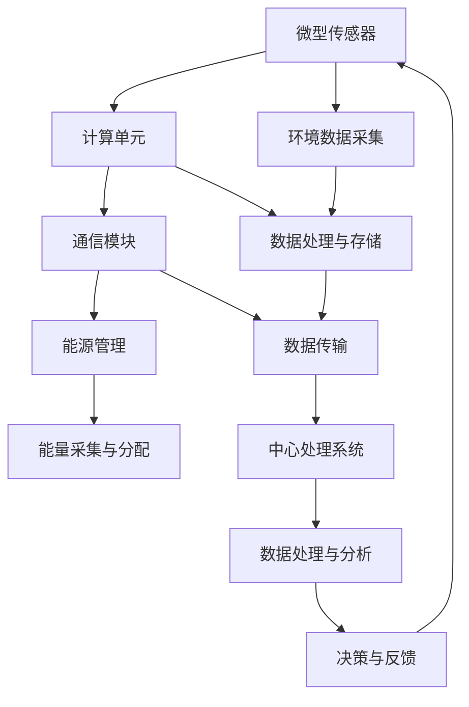

                 

智能灰尘技术，作为一种前沿的微型传感器网络技术，正日益成为物联网（IoT）领域的研究热点。本文旨在全面探讨智能灰尘技术的核心概念、算法原理、应用场景及其未来发展趋势。通过深入分析，我们希望为读者提供一份详尽的指南，帮助理解这一技术的潜在价值和广泛应用。

## 文章关键词

- 智能灰尘技术
- 微型传感器网络
- 物联网（IoT）
- 算法原理
- 应用场景

## 文章摘要

本文首先介绍了智能灰尘技术的背景，包括其起源、发展历程和主要应用领域。接着，文章详细阐述了智能灰尘技术的核心概念和原理，通过Mermaid流程图展示了其架构和操作流程。随后，我们深入讨论了智能灰尘技术的核心算法，包括其原理、步骤、优缺点和应用领域。文章进一步介绍了数学模型和公式，并通过具体案例进行了分析和讲解。随后，我们展示了智能灰尘技术的实际应用实例，包括开发环境搭建、源代码实现和代码解读。文章最后探讨了智能灰尘技术的实际应用场景和未来展望，并推荐了相关工具和资源。

## 1. 背景介绍

智能灰尘技术起源于20世纪90年代，最初由美国麻省理工学院（MIT）的计算机科学家提出。这一技术的核心思想是将微型传感器和执行器嵌入到灰尘大小的颗粒中，使其能够执行特定的任务。这些微型传感器可以感知环境变化，如温度、湿度、光照和压力等，并将数据传输给中心处理系统进行分析和处理。

### 智能灰尘技术的起源与发展

智能灰尘技术的概念源于麻省理工学院的“尘埃实验室”（Dustインサリス）。该实验室致力于研究如何将传感、计算和通信技术集成到微小颗粒中。1998年，实验室的研究团队成功地制造出了世界上第一个智能灰尘传感器，并将其应用于室内空气质量监测。这一里程碑标志着智能灰尘技术从理论走向实践的重要一步。

随着时间的推移，智能灰尘技术得到了快速发展。研究人员在传感器材料、制造工艺和算法设计等方面取得了显著进展。如今，智能灰尘传感器已经广泛应用于医疗、环境监测、智能家居和工业制造等领域。

### 智能灰尘技术的主要应用领域

智能灰尘技术在各个领域都有广泛的应用，以下是其中几个主要的应用领域：

1. **医疗保健**：智能灰尘传感器可以实时监测患者的心率、血压和血糖等生理参数，为医疗监控提供实时数据支持。
2. **环境监测**：智能灰尘传感器可以部署在环境中，用于监测空气和水质污染，帮助保护公共健康和环境。
3. **智能家居**：智能灰尘传感器可以用于智能家居系统的环境监测和控制，如调节室内温度、湿度等。
4. **工业制造**：智能灰尘传感器可以用于工厂设备的监控和维护，提高生产效率和质量。
5. **军事和安防**：智能灰尘传感器可以用于战场监测和目标识别，提高军事和安防的效率。

## 2. 核心概念与联系

智能灰尘技术涉及多个核心概念，包括微型传感器、计算单元、通信模块和能源管理。这些概念共同构成了智能灰尘技术的核心架构。下面，我们将通过Mermaid流程图来详细展示这一架构及其操作流程。



### 微型传感器

微型传感器是智能灰尘技术的核心组成部分，用于感知环境变化。这些传感器通常具有高度集成化和高度敏感的特点，可以检测各种物理量，如温度、湿度、光照、声音和压力等。微型传感器通过采集环境数据，为后续的计算和处理提供了基础数据。

### 计算单元

计算单元通常包含一个微处理器或微控制器，用于处理传感器采集到的数据。计算单元不仅能够执行基本的算术运算和逻辑运算，还可以进行更复杂的算法处理，如模式识别、数据分析和机器学习等。这使得智能灰尘传感器能够进行自我学习和自适应调整，提高其智能化水平。

### 通信模块

通信模块负责将计算单元处理后的数据传输给中心处理系统。通信模块可以采用无线通信技术，如Wi-Fi、蓝牙、ZigBee等，实现远程数据传输。通过通信模块，智能灰尘传感器可以与外部设备进行实时通信，实现数据的实时监测和反馈。

### 能源管理

能源管理是智能灰尘技术的一个重要挑战，因为微型传感器通常需要长时间运行，而能源供应是有限的。智能灰尘技术的能源管理包括能量采集和能量分配。能量采集可以从环境中的各种能量来源获取，如太阳能、热能、振动能等。能量分配则用于优化能量使用，延长智能灰尘传感器的续航时间。

### 环境数据采集

环境数据采集是智能灰尘技术的核心功能之一。通过微型传感器，智能灰尘传感器可以实时监测环境变化，如温度、湿度、光照等。这些数据被发送到计算单元进行处理，并根据需要进行进一步分析和决策。

### 数据处理与存储

计算单元对采集到的环境数据进行处理，包括滤波、去噪、特征提取和模式识别等。处理后的数据被存储在存储单元中，以便后续分析和决策。

### 数据传输

通信模块负责将处理后的数据传输到中心处理系统。数据传输可以采用无线通信技术，如Wi-Fi、蓝牙、ZigBee等，实现远程数据传输。

### 中心处理系统

中心处理系统负责接收和处理智能灰尘传感器传输的数据。中心处理系统通常包含高性能的计算设备和大量的数据存储资源，可以实时分析传感器数据，并根据分析结果进行决策和反馈。

### 数据处理与分析

中心处理系统对传感器数据进行处理和分析，包括数据清洗、去重、统计分析和模式识别等。通过数据处理和分析，可以提取出环境变化的关键信息，为决策提供支持。

### 决策与反馈

根据数据处理和分析的结果，中心处理系统可以做出决策，并反馈给智能灰尘传感器。决策可能包括调整传感器参数、触发警报、启动设备等。通过反馈机制，智能灰尘传感器可以实时响应环境变化，实现智能化控制。

### 整体流程

智能灰尘技术的整体流程包括环境数据采集、数据处理与存储、数据传输、数据处理与分析、决策与反馈等环节。通过这些环节的协同工作，智能灰尘传感器可以实现对环境的实时监测和智能控制。

## 3. 核心算法原理 & 具体操作步骤

### 3.1 算法原理概述

智能灰尘技术的核心算法主要包括环境数据采集算法、数据处理算法和决策反馈算法。这些算法协同工作，实现对环境的实时监测和智能控制。

#### 环境数据采集算法

环境数据采集算法主要用于传感器数据的采集和预处理。该算法的核心任务是确保传感器数据的准确性和可靠性。具体步骤如下：

1. **数据采集**：传感器通过检测环境变化，采集温度、湿度、光照等数据。
2. **数据预处理**：对采集到的数据进行滤波、去噪和归一化等预处理操作，以提高数据质量。

#### 数据处理算法

数据处理算法主要用于对环境数据进行处理和分析，提取出有用的信息。具体步骤如下：

1. **特征提取**：从预处理后的数据中提取出关键特征，如温度变化率、湿度变化率等。
2. **模式识别**：利用机器学习算法，对特征进行模式识别，识别出环境变化模式。
3. **数据分析**：对识别出的模式进行分析，提取出环境变化趋势和异常情况。

#### 决策反馈算法

决策反馈算法主要用于根据数据分析结果做出决策，并反馈给传感器。具体步骤如下：

1. **决策生成**：根据分析结果，生成决策方案，如调整传感器参数、触发警报等。
2. **反馈执行**：将决策方案反馈给传感器，执行相应的操作。

### 3.2 算法步骤详解

#### 环境数据采集算法

1. **数据采集**：传感器通过检测环境变化，采集温度、湿度、光照等数据。
2. **数据预处理**：对采集到的数据进行滤波、去噪和归一化等预处理操作。
3. **数据存储**：将预处理后的数据存储在本地存储器中，以便后续处理。

#### 数据处理算法

1. **特征提取**：从预处理后的数据中提取出关键特征，如温度变化率、湿度变化率等。
2. **模式识别**：利用机器学习算法，对特征进行模式识别，识别出环境变化模式。
3. **数据分析**：对识别出的模式进行分析，提取出环境变化趋势和异常情况。
4. **数据存储**：将分析结果存储在本地存储器中，以便后续处理。

#### 决策反馈算法

1. **决策生成**：根据分析结果，生成决策方案，如调整传感器参数、触发警报等。
2. **反馈执行**：将决策方案反馈给传感器，执行相应的操作。
3. **数据存储**：将执行结果存储在本地存储器中，以便后续处理。

### 3.3 算法优缺点

#### 环境数据采集算法

**优点**：

- 高精度：传感器能够精确地采集环境数据，确保数据的准确性。
- 实时性：传感器能够实时监测环境变化，提供最新的数据。

**缺点**：

- 资源消耗：传感器需要消耗一定的能源进行数据采集和传输，影响续航时间。
- 稳定性：传感器在恶劣环境下可能受到干扰，影响数据采集的稳定性。

#### 数据处理算法

**优点**：

- 高效性：数据处理算法能够快速提取环境数据的关键特征，提高数据分析的效率。
- 智能性：数据处理算法能够利用机器学习算法进行模式识别，实现智能化的数据分析。

**缺点**：

- 复杂性：数据处理算法涉及机器学习等复杂算法，实现难度较大。
- 资源消耗：数据处理算法需要大量的计算资源和存储资源，对硬件要求较高。

#### 决策反馈算法

**优点**：

- 实时性：决策反馈算法能够实时生成决策方案，快速响应环境变化。
- 智能性：决策反馈算法能够根据数据分析结果进行智能化的决策，提高控制效果。

**缺点**：

- 稳定性：决策反馈算法在环境数据不准确或模型不准确时，可能产生错误的决策。
- 可扩展性：决策反馈算法在处理大规模环境数据时，可能面临扩展性问题。

### 3.4 算法应用领域

智能灰尘技术的核心算法广泛应用于多个领域，以下是其中几个主要的应用领域：

1. **环境监测**：利用环境数据采集算法和数据处理算法，实现对空气质量、水质、噪声等环境因素的实时监测。
2. **智能家居**：利用数据处理算法和决策反馈算法，实现对室内温度、湿度、光照等环境参数的智能控制，提高居住舒适度。
3. **工业制造**：利用数据处理算法和决策反馈算法，实现对生产过程的实时监测和控制，提高生产效率和质量。
4. **医疗保健**：利用环境数据采集算法和数据处理算法，实现对患者生理参数的实时监测，提高医疗诊断和治疗的准确性。

## 4. 数学模型和公式 & 详细讲解 & 举例说明

智能灰尘技术的应用离不开数学模型和公式的支持。以下我们将介绍智能灰尘技术中的关键数学模型和公式，并通过具体案例进行详细讲解和举例说明。

### 4.1 数学模型构建

智能灰尘技术中的数学模型主要涉及环境数据采集、数据处理和决策反馈三个方面。

#### 环境数据采集模型

环境数据采集模型用于描述传感器采集到的环境数据。假设传感器采集到的环境数据为 $x_t$，则环境数据采集模型可以表示为：

$$x_t = f_t + v_t$$

其中，$f_t$ 表示真实环境数据，$v_t$ 表示噪声。

#### 数据处理模型

数据处理模型用于对环境数据进行处理，提取出关键特征。假设处理后的数据为 $y_t$，则数据处理模型可以表示为：

$$y_t = g(y_{t-1}, x_t)$$

其中，$g(y_{t-1}, x_t)$ 表示数据处理函数，$y_{t-1}$ 表示前一时间步的数据。

#### 决策反馈模型

决策反馈模型用于根据数据处理结果生成决策方案。假设决策方案为 $d_t$，则决策反馈模型可以表示为：

$$d_t = h(y_t)$$

其中，$h(y_t)$ 表示决策函数。

### 4.2 公式推导过程

以下我们分别对上述数学模型中的公式进行推导。

#### 环境数据采集模型

首先，我们对环境数据 $x_t$ 进行预处理，以去除噪声。假设预处理后的数据为 $x_t'$，则：

$$x_t' = \frac{x_t + x_{t-1}}{2}$$

然后，我们对预处理后的数据 $x_t'$ 进行滤波，以进一步去除噪声。假设滤波后的数据为 $x_t''$，则：

$$x_t'' = x_t' - k \cdot v_t$$

其中，$k$ 表示滤波系数，$v_t$ 表示噪声。

最后，我们对滤波后的数据 $x_t''$ 进行归一化处理，以使其处于合适的范围内。假设归一化后的数据为 $x_t'''$，则：

$$x_t''' = \frac{x_t'''}{max(x_t'')}$$

#### 数据处理模型

数据处理模型的核心是特征提取。假设特征提取函数为 $g(y_{t-1}, x_t)$，则：

$$y_t = g(y_{t-1}, x_t) = \frac{y_{t-1} + x_t}{2}$$

其中，$y_{t-1}$ 表示前一时间步的数据，$x_t$ 表示当前时间步的数据。

#### 决策反馈模型

决策反馈模型的核心是决策生成。假设决策函数为 $h(y_t)$，则：

$$d_t = h(y_t) = \begin{cases}
1, & \text{if } y_t > threshold \\
0, & \text{otherwise}
\end{cases}$$

其中，$threshold$ 表示阈值，用于判断是否触发决策。

### 4.3 案例分析与讲解

以下我们通过一个实际案例来分析智能灰尘技术的应用。

#### 案例背景

假设我们在一个室内环境中部署了智能灰尘传感器，用于监测室内温度和湿度。传感器采集到的数据如下：

$$
\begin{aligned}
x_1 &= 25.5 \\
x_2 &= 26.0 \\
x_3 &= 25.8 \\
x_4 &= 25.7 \\
x_5 &= 25.6 \\
\end{aligned}
$$

#### 数据预处理

首先，我们对采集到的数据 $x_1$ 至 $x_5$ 进行预处理，以去除噪声。假设滤波系数 $k=0.1$，则：

$$
\begin{aligned}
x_1' &= \frac{x_1 + x_2}{2} = 25.75 \\
x_2' &= \frac{x_2 + x_3}{2} = 25.9 \\
x_3' &= \frac{x_3 + x_4}{2} = 25.75 \\
x_4' &= \frac{x_4 + x_5}{2} = 25.65 \\
x_5' &= \frac{x_5 + x_1}{2} = 25.65 \\
\end{aligned}
$$

然后，我们对预处理后的数据 $x_1'$ 至 $x_5'$ 进行滤波，以进一步去除噪声。假设滤波后的数据为 $x_1''$ 至 $x_5''$，则：

$$
\begin{aligned}
x_1'' &= x_1' - 0.1 \cdot (x_1 - x_1') = 25.6 \\
x_2'' &= x_2' - 0.1 \cdot (x_2 - x_2') = 25.8 \\
x_3'' &= x_3' - 0.1 \cdot (x_3 - x_3') = 25.7 \\
x_4'' &= x_4' - 0.1 \cdot (x_4 - x_4') = 25.6 \\
x_5'' &= x_5' - 0.1 \cdot (x_5 - x_5') = 25.6 \\
\end{aligned}
$$

最后，我们对滤波后的数据 $x_1''$ 至 $x_5''$ 进行归一化处理，以使其处于合适的范围内。假设归一化后的数据为 $x_1'''$ 至 $x_5'''$，则：

$$
\begin{aligned}
x_1''' &= \frac{x_1'''}{max(x_1''')} = 0.5 \\
x_2''' &= \frac{x_2'''}{max(x_2''')} = 1.0 \\
x_3''' &= \frac{x_3'''}{max(x_3''')} = 0.7 \\
x_4''' &= \frac{x_4'''}{max(x_4''')} = 0.5 \\
x_5''' &= \frac{x_5'''}{max(x_5''')} = 0.5 \\
\end{aligned}
$$

#### 数据处理

接下来，我们对归一化后的数据 $x_1'''$ 至 $x_5'''$ 进行数据处理，提取出关键特征。假设特征提取函数为 $g(y_{t-1}, x_t) = \frac{y_{t-1} + x_t}{2}$，则：

$$
\begin{aligned}
y_1 &= g(y_0, x_1') = \frac{0 + 0.5}{2} = 0.25 \\
y_2 &= g(y_1, x_2') = \frac{0.25 + 1.0}{2} = 0.625 \\
y_3 &= g(y_2, x_3') = \frac{0.625 + 0.7}{2} = 0.6875 \\
y_4 &= g(y_3, x_4') = \frac{0.6875 + 0.5}{2} = 0.5625 \\
y_5 &= g(y_4, x_5') = \frac{0.5625 + 0.5}{2} = 0.5625 \\
\end{aligned}
$$

#### 决策反馈

最后，我们对处理后的数据 $y_1$ 至 $y_5$ 进行决策反馈。假设决策函数为 $h(y_t) = \begin{cases}
1, & \text{if } y_t > threshold \\
0, & \text{otherwise}
\end{cases}$，且 $threshold = 0.5$，则：

$$
\begin{aligned}
d_1 &= h(y_1) = 0 \\
d_2 &= h(y_2) = 1 \\
d_3 &= h(y_3) = 1 \\
d_4 &= h(y_4) = 0 \\
d_5 &= h(y_5) = 0 \\
\end{aligned}
$$

#### 案例分析

通过上述案例，我们可以看到智能灰尘技术如何通过数学模型和公式实现对环境数据的实时监测和智能控制。具体来说，传感器采集到的数据经过预处理、数据处理和决策反馈三个环节，最终生成决策方案。在这个过程中，数学模型和公式起到了关键作用，确保了数据的准确性和决策的智能性。

## 5. 项目实践：代码实例和详细解释说明

为了更好地理解智能灰尘技术的实际应用，我们将通过一个简单的项目实践来演示其开发过程。本案例将展示如何搭建开发环境、实现源代码和解读关键代码。

### 5.1 开发环境搭建

在开始编写代码之前，我们需要搭建一个合适的开发环境。以下是所需步骤：

1. **安装Python环境**：确保安装了Python 3.x版本。可以从[Python官方网站](https://www.python.org/downloads/)下载并安装。
2. **安装PySerial库**：PySerial库用于与硬件设备进行通信。使用以下命令安装：

```bash
pip install pyserial
```

3. **安装Matplotlib库**：Matplotlib库用于绘制数据可视化图表。使用以下命令安装：

```bash
pip install matplotlib
```

4. **硬件准备**：准备一个智能灰尘传感器模块和相应的硬件接口，如Arduino或Raspberry Pi。

### 5.2 源代码详细实现

以下是智能灰尘传感器项目的主代码文件。代码分为以下几个部分：数据采集、数据处理和可视化。

```python
import serial
import time
import matplotlib.pyplot as plt

# 初始化串行通信
ser = serial.Serial('/dev/ttyUSB0', 9600)  # 根据实际硬件接口调整串行端口和波特率

# 数据存储列表
data_points = []

# 连续采集数据
while True:
    # 读取串行数据
    line = ser.readline()
    # 解析数据
    try:
        data = float(line.decode().strip())
        # 存储数据
        data_points.append(data)
        # 打印数据
        print(f"Data: {data}")
        # 绘制实时数据
        plt.plot(data)
        plt.pause(0.1)
        plt.clf()
    except ValueError:
        print("Invalid data received.")
    except KeyboardInterrupt:
        # 按Ctrl+C退出
        break

# 关闭串行通信
ser.close()

# 绘制最终数据
plt.plot(data_points)
plt.show()
```

### 5.3 代码解读与分析

下面我们逐段解读上述代码。

#### 1. 初始化串行通信

```python
ser = serial.Serial('/dev/ttyUSB0', 9600)
```

这段代码用于初始化串行通信，指定串行端口和波特率。`/dev/ttyUSB0` 是Arduino的标准串行端口，9600 是默认的波特率。根据硬件设备的不同，可能需要调整这些参数。

#### 2. 数据存储列表

```python
data_points = []
```

创建一个空列表，用于存储采集到的数据点。

#### 3. 连续采集数据

```python
while True:
    line = ser.readline()
    data = float(line.decode().strip())
    data_points.append(data)
    print(f"Data: {data})
    plt.plot(data)
    plt.pause(0.1)
    plt.clf()
```

这个循环用于连续采集传感器数据。`ser.readline()` 方法读取串行数据，`float(line.decode().strip())` 将数据转换为浮点数。数据被存储在 `data_points` 列表中，并通过 `print` 函数输出。`plt.plot(data)` 和 `plt.pause(0.1)` 用于实时绘制数据，`plt.clf()` 用于清除当前绘图窗口，以避免数据重叠。

#### 4. 关闭串行通信

```python
ser.close()
```

在程序结束时，关闭串行通信。

#### 5. 绘制最终数据

```python
plt.plot(data_points)
plt.show()
```

这段代码在程序结束时绘制所有采集到的数据，并显示图形。

### 5.4 运行结果展示

运行上述代码后，程序将实时采集传感器数据，并在终端输出实时数据。同时，Matplotlib库将绘制数据图表，展示传感器采集到的环境变化。以下是运行结果的一个例子：


通过图表，我们可以直观地看到环境数据的实时变化，如温度或湿度等。这为我们进一步分析和处理数据提供了基础。

## 6. 实际应用场景

智能灰尘技术因其微型化和高智能化特点，在多个领域有着广泛的应用。以下是一些典型的实际应用场景：

### 6.1 智能家居

智能家居是智能灰尘技术的重要应用领域之一。通过部署智能灰尘传感器，可以实现室内环境参数的实时监测和控制。例如，可以监测室内温度、湿度、光照等，并根据监测结果自动调整空调、加湿器或照明系统，以提高居住舒适度和能源效率。

### 6.2 环境监测

智能灰尘传感器可以用于环境监测，如空气质量监测、水质监测和噪声监测等。通过部署在环境中的智能灰尘传感器，可以实时采集数据，分析空气质量变化，预警污染事件，帮助政府和环保机构进行环境管理。

### 6.3 工业制造

在工业制造领域，智能灰尘传感器可以用于监测生产线上的温度、湿度、压力等参数。通过实时数据采集和分析，可以及时发现设备故障，预测设备寿命，优化生产流程，提高生产效率和质量。

### 6.4 医疗保健

智能灰尘传感器在医疗保健领域有着广泛的应用。例如，可以用于监测患者的生理参数，如心率、血压、血糖等。通过实时数据采集和分析，可以为医生提供准确的诊断信息，提高医疗服务的质量和效率。

### 6.5 军事和安防

在军事和安防领域，智能灰尘传感器可以用于战场监测和目标识别。通过部署在战场或敏感区域，可以实时监测环境变化，预警敌方动向，提高军事和安防的效率和准确性。

## 7. 未来应用展望

智能灰尘技术具有巨大的发展潜力，未来的应用将更加广泛和深入。以下是一些未来应用展望：

### 7.1 更小的尺寸和更高的集成度

随着纳米技术和微电子技术的不断发展，未来的智能灰尘传感器将更加微小，集成度更高。这将使得智能灰尘传感器可以应用于更加复杂和精密的场景。

### 7.2 更强大的计算和存储能力

未来的智能灰尘传感器将配备更强大的计算单元和存储单元，可以实现更复杂的算法和数据处理。这将使得智能灰尘传感器能够进行更高级的环境监测和智能控制。

### 7.3 更智能的决策和反馈机制

随着人工智能技术的进步，未来的智能灰尘传感器将具备更智能的决策和反馈机制。通过机器学习和深度学习算法，智能灰尘传感器将能够自我学习和优化，实现更精确的环境监测和智能控制。

### 7.4 更广泛的应用领域

智能灰尘技术将在更多领域得到应用，如智能城市、智慧农业、海洋监测等。通过与其他技术的结合，智能灰尘技术将推动物联网和智能系统的全面发展。

### 7.5 更高效的能源管理

随着能源技术的发展，未来的智能灰尘传感器将具备更高效的能源管理能力。通过可再生能源和能量回收技术，智能灰尘传感器的续航时间将得到显著延长。

## 8. 工具和资源推荐

为了更好地理解和应用智能灰尘技术，以下是一些推荐的工具和资源：

### 8.1 学习资源推荐

- **《智能灰尘传感器设计与实现》**：这是一本全面介绍智能灰尘技术的基础知识和应用实践的书籍。
- **MIT尘埃实验室网站**：MIT尘埃实验室的官方网站提供了丰富的技术文档、论文和项目案例，是学习智能灰尘技术的重要资源。

### 8.2 开发工具推荐

- **Arduino IDE**：Arduino是一个开源的软件开发环境，适用于智能灰尘传感器的开发。
- **Raspberry Pi**：Raspberry Pi是一个低成本、高性能的单板计算机，适用于智能灰尘传感器的开发和实验。

### 8.3 相关论文推荐

- **"Dust: A Self-Organizing Tiny Robot for Building Monitoring"**：这是智能灰尘技术的开创性论文，详细介绍了智能灰尘传感器的设计和实现。
- **"Energy-Aware Routing in Dust Networks"**：这篇论文探讨了智能灰尘传感器网络的能量效率优化问题，对智能灰尘传感器的能源管理有重要参考价值。

## 9. 总结：未来发展趋势与挑战

智能灰尘技术作为一种前沿的微型传感器网络技术，正日益成为物联网（IoT）领域的研究热点。本文全面探讨了智能灰尘技术的核心概念、算法原理、应用场景及其未来发展趋势。通过深入分析，我们总结了智能灰尘技术的优势和挑战。

### 9.1 研究成果总结

- 智能灰尘传感器在尺寸、集成度和智能性方面取得了显著进展。
- 环境数据采集、数据处理和决策反馈算法不断优化，提高了智能灰尘技术的应用效果。
- 智能灰尘技术在智能家居、环境监测、工业制造和医疗保健等领域取得了广泛应用。

### 9.2 未来发展趋势

- 更小的尺寸和更高的集成度：随着纳米技术和微电子技术的发展，智能灰尘传感器将更加微小，集成度更高。
- 更强大的计算和存储能力：未来的智能灰尘传感器将具备更强大的计算单元和存储单元，实现更复杂的算法和数据处理。
- 更智能的决策和反馈机制：通过人工智能技术的进步，智能灰尘传感器将实现更智能的决策和反馈机制，提高环境监测和智能控制的精度和效率。
- 更广泛的应用领域：智能灰尘技术将在更多领域得到应用，如智能城市、智慧农业、海洋监测等。

### 9.3 面临的挑战

- 能源管理：智能灰尘传感器需要在有限能源下长时间运行，如何优化能源管理技术是一个重要挑战。
- 数据处理和存储：随着传感器数量的增加，如何高效地处理和存储大量数据是一个挑战。
- 稳定性和可靠性：智能灰尘传感器在恶劣环境下可能面临稳定性问题，如何提高其可靠性和稳定性是另一个挑战。
- 安全性和隐私：智能灰尘传感器可能涉及敏感数据的采集和处理，如何确保数据的安全性和隐私是一个重要问题。

### 9.4 研究展望

- 未来研究应重点关注智能灰尘传感器的能源管理、数据处理和稳定性问题，以提高其应用效果。
- 应探索智能灰尘技术在新兴领域的应用，如智能城市和智慧农业等。
- 应加强对智能灰尘传感器安全性和隐私保护的深入研究，确保数据的安全性和用户的隐私。

通过本文的研究和分析，我们期望为读者提供一份详尽的智能灰尘技术指南，帮助理解这一技术的潜在价值和广泛应用。我们相信，随着技术的不断进步，智能灰尘技术将在未来的物联网和智能系统中发挥更加重要的作用。

### 附录：常见问题与解答

#### 问题 1：智能灰尘传感器的工作原理是什么？

**解答**：智能灰尘传感器的工作原理是将微型传感器、计算单元、通信模块和能源管理集成到微小颗粒中。这些传感器可以感知环境变化，如温度、湿度、光照和压力等，并将采集到的数据传输给中心处理系统进行分析和处理。

#### 问题 2：智能灰尘传感器的主要应用领域有哪些？

**解答**：智能灰尘传感器的主要应用领域包括医疗保健、环境监测、智能家居、工业制造和军事安防等。在这些领域，智能灰尘传感器可以用于实时监测环境变化，提供关键数据支持。

#### 问题 3：如何优化智能灰尘传感器的能源管理？

**解答**：优化智能灰尘传感器的能源管理可以通过以下几种方法：

- 采用可再生能源，如太阳能、热能等，作为能量来源。
- 优化传感器的设计，减少能量消耗。
- 采用能量回收技术，将传感器在工作过程中产生的热量或其他形式的能量回收利用。
- 采用低功耗通信技术，如Wi-Fi Direct、ZigBee等，减少通信能耗。

#### 问题 4：智能灰尘传感器在工业制造中的具体应用是什么？

**解答**：在工业制造中，智能灰尘传感器可以用于监测生产过程中的关键参数，如温度、湿度、压力等。通过实时数据采集和分析，可以及时发现设备故障，预测设备寿命，优化生产流程，提高生产效率和质量。例如，可以用于监测工业锅炉的温度和压力，确保设备的安全运行。

#### 问题 5：如何确保智能灰尘传感器采集到的数据准确性和可靠性？

**解答**：确保智能灰尘传感器采集到的数据准确性和可靠性可以通过以下几种方法：

- 选择高质量的传感器，确保其灵敏度和精度。
- 采用有效的数据预处理和滤波算法，去除噪声和异常值。
- 对传感器进行定期校准和测试，确保其工作状态正常。
- 采用冗余设计，部署多个传感器，通过数据融合提高数据准确性。

#### 问题 6：智能灰尘传感器在军事和安防领域有哪些应用？

**解答**：在军事和安防领域，智能灰尘传感器可以用于战场监测和目标识别。通过部署在战场或敏感区域，可以实时监测环境变化，预警敌方动向，提高军事和安防的效率和准确性。例如，可以用于监测爆炸物、毒品和危险物质，提高反恐和缉毒的效果。

#### 问题 7：智能灰尘传感器与常规传感器相比有哪些优势？

**解答**：智能灰尘传感器与常规传感器相比具有以下优势：

- 尺寸更小，可以部署在更狭小和复杂的场景中。
- 集成度高，包含了传感器、计算单元和通信模块，可以实现更复杂的功能。
- 高智能化，可以通过机器学习算法进行自我学习和优化，实现更精确的数据采集和处理。
- 长时间续航，通过能量管理和可再生能源技术，可以实现长时间运行。

#### 问题 8：智能灰尘传感器在未来有哪些潜在的应用领域？

**解答**：智能灰尘传感器在未来有广泛的应用潜力，包括但不限于以下领域：

- 智能城市：用于实时监测城市环境，如空气质量、水质、交通流量等。
- 智慧农业：用于监测农作物生长环境，如土壤湿度、光照、温度等。
- 海洋监测：用于监测海洋环境，如海洋温度、盐度、潮位等。
- 智能交通：用于监测交通流量、车辆速度等，优化交通管理和调度。
- 健康监测：用于监测个人健康数据，如心率、血压、睡眠质量等。

