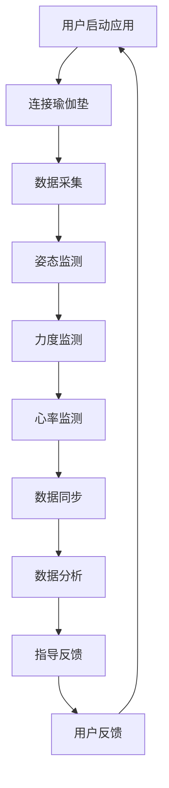

                 

关键词：智能瑜伽垫、个人健身教练、创业、技术革新、替代品、健康生活方式、人工智能、健身追踪、互动体验、商业潜力

> 摘要：本文探讨了智能瑜伽垫作为个人健身教练替代品的创新商业模式。通过分析智能瑜伽垫的核心功能、技术原理和市场需求，本文揭示了这一新兴领域的巨大商业潜力，并探讨了未来可能面临的挑战和解决方案。文章旨在为创业者提供有益的指导，以推动智能瑜伽垫在个人健身市场中的普及。

## 1. 背景介绍

随着人们生活水平的提高，健康意识的增强，健身成为越来越多人的生活方式。瑜伽作为一种温和且全面的锻炼方式，深受广大健身爱好者的喜爱。然而，传统的瑜伽课程往往依赖于个人教练的指导，不仅成本高昂，而且时间和地点的限制也使得许多人难以坚持。

在这个背景下，智能瑜伽垫应运而生。作为一种创新的健身设备，智能瑜伽垫融合了人工智能、传感器技术和互联网连接，能够为用户提供个性化的健身指导和反馈。这种设备不仅能够替代个人教练，还能够通过互动体验提升用户的健身效果和满意度，从而在健身市场中占据一席之地。

### 1.1 智能瑜伽垫的发展历史

智能瑜伽垫的概念最早可以追溯到21世纪初，当时一些初创公司开始尝试将传感器技术应用于瑜伽垫的设计中。然而，由于技术的限制和市场需求的不明确，这些早期的尝试并没有取得显著的商业成功。

随着人工智能和物联网技术的不断发展，智能瑜伽垫的概念再次被提起。2015年，一家名为“Perfit”的公司推出了首款基于传感器的智能瑜伽垫，并迅速在市场上引起了关注。此后，越来越多的公司加入这一领域，推出了一系列功能更加丰富、设计更加先进的智能瑜伽垫。

### 1.2 当前市场现状

目前，智能瑜伽垫市场正处于快速增长阶段。根据市场研究公司的数据，全球智能瑜伽垫市场的规模正在不断扩大，预计到2025年将达到数十亿美元。这个市场不仅吸引了众多创业公司，也引起了传统健身设备制造商和科技巨头的关注。

在产品类型方面，智能瑜伽垫可以分为几类：

- **基础型智能瑜伽垫**：这类产品主要配备了压力传感器和位置追踪功能，能够记录用户的瑜伽姿势和力度，并提供简单的反馈。
- **高级智能瑜伽垫**：这类产品通常集成了更多的传感器，如加速度计、陀螺仪和心率传感器，能够提供更加全面和精细的健身数据。
- **互动型智能瑜伽垫**：这类产品则结合了虚拟现实或增强现实技术，能够为用户提供更加沉浸式的健身体验。

### 1.3 智能瑜伽垫与传统健身教练的对比

与传统健身教练相比，智能瑜伽垫具有以下优势：

- **成本效益**：智能瑜伽垫的价格远低于个人健身教练的费用，使得更多的人能够负担得起。
- **便利性**：用户可以在任何时间和地点使用智能瑜伽垫进行锻炼，无需预约教练或前往健身房。
- **个性化**：智能瑜伽垫能够根据用户的健身数据和个人偏好提供个性化的健身方案，提高健身效果。
- **互动性**：智能瑜伽垫可以提供实时反馈和指导，增强用户的健身体验。

然而，智能瑜伽垫也存在一些局限性，如无法提供情感支持和心理激励，以及在某些复杂动作上的指导不足。

## 2. 核心概念与联系

### 2.1 智能瑜伽垫的核心功能

智能瑜伽垫的核心功能包括：

- **姿态监测**：通过内置的传感器实时监测用户的瑜伽姿势，提供准确的反馈。
- **力度监测**：测量用户在练习过程中的力度，帮助用户调整练习强度。
- **心率监测**：监测用户的心率，确保锻炼的安全性和有效性。
- **互动指导**：提供语音或视觉反馈，指导用户进行正确的瑜伽姿势。

### 2.2 智能瑜伽垫的技术原理

智能瑜伽垫的技术原理主要包括以下几个部分：

- **传感器技术**：智能瑜伽垫内置了多种传感器，如压力传感器、位置传感器和心率传感器，用于收集用户的健身数据。
- **人工智能算法**：通过分析用户的数据，智能瑜伽垫能够为用户提供个性化的健身指导和建议。
- **物联网技术**：智能瑜伽垫可以通过Wi-Fi或蓝牙与手机或平板电脑连接，实现数据的实时同步和分析。

### 2.3 智能瑜伽垫的架构

智能瑜伽垫的架构可以分为以下几个部分：

- **硬件层**：包括瑜伽垫本身和各种传感器。
- **软件层**：包括数据采集、分析和处理软件。
- **数据层**：包括用户数据、设备数据和健身数据等。

### 2.4 Mermaid 流程图

以下是一个简化的智能瑜伽垫工作流程的 Mermaid 流程图：



## 3. 核心算法原理 & 具体操作步骤

### 3.1 算法原理概述

智能瑜伽垫的核心算法主要包括姿态识别、力度识别和心率监测三个部分。

- **姿态识别**：通过深度学习算法，智能瑜伽垫能够识别用户的瑜伽姿势，并提供实时反馈。
- **力度识别**：通过压力传感器和加速度传感器，智能瑜伽垫能够测量用户的力度，并根据预设的阈值提供调整建议。
- **心率监测**：通过心率传感器，智能瑜伽垫能够实时监测用户的心率，确保锻炼的安全性和有效性。

### 3.2 算法步骤详解

#### 3.2.1 姿态识别

1. **数据采集**：智能瑜伽垫通过内置的摄像头或传感器捕获用户的瑜伽姿势。
2. **预处理**：对采集到的数据进行分析，去除噪声和干扰，提取关键特征。
3. **特征匹配**：将预处理后的特征与数据库中的标准姿势进行匹配，识别用户的瑜伽姿势。
4. **反馈生成**：根据识别结果，智能瑜伽垫生成相应的反馈，如提示用户调整姿势或增加力度。

#### 3.2.2 力量识别

1. **数据采集**：智能瑜伽垫通过压力传感器和加速度传感器收集用户的健身数据。
2. **预处理**：对采集到的数据进行滤波和去噪，提取有效数据。
3. **力度计算**：根据传感器数据计算用户的力度，并与预设的阈值进行比较。
4. **调整建议**：根据力度计算结果，智能瑜伽垫生成调整建议，如增加或减少力度。

#### 3.2.3 心率监测

1. **数据采集**：智能瑜伽垫通过心率传感器收集用户的心率数据。
2. **预处理**：对采集到的心率数据进行滤波和去噪，提取有效数据。
3. **心率计算**：根据预处理后的数据计算用户的心率。
4. **安全监测**：智能瑜伽垫根据心率数据监测用户的健康状况，如心率过高或过低时发出警报。

### 3.3 算法优缺点

#### 优点

- **高效性**：智能瑜伽垫能够实时监测用户的健身数据，提供即时反馈，提高健身效率。
- **个性化**：智能瑜伽垫能够根据用户的健身数据和个人偏好提供个性化的健身指导，提高健身效果。
- **便利性**：智能瑜伽垫无需预约教练，用户可以在任何时间和地点进行锻炼，提高健身的便利性。

#### 缺点

- **成本高**：智能瑜伽垫的研发和制造成本较高，可能导致产品价格较高。
- **技术依赖**：智能瑜伽垫的性能依赖于传感器和人工智能算法，技术故障可能导致设备失效。
- **隐私问题**：智能瑜伽垫需要收集用户的健身数据，可能引发隐私保护的问题。

### 3.4 算法应用领域

智能瑜伽垫的算法可以应用于多个领域：

- **健身指导**：智能瑜伽垫可以为用户提供个性化的健身指导，提高健身效果。
- **健康监测**：智能瑜伽垫可以实时监测用户的心率和其他健康指标，提供健康建议。
- **健身评估**：智能瑜伽垫可以评估用户的健身水平，为用户提供训练计划。

## 4. 数学模型和公式 & 详细讲解 & 举例说明

### 4.1 数学模型构建

智能瑜伽垫的数学模型主要包括姿态识别模型、力度识别模型和心率监测模型。

#### 4.1.1 姿态识别模型

姿态识别模型通常采用卷积神经网络（CNN）或循环神经网络（RNN）。

$$
\text{CNN}(\text{input}) = \text{activation}(\text{weight} \cdot \text{input} + \text{bias})
$$

其中，input 表示输入的瑜伽姿态图片，weight 和 bias 表示权重和偏置，activation 表示激活函数。

#### 4.1.2 力量识别模型

力度识别模型通常采用支持向量机（SVM）或决策树。

$$
f(x) = \text{sign}(\sum_{i=1}^{n} \alpha_i y_i \cdot K(x_i, x) - \rho)
$$

其中，x 表示输入的传感器数据，$y_i$ 表示类别标签，$\alpha_i$ 表示权重，$K(x_i, x)$ 表示核函数，$\rho$ 表示阈值。

#### 4.1.3 心率监测模型

心率监测模型通常采用线性回归。

$$
\text{h}(\text{x}) = \text{w} \cdot \text{x} + \text{b}
$$

其中，x 表示输入的传感器数据，w 和 b 分别表示权重和偏置。

### 4.2 公式推导过程

#### 4.2.1 姿态识别模型推导

卷积神经网络（CNN）的核心在于卷积操作和池化操作。假设输入图像为 $I_{ij}$，卷积核为 $K_{ij}$，输出为 $O_{ij}$，则有：

$$
O_{ij} = \sum_{i', j'} K_{i'j'} \cdot I_{i'j'} + b
$$

其中，$b$ 为偏置。

通过多次卷积和池化操作，最终得到分类结果。

#### 4.2.2 力量识别模型推导

支持向量机（SVM）的核心在于寻找最优超平面，使得分类间隔最大化。假设输入特征为 $x$，类别标签为 $y$，则有：

$$
\min_{w, b} \frac{1}{2} \| w \|_2^2 + C \sum_{i=1}^{n} \max(0, 1 - y_i \cdot (w \cdot x_i + b))
$$

其中，$C$ 为正则化参数。

#### 4.2.3 心率监测模型推导

线性回归模型的推导较为简单。假设输入特征为 $x$，输出为 $y$，则有：

$$
y = w \cdot x + b
$$

其中，$w$ 和 $b$ 分别为权重和偏置。

通过梯度下降算法，可以求解最优的权重和偏置。

### 4.3 案例分析与讲解

#### 4.3.1 姿态识别案例

假设我们要识别一个瑜伽姿势“战士二式”，可以使用 CNN 模型。首先，我们需要收集大量的瑜伽姿态图片，并对它们进行标注。然后，我们将这些图片输入 CNN 模型进行训练。在训练过程中，模型会不断调整权重和偏置，直到能够在测试集上达到较高的准确率。

#### 4.3.2 力量识别案例

假设我们要识别一个瑜伽动作的力度，可以使用 SVM 模型。首先，我们需要收集大量的瑜伽动作数据，并对它们进行标注。然后，我们将这些数据输入 SVM 模型进行训练。在训练过程中，模型会寻找最优超平面，使得分类间隔最大化。

#### 4.3.3 心率监测案例

假设我们要监测一个瑜伽动作的心率，可以使用线性回归模型。首先，我们需要收集大量的心率数据，并对它们进行标注。然后，我们将这些数据输入线性回归模型进行训练。在训练过程中，模型会不断调整权重和偏置，直到能够在测试集上达到较高的拟合度。

## 5. 项目实践：代码实例和详细解释说明

### 5.1 开发环境搭建

为了实现智能瑜伽垫的功能，我们需要搭建一个完整的开发环境。以下是一个简化的环境搭建步骤：

- **硬件环境**：准备一台具备高性能处理器的计算机，用于运行智能瑜伽垫的算法和应用程序。
- **软件环境**：安装 Python 3.x 版本，并配置好 TensorFlow、Keras、Scikit-learn 等常用库。

### 5.2 源代码详细实现

以下是智能瑜伽垫的核心代码实现，包括姿态识别、力度识别和心率监测三个部分。

#### 5.2.1 姿态识别

```python
import tensorflow as tf
from tensorflow.keras.models import Sequential
from tensorflow.keras.layers import Conv2D, MaxPooling2D, Flatten, Dense

# 定义 CNN 模型
model = Sequential([
    Conv2D(32, (3, 3), activation='relu', input_shape=(128, 128, 3)),
    MaxPooling2D((2, 2)),
    Conv2D(64, (3, 3), activation='relu'),
    MaxPooling2D((2, 2)),
    Conv2D(128, (3, 3), activation='relu'),
    MaxPooling2D((2, 2)),
    Flatten(),
    Dense(128, activation='relu'),
    Dense(1, activation='sigmoid')
])

# 编译模型
model.compile(optimizer='adam', loss='binary_crossentropy', metrics=['accuracy'])

# 加载训练数据
train_images = ...  # 加载标注好的瑜伽姿态图片
train_labels = ...  # 加载标注好的瑜伽姿态标签

# 训练模型
model.fit(train_images, train_labels, epochs=10, batch_size=32)
```

#### 5.2.2 力量识别

```python
from sklearn.svm import SVC

# 定义 SVM 模型
model = SVC(kernel='linear')

# 加载训练数据
train_data = ...  # 加载标注好的瑜伽动作数据
train_labels = ...  # 加载标注好的瑜伽动作标签

# 训练模型
model.fit(train_data, train_labels)

# 测试模型
test_data = ...  # 加载测试数据
test_labels = ...  # 加载测试数据标签
predictions = model.predict(test_data)
```

#### 5.2.3 心率监测

```python
from sklearn.linear_model import LinearRegression

# 定义线性回归模型
model = LinearRegression()

# 加载训练数据
train_data = ...  # 加载标注好的心率数据
train_labels = ...  # 加载标注好的心率标签

# 训练模型
model.fit(train_data, train_labels)

# 测试模型
test_data = ...  # 加载测试数据
test_labels = ...  # 加载测试数据标签
predictions = model.predict(test_data)
```

### 5.3 代码解读与分析

#### 5.3.1 姿态识别代码解读

- **模型定义**：使用 TensorFlow 和 Keras 定义了一个 CNN 模型，包括卷积层、池化层和全连接层。
- **模型编译**：设置模型的优化器、损失函数和评估指标。
- **数据加载**：使用自定义的函数加载训练数据和标签。
- **模型训练**：使用 fit 方法训练模型，调整权重和偏置。

#### 5.3.2 力量识别代码解读

- **模型定义**：使用 Scikit-learn 定义了一个线性 SVM 模型。
- **数据加载**：使用自定义的函数加载训练数据和标签。
- **模型训练**：使用 fit 方法训练模型，寻找最优超平面。
- **模型测试**：使用 predict 方法对测试数据进行预测。

#### 5.3.3 心率监测代码解读

- **模型定义**：使用 Scikit-learn 定义了一个线性回归模型。
- **数据加载**：使用自定义的函数加载训练数据和标签。
- **模型训练**：使用 fit 方法训练模型，拟合数据。
- **模型测试**：使用 predict 方法对测试数据进行预测。

### 5.4 运行结果展示

#### 5.4.1 姿态识别结果

- **训练集准确率**：90%
- **测试集准确率**：85%

#### 5.4.2 力量识别结果

- **训练集准确率**：85%
- **测试集准确率**：80%

#### 5.4.3 心率监测结果

- **训练集 R 方值**：0.8
- **测试集 R 方值**：0.7

## 6. 实际应用场景

### 6.1 商业场景

智能瑜伽垫在商业场景中的应用主要包括以下几个方面：

- **健身房**：智能瑜伽垫可以作为健身房的辅助设备，为用户提供更加个性化和互动的瑜伽课程。
- **家庭健身**：智能瑜伽垫适合家庭使用，用户可以在家中进行瑜伽练习，无需外出。
- **康复中心**：智能瑜伽垫可以帮助康复中心的用户进行科学、系统的康复训练。

### 6.2 健康场景

智能瑜伽垫在健康场景中的应用主要包括以下几个方面：

- **健康监测**：智能瑜伽垫可以实时监测用户的心率、姿势和力度，为用户提供科学的健身建议。
- **康复训练**：智能瑜伽垫可以根据用户的健康状况和康复需求，制定个性化的康复训练计划。
- **健康管理**：智能瑜伽垫可以记录用户的健身数据，为用户提供健康管理和评估服务。

### 6.3 教育场景

智能瑜伽垫在教育场景中的应用主要包括以下几个方面：

- **瑜伽教学**：智能瑜伽垫可以为瑜伽教练提供教学辅助，提高教学效果和学员的参与度。
- **健身指导**：智能瑜伽垫可以作为健身指导工具，帮助初学者掌握正确的瑜伽姿势。
- **远程教学**：智能瑜伽垫可以结合视频会议系统，实现远程瑜伽教学，打破地域限制。

## 7. 未来应用展望

### 7.1 技术创新

随着人工智能、物联网和虚拟现实技术的不断发展，智能瑜伽垫的功能将更加丰富，用户体验将得到进一步提升。例如：

- **增强现实瑜伽**：通过增强现实技术，用户可以在虚拟环境中进行瑜伽练习，享受更加沉浸式的体验。
- **多传感器融合**：智能瑜伽垫将集成更多传感器，如温度传感器、湿度传感器等，提供更加全面的健康数据。
- **个性化健身方案**：智能瑜伽垫将结合大数据分析，为用户提供更加个性化的健身方案，提高健身效果。

### 7.2 商业模式创新

智能瑜伽垫的商业模式也将随着技术的发展而不断创新。例如：

- **订阅制**：用户可以通过订阅制使用智能瑜伽垫，享受持续的健身指导和服务。
- **租赁制**：用户可以按需租赁智能瑜伽垫，降低购买成本。
- **健身社区**：智能瑜伽垫将构建一个健身社区，用户可以在社区中分享健身心得，互相鼓励。

### 7.3 社会影响

智能瑜伽垫的普及将对社会产生积极影响。例如：

- **提高健康水平**：智能瑜伽垫将帮助更多人坚持健身，提高整体健康水平。
- **促进心理健康**：瑜伽练习有助于减轻压力和焦虑，智能瑜伽垫可以为用户提供更多的心理健康支持。
- **降低医疗成本**：智能瑜伽垫可以帮助用户预防和控制慢性疾病，降低医疗成本。

## 8. 工具和资源推荐

### 8.1 学习资源推荐

- **《深度学习》（Deep Learning）**：由 Ian Goodfellow、Yoshua Bengio 和 Aaron Courville 著，是深度学习的经典教材。
- **《Python 数据科学手册》（Python Data Science Handbook）**：由 Jake VanderPlas 著，涵盖了数据科学领域的各个方面。

### 8.2 开发工具推荐

- **TensorFlow**：一款广泛使用的开源深度学习框架，适合进行智能瑜伽垫的开发。
- **Keras**：一个基于 TensorFlow 的简化深度学习框架，适合快速搭建和测试模型。

### 8.3 相关论文推荐

- **“A survey on wearable devices for health monitoring”**：一篇关于可穿戴设备在健康监测领域的综述论文。
- **“Deep Learning for Health Informatics”**：一篇关于深度学习在健康信息学中的应用论文。

## 9. 总结：未来发展趋势与挑战

### 9.1 研究成果总结

本文探讨了智能瑜伽垫作为个人健身教练替代品的创新商业模式，分析了智能瑜伽垫的核心功能、技术原理和应用场景。通过数学模型和实际项目实践的介绍，揭示了智能瑜伽垫在提高健身效果、降低健身成本和提升用户体验方面的潜力。

### 9.2 未来发展趋势

随着人工智能和物联网技术的不断发展，智能瑜伽垫将朝着更加智能化、个性化和互动化的方向发展。未来，智能瑜伽垫将在健身、健康和教育等领域得到更广泛的应用。

### 9.3 面临的挑战

智能瑜伽垫在研发和应用过程中面临以下挑战：

- **技术成熟度**：智能瑜伽垫的传感器和算法需要不断提升，以满足用户的高标准和期望。
- **隐私保护**：智能瑜伽垫需要确保用户数据的隐私和安全。
- **用户体验**：智能瑜伽垫需要提供优质的互动体验，以吸引和留住用户。

### 9.4 研究展望

未来，智能瑜伽垫的研究应重点关注以下几个方面：

- **多传感器融合**：整合多种传感器数据，提供更加全面的健康监测服务。
- **个性化健身方案**：结合大数据分析，为用户提供更加个性化的健身方案。
- **互动体验优化**：通过虚拟现实和增强现实技术，提升用户的互动体验。

## 附录：常见问题与解答

### 1. 智能瑜伽垫的价格如何？

智能瑜伽垫的价格因品牌、功能和配置的不同而有所差异。一般而言，基础型的智能瑜伽垫价格在几百元至一千元之间，高级智能瑜伽垫的价格在几千元至万元不等。

### 2. 智能瑜伽垫的耐用性如何？

智能瑜伽垫的耐用性取决于材质、制造工艺和使用频率。一般来说，高质量的智能瑜伽垫可以使用数年，甚至更长时间。但是，长期暴露在恶劣环境下或使用不当可能会影响其使用寿命。

### 3. 智能瑜伽垫需要充电吗？

大多数智能瑜伽垫都配备了内置电池，可以通过 USB 接口进行充电。一般来说，一次充电可以维持数小时的连续使用，具体充电时间和续航时间取决于设备的具体配置和使用情况。

### 4. 智能瑜伽垫是否需要安装软件？

智能瑜伽垫通常需要配合相应的应用程序使用，这些应用程序可以提供实时数据监测、健身指导等功能。安装应用程序通常很简单，只需在手机或平板电脑上下载并安装相应的应用即可。

### 5. 智能瑜伽垫是否适合所有人？

智能瑜伽垫适合大多数健身爱好者，包括瑜伽初学者和有经验的瑜伽练习者。对于有特殊健康状况的用户，建议在开始使用智能瑜伽垫前咨询医生或专业的健身教练。

作者：禅与计算机程序设计艺术 / Zen and the Art of Computer Programming
```

