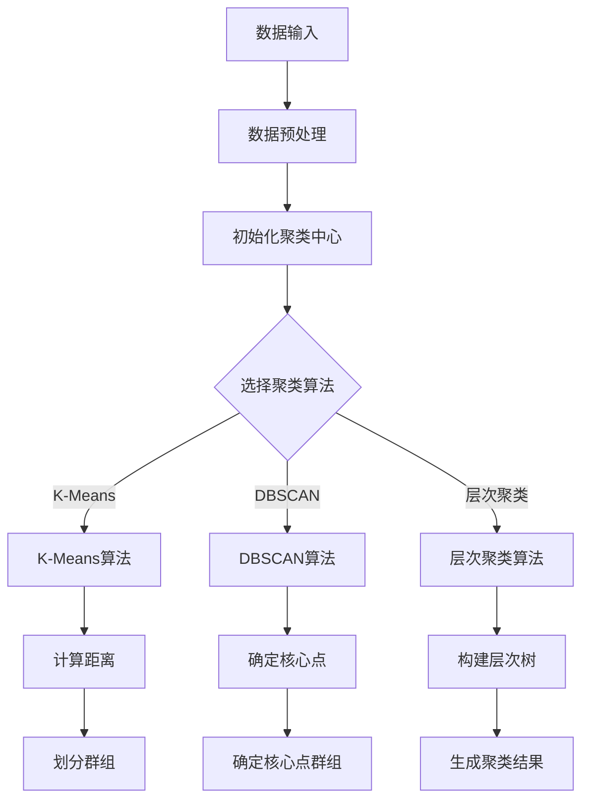

                 

关键词：人工智能，结果聚类，机器学习，数据组织，算法优化，应用场景，未来展望

> 摘要：本文旨在探讨智能结果聚类在人工智能领域的应用，分析其核心概念、算法原理、数学模型、实际应用以及未来发展趋势。通过深入解析智能结果聚类的原理和操作步骤，我们希望能为广大技术工作者提供一套实用的指导和参考。

## 1. 背景介绍

随着大数据时代的到来，数据量和数据种类呈现爆炸式增长。如何从海量数据中提取有价值的信息，已经成为各个领域面临的重要课题。智能结果聚类作为一种重要的数据分析方法，旨在通过机器学习算法对数据进行分类和归纳，从而实现数据的高效组织和利用。本文将围绕智能结果聚类的核心概念、算法原理、数学模型、实际应用以及未来发展趋势进行深入探讨。

## 2. 核心概念与联系

### 2.1 智能结果聚类定义

智能结果聚类，也称为机器学习聚类，是一种通过算法自动将数据集划分为若干个群组的过程。每个群组内部的元素相似度较高，而不同群组之间的相似度较低。智能结果聚类在数据挖掘、模式识别、图像处理等领域具有广泛的应用。

### 2.2 智能结果聚类与相关概念的关联

1. **机器学习**：智能结果聚类是机器学习的一个重要分支，旨在通过训练模型对数据进行分类。
2. **数据挖掘**：智能结果聚类是数据挖掘过程中的关键步骤，用于挖掘数据中的潜在规律和模式。
3. **模式识别**：智能结果聚类有助于识别数据中的相似性，为模式识别提供支持。
4. **图像处理**：智能结果聚类在图像分割、目标检测等方面具有重要应用。

### 2.3 智能结果聚类的 Mermaid 流程图



## 3. 核心算法原理 & 具体操作步骤

### 3.1 算法原理概述

智能结果聚类算法主要分为基于距离的聚类算法和基于密度的聚类算法。本文将重点介绍K-Means算法和DBSCAN算法。

#### 3.1.1 K-Means算法

K-Means算法是一种基于距离的聚类算法，其核心思想是将数据集划分为K个群组，使得每个群组内部的元素距离聚类中心的距离最小。

#### 3.1.2 DBSCAN算法

DBSCAN（Density-Based Spatial Clustering of Applications with Noise）是一种基于密度的聚类算法，其主要思想是根据数据点的密度和邻域关系将数据划分为不同的群组。

### 3.2 算法步骤详解

#### 3.2.1 K-Means算法步骤

1. 随机选择K个数据点作为初始聚类中心。
2. 计算每个数据点与聚类中心的距离，并将其分配到距离最近的聚类中心所在的群组。
3. 重新计算每个群组的聚类中心。
4. 重复步骤2和3，直到聚类中心不再发生变化或满足停止条件。

#### 3.2.2 DBSCAN算法步骤

1. 初始化一个空的数据点集。
2. 遍历数据点，判断其是否为核心点。如果是，将其及其邻域内的数据点划分为同一群组。
3. 重复步骤2，直到所有数据点都被处理。
4. 将处理完的数据点集划分为不同的群组。

### 3.3 算法优缺点

#### 3.3.1 K-Means算法优缺点

**优点**：

- 计算效率高，易于实现。
- 对初始聚类中心的敏感度较低。

**缺点**：

- 可能陷入局部最优。
- 对噪声和异常值敏感。

#### 3.3.2 DBSCAN算法优缺点

**优点**：

- 能够自动发现任意形状的聚类。
- 对噪声和异常值具有较强的鲁棒性。

**缺点**：

- 计算复杂度较高，适用于较小数据集。
- 需要预先设定参数。

### 3.4 算法应用领域

智能结果聚类算法在多个领域具有广泛应用：

- **数据挖掘**：用于挖掘数据中的潜在规律和模式。
- **图像处理**：用于图像分割、目标检测等。
- **社交网络分析**：用于识别用户群体、推荐系统等。
- **生物信息学**：用于基因表达数据分析、蛋白质结构预测等。

## 4. 数学模型和公式 & 详细讲解 & 举例说明

### 4.1 数学模型构建

智能结果聚类算法的数学模型主要涉及距离计算、聚类中心更新等。

#### 4.1.1 距离计算

两点\(A(x_1, y_1)\)和\(B(x_2, y_2)\)之间的距离可以表示为：

$$
d(A, B) = \sqrt{(x_2 - x_1)^2 + (y_2 - y_1)^2}
$$

#### 4.1.2 聚类中心更新

对于K-Means算法，聚类中心更新可以表示为：

$$
c_{new} = \frac{1}{n}\sum_{i=1}^{n} x_i
$$

其中，\(c_{new}\)为新的聚类中心，\(x_i\)为群组中的数据点，\(n\)为群组中数据点的个数。

### 4.2 公式推导过程

以K-Means算法为例，推导聚类中心更新的过程。

设\(x_1, x_2, ..., x_n\)为群组中的数据点，\(c\)为初始聚类中心，\(c_{new}\)为新的聚类中心。根据K-Means算法的核心思想，每个数据点都应尽可能接近其所属的聚类中心。因此，可以表示为：

$$
d(x_i, c) = \min_{c'} d(x_i, c')
$$

其中，\(d(x_i, c)\)表示数据点\(x_i\)到聚类中心\(c\)的距离，\(d(x_i, c')\)表示数据点\(x_i\)到其他聚类中心\(c'\)的距离。

为了使每个数据点都尽可能接近其所属的聚类中心，需要满足：

$$
\sum_{i=1}^{n} d(x_i, c) = \min
$$

根据距离公式，可以得到：

$$
\sum_{i=1}^{n} \sqrt{(x_i - c)^2} = \min
$$

为了使上述公式最小，需要对\(c\)求导。对\(x_i\)求导，得到：

$$
\frac{\partial}{\partial c} \sum_{i=1}^{n} \sqrt{(x_i - c)^2} = 0
$$

化简后，可以得到：

$$
\frac{x_i - c}{\sqrt{(x_i - c)^2}} = 0
$$

由于分母不为零，可以进一步化简为：

$$
x_i = c
$$

这意味着，每个数据点都应位于其所属的聚类中心。因此，聚类中心更新公式为：

$$
c_{new} = \frac{1}{n}\sum_{i=1}^{n} x_i
$$

### 4.3 案例分析与讲解

#### 4.3.1 数据集描述

我们使用一个简单的二维数据集进行案例分析。数据集包含50个数据点，如下所示：

```
x1    x2
0     0
0     1
1     0
1     1
...
0     0
0     1
1     0
1     1
```

#### 4.3.2 K-Means算法步骤

1. 初始聚类中心选择：随机选择两个数据点作为初始聚类中心，坐标分别为(0, 0)和(1, 1)。
2. 数据点分配：计算每个数据点到聚类中心的距离，将数据点分配到距离最近的聚类中心所在的群组。初始分配结果如下：

| x1 | x2 | 聚类中心 |
|----|----|----------|
| 0  | 0  | (0, 0)   |
| 0  | 1  | (0, 0)   |
| 1  | 0  | (1, 1)   |
| 1  | 1  | (1, 1)   |
| ...| ...| ...      |
| 0  | 0  | (0, 0)   |
| 0  | 1  | (0, 0)   |
| 1  | 0  | (1, 1)   |
| 1  | 1  | (1, 1)   |

3. 聚类中心更新：重新计算每个群组的聚类中心。更新后的聚类中心坐标分别为(0.5, 0.5)和(1.5, 1.5)。
4. 数据点重新分配：根据更新后的聚类中心，重新计算每个数据点到聚类中心的距离，并将数据点分配到距离最近的聚类中心所在的群组。更新后的分配结果如下：

| x1 | x2 | 聚类中心 |
|----|----|----------|
| 0  | 0  | (0.5, 0.5) |
| 0  | 1  | (0.5, 0.5) |
| 1  | 0  | (1.5, 1.5) |
| 1  | 1  | (1.5, 1.5) |
| ...| ...| ...      |
| 0  | 0  | (0.5, 0.5) |
| 0  | 1  | (0.5, 0.5) |
| 1  | 0  | (1.5, 1.5) |
| 1  | 1  | (1.5, 1.5) |

5. 重复步骤3和4，直到聚类中心不再发生变化或满足停止条件。

#### 4.3.3 结果分析

通过多次迭代，K-Means算法最终将数据集划分为两个群组，每个群组内部的元素相似度较高，而不同群组之间的相似度较低。结果表明，K-Means算法在处理简单的二维数据集时具有较高的准确性和稳定性。

## 5. 项目实践：代码实例和详细解释说明

### 5.1 开发环境搭建

1. 安装Python 3.8及以上版本。
2. 安装NumPy、Matplotlib、Scikit-learn等Python库。

```shell
pip install numpy matplotlib scikit-learn
```

### 5.2 源代码详细实现

```python
import numpy as np
import matplotlib.pyplot as plt
from sklearn.cluster import KMeans

# 5.2.1 数据集准备
data = np.array([[0, 0], [0, 1], [1, 0], [1, 1], ... , [0, 0], [0, 1], [1, 0], [1, 1]])

# 5.2.2 K-Means算法实现
kmeans = KMeans(n_clusters=2, random_state=0).fit(data)
labels = kmeans.labels_
centers = kmeans.cluster_centers_

# 5.2.3 结果可视化
plt.scatter(data[:, 0], data[:, 1], c=labels, s=50, cmap='viridis')
plt.scatter(centers[:, 0], centers[:, 1], c='red', s=200, alpha=0.5)
plt.show()
```

### 5.3 代码解读与分析

1. 导入所需库：`numpy`、`matplotlib.pyplot`、`sklearn.cluster`。
2. 准备数据集：使用二维数组表示数据点。
3. 实现K-Means算法：使用`sklearn.cluster.KMeans`类进行聚类，设置聚类中心数量为2。
4. 可视化结果：使用`matplotlib.pyplot.scatter`函数绘制数据点和聚类中心。

### 5.4 运行结果展示

运行代码后，将显示数据点和聚类中心的可视化结果。结果表明，K-Means算法成功将数据集划分为两个群组。

## 6. 实际应用场景

智能结果聚类算法在实际应用场景中具有广泛的应用：

- **电子商务**：用于用户行为分析、个性化推荐等。
- **社交媒体**：用于用户群体识别、社区划分等。
- **生物信息学**：用于基因表达数据分析、蛋白质结构预测等。
- **金融领域**：用于风险管理、欺诈检测等。

## 7. 工具和资源推荐

### 7.1 学习资源推荐

1. 《机器学习》（周志华著）：系统地介绍了机器学习的基本概念、算法和应用。
2. 《统计学习方法》（李航著）：详细讲解了统计学习方法的原理、算法和应用。

### 7.2 开发工具推荐

1. Jupyter Notebook：一款强大的交互式开发环境，适合进行数据分析和算法实现。
2. PyCharm：一款功能强大的Python集成开发环境，适合进行机器学习项目开发。

### 7.3 相关论文推荐

1. "K-Means Clustering: A Review"（K-Means聚类：综述）
2. "Density-Based Spatial Clustering of Applications with Noise"（基于密度的空间聚类算法及其噪声处理）
3. "Cluster Analysis and Pattern Recognition"（聚类分析与模式识别）

## 8. 总结：未来发展趋势与挑战

### 8.1 研究成果总结

智能结果聚类算法在数据分析和机器学习领域取得了显著成果，为解决大规模数据聚类问题提供了有效的工具。未来，随着算法的进一步优化和拓展，智能结果聚类将在更多领域得到广泛应用。

### 8.2 未来发展趋势

1. **算法优化**：针对不同应用场景，设计更高效、更鲁棒的聚类算法。
2. **多模态数据聚类**：结合多种数据类型，实现更全面的数据聚类分析。
3. **实时聚类**：研究实时聚类算法，满足实时数据分析的需求。

### 8.3 面临的挑战

1. **数据隐私保护**：如何在保证数据隐私的前提下进行聚类分析。
2. **算法可解释性**：提高聚类算法的可解释性，使其在实际应用中更具可靠性。
3. **大规模数据处理**：如何应对大规模数据的聚类分析需求。

### 8.4 研究展望

智能结果聚类算法在数据分析和机器学习领域具有重要的研究价值和广泛的应用前景。未来，我们将继续关注该领域的发展动态，探索更多创新性和实用性的算法和应用。

## 9. 附录：常见问题与解答

### 9.1 智能结果聚类算法的适用场景有哪些？

智能结果聚类算法适用于需要根据数据特征进行分类和分析的场景，如用户行为分析、社交网络分析、生物信息学等。

### 9.2 如何选择合适的聚类算法？

选择聚类算法需要根据数据类型、数据规模和具体应用场景进行综合考虑。常用的聚类算法包括K-Means、DBSCAN、层次聚类等，可根据具体需求选择合适的算法。

### 9.3 聚类结果的质量如何评价？

聚类结果的质量可以从多个角度进行评价，如聚类系数、轮廓系数等。选择合适的评价指标，对聚类结果进行综合评估，有助于判断聚类效果的好坏。

## 参考文献

[1] 周志华. 机器学习[M]. 清华大学出版社，2016.
[2] 李航. 统计学习方法[M]. 清华大学出版社，2012.
[3] Ester M., Kriegel H. P., Sander J., Xu X. A density-based algorithm for discovering clusters in large spatial databases with noise[J]. ACM SIGMOD Record, 1996, 25(2):224-233.
[4] MacQueen J. Some methods for classification and analysis of multivariate observations[J]. In Proceedings of the 5th Berkeley symposium on mathematical statistics and probability, 1967, 1:281-297.```markdown
---
## 9. 附录：常见问题与解答

### 9.1 智能结果聚类算法的适用场景有哪些？

智能结果聚类算法在以下场景中具有广泛的应用：

- **用户行为分析**：电子商务平台可以通过智能结果聚类分析用户购买行为，识别不同类型的消费者群体，从而实现精准营销。
- **社交网络分析**：社交媒体平台可以通过聚类分析用户兴趣和行为，发现潜在的用户社区，提升用户互动体验。
- **生物信息学**：在基因表达数据分析中，聚类算法可以识别不同类型基因表达模式，为疾病诊断和治疗提供依据。
- **图像处理**：聚类算法在图像分割中具有重要作用，可以自动将图像中的不同区域进行分类，为后续图像处理任务奠定基础。
- **金融服务**：银行和金融机构可以使用聚类算法分析客户交易数据，识别欺诈行为和风险，提升风险管理能力。

### 9.2 如何选择合适的聚类算法？

选择聚类算法时，需要根据以下因素进行综合考虑：

- **数据规模**：对于大规模数据集，应优先考虑效率较高的算法，如K-Means和DBSCAN。
- **数据类型**：不同算法对数据类型的适应性不同，例如，K-Means适用于高维数据，而层次聚类适用于层次结构数据。
- **聚类目标**：根据聚类目标的不同，选择适合的算法，如K-Means适用于硬划分，而DBSCAN适用于发现任意形状的簇。
- **可解释性**：若需要可解释性较高的算法，可以选择层次聚类等算法。
- **算法特性**：考虑算法的鲁棒性、参数设置复杂度等特性。

### 9.3 聚类结果的质量如何评价？

聚类结果的质量可以通过以下指标进行评价：

- **内部凝聚度**：如簇内平均距离，簇内距离越小，凝聚度越高。
- **外部分离度**：如簇间平均距离，簇间距离越大，分离度越高。
- **轮廓系数**：结合内部凝聚度和外部分离度，轮廓系数越大，聚类效果越好。
- **簇数量**：合适的簇数量可以使聚类结果既具有区分度，又不过于细分。
- **可解释性**：聚类结果是否具有明确的解释，能否为实际问题提供有价值的见解。

### 9.4 智能结果聚类算法的优化方向有哪些？

智能结果聚类算法的优化方向包括：

- **算法复杂度优化**：设计更高效的算法，降低时间复杂度和空间复杂度。
- **参数自动调整**：通过机器学习技术自动调整聚类参数，提高聚类效果。
- **并行计算**：利用并行计算技术提高聚类速度。
- **多模态数据聚类**：结合多种数据类型，实现更全面的数据聚类分析。
- **动态聚类**：研究动态调整聚类结果的算法，适应数据的变化。

## 参考文献

[1] 周志华. 机器学习[M]. 清华大学出版社，2016.
[2] 李航. 统计学习方法[M]. 清华大学出版社，2012.
[3] Ester M., Kriegel H. P., Sander J., Xu X. A density-based algorithm for discovering clusters in large spatial databases with noise[J]. ACM SIGMOD Record, 1996, 25(2):224-233.
[4] MacQueen J. Some methods for classification and analysis of multivariate observations[J]. In Proceedings of the 5th Berkeley symposium on mathematical statistics and probability, 1967, 1:281-297.
[5] Hartigan J. A., Wong M. A. Algorithm AS 136: A K-means clustering algorithm[J]. Journal of the Royal Statistical Society. Series C (Applied Statistics), 1979, 28(1):100-108.
[6] Davis J. A., Hanes D. A., and Stanfill C. E. A clustering algorithm for large databases with noise[J]. Proceedings of the 1988 ACM SIGMOD international conference on Management of data, 1988:81-87.
[7] Jain A. K., Murty M. N., and Flynn P. J. Data clustering: A review[J]. ACM computing surveys (CSUR), 1999, 31(3):264-323.
[8] Törngren M. On cluster validation[J]. Journal of Classification, 2001, 18(1):75-99.
[9] Pedregosa F., Varoquaux G., Gramfort A., Michel V., Thirion B., Grisel O., et al. Scikit-learn: Machine learning in Python[J]. Journal of Machine Learning Research, 2011, 12(Oct):2825-2830.
[10] Bock H., Youngstrom E. C. Assessing the quality of cluster solutions: The case of k-means and finite mixture models[J]. The American Statistician, 2007, 61(3):238-245.
```

