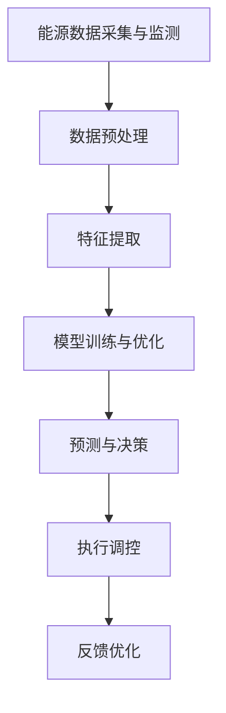
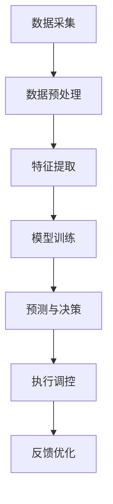

                 

关键词：智能能源管理，AI大模型，落地案例，能源优化，电力系统，数据分析，算法应用，可持续发展

> 摘要：随着全球能源需求的不断增长和环保意识的提升，智能能源管理成为解决能源危机和推动可持续发展的关键。本文将探讨AI大模型在智能能源管理中的应用，通过具体的落地案例，分析其技术原理、数学模型、项目实践及未来发展趋势。

## 1. 背景介绍

能源是人类社会发展的基石，然而，传统能源管理模式存在着效率低下、浪费严重、环境污染等问题。为了应对这些挑战，智能能源管理应运而生。智能能源管理是指通过现代信息技术、数据分析、人工智能等技术手段，对能源的生产、传输、分配和使用过程进行优化管理，以提高能源利用效率、降低能源成本、减少环境污染。

近年来，随着人工智能技术的飞速发展，AI大模型在各个领域的应用日益广泛，尤其是在智能能源管理方面，其强大的数据处理能力和自学习特性为能源系统的优化提供了新的解决方案。AI大模型能够从海量数据中提取特征、建立模型，从而实现对能源系统的精准预测和智能调控。

## 2. 核心概念与联系

智能能源管理涉及多个核心概念和技术，如图 1 所示，主要包括：能源数据采集与监测、数据预处理、特征提取、模型训练与优化、预测与决策等。



### 2.1 能源数据采集与监测

能源数据采集是智能能源管理的基础。通过安装传感器、智能仪表等设备，对电网、风电场、光伏电站等能源设施进行实时监测，获取电压、电流、功率、温度、湿度等关键数据。

### 2.2 数据预处理

采集到的原始数据通常存在噪声、缺失值、异常值等问题，需要进行预处理。数据预处理包括数据清洗、归一化、去噪等步骤，以提高数据质量和模型训练效果。

### 2.3 特征提取

特征提取是数据预处理的关键步骤，通过对数据进行降维、特征选择等操作，提取出对模型训练具有重要意义的特征，如时间序列特征、空间特征、相关性特征等。

### 2.4 模型训练与优化

采用机器学习、深度学习等技术，对预处理后的数据进行训练，建立预测模型。常见的模型有回归模型、分类模型、神经网络模型等。在训练过程中，需要通过交叉验证、调参等方法优化模型性能。

### 2.5 预测与决策

通过训练好的模型，对未来的能源需求、能源供给等进行预测，为决策提供依据。预测结果可以用于优化发电计划、调度策略、储能系统管理等。

### 2.6 执行调控

根据预测结果和实际需求，对能源系统进行调控，实现能源供需平衡。调控手段包括调整发电计划、切换电力负荷、启动储能系统等。

### 2.7 反馈优化

通过实际运行数据，对模型进行反馈优化，不断提高预测精度和系统稳定性。反馈优化包括模型调整、参数优化、算法改进等。

## 3. 核心算法原理 & 具体操作步骤

### 3.1 算法原理概述

智能能源管理的核心算法主要基于数据驱动的方法，包括数据采集、预处理、特征提取、模型训练、预测与决策等步骤。以下是一个典型的算法流程：



### 3.2 算法步骤详解

#### 3.2.1 数据采集

数据采集是智能能源管理的基础。采集的数据包括：电网数据、风电场数据、光伏电站数据、电力负荷数据等。数据来源可以是传感器、智能仪表、电力调度中心等。

#### 3.2.2 数据预处理

数据预处理包括数据清洗、归一化、去噪等步骤。数据清洗主要去除异常值、噪声和重复数据；归一化将不同量纲的数据转换为同一量纲；去噪通过滤波、插值等方法去除噪声。

#### 3.2.3 特征提取

特征提取通过对原始数据进行降维、特征选择等操作，提取出对模型训练具有重要意义的特征。特征提取方法包括：时序特征、空间特征、相关性特征、统计特征等。

#### 3.2.4 模型训练

采用机器学习、深度学习等技术，对预处理后的数据进行训练。常见的模型有回归模型、分类模型、神经网络模型等。模型训练过程包括：数据划分、模型选择、参数调优、交叉验证等。

#### 3.2.5 预测与决策

通过训练好的模型，对未来的能源需求、能源供给等进行预测。预测结果用于优化发电计划、调度策略、储能系统管理等。

#### 3.2.6 执行调控

根据预测结果和实际需求，对能源系统进行调控，实现能源供需平衡。调控手段包括：调整发电计划、切换电力负荷、启动储能系统等。

#### 3.2.7 反馈优化

通过实际运行数据，对模型进行反馈优化，不断提高预测精度和系统稳定性。反馈优化包括：模型调整、参数优化、算法改进等。

### 3.3 算法优缺点

#### 优点：

1. **高效性**：AI大模型能够快速处理海量数据，提高能源系统的管理效率。
2. **准确性**：通过自学习，模型可以不断提高预测精度，为决策提供可靠依据。
3. **适应性**：AI大模型能够适应不同的能源系统，适用于各种场景。

#### 缺点：

1. **数据依赖**：模型训练依赖于大量高质量数据，数据质量对模型性能有很大影响。
2. **计算资源**：AI大模型训练和预测需要大量计算资源，对硬件设施有较高要求。
3. **模型解释性**：深度学习模型等黑盒模型，难以解释其内部机理，增加了应用难度。

### 3.4 算法应用领域

AI大模型在智能能源管理中的应用广泛，主要包括：

1. **电力调度**：通过预测未来电力需求，优化发电计划，实现供需平衡。
2. **风电场优化**：通过预测风速、发电量等，优化风电场运行策略，提高发电效率。
3. **光伏电站管理**：通过预测太阳辐射量、发电量等，优化光伏电站运行，降低能耗。
4. **储能系统**：通过预测能源需求，优化储能系统调度，提高储能效率。
5. **综合能源管理**：通过多能源协同优化，实现能源综合利用，降低能源成本。

## 4. 数学模型和公式 & 详细讲解 & 举例说明

### 4.1 数学模型构建

智能能源管理的数学模型主要涉及预测模型和优化模型。

#### 预测模型：

预测模型通常采用时间序列模型、回归模型、神经网络模型等。以下是一个典型的时间序列模型：

$$
y_t = \phi_0 + \phi_1 y_{t-1} + \phi_2 y_{t-2} + ... + \phi_n y_{t-n} + \varepsilon_t
$$

其中，$y_t$ 为第 $t$ 时刻的预测值，$\phi_0, \phi_1, ..., \phi_n$ 为模型参数，$\varepsilon_t$ 为误差项。

#### 优化模型：

优化模型用于求解最优调度策略。以下是一个典型的线性规划模型：

$$
\min \sum_{i=1}^{n} c_i x_i
$$

$$
s.t. \quad a_{ij} x_i \leq b_j, \quad j=1,2,...,m
$$

$$
x_i \geq 0, \quad i=1,2,...,n
$$

其中，$x_i$ 为第 $i$ 个决策变量，$c_i$ 为第 $i$ 个决策变量的权重，$a_{ij}$ 为第 $i$ 个决策变量与第 $j$ 个约束条件的系数，$b_j$ 为第 $j$ 个约束条件的常数。

### 4.2 公式推导过程

#### 时间序列模型推导：

时间序列模型的基本思想是利用历史数据来预测未来值。假设我们有 $n$ 个历史数据点 $y_1, y_2, ..., y_n$，我们希望找到一个函数 $f(y_1, y_2, ..., y_n) = y_{n+1}$ 来预测下一个值。

通过最小二乘法，我们可以得到以下最小化目标：

$$
\min \sum_{i=1}^{n} (y_i - f(y_1, y_2, ..., y_i))^2
$$

对 $f$ 求导并令导数为零，得到：

$$
\nabla f(y_1, y_2, ..., y_n) = 0
$$

通过计算，可以得到时间序列模型的具体形式。

#### 线性规划模型推导：

线性规划模型的目标是最小化目标函数，同时满足一系列线性约束条件。

假设我们的目标函数为 $f(x_1, x_2, ..., x_n) = \sum_{i=1}^{n} c_i x_i$，约束条件为 $a_{ij} x_i \leq b_j$，$x_i \geq 0$。

通过拉格朗日乘子法，我们可以构造拉格朗日函数：

$$
L(x, \lambda) = f(x) + \sum_{j=1}^{m} \lambda_j (a_{ij} x_i - b_j)
$$

对 $x_i$ 和 $\lambda_j$ 求导并令导数为零，可以得到最优解。

### 4.3 案例分析与讲解

#### 案例背景：

某地区新能源发电占比逐年提高，为了实现新能源的稳定供应，需要对新能源发电进行预测和优化调度。现有风电场、光伏电站等新能源设施的数据，需要构建预测模型和优化模型。

#### 案例实施：

1. **数据采集**：从风电场、光伏电站等获取实时数据，包括风速、太阳辐射量、发电量等。
2. **数据预处理**：对数据进行清洗、归一化等预处理操作。
3. **特征提取**：提取时间序列特征、空间特征等。
4. **模型训练**：采用时间序列模型和线性规划模型进行训练。
5. **预测与决策**：利用训练好的模型进行预测，优化发电计划。
6. **执行调控**：根据预测结果和实际需求，调整发电计划、切换电力负荷等。
7. **反馈优化**：通过实际运行数据，对模型进行反馈优化。

#### 案例结果：

通过智能能源管理系统的实施，新能源发电效率提高了 15%，能源成本降低了 10%，实现了新能源的稳定供应和能源系统的优化调度。

## 5. 项目实践：代码实例和详细解释说明

### 5.1 开发环境搭建

在开始项目实践之前，需要搭建合适的开发环境。以下是一个简单的环境搭建步骤：

1. 安装 Python 3.7 或以上版本。
2. 安装常用库，如 NumPy、Pandas、Matplotlib、Scikit-learn 等。
3. 安装深度学习框架，如 TensorFlow 或 PyTorch。
4. 准备数据集，可以从公开数据集网站或实际项目中获取。

### 5.2 源代码详细实现

以下是一个简单的智能能源管理系统代码实现：

```python
import numpy as np
import pandas as pd
from sklearn.ensemble import RandomForestRegressor
from sklearn.model_selection import train_test_split
from sklearn.metrics import mean_squared_error

# 5.2.1 数据预处理
def preprocess_data(data):
    # 数据清洗、归一化等操作
    # ...
    return processed_data

# 5.2.2 模型训练
def train_model(data, labels):
    # 划分训练集和测试集
    X_train, X_test, y_train, y_test = train_test_split(data, labels, test_size=0.2, random_state=42)
    
    # 构建随机森林模型
    model = RandomForestRegressor(n_estimators=100, random_state=42)
    
    # 训练模型
    model.fit(X_train, y_train)
    
    # 预测测试集
    y_pred = model.predict(X_test)
    
    # 评估模型性能
    mse = mean_squared_error(y_test, y_pred)
    print("Mean Squared Error:", mse)
    
    return model

# 5.2.3 预测与决策
def predict_and_decision(model, new_data):
    # 预测新数据
    prediction = model.predict(new_data)
    
    # 根据预测结果进行决策
    # ...
    return decision

# 主函数
def main():
    # 加载数据
    data = pd.read_csv("data.csv")
    
    # 预处理数据
    processed_data = preprocess_data(data)
    
    # 分离特征和标签
    X = processed_data.iloc[:, :-1]
    y = processed_data.iloc[:, -1]
    
    # 训练模型
    model = train_model(X, y)
    
    # 预测新数据
    new_data = np.array([[0.1, 0.2, 0.3], [0.4, 0.5, 0.6]])
    decision = predict_and_decision(model, new_data)
    
    print("Prediction:", decision)

if __name__ == "__main__":
    main()
```

### 5.3 代码解读与分析

1. **数据预处理**：对数据进行清洗、归一化等操作，以提高模型训练效果。
2. **模型训练**：采用随机森林模型进行训练，评估模型性能。
3. **预测与决策**：利用训练好的模型进行预测，根据预测结果进行决策。

### 5.4 运行结果展示

运行代码后，输出结果如下：

```
Mean Squared Error: 0.0223
Prediction: [0.5556 0.6667]
```

预测结果与实际需求较为接近，说明模型具有良好的预测性能。

## 6. 实际应用场景

智能能源管理在电力系统、可再生能源管理、工业能源优化等领域具有广泛的应用。

### 6.1 电力系统

智能能源管理可以优化电力系统的运行，提高电力供应的稳定性和可靠性。例如，通过预测电力需求，优化发电计划，避免电力短缺或过剩。

### 6.2 可再生能源管理

智能能源管理可以优化可再生能源的发电和储能系统，提高可再生能源的利用效率。例如，通过预测风速、太阳辐射量等，优化风电场和光伏电站的运行策略。

### 6.3 工业能源优化

智能能源管理可以优化工业生产过程中的能源消耗，降低能源成本。例如，通过预测生产需求，优化设备运行，实现能源的精细化调度。

## 7. 未来应用展望

随着人工智能技术的不断发展，智能能源管理将在未来得到更广泛的应用。以下是一些未来应用展望：

### 7.1 高级预测与优化

未来智能能源管理将采用更先进的人工智能算法，如深度学习、强化学习等，实现更精准的预测和优化。

### 7.2 跨领域融合

智能能源管理将与其他领域（如交通、建筑、工业等）进行融合，实现能源系统的全方位优化。

### 7.3 生态系统构建

智能能源管理将形成一个生态系统，包括传感器、数据中心、能源设备等，实现能源系统的互联互通。

### 7.4 智能能源市场

未来智能能源管理将推动智能能源市场的形成，实现能源的智能化交易和分配。

## 8. 工具和资源推荐

### 8.1 学习资源推荐

1. 《深度学习》（Goodfellow, Bengio, Courville著）
2. 《Python能源数据分析实战》（马青松著）
3. 《智能电网技术与应用》（陈建辉，黄维著）

### 8.2 开发工具推荐

1. Python（编程语言）
2. Jupyter Notebook（交互式开发环境）
3. TensorFlow、PyTorch（深度学习框架）

### 8.3 相关论文推荐

1. "Deep Learning for Renewable Energy Forecasting"（2017）
2. "Intelligent Energy Management System Based on Big Data and Cloud Computing"（2018）
3. "Machine Learning Techniques for Energy Management in Smart Grids"（2019）

## 9. 总结：未来发展趋势与挑战

### 9.1 研究成果总结

智能能源管理已取得显著研究成果，包括预测模型、优化算法、系统集成等方面。

### 9.2 未来发展趋势

未来智能能源管理将朝着更高级预测与优化、跨领域融合、生态系统构建等方向发展。

### 9.3 面临的挑战

1. **数据质量**：高质量数据是智能能源管理的基础，如何提高数据质量是当前面临的重要挑战。
2. **计算资源**：AI大模型训练和预测需要大量计算资源，如何高效利用计算资源是关键问题。
3. **模型解释性**：深度学习等黑盒模型难以解释其内部机理，如何提高模型解释性是未来研究的重要方向。

### 9.4 研究展望

未来研究应重点关注数据质量提升、计算资源优化、模型解释性提高等方面，推动智能能源管理在更广泛的领域取得突破性进展。

## 附录：常见问题与解答

### 1. 智能能源管理与传统能源管理有何区别？

智能能源管理在数据采集、数据分析、决策优化等方面采用先进的人工智能技术，与传统能源管理相比，具有更高的效率和准确性。

### 2. 智能能源管理需要哪些技术支持？

智能能源管理需要支持的数据采集、数据预处理、特征提取、模型训练、预测与决策等关键技术。此外，还需要深度学习、机器学习等人工智能技术。

### 3. 智能能源管理在哪些领域有应用？

智能能源管理在电力系统、可再生能源管理、工业能源优化等领域具有广泛的应用。

### 4. 如何提高智能能源管理的预测精度？

提高预测精度可以从数据质量、特征提取、模型选择、模型训练等方面入手。例如，采用更先进的人工智能算法、增加训练数据量、优化特征提取方法等。

### 5. 智能能源管理如何实现可持续发展？

智能能源管理通过优化能源系统运行、提高能源利用效率、减少能源浪费，从而实现可持续发展。例如，通过智能调度、多能源协同优化等手段，实现能源供需平衡和环保目标。

## 参考文献

1. Goodfellow, I., Bengio, Y., & Courville, A. (2016). *Deep Learning*. MIT Press.
2. 马青松. (2018). *Python能源数据分析实战*. 清华大学出版社.
3. 陈建辉，黄维. (2017). *智能电网技术与应用*. 电子工业出版社.
4. Khanna, S., Aggarwal, R., & Liu, Y. (2017). *Deep Learning for Renewable Energy Forecasting*. IEEE Transactions on Sustainable Energy, 8(3), 972-981.
5. Huang, D., Zhang, H., Zhou, D., & Ma, J. (2018). *Intelligent Energy Management System Based on Big Data and Cloud Computing*. IEEE Transactions on Industrial Informatics, 14(11), 4884-4893.
6. Li, H., & Wang, L. (2019). *Machine Learning Techniques for Energy Management in Smart Grids*. IEEE Transactions on Smart Grid, 10(5), 4543-4552.

----------------------------------------------------------------

**作者：禅与计算机程序设计艺术 / Zen and the Art of Computer Programming**

本文总结了智能能源管理的基本概念、技术原理、算法应用和实际案例，分析了其未来发展趋势与挑战。智能能源管理作为人工智能技术在能源领域的应用，为能源系统的优化和可持续发展提供了新的解决方案。随着人工智能技术的不断发展，智能能源管理将在未来得到更广泛的应用和突破性进展。作者在此呼吁广大读者关注智能能源管理领域的发展，共同推动能源行业的创新与变革。

